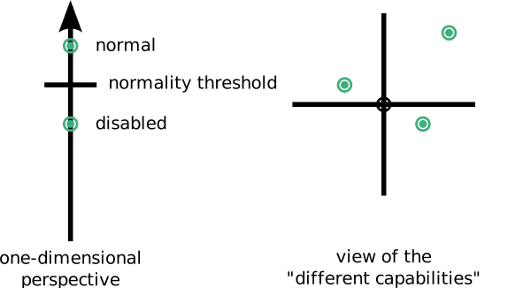

---
list-of-figures:
  label: Abbildung
  title: Abbildungsverzeichnis
list-of-tables:
  label: Tabelle
  title: Tabellenverzeichnis
cite:
  title: Quellenverzeichnis
footnotes:
  title: Fußnoten
abbreviations:
  title: Abkürzungsverzeichnis
---

<!-- TODO: review -->

<!-- prettier-ignore -->
*[USA]: United States of America
*[WHO]: World Health Organization

<!-- *[CERTEC]: Center of Rehabilitation Engineering Research -->

# Definitionen und Wortwahl

## Behinderung: Definition

Das Lexikon (der Große Brockhaus [@brockhaus:1994]) definiert wie folgt:

> „Behinderte“ sind Menschen in allen Altersgruppen, die durch einen angeborenen oder erworbenen gesundheitlichen Schaden in der Ausübung der im entsprechenden Lebensalter üblichen Funktionen beeinträchtigt sind [@brockhaus:1994].

Die substantivierte Form „Behinderte“ wird allgemein als diskriminierend abgelehnt und sollte generell durch Ausdrücke wie „behinderte Menschen“, „Personen mit Behinderung“, „behinderte Anwender“ etc. ersetzt werden.
Im hier angeführten Text handelt es sich jedoch um ein wörtliches Zitat aus dem Lexikon bzw. aus WHO-Texten, die nicht verändert wurden.

## Behinderung: Sichtweise und Sprachgebrauch

<!-- FIXME: „vorangehendes Kapitel“ -->
<!-- FIXZW: gelöscht „vorangehendes Kapitel“ -->

Früher wurden behinderte Menschen ausschließlich gemäß einer Mangeldefinition betrachtet und eingestuft.
Die Gesellschaft definiert eine bestimmte „Normalität“ und legt damit auf einer eindimensionalen Skala eine Latte fest, unterhalb von der eine Person als behindert gilt.

<!-- FIXME: Missing dot? -->

> Wir widmeten (...) den Behinderungen unserer Patienten viel zu viel Aufmerksamkeit und beachteten viel zu wenig, was intakt oder erhalten geblieben war.
> Um einen anderen Ausdruck zu gebrauchen: Wir waren zu sehr auf „Defektologie“ fixiert ...  
> _Oliver Sacks_ [@sacks:1998]

Insbesondere in den USA und den skandinavischen Ländern hat man erkannt, dass es sich dabei um eine verkürzte Sicht handelt und dass bereits das verwendete Vokabular dazu angetan ist, den Blick ausschließlich auf Mängel und nicht auf den Menschen mit seinen vielseitigen Fähigkeiten und Begabungen zu lenken.

So wird die substantivierte Form „Behinderte“ allgemein abgelehnt und soll z. B. durch Bezeichnungen „behinderte Menschen“ oder noch besser „Menschen mit Behinderungen“ ersetzt werden.
Dabei soll nicht die Tatsache einer Behinderung geleugnet oder beschönigt werden.
Eine solche Wortwahl soll und kann aber helfen, das strenge Denken in Kategorien (Schubladisieren) zu durchbrechen und den Blick auf den ganzen Menschen zu lenken.

Bodil Jönsson (Certec, Universität Lund, Schweden) rät aus diesem Grund daher dringend vom Denken in eindimensionalen Skalen ab.
Sie spricht daher bewusst nicht von _„disabled”_ oder _„mentally retarded persons”_ sondern immer von _„differently abled persons”_ [@jönsson:1996] (<<fig:sichtweise-behinderung>>).

Diese Sichtweise erscheint aus zwei Gründen vorteilhaft zu sein.
Erstens trägt sie dazu bei, Vorurteilen entgegenzuwirken und somit gesellschaftliche Barrieren für die Integration behinderter Menschen abzubauen.
Zweitens – und das ist für die Rehabilitationstechnik von entscheidender Bedeutung – lenkt sie den Blick verstärkt auf die einer Person trotz einer Behinderung verbliebenen Stärken und Fähigkeiten.
Bei der Schaffung von technischen Hilfen für behinderte Menschen muss sich die Rehabilitationstechnik aber genau diese Fähigkeiten und Stärken zunutze machen, um einen Beitrag zur Kompensation von Schwächen und Mängeln leisten zu können.
Techniker und Technikerinnen sind daher gut beraten, den Blick nicht auf die Mängel, sondern auf die Fähigkeiten einer behinderten Person zu richten, um so Ansatzpunkte für kreative Lösungen finden zu können.

<!-- FIXME: Missing dot? -->

> Unsere Tests, unsere Ansätze und „Bewertungen“ sind geradezu unzulänglich (...) sie zeigen uns nur die Mängel (...) nicht die Fähigkeiten; sie führen uns Puzzles und Schemata vor, während es doch darauf ankommt, Musik, Geschichten und Spiele zu begreifen und zu erkennen, wie ein Mensch sich spontan auf seine eigene, natürliche Weise beträgt.  
> _Oliver Sacks_ [@sacks:1998]

!!!include(general/attribution.md)!!!
