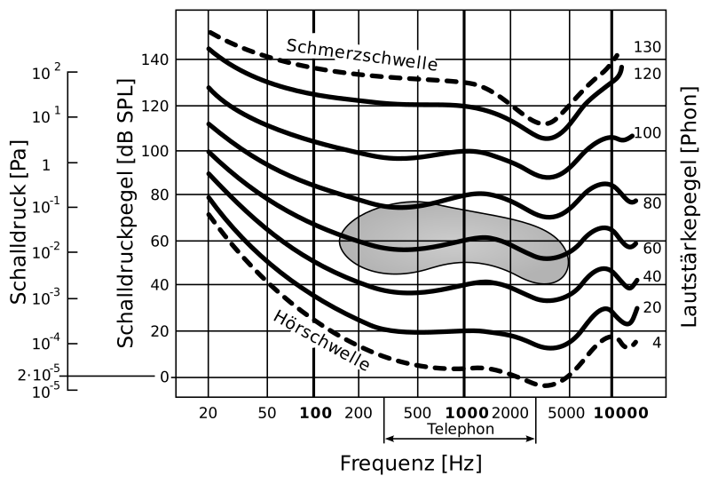
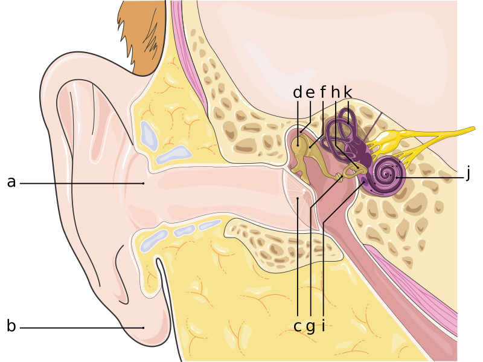
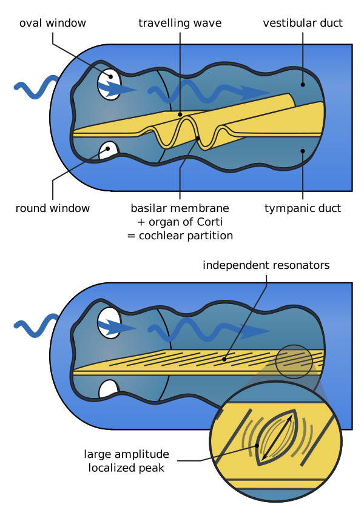
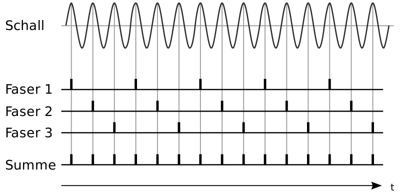
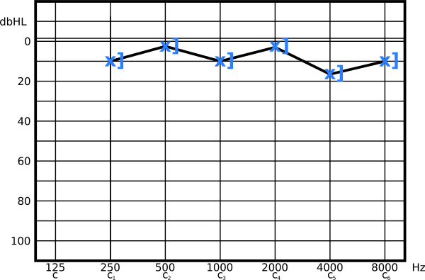

---
list-of-figures:
  label: Figure
  title: List of Figures
list-of-tables:
  label: Table
  title: List of Tables
cite:
  title: List of Sources
footnotes:
  title: Footnotes
abbreviations:
  title: List of Abbreviations
---

<!-- prettier-ignore -->
*[AC]: Air conduction
*[BC]: Bone conduction
*[CNS]: Central Nervous System
*[IHC]: Inner hair cells
*[OHC]: Outer hair cells
*[SPL]: Sound Pressure Level

# Ear and Auditory Perception

## Definitions

The ear is used to perceive sound waves, which are density vibrations of an elastic medium.
For the ear, these are usually pressure fluctuations of the surrounding air.
The physical description of sound is called acoustics, while the anatomical and physiological processes of sound perception are called auditory.

A **tone** is defined as a sinusoidal oscillation with _a certain_ frequency.
The superposition of finitely many tones and their overtones is called **sound**.
A **noise** consists of the superposition of an infinite number of tones.
The minimum sound pressure required to perceive a tone is called the hearing threshold.

## Measurement Parameters

Sound pressure is measured in pascals ($1\sf{Pa}=1\sf{N/m^2}$).
Because of the large numbers otherwise required in acoustics, it is common to work with the _Sound Pressure Level_ (SPL) $L$, a logarithmic measure given in decibels that indicates the ratio to the reference sound pressure $p_0$:

$$
L=20\log{\frac{P_{x}}{P_0}\sf{[db]}}
$$

Where $p_0$ is the arbitrary reference sound pressure: $p_0=2\cdot10^{-5}\sf{N/m^2}$.

Thus, $20\;\sf{dB}$ means a tenfold increase of the sound pressure.
A doubling of the sound pressure corresponds to an increase of $6\;\sf{dB}$.
If a person's hearing loss is $80\;\sf{dB}$ (which is the midpoint of that range judged to be profound hearing loss), then $10\:000$ times the sound pressure is required relative to a person with normal hearing.

The measure of the (subjective) loudness of a sound is the phon.
The loudness is numerically equal to the sound pressure level (in dB) for an equally loud perceived $1\:000\;\sf{Hz}$ sound (<<fig:dynamic-range-ear>>).
The isophone is the set of all equally loud perceived tones.

::: figcaption

The curves shown (isophones) indicate equally loud perceived volume in phon; shaded: Main speech range [@betz:1991, @schmidt:1997].
The frequency range given for telephone refers to the bandwidths of analog telephone systems [^12].

:::

[^12]: Analog telephone systems are specified with a bandwidth of about $3.1\;\sf{kHz}$ ($300$ to $3\:400\;\sf{Hz}$). Digital systems (ISDN) can achieve bandwidths of typically $7\;\sf{kHz}$.

Sound impedance is the characteristic impedance (product of density and sound velocity) of a medium [@pschyrembel:1989].

<!-- FIXME: Querverweis -->
<!-- FIXME: Einheiten? -->

For the evaluation of hearing performance or hearing loss in audiometry (see Chapter [Determination of Hearing Ability - Audiometry](#determination-of-hearing-ability-audiometry)), a logarithmic measure (dB) is used whose zero point at the frequency under consideration is the “normal hearing threshold” (audiometric zero point).
Hearing losses are expressed in dB HL (suffix or HL for _Hearing Loss_ or _Hearing Level_) and indicate by how many dB the sound pressure must be raised above the normal hearing threshold in order for a hearing-impaired person to perceive a sound at a given frequency.

To evaluate the perception of acoustic signals in the presence of noise, another ratio designated dB SL (suffix SL for _Sensation Level_) is used.
The reference threshold (i.e. $0\;\sf{dB}$ SL) is placed for a particular listening situation to be evaluated where the subject can hear the sound event (the signal) at $50\%$ of the measurements made from the background noise (hiss).
The sound pressure level, given in dB SL, therefore indicates by how much a signal is above this reference threshold.
In other words, it indicates the signal-to-noise ratio [@hellbrück:1993].

## Ear Anatomy

1. Outer ear  
   The outer ear – from the pinna to the eardrum (tympanic membrane) – represents a funnel about $3$ to $3.5\;\sf{cm}$ long that conducts sound waves from the environment to the eardrum.
   It is important that the air on both sides of the eardrum has the same temperature (body temperature), otherwise the different Brownian molecular motion would already be disturbingly perceptible due to the high sensitivity of the ear.

   The external auditory canal has an amplifying effect and exhibits an amplification of $20\;\sf{dB}$ at the resonant frequency (about $2\:500\;\sf{Hz}$).
   Thus, this gain is in that range that is important for speech understanding (main speech range, see <<fig:dynamic-range-ear>>).
   Because the external auditory canal in infants is only a few millimeters long, the resonance shifts significantly to higher frequencies, which results in infants perceiving high frequencies more preferentially.

2. Middle ear  
   Sound is transmitted in the middle ear (tympanic cavity) – between the tympanic membrane and the oval window – by the three articulating ossicles: Mallet (_Malleus_), Anvil (_Incus_), and Stirrup (_Stapes_).
   The diameter of the tympanic cavity (from the tympanic membrane to the inner wall) is only about $5\;\sf{mm}$.
   The thickness of the tympanic membrane is $0.1\;\sf{mm}$ (<<fig:cutaway-through-ear>>).

   

   ::: figcaption

   1. Pinna;
   2. External auditory canal;
   3. Eardrum (tympanic membrane);
   4. Mallet;
   5. Tympanic cavity;
   6. Anvil;
   7. Stirrup;
   8. Stirrup plate in oval window;
   9. Round window;
   10. Cochlea;
   11. Semicircular ducts of the vestibular apparatus (organ of balance).s
       {.lower-alpha}

   :::

   The deflections of the tympanic membrane (at the hearing threshold smaller than $10^{-10}\;\sf{m}$, which is $1\sf{\mathring{A}}$, $0.1\;\sf{nm}$ or about the diameter of a hydrogen atom) are transmitted in complicated (frequency-dependent) movements via the three ossicles to the oval window.
   On the one hand, the movement amplitude is reduced by the leverage effect of the ossicles (approximately by a factor of $0.7$) and the force available at the oval window is increased accordingly.
   On the other hand, the areas of the tympanic membrane and oval window behave approximately as $20:1$, resulting in a significant increase in pressure ($\sf{pressure}=\sf{force/area}$).
   Accurate measurements are exceedingly difficult, but the literature suggests a total pressure gain of a factor of $35$.
   Theoretically, however, taking all factors into account, the value can be much higher.

   This pressure transformation is necessary, because without it the liquid-filled inner ear could be excited only extremely badly by vibrating air.
   Specifically, $98\%$ of the sound energy would be lost by reflection and only $2\%$ would be transmitted to the inner ear.
   Impedance matching by the middle ear achieves that on average $60\%$ of sound energy can be transmitted.

   <!-- FIXME: Querverweis -->

   The ossicles also cause the sound energy to be transmitted not to the entire inner ear, but only to the oval window.
   The round window (the second connection point between the middle ear and the inner ear) can, therefore, oscillate in antiphase, which is of great importance for the function of the cochlea (see chapter [Physiology of the Ear](#physiology-of-the-ear) point (a)).

   Finally, the middle ear also has a certain regulatory or protective function.
   The tympanic membrane and the stapes are connected with muscles (_musculus tensor tympani_ at the tympanic membrane/hammer and _musculus stapedius_ at the stapes), which contract at a sound pressure level of $60$ – $80\;\sf{dB}$ above the hearing threshold and have a damping (attenuating) effect on the transmission of lower frequencies.

3. Inner ear  
   The inner ear contains two sensory organs that perform completely different functions, but anatomically form a complex: The cochlea (_cochlea_), the hearing organ proper, and the vestibular apparatus, which forms the organ of balance (<<fig:cutaway-through-ear>>).

   The cochlea (_cochlea_) is a spiral duct embedded in the cranial bone, in which the two-part membranous cochlear duct (_scala media_ or _ductus cochlearis_) is vibrationally attached.
   Thus the cochlea consists of three fluid-filled ducts.
   In the center the membranous cochlear duct, filled with endolymph[^13] and having a triangular cross-section, above it the vestibular duct (_scala vestibuli_) and below it the tympanic duct (scala tympani).
   The latter two passages are filled with perilymph[^13].
   Just before the end of the helix (_helicotrema_), the membranous ducts end, so that the two ducts merge there (<<fig:cochlea>> and <<fig:cross-cut-through-cochlea>>).

   [^13]: endolymph: high K+, low Na+ concentration; perilymph vice versa.

   , open [@servier-medical-art:2019, @betz:1991].")

   ::: figcaption

   1. Stirrup in the oval window;
   2. Beginning of vestibular duct;
   3. Skin-like spiral cochlear duct;
   4. Round window at the end of the tympanic duct;
   5. Helicotrema
      {.lower-alpha}

   :::

   

   ::: figcaption

   

   6. Vestibular duct;
   7. Skin-like cochlear duct;
   8. Tympanic duct
      {.upper-alpha}

   

   

   9. Reissner's membrane;
   10. Tectorial membrane;
   11. Basilar membrane;
   12. Organ of Corti;
   13. Outer hair cells;
   14. Inner hair cells
       {.lower-alpha}

   

   :::

## Physiology of the Ear

1. Mechanical processes in the cochlea.  
   After impedance conversion by the middle ear, the inner ear receives the sound signal via the vibrations of the stirrup (stapes) footplate in the oval window, which are transmitted to the fluid of the vestibular duct.
   Because this fluid is incompressible, when the oval window moves inward (pressure increases), the membranous duct (also called the cochlear partition) beneath it must move downward.
   This causes a pressure rise in the (underlying) tympanic duct, which subsequently leads to a deflection of the round window at the end of the tympanic duct.
   In the subsequent half-wave of the oscillation, the conditions are exactly reversed.

   This up-and-down movement of the cochlear partition results in a shearing motion between its individual components, and the displacement of the covering membrane (_membrana tectoria_; tectorial membrane) results in a bending of the sensory hairs of the hair cells of the organ of Corti (<<fig:cross-cut-through-cochlea>>).

   The hair cells are arranged along the cochlea in two parallel groups.
   The approximately $8\:000$ inner hair cells (IHC = _inner hair cells_) are arranged in _one_ row, and the approximately $14\:000$ outer hair cells (OHC = _outer hair cells_) form three to five rows.
   Each of these hair cells carries $60$ – $100$ sensory hairs (_stereocilia_).
   Despite their much larger number, only $5$ to $10\%$ of the auditory nerve fibers terminate at the OHC (high convergence).
   The much larger number of $30\:000$ to $40\:000$ nerve fibers innervate the IHC.
   Not all auditory nerve fibers are afferent (i.e., run from the hair cells to the CNS).
   About $1\:800$ are efferent and are associated with the active processes in the cochlea described in the next section [@silbernagl:1991, @dudel:1996, @hellbrück:1993, @betz:1991, @zenner:1994:a].
   The local density of neurons is $1\:150$ ganglion cells/mm^2^ at the beginning of the cochlea (at the oval window) and decreases toward the helicotrema [@lindsay:1981].

2. Formation of the travelling wave and cochlear amplifier.  
   So far, the mechanics of the inner ear have been described only in principle.
   More precisely, the vibration of the stapes footplate initially triggers a movement of the cochlear partition only at the beginning of the cochlea, which in the further course of time propagates as a travelling wave along the entire cochlea.
   We speak here of the passive travelling wave.
   It has the special property that it does not propagate along the helix with the same or only decreasing amplitude, but that, depending on its frequency, it increases to a maximum at a certain point of resonance in the helix and then decays rather abruptly (<<fig:wanderwelle-cochlaere-trennwand>>).

   

   The place where the travelling wave reaches its maximum depends on the frequency of the excitation and is of decisive (but not sufficient) importance for the frequency selectivity of the ear.
   High frequencies produce the maximum near the base of the snail (at the stapes or at the oval and round window), low frequencies at the tip of the snail (_helicotrema_).
   Frequency mixtures (sounds, noises) produce several maxima along the basilar membrane.
   This approach is the basis of the location theory (tonotopic theory) (<<fig:location-travelling-wave>>).

   

   The formation of a vibration maximum by the passive travelling wave causes a first amplification effect in addition to the frequency selection.
   Originally, the ear was considered to be a purely passive sound sensor.
   Only recently have studies shown that the outer hair cells of the organ of Corti can generate micromechanical vibrations of up to $20\;\sf{kHz}$.
   Frequency- and site-selective excitation of the outer hair cells amplifies and splits the passive travelling wave at a narrowly defined location by a factor of $1\:000$ [@zenner:1994:a] (<<fig:amplification-traveling-wave>>).
   Without this active amplification, excitation of the inner hair cells would occur only from $60\;\sf{dB}\,\sf{SPL}$ [@schmidt:1997].

   

3. Frequency selectivity of the ear  
   The formation of the passive and also the active travelling wave (place theory, tonotopy) is not completely sufficient to explain the enormous frequency selectivity of the ear.
   On the one hand, this assumption is reached from measurements at medium sound pressure levels, at which almost all fibers of the auditory nerve are active and not only those that are characteristic for the respective frequency.
   Nevertheless, the auditory system is frequency selective even in this case.
   On the other hand, with single-channel cochlear implants (the nerve endings in the cochlea are stimulated by an electrode at only one location), it is possible to evoke the sensation of different frequencies.
   If location theory alone were the explanation for frequency perception, then a separate electrode would have to be implanted at the relevant location for each pitch to be transmitted.

   Since a single fiber of the auditory nerve can directly follow a sound vibration only up to a frequency of about $800\;\sf{Hz}$, several nerve fibers must be involved in the coding of higher frequency sounds.
   In the so-called volley principle, several nerve fibers alternate in “firing” in such a way that the sum (superposition) of their individual discharges corresponds to the frequency to be transmitted.
   This leads to the so-called period theory (microphonic theory) of frequency selectivity.
   Individual nerve fibers are combined into groups and synchronized in such a way that the overall pattern of their neural activity is able to follow higher frequencies (<<fig:schematic-display-salvo-principle>>) [@troost:1998].

   

   {.lower-alpha}

## Determination of Hearing Ability - Audiometry

The procedure for determining hearing ability is called audiometry.
In addition to determining the degree of hearing loss and the frequencies affected, the purpose of audiometry is also to locate the place where the hearing loss occurs and to distinguish between conductive hearing loss and sensorineural hearing loss (perceptual hearing loss).

The most important procedure for testing hearing is sound threshold audiometry or the sound threshold audiogram, i.e. the measurement of the personal hearing threshold.
In a soundproof room, tones (pure sinusoidal oscillations) of different intensity and frequency are offered through headphones (so-called air conduction).
The person examined must indicate whether a presented tone could be perceived or not.

In addition to the presentation of the tones via headphones, a coupling via structure-borne sound (bone conduction) is also performed in a separate series of experiments by means of a vibrator attached to the skull bone behind the ear.
There is also a defined “hearing threshold” for bone conduction, from which any hearing losses can be measured in dB HL.

The results of the measurements are plotted on a (standardized) graph, the audiogram.
The symbols shown in <<tab:audiogram-used-symbols>> are usually used:

<table>
  <thead>
    <tr>
      <th></th>
      <th>Left</th>
      <th>Right</th>
    </tr>
  </thead>
  <tbody>
    <tr>
      <th scope="row">Mark color</th>
      <td>blue</td>
      <td>red</td>
    </tr>
    <tr>
      <th scope="row">Air conduction (<abbr title="Air conduction">AC</abbr>)</th>
      <td style="color: blue;">x</td>
      <td style="color: red;">o</td>
    </tr>
    <tr>
      <th scope="row">Bone conduction (<abbr title="Bone conduction">BC</abbr>)</th>
      <td style="color: blue;">]</td>
      <td style="color: red;">[</td>
    </tr>
  </tbody>
</table>

.audiogram-used-symbols#Symbols used in the audiogram.

For example, for a person with approximately normal hearing, the result is a tone threshold audiogram for the left ear as shown in <<fig:tonschwellenaudiogramm-normal>>.
The curves for air conduction and bone conduction are superimposed or nearly so.
The deviations from the $0\;\sf{dB}\,\sf{HL}$ line in the example are at most $15\;\sf{dB}\,\sf{HL}$.

!!!include(general/attribution.en.md)!!!
