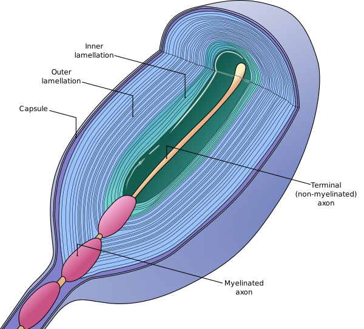

---
list-of-figures:
  label: Figure
  title: List of Figures
list-of-tables:
  label: Table
  title: List of Tables
cite:
  title: List of Sources
footnotes:
  title: Footnotes
abbreviations:
  title: List of Abbreviations
---

<!-- prettier-ignore -->
*[PC]: Pacini corpuscles
*[RA]: rapidly adapting
*[SA]: slowly adapting

# Skin and Tactile Perception

## Nature and Performance of the Sense of Touch

When we talk about human senses, we think first and foremost of the eye and the ear; we also think of taste and smell as significant.
The sense of touch, on the other hand, usually ranks last in our conception of the senses.
With the extraordinary importance that we give to the eye and the ear for perception, we must not forget that each sense organ also has clear weaknesses in addition to its strengths.

The eye is excellently suited to convey spatial ideas, while it is only able to perform modestly with regard to the perception of rapidly changing processes in time (the flicker fusion frequency is – depending on the luminance – at a maximum of $80\;\sf{Hz}$ [@guski:1996]).

The ear performs much higher in the time domain.
The highest perceptible frequency is about $16\;\sf{kHz}$ and thus exceeds the eye by a factor of $200$.
In the spatial dimension, the ear can perceive the motion of a sound source by $1\degree$ (best case) [@harling:1996].
The absolute localization of a sound source, especially if it is not in a restricted area in front of the observer, is still much less precise.
The eye, on the other hand, has a resolving power of $0.5$ to $1$ arcminute in the central area (fovea).
So here the factor is about $60$ to $120$.

The sense of touch occupies a middle position.
It is superior to the eye in temporal and to the ear in spatial terms.
As the largest sense organ distributed over the entire body surface, it occupies an intermediate and a mediating position [@geldard:1986].
Together with the sense of smell and the sense of taste, the sense of touch belongs to the near senses, since perception only occurs in direct contact.
The importance of the sense of touch for the whole multimodal human perception can perhaps be judged by the fact that we use the word “grasp” when we mean “understand”.

## Sensations of the Skin

In the human skin there are sensory cells (receptors) of most different construction.
The sensations mediated by these sensory cells can be divided into three areas [@betz:1991]:

- Mechanical sensation – touch, pressure, tickle, vibration.
- Thermal sensation – heat and cold.
- Damage sensation, so-called nociceptive sensation – pain, itching.

A strict assignment of different stimulus perceptions to certain types of receptors is not possible.
For some receptor types there is only one adequate stimulus, while others respond to several different stimuli.
Tactile perception, in particular the recognition of a surface texture, represents a multimodal task in which the information from a wide variety of receptors is utilized.
In addition to tactile stimuli proper, thermal stimuli (temperature, thermal conductivity, and thermal capacity) and, when present, visual and auditory stimuli associated with touch are combined to form an overall picture [@lederman:1982].

For rehabilitation technology, mechanical sensation alone is important.
Thermal sensations exhibit great inertia, so they cannot be used for targeted information transfer.
Understandably, one will want to avoid damage sensations as much as possible.
Direct electrical stimulation is possible, but requires careful regulation of the stimulus to elicit a constant, pleasant sensation.

## Pressure Sensitivity

<!-- FIXME: Footnote at Reference -->

The sense of touch takes its origin in the receptor cells (mechanoreceptors) of the skin, which react to mechanical stimuli, i.e. to deformation of the skin surface.
Apart from free nerve endings, four different receptors are distinguished, two of which react to static stimuli (absolute deformation of the skin surface) and two to dynamic stimuli (change in deformation).
In this sense, we speak of slow adapting (_slowly adapting_ = SA) and fast adapting (_rapidly adapting_ = RA) cells [@lederman:1982, @betz:1991, @dudel:1996[^18]].

[^18]: The nature of the adequate stimuli in each case is not uniformly stated in the literature. The medical literature [@betz:1991, @dudel:1996] speaks not only of the response to changes in pressure ($\sf{dp/dt}$ – i.e., a velocity) in Vater-Pacini bodies but also of the response to a change in velocity ($\sf{dp/dt^2}$ – i.e., an acceleration), but without explaining the process in more detail.

_Free nerve endings_ lie in stratified epithelia of the skin and extend into the keratinized layers.
They respond to pressure but also to thermal stimuli.
When injured, they cause pain (nociception).
The hair follicles may also be surrounded by free nerve endings.

_Merkel cells_ (designation SA I for “_slowly adapting type 1_”) occur in hairless skin and consist of a free nerve ending that is thickened at the end in a disc-like manner.
They lie close to the skin surface and respond with good resolution to the amount of (primarily) vertical deformation of the skin.

_Ruffini corpuscles_ (designation SA II for “_slowly adapting type 2_”) are also nerve endings that are disc-shaped and thickened at the end.
They respond to pressure (according to some sources, even to changes in pressure) and are particularly sensitive to tangential deformations of the skin [@lederman:1982].

_Meissner corpuscles_ (term RA for “_rapid adapting_”[^19] ) consist of oval, approximately $0.1\;\sf{mm}$ long, disc-shaped cells embedded in a connective tissue sheath in the papillae of the dermis.
With the nerve endings intercalated between the discs, they form a receptor that responds only to changes in pressure.
Because their density is particularly high at the fingertips (up to $200\sf{/cm^2}$) and they are also close to the surface of the skin, they are associated primarily with the sense of touch and are therefore also called “Meissner's tactile corpuscles.”

[^19]: also sometimes referred to in the literature as QA for “rapidly adapting.”

The _Pacinian corpuscle_ (PC = _Pacini corpuscles_; also called lamellar corpuscles), located deeper in the subcutaneous connective tissue, respond to changes in pressure.
They can grow up to $4\;\sf{mm}$ long and $1\;\sf{mm}$ thick and have a layered structure similar to an onion (<<fig:section-through-a-pacinian-corpuscle>>).
Some literature references attribute response to accelerations to them.

The location of mechanoreceptors in the human fingertip is shown in <<fig:mechanoreceptors>>.

::: figcaption

1. Free nerve endings
2. Merkel cells
3. Ruffini corpuscles
4. Meissner corpuscles
5. Pacinian corpuscle
   {.lower-alpha}

:::

Like all receptors, mechanoreceptors exhibit adaptation (i.e., they respond only to a change in stimulus) in response to continuous stimulation.
The _Meissner corpuscles_ (RA) respond to a change in pressure, so they are _velocity sensors_ and are dominant at stimulus frequencies between $5\;\sf{Hz}$ to $40\;\sf{Hz}$.
In contrast, the _Pacinian corpuscles_ (PCs) respond only to vibrations in the range of $40\;\sf{Hz}$ to $400\;\sf{Hz}$ [@lederman:1982, @foulke:1986, @betz:1991, @fricke:1994, @dudel:1996].
A summary overview is given by (<<tab:types-mechanoreceptors>>).

<!-- FIXME: Fragezeichen in Tabelle -->

| Type                           | Adequate stimulus                                                                     | Feature                                                                                    |
| ------------------------------ | ------------------------------------------------------------------------------------- | ------------------------------------------------------------------------------------------ |
| SA I (Merkel cells)        | pressure, static vertical deformation                                                 | close to skin surface, small receptive fields, high spatial resolution                     |
| SA II (Ruffini corpuscles) | Pressure (and velocity ?), static (and dynamic ?) vertical and tangential deformation | In deeper skin layers, response to friction, large receptive fields                        |
| RA (Meissner corpuscles)   | velocity, vibrations from $5\;\sf{Hz}$ to $40\;\sf{Hz}$                               | Near skin surface, high density, small receptive fields, good resolution                   |
| PC (Pacinian corpuscle)    | velocity (acceleration ?), vibrations from $40\;\sf{Hz}$ to $400\;\sf{Hz}$            | In deeper skin layers, very large receptive fields, deflections of a few μm are sufficient |

.types-mechanoreceptors#Types of mechanoreceptors of the skin and adequate stimuli.

These relationships are important if the sense of touch is to be used for (alternative) information transfer.
For example, if one wants to convey vibrations with lowest amplitude, then the frequency of the stimulus must be above $40\;\sf{Hz}$.
If a particularly good spatial resolution is to be achieved, then primarily vertically acting and slow stimuli should be used.

However, these general statements should be used with caution.
For example, experiments using matrix-shaped arrays of vibrating pins have shown that it is easier to detect the direction of motion of a linear object represented by these pins when the pins vibrate at $320\;\sf{Hz}$ than when the experiment is performed at $40\;\sf{Hz}$ [@summers:1999:b].
The quality of tactile perception apparently depends on many more parameters than could be predicted from the properties of the receptor cells.
Therefore, in the development of tactile display elements, existing school wisdom should be confidently questioned.

What is certain, however, is that the impression conveyed by the fast-adapting receptors (RA and PC) makes a significant contribution to the overall tactile perception.
This can be easily verified by trying to distinguish different types of textiles by vertical, stationary touch with one finger alone.
Only when we glide our finger over the surface do we become aware of texture differences.
This is due to the fact that tangential motion produces an abundance of dynamic stimuli (vibrations of a wide variety of frequencies) by which the rapidly adapting receptors are addressed [@lederman:1982].
The optimal speed for the discrimination of surface textures is given in the literature as $15\;\sf{cm/s}$, which corresponds amazingly well with the speed at which trained Braille readers stroke over a line of text.

The performance of the sense of touch depends on the temperature of the skin.
Cold skin is less elastic and, therefore, cannot follow dynamic mechanical deformations as quickly.
Also, the performance of the receptors decreases with temperature, so that surfaces appear smoother at cold than at normal temperature (e.g., $32\degree\sf{C}$ for the typical skin temperature of the hand).

In addition to the mechanoreceptors in the skin described here, the body has numerous other pressure-sensitive sensors that regulate blood pressure, for example, or are responsible for controlling processes in the digestive tract.
Their signals do not penetrate into the consciousness or only when the receptors are particularly strongly irritated.

## Spatial Discrimination

The spatial discrimination of two adjacent tactile stimuli, so that they can be perceived as separate from each other, is relatively low and also strongly dependent on the respective skin area.
For two-point discrimination at different body sites, the following values can be found in the literature (<<tab:two-point-discrimination-tactile-stimuli>>):

| Body region    | Minimum distance [mm\] for two-point discrimination |
| -------------- | --------------------------------------------------- |
| Thigh          | $68$                                                |
| Back           | $54$                                                |
| Forehead       | $22$                                                |
| Back of finger | $16$                                                |
| Thumb          | $9$                                                 |
| Tip of nose    | $7$                                                 |
| Lips           | $4$                                                 |
| Fingertip      | $2$                                                 |
| Tip of tongue  | $1$                                                 |

.two-point-discrimination-tactile-stimuli#Two-point discrimination of tactile stimuli in different body regions [@betz:1991].

<!-- FIXME: Querverweis -->

Thus, the tongue enables the finest discrimination, followed by the fingertips.
Especially the large skin areas, which would lend themselves to the tactile perception of images in terms of their surface area, perform extremely poorly in spatial stimulus discrimination.
In addition, it must be distinguished whether both tactile stimuli are presented simultaneously (simultaneous) or successively (successive).
Since the skin also knows so-called receptive fields (for more details see [The Receptive Fields](./chapter7.html#the-receptive-fields)), which are surrounded by fields with lateral inhibition, discrimination is lower for simultaneous two-point stimuli (the second stimulus falls into the inhibitory area) than for successive presentation.

Thus, for static tactile perceptibility at the fingertip, tactile information must have a spatial resolution of more than $2.5\;\sf{mm}$ for stimuli to be distinguished from each other.
For the presentation of a line formed by dots, which should be perceived as reasonably continuous, the individual dots must not exceed a distance of $1\;\sf{mm}$ (this specification applies to the moving finger).

!!!include(general/attribution.en.md)!!!
