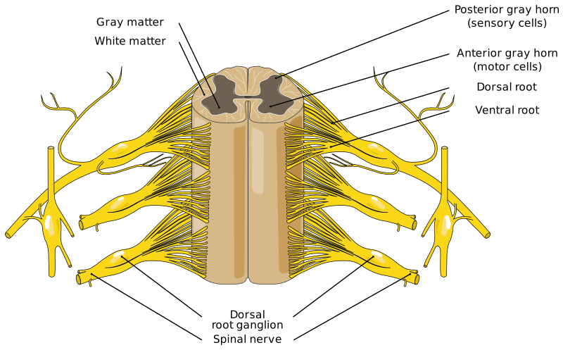

---
list-of-figures:
  label: Figure
  title: List of Figures
list-of-tables:
  label: Table
  title: List of Tables
cite:
  title: List of Sources
footnotes:
  title: Footnotes
abbreviations:
  title: List of Abbreviations
---

<!-- prettier-ignore -->
*[CNS]: Central Nervous System

# Spinal Cord, Musculoskeletal System and Musculature

<!-- FIXME: Querverweis -->

In this chapter, together with the discussion of musculature and musculoskeletal system, the spinal cord is also discussed because all motor commands by which peripheral muscle can be stimulated are addressed via this connection from the central nervous system (CNS).
It is important to distinguish which muscles are supplied via a direct connection from the brain (cranial nerves, see [The Cranial Nerves](./chapter6.html#the-cranial-nerves)) and which run via the spinal cord and can therefore be affected by spinal injuries.

## The Spinal Cord

The spinal cord (_Medulla spinalis_) is that part of the central nervous system which fills the vertebral canal of the spine down to the $2^{\sf{nd}}$ lumbar vertebra (<<fig:vertebral-column>>).
Its diameter averages $1\;\sf{cm}$, and its length in adult humans ranges from $40$ to $50\;\sf{cm}$, depending on body size.

The spinal cord is composed of white matter on the outside.
The core is a column of gray matter that has a butterfly-shaped cross-section.
The four projections are called “gray horns” ($2$ anterior gray horns and $2$ posterior gray horns) (<<fig:spinal-cord>>).

From the spinal cord branch $31$ pairs of nerves (_spinal nerves_).
They exit the spinal canal in paired strands below each vertebral body through the intervertebral holes.
Each of these nerve cords is in turn composed of two groups of root filaments, one arising from the anterior gray horn and the other from the posterior gray horn of the spinal cord (<<fig:vertebral-column>>).

The anterior (ventral) roots are motor (_efferent_, thus leading from the CNS to the musculature).
Their cells of origin are located in the gray matter of the spinal cord.
The posterior (dorsal) root filaments are sensory (_afferent_ – thus lead from receptors to the CNS).
However, this separation into motor and sensory branches does not apply to the autonomic nervous system.

The totality of motor nerve tracts descending from the CNS, which originate in the cerebral cortex (primarily from the anterior central turn) and lead to motor nuclei of the cranial nerves or the anterior gray horn cells of the spinal cord, is called the pyramidal tract (_fasciculus pyramidalis_).
Before entering the spinal cord, about $90\%$ of the nerve fibers of the pyramidal tract cross over to the other (_contralateral_) side of the body at the _pyramidal junction_.
In this connection it should be mentioned that the supply of the muscles of the forehead, the eye muscles, and also the muscles of the eyelids is from both sides of the cerebral cortex, so that in the case of hemifacial deficits, for example, the blinking of the eyelids is equally preserved on both sides of the body.
Below the eye area, innervation occurs exclusively from the opposite side, so that lesions in the brain lead to a failure of muscle function on the respective other side of the body.
A defect confined to the pyramidal system causes flaccid paralysis.

All other motor pathways are grouped under the term extrapyramidal motor pathways.
Symptoms that may occur with damage to the extrapyramidal system include: Disruption of automatic movement and regulation of muscle tone (tremor, spasm, rigor, etc.).

The segments of the spinal cord (i.e., sections belonging to a pair of spinal nerves) are given their names according to the vertebra _under_ which they emerge.
Naming in the cervical region is an exception: The $1.$ cervical nerve is that which exits between the occiput and the atlas (uppermost vertebral body, see <<fig:vertebral-column>>).
The other cervical nerves lie _above_ the respective cervical vertebrae.
Between $\sf{C}7$ and $\sf{Th}1$ lies the $8.$ cervical nerve.
Thus, $8$ cervical, $12$ thoracic, $5$ lumbar, $5$ sacral, and $1$-$2$ coccygeal segments result [@mörike:1981].

## Musculature

<!-- FIXME: check neuromuscular junction vs. motor end plate -->

Muscle are bundles of contractile protein filaments.
The protein substances involved in muscle contraction are actin and myosin.
They form filaments (fibers, thread-like structures) that can move against each other.
Muscle excitation occurs via the so-called neuromuscular junction (terminal branches of the axon located in grooves of the muscle fibers) of the motoneurons (<<fig:neuromuscular-junction>>).
A release of acetylcholine at the neuromuscular junction causes local depolarization, resulting in the release of Ca^++^ ions.

::: figcaption

- A: Axon of the nerve fiber
- M: Myelin sheath
- F: Muscle fiber

:::

Of the three types of muscle tissue occurring in the human organism, we are primarily interested here in the striated musculature (also called skeletal musculature).
The smooth musculature occurring in the viscera and the cardiac musculature are not considered.

The striated musculature allows rapid voluntary movements that are not bound to any rhythm.
The fibers of striated muscle do not consist of single cells, but of fibers up to $12\;\sf{cm}$ long, which may contain several hundred nuclei.
The diameter of a single muscle fiber is only $10$ to $200\;\sf{\mu~m}$.

To execute voluntary movements, the striated muscles are supplied with the necessary impulses by two neurons connected in series, the so-called motoneurons.
The first motoneuron is located in the motor cortex, which is responsible for planning a movement.
The second motoneuron is located (predominantly) in the anterior gray horns of the spinal cord (anterior gray horn cells, see <<fig:spinal-cord>>), from where skeletal muscles are innervated.
A portion of the _motoneurons_, from which, among other things, the speech, chewing, and swallowing muscles are innervated, originates in the brainstem (bulb)[^20].
Damage to the brainstem can lead to the demise of the _first motoneuron_, and damage to the spinal cord can lead to the demise of the _second motoneuron_.
At both levels, damage can lead to paralysis and muscle wasting.
If the first motoneuron is involved, spasticity is added [@deutsche-gesellschaft-muskelkranke:1998].

[^20]: By brain stem (_brain stem_, truncus cerebri) or brain stem is meant the entire cerebrum without the cerebral mantle.

By _tonus_ is meant the degree of tension of a muscle.
A certain muscle tonus (resting tonus) is always present even in relaxed muscle, since spontaneous contraction of individual muscle fibers always occurs.

The contraction of a single muscle fiber follows the “all-or-nothing principle” already known from nerve cells.
However, if we consider a whole group of muscle fibers in their entirety, this “all-or-nothing principle” applies only to a limited extent.
When the amplitude of the excitation is low, the stimulus triggers a contraction only in nearby muscle fibers, whereas higher amplitudes cause the excitation to reach even more distant muscle fibers within the group supplied by a nerve.
This differential response of muscle fibers is called _recruitment_.

By a succession of periodic stimulations, depending on the level of excitation frequency, there is an incomplete or complete permanent shortening of the muscle as a result of a sum of individual contractions, which is called _tetanus_[^21].
The excitation frequency required to obtain complete permanent shortening of the muscle is called the fusion frequency and depends on the speed of the particular muscle.
Thus, in the particularly fast eye muscles, it is up to $350\;\sf{Hz}$ [@mörike:1981].

[^21]: The term tetanus (Greek: _tetanos_ = tension) is used for muscle tension as well as for the tetanus that accompanies muscle tension.

The extremely fine gradation of muscle contractions and thus of the force generated and the movement executed, as is required, for example, for the movement of the fingers or the eyes, thus comes about through two mechanisms: from the extent of the recruitment of muscle fibers and the level of the excitation frequency.
As with nerves, the action potentials associated with the excitation of muscles can be measured by electromyography[^22] using skin electrodes.

[^22]:
    My- or Myo- as a part of speech denotes the association with muscles.
    Electromyography is thus the recording of electrical muscle activity.

Limit value of shortening of a muscle fiber (in vitro prepared) is $1:8$, but this does not occur in the living organism.
Here shortening occurs to $50\%$ of the length, which also corresponds to the optimal working range [@mörike:1981].
The force a muscle can apply depends essentially on its cross-section[^23].
As a rule of thumb, $80-100\;\sf{N/cm^2}$.

[^23]: For the well-known two-headed upper arm muscle (Musculus biceps), values between $450$ and $1200\;\sf{N}$ are given in the literature [@mörike:1981].

!!!include(general/attribution.en.md)!!!
