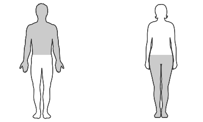

---
list-of-figures:
  label: Figure
  title: List of Figures
list-of-tables:
  label: Table
  title: List of Tables
cite:
  title: List of Sources
footnotes:
  title: Footnotes
abbreviations:
  title: List of Abbreviations
---

<!-- prettier-ignore -->
*[ALS]: Amyotrophic lateral sclerosis
*[CNS]: Central Nervous System
*[CP]: Cerebral palsy
*[CVA]: Cerebral vascular accident
*[MCD]: Minimal cerebral dysfunction
*[MCP]: Minimal cerebral palsy
*[MS]: Multiple sclerosis
*[TBI]: Traumatic brain injury

# Motor Disabilities

## Basics and Systematics

1. Classification according to the location  
   Motor disabilities can affect any region of the human body.
   In the context of rehabilitation technology, we are primarily interested in those disorders that affect the mobility of the extremities.
   Movements of the head and trunk, as well as movements of internal organs (e.g., heart, respiration) are not addressed here.

   The upper extremities, arms and hands, are primarily used for mechanical interaction with our environment, i.e. grasping and moving objects, operating switches and levers, guiding writing instruments, etc.
   We want to include all these activities under the term manipulation and therefore refer to this part of motor disabilities as manipulation disabilities.

   The lower extremities, legs and feet, are primarily used for locomotion, i.e., a person's mobility.
   We therefore group disabilities by which the movements of the lower extremities are impaired under the term mobility disabilities.

2. Motor paralysis  
   Paralysis is the reduction or loss of function of an organ or body part.
   In the neurological sense, it refers to a reduction in the motor or sensory functions of a nerve.

   Strictly speaking, plegia refers to a general paralysis.
   The term paresis is used for incomplete paralysis, while complete paralysis is called paralysis[^24].
   The designation of paralysis in terms of location and extent can be found in <<tab:classification-paralysis>>.

   [^24]: The designations are not uniformly chosen in the literature. On the one hand, the general term plegia is also used in connection with complete paralysis; on the other hand, the term paralysis is found instead of plegia.

   <!-- FIXME: figure referencing -->
   <table>
     <colgroup>
       <col>
       <colgroup span="3"></colgroup>
     </colgroup>
     <thead>
       <tr>
         <th rowspan="2" scope="rowgroup">Extent of paralysis</th>
         <th colspan="3">Location of paralysis</th>
       </tr>
       <tr>
         <th>All four limbs</th>
         <th>Two symmetrical limbs</th>
         <th>One half of the body</th>
       </tr>
       <tr>
         <th scope="row">General term</th>
         <th>Quadriplegia</th>
         <th>Paraplegia or diplegia</th>
         <th>Hemiplegia</th>
       </tr>
     </thead>
     <tbody>
       <tr>
         <th scope="row" rowspan="2">Incomplete</th>
         <td>
         <figure id="tetraparesis">
           
           <figcaption>Tetraparesis (engl. tetraparesis)</figcaption>
         </figure>
         </td>
         <td>
         <figure id="paraparesis">
           
           <figcaption>Paraparesis (engl: paraparesis)</figcaption>
         </figure>
         </td>
         <td>
         <figure id="hemiparesis">
           
           <figcaption>Hemiparesis (engl. hemiparesis)</figcaption>
         </figure>
         </td>
       </tr>
       <tr>
         <td></td>
         <td>
         <ul>
           <li>Paraparesis superior: arms</li>
           <li>Paraparesis inferior: legs</li>
         </ul>
         </td>
         <td></td>
       </tr>
       <tr>
         <th scope="row" rowspan="2">Complete</th>
         <td>
         <figure id="tetraparalyse">
           
           <figcaption>Tetraparalysis (also tetraplegia)</figcaption>
         </figure>
         </td>
         <td>
         <figure id="paraparalysis">
           
           <figcaption>Paraparalysis (also paraplegia)</figcaption>
         </figure>
         </td>
         <td>
         <figure id="hemiparalysis">
           
           <figcaption>Hemiparalysis (also Hemiplegia)</figcaption>
         </figure>
         </td>
       </tr>
       <tr>
         <td></td>
         <td>
         <ul>
           <li>Paraparalysis superior: arms</li>
           <li>Paraparalysis inferior: legs</li>
         </ul>
         </td>
         <td></td>
       </tr>
     </tbody>
   </table>

   .classification-paralysis#Classification of paralysis by location and extent.

3. disturbances of muscle tone and movement.  
   Disorders of movement are commonly called _dyskineses_.
   The following forms are distinguished:

   - _Spastic_ (spasmodic): central nervous dysfunction of the muscles with excessive muscle tone and involuntary muscle contractions (continuous or dependent on the person's overall state of arousal).
     Muscles are hard and cramped, with agonists and antagonists affected.
     Movements can be performed only with difficulty or do not succeed.
   - _Ataxic_ (Greek: without order): poor coordination of movements and poor balance.
     Problems with precision of movements and coordination.
     Muscle tone is low and accuracy of aim and direction is disturbed, especially toward the end of a movement.
     The interaction of agonist and antagonist is disturbed [@lexicon:1999].
   - _Athetotic_ (Greek: without fixed position): fluctuating muscle tone leads to additional, involuntary, aimless, worm-like and cramped movements.
     Muscle tone is increased during movement and decreased at rest.

   Mixed forms of spasticity and athetosis as well as spasticity and ataxia are common.
   What all forms have in common is that voluntary exertion aggravates the existing movement disorder.

   An increase in muscle tone which, in contrast to spasticity, leads to stiffening even during passive movements, is called _rigor_.

   {.lower-alpha}

## Missing and Malformed Limbs

1. Congenital dysmelia  
   The period between the fifth and the seventh week of pregnancy is crucial for the development of the extremities.
   Lack of oxygen or exposure to drugs (e.g., in thalidomide[^25]), among other factors, can lead to malformation of limbs, referred to by the collective term dysmelia.
   A subdivision and description of the most important dysmelias can be found in <<tab:most-important-types-dysmelia>> [@pschyrembel:1989].

   [^25]: Thalidomide embryopathy (thalidomide syndrome): dysmelia primarily in the upper extremities.

   <table>
     <thead>
       <tr>
         <td></td>
         <th>Description of the malformation</th>
       </tr>
     </thead>
     <tbody>
       <tr>
         <th scope="row">Amelia</th>
         <td>Complete absence of extremity; possible underdevelopment of shoulder and pelvis</td>
       </tr>
       <tr>
         <th scope="row">Phocomelia</th>
         <td>Hands and feet attach directly to the trunk; arms and legs completely absent</td>
       </tr>
       <tr>
         <th scope="row">Peromelia</th>
         <td>Missing development at distal end of extremity; absence of hand or foot; stump formation</td>
       </tr>
       <tr>
         <th scope="row">Ectromelia</th>
         <td>Underdevelopment of long bones of arms or legs; shortening and malalignment of extremity</td>
       </tr>
     </tbody>
   </table>

   .most-important-types-dysmelia#Main types of dysmelia.

2. Amputations  
   In addition to the congenital absence of limbs, amputation can lead to the loss of a limb or parts thereof.
   A distinction is made between spontaneous (traumatic) amputation due to an accident and surgical amputation.
   The latter may be necessary in the case of irreparable circulatory disorders, tumor diseases or after serious injuries.

3. Acquired damage to the skeleton  
   Compared to known engineering materials, bones exhibit a combination of amazing performance characteristics [@brockhaus:1994]: elasticity like oak wood, tensile strength like copper, compressive strength greater than sandstone, and flexural strength comparable to mild steel.
   From this it can be appreciated what high performance demands can be placed on the bones and how easily disturbances of the structure reduce the performance of the skeleton in terms of support and movement function.

   Of the numerous osteopathies (diseases affecting the bones), only the most important can be singled out here, which are highly likely to lead to impaired mobility.

   - _Brittle bone disease_ (_osteogenesis imperfecta_; _brittle bone disease_): hereditary connective tissue disease occurring in several forms.
     Symptoms are thin, bent, or shortened bones with increased brittleness.
   - _Bone necrosis_ (also _osteochondrosis_; _osteonecrosis_): death of bone tissue, focal destruction of bone sections on the growing skeleton (children and adolescents).
     Causes may include inflammation, radiation damage, frostbite, burns, and poisoning.
     The spontaneously occurring form is called aseptic bone necrosis.
   - _Softening of bone_ (_osteomalacia_; _osteomalacia_): softening and tendency of bones to bend due to calcium and phosphate deficiency.
     One of the possible causes is rickets (vitamin D deficiency due to diet, insufficient UV exposure or renal insufficiency).
     The consequences are limb pain, immobilization due to pain, skeletal deformities in the spine (scoliosis[^26], kyphosis[^27]), knock knees and bow legs.
   - _Osteoporosis_ (_osteoporosis_): many forms of decrease in bone mass.
     Menopausal women (postmenopausal osteoporosis due to estrogen deficiency) and older people (senile osteoporosis due to lack of exercise) are particularly at risk.
     Hereditary factors may also play a role.
     The effects are increased fragility of bones (vertebrae, femoral neck), spontaneous fractures, pain, kyphosis[^27].
   - _Osteosclerosis_ (_osteosclerosis_): compaction of bone substance leading to a reduction in elasticity and thus increased risk of fracture.
   - _Osteosarcoma_ (_osteosarcoma_), _osteoclastoma_ (_osteoclastoma_): malignant bone tumors, can lead to dissolution of bone tissue (osteolysis), pain and spontaneous fractures.

   [^26]: lateral bending of the spine.
   [^27]: hump-shaped curvature of the spine.

{.lower-alpha}

## Damage in the Area of Joints

The most common diseases in the area of the joints (grie.: arthron) include osteoarthritis and ankylosing spondylitis, in addition to the entire arthritic complex.

1. Arthritis  
   Arthritis is defined as an infectious, rheumatic or metabolic acute or chronic inflammation of the joints.
   The symptoms associated with arthritis are: Joint pain, misalignment of limbs, and restriction of range of motion to immobility.

2. Arthrosis  
   Degenerative joint disease caused by overuse (heavy work, sports, overweight), metabolic disorders, aging or by already congenital malposition of joints.
   It results in the erosion of joint cartilage to the point of complete abrasion.
   Symptoms range from initial stiffness and pain on movement to permanent pain and reduced mobility.

3. Ankylosing spondylitis  
   Ankylosing spondylitis is an autoimmune disease[^28] that affects joints, as well as ligaments, muscles, and bones.
   The exact cause is unknown, but heredity plays a role.
   Symptoms include: Rheumatoid manifestations (see above), inflammation, swelling, restricted movement, stiffening and curvature of the spine.

   [^28]: Autoimmune disease: A disease in which the immune system attacks the body's own tissues due to a defect in “self-recognition”.

{.lower-alpha}

## Damages of the Nervous System

In addition to their direct effect on motor function, damage to the central and peripheral nervous system can also lead to reduced stimulation of the muscles and thus to atrophy (regression, atrophy) of muscles.

For this reason, in the treatment of muscle diseases, the actual muscle diseases (primary myopathies) and the neurogenic (i.e., caused by nerves) muscle diseases (secondary myopathies) are usually grouped under the common term neuromuscular diseases.

<!-- FIXME: cross reference -->

Because of the much broader view of motor disorders, these two categories are treated separately here.
The neurogenic (secondary) myopathies are therefore found in this chapter.
Chapter [Muscular Causes](./chapter14.html#muscular-causes) is devoted to muscle disorders in the narrower sense (primary neuropathies).

  <!-- FIXME: Cross-reference -->

1. Congenital lesions

   - _Infantile cerebral palsy_ (CP)  
     Infantile cerebral palsy (not to be confused with poliomyelitis – epidemic spinal polio), see point (b)) is the general term for consequences of early childhood, non-progressive brain damage (of the developing brain, $6.$ month of gestation to $6.$ year of life), resulting in damage to motor brain regions.
     Causes include hypoxia during pregnancy (in utero) or at birth, infections, cerebral hemorrhage, jaundice (kernicterus), fetopathies, and trauma.

     In addition to possible intelligence deficits and delay in language development, spastic paralysis symptoms are the most common.
     Disturbances of visual as well as auditory perception may occur.
     The symptoms can occur in almost any combination, so that there is no uniform appearance.

     A distinction is made between the types spastic, athetotic, and ataxic (for description see [basics-and-systematics](chapter6.html#basics-and-systematics) (c)), but these can also occur in combinations [@prentke:1993, @trace-center:1999].

   - _Minimal cerebral dysfunction_ (MCD)  
     Minimal cerebral dysfunction (MCD) is the result of early childhood brain damage (MCP – minimal cerebral palsy) that has only a minor effect.
     Common cause is hypoxia during pregnancy or during the birth process.
     Appearance of immaturity in organizing movements (hesitant, awkward, clumsy).
     In addition, speech, perception and intellect may be affected, but with normal intelligence, but only in terms of planning and organizing.
     MCD is therefore also classified as a partial performance impairment.
     The child is inconspicuous under low-stress conditions, but in other situations performance deficits occur.
     Failure to recognize this situation by the environment can lead to behavioral problems and psychological difficulties.

   - _Embryopathies and Fetopathies_  
     These are the effects of infectious diseases of the mother during pregnancy.
     In particular, rubella (rubella embryopathy, embryopathy rubeolosa, Gregg syndrome) during the first three months of pregnancy causes damage to the unborn child.
     When the infection occurs in the second month of pregnancy, the CNS is damaged, resulting in movement disorders.
     Damage caused by rubella infection later in pregnancy is called fetopathia rubeleosa.

2. Damage acquired by disease and manifestation of genetic defects.

   - _Poliomyelitis_  
     Poliomyelitis (full name: poliomyelitis epidemica anterior acuta, epidemic spinal polio) is an inflammation of the neurons of the gray matter of the spinal cord caused by viral infection (poliomyelitis viruses) and a resulting acute destruction of anterior horn cells.

     Symptoms include asymmetric flaccid paresis and paraplegia of the lower extremities (spillover to respiration and circulation is possible).
     Permanent damage may include atrophic paralysis, skeletal and joint changes, and retardation of bone growth in individual extremities.
     After a stable period of $15$ to $30$ years, symptoms may recur (post-polio syndrome).

     <!-- FIXME: English translation -->

   - _Multiple Sclerosis_ (MS)  
     Multiple sclerosis (abbreviation: MS; other name: polysclerosis, encephalomyelitis disseminata; English: _multiple sclerosis_; old name: Charcot disease, as in ALS) is an inflammatory disease of the central nervous system with focal decay of the myelin sheaths.
     Manifestation occurs between $20$ and $40$ years of age, rarely later.
     The etiology of MS is unknown; autoimmune disease is suspected (viral influences may play a role).
     Familial clustering occurs.
     MS is much more common in the north than in the south.

     The course is relapsing with remissions or chronic progressive.
     Prognosis depends on the course: benign in about $30\%$ of cases with no visible effects, no significant disability in $30\%$ even after prolonged course, but malignant and lethal in $5-10\%$.

     Symptoms are extremely varied.
     Virtually all cerebral and spinal symptoms may occur, especially spastic paralysis (paresis to paraplegia), sensory disturbances, nystagmus, intention tremor, ataxia, eye muscle paralysis, speech impairment (dysarthria, scant speech), and psychological effects.

   - _Amyotrophic lateral sclerosis_ (ALS)  
     In amyotrophic lateral sclerosis (abbreviation: ALS; Lou Gehrig's Disease; old name: Charcot disease, as in MS), destruction of central (brain, brainstem) and peripheral (anterior horn cells) motor neurons and their axons leads to loss of muscle substance.
     ALS is therefore classified as a secondary muscle disease.
     The etiology is uncertain; toxic, infectious, or hereditary causes are suspected.
     Manifestation usually occurs between $1.$ and $65.$ years of age [@hirschmann:1997].

     Symptoms include unilateral spastic paralysis, dysarthria, aphonia, and muscle wasting to paralysis of the respiratory muscles.

3. Lesions of the brain, stroke, traumatic brain injury

   - _Brain tumors_  
     A tumor in a strict sense refers to any pathological neoplasm of tissue that is spontaneous, autonomous, and irreversible in character.
     Tumors may arise in the brain from nervous tissue itself or may form as a metastasis of a tumor in other regions of the body.

     The localization of the tumor determines the resulting symptoms.
     Among the most important symptoms are all the so-called focal symptoms (symptoms resulting from circumscribed damage to the brain), which can be grouped into symptom complexes (=brain-local syndromes) depending on the brain region affected (<<tab:focal-symptoms-laesions-brain>>).

     <table>
      <thead>
        <tr>
          <th colspan="2">Affected brain region</th>
          <th>Typical possible symptoms</th>
        </tr>
      </thead>
      <tbody>
        <tr>
          <td rowspan="2">frontal (forehead)</td>
          <td>above</td>
          <td>
            Echolalia, echopraxia, perseveration, ataxia, abasia, astasia, motor aphasia, epileptic seizures, lack of motivation, lack of concentration, lack of focus on essentials
          </td>
        </tr>
        <tr>
          <td>bottom</td>
          <td>Anosmia, affect lability, increase in drive</td>
        </tr>
        <tr>
          <td colspan="2">temporal (temple)</td>
          <td>sensory aphasia, homonymous hemianopia, contralateral hemiparesis, memory impairment</td>
        </tr>
        <tr>
          <td colspan="2">parietal (vertex)</td>
          <td>sensory and motor deficits, apraxia, orientation disorders, neglect, homonymous hemianopia</td>
        </tr>
        <tr>
          <td colspan="2">occipital (back of the head)</td>
          <td>homonymous hemianopia, visual illusions and hallucinations, alexia, agraphia</td>
        </tr>
      </tbody>
     </table>

     .focal-symptoms-laesions-brain#Focal symptoms in lesions of the brain [@pschyrembel:1989, @kurhila:1998].

   - _Apoplexy_  
     Apoplexy, _stroke_, _cerebral vascular accident_ (CVA): A distinction is made between the forms of ischemic (ischemia = interruption of blood flow to an organ) and hemorrhagic (hemorrhage = bleeding) infarction.

     - Ischemic infarction: arterial circulatory disturbance in the brain usually triggered by an embolism (vascular occlusion or vasoconstriction due to an entrained clot).
       Typical symptoms include hemiparesis, sensory disturbances, aphasia, and hemianopia.
     - Hemorrhagic infarction: mass hemorrhage in the brain after rupture of a vessel.
       Symptoms include impaired consciousness and marked motor paralysis.

   - _Skull Trauma_  
     Head injury, _traumatic brain injury_, TBI) is the generic term for all skull injuries involving the brain due to accident or other injury.
     Depending on the extent and localization of the injury and the primary (destruction of nerve tissue) and secondary (hemorrhage, pressure on adjacent regions) effects of the injury, all the damage known from infarcts or tumor diseases may occur.

   - _Hypoxia_  
     Hypoxia is a reduced oxygen supply to the body or to individual regions of the body.
     A lack of oxygen supply to the brain can lead to permanent brain damage.
     Hypoxia during pregnancy (in utero) or during the birth process, for example, can lead to early brain damage and, as a consequence, to minimal cerebral dysfunction.

4. Lesions of the spinal cord and nerve tracts – paraplegia  
   Transverse lesions (_transverse lesion_, _spinal cord injury_) are complete or partial damage to the spinal cord following vertebral fractures, disc herniation, tumors, and others.
   Lesions of the spinal cord above $\sf{Th}1$ lead to tetraparesis, below $\sf{Th}1$ to paraparesis, thus only the lower extremities are affected (see <<fig:vertebral-column>> and <<tab:classification-paralysis>>) [@pschyrembel:1989].
   The typical relationships between the level of the lesion and the resulting functional consequences are shown in <<tab:effects-spinal-cord-lesions>>; after [@müller:1994].

   Although most literature places the boundary between tetraplegia and paraplegia at $\sf{Th}1$ (thoracic vertebra $1$), according to other sources, the difference between lesions at $\sf{C}5$ and $\sf{C}6$ (cervical vertebrae $5$ and $6$) is particularly severe for the affected person.
   In a $\sf{C}5$ lesion, only minor motor possibilities in the elbow joint remain, whereas in a $\sf{C}6$ lesion, relatively good manipulation of the wheelchair is already possible thanks to much better arm motor function.
   Therefore, some authors place the boundary between tetraplegia and paraplegia between $\sf{C}5$ and $\sf{C}6$ [@american-paralysis-association:1998].

   {.lower-alpha}

| Class           | Location                     | Effect of complete motor failure                                                                                                                                                         |
| --------------- | ---------------------------- | ---------------------------------------------------------------------------------------------------------------------------------------------------------------------------------------- |
| –               | $\sf{C}1$ and $\sf{C}2$      | fatal outcome                                                                                                                                                                            |
| Tetraplegia     | $\sf{C}3$ and $\sf{C}4$      | respiratory volume very much reduced (respiratory pacemaker) sitting in special electric wheelchair complete dependence                                                          |
| ^^              | $\sf{C}5$                    | respiratory volume reduced bending at elbow joint possible short, level distances in wheelchair possible complete dependence                                                 |
| ^^              | $\sf{C}6$                    | respiratory volume decreased flexion in elbow joint, extension in wrist joint relatively good manipulation of wheelchair complete dependence                                 |
| ^^              | $\sf{C}7$                    | respiratory volume decreased holding and manipulating small objects with aids possible driving an adapted car possible relative dependence                                   |
| ^^              | $\sf{C}8$[^29] to $\sf{Th}1$ | respiratory volume decreased wheelchair indispensable, standing with aids possible driving an adapted car possible relative dependence, minimal personal assistance required |
| Paraplegia  | $\sf{Th}1$ to $\sf{Th}2$     | respiratory volume reduced complete independence                                                                                                                                 |
| ^^              | $\sf{Th}3$ to $\sf{Th}9$     | complete independence                                                                                                                                                                    |
| ^^              | $\sf{Th}10$ to $\sf{L}3$     | complete independence                                                                                                                                                                    |
| ^^              | $\sf{L}5$ to $\sf{S}4$       | wheelchair dispensable, walking with splints and orthopedic shoes forearm support crutches or canes driving a car with hand controls complete independence                   |

.effects-spinal-cord-lesions#Effects of spinal cord lesions [@müller:1994].

[^29]: The designation $\sf{C}8$ refers to the spinal nerves, not to the numbering of the vertebral bodies.

## Muscular Causes

<!-- FIXME: Querverweis -->

This section deals with muscle diseases in the narrower sense (primary myopathies).
These include all diseases in which the muscle fibers are directly affected by a disease process [@deutsche-gesellschaft-muskelkranke:1998].
The secondary or neurogenic myopathies can be found in chapter [Damages of the Nervous System](./chapter14.html#damages-of-the-nervous-system).
Most neuromuscular diseases are genetic, intelligence, emotions and affect are not impaired, sensory organs are not affected.

1. Progressive muscular dystrophies  
   In progressive muscular dystrophies (progressive muscle misgrowth; dystrophia musculorum progressiva), muscle fibers progressively perish and are replaced by fat or connective tissue.
   The group of dystrophies includes about $17$ of different muscle diseases, of which only the most important are discussed here.

   - _Duchenne muscular dystrophy_  
     Duchenne muscular dystrophy (also called malignant pelvic girdle) is the most common form of progressive dystrophies of childhood (manifesting in $2$ to $5$ years of age).
     It is inherited in an X-linked recessive manner (sons affected, daughters carriers).
     Onset occurs at $2$ to $6$ years of age.
     It is caused by complete dystrophin deficiency[^30].

     [^30]: Dystrophin is a protein required to coat muscle fibers.

     The large muscles of the pelvis and thighs are affected, as well as the heart and respiratory muscles.
     Typical pseudohypertrophy (the storage of fat and connective tissue at the expense of the perished muscle fibers fakes strong calf muscles) occurs in the calves.
     From $7.$ to $12.$ years of age, a wheelchair is required; spinal curvatures (scoliosis) also occur.
     From $15.$ of age, even a conventional wheelchair control is no longer usable.
     Life expectancy is between $15$ and $30$ years.

   - _Becker muscular dystrophy_ (Becker-Kiener muscular dystrophy)  
     Becker muscular dystrophy (Becker-Kiener muscular dystrophy; also benign pelvic girdle form) is inherited X-linked and is slowly progressive.
     Manifestation occurs between the ages of $5,$ and $25,$.
     The cause here is not the absence but an alteration of the dystrophin molecule.

     The pelvic girdle is affected first and the shoulder girdle later (cardiac involvement is possible).
     Inability to walk occurs between $30.$ and $50.$ years of age.
     Life expectancy is over $40$ years.

   - _Limb Girdle Muscular Dystrophy_  
     Limb-girdle muscular dystrophy is inherited in an autosomal recessive manner and is slowly progressive.
     The time of manifestation can vary widely, but is usually between $15.$ and $20.$ years of age.
     Life expectancy is shortened.

     Symptoms begin in the pelvic or shoulder girdle, and the subsequent course is similar to Duchenne muscular dystrophy.
     However, the heart and face are not affected.

   - _Myotonic Dystrophy_  
     Myotonic dystrophy (also myotonic dystrophy; dystrophia myotonica; Curshmann-Steinert-Batten syndrome; myotonic dystrophy) is inherited in an autosomal dominant manner and is the most common muscle disease of adulthood.
     Manifestation can occur at all ages.

     Typical for myotonic dystrophy is the delayed relaxation of the muscle after tension (myotonia = muscle spasm).
     It starts in the facial region, later affects hands, forearms and lower legs, also eye and heart involvement.
     Unlike most other muscle diseases, it can cause further damage, ranging from hangovers to mental retardation.

<!-- FIXME: cross reference -->

2. Myasthenias  
   Myasthenias (muscle weaknesses) are a group of nonhereditary autoimmune diseases[^28] in which the transmission of neural stimuli from motor nerves to muscle tissue is impaired due to blockade of acetylcholine receptors of motor endplates (see Chapter [Musculature](./chapter13.html#musculature)).

   - _Myasthenia gravis_  
     There is a load-dependent, abnormally rapid fatigue of the striated muscles, which typically affects the eye muscles (double vision – diplopia), the chewing and swallowing muscles, the neck muscles and the upper arms.
     Danger to life exists in crisis situations when paralysis symptoms spread to the swallowing and breathing muscles.

   <!-- FIXME: footnote/reference -->

   <!-- [^31]: see footnote 28 on page 54. -->

{.lower-alpha}

!!!include(general/attribution.en.md)!!!
