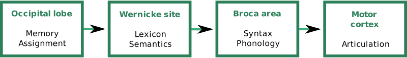

---
list-of-figures:
  label: Figure
  title: List of Figures
list-of-tables:
  label: Table
  title: List of Tables
cite:
  title: List of Sources
footnotes:
  title: Footnotes
abbreviations:
  title: List of Abbreviations
---

<!-- prettier-ignore -->
*[PET]: Positron emission tomography

# Language and Speech

The spoken (vocalized) utterances of a human being are based on a two-stage process in which we must strictly distinguish between the elements _language_ (semantic representation system) and _speaking_ (phonetic representation system).
Language is the encoding of abstract patterns of thought into a sequence of graphic signs (e.g., letters) or phonetic elements (phonemes).
We call the manifestation of characters “writing”; we call the realization of sounds “speaking” [@dudel:1996, @böhme:1997, @pschyrembel:1989].

In the complex “language – speaking” four linguistic levels can be distinguished [@böhme:1997]:

- _Semantic-lexical level_: semantics – study of the content and meaning of words; lexicology – study of the vocabulary of a language.
- _Syntactic-morphological level_: syntax – characterization of sentences and recognition of their internal structure; morphology or grammar – teaching of the structure and laws of a language.
- _Phonetic-phonological level_: phonetics – articulatory, acoustic and auditory factors of sounds; phonology – study of the sound system of individual languages and its function.
- _Pragmatic-communicative level_: use of language in the relationship between speaker and listener (sender and receiver).

## The Language

1. Definitions  
   Language is a conventional[^32] system of signs for communication purposes [@brockhaus:1994].
   Communication between living beings can take place in many different ways.
   In animals, gestures, gestures and scents play an important role in addition to sounds.
   Despite the variety of the used expressions and forms of expression, the communication occurring with animals is not called language, since for the transmission of the message always only given, unchanged signs are used.
   Language in the sense of the usual definition exists only if there is a convention which makes it possible to produce and understand an unlimited number of arbitrary messages from a limited, supraindividual stock of signs (e.g. alphabet, vocabulary).
   According to current knowledge, these syntactic abilities required for this seem to occur exclusively in humans.
   In this sense language consists of meaning-bearing elements (morphemes), which can be combined according to the rules of syntax to meaningful units manifold [@dudel:1996].

   > The human being speaks (...) We speak, because speaking is natural to us (...) One says, the human being has the language by nature (...) Only the language enables the human being to be that living being, which he is as a human being (...) As the speaking one the human being is: human being.  
   > _Martin Heidegger_ [@heidegger:1959]

   [^32]: conventional: here in the sense of “based on conventions”, agreed.

   By language production, therefore, we want to understand the formation and processing of mental concepts, whereby, accessing the learned active vocabulary and applying the syntactic rules valid for the respective language, a message is prepared in such a way that it can be supplied to vocal articulation or to another suitable modality (writing, gestures, body language, etc.).
   If this language manifests itself simultaneously in several modalities, then we speak of bimodal[^33] or multimodal communication.

   [^33]: A typical example of bimodal communication is the simultaneous conversion of a linguistic expression into spoken language and sign language by the person speaking.

2. Language acquisition  
   According to N. Chomsky, the complexity of human language conflicts with the ease with which children acquire language.
   Therefore, with the “Principles and Parameters Model”, he postulates that the basic features common to all languages are already biologically laid out (innate knowledge).
   Using these “universal principles”, the acquisition of the mother tongue is “only” limited to the learning of those grammatical parameters which determine the syntactic differences of each language.

3. Vocabulary  
   The vocabulary of the German language comprises (depending on the source and counting method) about $300\:000$ to $400\:000$ words.
   Of these, about $60\%$ are nouns (nouns), $25\%$ are verbs (tense words), and $15\%$ are adjectives (property words) and adverbs (circumstantial words).
   The English language is much richer.
   Here it is said to have a word inventory of $600\:000$ to $800\:000$ words.
   French, on the other hand, comprises only $100\:000$ words [@brockhaus:1994, @erben:1965, @geo-magazine:1997].

   The average active vocabulary of an adult is $8\:000$ to $16\:000$ words, while the average passive vocabulary reaches nearly $100\:000$ words.
   In contrast, $2\:000$ words are sufficient for $90\%$ comprehension of a simple, everyday text.

   At $18$ months, a child has about $50$ of word-like expressions.
   One year later, the active vocabulary has increased to $400$ words and at the age of $3$ years to more than $700$ words.
   Verbs have a special place in this process.
   They are added to the active vocabulary later and with greater effort [@wilson:1998].
   The passive vocabulary of a six-year-old child is reported to be no less than $23\:000$ words [@geo-magazine:1997].

4. Language and brain functions  
   Recent research claims that a great many regions of the human brain are involved in understanding and producing language.
   This is especially true when considering that language can be heard and read, spoken or written, and that there are numerous non-verbal forms of expression in addition to verbal language.

   In the classical view of the brain regions involved, one starts, for the sake of better understanding, from heard speech and traces the chain of action to the production of a spoken response to what is heard.

   On the one hand, by observing and analyzing brain lesions and their effect on the linguistic competence and performance of subjects, and on the other hand, by using positron emission tomography (PET)[^34] it has been possible to find relatively narrowly defined areas in the brain that are responsible for the processing and production of speech.

   [^34]: Positron emission tomography can be used to create a cross-sectional image of the brain's energy balance and thus determine which areas of the brain have above-average activity during certain activities.

   The so-called Wernicke center[^35] is the “sensory” language region in the posterior, upper part of the temporal lobe of the dominant hemisphere of the brain in each case (in $99\%$ of right-handed persons and $60\%$ of left-handed persons on the left side of the body).

   [^35]: Carl Wernicke, German neurologist and psychiatrist, $1848-1905$

   Earlier, Broca[^36] was able to locate the “motor” language region in the lower turn of the frontal lobe of the dominant hemisphere, named after him as Broca's center.

   [^36]: Paul Broca, French surgeon and anthropologist, $1824-1880$.

   The two terms “sensory” and “motor” center seem rather misleading in an overall consideration of the brain's linguistic activity, especially since the “motor center”, despite its topographical proximity, has nothing to do with the motor cortex responsible for the speech process.

   If one tries to name the two language centers according to their linguistic task, then the Wernicke center represents, so to speak, the lexicon in which the terms and their meaning (semantics) are stored.
   Together with the functions for memory and assignment localized in the near occipital lobe, it is assumed that the words for the subsequent sentence formation are determined in the Wernicke area from abstract thoughts that have not yet been formulated in language by searching for the appropriate terms.

   <!-- FIXME: missing bibliography entry: [MET 94] -->

   

   According to this model, Broca's center then takes over these word components as a “grammar machine,” supplements them with the necessary function words, and builds a syntactically correct sentence from them.

   In the following step, the completed sentence, when it is to be pronounced, is passed on to that part of the motor cortex which is responsible for the correct control of about a hundred muscles involved in the articulation of spoken language.
   Analogous mechanisms operate for written language and nonverbal communication.

   The Wernicke area also has tasks in recognizing heard words.
   Another center (optical speech center) is active during reading.

   The language centers of the dominant brain hemisphere (mostly on the left) are responsible for the basic functions "lexicon", "semantics" and "grammar".
   However, this should not hide the fact that the non-dominant brain hemisphere also has an important task to fulfill in understanding and producing language.
   If the bar (corpus callosum), the connection between the two brain hemispheres, fails (injuries, tumors), persons lose the ability to distinguish emotional components in language (angry, ironic, humorous, etc.) or to understand figurative language (metaphors) other than in a purely literal sense [@eberhard:1994].

{.lower-alpha}

## Speech, Voice Formation and Speech Organs

1. Organs of voice formation  
   Human voice production, which is unique in all of nature, is accomplished through a complex interaction of a variety of organ systems:

   - The respiratory system (the lungs and airways) must provide sufficient air volume and pressure.
   - The larynx with the vocal cords serves to produce sounds (in the sense of tones together with their harmonics), which in this context are called voice.
   - The articulation system, consisting of the pharynx, oral cavity and nasal cavity, forms the individual phonemes, i.e. the elements of spoken language, from the sound coming from the larynx.
   - The voice formation in the larynx (position of the vocal cords) and all movements of the articulation organs (primarily position of the tongue, palate, jaws and lips) are carried out by the motor speech center of the brain.
   - The role of the auditory system in speech production should not be underestimated.
     Only through the feedback of one's own voice is natural speech acquisition and perfect articulation possible.
     If this feedback is not guaranteed due to damage to the ear or the auditory pathway, language acquisition is only possible by means of special educational and therapeutic measures.

   The position of the vocal cords determines whether the exhaled air can pass through the glottis (gap between the vocal cords, _glottis_) unhindered (normal breathing) or whether it can cause the vocal cords to vibrate when the glottis is narrowed (phonation).
   The more the vocal cords are tense and the higher the pressure of the exhaled air, the higher the frequency of vibration produced by the vocal cords.
   A separate position of the vocal cords is present in the whispering voice.
   The four most important positions of the vocal cords are shown in <<fig:position-of-voice-bands>>.

   Depending on its position, the soft palate regulates the inflow of air into the oral or nasal cavity (or both), thereby contributing to the coloration of the sound.
   Tongue, teeth and lips cause differentiation in articulation.

   

   ::: figcaption

   1. with quiet breathing;
   2. with forced breathing;
   3. in voice production;
   4. with whispered voice.
      {.lower-alpha}

   :::

{.lower-alpha}

!!!include(general/attribution.en.md)!!!
