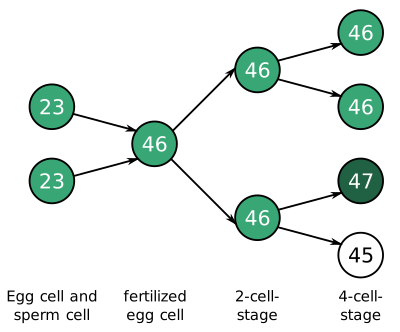

---
list-of-figures:
  label: Figure
  title: List of Figures
list-of-tables:
  label: Table
  title: List of Tables
cite:
  title: List of Sources
footnotes:
  title: Footnotes
abbreviations:
  title: List of Abbreviations
---

<!-- prettier-ignore -->
*[CNS]: Central Nervous System
*[PET]: Positron emission tomography
*[PVS]: Persistent vegetative state
*[RS]: Rett syndrome

# Multiple Disabilities, Syndromes

## Multiple Disabilities

The coincidence of several impairments is called multiple disability and often weighs more heavily for the affected person than the sum of the individual disabilities.

<<tab:occurrence-multiple-disabilities>> shows, for the three most common primary disabilities (mobility, vision, and hearing impairment), the probability of occurrence of additional functional limitations.
The numbers indicate how many of $1\:000$ persons with a given primary disability are affected by one of the selected additional limitations.

<table>
  <colgroup span="3"></colgroup>
  <col>
  <thead>
    <tr>
      <th colspan="3">Of <MathML formula="1,000"/> individuals with a disability ...</th>
      <th rowspan="2" scope="rowgroup">... are additionally limited at/by</th>
    </tr>
    <tr>
      <th>... of mobility ...</th>
      <th>... of vision ...</th>
      <th>... of hearing ...</th>
    </tr>
  </thead>
  <tbody>
    <tr>
      <td><MathML formula="1,000"/></td>
      <td><MathML formula="700"/></td>
      <td><MathML formula="530"/></td>
      <th>Mobility</th>
    </tr>
    <tr>
      <td><MathML formula="150"/></td>
      <td><MathML formula="1,000"/></td>
      <td><MathML formula="160"/></td>
      <th>Vision</th>
    </tr>
    <tr>
      <td><MathML formula="230"/></td>
      <td><MathML formula="380"/></td>
      <td><MathML formula="1,000"/></td>
      <th>Listening</th>
    </tr>
    <tr>
      <td><MathML formula="320"/></td>
      <td><MathML formula="220"/></td>
      <td><MathML formula="200"/></td>
      <th>Rheumatism</th>
    </tr>
    <tr>
      <td><MathML formula="20"/></td>
      <td><MathML formula="30"/></td>
      <td><MathML formula="10"/></td>
      <th>Epilepsy</th>
    </tr>
    <tr>
      <td><MathML formula="270"/></td>
      <td><MathML formula="150"/></td>
      <td><MathML formula="170"/></td>
      <th>Heart disease</th>
    </tr>
  </tbody>
</table>

.occurrence-multiple-disabilities#Occurrence of multiple disabilities [@tetzchner:1991].

## Syndromes

A syndrome[^38] is understood as the coincidence of several signs (symptoms) that are characteristic of a certain clinical picture.
The cause of the disease (etiology) is usually uniform, but the course of the disease (pathogenesis) is unknown.

[^38]: Syndrome: from grie. concomitant, accompanying.

1. Down syndrome  
   Down syndrome[^39] (also trisomy $21$ or Langdon-Down disease)[^40] results from a chromosomal disorder in which an extra third chromosome $21$ (hence trisomy $21$)[^41] appears in the body's cells at fertilization or one of the subsequent cell divisions and is passed on with each subsequent cell division from then on[^42].
   Down syndrome leads to maldevelopment of almost all tissues and organs of the maturing organism.
   Two types of Down syndrome are distinguished:

   [^39]: John L. Down, English physician, $1828-1896$.
   [^40]: The former common name “mongolism” is now considered discriminatory and should therefore be avoided.
   [^41]: In addition to trisomy $21$, other autosomal trisomies involving chromosomes $3$, $9$, $10$, $12$, $13$, and $18$ are known. Genosomal trisomies (XXY and XYY) may occur in the sex chromosomes.
   [^42]: that a chomosomal disorder is the cause of Down syndrome was suspected as early as $1930$, but proof was not provided until $1959$ by Frenchman Jérôme Lejeune.

   - _Free (complete) trisomy $21$_  
     The additional chromosome $21$ already exists as $24$.
     chromosome in one of the germ cells and is therefore present as a free third chromosome $21$ in all somatic cells (<<fig:chromosome-passing-down-syndrome>>).

   - _Mosaic Down Syndrome_  
      Sperm and egg cells contain the correct number of $23$ chromosomes.
     The chromosomal error does not occur until one of the first cell divisions.
     Therefore, there are cells with both $46$ and $47$ chromosomes.
     This form occurs in about $1\%$ of children with Down syndrome (<<fig:chromosome-passing-mosaic-down-syndrome>>).

   .")

   

   Apart from deformities and changes in habitus, the following symptoms are characteristic of Down syndrome:

   - Mental retardation of varying degrees.
   - Speech disorder (high palate, large tongue, malocclusion of teeth).
   - Muscle hypotonia.

2. Parkinson's syndrome  
   Parkinson's syndrome[^43] is the most common neurological disorder of advanced age, predominantly affecting men.
   It is an extrapyramidal syndrome due to degeneration of neurons in the midbrain (substantia nigra) [@pschyrembel:1989].

   [^43]: James Parkinson, English surgeon and paleontologist, $1755-1824$.

   The symptoms associated with Parkinson's syndrome are primarily:

   - Silent and monotone speech
   - Slowing and shortening of movements and movement disorders (slow, shuffling gait, small handwriting, tendency to fall)
   - Stiffness of the muscles
   - Resting tremor (tremor of muscles at rest with $4$ to $6$ movements per second).
     Tremor stops during voluntary movements, so handwriting is not tremulous.

3. Gregg syndrome  
   Gregg syndrome (rubella embryopathy, embryopathia rubeolosa), malformation syndrome following rubella infection of the mother during the first three months of pregnancy [@pschyrembel:1989].
   The anomalies that occur depend on the timing of rubella infection (<<tab:anomalies-gregg-syndrome>>).

   <table>
     <thead>
       <tr>
         <th>Pregnancy month</th>
         <th>Focus of abnormalities</th>
         <th>Occurring symptoms</th>
       </tr>
     </thead>
     <tbody>
       <tr>
         <td rowspan="4"><MathML formula="1"/></td>
         <td rowspan="4">Eyes</td>
         <td>congenital cataract (Cataracta congenita)</td>
       </tr>
       <tr>
       <td>facultative glaucoma (glaucoma)</td>
       </tr>
       <tr>
       <td>small eyes (microphthalmia)</td>
       </tr>
       <tr>
       <td>back of the eye changes (pseudo-RP)</td>
       </tr>
       <tr>
         <td rowspan="4"><MathML formula="2"/></td>
         <td>Heart</td>
         <td>heart septal defects</td>
       </tr>
       <tr>
         <td rowspan="3"><abbr title="Central nervous system">CNS</abbr></td>
         <td>low brain volume (microcephaly)</td>
       </tr>
       <tr>
         <td>retardation, epilepsy</td>
       </tr>
       <tr>
         <td>motion disorders</td>
       </tr>
       <tr>
         <td><MathML formula="3"/></td>
         <td>internal ear</td>
         <td>sensorineural hearing loss</td>
       </tr>
     </tbody>
   </table>

   .anomalies-gregg-syndrome#Abnormalities in Gregg syndrome [@pschyrembel:1989].

4. Rett syndrome (RS)  
   Rett syndrome[^44] is a disorder so far observed only in girls, probably inherited in an X-linked dominant manner, in the course of which there are brain atrophy (atrophy of neural tissue in the brain) as well as other changes in the brain.
   Manifestation occurs between $6,$ month of life and $4,$ year of life.
   The effects are:

   [^44]: Andreas Rett, Austrian pediatrician.

   - epilepsy
   - Delays in growth
   - Loss of previously acquired skills
   - Stereotyped hand movements (washing, kneading)
   - Gait disturbances (wide-legged, stiff)
   - Apraxia (also affects speech organs and eye movements)
   - Loss of verbal communication

5. Usher syndrome  
   Usher syndrome is an autosomal recessive inherited disorder with the main symptoms:

   - Progressive hearing loss in childhood and adolescence.
   - Retinopathia pigmentosa (retinitis pigmentosa), occurring years later
   - Failure of the vestibular nerve (part of the vestibulocochlear nerve = VIII. Cranial nerve, which innervates the vestibular system).
   - Epileptic seizures (possible)

   Usher syndrome is a major cause of deaf-blindness.

6. Persistent vegetative state (PVS) and locked-in syndrome  
   Waking coma (apallic syndrome, coma vigile, persistent vegetative state – PVS) refers to a clinical condition in which the patient is in a complete loss of perception of him/herself and his/her environment.
   The autonomic functions of the hypothalamus and brainstem are fully or partially preserved.
   An EEG is present and normal in the further course.
   However, visual stimulation lacks the usual blocking of alpha waves.
   Patients exhibit a natural sleep-wake cycle.
   Nevertheless, there is no evidence of reproducible goal-directed or volitional behavior in response to visual, tactile, auditory, or noxious stimuli [@persistent-vegetative-state:1994:part-1].

   Wakefulness coma is clearly distinguishable from related conditions such as locked-in syndrome, coma, brain death, or severe dementia (see also the compilation in <<tab:wakefulness-coma-and-related-states>>):

   - Coma: Deep unconsciousness lasting more than one hour.
   - Brain death: permanent absence of all brain activity, including that of the brain stem.
   - Locked-in syndrome: consciousness and awareness is present but cannot be reciprocated.
     PET scans show much higher metabolic levels than in PVS.
   - Dementia: Progressive, multidimensional loss of cognitive function.
     Progression to end-stage PVS is possible.

   <table>
     <thead>
       <tr style="height: 14rem;">
         <th>State</th>
         <th>Self-awareness</th>
         <th>Sleep-wake cycle</th>
         <th>Motor functions</th>
         <th>Awareness of suffering</th>
         <th>Breathing</th>
         <th>EEG activity</th>
         <th>Brain metabolism</th>
       </tr>
     </thead>
     <tbody>
       <tr>
         <th scope="row">Wake coma</th>
         <td>absent</td>
         <td>intact</td>
         <td>no controlled movement</td>
         <td>no</td>
         <td>normal</td>
         <td>delta or theta, sometimes alpha</td>
         <td>reduced by <MathML formula="50\%"/> or more</td>
       </tr>
       <tr>
         <th scope="row">Coma</th>
         <td>miss</td>
         <td>absent</td>
         <td>no controlled movement</td>
         <td>no</td>
         <td>reduced, different</td>
         <td>delta or theta</td>
         <td>reduced by <MathML formula="50\%"/> or more</td>
       </tr>
       <tr>
         <th scope="row">Brain death</th>
         <td>missing</td>
         <td>absent</td>
         <td>no or only spinal reflexes</td>
         <td>no</td>
         <td>absent</td>
         <td>no EEG</td>
         <td>absent</td>
       </tr>
       <tr>
         <th scope="row">Locked-in syndrome</th>
         <td>present</td>
         <td>intact</td>
         <td>complete paralysis, eye movements only</td>
         <td>yes</td>
         <td>normal</td>
         <td>normal or minor deviation</td>
         <td>slightly reduced</td>
       </tr>
       <tr>
         <th scope="row">Dementia</th>
         <td>present, lost later</td>
         <td>intact</td>
         <td>different, progressive decline</td>
         <td>yes, but decreasing</td>
         <td>normal</td>
         <td>slowed</td>
         <td>differentially reduced</td>
       </tr>
     </tbody>
   </table>

   .wakefulness-coma-and-related-states#Persistent vegetative state (PVS) and related conditions [@persistent-vegetative-state:1994:part-1].

   Among the causes that can lead to a waking coma, a distinction is made between acute causes on the one hand and congenital or degenerative causes on the other [@persistent-vegetative-state:1994:part-1].

   Acute causes may have a traumatic background (traumatic brain injury, e.g., due to an accident or gunshot wound) or a non-traumatic background (hypoxia due to circulatory arrest or drowning, cerebral apoplexy, meningitis, tumors, or poisoning).
   The statistical evolution of patients/patients with PVS $12$ months after an acute cause is shown in <<fig:model-production-spoken-language>>.
   Note that prognoses vary widely between traumatic and nontraumatic triggers as well as between adults and children.
   <<fig:model-production-spoken-language>> also shows, for that portion of individuals who awaken from PVS within 1 year, the probability and degree of expected disability [@kinney:1994, @persistent-vegetative-state:1994:part-1].

   

   Non-acute causes of a vegetative state include, on the one hand, numerous malformations of the brain such as anencephaly (absence of essential brain parts), microencephaly (small brain), hydranencephaly (remodeling of the cerebrum into a fluid bubble) and congenital hydrocephalus.
   On the other hand, in adults, conditions such as Alzheimer's disease, Creutzfeldt-Jacob, Huntington's disease, Parkinson's disease, or multi-infarct dementia can result in PVS.
   In children, gangliosidoses (lipid storage diseases) may be a cause of falling into a vegetative state [@persistent-vegetative-state:1994:part-1].

   The incidence of PVS is reported very differently, varying from $25$ to $60$ on $1\;\sf{million}$ EW.
   Only the smaller proportion has traumatic causes [@andrews:1993].
   It should be noted, however, that a definitive diagnosis is often very difficult and misdiagnosis can account for up to $60\%$ of cases studied [@andrews:1996].

   <!-- FIXME: cross reference -->

   In locked-in syndrome, patients are conscious but without any ability to move.
   In the “classic” form, vertical eye movements and blinking are preserved, and can be used for communication purposes with appropriate interfaces.
   In “total” locked-in syndrome, these movements are also absent and communication is possible – if at all – only via the evaluation of the EEG (Brain Computer Interface).
   <!-- In “total” locked-in syndrome, these movements are also absent and communication is possible – if at all – only via the evaluation of the EEG (Brain Computer Interface – see Part B, Chapter 3.2.8). -->

   Causes for locked-in syndrome are: advanced ALS, brainstem infarction, infarction in the bridge (_pons_, connection of the two brain hemispheres), bilateral infarction of the internal capsule (capsula interna – deep lying part of the brain), tumors, encephalitis (inflammation of the brain) and craniocerebral trauma [@kübler:2001:a, @kübler:2001:b].

{.lower-alpha}

!!!include(general/attribution.en.md)!!!
