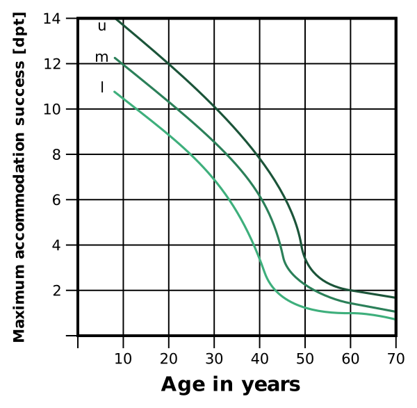
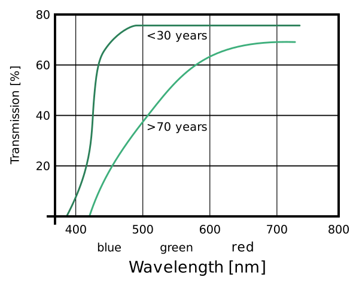
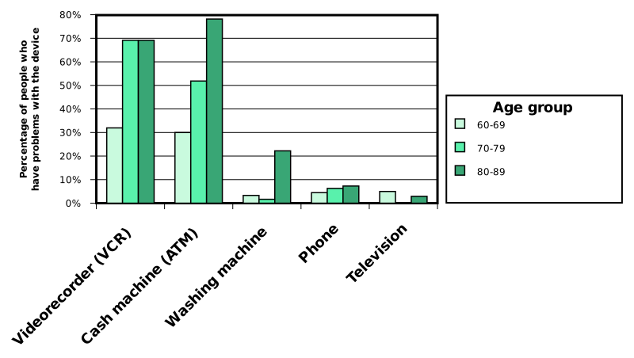

---
list-of-figures:
  label: Figure
  title: List of Figures
list-of-tables:
  label: Table
  title: List of Tables
cite:
  title: List of Sources
footnotes:
  title: Footnotes
abbreviations:
  title: List of Abbreviations
---

<!-- prettier-ignore -->
*[PET]: Positron emission tomography
*[PVS]: Persistent vegetative state
*[RS]: Rett syndrome
*[U.S.]: United States
*[USA]: United States of America
*[WWW]: World Wide Web

# Age-Related Functional Limitations

Aging represents a complex, irreversible process that is characterized by organically induced changes in the area of vital functions.
Theoretically, the aging process already begins at conception (biomorphosis). In practice, this is contrasted with the degenerative changes and functional losses that become much more pronounced with advancing age (senescence).

When considering signs of aging, a conscious distinction should be made between chronological (calendar) age and biological age [@helander:1998].
Classifying old people on the basis of age alone (as is repeatedly done in the context of statistics for lack of better options) creates highly heterogeneous populations whose abilities cannot be compared in many respects.

<!-- FIXME: missing bibliography entry: [PLO 98] -->

While age initially implies a higher likelihood of suffering one or more physical impairments (<<fig:percentage-disabilities-us>>), it must be remembered that $84\%$ of persons over $65$ do not require outside assistance in performing activities of daily living.
It would therefore be an entirely wrong perspective to view them blanketly as disabled or patients rather than consumers (<<fig:percentage-assistance-us>>) [@plo:1998, @yokoyama:1998, @charness:1998:b].

.")

::: figcaption

Percentage of the U.S. population living in households (source: U.S. Census Bureau [@mcneil:1995]) who

1. are mildly or severely disabled;
2. are severely disabled;
3. have problems in at least one activity of daily living[^45].
   {.lower-alpha}

:::

[^45]:
    Figures are for the population average.
    Blacks are more affected by disability.
    E.g., age group $55-64$ years: whites: $20\%$; blacks $35\%$ [@mcneil:1997].

.")

In a $1982$ study conducted in the U.S., it was found that $36\%$ of those caring for an elderly person were themselves over $65$ years old [@harootyan:1993].

Declines in performance typical of the general aging process have been analyzed for a number of functions.
They are described in the following points.
However, it is important to reiterate here the particular heterogeneity of this population stratum.
Much of the data elaborated below is based on averaging and thus attempts to represent the typical performance data of a statistical person of a certain age that does not exist in reality.
Rather, it is known that in many cases the extreme values of a given measurement scale are much more crowded than the middle [@harrington:1998].
Therefore, the values given here can only represent a general trend line.

## Vision

1. Increase in eye diseases  
   With age, the statistical probability of suffering irreversible damage to the eyes increases significantly.
   <<tab:increase-eye-diseases-age>> shows the frequencies of occurrence of cataracts, glaucoma, and age-related maculopathy collected for the United States for three age strata between $52$ and $85$ years.

   <table>
     <thead>
       <tr>
         <th>Age [in years]</th>
         <th>Cataract (cataract) [%]</th>
         <th>Maculopathy (age-related) [%]</th>
         <th>Glaucoma (glaucoma) [%]</th>
       </tr>
     </thead>
     <tbody>
       <tr>
         <td><MathML formula="52-64"/></td>
         <td><MathML formula="5"/></td>
         <td><MathML formula="2"/></td>
         <td><MathML formula="1"/></td>
       </tr>
       <tr>
         <td><MathML formula="65-74"/></td>
         <td><MathML formula="18"/></td>
         <td><MathML formula="11"/></td>
         <td><MathML formula="5"/></td>
       </tr>
       <tr>
         <td><MathML formula="75-85"/></td>
         <td><MathML formula="46"/></td>
         <td><MathML formula="28"/></td>
         <td><MathML formula="7"/></td>
       </tr>
     </tbody>
   </table>

   .increase-eye-diseases-age#Increase of eye diseases with age [@fozard:1993 nach @kahn:1977].

2. General decrease in visual performance (visual acuity).  
   In addition to the increasing probability of suffering a visual impairment due to disease with age, there are numerous degenerative processes of the eye.
   From <<fig:decrease-visual-performance-at-age>> it is evident that visual performance (visual acuity, V) statistically decreases by about $0.1\;\sf{V}$ per decade of life, starting with the $40th year of life, despite correction by glasses or contact lenses.
   In the age group $65-74$ years $92\%$ of the persons have a visual acuity better than $0.8$ (with best possible correction), but for the age group $75-84$ this value decreases to $69\%$ [@kahn:1977].

   <!-- FIXME: missing bibliography entry: [GIT 86] -->

   

3. Reduction of accommodation success and accommodation time.  
   Accommodation success is the difference in refractive power, measured in diopters (dpt), of which the crystalline lens is capable.
   For the emmetropic (normally sighted) eye or the eye corrected by glasses or contact lenses, this is the difference between distance accommodation and accommodation to the minimum possible distance.

   While the adolescent eye has an average accommodation success of $12\;\sf{dpt}$, this value reduces especially in the life stage between $40$ and $50$ years, so that then the average accommodation success is only $2\;\sf{dpt}$.
   <<fig:reduction-accommodation-success-at-age>> shows the typical courses for accommodation success between $10$ and $70$ years.

   

   The age-related reduction of accommodation success means an increasing reduction of the range to which the eye can focus.
   To achieve a sharp image at the usual reading distance of $35\;\sf{cm}$ to $40\;\sf{cm}$, the presbyopic eye requires an increase in refractive power through reading glasses.
   If such glasses are worn, then greater distances cannot be perceived sharply.

   <<fig:range-sharp-vision>> shows the perceptible range in focus when glasses are used to achieve the reading distance ($35\;\sf{cm}$ to $40\;\sf{cm}$).
   Thus, at $50$ years of age, on average, accommodation can still be achieved to a range between $35\;\sf{cm}$ and $80\;\sf{cm}$.
   At $60$ years, this range is already limited to $10\;\sf{cm}$ ($35\;\sf{cm}$ to $45\;\sf{cm}$).
   Thus, an object to be perceived sharply must be within this small range.

   The time required for the eye to focus at a different distance increases with age.
   For a change of gaze from a distance to a near object (e.g., change of gaze from the roadway to the dashboard), a $50$-year-old person needs twice to three times the time compared with a $20$-year-old person (<<fig:increase-accommodation-time-with-age>>).

    by using glasses [@methling:1996].")

   

   [^46]:
       The accommodation time for larger distance differences is indeed shorter.
       Presumably, the eye reacts correspondingly faster to a larger stimulus (H. Krueger).

4. Change of the spectral sensitivity  
   Already the juvenile eye lens has yellow coloration to reduce chromatic aberration.
   However, the spectral transmission properties change during the years of life due to additional increased yellow coloration of proteins of the lens (<<fig:transmission-curve-eye-lens-age>>) [@methling:1996].
   As a consequence, much less blue components are transmitted in old age and violet as well as blue objects are perceived darker [@harrington:1998].
   It should be noted that the human eye has the lowest sensitivity for blue from the beginning.

   

   With increasing age, the perceived color saturation and color discrimination (especially for blue and green) becomes lower.
   Colors appear “washed out” [@fozard:1993].
   However, the yellow tint of the lens is not perceived as a color cast by the old person.

5. Higher need for light and contrast  
   The pupil diameter is also clearly subject to the aging process.
   The maximum diameter decreases continuously with age.
   Whereas the eye of a $20$-year-old person can be compared to a camera lens of luminous intensity $2$, the largest “aperture” of an $80$-year-old person is only $5.6$.
   This is a reduction of about $3$ f-stops, which is equivalent to reducing the amount of light falling on the retina by a factor of $8$.
   This explains the significantly higher light demand in old age (<<tab:age-dependence-pupil-diameter>> and <<fig:abhaengigkeit-pupillendurchmesser-vom-alter>>).

   <table>
     <col>
     <colgroup span="2"></colgroup>
     <colgroup span="2"></colgroup>
     <thead>
       <tr>
         <th rowspan="2">Alter [Jahre]</th>
         <th colspan="2">min. (Tag)</th>
         <th colspan="2">max. (Nacht)</th>
       </tr>
       <tr>
         <th>Ø [mm]</th>
         <th>f</th>
         <th>Ø [mm]</th>
         <th>f</th>
       </tr>
     </thead>
     <tbody>
       <tr>
         <td><MathML formula="20"/></td>
         <td><MathML formula="4.7"/></td>
         <td><MathML formula="4"/></td>
         <td><MathML formula="8.0"/></td>
         <td><MathML formula="2"/></td>
       </tr>
       <tr>
         <td><MathML formula="40"/></td>
         <td><MathML formula="3.9"/></td>
         <td><MathML formula="4"/></td>
         <td><MathML formula="6.0"/></td>
         <td><MathML formula="2.8"/></td>
       </tr>
       <tr>
         <td><MathML formula="60"/></td>
         <td><MathML formula="3.1"/></td>
         <td><MathML formula="5.6"/></td>
         <td><MathML formula="4.1"/></td>
         <td><MathML formula="4"/></td>
       </tr>
       <tr>
         <td><MathML formula="80"/></td>
         <td><MathML formula="2.3"/></td>
         <td><MathML formula="8"/></td>
         <td><MathML formula="2.5"/></td>
         <td><MathML formula="5.6"/></td>
       </tr>
     </tbody>
   </table>

   .age-dependence-pupil-diameter#Age dependence of pupil diameter – f is the rounded f-number corresponding to the equivalent photographic system [@zagler:1997, @methling:1996].

   

   ::: figcaption

   1. With dark accommodation;
   2. With light accommodation.

   :::

   Even in photopic conditions, the pupil diameter of a person over $60$ years old is much smaller than in youth, so that the luminous flux reaching the retina of a $60$ year old person is only $1/3$ of a $20$ year old person, and thus the illuminance required for comparable visual performance is three times as great [@methling:1996].
   Especially in the elderly, the improvement in visual performance achievable by increasing illuminance is significant.
   According to [@fozard:1993], visual performance and visual comfort increase proportionally with the square root of the amount of light provided.

   An increase in the amount of light causes the iris to form a smaller pupil diameter.
   Each such dimming of an optical system produces more sharpness and more depth of field.
   The small pupil diameter in old age provides some compensation for the presbyopic eye, causing an accommodation gain between $0.5\;\sf{dpt}$ and $0.75\;\sf{dpt}$ [@methling:1996].

   <<fig:correlation-letter-size-illumination-age>> shows the correlation between visual performance (reading letters of different sizes), age, and illuminance.
   While individuals between $30$ and $40$ years of age gain little advantage from higher illuminance levels, the gain in reading performance for older individuals is substantial [@steenbekkers:1998:a].

   <!-- prettier-ignore -->
    [@zagler:2008, @steenbekkers:1998:a].")

{.lower-alpha}

## Listening

The number of persons affected by hearing impairment within an age group increases almost exponentially with age.
<<fig:increase-hearing-impairements-with-age>> shows as an example the evaluation of a statistic from Holland [@sandini:1996].

The hearing threshold for pure tones in the upper auditory range (e.g., $8\;\sf{kHz}$) regularly increases in adult humans at a rate of about $1\;\sf{dB}$ per year of age.
Low tones (e.g., $1\;\sf{kHz}$) are much less affected.
Here, the annual increase in hearing threshold between $20.$ and $60.$ years of age is only about $0.3\;\sf{dB/a}$.
In later years, however, the rate increases to as much as $1.3\;\sf{dB/a}$ (<<fig:progression-hearing-threshold-with-age>>).
Men tend to be more affected by age-related hearing loss than women [@fozard:1993, @guski:1996].

 [@zagler:2008, @ferrari:1996, @sandini:1996].")

## Smell and taste

The age-related changes in perception thresholds for the sense of taste differ depending on the flavor.
While the threshold for “sweet” (e.g., sugar solutions) remains stable with age, the perception of “salty” and “bitter” decreases with age.

Sensitivity to odors generally decreases with age.
This not only means that older people enjoy eating less (the sense of smell plays a more important role here in addition to the sense of taste), it also creates an increased risk because escaping gas or spoiled food cannot be reliably detected [@fozard:1993].

## Force, Movement, Mobility

1. Strength  
   With age, the muscular strength of the entire musculature decreases uniformly.
   If no special training of individual muscle parts is undertaken, then the overall condition can be inferred from the values of a few measurements.
   <<fig:gripping-force-dependence-age>> shows, as an example, the age-related decrease in the force a person can exert when gripping with the hand.
   Muscle strength reaches its maximum between $20$ and $25$ years of age (normalized to $100\%$ in the diagram).

   Since the skin is drier in old age than in youth, the coefficient of friction between the fingers and an object to be manipulated also decreases.
   This means that a correspondingly greater amount of force must be applied to all forceful manipulations (e.g., lifting a smooth object) [@guski:1996].

   In a study in the Netherlands, it was found that about $15\%$ of persons over $55$ years of age (that is $600\:000$ inhabitants) have appreciable difficulty in transporting a mass of $5\;\sf{kg}$ over a distance of $10\;\sf{m}$ [@aken:1998].

   <!-- prettier-ignore -->
    [@zagler:2008, @nayak:1998].")

2. Walking speed  
   The walking speed of healthy people decreases from the age of 50$ years (<<tab:age-dependence-walking-speed>>):

   <table>
     <col>
     <colgroup>
       <colgroup span="2"></colgroup>
       <colgroup span="2"></colgroup>
     </colgroup>
     <thead>
       <tr>
         <th rowspan="3">Age [years]</th>
         <th colspan="4">Walking speed</th>
       </tr>
       <tr>
         <th colspan="2">[m/s]</th>
         <th colspan="2">[km/h]</th>
       </tr>
       <tr>
         <th>Men</th>
         <th>Women</th>
         <th>Men</th>
         <th>Women</th>
       </tr>
     </thead>
     <tbody>
       <tr>
         <td><MathML formula="20-50"/></td>
         <td><MathML formula="1.42"/></td>
         <td><MathML formula="1.42"/></td>
         <td><MathML formula="5.11"/></td>
         <td><MathML formula="5.11"/></td>
       </tr>
       <tr>
         <td><MathML formula="60-79"/></td>
         <td><MathML formula="1.21"/></td>
         <td><MathML formula="1.16"/></td>
         <td><MathML formula="4.36"/></td>
         <td><MathML formula="4.18"/></td>
       </tr>
     </tbody>
   </table>

   .age-dependence-walking-speed#Dependence of walking speed on age – Healthy subjects [@fozard:1998].

   If persons with mobility disabilities (they use a cane or crutch) are also included, the following picture emerges according to a Finnish study (<<tab:walking-speed-age-persons>>):

   <table>
     <col>
     <colgroup>
       <colgroup span="2"></colgroup>
       <colgroup span="2"></colgroup>
     </colgroup>
     <thead>
       <tr>
         <th rowspan="3">Age <MathML formula="70-80"/> years</th>
         <th colspan="4">Walking speed</th>
       </tr>
       <tr>
         <th colspan="2">[m/s]</th>
         <th colspan="2">[km/h]</th>
       </tr>
       <tr>
         <th>min.</th>
         <th>max.</th>
         <th>min.</th>
         <th>max.</th>
       </tr>
     </thead>
     <tbody>
       <tr>
         <td>healthy</td>
         <td><MathML formula="0.84"/></td>
         <td><MathML formula="1.58"/></td>
         <td><MathML formula="3.02"/></td>
         <td><MathML formula="5.69"/></td>
       </tr>
       <tr>
         <td>with walker</td>
         <td><MathML formula="0.18"/></td>
         <td><MathML formula="0.68"/></td>
         <td><MathML formula="0.65"/></td>
         <td><MathML formula="2.45"/></td>
       </tr>
     </tbody>
   </table>

   .walking-speed-age-persons#Walking speed of elderly persons – Healthy persons and persons using walking aids – Laboratory values of $55$ subjects [@virokannas:1998].

   The walking speed of a person is proportional to the muscle power available to him, with the stretching of the knee joint playing an essential role.

   Compared with men of the same age, elderly women have substantially less muscle strength: $80$-year-old women $66\%$, $8$-year-old women $54\%$ [@fozard:1998].
   Thus, women tend to be more prone to mobility impairments in old age than men of the same age.

3. Falls  
   With age, on the one hand, the strength required to keep the body balanced decreases.
   On the other hand, decreased functions of the vestibular apparatus, proprioception and visual perception also contribute to an increased risk of falls in old age [@troy:1996, @fozard:2001].
   One-third of all persons over $65$ years of age experience at least one fall annually.
   Falls account for $80\%$ of injuries and $90\%$ of fractures in the elderly.
   Falls represent the fifth leading cause of death in the elderly [@cameron:1997, @williams:1998:c].

   <table>
     <thead>
       <tr>
         <td></td>
         <th><MathML formula="0-14"/></th>
         <th><MathML formula="15-44"/></th>
         <th><MathML formula="45-64"/></th>
         <th><MathML formula="65-74"/></th>
         <th><MathML formula="75+"/></th>
         <th>Sum</th>
       </tr>
     </thead>
       <tr>
         <th scope="row">Men</th>
         <td><MathML formula="19"/></td>
         <td><MathML formula="178"/></td>
         <td><MathML formula="247"/></td>
         <td><MathML formula="204"/></td>
         <td><MathML formula="698"/></td>
         <td><MathML formula="1\:346"/></td>
       </tr>
       <tr>
         <th scope="row">Women</th>
         <td><MathML formula="14"/></td>
         <td><MathML formula="45"/></td>
         <td><MathML formula="206"/></td>
         <td><MathML formula="261"/></td>
         <td><MathML formula="1\:969"/></td>
         <td><MathML formula="2\:486"/></td>
       </tr>
     <tbody>
     </tbody>
   </table>

   .falls-cause-of-death-dependence-age#Falls as a cause of death as a function of age Office of Population Censuses and Surveys, United Kingdom, $1986$; from [@williams:1998:c].

{.lower-alpha}

## Cognitive Factors

1. Dealing with technology  
   A study of how older people use technical devices and interfaces in Japan has shown that there are types of devices and interfaces that cause increasing problems with age (e.g., video recorders and ATMs), but there are also technical products that cause no or at least hardly any problems despite advanced age (e.g., telephones and televisions) [@kuchinomachi:1999].

   

   In this context, it is worth mentioning that the hostility to technology said to exist among the elderly population cannot be generally confirmed.
   However, for the acceptance of technical equipment (i.e., also technical aids), it is necessary that the operation is easy to understand and fits harmoniously into the experiences of the elderly person (i.e., is sensory and coherent for them).

2. Dementia  
    Dementia is the term used to describe a progressive (advancing) degenerative change in the brain that affects three main areas (other sources form five groups) [@riederer:1998:a, @mihailidis:2000]:

   - _Cognitive impairments_: disturbance of memory (mainly short-term memory), limitations of abstract and rational thinking and judgment, inability or difficulty to remember concrete sequences (order of dressing), problems with speaking and naming, disorientation with respect to date, time, place of residence (danger of “wandering”), spatial disorientation (inability to find a specific room – toilet, bathroom, etc.).
   - _Emotional, behavioral impairments affecting the personality picture_: Depression, anxiety, quarrelsomeness, psychosis, hallucinations, paranoia, sleep disturbances.
   - _Physical impairments_: unsteady gait, tendency to fall, incontinence.

   The most common cause of senile dementia is Alzheimer's disease.
   Other causes and forms include Lewy body dementia, vascular brain disease, Creutzfeldt-Jakob disease, HIV disease, and alcohol dementia [@pschyrembel:1989, @topo:2001:a].

   The typical course happens in several stages [@kautz:2002, @whitehouse:2002]:

   - Onset of the disease, no symptoms.
   - Forgetfulness, getting lost, misplacing objects, word-finding problems.
   - Multi-step tasks can no longer be accomplished without outside help.
   - Disturbances in perception of the environment, loss of speech, motor losses.

   The increase of dementia with age is significant.
   From Austria $185\:000$ diseases are reported.
   By the year $2020$ an increase of $44\%$ (in Germany even $47\%$) is expected.
   For Europe, a doubling of dementia cases is expected in the period $2000$ to $2050$ [@hagen:2001].
   According to a Finnish statistic, only $3\%$ of $75$-year-olds but already $23$ to $30\%$ of $85$-year-olds are affected [@topping:1998, @mihailidis:2000].
   The increase in Alzheimer's disease in the U.S.[^47] and the forecast for $2050$ is shown <<fig:increase-alzheimer-us>>.
   Worldwide, $18\;\sf{million}$ of Alzheimer's patients are currently expected and to increase to $80\;\sf{million}$ by $2050$ [@mihailidis:2002, @kautz:2002, @kautz:2003].

   [^47]: For the U.S., the total cost to the economy and government of people suffering from Alzheimer's disease is estimated to be at least $100 billion annually ($2002$) [@kautz:2003].

   

   In addition to dementia triggered by organic changes, the so-called “pseudodementia” is often observed, which can affect, for example, persons who are torn from their familiar surroundings by a hospitalization at an advanced age (hospitalization dementia).

{.lower-alpha}

!!!include(general/attribution.en.md)!!!
