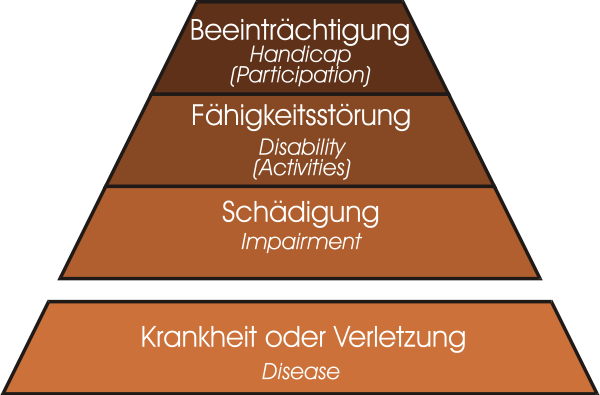

---
list-of-figures:
  label: Abbildung
  title: Abbildungsverzeichnis
list-of-tables:
  label: Tabelle
  title: Tabellenverzeichnis
cite:
  title: Quellenverzeichnis
footnotes:
  title: Fußnoten
abbreviations:
  title: Abkürzungsverzeichnis
---

# Die Ebenen der Behinderung nach WHO

*[ICIDH]: International Classification of Impairments, Disabilities and Handicaps
*[ICF]: International Classification of Functioning
*[WHO]: World Health Organization

Von der WHO (_World Health Organization_, Weltgesundheitsorganisation) wurde 1980 zum erstenmal die "ICIDH" (_International Classification of Impairments, Disabilities and Handicaps_) herausgegeben.
Während der deutschsprachige Begriff "Behinderung" als umfassender Oberbegriff aufgefasst werden kann, unterscheidet die ICIDH drei Ebenen bzw. Dimensionen von Behinderung und gibt ihnen unterschiedliche Benennungen.
Auch im Deutschen hat man versucht, verschiedene Begriffe einzuführen, obwohl der Übersetzung sprachlich bedingt die Prägnanz der englischen Begriffe fehlt [@matthesius:1995].

Die ICIDH wurde tiefgreifend überarbeitet und liegt jetzt als ICF (_International Classification of Functioning_) vor.
Ein wesentlicher Unterschied dieser Neuauflage wird auch sein, dass für _Disability_ und _Handicap_ neue Begriffe geprägt werden.
Damit sollen einerseits umfassendere Begriffe eingeführt werden, andererseits soll der Blick von der Behinderung zu den (trotz Behinderung) vorhandenen Fähigkeiten gelenkt werden.
Es wird abzuwarten bleiben, wie sich diese Begriffe in die gesamte Klassifikation einfügen.
Hier wird noch mit den bisherigen Ausdrücken gearbeitet, die neuen Bezeichnungen werden als Kommentar danebengestellt.

## Impairment – (gesundheitliche) Schädigung

Hiermit wird die Ebene der **Störung der biologischen und/oder psychischen Struktur und Funktion** angesprochen.
Unter Schädigung wird ein "beliebiger Verlust oder eine Normabweichung in der psychischen, physiologischen oder anatomischen Struktur oder Funktion" verstanden[^1].

[^1]: engl.: A loss or abnormity of psychological, physiological, or anatomical structure or function.

## Disability – Fähigkeitsstörung

Hierbei handelt es sich um die Ebene der Störung der Fähigkeiten der betroffenen Person zur Ausführung zweckgerichteter Handlungen.

Fähigkeitsstörung ist "jede Einschränkung oder jeder Verlust der Fähigkeit (als Folge einer Schädigung), Aktivitäten in der Art und Weise oder in dem Umfang auszuführen, die für einen Menschen als normal angesehen wird[^2]".

Die ICF ersetzt den Begriff disability durch activities, also auch durch die Einschränkung von Aktivitäten.

## Handicap – (soziale) Beeinträchtigung

Hierbei geht es um die Ebene der Störung der sozialen Stellung oder Rolle der betroffenen Person und ihrer Fähigkeit zur Teilnahme am gesellschaftlichen Leben.

Die ICIDH definiert soziale Beeinträchtigung als "eine sich aus einer Schädigung oder Fähigkeitsstörung ergebende Benachteiligung des betroffenen Menschen, die die Erfüllung einer Rolle einschränkt oder verhindert, die (abhängig von Geschlecht, Lebensalter sowie sozialen und kulturellen Faktoren) für diesen Menschen normal ist[^3]".

In der ICF verwendet anstelle des Begriffs _handicap_ der Begriff _participation_, also auch den Ausschluß von gesellschaftlicher Teilnahme.

## Zusammenfassung

> "Soziale Beeinträchtigung (handicap) ist daher keine einfache Folge eines physischen oder psychischen Schadens und der sich daraus ergebenden Funktionseinschränkung, sondern ist das Ergebnis der Wechselwirkung zwischen dem Wunsch eines Behinderten nach Eingliederung und Anerkennung und den Einstellungen und Verhaltensweisen seiner Umwelt.
> Erst durch Erlebnisse der Abweisung, Distanzierung, Mißachtung und sozialer Ausgliederung entsteht für den Behinderten die ganze Erfahrung behindert zu sein, nämlich auch als eine Erfahrung in der eigenen Entfaltung und Eingliederung in die Gesellschaft behindert zu werden." [@brockhaus:1994]

Zur Verdeutlichung werden die drei oben erwähnten Ebenen hier nochmals graphisch zusammengefaßt.
Als darunterliegende Ebene (Ursache für eine Schädigung) kann Krankheit oder Verletzung (_disease_) in das Schema aufgenommen werden (<<fig:ebenen-behinderung>>).

Die Auswirkung von "Behinderung" hängt also von vielen Faktoren ab.
Die gleiche (gesundheitliche) Schädigung (_impairment_) kann also zu vollkommen unterschiedlichen (sozialen) Beeinträchtigungen (_handicaps_) führen.
Demgemäß formuliert die WHO: "The situation people find themselves in may determine to what degree a disability is handicapping for them".

An diesem Punkt soll und muß sowohl die Rehabilitationstechnik als auch die Gesellschaft überhaupt ansetzen.
Wenn es mit den uns zur Verfügung stehenden medizinischen Mitteln nicht gelingt, die Schädigung (_impairment_) zu heilen, so kann doch durch gezielte personelle und technische Hilfestellung die Fähigkeitsstörung (_disability_) überwunden und durch Akzeptanz in der Gesellschaft die soziale Beeinträchtigung (_handicap_) beseitigt oder verringert werden.

[^2]: engl.: Any restriction or lack – resulting from an impairment – of the ability to perform an activity in the manner or within the range considered normal for a human being.
[^3]: engl.: A disadvantage for a given individual, resulting from an impairment or a disability, that limits or prevents the fulfilment of role that is normal – depending on age, sex, and social and culture factors – for the individual.

!!!include(docs/general/attribution.md)!!!