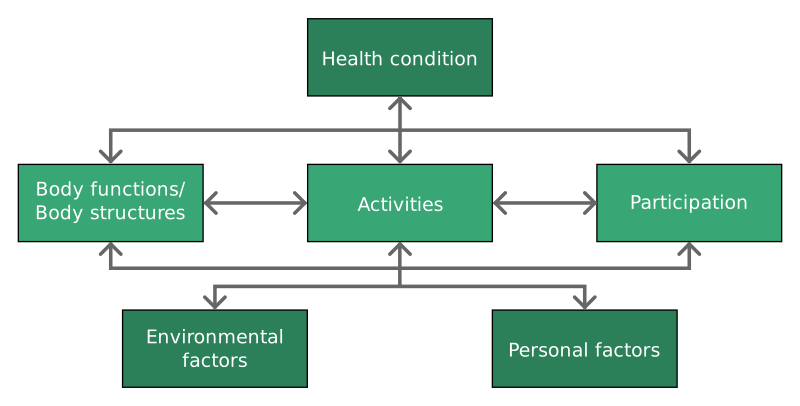
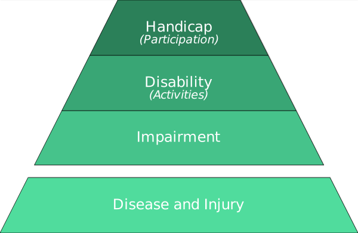

---
list-of-figures:
  label: Figure
  title: List of Figures
list-of-tables:
  label: Table
  title: List of Tables
cite:
  title: List of Sources
footnotes:
  title: Footnotes
abbreviations:
  title: List of Abbreviations
---

<!-- prettier-ignore -->
*[ICIDH]: International Classification of Impairments, Disabilities and Handicaps
*[ICF]: International Classification of Functioning
*[WHO]: World Health Organization

# The Levels of Disability According to WHO

The WHO (_World Health Organization_) published the “ICIDH” (_International Classification of Impairments, Disabilities and Handicaps_) for the first time in $1980$.
While the English-language term “disability” can be understood as a comprehensive generic term, the ICIDH distinguishes three levels or dimensions of disability and gives them different names.
In German, too, attempts have been made to introduce different terms, although the translation lacks the conciseness of the English terms for linguistic reasons [@matthesius:1995].

The ICIDH has been thoroughly revised and is now available as ICF (_International Classification of Functioning_).
An essential difference of this new edition is that new terms were coined for _disability_ and _handicap_.
On the one hand, this is to introduce more comprehensive terms, on the other hand, the view should be directed from the disability to the (despite disability) existing abilities.
It remains to be seen how these terms will fit into the overall classification.
Here, for the sake of simplicity, the previous terms are still used, the new terms are placed next to them as a comment.

By the ICF, functioning and disability is understood as dynamic interaction between health
conditions and contextual factors, both personal and environmental (<<fig:bio-psycho-social-model>>),
which shows the interactions between the components. This interaction is also promoted as “bio-
psycho-social model” representing a compromise between medical and social models where
disability is the umbrella term for impairments, activity limitations and participation restrictions.
Due to the definition of disability In the UN Convention on the Rights of Persons with Disabilities
(CRPD), which says that disability results from interaction between persons with impairments and
attitudinal and environmental barriers, disability is not an attribute of the person. Thus, progress on
improving social participation can be made by removing or reducing the barriers which hinder
persons with disabilities on their full participation in society.

<!-- FIXME - Psycho-soziales Modell in SVG umwandeln?
-->

## Impairment – (Health) Damage

This addresses the level of **disruption of biological and/or psychological structure and function**.
Damage is understood to be “any loss or deviation from norm in psychological, physiological or anatomical structure or function”.

## Disability – Ability Disorder

This is the level of impairment of the affected person's ability to perform purposeful actions.

Ability disorder is “any restriction or lack – resulting from an impairment – of the ability to perform an activity in the manner or within the range considered normal for a human being.”

The ICF replaces the term _disability_ by _activities_, i.e. also by the restriction of activities.

## Handicap – (Social) Impairment

This is the level of disturbance of the social position or role of the person concerned and his or her ability to participate in social life.

The ICIDH defines social impairment as “a disadvantage for a given individual, resulting from an impairment or a disability, that limits or prevents the fulfilment of role that is normal – depending on age, sex, and social and culture factors – for the individual.”

Instead of the term _handicap_, the ICF uses the term _participation_, i.e. also exclusion from social participation.

## Summary

> “Social impairment (handicap) is therefore not a simple consequence of a physical or psychological damage and the resulting functional limitation, but is the result of the interaction between a disabled person's desire for inclusion and recognition and the attitudes and behavior of his environment.
> It is only through experiences of rejection, distancing, disregard and social exclusion that the whole experience of being disabled arises for the disabled person, namely, also as an experience of being disabled in one's own development and inclusion in society.” [@brockhaus:1994]

For clarification, the three levels mentioned above are again summarized graphically here.
As an underlying level (cause of impairment), disease or injury (_disease_) can be included in the scheme (<<fig:levels-of-disability>>).

Thus, the effect of “disability” depends on many factors.
The same (health) injury (_impairment_) can thus lead to completely different (social) impairments (_handicaps_).
Accordingly, the WHO formulates: “The situation people find themselves in may determine to what degree a disability is handicapping for them”.

This is where both rehabilitation technology and society in general should and must start.
If the medical means available to us do not succeed in curing the impairment (_impairment_), the impairment of ability (_disability_) can be overcome through targeted personal and technical assistance and the social impairment (_handicap_) can be eliminated or reduced through acceptance in society.

!!!include(general/attribution.en.md)!!!
