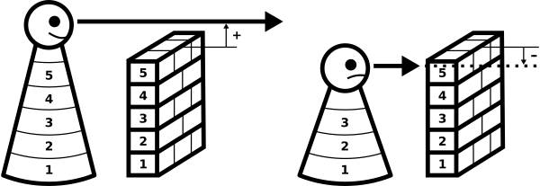

---
list-of-figures:
  label: Abbildung
  title: Abbildungsverzeichnis
list-of-tables:
  label: Tabelle
  title: Tabellenverzeichnis
cite:
  title: Quellenverzeichnis
footnotes:
  title: Fußnoten
abbreviations:
  title: Abkürzungsverzeichnis
---

# Behinderung als Differenz zwischen Leistung und Anforderung

Formal kann jede Behinderung als eine Differenz zwischen der einer Person möglichen Leistung und den Anforderungen an diese Person seitens der Umwelt und der Gesellschaft gesehen werden.
Ist die Leistung gleich oder größer als die gestellten Anforderungen, dann kann die Person eine bestimmte Funktion, Aufgabe oder gesellschaftliche Rolle erfüllen.
Fällt die Differenz aus Leistung und Anforderung jedoch negativ aus, dann scheitert die Person an der Aufgabe.

Handelt es sich dabei um Aufgaben, die von der breiten Masse als „normalerweise erfüllbar“ angesehen werden, dann macht die Person die Erfahrung der Behinderung.
In <<fig:erlebnis-behinderung>> ist dieser Zusammenhang graphisch dargestellt.
Die links dargestellte Person entspricht mit der Größe von $5$ Einheiten (wobei hier die Körpergröße stellvertretend für jede beliebige körperliche oder geistige Fähigkeit einer Person anzusehen ist) den Anforderungen der Umwelt.
Über eine Mauer, die ebenfalls $5$ Einheiten hoch ist, kann sie ohne Probleme schauen.

Die rechts dargestellt Person kann nur Leistung im Ausmaß von $3$ Einheiten erbringen (dargestellt durch eine Körpergröße von $3$ Einheiten) und muß daher an einer „normal hohen“ Mauer mit $5$ Einheiten scheitern.

Das Symbol der Mauer wurde bewußt gewählt, um den verallgemeinerten Begriff der „Barriere“ einzuführen.
Es soll deutlich gemacht werden, daß unter einer Barriere jegliches Hindernis (meist im übertragenen Sinn) verstanden wird, das zu einer Ausgrenzung einer behinderten Person führt bzw. um genauer zu sein, eine Person mit verminderter Leistungsfähigkeit erst zu einer behinderten Person macht.

!!!include(general/attribution.md)!!!
