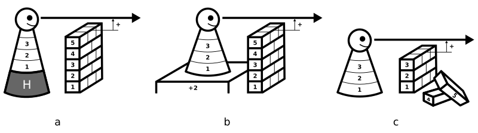

---
list-of-figures:
  label: Abbildung
  title: Abbildungsverzeichnis
list-of-tables:
  label: Tabelle
  title: Tabellenverzeichnis
cite:
  title: Quellenverzeichnis
footnotes:
  title: Fußnoten
abbreviations:
  title: Abkürzungsverzeichnis
---

# Rehabilitationstechnik

## Medizintechnik und Rehabilitationstechnik

Aufgabe der Medizintechnik ist die Schaffung aller jener prophylaktischen, diagnostischen und therapeutischen Geräte und Verfahren, die den Mediziner bei seinen Bemühungen um das Wohl des Patienten unterstützen.
Diese ärztlichen Bemühungen können auch auf die Rehabilitation eines Patienten abzielen, obwohl das eingesetzte Instrumentarium sehr wohl dem Fundus der Medizintechnik zuzurechnen ist.

- Medizintechnik zielt auf die Heilung des Patienten ab.
- Medizintechnik setzt daher in erster Linie bei der (gesundheitlichen) Schädigung an.

**Rehabilitationstechnik** hingegen zielt in erster Linie darauf ab, dem von einer Fähigkeitsstörung (_disability_) bzw. einer (sozialen) Beeinträchtigung (_handicap_) betroffenen Menschen, technische Werkzeuge in die Hand zu geben, mit denen die Fähigkeitsstörung bzw. die Beeinträchtigung ganz oder zumindest teilweise überwunden werden kann.

- Rehabilitationstechnik zielt auf die Wiederherstellung oder Verbesserung einer durch Schädigung betroffenen Funktion des Patienten ab.
- Rehabilitationstechnik setzt daher bei der Fähigkeitsstörung (_disability_) bzw. bei der Beeinträchtigung (_handicap_) an.

Rehabilitationstechnik (engl. _Rehabilitation Technology_, _Rehabilitation Engineering_, abk. RT) versteht sich als multidisziplinäres, technisches Fachgebiet, dessen Aufgabe es ist, technische und technologische Errungenschaften zur Verbesserung der Lebensqualität behinderter, chronisch-kranker und alter (gebrechlicher) Menschen nutzbar zu machen.
Diese Multidisziplinarität besteht nicht bloß notgedrungen (wegen mangelnder Möglichkeit einer Zuordnung) sondern vollkommen bewußt.
Wenn es darum geht, Mittel und Wege zu finden, um behinderten, kranken und alten/gebrechlichen Menschen Hilfestellung zu mehr Selbständigkeit und höherer Lebensqualität zu geben, dann darf keine technische Disziplin davon ausgeschlossen werden.
Es sollte daher eine ehrenvolle Aufgabe für jeden Techniker und jede Technikerin sein, das eigene Spezialgebiet danach zu durchforsten, welche Beiträge zur Rehabilitationstechnik damit geleistet werden können.

## Ziele der Rehabilitationstechnik

1. Wiederherstellung / Verbesserung einer durch Schädigung betroffenen Funktion  
   Der Ansatz erfolgt bei der Fähigkeitsstörung.
   Durch Verwendung des Hilfsmittels wird die Fähigkeitsstörung aufgehoben (z.B. Verwendung eines Hörgerätes durch eine hörbehinderte Person).
   Siehe <<fig:ueberwindung-handicap>> (a).
2. Überwindung der Auswirkungen einer Schädigung  
   Der Ansatz erfolgt bei der (sozialen) Beeinträchtigung.
   Trotz Weiterbestand der Funktionsstörung kann die gesellschaftliche Rolle (Ausbildung, Beruf, selbständige Lebensführung etc.) wieder wahr-
   genommen werden (z.B. Fernsehsendung mit Untertiteln für gehörlose Menschen).
   Siehe <<fig:ueberwindung-handicap>> (b).
3. Beseitigung von Barrieren  
    Hier erfolgt der Ansatz bei der allgemeinen Gestaltung der Umwelt.
   Die Rehabilitationstechnik zeigt Wege auf, wie barrierefreie Lebensräume geschaffen werden können, in denen Funktionseinschränkungen (_disabilities_) nicht zwangsläufig zur Beeinträchtigung (_handicap_) werden (z.B. Schaffung von stufenfreien Zugängen zu öffentlichen Einrichtungen).
   Siehe <<fig:ueberwindung-handicap>> (c).
   {.lower-alpha}

> <<fig:ueberwindung-handicap>>
> 1. durch Hilfsmittel zur Wiederherstellung der Funktion
> 2. durch Hilfsmittel zur Überwindung der Barriere
> 3. durch Beseitigung der Barriere
> {.lower-alpha}

!!!include(docs/general/attribution.md)!!!