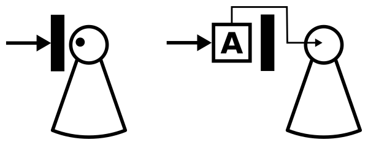

---
list-of-figures:
  label: Figure
  title: List of Figures
list-of-tables:
  label: Table
  title: List of Tables
cite:
  title: List of Sources
footnotes:
  title: Footnotes
abbreviations:
  title: List of Abbreviations
---

<!-- prettier-ignore -->
*[EN]: European Standard (Europäische Norm)
*[ISO]: International Organization for Standardization

# Classification of the Tools

## Classification According to ISO 9999

Based on the “_Nordic Classification System for Aids for Disabled Persons_”, a comprehensive internationally valid classification system for technical aids for disabled persons was created by the standard ISO $9999$ “_Technical aids for disabled persons – Classification_” (adopted into the European body of standards under EN ISO $9999$).
The ISO $9999$ standard divides aids into three hierarchical levels: _Classes_, _Subclasses_ and _Divisions_.
On the top hierarchy, $10$ classes (_Classes_) are distinguished and assigned a code.
To have place for later additions, so far only every third code was assigned (<<tab:classes-iso-9999>>).

| Class | Designation                                                               |
| ----- | ------------------------------------------------------------------------- |
| $03$  | Aids for therapy and training                                             |
| $06$  | Orthoses and prostheses                                                   |
| $09$  | Aids for personal care and protection                                     |
| $12$  | Aids for personal mobility                                                |
| $15$  | Aids for household management                                             |
| $18$  | Furnishings and adaptations of dwellings and other premises               |
| $21$  | Aids for communication, information and signaling                         |
| $24$  | Aids for handling products and goods                                      |
| $27$  | Auxiliaries and devices for improving the environment, tools and machines |
| $30$  | Aids for recreation                                                       |

.classes-iso-9999#Classes of ISO $9999$

Example of classification of a telephone hearing amplifier coded $21$ $36$ $21$ (<<tab:example-classification-iso-9999>>).

<table>
  <tr>
    <th scope="row">Class</th>
    <td><MathML formula="21"/></td>
    <td>Aids for communication, information and signalling</td>
  </tr>
  <tr>
    <th scope="row">Subclass</th>
    <td><MathML formula="36"/></td>
    <td>Telephones an telephoning aids</td>
  </tr>
  <tr>
    <th scope="row">Division</th>
    <td><MathML formula="21"/></td>
    <td>Receiver amplifiers</td>
  </tr>
</table>

.example-classification-iso-9999#Example of classification according to ISO $9999$.

For our considerations, the class $21$ is of particular importance.
It is described in more detail in <<tab:example-technical-classification-iso-9999>> by means of some examples.

<table>
  <thead>
    <tr>
      <th colspan="2">Class</th>
      <th colspan="2">Subclass</th>
      <th colspan="2">Division (only <MathML formula="2"/> typical examples/subclass)</th>
    </tr>
  </thead>
  <tbody>
    <tr>
      <td rowspan="34"><MathML formula="21"/></td>
      <td rowspan="34">Aids for communication, information and signalling</td>
      <td rowspan="2"><MathML formula="03"/></td>
      <td rowspan="2">Optical aids</td>
      <td><MathML formula="03"/></td>
      <td>Spectacle lenses</td>
    </tr>
    <tr>
      <td><MathML formula="27"/></td>
      <td>Field-of-vision expanders</td>
    </tr>
    <tr>
      <td rowspan="2"><MathML formula="06"/></td>
      <td rowspan="2">Opto-electronic aids</td>
      <td><MathML formula="03"/></td>
      <td>Image-enlarging video systems</td>
    </tr>
    <tr>
      <td><MathML formula="06"/></td>
      <td>Character reading machines</td>
    </tr>
    <tr>
      <td rowspan="2"><MathML formula="09"/></td>
      <td rowspan="2">I/O devices and accessories for computers, typewriters and calculators</td>
      <td><MathML formula="07"/></td>
      <td>Alternative input devices</td>
    </tr>
    <tr>
      <td><MathML formula="15"/></td>
      <td>Devices for synthetic speech</td>
    </tr>
    <tr>
      <td rowspan="2"><MathML formula="12"/></td>
      <td rowspan="2">Computers</td>
      <td><MathML formula="03"/></td>
      <td>Desktop computers</td>
    </tr>
    <tr>
      <td><MathML formula="09"/></td>
      <td>Palm-top and pocket computers</td>
    </tr>
    <tr>
      <td rowspan="2"><MathML formula="15"/></td>
      <td rowspan="2">Typewriters and word processors</td>
      <td><MathML formula="12"/></td>
      <td>Manual Braille writers</td>
    </tr>
    <tr>
      <td><MathML formula="18"/></td>
      <td>Software for word processing</td>
    </tr>
    <tr>
      <td rowspan="2"><MathML formula="18"/></td>
      <td rowspan="2">Calculators</td>
      <td><MathML formula="06"/></td>
      <td>Electronic calculators</td>
    </tr>
    <tr>
      <td><MathML formula="12"/></td>
      <td>Software for calculation</td>
    </tr>
    <tr>
      <td rowspan="2"><MathML formula="24"/></td>
      <td rowspan="2">Aids for drawing and handwriting</td>
      <td><MathML formula="09"/></td>
      <td>Signature guides and stamps</td>
    </tr>
    <tr>
      <td><MathML formula="15"/></td>
      <td>Braille writing equipment</td>
    </tr>
    <tr>
      <td rowspan="2"><MathML formula="27"/></td>
      <td rowspan="2">Non-optical reading aids</td>
      <td><MathML formula="03"/></td>
      <td>Page turners</td>
    </tr>
    <tr>
      <td><MathML formula="06"/></td>
      <td>Book supports and book holders</td>
    </tr>
    <tr>
      <td rowspan="2"><MathML formula="30"/></td>
      <td rowspan="2">Audio recorders and receivers</td>
      <td><MathML formula="03"/></td>
      <td>Cassette tape recorders</td>
    </tr>
    <tr>
      <td><MathML formula="12"/></td>
      <td>Index tone generators</td>
    </tr>
    <tr>
      <td rowspan="2">33</td>
      <td rowspan="2">Television and video equipment</td>
      <td><MathML formula="03"/></td>
      <td>Television sets</td>
    </tr>
    <tr>
      <td><MathML formula="09"/></td>
      <td>Decoders for videotext</td>
    </tr>
    <tr>
      <td rowspan="2"><MathML formula="36"/></td>
      <td rowspan="2">Telephones and aids for telephoning</td>
      <td><MathML formula="10"/></td>
      <td>Visual telephones, Videophones</td>
    </tr>
    <tr>
      <td><MathML formula="21"/></td>
      <td>Receiver Amplifiers</td>
    </tr>
    <tr>
      <td rowspan="2"><MathML formula="39"/></td>
      <td rowspan="2">Sound transmission systems</td>
      <td><MathML formula="03"/></td>
      <td>Headphones</td>
    </tr>
    <tr>
      <td><MathML formula="24"/></td>
      <td>FM-systems</td>
    </tr>
    <tr>
      <td rowspan="2"><MathML formula="42"/></td>
      <td rowspan="2">Face-to-face communication aids</td>
      <td><MathML formula="06"/></td>
      <td>Letter and/or symbol boards</td>
    </tr>
    <tr>
      <td><MathML formula="12"/></td>
      <td>Voice generators</td>
    </tr>
    <tr>
      <td rowspan="2"><MathML formula="45"/></td>
      <td rowspan="2">Hearing aids</td>
      <td><MathML formula="03"/></td>
      <td>In-the-ear hearing aids</td>
    </tr>
    <tr>
      <td><MathML formula="15"/></td>
      <td>Tactile hearing aids</td>
    </tr>
    <tr>
      <td rowspan="2"><MathML formula="48"/></td>
      <td rowspan="2">Aids for signalling and indicating</td>
      <td><MathML formula="12"/></td>
      <td>Light indicators</td>
    </tr>
    <tr>
      <td><MathML formula="21"/></td>
      <td>Computer signal indicators</td>
    </tr>
    <tr>
      <td rowspan="2">51</td>
      <td rowspan="2">Alarm systems</td>
      <td><MathML formula="06"/></td>
      <td>Attack alarms for epileptics</td>
    </tr>
    <tr>
      <td><MathML formula="15"/></td>
      <td>Monitoring systems</td>
    </tr>
    <tr>
      <td rowspan="2"><MathML formula="54"/></td>
      <td rowspan="2">Books and reading materials</td>
      <td><MathML formula="03"/></td>
      <td>Talking books</td>
    </tr>
    <tr>
      <td><MathML formula="09"/></td>
      <td>Braille books and materials</td>
    </tr>
  </tbody>
</table>

.example-technical-classification-iso-9999#Examples of classification of technical aids according to ISO $9999$ (EN ISO $9999$).

## Classification According to the Mode of Action

### Augmentative (Reinforcing) Aids

By this we mean aids that amplify a stimulus (an action) in such a way that it can also be perceived (performed) by an organ whose performance is reduced.
<<fig:function-wise-augmentative-aids>> clarifies the mode of operation with an example.
The incoming sensory stimulus can be perceived by the disabled person only in an attenuated form because of damage to the sensory organ in question.
The task of the aid marked A is to amplify the incoming stimulus in a suitable way so that it can be perceived with the same intensity as a non-disabled person would have perceived it.
Examples of augmentative aids are hearing aids and eyeglasses.

 aid. [@zagler:2008].")

### Substituting (Replacing) Aids

<!-- FIXME: Verweis -->

Substituting means aids with which a stimulus is diverted to other than the otherwise usual sensory organs.
The same applies when an action (movement or triggering of a movement) is obtained from other than the otherwise usual actuatory organs.
In this case, a substitution = [vicariate](#the-vicariate) occurs.
<<fig:function-wise-substiuating-aids>> shows a person in whom the perception of optical stimuli is not possible due to blindness.
The aid A shown in the middle diagram suitably converts the optical stimulus into an acoustic stimulus and directs it to the hearing of the blind person.
Similarly, the right plot of <<fig:function-wise-substiuating-aids>> shows the conversion to a tactilely perceptible stimulus.
Examples of substituting aids include the use of Braille, which is read with the fingertips instead of the eyes, and lip-reading, in which the eyes perform tasks that are usually performed by the ears.

 aid [@zagler:2008].")

### Inserting Tools

By this we mean aids that replace or bridge an interrupted part of a functional chain, but return the stimulus (action) to the original organ or its neural pathways.
The graphic in <<fig:functionally-inserting-auxiliary-aids>> represents a person who, because of a complete functional failure of the sensory organ in question, is unable to perceive a stimulus, whether it is offered in the usual way or in an amplified way.
The function of the aid A is to guide the stimulus around the defective area in such a way that, by stimulating the nerve pathways lying later, an impression is produced which is as close as possible to the effects of the original stimulus.
Examples of inserting aids are cochlear implants and functional electrical stimulation.

## The Vicariate

By a vicariate (substitution) we mean all measures in which a function that has failed due to damage is replaced by another.
In this case, the tool has the task of executing the appropriate transformation as an interface to the environment.

### Sensory Vicariate

Sensory vicariance is the replacement of one failed sensory organ by another.
<<fig:mode-of-action-sensory-vicariate>> illustrates this by means of damage to the eyes, as a result of which visual stimuli can no longer be perceived.
The aid marked “A” in the picture has the task of converting the visual stimulus (the optical signal from the environment) into a tactile stimulus (accessible to the sense of touch).

 [@zagler:2008].")

Since the performance of the individual sense organs (the bandwidth in the broadest sense) and also the type of perception that takes place via them varies greatly, the tool must attempt to convey as much relevant information as possible.
<<tab:bandwidths-human-sense-organs>> shows a comparison of the “bandwidths” of the individual sense organs.
From this it can be seen what limitations must be expected in the use of vicariates.
Smell and taste are therefore not considered for vicariates.
Thermal stimuli also provide only small bandwidths.

| Sense Organ    | Bandwidth in $\sf{bit/s}$ |
| -------------- | ------------------------- |
| Vision (Eye)   | $106\;\sf{bit/s}$         |
| Hearing (Ear)  | $104\;\sf{bit/s}$         |
| Touch (Skin)   | $102\;\sf{bit/s}$         |
| Smell (Nose)   | $\lt10\;\sf{bit/s}$       |
| Taste (Tongue) | $\lt10\;\sf{bit/s}$       |

.bandwidths-human-sense-organs#Bandwidths of the human sensory organs [@kokjer:1987, @way:1997].

### Actuatory Vicariate

Actuatory vicariate is effective in the opposite direction, i.e. from the person to the environment.
<<fig:mode-of-action-actuatory-vicariate>> shows this on the basis of damage (absence) of the upper extremities, according to which the person is not able to lift the weight.
In this example, the assumed assistive device (aid) A receives voice commands and controls a lifting device.

. [@zagler:2008].")

!!!include(general/attribution.en.md)!!!
