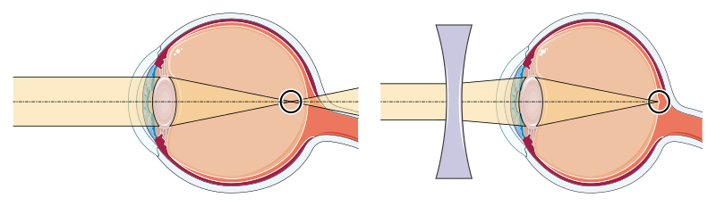
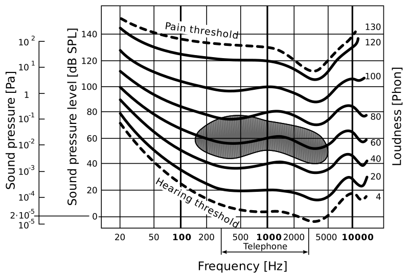
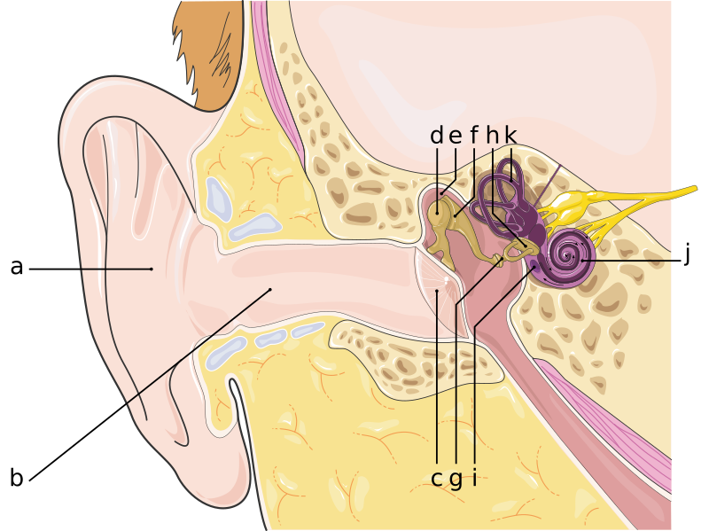
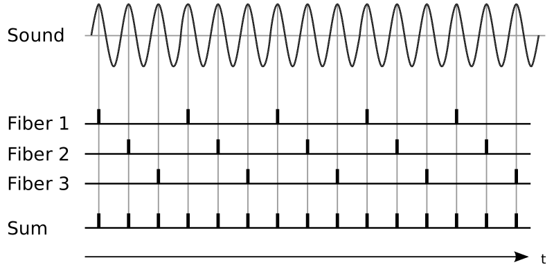
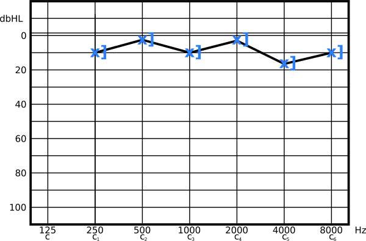
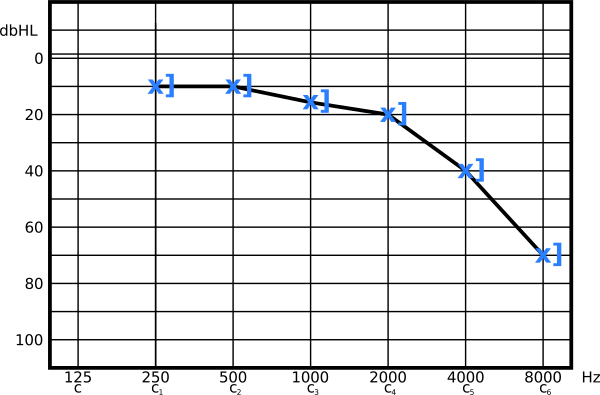

---
list-of-figures:
  label: Abbildung
  title: Abbildungsverzeichnis
list-of-tables:
  label: Tabelle
  title: Tabellenverzeichnis
cite:
  title: Quellenverzeichnis
footnotes:
  title: Fußnoten
abbreviations:
  title: Abkürzungsverzeichnis
---

<!-- prettier-ignore -->
*[ALS]: Amyotrophic lateral sclerosis
*[CP]: Cerebral palsy
*[CVA]: Cerebral vascular accident
*[d. h.]: das heißt
*[d. s.]: das sind
*[engl.]: englisch
*[grie.]: griechisch
*[IHC]: Inner hair cells
*[MCD]: Minimal cerebral dysfunction
*[MCP]: Minimal cerebral palsy
*[MS]: Multiple Sklerose
*[lat.]: lateinisch
*[OHC]: Outer hair cells
*[PC]: Pacini corpuscles
*[PKW]: Personenkraftwagen
*[RA]: rapidly adapting
*[RP]: Retinopathia pigmentosa
*[SA]: slowly adapting
*[SHT]: Schädelhirntrauma
*[SPL]: Sound Pressure Level
*[TBI]: Traumatic brain injury
*[u. a.]: unter anderem
*[z. B.]: zum Beispiel
*[ZNS]: Zentralnervensystem

# Medizinische Grundlagen – Teil I

<!-- FIXME: citation numbering (markdown-it core chain) -->

Bei der Beschreibung der [Ziele und Aufgaben der Rehabilitationstechnik](chapter4.html#ziele-der-rehabilitationstechnik) wurde klar gemacht, dass zwischen Medizintechnik und Rehabilitationstechnik vor allem der Unterschied besteht, dass technische Hilfsmittel nicht auf Heilung abzielen (können) und Rehabilitationstechnik daher nicht bei der Erkrankung oder Schädigung sondern erst bei der Fähigkeitsstörung und der (sozialen) Beeinträchtigung ansetzt (<<fig:medizintechnik-rehabilitationstechnik>>, [@zagler:2008]).

 Beeinträchtigung [@zagler:2008].")

<!-- FIXME: footnote numbering/template -->

Das Diagramm <<fig:medizintechnik-rehabilitationstechnik>> zeigt aber auch, dass jede Behinderung in irgendeiner Weise eine „medizinische Vorgeschichte“ hat.
Für den Techniker / die Technikerin ist es also wichtig, bei der Auswahl technischer Maßnahmen auch die medizinische Vorgeschichte lesen und verstehen zu können.
Daher werden in diesem Kapitel die zum Verständnis der Rehabilitationstechnik wichtigsten medizinischen (anatomischen und physiologischen) Grundlagen, vor allem in Bezug auf Nervensystem, Sinnesorgane und Bewegungsapparat, besprochen[^4].
Im Anhang befindet sich darüber hinaus ein Glossar mit den medizinischen Grundbegriffen und den Bezeichnungen für Schädigungen, die zu Fähigkeitsstörungen und Beeinträchtigungen führen.

[^4]: Einige Teile dieses Kapitels wurden mit geringfügigen Änderungen der Diplomarbeit von Angela Zagler: „Menschliche visuelle Wahrnehmung und ihre maschinelle Substitution für sehbehinderte Menschen“ [@zagler:1997] entnommen.

## Das Nervensystem

### Anatomie der Nervenzelle

Die typische Nervenzelle, das Neuron, besteht aus dem rundlichen Zellkörper, der bis über einen Meter langen fadenförmigen Nervenfaser (Axon) und einer Fülle von sich verästelnden Fortsätzen, den sogenannten Dendriten (maximal wenige Millimeter lang).
Die Nervenzelle kann Informationen über den Zellkörper und die Dendriten empfangen, das Axon ist für die Weiterleitung von Information zu anderen Neuronen verantwortlich (<<fig:aufbau-nervenzelle>>).

Die Stelle, an der Information von einer Nervenzelle auf die andere übergeben wird, heißt Synapse.
Dort nähert sich ein Axon (bzw. die am Ende eines Axons auftretenden Verzweigungen) einem anderen Zellkörper oder den Dendriten einer Nervenzelle bis auf $0.02\;\sf{\mu~m}$.
Über diesen Spalt hinweg erfolgt die Informationsweitergabe durch einen chemischen Prozess (Ausschüttung von Neurotransmittern).

 [@servier-medical-art:2019, @maelicke:1990].")

In der Regel erfolgt die Informationsweitergabe in der Form von kurzen Impulsen.
Je stärker ein Neuron erregt ist, desto höher wird seine Impulsrate.
Man sagt auch, dass das Neuron „feuert“ bzw. es erzeugt Aktionspotentiale.
Die Stärke der Erregung des Neurons drückt sich also nicht in der Höhe des Aktionspotentials (also nicht in der Amplitude), sondern durch die Frequenz aus, mit der die Nervenzelle feuert[^5].
Die Impulsfrequenz einer Nervenzelle im Ruhezustand liegt bei einem Impuls in mehreren Sekunden (sog. spontane Entladung) und kann bei starker Erregung fast bis zu $1\;\sf{kHz}$ betragen.

[^5]: Allerdings gibt es besonders bei den Rezeptor-Zellen der Netzhaut wiederum Ausnahmen von dieser Regel.

### Reizleitung und Aktionspotential

Vereinfacht kann man sich das Axon als einen an den Zellkörper angeschlossenen Schlauch vorstellen, der von einer wässerigen Salzlösung umgeben und ausgefüllt ist.
In dieser Lösung kommen vor allem Chlorid-, Kalium-, Natrium- und Kalzium-Ionen (Cl-, K+, Na+ und Ca++) vor.
Zufolge unterschiedlicher Ionenkonzentrationen innerhalb und außerhalb des Axons kommt es bei der ruhenden Zelle zu einem Potentialunterschied (Ruhepotential) von rund $70\;\sf{mV}$ (außen positiv).

Die Membran, die die gesamte Nervenzelle, also auch das Axon, umgibt, weist eine äußerst komplexe Struktur mit Millionen von Poren auf.
Das Besondere daran ist, dass es unterschiedliche Poren für den Transport der einzelnen in der wässerigen Lösung vorkommenden Ionen gibt (z. B. solche, die, wenn sie geöffnet werden, nur Na-Ionen durchlassen, während andere wiederum auf K- oder Ca-Ionen spezialisiert sind).
Diese Poren können nun nicht nur geöffnet oder geschlossen werden, sondern auch wie Pumpen funktionieren, die eine bestimmte Art von Ionen von einer Seite der Membran auf die andere transportieren können.

Durch die oben erwähnten Pumpen ist es nun möglich, Ionen einer bestimmten Art von einer Seite der Membran auf die andere zu befördern.
In diesem ersten Schritt kommt es zwar nicht zur Bildung eines Potentialunterschiedes (denn für jedes nach außen transportierte Ion der einen Art, wird ein Ion der anderen Art nach innen befördert), jedoch zu einer Veränderung der Ionenkonzentrationen einer bestimmten Art zu beiden Seiten der Membran.
Werden nun in einem zweiten Schritt Poren, die nur für eine bestimmte Ionenart durchlässig sind, geöffnet, werden Ionen dieser Art gemäß ihres Konzentrationsgefälles auf die andere Seite diffundieren, ohne dass andere Ladungsträger in die Gegenrichtung wandern können.
Damit baut sich eine Potentialdifferenz auf, die der Ionenbewegung entgegenwirkt, bis das System aus Konzentrationsgefälle und Potentialdifferenz bei $70\;\sf{mV}$ in einen Gleichgewichtszustand eintritt[^6].

[^6]: In mancher Hinsicht erinnert das an die Verhältnisse an einer Halbleiter-Sperrschicht, nur dass hier nicht Elektronen und Löcher als Ladungsträger vorkommen, sondern verschiedene Arten von positiv geladenen Ionen, die sich in einem Konzentrationsgefälle bewegen und deren Bewegungen durch das Öffnen und Schließen selektiv wirkender Poren gesteuert werden können.

Die Verhältnisse bei einer ruhenden Nervenzelle können wie folgt beschrieben werden: Durch die „Pumpen“ wird außerhalb der Zelle die Natrium-Ionen Konzentration und im Inneren die Kalium-Ionen Konzentration erhöht und die Poren für die Kalium-Ionen Diffusion geöffnet.
Das bewirkt daher, dass Kalium-Ionen solange von innen nach außen diffundieren, bis sich außen eine so hohe positive Ladung aufgebaut hat, dass wegen der abstoßenden Kräfte keine weiteren Kalium-Ionen mehr nach außen diffundieren können.

Die Signalübertragung entlang eines Axons durch ein Aktionspotential beginnt damit, dass an einer Stelle des Axons plötzlich die Natrium-Poren geöffnet werden.
Da die Natrium-Ionen Konzentration außen höher ist als innen, wandern zahlreiche Natrium-Ionen in das Innere der Nervenzelle, sodass
sich an dieser Stelle die Potentialverhältnisse umkehren, also die Innenseite positiv gegenüber der Außenseite wird – die Membran „depolarisiert“.
Innerhalb von $10^{-3}\;\sf{s}$ werden durch Schließen der Natrium-Poren und verstärktem Öffnen der Kalium-Poren die ursprünglichen Verhältnisse (außen positiv) wieder hergestellt (<<fig:reizleitung-axon>>).

Ohne jetzt zu sehr ins Detail zu gehen, ist zum Verständnis der Informationsweiterleitung im Axon noch wichtig anzumerken, dass es erstens eine Rückwirkung der Potentialverhältnisse auf das Öffnen und Schließen der verschiedenen Arten von Poren gibt (die Depolarisation bewirkt das Öffnen von Poren, wobei sich allerdings die Natrium-Poren von selbst wieder schließen) und dass sich zweitens die Natrium-Poren nach einer erfolgten Depolarisation nicht sofort wieder öffnen können (Sperrzeit von etwa $1\;\sf{ms}$).
Beide Effekte zusammen bewirken, dass beim Auftreten einer Depolarisation das Aktionspotential (beginnend vom Zellkörper) das Axon in einer vorgegebenen Richtung entlangläuft, und zwar mit einer Geschwindigkeit, die zwischen $0.1$ bis $10\;\sf{m/s}$ liegt.
Schnell leitende Nervenfasern sind zur Herabsetzung der Kapazitäten von einer Myelinscheide umgeben, die in Abständen von ca. $1\;\sf{mm}$ durch die sogenannten Ranvier-Schnürringe unterbrochen ist (siehe auch <<fig:aufbau-nervenzelle>>).
Dabei springt die Depolarisation von Schnürring zu Schnürring und kann sich dadurch schneller ausbreiten.
Die Rate, mit der eine sehr aktive Nervenzelle feuern kann, liegt üblicherweise bei $200\;\sf{Hz}$, die absolut oberste Grenze wird mit $800\;\sf{Hz}$ angegeben.

### Die Synapse

Sobald der Reiz das Ende des Axons erreicht hat, kommt es zur Weiterleitung der Information an andere Nervenzellen.
Auch hier spielen wiederum spezielle Poren eine Rolle, die sich bei der Depolarisation der Membran für Kalzium-Ionen öffnen, die dann in das Innere des Axons eindringen (die Ca++ Konzentration ist außerhalb des Axons größer als in seinem Inneren).

Durch das Einströmen der Kalzium-Ionen werden im Inneren der Axon-Endung chemische Verbindungen (sogenannte Neurotransmitter) freigesetzt, die durch die Membran und auch über den $20\;\sf{nm}$ breiten synaptischen Spalt zur nächsten Nervenzelle (postsynaptische Zelle) diffundieren.
Dort bewirken diese Substanzen das Öffnen von bestimmter Arten von Poren.
Reagiert die postsynaptische Zelle auf den Neurotransmitter mit dem Öffnen von Natrium-Poren, wird eine Depolarisation eingeleitet – die Nervenzelle wird also erregt und wir sprechen dann von einer exzitatorischen (erregende) Synapse.
Umgekehrt kann die postsynaptische Zelle auf die Ausschüttung eines Neurotransmitters auch mit dem Öffnen von Kalium-Poren antworten, was eine Stabilisierung der Zelle bewirkt.
In diesem Fall liegt eine inhibitorische (hemmende) Synapse vor.

Da jede Nervenzelle über ihre Dendriten mit den Axonen Hunderter (bis Tausender) anderer Nervenzellen in synaptischer Verbindung steht, ist ihr eigener Erregungszustand das Ergebnis aus der Summe aller auf sie einwirkenden exzitatorischen und inhibitorischen Reize.
Diese Bündelung oder Summierung der Reize vieler Nervenzellen auf eine einzige nennt man Konvergenz.
Die Verzweigung eines Axons, die es ermöglicht, dass eine Nervenzelle ihre Information auf Hunderte oder Tausende andere nachfolgende Nervenzellen überträgt, nennt man Divergenz.
Diese aus Konvergenz und Divergenz gebildete Vernetzung macht die enorme Fähigkeit des Nervensystems aus.

### Nervenbahnen

1. Die Input-Kanäle: Rezeptoren  
   Unter Input können wir alle jene Signale aus der Umwelt (und dem Körperinneren) zusammenfassen, die eine Wirkung auf spezielle Nervenzellen ausüben, die wir Rezeptoren nennen.
   Im Gegensatz von Nervenzellen, die sich irgendwo im Verlauf einer Nervenbahn befinden und ihre Signale daher über Synapsen von vorgeschalteten Neuronen empfangen, reagieren die Rezeptoren auf äußere Reize.
   Über Rezeptorzellen verfügen zunächst einmal die fünf klassischen Sinne des Menschen:

   - Optische Rezeptoren im Auge für das Sehen
   - Akustische/mechanische Rezeptoren für das Hören
   - Chemische Rezeptoren für Geruchs- und
   - Geschmackssinn
   - Mechanische Rezeptoren für den Tastsinn

   Neben diesen fünf Sinnen erhält unser Nervensystem weiteren Input von:

   - Mechanischen Reizen aus dem Gleichgewichtsorgan.
   - Thermischen Reizen über die Haut.
   - Propriozeption aus Gelenken, Sehnen und Muskeln, wodurch die Stellung der Gliedmaßen und die aufgewendete Kraft wahrgenommen werden.
   - Nozizeption für die Wahrnehmung von Schmerz.

   Alle diese Rezeptorzellen dienen der Umwandlung einer bestimmten Messgröße in elektrische Signale (Aktionspotentiale), die wiederum an den Axon-Endungen zur Ausschüttung von Neurotransmittern und somit zur Erregung nachfolgender Nervenzellen führen.
   Die Stärke des auf die Rezeptorzelle einwirkenden Reizes bestimmt die Rate, mit der diese Zelle „feuert“.

1. Die Output-Kanäle: Motoneuronen  
   Während die physikalischen Größen, für die dem Menschen Sensoren (sprich Rezeptoren) zur Verfügung stehen, recht vielfältig sind (optische, akustische, mechanische, thermische, und chemische Sensoren), ist der Output strenggenommen auf rein mechanische Kanäle beschränkt.

   Man mag an dieser Stelle vielleicht zu Recht einwenden, dass dem Menschen neben seinen Körperbewegungen schließlich auch noch die Stimme (Sprache) als Outputkanal zu Verfügung steht.
   Von der Warte des Nervensystems aus betrachtet handelt es sich aber bei der Stimme letztendlich auch „nur“ um das Zusammenwirken von rein motorischen Größen wie Spannung der Stimmbänder, Artikulation durch die Formung des vokalen Traktes (Mund und Rachen) sowie motorische Beeinflussung der Atemluft.

   Jene Nervenzellen, die am Ende des Output-Kanals für die Stimulation von Muskelfasern sorgen, werden motorische Neuronen oder kurz Motoneuronen genannt.

   Stark vereinfacht lässt sich das gesamte Nervensystem wie folgt darstellen (<<fig:gesamtdarstellung-nervensystem>>):

   

   Im obigen Diagramm (<<fig:gesamtdarstellung-nervensystem>>) befinden sich links die Rezeptorzellen, also jene Gattung von Nervenzellen, über die alle Eindrücke aus der Umwelt empfangen werden.
   Diese sensorischen Neuronen stellen die erste Stufe einer Nervenbahn dar, die über synaptische Kontakte mit den Neuronen der nächstfolgenden Ebene verbunden sind.
   So geht es von Ebene zu Ebene bis in die tieferen Schichten des Gehirns weiter.

   Das obige Diagramm macht außerdem deutlich, dass die Neuronen einer bestimmten Ebene ihre Information sowohl von mehreren vorangehenden Nervenzellen erhalten (Konvergenz) als auch ihrerseits auf viele nachfolgende Nervenzellen weiterleiten (Divergenz).

   Die aus [@hubel:1989] entnommene Zeichnung macht aber auch eine ehrliche Aussage zum Stand des derzeitigen Wissens: Sowohl über die sensorischen Nervenbahnen und deren erste Ebenen auf dem Weg zu den tieferen Schichten des Gehirns als auch über das motorische Nervensystem sind viele Fakten und Funktionen bekannt.
   Dazwischen liegt aber nach wie vor ein großer Bereich, über dessen Funktion noch so gut wie keine Aussagen gemacht werden können.
   {.lower-alpha}

### Die Hirnnerven

Im Bereich des Kopfes zweigen aus dem Zentralnervensystem (ZNS) $12$ Hirnnerven (-paare) ab, die in der medizinischen Literatur üblicherweise mit römischen Ziffern bezeichnet werden.
In <<tab:namen-funktionen-hirnnerven>> sind die Namen und die wichtigsten Versorgungsgebiete bzw. Funktionen der Hirnnerven zusammengefasst.

<!-- FIXME: check V, V1,V2,V3 -->

<table>
    <thead>
        <tr>
            <th colspan="2">Nummer</th>
            <th>Name</th>
            <th>Versorgungsgebiet/Funktion</th>
        </tr>
    </thead>
    <tr>
        <td colspan="2">I</td>
        <td>Riechbahn (Tractus olfactorius)</td>
        <td>Axone der Riechzellen der Nase, gesamte Geruchsempfindung</td>
    </tr>
    <tr>
        <td colspan="2">II</td>
        <td>Sehnerv (Nervus opticus)</td>
        <td>Gesamte visuelle Wahrnehmung</td>
    </tr>
    <tr>
        <td colspan="2">III</td>
        <td>Nervus oculomotoricus</td>
        <td>
            <ul class="no-bullets no-padding no-ident">
                <li>Augenlinse (Ziliarmuskel),</li>
                <li>Iris (Pupillenmuskel)</li>
                <li>Oberlid (Heber des Oberlids)</li>
                <li>Augenbewegungen</li>
            </ul>
        </td>
    </tr>
    <tr>
        <td colspan="2">IV</td>
        <td>Nervus trochlearis</td>
        <td>Augenbewegung</td>
    </tr>
    <tr>
        <td rowspan="4">V</td>
        <td></td>
        <td>Trigeminus Nerv (Nervus trigeminus)</td>
        <td></td>
    </tr>
    <tr>
        <td rowspan="2">V1, V2, V3</td>
        <td>Radix sensoria & sensorischer Teil des Nervus trigeminus bestehend aus:</td>
        <td></td>
    </tr>
    <tr>
        <td>
            <ul class="no-bullets no-ident no-padding no-wrap">
                <li>Nervus ophthalmicus (V1)</li>
                <li>Nervus maxillaris (V2)</li>
                <li>Nervus mandibularis (V3)</li>
            </ul>
        </td>
        <td>
            <ul class="no-bullets no-ident no-padding">
                <li>u. a. Stirn, Oberlid, Nasenrücken</li>
                <li>u. a. Unterlid, Wange, Oberlippe</li>
                <li>u. a. Zunge, Unterlippe, Kinn</li>
            </ul>
        </td>
    </tr>
    <tr>
        <td>V4</td>
        <td>Radix motorica (motorischer Teil des Nervus Trigeminus, folgt N. mandibularis)</td>
        <td>Kaumuskulatur, Gaumen, Mundboden, Ohrtrompete</td>
    </tr>
    <tr>
        <td colspan="2">VI</td>
        <td>Nervus abducens</td>
        <td>Augenbewegung (Abduction)</td>
    </tr>
    <tr>
        <td colspan="2">VII</td>
        <td>Nervus facialis</td>
        <td>u. a. mimische Muskulatur, Mittelohrmuskeln, Unterkiefermuskulatur, Sekretion der Tränen- und Speicheldrüsen, Geschmacksfasern der vorderen <MathML formula="2/3"/> der Zunge</td>
    </tr>
    <tr>
        <td colspan="2">VIII</td>
        <td>Hör- und Gleichgewichtsnerv (Nervus vestibulo-cochlearis)</td>
        <td>Cochlea und Vestibularapparat (Gleichgewichtsorgan)</td>
    </tr>
    <tr>
        <td colspan="2">IX</td>
        <td>Nervus glossopharyngeus</td>
        <td>Gaumen- und Rachenmuskulatur, Geschmacksfasern des hinteren <MathML formula="1/3"/> der Zunge</td>
    </tr>
    <tr>
        <td colspan="2">X</td>
        <td>Nervus vagus</td>
        <td>u. a. Kehlkopf, Brust- und Bauchorgane</td>
    </tr>
    <tr>
        <td colspan="2">XI</td>
        <td>Nervus accessorius</td>
        <td>u. a. Kopfbewegungen, Schulterblatt, Heben des Oberarms über Horizontale</td>
    </tr>
    <tr>
        <td colspan="2">XII</td>
        <td>Nervus hypoglossus</td>
        <td>Zungenmuskulatur</td>
    </tr>
</table>

.namen-funktionen-hirnnerven#Namen und wichtigste Funktionen der Hirnnerven [@pschyrembel:1989].

Die Hirnnerven spielen in der Rehabilitationstechnik deshalb eine besondere Rolle, weil sie selbst von hoch liegenden Querschnittlähmungen nicht betroffen sind und die Funktionen, mit denen sie im Zusammenhang stehen, nicht verloren gehen.

## Auge und visuelle Wahrnehmung

### Aufbau des Auges

Das Sinnesorgan zur Wahrnehmung optischer Reize ist das Auge.
Der menschliche Augapfel (Bulbus) ist kugelförmig und hat einen Durchmesser von ca. $25\;\sf{mm}$.
Der aus einer durchsichtigen, gallertartigen Substanz bestehende Glaskörper (Corpus vitreum), der den gesamten Innenraum ausfüllt, wird von drei Hautschichten umgeben und in seiner Form gehalten (<<fig:schnitt-menschliches-auge>>).

Die äußerste Augenhaut, die Lederhaut (Sclera), weist nur geringe Elastizität auf und ist für die Formgebung verantwortlich.
Im vorderen Teil des Auges geht die Lederhaut vor der Linse in die durchsichtige Hornhaut (Cornea) über.

Die mittlere Schicht setzt sich aus drei Abschnitten zusammen.
Drei Viertel des Augapfels umschließt die von zahlreichen Gefäßen durchzogene Aderhaut (Choroidea).
Vorne, um die Linse herum, geht die Aderhaut in den Strahlenkörper (Corpus ciliare) über, der den Ziliarmuskel enthält, welcher durch Veränderung der Krümmung der Linse für die Akkommodation (Scharfstellung) sorgt.
Im Strahlenkörper wird auch das Kammerwasser gebildet.
Das Verhältnis aus Produktion und Resorption des Kammerwassers bestimmt den Augeninnendruck.
Noch weiter vorne schließt sich die Regenbogenhaut (Iris) an, die durch Veränderung des Sehlochs (Pupille; lat. Pupilla) die in das Auge einfallende Lichtmenge bestimmt („Irisblende“ in der Fotografie).

Die innerste, auf dem Glaskörper aufliegende Augenhaut ist die Netzhaut (Retina), die wiederum aus mehreren Schichten besteht.

### Die Netzhaut

Die Netzhaut ist sowohl Träger der Fotorezeptoren als auch mehrerer Nervenschichten, die eine erste Verarbeitung der visuellen Reize vornehmen.
Sie ermöglicht die Wahrnehmung von Intensität, Wellenlänge und räumlicher Zuordnung einfallender optischer Reize.

<!-- FIXME: schwarz/weiß (hell/dunkel) -->

Die Erfassung der optischen Reize beginnt in der dem Licht abgewandten Schicht der Netzhaut, die die Fotorezeptoren trägt („inverses“ Auge).
Die ca. $120\;\sf{Mio.}$ Stäbchen (engl. rods) ermöglichen das schwarz/weiß (hell/dunkel) Sehen, während die auf drei unterschiedliche Wellenlängen ausgelegten
$6\;\sf{Mio.}$ Zäpfchen (engl. cones) der Farbwahrnehmung dienen (<<fig:schnitt-netzhaut>>).

Der vom Auge abgedeckte Spektralbereich reicht von $350\;\sf{nm}$ (blau) bis $750\;\sf{nm}$ (rot), mit einer maximalen Gesamt-Empfindlichkeit bei $560\;\sf{nm}$ (grün).
Die Maxima der spektralen Empfindlichkeiten für die drei Typen von Zäpfchen liegen bei $560\;\sf{nm}$ (gelb-grün), $530\;\sf{nm}$ (blau-grün) und $430\;\sf{nm}$ (violett).
Vereinfacht wird oft von „blauen“, „grünen“ und „roten“ Zäpfchen gesprochen.
Von allen in der Netzhaut vorkommenden Zäpfchen sind rund $46\%$ rot, $46\%$ grün, aber nur $8\%$ blau [@bright:1997].
Die Stäbchen erreichen ihr spektrales Maximum bei $510\;\sf{nm}$ und leisten keinen Beitrag zur Farbwahrnehmung (<<fig:spektrales-verhalten-zaepfchen>>).

### Intensitätsbereich und Adaptation

Der Intensitätsbereich, in dem das Auge Reize verarbeiten kann, erstreckt sich über einen Bereich von $1:10^{12}$ (<<tab:empfindlichkeit-staebchen-zaepfchen>>) und wird durch verschiedene Mechanismen der Adaptation bewältigt:

- Verwendung von zwei unterschiedlich empfindlichen Rezeptor-Typen (Stäbchen und Zäpfchen)
- Veränderung der einfallenden Lichtmenge durch die Pupille (Verhältnis $1:16$ – schneller Vorgang[^7])
- Aufbau und Abbau von Sehfarbstoff in den Rezeptoren (langsam)
- Adaptive räumliche und zeitliche Reizintegration in der Netzhaut.

[^7]: Dieser Wert bezieht sich auf das jugendliche Auge; für die Verhältnisse im Alter siehe später.

Die Empfindlichkeit der Stäbchen ist etwa $2\:000$ mal höher als die der Zäpfchen.
Bei geringen Leuchtdichten (Dämmerung) liefern die Zäpfchen daher keinen Beitrag, was zur Folge hat, dass die Farbwahrnehmung nur bei ausreichender Beleuchtung möglich ist.

<table>
  <thead>
    <tr>
      <th scope="row">Beleuchtungsstärke [lx]</th>
      <td style="padding: 2px 6px;"><MathML formula="10^{-5}"/></td>
      <td style="padding: 2px 6px;"><MathML formula="10^{-4}"/></td>
      <td style="padding: 2px 6px;"><MathML formula="10^{-3}"/></td>
      <td style="padding: 2px 6px;"><MathML formula="10^{-2}"/></td>
      <td style="padding: 2px 6px;"><MathML formula="10^{-1}"/></td>
      <td style="padding: 2px 6px;"><MathML formula="10^{0}"/></td>
      <td style="padding: 2px 6px;"><MathML formula="10^{1}"/></td>
      <td style="padding: 2px 6px;"><MathML formula="10^{2}"/></td>
      <td style="padding: 2px 6px;"><MathML formula="10^{3}"/></td>
      <td style="padding: 2px 6px;"><MathML formula="10^{4}"/></td>
      <td style="padding: 2px 6px;"><MathML formula="10^{5}"/></td>
      <td style="padding: 2px 6px;"><MathML formula="10^{6}"/></td>
    </tr>
  </thead>
  <tbody>
    <tr>
      <th scope="row">Stäbchen</th>
      <td></td>
      <td></td>
      <td></td>
      <td></td>
      <td></td>
      <td></td>
      <td></td>
      <td style="background-color: black;"></td>
      <td style="background-color: black;"></td>
      <td style="background-color: black;"></td>
      <td style="background-color: black;"></td>
      <td style="background-color: black;"></td>
    </tr>
    <tr>
      <th scope="row">Zäpfchen</th>
      <td style="background-color: black;"></td>
      <td style="background-color: black;"></td>
      <td style="background-color: black;"></td>
      <td></td>
      <td></td>
      <td></td>
      <td></td>
      <td></td>
      <td></td>
      <td></td>
      <td></td>
      <td></td>
    </tr>
    <tr>
      <th scope="row">Bereich</th>
      <td colspan="3">skotopisch</td>
      <td colspan="4">mesopisch</td>
      <td colspan="5">photopisch</td>
    </tr>
  </tbody>
</table>

.empfindlichkeit-staebchen-zaepfchen#Absolute Empfindlichkeit von Stäbchen und Zäpfchen [@zagler:1997].

Fehlen durch eine Schädigung des Auges die Stäbchen[^8], ist nur Tagessehen (mesopisches und photopisches Sehen) möglich und es kommt zur Nachtblindheit (kein skotopisches Sehen).
Das Auge ist mit einer absoluten Intensitätsschwelle von $8\cdot10^{-18}\;\sf{W/cm^2}$ im Vergleich zum Ohr um den Faktor $10$ empfindlicher.

[^8]: Da im peripheren Bereich der Retina fast ausschließlich Stäbchen vorkommen, führt ein Ausfall dieses Rezeptortyps neben der Nachtblindheit auch zum Verlust des peripheren Gesichtsfeldes, es kommt zum sogenannten Tunnelblick.

### Räumliches Auflösungsvermögen

In einem Bereich von rund $\pm~1\degree$ Grad um jenen Punkt, an dem die optische Achse des Auges die Netzhaut trifft, liegt innerhalb des Gelben Flecks (Makula; lat. Macula) die Sehgrube (Fovea centralis; Fovea: lat. Grube).
In dieser Zone des schärfsten Sehens befinden sich fast nur Zäpfchen mit einer Dichte von $400\:000\sf{/mm^{2}}$ (Zum Vergleich: Ein Standard TV-Bild hat $520\:000$ Bildpunkte).
Hier sind die sonst über den Rezeptoren liegenden Nervenbahnen zum Rand der Makula hin verschoben und bilden den Makulawall, sodass das Licht direkt auf die Zäpfchen fallen kann.
Die Makula weist daher hohe räumliche Auflösung und gutes Farberkennen auf.
Wegen des Fehlens von Stäbchen ist skotopisches Sehen im Bereich der Fovea nicht möglich (die Fovea ist sozusagen „nachtblind“), weil aber die Zäpfchen nicht von andren Zellen bedeckt sind, ist die photopische Empfindlichkeit innerhalb der Fovea größer als an anderen Stellen der Netzhaut.

Eine Strecke von $1\,\sf{mm}$ auf der Netzhaut deckt ein Gesichtsfeld von $3.5\degree$ ab.
Im Bereich der Fovea centralis können Objekte im Abstand von $0.5$ bis $1$ Bogenminuten diskriminiert werden, was einem Abstand auf der Netzhaut von $2.5$ bis $5.0\,\sf{\mu}m$ entspricht.
Außerhalb der Fovea centralis beträgt die Auflösung nur rund $1\degree$ (entsprechend einer Strecke von $0.3\,\sf{mm}$).

### Akkommodation (Scharfstellung)

Die Scharfstellung des Auges (Akkommodation) erfolgt durch die Veränderung der Brechkraft der Linse.
Das fernakkommodierte Auge (Einstellung auf unendlich) hat eine Brechkraft von rund $60$ Dioptrien[^9] ($=17\sf{mm}$ Brennweite).
Bei maximaler Nahakkommodation (Einstellung auf $10\sf{cm}$) erhöht sich die Brechkraft um rund $12$ Dioptrien[^10].
Die genauen Werte für das sogenannte emmetrope (normalsichtige) Auge werden in der Literatur wie folgt angegeben (<<tab:brechkraft-emmetropes-auge>>):

[^9]: Dioptrie = Reziprokwert der (vorderen) Brennweite in Meter; Abkürzung dpt
[^10]: Gilt für das jugendliche Auge und ist stark vom Alter abhängig.

<table>
  <thead>
    <tr>
      <th>Zustand</th>
      <th>Ort</th>
      <th>Brechkraft [dpt]</th>
      <th>Brennweite [mm]</th>
    </tr>
  </thead>
  <tbody>
    <tr>
      <td rowspan="3">Akkommodationsruhe</td>
      <td>Hornhaut und Vorderkammer</td>
      <td><MathML formula="43.05\;\sf{dpt}"/></td>
      <td><MathML formula="23.23\;\sf{mm}"/></td>
    </tr>
    <tr>
      <td>Linse und Glaskörper</td>
      <td><MathML formula="19.11\;\sf{dpt}"/></td>
      <td><MathML formula="52.33\;\sf{mm}"/></td>
    </tr>
    <tr>
      <td>Gesamt (äquivalentes System)</td>
      <td><MathML formula="58.64\;\sf{dpt}"/></td>
      <td><MathML formula="17.05\;\sf{mm}"/></td>
    </tr>
    <tr>
      <td>Max. Akkommodation</td>
      <td>Gesamt (äquivalentes System)</td>
      <td><MathML formula="70.57\;\sf{dpt}"/></td>
      <td><MathML formula="14.15\;\sf{mm}"/></td>
    </tr>
  </tbody>
</table>

.brechkraft-emmetropes-auge#Brechkraft des emmetropen Auges [@methling:1996].

Die gesamte Brechkraft wird also etwa zu $2/3$ von Hornhaut und Vorderkammer und zu $1/3$ von Linse und Glaskörper aufgebracht.
Durch eine Kontraktion des Ziliarmuskels werden die Zonulafasern entspannt.
Die Linse wird zufolge ihrer Elastizität dicker, die Brechkraft wird erhöht und das Auge akkommodiert auf die Nähe (<<fig:augenlinse-und-akkommodation>>).

### Lidschlag

Das Augenlid dient dem Schutz und der Befeuchtung des Augapfels.
Der Lidschlag (Schießen des Oberlids) erfolgt entweder unwillkürlich-periodisch, willkürlich oder reflexartig.
Die Frequenz mit der der unwillkürliche Lidschlag erfolgt ist stark von der Person abhängig.
Als durchschnittlicher Richtwert gelten $15$ bis $16$ Lidschläge/min [@wilson:1996:a].
Die Lidschlagfrequenz nimmt bei lang andauernden Tätigkeiten mit hoher Sehanforderung zu und kann dann Werte bis über $70$ Lidschläge / min erreichen [@methling:1996].

Die Dauer eines Lidschlags (Zeit, in der das Auge verschlossen bleibt) wird in der Literatur für unwillkürliche Lidschläge mit kleiner als $100\sf{ms}$, für willkürliche Lidschläge jedoch mit größer als $250\sf{ms}$ angegeben [@lauruska:1996].

### Vorverarbeitung und Informationsverdichtung in der Retina

Außer den Rezeptorzellen (rechts in <<fig:schnitt-netzhaut>>) befinden sich in der Retina noch vier weitere Schichten von Neuronen, die bereits innerhalb der Netzhaut für eine „Verschaltung“ der Signale sorgen und somit einen wesentlichen Beitrag zur Bildvorverarbeitung leisten.
Die Leistungsfähigkeit dieser Schichten ist schon allein aus der Tatsache ersichtlich, dass $125$ Millionen Rezeptoren (Summe aus rund $120$ Millionen Stäbchen und $6$ Millionen Zäpfchen) lediglich $1$ Million Nervenfasern (Axone der Ganglienzellen, siehe unten) im Sehnerv gegenüberstehen.
Anders ausgedrückt, verzeichnen wir zwischen Rezeptoren und Sehnerv eine Konvergenz von $125:1$, ohne dass jedoch bei diesem Schritt vom Auge aufgenommene Information einfach verloren geht.

### Die rezeptiven Felder

Untersuchungen über die Zusammenhänge zwischen optischen Reizen und der von der Retina entfalteten neuralen Aktivität lieferten bis zur Mitte des $20.$ Jahrhunderts eher verwirrende und unerklärbare Ergebnisse.
Das vollkommener Dunkelheit ausgesetzte Auge zeigte entgegen den Erwartungen eine mäßige neurale Aktivität („spontanes Feuern“), die jedoch bei der Belichtung mit diffusem Licht nicht signifikant zunahm.
<<fig:gleichfoermige-belichtung-rezeptives-feld>> zeigt schematisch den Versuchsaufbau, bei dem ein rezeptives Feld diffus beleuchtet wird.
Die Ableitung des Aktionspotentials erfolgt am Axon der Ganglienzelle (Sehnerv).

 Belichtung eines rezeptiven Feldes [@lindsay:1981].")

Erst $1950$ konnte Stephen Kuffler zeigen, dass die Ganglienzellen der Netzhaut nicht auf eine diffuse Beleuchtung schlechthin, sondern nur auf lokale Beleuchtungskontraste reagieren.
Eine punktförmige Belichtung an oder in der Nähe jener Stelle (= Zentrum des rezeptiven Feldes), von der die Ableitung vorgenommen wurde, führt zu einer deutlichen Erhöhung der Impulsrate (<<fig:selektive-belichtung-rezeptives-feld>> – links).
Die Belichtung einer ringförmigen Zone (= Umfeld des rezeptiven Feldes) um die Ableitungsstelle wirkt inhibitorisch, sodass sogar das spontane Feuern verschwindet (<<fig:selektive-belichtung-rezeptives-feld>> – rechts).

<!-- FIXME: grau? -->

 Zentrum und (b) Umfeld eines rezeptiven Feldes [@lindsay:1981].")

Genauere Untersuchungen zeigten, dass es zwei Typen von Ganglienzellen gibt, die sich nach der Art, wie sie auf Belichtung ihres rezeptiven Feldes antworten, unterscheiden.
In beiden Fällen muss zwischen dem kreisförmigen Zentrum des jeweiligen rezeptiven Feldes und einem antagonistisch wirkenden ringförmigen Umfeld unterschieden werden.
Durch dieses als laterale Hemmung (laterale Inhibition) bezeichnete Prinzip wird eine Steigerung der Bildschärfe erzielt.

### Messung der Sehschärfe

Die Sehleistung des Auges wird durch den Visus angegeben, der ein Maß für die Sehschärfe bzw. genauer gesagt für das Auflösungsvermögen des Auges ist.
Der Visus (V) ist der Reziprokwert des kleinsten Winkels (W~min~ in Bogenminuten), unter dem zwei Punkte noch getrennt wahrgenommen werden können.

$$
\sf{V}=1\sf{/W_{min}}
$$

Unter guten Lichtverhältnissen kann ein normalsichtiges Auge zwei Punkte gerade noch auseinanderhalten, wenn diese unter einem Winkel von $1$ Bogenminute ($1'$) erscheinen.

Der Visus ist dann $V=1/1=1$.

Zur Bestimmung des Visus (Sehschärfeprüfung) eignen sich im Prinzip alle Objekte, bei denen ein signifikantes Detail aus der jeweils angegebenen Entfernung unter dem Winkel von $1'$ erscheint (Optotypen).
Dazu können z. B. Sehprobentafeln mit Buchstaben (Snellen-Tafel, <<fig:snellen-tafel>>) oder Ringen (Landolt-Ringe, <<fig:landolt-ringe>>) verwendet werden.
Die Öffnung der Ringe wird aus der „Soll-Entfernung“ unter $1'$ gesehen.
Die Sehleistung errechnet sich aus dem Quotienten aus Ist-Entfernung durch Soll-Entfernung.
Kann z. B. die Lage des Spaltes eines Landolt-Ringes für eine Soll-Entfernung von $8.5\sf{m}$ erst bei einer Annäherung auf $3.3\sf{m}$ erkannt werden, ist der Visus $3.3/8.5=0.39$.
Der Visus einer normal sehenden Person beträgt $V=1\ldots1.2$.
Zum Lesen einer Zeitung ist ein Visus von mindestens $0.4$ erforderlich.

<!-- FIXME: Maßstab Landoltringe? -->

<!--
 Bild: Hub 89, linker Teil dazugezeichnet
 FIXME: Bildquelle
-->

## Visuelle Behinderungen

### Klassifikation von Sehschädigungen

Sehschädigungen werden üblicherweise gemäß <<tab:klassifikation-sehschaedigung>> klassifiziert.
Diese Wertung gilt bei optimaler optischer Korrektur (Brille, Kontaktlinsen) für das bessere Auge.

| Bezeichnung                | Visus      |
| -------------------------- | ---------- |
| Sehbehinderung             | $\lt~0.3$  |
| Hochgradige Sehbehinderung | $\lt~0.05$ |
| Blind (vor dem Gesetz)     | $\lt~0.02$ |

.klassifikation-sehschaedigung#Klassifikation von Sehschädigungen.

### Ursachen für Sehbehinderungen

<!-- FIXME: Abbildungsverweis?? -->
<!-- FIXME: "des Raumes" entfernt -->
<!-- FIXME: "leidet"?? -->

Nachfolgend werden einige der (in westlichen Ländern) am häufigsten auftretenden Augenerkrankungen und deren Auswirkungen auf das Sehvermögen der betroffenen Person beschrieben.
Zur Illustration wird in der zugehörigen Abbildungen die Ansicht wiedergegeben, wie diese von einer Person wahrgenommen wird, die die betreffende Augenerkrankung hat (siehe [Abbildung: Eindimensionale und mehrschichtige Sichtweise von Behinderung](chapter1.html#sichtweise-behinderung)).

Es muss darauf hingewiesen werden, dass diese Darstellung sowie alle Simulationen von Sehbehinderungen nur sehr grobe Näherungen des tatsächlichen Sachverhaltes darstellen.
Gesichtsfeldausfälle lassen sich nicht einfach durch schwarze Flächen nachbilden, obwohl das oft in Illustrationen gemacht wird.
Hier wurde bewusst ein neutrales Grau gewählt, das einer nicht vorhandenen Wahrnehmung noch am nächsten kommt.

Selbst wenn es gelingen würde, ein optisch getreues Bild einer Sehschädigung zu zeichnen, bliebe auch diese Darstellung nur an der Oberfläche, da jede Art von Behinderung die betroffene Person nicht nur funktionell einschränkt, sondern auch tief in der Persönlichkeit und im Vorstellungsvermögen prägt.
Wenn jemand beispielsweise glaubt, Blindheit durch Tragen einer Augenbinde zu verstehen, unterliegt einem gewaltigen Irrtum.

### Refraktionsanomalien – Brechungsfehler des Auges

Stimmt die Brechkraft der optischen Elemente des Auges (Hornhaut, Linse, und Glaskörper) nicht mit der Länge des Augapfels überein, kann auf der Netzhaut kein scharfes Bild entstehen.
Durch Brillen und Kontaktlinsen können $90\%$ der Refraktionsanomalien ausgeglichen werden.
Bei den Refraktionsanomalien unterscheiden wir:

1. Kurzsichtigkeit  
   Bei Kurzsichtigkeit (Myopie, myopia) ist die Brechkraft des Auges zu hoch (Brennweite zu kurz) bzw. der Augapfel ist zu lang.
   Die Schärfenebene (insbesondere von entfernten Objekten) liegt vor der Netzhaut.
   Abhilfe schafft eine Brille oder Kontaktlinse mit zerstreuender Wirkung (<<fig:strahlengang-myopie>>).
   Die Auswirkungen von Myopie sind in <<fig:myopie>> dargestellt.

   

   

2. Weitsichtigkeit  
   Bei Weitsichtigkeit (Hyperopie oder Hypermetropie, engl. hyperopia, hypermetropia) ist die Brechkraft des Auges zu niedrig (Brennweite zu lang) bzw. der Augapfel ist zu kurz.
   Die Schärfenebene (insbesondere von nahen Objekten) liegt hinter der Netzhaut.
   Abhilfe schafft eine Brille oder Kontaktlinse mit sammelnder Wirkung (<<fig:strahlengang-hyperopie>>).

   <!-- FIXME: b>a? b=a -> Brille/Linse korrigiert -->

   

3. Alterssichtigkeit  
   Die sogenannte Alterssichtigkeit (Presbyopie, presbyopia) hat ähnliche Auswirkungen wie die Hyperopie, jedoch liegt hier die Ursache in einer mit zunehmendem Alter verringerte Elastizität der Augen-Linse (siehe auch <<fig:augenlinse-und-akkommodation>>).
   Dadurch wird die Nahakkommodation eingeschränkt und der Nahpunkt rückt immer mehr in die Ferne.
   Von Presbyopie wird gesprochen, wenn der Akkommodationsbereich (der sog. Akkommodationserfolg) auf Werte unter $4\;\sf{dpt}$ gesunken ist (Werte in der Jugend liegen bei $12\;\sf{dpt}$).

   Abhilfe schaffen Lesebrillen (Brillen mit Sammellinsen, die bei Betrachtung von nahen Gegenständen getragen werden) bzw. Brillen mit Mehrstärken- oder Gleitsichtgläsern.
   Beim Mehrstärkenglas befindet sich im unteren Teil des Brillenglases eine Zone mit höherer Brechkraft.
   Wird der Blick zum Lesen gesenkt, verläuft die Blickachse durch diesen Teil des Brillenglases und die Nahakkommodation wird unterstützt.
   Das Gleitsichtglas arbeitet nach dem selben Prinzip, jedoch erfolgt der Übergang vom oberen, niedriger brechenden Teil zum unteren, höher brechenden Teil stufenlos.
   {.lower-alpha}

### Glaukom – Grüner Star

Der Grüne Star (Glaukom, _glaucoma_) wird durch erhöhten Augeninnendruck, also durch eine Übermenge an Kammerwasser, hervorgerufen.
In den meisten Fällen liegt eine Verlegung der Abflusswege des Kammerwassers vor.
Überproduktion von Kammerwasser hingegen ist selten.
Der normale Augeninnendruck beträgt $13$ bis $28\sf{mbar}$; bei Glaukom steigt er auf Werte zwischen $50$ bis $80\sf{mbar}$.

Durch den erhöhten Augeninnendruck kann es binnen Stunden(!) zu einer Aushöhlung des Sehnervenkopfes (blinder Fleck) kommen, was wegen der Unterbrechung der Blutversorgung zu einem Absterben von Nervenzellen und somit zu irreversiblen Gesichtsfeldausfällen führt (<<fig:glaukom>>).

Bei rechtzeitigem Erkennen des ansteigenden Augeninnendruckes, der sich durch Farbwahrnehmungen und „Nebel“ bemerkbar macht, kann medikamentös entgegengewirkt werden.
In seltenen Fällen ist ein chirurgischer Eingriff erforderlich.
Der Grüne Star ist weltweit die häufigste Erblindungsursache.

### Katarakt – Grauer Star

Verschiedene Gründe wie Verletzungen (_Cataracta traumatica_), Diabetes (_Cataracta diabetica_), Hitzeeinwirkungen (_Cataracta calorica_, bei Gießern und Glasbläsern), Strahlenschäden (_Cataracta e radiatione_), Elektrounfälle, Vergiftungen, Virusinfekte während der Schwangerschaft (_Embryopathia rubeolosa_[^11]) sowie der Alterungsprozess können zu einer Trübung der Augenlinse führen.
Dadurch wird das Sehvermögen durch Trübung des Bildes, aber auch durch Blendwirkung zufolge von Lichtstreuung herabgesetzt, was bis zur Einschränkung auf hell/dunkel Wahrnehmung gehen kann (<<fig:katarakt>>).

[^11]: Rötelninfektion der Mutter vornehmlich im ersten Schwangerschaftsmonat.

Der Graue Star ist durch die operative Entfernung der Linse relativ einfach chirurgisch zu beheben.
Die dadurch verloren gegangene Brechkraft der Linse kann entweder durch eine Starbrille ($+12\;\sf{dpt}$) oder durch Implantation einer Kunststofflinse ersetzt werden.
Mangels ausreichender medizinischer Versorgung ist der Graue Star in Entwicklungsländern eine häufige Erblindungsursache.

### Retinopathia pigmentosa (Retinitis pigmentosa) (RP)

Retinopathia pigmentosa (tapetoretinale Degeneration; meistens fälschlich als Retinitis Pigmentosa bezeichnet, da es sich um keine Entzündung handelt) ist die häufigste degenerative Netzhauterkrankung.
Sie ist meist erblich bedingt, seltener kann sie durch Infektionskrankheiten oder Vergiftungen ausgelöst werden.
Sie entsteht durch eine Stoffwechselstörung eines Enzyms.
Bereits in der Kindheit kommt es zu schlechtem Sehen in der Dämmerung (Nachtblindheit durch Ausfall der für das skotopische Sehen erforderlichen Stäbchen).

Später kommt es auch am Tag zu einem ringförmigen Gesichtsfeldausfall (ringförmiges Skotom), sodass nur mehr ein Gesichtsfeld von $10\degree$ bis $15\degree$ verbleibt.
In späteren Stadien führt Retinopathia pigmentosa zum „Tunnelblick“ (ein bis auf wenige Grad eingeschränktes Gesichtsfeld) und somit zur praktischen Erblindung, obwohl das zentrale Sehvermögen (Sehschärfe) noch recht gut sein kann (<<fig:retinopathia-pigmentosa>>).

 [@frederiksen:1989].")

### Hemianopie (Hemianopsie)

Als Hemianopie (Hemianopsie) wird ein halbseitiger Ausfall des Gesichtsfeldes bezeichnet.
Bei der in <<fig:hemianopie>> gezeigten homonymen Hemianopie ist auf beiden Augen die gleiche Gesichtsfeldhälfte betroffen.
Die Ursache dafür sind Schädigungen (z. B. Tumore, Schädelhirntrauma) der Sehbahn ab der Sehnervenkreuzung (Sehstrang, seitlicher Kniehöcker, Sehstrahlung und visueller Cortex), also in jenen Gebieten, in denen das halbe Gesichtsfeld beider Augen weitergeleitet und verarbeitet wird.
Die Unterbrechung der Hemianopie in der Gesichtsfeldmitte rührt daher, dass in der Sehnervenkreuzung aus der Fovea stammende Nervenfasern sowohl in die eine wie auch in die andere Hemisphäre geleitet werden.
Somit sind an der Verarbeitung des fovealen Bereiches beide Hemisphären beteiligt [@betz:1991].
Bei einer Schädigung im Bereich eines Okzipitallappens können daher trotzdem Reize aus des gesamten Fovea wahrgenommen werden [@wilson:1996:a].

## Ohr und auditive Wahrnehmung

### Definitionen

Das Ohr dient der Wahrnehmung von Schallwellen, worunter Dichteschwingungen eines elastischen Mediums verstanden werden.
Für das Ohr sind das üblicherweise Druckschwankungen der umgebenden Luft.
Die physikalische Beschreibung des Schalls wird Akustik genannt, während man die anatomischen und physiologischen Vorgänge der Schallwahrnehmung als auditiv bezeichnet.

Als **Ton** wird eine Sinusschwingung mit _einer_ bestimmten Frequenz bezeichnet.
Die Überlagerung endlich vieler Töne und deren Obertöne nennt man **Klang**.
Ein **Geräusch** besteht aus der Überlagerung unendlich vieler Töne.
Den zur Wahrnehmung eines Tones mindestens erforderlichen Schalldruck bezeichnet man als Hörschwelle.

### Messgrößen

Der Schalldruck (_Sound Pressure Level_ = SPL) wird in Pascal ($1\sf{Pa}=1\sf{N/m^2}$) gemessen.
Wegen der in der Akustik sonst erforderlichen großen Zahlen wird üblicherweise mit dem Schalldruckpegel $L$ gearbeitet, ein in Dezibel angegebenes logarithmisches Maß, das das Verhältnis zum Bezugsschalldruck $p_0$ angibt:

$$
L=20\log{\frac{P_{x}}{P_0}\sf{[db]}}
$$

wobei $p_0$ der willkürlich festgelegte Bezugsschalldruck: $p_0=2\cdot10^{-5}\sf{N/m^2}$ ist.

$20\;\sf{dB}$ bedeuten somit eine Verzehnfachung des Schalldrucks.
Einer Verdopplung des Schalldruckes entspricht ein Zuwachs von $6\;\sf{dB}$.
Beträgt der Hörverlust einer Person $80\;\sf{dB}$ (das ist die Mitte jenes Bereiches, der als hochgradige Hörschädigung bewertet wird), dann ist der $10\:000$-fache Schalldruck in Bezug auf eine normal hörende Person erforderlich.

Das Maß für die (subjektive) Lautstärke eines Schalls ist das Phon.
Die Lautstärke ist zahlenmäßig gleich dem Schalldruckpegel (in dB) für einen gleich laut empfundenen $1\:000\;\sf{Hz}$ Ton (<<fig:dynamikbereich-ohr>>).
Die Isophone ist die Menge aller gleich laut empfundenen Töne.

::: figcaption

Die dargestellten Kurven (Isophone) geben gleich laut empfundene Lautstärke in Phon an; schattiert: Hauptsprachbereich [@betz:1991, @schmidt:1997].
Der für Telefon angegebene Frequenzbereich bezieht sich auf die Bandbreiten analoger Telefonsysteme [^12].

:::

[^12]: Analoge Telefonsysteme sind mit einer Bandbreite von ca. $3.1\;\sf{kHz}$ ($300$ bis $3\:400\;\sf{Hz}$) spezifiziert. Digitale Systeme (ISDN) können Bandbreiten von typisch $7\;\sf{kHz}$ erreichen.

Unter der Schallimpedanz versteht den Wellenwiderstand (Produkt aus Dichte und Schallgeschwindigkeit) eines Mediums [@pschyrembel:1989].

<!-- FIXME: Querverweis -->
<!-- FIXME: Einheiten? -->

Für die Bewertung von Hörleistungen bzw. Hörverlusten in der Audiometrie (siehe Kapitel [Bestimmung des Hörvermögens – Audiometrie](#bestimmung-des-horvermogens-audiometrie)) wird ein logarithmisches Maß (dB) verwendet, dessen Nullpunkt bei der jeweils betrachteten Frequenz die „normale Hörschwelle“ ist (audiometrischer Nullpunkt).
Hörverluste werden in dB HV oder dB HL (Zusatz HV für Hörverlust bzw. HL für _Hearing Loss_ oder _Hearing Level_) angegeben und geben an, um wie viel dB der Schalldruck über die normale Hörschwelle (siehe <<fig:dynamikbereich-ohr>>) angehoben werden muss, damit eine hörbehinderte Person einen Ton bei einer bestimmten Frequenz wahrnehmen kann.

Zur Bewertung der Wahrnehmung von akustischen Signalen bei Anwesenheit von Störgeräuschen wird ein weiteres mit dB SL (Zusatz SL für Sensation Level) bezeichnetes Verhältnis verwendet.
Die Referenzschwelle (also $0\;\sf{dB}$ SL) wird für eine bestimmte zu bewertende Hörsituation dort gelegt, wo die Versuchsperson das Schallereignis (das Signal) bei $50\%$ der durchgeführten Messungen aus des Hintergrundgeräusch (Rauschen) heraushören kann.
Der in dB SL angegebene Schalldruckpegel gibt daher an, um wie viel ein Signal über dieser Referenzschwelle liegt.
Mit anderen Worten wird damit das Signal-Rausch-Verhältnis angegeben [@hellbrück:1993].

### Anatomie des Ohres

1. Äußeres Ohr  
   Das äußere Ohr – von der Ohrmuschel bis zum Trommelfell – stellt einen etwa $3$ bis $3.5\;\sf{cm}$ langen Trichter dar, der die Schallwellen aus der Umgebung zum Trommelfell leitet.
   Dabei ist es wichtig, dass die Luft auf beiden Seiten des Trommelfells die gleiche Temperatur (Körpertemperatur) hat, da sonst die unterschiedliche Brownsche Molekularbewegung wegen der hohen Empfindlichkeit des Ohres bereits störend wahrnehmbar wäre.

   Der äußere Gehörgang wirkt verstärkend und weist bei der Resonanzfrequenz (ca. $2\:500\;\sf{Hz}$) eine Verstärkung von $20\;\sf{dB}$ auf.
   Diese Verstärkung liegt also in jenem Bereich, der für das Sprachverständnis wichtig ist (Hauptsprachbereich, siehe <<fig:dynamikbereich-ohr>>).
   Da beim Kleinkind der äußere Gehörgang nur wenige Millimeter lang ist, verschiebt sich die Resonanz deutlich zu höheren Frequenzen, was zur Folge hat, dass Kleinkinder hohe Frequenzen bevorzugter wahrnehmen.

2. Mittelohr  
   Die Weiterleitung des Schalls im Mittelohr (Paukenhöhle) – zwischen dem Trommelfell und dem ovalen Fenster – erfolgt über die drei gelenkig miteinander verbundenen Gehörknöchelchen: Hammer (_Malleus_), Amboss (_Incus_) und Steigbügel (_Stapes_).
   Der Durchmesser der Paukenhöhle (vom Trommelfell bis zur Innenwand) beträgt nur etwa $5\;\sf{mm}$.
   Die Dicke des Trommelfells beträgt $0.1\;\sf{mm}$ (<<fig:schnitt-durch-ohr>>).

   

   ::: figcaption

   1. Äußerer Gehörgang;
   2. Ohrläppchen;
   3. Trommelfell;
   4. Hammer;
   5. Paukenhöhle;
   6. Amboss;
   7. Steigbügel;
   8. Steigbügelplatte im ovalen Fenster;
   9. rundes Fenster;
   10. Schnecke;
   11. Bogengänge des Vestibularapparates (Gleichgewichtsorgan)
       {.lower-alpha}

   :::

   Die Auslenkungen des Trommelfells (bei der Hörschwelle kleiner als $10^{-10}\;\sf{m}$, das ist $1\sf{\mathring{A}}$, $0.1\;\sf{nm}$ oder etwa der Durchmesser eines Wasserstoffatoms) werden in komplizierten (frequenzabhängigen) Bewegungen über die drei Gehörknöchelchen zum ovalen Fenster übertragen.
   Dabei wird einerseits die Bewegungsamplitude durch die Hebelwirkung der Gehörknöchelchen herabgesetzt (etwa um den Faktor $0.7$) bzw. die Kraft, die am ovalen Fenster zur Verfügung steht, entsprechend vergrößert.
   Andererseits verhalten sich die Flächen von Trommelfell und ovalem Fenster etwa wie $20:1$, wodurch eine bedeutende Druckerhöhung ($\sf{Druck}=\sf{Kraft/Fläche}$ erzielt wird.
   Genaue Messungen gestalten sich überaus schwierig, doch geht man in der Literatur von einer gesamten Druckverstärkung um den Faktor $35$ aus.
   Theoretisch kann unter Einbeziehung aller Faktoren der Wert aber auch wesentlich höher liegen.

   Diese Druck-Transformation ist erforderlich, da ohne sie das flüssigkeitsgefüllte Innenohr nur äußerst schlecht von schwingender Luft angeregt werden könnte.
   Konkret würden durch Reflexion $98\%$ der Schallenergie verloren gehen und nur $2\%$ an das Innenohr weitergegeben werden.
   Die Impedanzanpassung durch das Mittelohr erreicht, dass im Mittel $60\%$ der Schallenergie übertragen werden können.

   <!-- FIXME: Querverweis -->

   Die Gehörknöchelchen bewirken außerdem, dass die Schallenergie nicht auf das gesamte Innenohr, sondern nur auf das ovale Fenster übertragen wird.
   Das runde Fenster (die zweite Verbindungsstelle zwischen Mittelohr und Innenohr) kann daher gegenphasig schwingen, was für die Funktion der Schnecke (siehe Kapitel [Physiologie des Ohres](#physiologie-des-ohres) Punkt (a)) von großer Bedeutung ist.

   Schließlich kommt dem Mittelohr auch noch eine gewisse Regelungsfunktion bzw. Schutzfunktion zu.
   Das Trommelfell und der Steigbügel sind mit Muskeln (_Musculus tensor tympani_ am Trommelfell/Hammer und _Musculus stapedius_ am Steigbügel) verbunden, die bei einem Schalldruckpegel von $60$ – $80\;\sf{dB}$ oberhalb der Hörschwelle kontrahieren und dämpfend auf die Übertragung niederer Frequenzen wirken.

3. Innenohr  
   Das Innenohr enthält zwei Sinnesorgane, die vollkommen unterschiedliche Funktionen erfüllen, aber anatomisch einen Komplex bilden: Die Schnecke (_Cochlea_), das eigentliche Hörorgan und den Vestibularapparat, der das Gleichgewichtsorgan bildet (<<fig:schnitt-durch-ohr>>).

   Die Schnecke (_Cochlea_) ist ein in den Schädelknochen eingelassener spiralförmiger Gang, in dem der zweiteilige häutige Schneckengang (_Scala media_ oder _Ductus cochlearis_) schwingfähig befestigt ist.
   Damit besteht die Schnecke aus drei flüssigkeitsgefüllten Gängen.
   In der Mitte der mit Endolymphe[^13] gefüllte häutige Schneckengang mit dreieckigem Querschnitt, darüber die Vorhoftreppe (_Scala vestibuli_) und darunter die Paukentreppe (Scala tympani).
   Die beiden letztgenannten Gänge sind mit Perilymphe[^13] gefüllt.
   Kurz vor dem Ende der Schnecke (_Helicotrema_) endet der häutige Schneckengang blind, sodass die beiden Treppen dort ineinander übergehen (<<fig:schnecke>> und <<fig:querschnitt-durch-schnecke>>).

   [^13]: Endolymphe: hohe K+-, niedrige Na+-Konzentration; Perilymphe umgekehrt.

   , geöffnet [@servier-medical-art:2019, @betz:1991].")

   ::: figcaption

   1. Steigbügel im ovalen Fenster;
   2. Beginn der Vorhoftreppe;
   3. häutiger Schneckengang;
   4. rundes Fenster am Ende der Paukentreppe;
      {.lower-alpha}

   :::

   

   ::: figcaption

   

   1. Vorhoftreppe;
   2. häutiger Schneckengang;
   3. Paukentreppe
      {.upper-alpha}

   

   

   1. Reissnersche Membran;
   2. Deckmembran;
   3. Basilarmembran;
   4. Cortisches Organ;
   5. äußere Haarzellen;
   6. innere Haarzellen
      {.lower-alpha}

   

   :::

### Physiologie des Ohres

1. Mechanische Vorgänge in der Schnecke  
   Nach der Impedanzwandlung durch das Mittelohr empfängt das Innenohr das Schallsignal über die Vibrationen der Steigbügel-Fußplatte im ovalen Fenster, die sich auf die Flüssigkeit der Vorhoftreppe übertragen.
   Da diese Flüssigkeit inkompressibel ist, muss bei einer Einwärtsbewegung des ovalen Fensters (Druckanstieg) der darunter liegende häutige Gang (auch cochleäre Trennwand genannt) nach unten ausweichen.
   Dies bewirkt einen Druckanstieg in der (darunterliegenden) Paukentreppe, was in weiterer Folge zu einer Auslenkung des runden Fensters am Ende der Paukentreppe führt.
   In der nachfolgenden Halbwelle der Schwingung sind die Verhältnisse genau umgekehrt.

   Durch diese Auf- und Abbewegung der cochleären Trennwand kommt es zu einer Scherbewegung zwischen ihren einzelnen Bestandteilen und durch die Verschiebung der Deckmembran (_Membrana tectoria_; Tektorialmembran) zu einer Verbiegung der Sinneshärchen der Haarzellen des Cortischen Organs (<<fig:querschnitt-durch-schnecke>>).

   Die Haarzellen sind entlang der Cochlea in zwei parallel verlaufenden Gruppen angeordnet.
   Die etwa $8\:000$ inneren Haarzellen (IHC = _inner hair cells_) sind in _einer_ Reihe angeordnet, die rund $14\:000$ äußeren Haarzellen (OHC = _outer hair cells_) bilden drei bis fünf Reihen.
   Jede dieser Haarzellen trägt $60$ – $100$ Sinneshärchen (_Stereozilien_).
   Trotz ihrer wesentlich größeren Zahl enden nur $5$ bis $10\%$ der Nervenfasern des Hörnervs an den OHC (hohe Konvergenz).
   Die wesentlich größere Zahl der $30\:000$ bis $40\:000$ Nervenfasern innerviert die IHC.
   Nicht alle Nervenfasern des Hörnervs sind afferent (verlaufen also von den Haarzellen zum ZNS).
   Etwa $1\:800$ sind efferent und stehen in Verbindung mit den im nächsten Abschnitt beschriebenen aktiven Vorgängen in der Cochlea [@silbernagl:1991, @dudel:1996, @hellbrück:1993, @betz:1991, @zenner:1994:a].
   Die örtliche Dichte der Neuronen beträgt am Beginn der Cochlea (beim ovalen Fenster) $1\:150$ Ganglienzellen/mm^2^ und nimmt zum Helicotrema hin ab [@lindsay:1981].

   <!-- FIXME: Steigbügel-Fußplatte? -->

2. Ausbildung der Wanderwelle und cochleärer Verstärker  
   Bisher wurde die Mechanik des Innenohres nur dem Prinzip nach geschildert.
   Genauer betrachtet löst die Vibration des Steigbügel-Fußplatte zunächst nur am Beginn der Schnecke eine Bewegung der cochleären Trennwand aus, die sich im weiteren zeitlichen Verlauf als Wanderwelle entlang der gesamten Schnecke ausbreitet.
   Wir sprechen hier von der passiven Wanderwelle.
   Sie hat die besondere Eigenschaft, dass sie sich nicht mit gleicher oder nur abnehmender Amplitude entlang der Schnecke ausbreitet, sondern dass sie je nach ihrer Frequenz an einer bestimmten Stelle der Schnecke zu einem Maximum anwächst und danach ziemlich abrupt abklingt (<<fig:wanderwelle-cochlaere-trennwand>>).

   

   Der Ort, an dem die Wanderwelle ihr Maximum erreicht, ist von der Frequenz der Erregung abhängig und für die Frequenzselektivität des Ohres von ausschlaggebender (aber nicht hinreichender) Bedeutung.
   Hohe Frequenzen erzeugen das Maximum in der Nähe der Schneckenbasis (beim Steigbügel bzw. beim ovalen und runden Fenster), tiefe Frequenzen an der Schneckenspitze (_Helicotrema_).
   Frequenzgemische (Klänge, Geräusche) erzeugen mehrere Maxima entlang der Basilarmembran.
   Diese Betrachtungsweise liegt der Ortstheorie (tonotopischen Theorie) zugrunde (<<fig:lage-wanderwelle>>).

   

   <!-- FIXME: aufgesteilt? -->

   Die Ausbildung eines Schwingungsmaximums durch die passive Wanderwelle bewirkt neben der Frequenzselektion einen ersten Verstärkungseffekt.
   Ursprünglich hat man das Ohr als einen rein passiven Schallsensor betrachtet.
   Erst in neuerer Zeit haben Untersuchungen gezeigt, dass die äußeren Haarzellen des Cortischen Organs mikromechanische Schwingungen von bis zu $20\;\sf{kHz}$ erzeugen können.
   Durch die frequenz- und ortsselektive Anregung der äußeren Haarzellen wird die passive Wanderwelle an einem eng umschriebenen Ort bis zum Faktor $1\:000$ verstärkt und aufgesteilt [@zenner:1994:a] (<<fig:verstaerkung-wanderwelle>>).
   Ohne diese aktive Verstärkung würde eine Anregung der inneren Haarzellen erst ab $60\;\sf{dB}\,\sf{SPL}$ erfolgen [@schmidt:1997].

   

3. Frequenzselektivität des Ohres  
   Die Ausbildung der passiven und auch der aktiven Wanderwelle (Ortstheorie, Tonotopie) ist nicht vollkommen ausreichend, um die enorme Frequenzselektivität des Ohres zu erklären.
   Zu dieser Annahme gelangt man einerseits aus Messungen bei mittleren Schalldruckpegeln, bei denen fast alle Fasern des Hörnervs aktiv sind und nicht nur die, die für die jeweilige Frequenz charakteristisch sind.
   Trotzdem ist das Gehör auch in diesem Fall frequenzselektiv.
   Andererseits ist es bei einkanaligen Cochlearimplantaten (die Nervenendungen in der Cochlea werden nur an einem einzigen Ort von einer Elektrode stimuliert) möglich, die Empfindung unterschiedlicher Frequenzen hervorzurufen.
   Wäre allein die Ortstheorie die Erklärung für die Frequenzwahrnehmung, dann müsste für jede zu übertragende Tonhöhe eine eigene Elektrode am dafür maßgeblichen Ort implantiert werden.

   <!-- FIXME: mikrophonische vs. mikrofonische -->

   Da eine einzelne Faser des Hörnervs einer Schallschwingung nur bis zu einer Frequenz von etwa $800\;\sf{Hz}$ direkt folgen kann, müssen an der Codierung höherfrequenter Töne mehrere Nervenfasern beteiligt sein.
   Beim sogenannten Salvenprinzip wechseln sich mehrere Nervenfasern so beim „Feuern“ ab, dass die Summe (Überlagerung) ihrer einzelnen Entladungen der zu übermittelnden Frequenz entspricht.
   Dies führt zur sogenannten Periodentheorie (mikrophonische Theorie) der Frequenzselektivität.
   Einzelne Nervenfasern werden zu Gruppen zusammengefasst und so synchronisiert, dass das Gesamtmuster ihrer neuralen Aktivität auch höheren Frequenzen zu folgen vermag (<<fig:schematische-darstellung-salvenprinzip>>) [@troost:1998].

   

   {.lower-alpha}

### Bestimmung des Hörvermögens - Audiometrie

Das Verfahren zur Bestimmung des Hörvermögens wird Audiometrie genannt.
Neben der Feststellung des Grades eines Hörverlustes und der betroffenen Frequenzen ist es die Aufgabe der Audiometrie, auch den Ort, an dem der Hörverlust auftritt, zu lokalisieren und zwischen Schallleitungsschwerhörigkeit (Konduktionsschwerhörigkeit, engl. _conductive hearing loss_) und Schallempfindungsschwerhörigkeit (Perzeptionsschwerhörigkeit, engl. _sensorineural hearing loss_) zu unterscheiden.

<!-- FIXME: "sog. Luftleitung" - Position? -->

Das wichtigste Verfahren zur Überprüfung des Gehörs ist die Tonschwellenaudiometrie bzw. das Tonschwellenaudiogramm, also die Messung der persönlichen Hörschwelle.
In einem schallisolierten Raum werden über Kopfhörer Töne (reine Sinusschwingungen) unterschiedlicher Intensität und Frequenz angeboten (sog. Luftleitung).
Die untersuchte Person muss angeben, ob ein dargebotener Ton wahrgenommen werden konnte oder nicht.

Außer der Darbietung der Töne über Kopfhörer wird in einer getrennten Versuchsreihe auch eine Einkopplung über den Körperschall (Knochenleitung) mittels eines hinter dem Ohr am Schädelknochen angesetzten Vibrators vorgenommen.
Auch für die Knochenleitung gibt es eine festgelegte „Hörschwelle“, von der aus allfällige Hörverluste in dB HV gemessen werden können.

Die Resultate der Messungen werden in ein (genormtes) Diagramm, das Audiogramm, eingetragen.
Dabei werden üblicherweise die in <<tab:audiogramm-verwendete-symbole>> dargestellten Symbole verwendet:

<table>
  <thead>
    <tr>
      <th></th>
      <th>Links</th>
      <th>Rechts</th>
    </tr>
  </thead>
  <tbody>
    <tr>
      <th scope="row">Farbe der Marken</th>
      <td>blau</td>
      <td>rot</td>
    </tr>
    <tr>
      <th scope="row">Luftleitung</th>
      <td style="color: blue;">x</td>
      <td style="color: red;">o</td>
    </tr>
    <tr>
      <th scope="row">Knochenleitung</th>
      <td style="color: blue;">]</td>
      <td style="color: red;">[</td>
    </tr>
  </tbody>
</table>

.audiogramm-verwendete-symbole#Im Audiogramm verwendete Symbole.

Für eine annähernd normal hörende Person ergibt sich beispielsweise ein Tonschwellenaudiogramm für das linke Ohr, wie es in <<fig:tonschwellenaudiogramm-normal>> dargestellt ist.
Die Kurven für Luftleitung und Knochenleitung liegen übereinander oder fast übereinander.
Die Abweichungen von der $0\;\sf{dB}\,\sf{HV}$ Linie betragen im Beispiel maximal $15\;\sf{dB}\,\sf{HV}$.

## Auditive Behinderungen

### Klassifikation von Hörschädigungen

Die ICIDH unterscheidet sechs Grade der Hörschädigung (<<tab:kategorien-hoerschaedigung-nach-icidh>>):

<!-- FIXME: hochgradige Hörschädigung (90 vs. 91dB) -->

| Bezeichnung nach ICIDH                   | Hörverlust \[in dB HV\]    |
| ---------------------------------------- | -------------------------- |
| geringe Hörschädigung                    | $26-40\;\sf{dB}\,\sf{HV}$  |
| mäßige Hörschädigung                     | $41-55\;\sf{dB}\,\sf{HV}$  |
| mittelgradige Hörschädigung              | $56-70\;\sf{dB}\,\sf{HV}$  |
| hochgradige Hörschädigung                | $71-91\;\sf{dB}\,\sf{HV}$  |
| an Taubheit[^14] grenzende Hörschädigung | $\gt~91\;\sf{dB}\,\sf{HV}$ |
| vollständiger Verlust des Gehörs         | $-$                        |

.kategorien-hoerschaedigung-nach-icidh#Kategorien der Hörschädigung nach ICIDH [@matthesius:1995].

[^14]:
    Die ICIDH verwendet den Begriff „Taubheit“, der aber bei den Betroffenen verpönt ist.
    Er sollte daher tunlichst vermieden und immer gegen Gehörlosigkeit ausgetauscht werden.
    Die Ursache für die negative Besetzung der Wörter „Taubheit“ und „taub“ ist historisch bedingt.
    Die Begriffe „dumm“ bzw. „tumb“ (ahd.) und „taub“ bzw. „toub“ hatten früher die gleiche Bedeutung, nämlich „stumpf“ bzw. auch „stumpfsinnig“ (Duden) und „benebelt“, „verwirrt“ und „betäubt“ [@bronzino:1995].
    Das Ohr galt in der Antike als Sitz des Gedächtnisses.
    Für Paracelsus waren große Ohren nicht nur Zeichen für ein gutes Hörvermögen, sondern auch für ein gutes Gedächtnis und einen scharfen Verstand [@hellbrück:1993].

Der Begriff gehörlos sollte nur für Personen benutzt werden, deren Hörschädigung so hochgradig ist, dass sie unfähig sind, aus einer Verstärkung einen Nutzen zu ziehen.
Der Nutzen, mittels einer Angabe in dB HV eine stichhaltige Trennungslinie zwischen schwerhörig und gehörlos zu ziehen, erscheint gering.
Wesentlich wichtiger ist es die Funktionalität des Gehörs in Bezug auf die sozial bedeutendste Aufgabe, das Hören und Verstehen gesprochener Sprache, zu bewerten.
In diesem Sinn wird von Praktikerinnen und Praktikern vorgeschlagen, die Trennung dort zu ziehen, wo das auditive Kommunizieren trotz verstärkender Hilfsmittel scheitert [@dotter:1996].

Bei der Klassifizierung von Hörschädigungen wird in erster Linie unterschieden, ob die Reduktion der Hörleistung durch eine verringerte Leitung des Schalls bis zu den Rezeptoren (Haarzellen) des Innenohrs bedingt ist oder ob eine Schädigung der Cochlea oder der nachfolgenden Nervenbahnen (Hörbahn) vorliegt.
Nach dieser generellen Unterscheidung werden noch einige typische Formen der Schwerhörigkeit besprochen

1. Schallleitungsschwerhörigkeit (generell)  
   Bei der Schallleitungsschwerhörigkeit (Konduktionsschwerhörigkeit, engl. _conductive hearing loss_) liegen die Ursachen in einer Störung im äußeren Gehörgang (z. B. Pfropfen), im Trommelfell oder im Mittelohr (z. B. Versteifung der Gehörknöchelchen).
   Das Hörvermögen ist vermindert, nie jedoch völlig verloren.

   <!-- FIXME: Querverweis -->

   Im Tonschwellenaudiogramm (siehe [Bestimmung des Hörvermögens – Audiometrie](#bestimmung-des-horvermogens-audiometrie)) äußert sich eine Schallleitungsschwerhörigkeit in einem Absinken der Luftleitungskurve (LL-Kurve), während die Knochenleitungskurve (KL-Kurve) unverändert in jenem Bereich bleibt, der für normal hörende Personen die Regel ist (<<fig:tonschwellenaudiogramm-schallleitung>>, für die verwendeten Zeichen siehe <<tab:audiogramm-verwendete-symbole>>).
   Man spricht hier vom Auftreten einer „KL-LL-Differenz“ oder „air-bone-gap“).

   <!-- prettier-ignore -->
   ![Tonschwellenaudiogramm bei Schalleitungsschwerhörigkeit – die Luftleitungskurve (x) liegt unter der Knochenleitungskurve (\]) = „air-bone-gap“.](./pics/06/tonschwellenaudiogramm-schallleitung.svg "tonschwellenaudiogramm-schallleitung#Tonschwellenaudiogramm bei Schallleitungsschwerhörigkeit – die Luftleitungskurve (x) liegt unter der Knochenleitungskurve (]) = „air-bone-gap“ [@hellbrück:1993].")

   Ein Verschließen der Ohren mit den Fingern führt zu einer Dämpfung von ca. $20\;\sf{dB}\,\sf{HV}$, simuliert also eine Schallleitungsschwerhörigkeit, die noch geringer ist, als eine „geringe Hörschädigung“ nach ICIDH (siehe <<tab:kategorien-hoerschaedigung-nach-icidh>>).

2. Schallempfindungsschwerhörigkeit (generell)  
   Die Ursachen für eine Schallempfindungsschwerhörigkeit (Perzeptionsschwerhörigkeit, engl. _sensorineural hearing loss_) sind Schädigungen des Innenohres (Hörsturz, Ototoxikose, Schalltrauma), des Hörnervs oder des zentralen Nervensystems.
   Im Tonschwellenaudiogramm äußert sich eine Schallempfindungsschwerhörigkeit durch das gemeinsame Absinken der Luftleitungskurve und der Knochenleitungskurve (<<fig:tonschwellenaudiogramm-schallempfindung>>).

   <!-- prettier-ignore -->
   ![Tonschwellenaudiogramm bei Schallempfindungsschwerhörigkeit – Luftleitungskurve (x) und Knochenleitungskurve (\]) in Deckung](./pics/06/tonschwellenaudiogramm-schallempfindung.svg "tonschwellenaudiogramm-schallempfindung#Tonschwellenaudiogramm bei Schallempfindungsschwerhörigkeit – Luftleitungskurve (x) und Knochenleitungskurve (]) in Deckung [@hellbrück:1993].")

   Von Schallempfindungsschwerhörigkeit sind vornehmlich die hohen Frequenzen betroffen, was sich in einer schlechten Wahrnehmbarkeit der Phoneme „s“, „f“ und „sch“ bemerkbar macht.
   Somit ist nicht nur das Hören selbst, sondern vor allem das Verstehen betroffen.
   Eine (völlige) Gehörlosigkeit ist immer durch eine Störung des Innenohrs bedingt.

3. Kombinierte Schallleitungs- und Schallempfindungsschwerhörigkeit (generell)  
   Als dritte mögliche generelle Hörschädigung soll noch die kombinierte Schallleitungs- und Schallempfindungsschwerhörigkeit im Tonschwellenaudiogramm vorgestellt werden.
   Wegen der Schallempfindungsschwerhörigkeit sinken die LL- und die KL-Kurven gemeinsam ab.
   Die zusätzliche Schallleitungsschwerhörigkeit bedingt ein weiteres Absinken der LL-Kurve (<<fig:tonschwellenaudiogramm-schallempfindung>>).

   <!-- prettier-ignore -->
   ![Tonschwellenaudiogramm bei kombinierter Schallleitungs- und Schallempfindungsschwerhörigkeit – beide Kurven tiefer, aber die Luftleitungskurve (x) liegt noch weiter unter der Knochenleitungskurve (\])](./pics/06/tonschwellenaudiogramm-schallleitung-schallempfindung.svg "tonschwellenaudiogramm-schallempfindung#Tonschwellenaudiogramm bei kombinierter Schallleitungs- und Schallempfindungsschwerhörigkeit – beide Kurven tiefer, aber die Luftleitungskurve (x) liegt noch weiter unter der Knochenleitungskurve (]) [@hellbrück:1993].")

4. Lärmschwerhörigkeit  
   Jede Belastung des Gehörs mit hohen Schalldruckpegeln führt zu einer Verschiebung der Hörschwelle nach oben.
   Ist die Belastung kurz oder werden dabei Schalldruckpegel von $90\;\sf{dB}\,\sf{SPL}$ nicht überschritten, kommt es zwar zu einer bei allen Sinnesorganen vorkommenden Adaptation, aber die Hörschwelle sinkt nach einer Erholungszeit wieder auf die Werte vor der Schallbelastung.

   Lang andauernde Schallbelastungen, insbesondere dann, wenn sie $90\;\sf{dB}\,\sf{SPL}$ überschreiten, stellen eine ernsthafte Gefährdung des Ohres dar.
   Dabei können drei Mechanismen zum Tragen kommen.
   Zum einen können durch die Schallbelastung (z. B. $15$ Minuten bei $95\;\sf{dB}\,\sf{SPL}$ oder $30$ Sekunden bei $115\;\sf{dB}\,\sf{SPL}$) Haarzellen mechanisch beschädigt werden (Abknicken oder Verschmelzen der Stereozilien).
   Zweitens haben Haarzellen bei Erregung einen erhöhten Energiebedarf, der bei lang anhaltender Stimulation nicht mehr gedeckt werden kann.
   Wird der Zelle nicht rechtzeitig eine Erholungspause gegönnt, kann es zum Absterben (Verhungern) der Sinneszelle kommen.
   Drittens führt Lärm zu einer Stressbelastung des gesamten Organismus, durch die auch die Durchblutung und somit die Sauerstoffversorgung des Ohres herabgesetzt wird und eine schädigende Wirkung auf das Innenohr nicht ausgeschlossen werden kann [@hellbrück:1993].

   Ein durch Lärmeinwirkung ausgelöster Hörverlust betrifft besonders die Frequenzen um $4\;\sf{kHz}$.
   Offenbar gerät dieser Bereich der Cochlea bei Lärmbelastung am frühesten in einen Versorgungsengpass.
   Wegen der bei $4\;\sf{kHz}$ liegenden musikalischen Note $\sf{c^5}$ (fünf-gestrichenes C, oberste Taste eines Klaviers mit $4186\;\sf{Hz}$) wird auch von der $\sf{c^5}$-Senke gesprochen[^15] [@hellbrück:1993].
   Ein für eine Lärmschwerhörigkeit typisches Audiogramm ist in <<fig:tonschwellenaudiogramm-laermschwerhoerigkeit>> dargestellt.

   [^15]:
       Akustikerinnen, Akustiker, Musiker und Musikerinnen verwenden unterschiedliche Bezeichnungen der Tonhöhen.
       In der Akustik werden die zu den einzelnen Oktaven des Klaviers gehörenden Töne mit tiefgestellten Indizes versehen. $\sf{C_1}$ bezeichnet daher das tiefste C (erste vollständige Oktave) am Klavier.
       Der höchste Ton des Klaviers ist das $\sf{C_8}$.
       In der Musik beginnt die eingestrichene Oktave mit dem mittleren C des Klaviers. Hier werden hochgestellte Indizes verwendet.
       Die Bezeichnung ist daher $\sf{c^1}$.
       Der in der gleichen Oktave liegende Kammerton mit $440\;\sf{Hz}$ trägt die Bezeichnung $\sf{a^1}$.
       Dem musikalischen $\sf{c^1}$ entspricht somit das akustische $\sf{C^4}$ [@lindsay:1981].

   

   <!--
    Beschriftung: Zagler
    Bild: nicht CC
    FIXME: Quelle [HEL 93]?
   -->

   Besonders gefährlich sind alle impulshaltigen Schalle, weil in diesem Fall der Regelmechanismus des Mittelohres (Bedämpfung durch Kontraktion der Mittelohrmuskeln) nicht rechtzeitig zum Tragen kommt und die hohen Pegel ungehindert das Innenohr erreichen können.

   Während die schädlichen Langzeit-Auswirkungen von berufsbedingtem Lärm heute nicht nur hinlänglich bekannt sind (oder zumindest bekannt sein sollten) und wirksame Gehörschutzmaßnahmen angeboten werden, stellt der „Freizeitlärm“ die weitaus größere Gefahr für die Volksgesundheit dar.
   Die Auswirkungen von überlauter Musik (Diskotheken, open-air Konzerte[^16], „Car-Sound“) und insbesondere die über Kopf- und Ohrhörer konsumierte Musik aus tragbaren Geräten stellen ein enormes Risiko dar.
   Allen Liebhabern solcher „Schallquellen“ muss an dieser Stelle warnend ins Stammbuch geschrieben werden, dass Beschädigungen der Haarzellen absolut irreversibel sind.

   [^16]:
       Der von einer „durchschnittlichen“ Rockband produzierte Schalldruckpegel wird in der Literatur mit $120$ bis $130\;\sf{dB}\,\sf{SPL}$ angegeben.
       Für die Gruppe „The Who“ finden sich Werte bis $160\;\sf{dB}\,\sf{SPL}$ (!). Die Folgen für die Haarzellen sind leicht vorstellbar.
       Nur der Start eines Space-Shuttles (in $50\;\sf{m}$ Entfernung gemessen) übertrifft mit $180\;\sf{dB}\,\sf{SPL}$ diesen Wert noch deutlich [@lindsay:1981, @kendrik:1997].

5. Altersschwerhörigkeit – Presbyakusis  
   Unter Altersschwerhörigkeit (Presbyakusis) wird eine mit zunehmendem Alter steigende Hörschwelle bei höheren Frequenzen verstanden (den typischen Verlauf des Audiogramms zeigt <<fig:tonschwellenaudiogramm-altersschwerhoerigkeit>>).

   

   <!--
    Beschriftung: Zagler
    Bild: nicht CC
    FIXME: Quelle [HEL 93]?
   -->

   Von einer „echten“ Presbyakusis kann streng genommen nur dann gesprochen werden, wenn der Hörverlust symmetrisch auf beiden Ohren auftritt und wenn außerdem sichergestellt ist, dass nicht auch andere Faktoren zu einem Hochtonverlust geführt haben.
   In den meisten Fällen wird man es mit einer Mischung aus Alterseffekten und Langzeitfolgen von Lärmbelastung und Medikamentenschädigungen (ototoxische Wirkung von Medikamenten) zu tun haben, die sich nicht voneinander trennen lassen[^17].

   [^17]:
       In diesem Zusammenhang ist bemerkenswert, dass Untersuchungen an Naturvölkern (Afrika und Asien) keine Anzeichen von Presbyakusis gezeigt haben.
       Es liegt daher der Verdacht nahe, dass Presbyakusis nichts anderes ist, als die über die Lebenszeit integrierte Auswirkung sozial bedingter Schädigungen des Gehörs (Sozioakusis) [@hellbrück:1993].

   {.lower-alpha}

### Tinnitus – Ohrgeräusche

<!-- FIXME: "sensorineuralem" -->
<!-- FIXME: "Schallempfindungsschwerhörigkeit" - Schallleitungsschwerhörigkeit? -->

Mit Tinnitus werden Töne und Geräusche bezeichnet, die von der betroffenen Person wahrgenommen, aber durch keine äußere Schallquelle verursacht werden.
Etwa $32\%$ der erwachsenen Bevölkerung ist durch Tinnitus betroffen, $20\%$ geben an, dass sie davon so schwer betroffen sind, dass sich die Ohrgeräusche störend bemerkbar machen.
Tinnitus ist in den meisten Fällen eine Begleiterscheinung von Schwerhörigkeit.
Die meisten Patientinnen und Patienten mit sensorineuralem Hörverlust klagen über Ohrgeräusche im hohen Frequenzbereich, während Schallempfindungsschwerhörigkeit in der Regel zu Tinnitus im unteren Frequenzbereich führt.
Otosklerose kann ebenso wie die Meniere-Krankheit zu Tinnitus im tiefen Frequenzbereich führen [@troost:1998].

Pulssynchrone Ohrgeräusche haben ihre Ursache in Durchblutungsstörungen oder werden durch Hypertonie (erhöhten Blutdruck hervorgerufen).
Unter Tinnitus versteht man allgemein die nicht-pulsierenden Ohrgeräusche, die sich bei Erkrankungen des Mittelohrs als Sausen, Brummen oder Rauschen, bei Schädigungen des Innenohres als Zischen oder Pfeifen manifestiert [@pschyrembel:1989].

Auslösende Ursache für Tinnitus können Spasmen (Verkrampfungen) der Mittelohrmuskeln, Degenerationen der Halswirbelsäule oder Funktionsstörungen der Cochlea sein.
Im letztgenannten Fall können die aktiven Bewegungen der äußeren Haarzellen betroffen sein, sodass es möglich ist, die dadurch entstehenden Töne objektiv im Gehörgang zu messen.
In den meisten Fällen handelt es sich jedoch um subjektiven Tinnitus, dessen Ursache in einer Störung der Verstärkungswirkung der äußeren Haarzellen vermutet wird.
Dadurch kommt es zu vermehrter Stimulation der äußeren Haarzellen, die wiederum auf die inneren Haarzellen wirkt und so eine als Ton oder Geräusch wahrnehmbare Erregung hervorruft [@hellbrück:1993].
Andere Quellen vermuten als Ursache eine Erhöhung der spontanen Entladung der Nervenfasern des Hörnervs, da die inhibierende Wirkung eines durch die Cochlea geleiteten Gleichstromes zu einer Verringerung der Ohrgeräusche führt [@troost:1998].

## Haut und taktile Wahrnehmung

### Wesen und Leistung des Tastsinns

Wenn von menschlichen Sinnen die Rede ist, denkt man in erster Linie an das Auge und das Ohr, auch Schmecken und Riechen erscheinen uns bedeutsam.
Der Tastsinn hingegen rangiert in unserer Vorstellung von den Sinnen meist an letzter Stelle.
Bei der außerordentlichen Bedeutung, die wir dem Auge und dem Ohr für die Wahrnehmung einräumen, dürfen wir nicht vergessen, dass jedes Sinnesorgan neben seinen Stärken auch deutliche Schwächen aufweist.

Das Auge ist hervorragend dafür geeignet, räumliche Vorstellungen zu vermitteln, während es hinsichtlich der Wahrnehmung zeitlich rasch veränderlicher Vorgänge nur bescheidene Leistungen zu erbringen vermag (Die Flimmerverschmelzungsfrequenz liegt – je nach Leuchtdichte – bei maximal $80\;\sf{Hz}$ [@guski:1996]).

Das Ohr erbringt im Zeitbereich wesentlich höhere Leistungen.
Die höchste wahrnehmbare Frequenz liegt bei rund $16\;\sf{kHz}$ und übertrifft damit das Auge um den Faktor $200$.
In der räumlichen Dimension kann mit dem Ohr die Bewegung einer Schallquelle um $1\degree$ (günstigster Fall) wahrgenommen werden [@harling:1996].
Die absolute Ortung einer Schallquelle, insbesondere, wenn sie sich nicht in einem eingeschränkten Bereich vor dem Beobachter / der Beobachterin befindet, erfolgt noch wesentlich ungenauer.
Das Auge hingegen weist im zentralen Bereich (Fovea) ein Auflösungsvermögen von $0.5$ bis $1$ Bogenminute auf.
Hier beträgt der Faktor also rund $60$ bis $120$.

Der Tastsinn nimmt eine mittlere Position ein.
Er ist dem Auge in zeitlicher und dem Ohr in räumlicher Hinsicht überlegen.
Als größtes Sinnesorgan, das über die gesamte Körperoberfläche verteilt ist, nimmt er eine mittlere und eine vermittelnde Position ein [@geldard:1986].
Gemeinsam mit Geruchssinn und dem Geschmackssinn gehört der Tastsinn zu den Nah-Sinnen, da eine Wahrnehmung nur im direkten Kontakt erfolgt.
Die Bedeutung des Tastsinns für die gesamte multimodale menschliche Wahrnehmung lässt sich vielleicht auch daran ermessen, dass wir das Wort „begreifen“ verwenden, wenn wir „verstehen“ meinen.

### Sinnesempfindungen der Haut

In der menschlichen Haut befinden sich Sinneszellen (Rezeptoren) unterschiedlichster Bauart.
Die von diesen Sinneszellen vermittelten Empfindungen können in drei Bereiche eingeteilt werden [@betz:1991]:

- Mechanische Empfindung – Berührung, Druck, Kitzel, Vibration.
- Thermische Empfindung – Wärme und Kälte.
- Schadensempfindung, sog. nozizeptive Empfindung – Schmerz, Jucken.

Eine strenge Zuordnung unterschiedlicher Reizwahrnehmungen zu bestimmten Typen von Rezeptoren ist dabei nicht möglich.
Für einige Rezeptortypen gibt es nur _einen_ adäquaten Reiz, während andere auf mehrere verschiedene Reize ansprechen.
Taktile Wahrnehmung, insbesondere das Erkennen einer Oberflächentextur, stellt eine multimodale Aufgabe dar, bei der die Informationen verschiedenster Rezeptoren verwertet werden.
Neben den eigentlichen taktilen Reizen werden auch thermische Reize (Temperatur, Wärmeleitfähigkeit und Wärmekapazität) und, wenn vorhanden, auch visuelle und mit der Berührung verbundene akustische Reize zu einem Gesamtbild vereinigt [@lederman:1982].

Für die Rehabilitationstechnik ist allein die mechanische Empfindung von Bedeutung.
Thermische Empfindungen weisen große Trägheit auf, sodass sie zur gezielten Informationsvermittlung nicht herangezogen werden können.
Schadensempfindungen wird man verständlicherweise tunlichst vermeiden wollen.
Direkte elektrische Reizung ist möglich, bedarf aber sorgfältiger Regelung des Reizes, um eine konstante, angenehme Empfindung auszulösen.

### Druckempfindlichkeit

<!-- FIXME: Footnote at Reference -->

Der Tastsinn nimmt seinen Ursprung in den Rezeptorzellen (Mechanorezeptoren) der Haut, die auf mechanische Reize, also auf Verformung der Hautoberfläche reagieren.
Es werden außer freien Nervenendungen vier verschiedene Rezeptoren unterschieden, von denen zwei auf statische Reize (absolute Verformung der Hautoberfläche) und zwei auf dynamische Reize (Veränderung der Verformung) reagieren.
In diesem Sinn wird von langsam adaptierenden (_slowly adapting_ = SA) und schnell adaptierenden (_rapidly adapting_ = RA) Zellen gesprochen [@lederman:1982, @betz:1991, @dudel:1996[^18]].

[^18]: Die Art der jeweils adäquaten Reize wird in der Literatur nicht einheitlich angegeben. Die medizinische Literatur [@betz:1991, @dudel:1996] spricht neben der Reaktion auf Druckänderungen ($\sf{dp/dt}$ – also eine Geschwindigkeit) bei Vater-Pacini-Körperchen auch von der Reaktion auf eine Änderung der Geschwindigkeit ($\sf{dp/dt^2}$ – also eine Beschleunigung), ohne den Vorgang jedoch näher zu erklären.

_Freie Nervenendungen_ liegen in geschichteten Epithelien der Haut und reichen bis in die verhornten Schichten.
Sie reagieren auf Druck aber auch auf thermische Reize.
Bei Verletzung lösen sie Schmerz aus (Nozizeption).
Auch die Haarbälge können von freien Nervenänderungen umgeben sein.

_Merkel-Zellen_ (Bezeichnung SA I für „_slowly adapting type 1_“) kommen in der unbehaarten Haut vor und bestehen aus einer freien Nervenendung, die am Ende scheibenförmig verdickt ist.
Sie liegen nahe an der Hautoberfläche und reagieren mit guter Auflösung auf die Stärke einer (in erster Linie) vertikalen Verformung der Haut.

_Ruffini-Körperchen_ (Bezeichnung SA II für „_slowly adapting type 2_“) sind ebenfalls am Ende scheibchenförmig verdickte Nervenendungen.
Sie reagieren auf Druck (nach manchen Quellen auch auf Änderungen des Druckes) und sind dabei besonders empfindlich auf tangentiale Verformungen der Haut [@lederman:1982].

_Meißner-Körperchen_ (Bezeichnung RA für „_rapid adapting_“[^19] ) bestehen aus ovalen, etwa $0.1\;\sf{mm}$ langen, scheibenförmigen Zellen, die in einer Bindegewebshülle in den Papillen der Lederhaut eingelagert sind.
Mit den zwischen den Scheiben eingelagerten Nervenendungen bilden sie einen nur auf Druckänderungen ansprechenden Rezeptor.
Da Ihre Dichte besonders an den Fingerspitzen hoch ist (bis zu $200\sf{/cm^2}$) und sie auch nahe an der Hautoberfläche liegen, werden sie vor allem mit dem Tastsinn in Verbindung gebracht und daher auch als „Meißner-Tastkörperchen“ bezeichnet.

[^19]: In der Literatur auch manchmal als QA für „quickly adapting“ bezeichnet.

Die tiefer im Unterhautbindegewebe befindlichen _Vater-Pacini-Körperchen_ (PC = _Pacini corpuscles_; auch Pacini-Korpuskel oder Lamellen-Körperchen genannt) reagieren auf Druckänderungen.
Sie können bis zu $4\;\sf{mm}$ lang und $1\;\sf{mm}$ dick werden und weisen eine geschichtete Struktur ähnlich einer Zwiebel auf (<<fig:schnitt-durch-vater-pacini-koerperchen>>).
Manche Literaturangaben schreiben ihnen Reaktion auf Beschleunigungen zu.

Die Lage der Mechanorezeptoren in der menschlichen Fingerkuppe ist in <<fig:mechanorezeptoren>> dargestellt.

::: figcaption

1. freie Nervenendigungen
2. Merkel-Zelle
3. Ruffini-Körperchen
4. Meissner-Körperchen
5. Vater-Pacini-Körperchen
   {.lower-alpha}

:::

Wie alle Rezeptoren weisen auch Mechanorezeptoren bei Dauerreizung Adaptation auf (d. h. sie reagieren nur auf eine Änderung des Reizes).
Die _Meißner-Körperchen_ (RA) reagieren auf eine Druckänderung, sie sind also _Geschwindigkeitssensoren_ und sind bei Reizfrequenzen zwischen $5\;\sf{Hz}$ bis $40\;\sf{Hz}$ dominant.
Die _Vater-Pacini-Körperchen_ (PC) hingegen reagieren nur auf Vibrationen im Bereich von $40\;\sf{Hz}$ bis $400\;\sf{Hz}$ [@lederman:1982, @foulke:1986, @betz:1991, @fricke:1994, @dudel:1996].
Einen zusammenfassenden Überblick gibt (<<tab:typen-mechanorezeptoren>>).

<!-- FIXME: Fragezeichen in Tabelle -->

| Typ                              | adäquater Reiz                                                                                   | Besonderheit                                                                                         |
| -------------------------------- | ------------------------------------------------------------------------------------------------ | ---------------------------------------------------------------------------------------------------- |
| SA I (Merkel-Zellen)         | Druck, statische vertikale Verformung                                                            | Nahe der Hautoberfläche, kleine rezeptive Felder, hohe Ortsauflösung                                 |
| SA II (Ruffini-Körperchen)   | Druck (und Geschwindigkeit ?), statische (und dynamische ?) vertikale und tangentiale Verformung | In tieferen Hautschichten, Reaktion auf Reibung, große rezeptive Felder                              |
| RA (Meissner-Körperchen)     | Geschwindigkeit, Vibrationen von $5\;\sf{Hz}$ bis $40\;\sf{Hz}$                                  | Nahe der Hautoberfläche, hohe Dichte, kleine rezeptive Felder, gute Auflösung                        |
| PC (Vater-Pacini-Körperchen) | Geschwindigkeit (Beschleunigung ?), Vibrationen von $40\;\sf{Hz}$ bis $400\;\sf{Hz}$             | In tieferen Hautschichten, sehr große rezeptive Felder, Auslenkungen von einigen μm sind ausreichend |

.typen-mechanorezeptoren#Typen von Mechanorezeptoren der Haut und adäquate Reize.

Diese Zusammenhänge sind dann wichtig, wenn der Tastsinn für (alternative) Informationsvermittlung verwendet werden soll.
Will man beispielsweise Vibrationen mit geringster Amplitude vermitteln, dann muss die Frequenz des Reizes über $40\;\sf{Hz}$ liegen.
Soll eine besonders gute räumliche Auflösung erreicht werden, dann sollten vornehmlich vertikal wirkende und langsame Reize zum Einsatz kommen.

Diese allgemeinen Aussagen sind jedoch mit Vorsicht zu verwenden.
So haben Versuche, bei denen matrixförmige Anordnungen von vibrierenden Stiften verwendet wurden, ergeben, dass sie die Bewegungsrichtung eines aus diesen Stiften dargestellten linienförmigen Objekten leichter erkennen lässt, wenn die Stifte mit $320\;\sf{Hz}$ vibrieren als wenn man den Versuch bei $40\;\sf{Hz}$ ausführt [@summers:1999:b].
Die Qualität der taktilen Wahrnehmung hängt offenbar von wesentlich mehr Parametern ab, als sich durch die Eigenschaften der Rezeptorzellen voraussagen ließe.
Bei der Entwicklung von taktilen Anzeigeelementen sollten daher bestehende Schulweisheiten getrost hinterfragt werden.

Sicher ist hingegen, dass der durch die schnell adaptierenden Rezeptoren (RA und PC) vermittelte Eindruck einen wesentlichen Beitrag zur taktilen Gesamtwahrnehmung leistet.
Dies lässt sich leicht überprüfen, wenn man versucht, verschiedene Arten von Textilien allein durch vertikales, stationäres Berühren mit einem Finger zu unterscheiden.
Erst bei einer gleitenden Bewegung des Fingers über die Oberfläche werden uns Texturunterschiede bewusst.
Das ist darauf zurückzuführen, dass die tangentiale Bewegung eine Fülle dynamischer Reize (Vibrationen unterschiedlichster Frequenzen) hervorruft, durch die die schnell adaptierenden Rezeptoren angesprochen werden [@lederman:1982].
Als optimale Geschwindigkeit für die Diskriminierung von Oberflächentexturen wird in der Literatur $15\;\sf{cm/s}$ angegeben, was verblüffend gut mit jener Geschwindigkeit übereinstimmt, mit der geübte Blindenschrift-Leser/Leserinnen eine Textzeile überstreichen.

Die Leistung des Tastsinns ist von der Hauttemperatur abhängig.
Die kalte Haut ist weniger elastisch und kann dynamischen mechanischen Verformungen daher nicht so schnell folgen.
Auch sinkt die Leistungsfähigkeit der Rezeptoren mit der Temperatur, sodass Oberflächen bei Kälte glatter wirken als bei normaler Temperatur (z. B. $32\degree\sf{C}$ für die typische Hauttemperatur der Hand).

Neben den hier beschriebenen Mechanorezeptoren in der Haut verfügt der Körper noch über zahlreiche andere druckempfindliche Sensoren, die z. B. den Blutdruck regulieren oder für die Steuerung von Abläufen im Verdauungstrakt verantwortlich sind.
Ihre Signale dringen nicht oder nur bei besonders starker Reizung der Rezeptoren in das Bewusstsein.

### Räumliche Diskriminierung

Die räumliche Diskriminierung von zwei nebeneinander liegenden taktilen Reizen, sodass sie als voneinander getrennt wahrgenommen werden können, ist relativ gering und auch stark von der jeweiligen Hautpartie abhängig.
Für die Zweipunktunterscheidung (Zweipunktdiskriminierung) an verschiedenen Körperstellen finden sich in der Literatur folgende Werte (<<tab:zweipunktdiskriminierung-tastreizen>>):

| Körperregion | Mindestabstand \[mm\] für Zweipunktdiskriminierung |
| ------------ | -------------------------------------------------- |
| Oberschenkel | $68$                                               |
| Rücken       | $54$                                               |
| Stirn        | $22$                                               |
| Fingerrücken | $16$                                               |
| Daumen       | $9$                                                |
| Nasenspitze  | $7$                                                |
| Lippenrot    | $4$                                                |
| Fingerbeere  | $2$                                                |
| Zungenspitze | $1$                                                |

.zweipunktdiskriminierung-tastreizen#Zweipunktdiskriminierung von Tastreizen in verschiedenen Körperregionen [@betz:1991].

<!-- FIXME: Querverweis -->

Die feinste Diskriminierung ermöglicht also die Zunge, gefolgt von den Fingerbeeren.
Gerade die großen Hautpartien, die sich hinsichtlich ihrer Fläche für die taktile Wahrnehmung von Bildern anbieten würden, schneiden bei der räumlichen Reizdiskriminierung äußerst schlecht ab.
Zusätzlich muss unterschieden werden, ob beide taktilen Stimuli gleichzeitig (simultan) oder nacheinander (sukzessiv) präsentiert werden.
Da auch die Haut sogenannte rezeptive Felder kennt (Näheres dazu siehe [Die rezeptiven Felder](#die-rezeptiven-felder)), die von Feldern mit lateraler Inhibition umgeben sind, ist die Diskriminierung bei simultanen Zweipunktreizen (der zweite Reiz fällt in das inhibierende Gebiet) geringer als bei der sukzessiven Präsentation.

Für die statische taktile Wahrnehmbarkeit an der Fingerspitze muss eine taktile Information demnach eine räumliche Auflösung von mehr als $2.5\;\sf{mm}$ für voneinander zu unterscheidende Reize aufweisen.
Für die Darstellung einer aus Punkten gebildeten Linie, die als einigermaßen kontinuierlich empfundenen werden soll, dürfen die einzelnen Punkte einen Abstand von $1\;\sf{mm}$ nicht überschreiten (diese Angabe gilt für den bewegten Finger).

## Rückenmark, Bewegungsapparat und Muskulatur

<!-- FIXME: Querverweis -->

In diesem Kapitel wird gemeinsam mit der Besprechung von Muskulatur und Bewegungsapparat auch das Rückenmark besprochen, weil alle motorischen Befehle, durch die periphere Muskel angeregt werden können, über diese Verbindung vom Zentralnervensystem (ZNS) her angesprochen werden.
Dabei ist es wichtig, zu unterscheiden, welche Muskeln über eine direkte Verbindung vom Gehirn aus versorgt werden (Hirnnerven, siehe [Die Hirnnerven](#die-hirnnerven)) und welche über das Rückenmark laufen und daher bei Verletzungen der Wirbelsäule in Mitleidenschaft gezogen werden können.

### Das Rückenmark

Als Rückenmark (_Medulla spinalis_) wird jener Teil des Zentralnervensystems bezeichnet, der den Wirbelkanal der Wirbelsäule bis hinunter zum $2.$ Lendenwirbel füllt (<<fig:wirbelsaeule>>).
Sein Durchmesser beträgt durchschnittlich $1\;\sf{cm}$, die Länge beim erwachsenen Menschen je nach Körpergröße zwischen $40$ und $50\;\sf{cm}$.

Das Rückenmark besteht außen aus weißer Substanz.
Den Kern bildet eine Säule aus grauer Substanz, die einen schmetterlingsförmigen Querschnitt aufweist.
Die vier Ausbuchtungen werden „Hörner“ ($2$ Vorderhörner und $2$ Hinterhörner) genannt (<<fig:rueckenmark>>).

Vom Rückenmark zweigen $31$ Nervenpaare (_Spinalnerven_) ab.
Der Austritt aus dem Wirbelkanal erfolgt in paarweisen Strängen unterhalb der einzelnen Wirbelkörper durch die Zwischenwirbellöcher.
Jeder dieser Nervenstränge setzt sich wiederum aus zwei Gruppen von Wurzelfäden zusammen, von denen die eine aus dem Vorderhorn und die andere aus dem Hinterhorn des Rückenmarks entspringt (<<fig:wirbelsaeule>>).

Die vorderen (ventralen) Wurzeln sind motorisch (_efferent_, führen also vom ZNS zur Muskulatur).
Ihre Ursprungszellen liegen in der grauen Substanz des Rückenmarks.
Die hinteren (dorsalen) Wurzelfäden sind sensorisch (_afferent_ – führen also von Rezeptoren zum ZNS).
Diese Trennung in motorische und sensorische Zweige gilt jedoch nicht für das vegetative Nervensystem.

Die Gesamtheit der aus dem ZNS absteigenden motorischen Nervenbahnen, die in der Großhirnrinde (vornehmlich aus der vorderen Zentralwindung) entspringen und zu motorischen Kernen der Hirnnerven oder der Vorderhornzellen des Rückenmarks führen, wird Pyramidenbahn (_Fasciculus pyramidalis_) genannt.
Vor dem Eintritt in das Rückenmark wechseln rund $90\%$ der Nervenfasern der Pyramidenbahn in der _Pyramidenkreuzung_ auf die andere (_contralaterale_) Körperseite.
In diesem Zusammenhang soll erwähnt werden, dass die Versorgung der Muskeln der Stirn, die Augenmuskeln und auch die Muskeln der Augenlider von beiden Seiten der Großhirnrinde her erfolgt, sodass bei halbseitigen Ausfällen z. B. der Lidschlag auf beiden Körperseiten gleichermaßen erhalten bleibt.
Unterhalb der Augenpartie erfolgt die Innervation ausschließlich von der Gegenseite her, sodass Läsionen im Gehirn zu einem Ausfall der Muskelfunktionen auf der jeweiligen anderen Körperseite führen.
Ein Defekt, der auf das pyramidale System beschränkt ist, verursacht eine schlaffe Lähmung.

Alle anderen motorischen Bahnen werden unter dem Begriff extrapyramidal-motorische Bahnen zusammengefasst.
Symptome, die bei einer Schädigung des extrapyramidalen Systems auftreten können, sind u. a.: Störung automatischer Bewegungsabläufe und der Regulation des Muskeltonus (Tremor, Spasmus, Rigor etc.).

Die Segmente des Rückenmarks (d. s. Abschnitte, die zu einem Paar Spinalnerven gehören) erhalten ihre Bezeichnung nach dem Wirbel, _unter_ dem sie austreten.
Eine Ausnahme stellt die Benennung in der Halsregion dar: Der $1.$ Halsnerv ist jener, der zwischen Hinterhaupt und Atlas (oberste Wirbelkörper, siehe <<fig:wirbelsaeule>>) austritt.
Die weiteren Halsnerven liegen _über_ den jeweiligen Halswirbeln.
Zwischen $\sf{C}7$ und $\sf{Th}1$ liegt der $8.$ Halsnerv.
Somit ergeben sich $8$ Hals-, $12$ Brust-, $5$ Lenden-, $5$ Kreuzbein- und $1$-$2$ Steißbeinsegmente [@mörike:1981].

### Muskulatur

Muskel sind Bündel aus kontraktilen Proteinfäden.
An der Muskelkontraktion sind die Eiweiß-Stoffe Actin und Myosin beteiligt.
Sie bilden Filamente (Fasern, fadenförmige Strukturen), die sich gegeneinander verschieben können.
Die Erregung der Muskel erfolgt über die sogenannten motorischen Endplatten (Endverzweigungen des Axons, die in Rillen der Muskelfasern liegen) der Motoneuronen (<<fig:motorische-endplatte>>).
Eine Freisetzung von Acetylcholin an der motorischen Endplatte bewirkt eine lokale Depolarisation, durch die es zur Ausschüttung von Ca^++^-Ionen kommt.

::: figcaption

- A: Axon der Nervenfaser
- M: Markscheide
- F: Muskelfaser

:::

Von den drei im menschlichen Organismus vorkommenden Typen von Muskelgeweben interessiert uns hier vor allem die quergestreifte Muskulatur (auch Skelettmuskulatur genannt).
Die in den Eingeweiden auftretende glatte Muskulatur und die Herzmuskulatur werden nicht betrachtet.

Die quergestreifte Muskulatur erlaubt rasche willkürliche Bewegungen, die an keinen Rhythmus gebunden sind.
Die Fasern der quergestreiften Muskulatur bestehen nicht aus Einzelzellen, sondern aus bis zu $12\;\sf{cm}$ langen Fasern, die einige hundert Zellkerne enthalten können.
Der Durchmesser einer einzelnen Muskelfaser beträgt nur $10$ bis $200\;\sf{\mu~m}$.

<!-- FIXME: Fehlermarkierung im Review? -->

Die quergestreifte Muskulatur wird zur Ausführung von willkürlichen Bewegungen von zwei hintereinandergeschalteten Neuronen, den sogenannten Motoneuronen, mit den erforderlichen Impulsen versorgt.
Das erste Motoneuron liegt im motorischen Cortex, der für das Planen einer Bewegung zuständig ist.
Das zweite Motoneuron befindet sich (vorwiegend) in den Vorderhörnern des Rückenmarks (Vorderhornzellen, siehe <<fig:rueckenmark>>), von wo aus die Skelettmuskulatur innerviert wird.
Ein Teil der _Motoneuronen_, von dem u. a. die Sprech-, Kau- und Schluckmuskulatur innerviert wird, entspringt dem Hirnstamm (Bulbus)[^20].
Schädigungen im Hirnstamm können zum Untergang des _ersten Motoneurons_ führen, Schädigungen im Bereich des Rückenmarks zum Untergang des _zweiten Motoneurons_.
Auf beiden Ebenen können Schädigungen zu Lähmungserscheinungen und Muskelschwund führen.
Bei Beteiligung des ersten Motoneurons kommt Spastik hinzu [@deutsche-gesellschaft-muskelkranke:1998].

[^20]: Mit Hirnstamm (_brain stem_, truncus cerebri) oder Stammhirn wird das gesamte Großhirn ohne den Hirnmantel bezeichnet.

Unter dem _Tonus_ wird der Grad der Anspannung eines Muskels verstanden.
Ein bestimmter Muskeltonus (Ruhetonus) ist auch im entspannten Muskel immer vorhanden, da es immer wieder zur spontanen Kontraktion einzelner Muskelfasern kommt.

Die Kontraktion einer einzelnen Muskelfaser folgt dem bereits von den Nervenzellen her bekannten „Alles-oder-Nichts-Prinzip“.
Betrachtet man jedoch eine ganze Gruppe von Muskelfasern in ihrer Gesamtheit, dann gilt dieses „Alles-oder-Nichts-Prinzip“ nur mehr eingeschränkt.
Bei geringer Amplitude der Erregung löst der Reiz eine Kontraktion nur bei naheliegenden Muskelfasern aus, während die Erregung durch höhere Amplituden auch weiter entfernt Muskelfasern innerhalb der von einem Nerven versorgten Gruppe erreicht.
Dieses differenzierte Ansprechen von Muskelfasern wird _Rekrutierung_ bezeichnet.

Durch eine Folge von periodischen Reizungen kommt es je nach der Höhe der Erregungsfrequenz als Folge einer Summe aus Einzelkontraktionen zu einer unvollständigen oder vollständigen Dauerverkürzung des Muskels, die _Tetanus_[^21] genannt wird.
Die Erregungsfrequenz, die zur Erzielung einer vollständigen Dauerverkürzung des Muskels erforderlich ist, wird Verschmelzungsfrequenz genannt und hängt von der Schnelligkeit des jeweiligen Muskels ab.
So beträgt sie bei den besonders schnellen Augenmuskeln bis zu $350\;\sf{Hz}$ [@mörike:1981].

[^21]: Der Begriff Tetanus (grie.: _tetanos_ = Spannung) wird sowohl für die Muskelspannung wie auch für den mit einer Muskelspannung einhergehenden Wundstarrkrampf verwendet.

Die äußerst feine Abstufung der Muskelkontraktionen und somit der entstehenden Kraft und der ausgeführten Bewegung, wie sie z. B. für die Bewegung der Finger oder der Augen erforderlich ist, kommt also durch zwei Mechanismen zustande: Aus dem Umfang der Rekrutierung von Muskelfasern und der Höhe der Erregungsfrequenz.
So wie bei den Nerven können die Aktionspotentiale, die mit der Erregung von Muskeln einhergehen, mittels Elektromyografie[^22] über Hautelektroden gemessen werden.

[^22]:
    My- bzw. Myo- als Wortteil bezeichnet den Zusammenhang mit Muskeln.
    Elektromyografie ist demnach die Aufzeichnung der elektrischen Muskelaktivität.

<!-- FIXME: Fehlermarkierung im Review? -->

Grenzwert der Verkürzung einer (in vitro präparierten) Muskelfaser liegt bei $1:8$, was aber im lebenden Organismus nicht vorkommt.
Hier treten Verkürzungen auf $50\%$ der Länge auf, was auch dem optimalen Arbeitsbereich entspricht [@mörike:1981].
Die Kraft, die ein Muskel aufbringen kann, hängt im Wesentlichen vom seinem Querschnitt ab[^23].
Als Faustregel gilt $80-100\;\sf{N/cm^2}$.

[^23]: Für den bekannten zweiköpfigen Oberarmmuskel (Musculus biceps) werden in der Literatur Werte zwischen $450$ und $1200\;\sf{N}$ angegeben [@mörike:1981].

## Motorische Behinderungen

### Grundlagen und Systematik

1. Einteilung nach dem Ort  
   Motorische Behinderungen können jede Region des menschlichen Körpers betreffen.
   Im Zusammenhang mit der Rehabilitationstechnik interessieren uns in erster Linie jene Störungen, die Auswirkungen auf die Beweglichkeit der Extremitäten haben.
   Bewegungen von Kopf und Rumpf sowie die Bewegungen innerer Organe (z. B. Herz, Atmung) werden hier nicht behandelt.

   Die oberen Extremitäten, Arme und Hände, dienen in erster Linie der mechanischen Interaktion mit unserer Umwelt, also dem Greifen und Bewegen von Gegenständen, dem Betätigen von Schaltern und Hebeln, dem Führen von Schreibgeräten usw..
   Alle diese Tätigkeiten wollen wir unter dem Begriff des Manipulierens zusammenfassen und daher diesen Teil der motorischen Behinderungen als Manipulationsbehinderungen bezeichnen.

   Die unteren Extremitäten, Beine und Füße, dienen in erster Linie der Fortbewegung, also der Mobilität eines Menschen.
   Behinderungen, durch die die Bewegungen der unteren Extremitäten beeinträchtigt sind, fassen wir daher unter dem Begriff Mobilitätsbehinderungen zusammen.

2. Motorische Lähmungen  
   Unter einer Lähmung wird die Minderung oder der Ausfall der Funktion eines Organs oder Körperteils verstanden.
   Im neurologischen Sinn ist damit eine Minderung der motorischen oder sensorischen Funktionen eines Nervs gemeint.

   <!-- FIXME: Fehlermarkierung im Review? -->

   Strenggenommen wird mit Plegie eine allgemeine Lähmung bezeichnet.
   Für unvollständige Lähmungen wird der Begriff Parese verwendet, während eine vollständige Lähmung Paralyse genannt wird[^24].
   Die Bezeichnung von Lähmungen in Hinblick auf Ort und Ausmaß kann der <<tab:klassifizierung-laehmungen>> entnommen werden.

   [^24]: Die Bezeichnungen sind in der Literatur nicht einheitlich gewählt. Einerseits wird der allgemeine Begriff Plegie auch im Zusammenhang mit vollständigen Lähmungen verwendet, andererseits findet man die Bezeichnung Paralyse anstelle von Plegie.

   <!-- FIXME: figure referencing -->
   <table>
     <colgroup>
       <col>
       <colgroup span="3"></colgroup>
     </colgroup>
     <thead>
       <tr>
         <th rowspan="2" scope="rowgroup">Ausmaß der Lähmung</th>
         <th colspan="3">Ort der Lähmung</th>
       </tr>
       <tr>
         <th>Alle vier Gliedmaßen</th>
         <th>Zwei symmetrische Gliedmaßen</th>
         <th>Eine Körperhälfte</th>
       </tr>
       <tr>
         <th scope="row">allgemeiner Begriff</th>
         <th>Tetraplegie (engl. quadriplegia)</th>
         <th>Paraplegie oder Diplegie (engl. paraplegia)</th>
         <th>Hemiplegie (engl. hemiplegia)</th>
       </tr>
     </thead>
     <tbody>
       <tr>
         <th scope="row" rowspan="2">unvollständig</th>
         <td>
         <figure id="tetraparese">
           
           <figcaption>Tetraparese (engl. tetraparesis)</figcaption>
         </figure>
         </td>
         <td>
         <figure id="paraparese">
           
           <figcaption>Paraparese (engl: paraparesis)</figcaption>
         </figure>
         </td>
         <td>
         <figure id="hemiparese">
           
           <figcaption>Hemiparese (engl. hemiparesis)</figcaption>
         </figure>
         </td>
       </tr>
       <tr>
         <td></td>
         <td>
         <ul>
           <li>Paraparese superior: Arme</li>
           <li>Paraparese inferior: Beine</li>
         </ul>
         </td>
         <td></td>
       </tr>
       <tr>
         <th scope="row" rowspan="2">vollständig</th>
         <td>
         <figure id="tetraparalyse">
           
           <figcaption>Tetraparalyse (auch Tetraplegie)</figcaption>
         </figure>
         </td>
         <td>
         <figure id="paraparalyse">
           
           <figcaption>Paraparalyse (auch Paraplegie)</figcaption>
         </figure>
         </td>
         <td>
         <figure id="hemiparalyse">
           
           <figcaption>Hemiparalyse (auch Hemiplegie)</figcaption>
         </figure>
         </td>
       </tr>
       <tr>
         <td></td>
         <td>
         <ul>
           <li>Paraparalyse superior: Arme</li>
           <li>Paraparalyse inferior: Beine</li>
         </ul>
         </td>
         <td></td>
       </tr>
     </tbody>
   </table>

   .klassifizierung-laehmungen# Klassifizierung von Lähmungen nach Ort und Ausmaß.

3. Störungen des Muskeltonus und der Bewegung  
   Störungen des Bewegungsablaufes werden allgemein _Dyskinesen_ genannt.
   Man unterscheidet folgende Formen:

   - _Spastisch_ (krampfhaft): Zentralnervöse Fehlsteuerung der Muskulatur mit zu hohem Muskeltonus und unwillkürlichen Muskelkontraktionen (dauernd oder von gesamten Erregungszustand der Person abhängig).
     Die Muskeln sind hart und verkrampft, wobei Agonisten und Antagonisten betroffen sind.
     Bewegungen können nur mühsam ausgeführt werden oder gelingen nicht.
   - _Ataxisch_ (grie.: ohne Ordnung): Schlechte Bewegungskoordination und schlechtes Gleichgewicht.
     Probleme mit der Präzision von Bewegungen und der Koordination.
     Der Muskeltonus ist niedrig und die Ziel- und Richtungssicherheit ist insbesondere gegen Ende einer Bewegung gestört.
     Das Zusammenspiel Agonist und Antagonist ist gestört [@lexikon:1999].
   - _Athetotisch_ (grie.: ohne feste Stellung): Schwankender Muskeltonus führt zu zusätzlichen, unwillkürlichen, ziellosen, wurmförmigen und verkrampften Bewegungen.
     Der Muskeltonus ist bei Bewegung erhöht, in Ruhe erniedrigt.

   Mischformen aus Spastizität und Athetose sowie Spastizität und Ataxie kommen häufig vor.
   Allen Formen ist gemeinsam, dass willentliche Anstrengung die vorliegende Bewegungsstörung noch verstärkt.

   Eine Erhöhung des Muskeltonus, die im Gegensatz zur Spastik auch bei passiven Bewegungen zu einer Versteifung führt, wird _Rigor_ genannt.

   {.lower-alpha}

### Fehlen und Fehlbildungen von Gliedmaßen

<!-- FIXME: Fehlermarkierung im Review? -->

1. Angeborene Dysmelien  
   Für die Entwicklung der Extremitäten ist die Zeit zwischen der fünften und der siebenten Schwangerschaftswoche entscheidend.
   Sauerstoffmangel oder die Einwirkung von Medikamenten (Thalidomid[^25], z. B. in Contergan) können unter anderem zu einer Missbildung von Gliedmaßen führen, die mit dem Sammelbegriff Dysmelie bezeichnet werden.
   Eine Unterteilung und Beschreibung der wichtigsten Dysmelien kann der <<tab:wichtigste-arten-dysmelien>> entnommen werden [@pschyrembel:1989].

   [^25]: Thalidomid-Embryopathie (Contergan-Syndrom): Dysmelien vornehmlich im Bereich der oberen Extremitäten.

   <table>
     <thead>
       <tr>
         <td></td>
         <th>Beschreibung der Fehlbildung</th>
       </tr>
     </thead>
     <tbody>
       <tr>
         <th scope="row">Amelie</th>
         <td>Vollständiges Fehlen der Extremität; eventuell auch Unterentwicklungen im Schulter und Beckenbereich</td>
       </tr>
       <tr>
         <th scope="row">Phokomelie</th>
         <td>Hände und Füße setzen direkt am Rumpf an; Arme und Beine fehlen vollständig</td>
       </tr>
       <tr>
         <th scope="row">Peromelie</th>
         <td>Fehlende Entwicklung am distalen Ende der Extremität; Fehlen von Hand oder Fuß; Stumpfbildung</td>
       </tr>
       <tr>
         <th scope="row">Ektromelie</th>
         <td>Unterentwicklung von Röhrenknochen der Arme oder Beine; Verkürzung und Fehlstellung der Extremität</td>
       </tr>
     </tbody>
   </table>

   .wichtigste-arten-dysmelien#Wichtigste Arten von Dysmelien.

2. Amputationen  
   Neben dem angeborenen Fehlen von Gliedmaßen kann Amputation zum Verlust einer Extremität oder von Teilen davon führen.
   Dabei wird zwischen der spontanen (traumatischen) Amputation durch ein Unfallgeschehen und der operativen Amputation unterschieden.
   Letztere kann bei irreparablen Durchblutungsstörungen, Tumorerkrankungen oder nach schwerwiegenden Verletzungen erforderlich werden.

<!-- FIXME: Fehlermarkierung im Review? -->

3. Erworbene Schädigungen des Skeletts  
   Verglichen mit bekannten technischen Werkstoffen weisen Knochen eine Kombination erstaunlicher Leistungsmerkmale auf [@brockhaus:1994]: Elastizität wie Eichenholz, Zugfestigkeit wie Kupfer, Druckfestigkeit größer als Sandstein und Biegefestigkeit vergleichbar mit Flussstahl.
   Daraus lässt sich ermessen, welche hohen Leistungsanforderungen an die Knochen gestellt werden können und wie leicht Störungen der Struktur die Leistung des Skeletts in Bezug auf Stütz- und Bewegungsfunktion vermindern.

   Von den zahlreichen Osteopathien (Erkrankungen, die die Knochen betreffen), können hier nur die wichtigsten herausgegriffen werden, die mit hoher Wahrscheinlichkeit zu Beeinträchtigungen des Bewegungsvermögens führen.

   - _Glasknochenkrankheit_ (_osteogenesis imperfecta_; _brittle bone disease_): in mehreren Formen auftretende, erblich bedingte Bindegewebserkrankung.
     Symptome sind dünne, gebogene oder verkürzte Knochen mit vermehrter Brüchigkeit.
   - _Knochennekrose_ (auch _Osteochondrose_; _osteonecrosis_): Absterben von Knochengewebe, herdförmige Zerstörung von Knochenpartien am wachsenden Skelett (Kinder und Jugendliche).
     Ursachen können Entzündungen, Strahlenschäden, Erfrierungen, Verbrennungen und Vergiftungen sein.
     Die spontan auftretende Form wird aseptische Knochennekrose genannt.
   - _Knochenerweichung_ (_Osteomalazie_; _osteomalacia_): Erweichung und Verbiegungsneigung von Knochen zufolge von Calcium- und Phosphatmangel.
     Eine der möglichen Ursachen ist Rachitis (Vitamin-D-Mangel bedingt durch Ernährung, zu geringe UV Exposition oder Niereninsuffizienz).
     Die Folge sind Gliederschmerzen, schmerzbedingte Immobilisation, Skelettverformungen in der Wirbelsäule (Skoliose[^26], Kyphose[^27]), X- und O-Beine.
   - _Osteoporose_ (_osteoporosis_): Viele Formen von Verminderung der Knochenmasse.
     Besonders gefährdet sind Frauen in den Wechseljahren (postmenopausale Osteoporose durch Östrogenmangel) und alte Menschen (senile Osteoporose durch Bewegungsmangel).
     Auch erbliche Faktoren können eine Rolle spielen.
     Die Auswirkungen sind erhöhte Brüchigkeit von Knochen (Wirbel, Schenkelhals), spontane Brüche, Schmerzen, Kyphose[^27].
   - _Osteosklerose_ (_osteosclerosis_): Verdichtung der Knochensubstanz, die zu einer Verringerung der Elastizität und somit zu erhöhter Bruchgefahr führt.
   - _Osteosarkom_ (_Osteosarcoma_), _Osteoklastom_ (_osteoclastoma_): bösartige Knochentumore, können zur Auflösung von Knochengewebe (Osteolyse), zu Schmerzen und Spontanfrakturen führen.

   [^26]: seitliche Verbiegung der Wirbelsäule
   [^27]: buckelförmige Verkrümmung der Wirbelsäule

{.lower-alpha}

### Schädigungen im Bereich der Gelenke

Zu den am häufigsten vorkommenden Erkrankungen im Bereich der Gelenke (grie.: Arthron) zählen neben des gesamten arthritischen Komplexes die Arthrose und der Morbus Bechterew.

1. Arthritis  
   Unter Arthritis wird eine infektiöse, rheumatische oder stoffwechselbedingte akute oder chronische Gelenksentzündung verstanden.
   Die mit Arthritis verbundenen Symptome sind: Gelenksschmerzen, Fehlstellungen von Gliedmaßen und Einschränkung des Bewegungsumfanges bis hin zur Bewegungslosigkeit.

2. Arthrose  
   Degenerative Gelenkserkrankung, die durch Überbeanspruchung (Schwerarbeit, Sport, Übergewicht), Stoffwechselstörungen, Alterung oder durch bereits angeborene Fehlstellungen von Gelenken hervorgerufen wird.
   Es kommt dabei zur Erosion von Gelenksknorpeln bis hin zum vollständigen Abschliff.
   Die Symptome reichen von anfänglicher Steifigkeit über Bewegungsschmerz bis hin zu Dauerschmerzen und reduzierter Beweglichkeit.

<!-- FIXME: Fehlermarkierung im Review? -->

3. Morbus Bechterew  
   Morbus Bechterew ist eine Autoimmunkrankheit[^28], bei der Gelenke, aber auch Bänder, Muskeln und Knochen angegriffen werden.
   Die genaue Ursache ist unbekannt, Vererbung spielt jedoch eine Rolle.
   Zu den Symptomen gehören: Rheumatische Erscheinungen (siehe oben), Entzündungen, Schwellungen, Bewegungseinschränkungen, Versteifung und Verkrümmung der Wirbelsäule.

   [^28]: Autoimmunkrankheit (autoimmune disease): Erkrankung, bei der es zufolge eines Defektes in der „Selbsterkennung“ zu einem Angriff des Immunsystems gegen körpereigenes Gewebe kommt.

{.lower-alpha}

### Schädigungen des Nervensystems

Schädigungen im Bereich des zentralen und peripheren Nervensystems können neben ihrer direkten Auswirkung auf die Motorik auch zu einer verminderten Stimulation der Muskulatur und somit zu einer Atrophie (Rückbildung, Schwund) von Muskulatur führen.

Aus diesem Grund werden bei der Behandlung von Muskelerkrankungen meistens die eigentlichen Muskelerkrankungen (primäre Myopathien) und die neurogenen (also nervlich verursachte) Muskelerkrankungen (sekundäre Myopathien) unter dem gemeinsamen Begriff der neuromuskulären Erkrankungen zusammengefasst.

<!-- FIXME: Querverweis -->

Wegen der viel breiteren Betrachtungsweise von motorischen Störungen werden hier diese beiden Kategorien getrennt behandelt.
Die neurogenen (sekundären) Myopathien finden sich daher in diesem Kapitel.
Den Muskelerkrankungen im engeren Sinn (primäre Neuropathien) ist das Kapitel [Muskuläre Ursachen](#muskulare-ursachen) gewidmet.

  <!-- FIXME: Querverweis? -->

1. Angeborene Schädigungen

   - _Infantile Zerebralparese_ (CP)  
     Infantile Zerebralparese (_infantile cerebral palsy_, auch zerebrale Kinderlähmung genannt – nicht zu verwechseln mit Poliomyelitis – epidemische spinale Kinderlähmung, siehe Punkt (b)) ist die allgemeine Bezeichnung für Folgen eines frühkindlichen, nicht progressiven Hirnschadens (des sich entwickelnden Gehirns, $6.$ Schwangerschaftsmonat bis $6.$ Lebensjahr), wobei es zur Beschädigung motorischer Gehirnregionen kommt.
     Als Ursache kommen Hypoxie während der Schwangerschaft (in utero) oder bei der Geburt, Infektionen, Gehirnblutungen, Gelbsucht (Kernikterus), Fetopathien und Trauma infrage.

     Neben eventuellen Intelligenzminderungen und Verzögerung in der Sprachentwicklung treten vornehmlich spastische Lähmungserscheinungen auf.
     Störungen der visuellen sowie auditiven Wahrnehmung können auftreten.
     Die Symptome können fast beliebig kombiniert auftreten, sodass kein einheitliches Erscheinungsbild vorliegt.

     Man unterscheidet die Typen spastisch, athetotisch und ataxisch (Beschreibung siehe [Grundlagen und Systematik](chapter6.html#grundlagen-und-systematik) (c)), die aber auch in Kombinationen auftreten können [@prentke:1993, @trace-center:1999].

   - _Minimale zerebrale Dysfunktion_ (MCD)  
     Minimale zerebrale Dysfunktion (_minimal cerebral dysfunction_; MCD) ist die Folge von sich nur geringfügig auswirkenden frühkindlichen Hirnschäden (MCP – Minimale Zerebralparese).
     Häufige Ursache ist Hypoxie während der Schwangerschaft oder während des Geburtsvorganges.
     Auftreten einer Unreife bei der Organisation von Bewegungen (zögernd, unbeholfen, schwerfällig).
     Zusätzlich kann Sprechen, Wahrnehmung und Intellekt betroffen sein, allerdings bei normaler Intelligenz, sondern nur was die Planung und das Organisieren anbelangt.
     MCD wird daher auch als Teilleistungsschwäche eingestuft.
     Das Kind ist unter stressarmen Bedingungen unauffällig, in anderen Situationen entstehen aber Leistungseinbußen.
     Das Verkennen dieser Situation durch die Umgebung kann zu Verhaltensproblemen und zu psychischen Schwierigkeiten führen.

   - _Embryopathien und Fetopathien_  
     Hierbei handelt es sich um die Auswirkungen von Infektionskrankheiten der Mutter während der Schwangerschaft.
     Insbesondere durch Röteln (Rötelnembryopathie, Embryopathia rubeolosa, Gregg Syndrom) während der ersten drei Schwangerschaftsmonate kommt es zu Schädigungen des ungeborenen Kindes.
     Bei Auftreten der Infektion im zweiten Schwangerschaftsmonat wird das ZNS geschädigt, was Bewegungsstörungen zur Folge hat.
     Im späteren Schwangerschaftsverlauf entstehende Schädigungen durch Rötelninfektion werden als Fetopathia rubeleosa bezeichnet.

2. Durch Krankheit erworbene Schädigungen und Manifestation genetischer Defekte

   - _Poliomyelitis_  
     Poliomyelitis (voller Name: Poliomyelitis epidemica anterior acuta, epidemische spinale Kinderlähmung) ist eine durch Virusinfektion (Poliomyelitis-Viren) hervorgerufene Entzündung der Neuronen der grauen Substanz des Rückenmarkes und ein daraus resultierender akuter Untergang von Vorderhornzellen.

     Die Symptome sind asymmetrische schlaffe Paresen sowie Paraplegien der unteren Extremitäten (ein Übergreifen auf Atmung und Kreislauf ist möglich).
     Als Dauerschädigungen könne atrophische Lähmungen, Skelett- und Gelenksveränderungen sowie ein Zurückbleiben des Knochenwachstums einzelner Extremitäten auftreten.
     Nach einer stabilen Phase von $15$ bis $30$ Jahren kann es zu einem erneuten Auftreten der Symptome kommen (Post-Polio-Syndrom).

   - _Multiple Sklerose_ (MS)  
     Multiple Sklerose (abk.: MS; andere Bezeichnung: Polysklerose, Enzephalomyelitis disseminata; engl.: _multiple sclerosis_; alte Bezeichnung: Charcot Krankheit, wie bei ALS) ist eine entzündliche Erkrankung des Zentralnervensystems mit herdförmigem Zerfall der Markscheiden.
     Die Manifestation erfolgt im Alter von $20$ bis $40$ Jahren, selten später.
     Die Ätiologie der MS unbekannt, es wird eine Autoimmunkrankheit vermutet (eventuell spielen virale Einflüsse eine Rolle).
     Familiäre Häufungen treten auf.
     MS tritt im Norden wesentlich häufiger auf als im Süden.

     Der Verlauf erfolgt schubweise mit Remissionen oder chronisch progredient.
     Die Prognose ist abhängig von der Verlaufsform: bei ca. $30\%$ der Fälle gutartig, ohne sichtbare Auswirkungen, bei $30\%$ auch nach längerem Verlauf keine nennenswerten Behinderungen, jedoch bei $5-10\%$ bösartig und letal.

     Die Symptome sind äußerst vielfältig.
     Es können praktisch alle zerebralen und spinalen Symptome auftreten, insbesondere spastische Lähmungen (Paresen bis Querschnittlähmung), Sensibilitätsstörungen, Nystagmus, Intentionstremor, Ataxie, Augenmuskellähmungen, Sprechbehinderung (Dysarthrie, skandierende Sprache) sowie psychische Auswirkungen.

   - _Amyotrophe Lateralsklerose_ (ALS)  
     Bei der amyotrophen Lateralsklerose (abk.: ALS; Lou Gehrig‘s Disease; alte Bezeichnung: Charcot Krankheit, wie bei MS) kommt es durch Zerstörung von zentralen (Gehirn, Hirnstamm) und peripheren (Vorderhornzellen) Motoneuronen und deren Axonen zum Verlust von Muskelsubstanz.
     ALS wird daher zu den sekundären Muskelerkrankungen gezählt.
     Die Ätiologie ist unsicher, es werden toxische, infektiöse oder erbliche Ursachen vermutet.
     Die Manifestation erfolgt meist zwischen dem $1.$ und $65.$ Lebensjahr [@hirschmann:1997].

     Zu den Symptomen zählen einseitige spastische Lähmungen, Dysarthrie, Aphonie und Muskelschwund bis hin zur Lähmung der Atemmuskulatur.

3. Läsionen des Gehirns, Schlaganfall, Schädelhirntrauma

   - _Hirntumore_  
     Unter einem Tumor (engl. _tumour_) wird im engeren Sinn jede pathologische Neubildung von Gewebe bezeichnet, die einen spontanen, autonomen und irreversiblen Charakter aufweist.
     Tumore können im Gehirn aus dem Nervengewebe selbst entstehen oder sich als Metastase eines Tumors in anderen Körperregionen bilden.

     Die Lokalisation des Tumors bestimmt die resultierende Symptomatik.
     Zu den wichtigsten Symptomen zählen u. a. alle sogenannten Herdsymptome (Symptome, die aus einer umschriebenen Schädigung des Gehirns resultieren), die je nach betroffener Gehirnregion zu Symptom-Komplexen (=hirnlokale Syndromen) zusammengefasst werden können (<<tab:herdsymptome-laesionen-gehirn>>).

     <table>
      <thead>
        <tr>
          <th colspan="2">Betroffene Hirnregion</th>
          <th>Typische mögliche Symptome</th>
        </tr>
      </thead>
      <tbody>
        <tr>
          <td rowspan="2">frontal (Stirn)</td>
          <td>oben</td>
          <td>
            Echolalie, Echopraxie, Perseveration, Ataxie, Abasie, Astasie, motorische Aphasie, epileptische Anfälle, Motivationsmangel, Konzentrationsmangel, fehlender Blick für das Wesentliche
          </td>
        </tr>
        <tr>
          <td>unten</td>
          <td>Anosmie, Affektlabilität, Antriebssteigerung</td>
        </tr>
        <tr>
          <td colspan="2">temporal (Schläfe)</td>
          <td>sensorische Aphasie, homonyme Hemianopie, contralaterale Hemiparese, Gedächtnisstörungen</td>
        </tr>
        <tr>
          <td colspan="2">parietal (Scheitel)</td>
          <td>sensible und motorische Ausfälle, Apraxie, Orientierungsstörungen, Neglect, homonyme Hemianopie</td>
        </tr>
        <tr>
          <td colspan="2">okzipital (Hinterkopf)</td>
          <td>homonyme Hemianopie, visuelle Illusionen und Halluzinationen, Alexie, Agrafie</td>
        </tr>
      </tbody>
     </table>

     .herdsymptome-laesionen-gehirn#Herdsymptome bei Läsionen des Gehirns [@pschyrembel:1989, @kurhila:1998].

   - _Apoplexie_  
     Bei der Apoplexie (apoplektischer Insult, Schlaganfall, Gehirnschlag; engl.: _apoplexy_, _stroke_, _cerebral vascular accident_ CVA) wird zwischen den Formen ischämischer (Ischämie = Unterbrechung der Durchblutung eines Organs) und hämorrhagischer (Hämorrhagie = Blutung) Infarkt unterschieden.

     - Ischämischer Infarkt: Meist durch eine Embolie (Gefäßverschluss oder Gefäßverengung durch einen verschleppten Pfropfen) ausgelöste arterielle Durchblutungsstörung im Gehirn.
       Typische Symptome sind Hemiparese, Sensibilitätsstörungen, Aphasie und Hemianopie.
     - Hämorrhagischer Infarkt: Massenblutung im Gehirn nach Riss eines Gefäßes.
       Symptome sind Bewusstseinsstörungen und ausgeprägte motorische Lähmungen.

   - _Schädelhirntrauma_ (SHT)  
     Schädelhirntrauma (engl. _head injury_, _traumatic brain injury_, TBI; abk. SHT) ist der Oberbegriff für alle Schädelverletzungen unter Beteiligung des Gehirns durch Unfall oder andere Verletzung.
     Je nach Umfang und Lokalisation der Verletzung sowie der primären (Zerstörung von Nervengewebe) und sekundären (Blutungen, Druck auf benachbarte Regionen) Auswirkungen der Verletzung, können alle Schädigungen auftreten, wie sie von Infarkten oder Tumorerkrankungen bekannt sind.

   - _Hypoxie_  
     Unter Hypoxie wird eine verminderte Sauerstoffversorgung des Körpers oder einzelner Körperregionen verstanden.
     Eine Sauerstoff-Unterversorgung des Gehirns kann zu bleibenden Hirnschäden führen.
     Hypoxie während der Schwangerschaft (in utero) oder während des Geburtsvorganges kann z. B. zu frühkindlichen Hirnschäden und in der Folge davon zu minimalen zerebralen Dysfunktionen führen.

4. Läsionen des Rückenmarkes und von Nervenbahnen – Querschnittlähmung  
   Querschnittläsionen (_transverse lesion_, _spinal cord injury_) sind vollständige oder teilweise Schädigungen des Rückenmarks nach Wirbelbrüchen, Bandscheibenvorfall, Tumoren u. a..
   Läsionen des Rückenmarks oberhalb von $\sf{Th}1$ führen zu Tetraparesen, unterhalb von $\sf{Th}1$ zu Paraparesen, es sind also nur die unteren Extremitäten betroffen (siehe dazu <<fig:wirbelsaeule>> und <<tab:klassifizierung-laehmungen>>) [@pschyrembel:1989].
   Die typischen Zusammenhänge zwischen der Höhe der Läsion und den daraus resultierenden funktionalen Konsequenzen zeigt <<tab:auswirkungen-querschnittlaesionen>>; nach [@müller:1994].

   Wenn auch in der meisten Literatur die Grenze zwischen Tetraplegie und Paraplegie bei $\sf{Th}1$ (Brustwirbel $1$) angesetzt wird, ist der Unterschied zwischen Läsionen bei $\sf{C}5$ und $\sf{C}6$ (Halswirbel $5$ und $6$) nach anderen Quellen für die betroffene Person besonders gravierend.
   Bei einer $\sf{C}5$-Läsion bleiben nur geringe motorische Möglichkeiten im Ellenbogengelenk erhalten, während bei einer $\sf{C}6$-Läsion dank der wesentlich besseren Armmotorik bereits eine relativ gute Manipulation des Rollstuhls möglich ist.
   Daher wird von manchen Autoren die Grenze zwischen Tetraplegie und Paraplegie zwischen $\sf{C}5$ und $\sf{C}6$ angesetzt [@american-paralysis-association:1998].

   {.lower-alpha}

<!-- FIXME: Fehlermarkierung im Review? -->

| Klasse      | Ort                           | Auswirkung bei komplettem motorischem Ausfall                                                                                                                                                   |
| ----------- | ----------------------------- | ----------------------------------------------------------------------------------------------------------------------------------------------------------------------------------------------- |
| –           | $\sf{C}1$ und $\sf{C}2$       | Tödlicher Ausgang                                                                                                                                                                               |
| Tetraplegie | $\sf{C}3$ und $\sf{C}4$       | Atemvolumen sehr stark reduziert (Atemschrittmacher) Sitzen im Spezial-Elektrorollstuhl vollständige Abhängigkeit                                                                       |
| ^^          | $\sf{C}5$                     | Atemvolumen vermindert Beugen im Ellbogengelenk möglich kurze, ebene Strecken im Rollstuhl möglich vollständige Abhängigkeit                                                        |
| ^^          | $\sf{C}6$                     | Atemvolumen vermindert Beugung im Ellenbogengelenk, Streckung im Handgelenk relativ gute Manipulation des Rollstuhls vollständige Abhängigkeit                                      |
| ^^          | $\sf{C}7$                     | Atemvolumen vermindert Halten und Manipulieren kleiner Gegenstände mit Behelfen möglich Lenken eines angepassten PKW möglich relative Abhängigkeit                                  |
| ^^          | $\sf{C}8$[^29] bis $\sf{Th}1$ | Atemvolumen vermindert Rollstuhl unentbehrlich, stehen mit Hilfsmitteln möglich Lenken eines angepassten PKW möglich relative Abhängigkeit, minimale persönliche Hilfe erforderlich |
| Paraplegie  | $\sf{Th}1$ bis $\sf{Th}2$     | Atemvolumen vermindert vollständige Unabhängigkeit                                                                                                                                          |
| ^^          | $\sf{Th}3$ bis $\sf{Th}9$     | vollständige Unabhängigkeit                                                                                                                                                                     |
| ^^          | $\sf{Th}10$ bis $\sf{L}3$     | vollständige Unabhängigkeit                                                                                                                                                                     |
| ^^          | $\sf{L}5$ bis $\sf{S}4$       | Rollstuhl entbehrlich, Gehen mit Schienen und orthopädischen Schuhen Unterarm-Stützkrücken oder Stöcke Lenken eines PKW mit Handbedienung vollständige Unabhängigkeit               |

.auswirkungen-querschnittlaesionen#Auswirkungen von Querschnittläsionen [@müller:1994].

[^29]: Die Bezeichnung $\sf{C}8$ bezieht sich auf die Spinalnerven, nicht auf die Nummerierung der Wirbelkörper.

### Muskuläre Ursachen

<!-- FIXME: Querverweis -->

In diesem Abschnitt werden die Muskelerkrankungen im engeren Sinn (primäre Myopathien) behandelt.
Dazu gehören alle Krankheiten, bei denen die Muskelfasern direkt von einem Krankheitsprozess betroffen sind [@deutsche-gesellschaft-muskelkranke:1998].
Die sekundären oder auch neurogenen Myopathien finden sich im Kapitel [Schädigungen des Nervensystems](#schadigungen-des-nervensystems).
Die meisten neuromuskulären Erkrankungen sind genetisch bedingt, Intelligenz, Emotionen und Affekt nicht eingeschränkt, Sinnesorgane nicht betroffen.

1. Progressive Muskeldystrophien  
   Bei progressiven Muskeldystrophien (fortschreitendes Muskel-Fehlwachstum; Dystrophia musculorum progressiva) gehen fortschreitend Muskelfasern zugrunde und werden durch Fett oder Bindegewebe ersetzt.
   Zur Gruppe der Dystrophien gehören etwa $17$ verschiedene Muskelkrankheiten, von denen hier nur die wichtigsten besprochen werden.

   <!-- FIXME: Fehlermarkierung im Review? -->

   - _Duchenne-Muskeldystrophie_  
     Die Duchenne-Muskeldystrophie (auch bösartige Beckengürtelform) ist die häufigste Form progressiver Dystrophien des Kindesalters (Manifestation im $2.$ bis $5.$ Lebensjahr).
     Sie wird X-chromosomal-rezessiv vererbt (Söhne betroffen, Töchter Träger).
     Der Ausbruch erfolgt mit $2$ bis $6$ Jahren.
     Ursache ist ein vollständiger Dystrophinmangel[^30].

     [^30]: Dystrophin ist ein Protein, das zur Umhüllung von Muskelfasern erforderlich ist.

     Betroffen sind die großen Muskeln des Beckens und der Oberschenkel, aber auch das Herz und die Atemmuskulatur.
     An den Waden kommt es zu einer typischen Pseudohypertrophie (die Einlagerung von Fett und Bindegewebe auf Kosten der zugrunde gegangenen Muskelfasern täuscht starke Wadenmuskulatur vor).
     Ab dem $7.$ bis $12.$ Lebensjahr ist ein Rollstuhl erforderlich, es kommt auch zu Wirbelsäulenverkrümmungen (Skoliose).
     Ab dem $15.$ Lebensjahr ist selbst eine herkömmliche Rollstuhlsteuerung nicht mehr verwendbar.
     Die Lebenserwartung beträgt zwischen $15$ und $30$ Jahre.

   - _Becker-Muskeldystrophie_ (Becker-Kiener-Muskeldystrophie)  
     Die Becker-Muskeldystrophie (Becker-Kiener-Muskeldystrophie; auch gutartige Beckengürtelform) wird X-chromosomal vererbt und ist langsam progredient.
     Die Manifestation erfolgt zwischen dem $5.$ und dem $25.$ Lebensjahr.
     Ursache ist hier nicht das Fehlen, sondern eine Veränderung des Dystrophinmoleküls.

     Betroffen ist zunächst der Beckengürtel und später der Schultergürtel (Herzbeteiligung ist möglich).
     Gehunfähigkeit tritt zwischen dem $30.$ und $50.$ Lebensjahr ein.
     Die Lebenserwartung beträgt über $40$ Jahre.

   - _Gliedergürtel-Muskeldystrophie_  
     Die Gliedergürtel-Muskeldystrophie wird autosomal-rezessiv vererbt und ist langsam progredient.
     Der Manifestationszeitpunkt kann sehr unterschiedlich sein, liegt aber meist zwischen dem $15.$ und $20.$ Lebensjahr.
     Die Lebenserwartung ist verkürzt.

     Die Symptome beginnen im Becken- oder Schultergürtel, der weitere Verlauf entspricht der Duchenne-Muskeldystrophie.
     Herz und Gesicht sind jedoch nicht betroffen.

   - _Myotonische Dystrophie_  
     Die myotonische Dystrophie (auch myotone Dystrophie; Dystrophia myotonica; Curshmann-Steinert-Batten-Syndrom; myotonic dystrophy) wird autosomal-dominant vererbt und stellt die häufigste Muskelerkrankung des Erwachsenenalters dar.
     Die Manifestation kann in allen Altersstufen erfolgen.

     Typisch für die myotonische Dystrophie ist die verzögerte Entspannung des Muskels nach einer Anspannung (Myotonia = Muskelkrampf).
     Sie beginnt im Gesichtsbereich, befällt später Hände, Unterarme und Unterschenkel, auch Augen- und Herzbeteiligung.
     Im Gegensatz zu den meisten anderen Muskelerkrankungen kann es hier kann es zu weiteren Schädigungen kommen, die vom Katerakt bis hin zu geistigen Behinderungen reichen.

<!-- FIXME: Querverweis -->

2. Myasthenien  
   Unter Myasthenien (Muskelschwächen) wird eine Gruppe von nicht erblichen Autoimmunkrankheiten[^28] verstanden, bei denen die Übertragung neuraler Reize von den motorischen Nerven auf das Muskelgewebe zufolge Blockade von Acetylcholinrezeptoren der motorischen Endplatten gestört ist (siehe Kapitel [Muskulatur](#muskulatur)).

   - _Myasthenia gravis_  
     Es kommt zu einer belastungsabhängigen abnorm raschen Ermüdung der quergestreiften Muskulatur, von der in typischer Folge besonders die Augenmuskulatur (Sehen von Doppelbildern – Diplopie), die Kau- und Schluckmuskeln, die Halsmuskulatur und die Oberarme betroffen sind.
     Lebensgefahr besteht in Krisensituationen, wenn Lähmungserscheinungen auf die Schluck- und Atemmuskulatur übergreifen.

    <!-- FIXME: Fußnote/Verweis -->

   <!-- [^31]: siehe Fußnote 28 auf Seite 54 -->

{.lower-alpha}

!!!include(general/attribution.md)!!!
