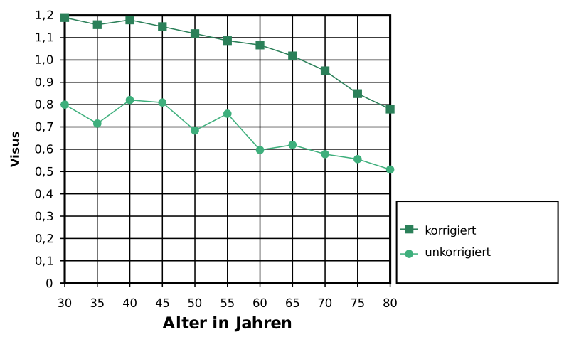
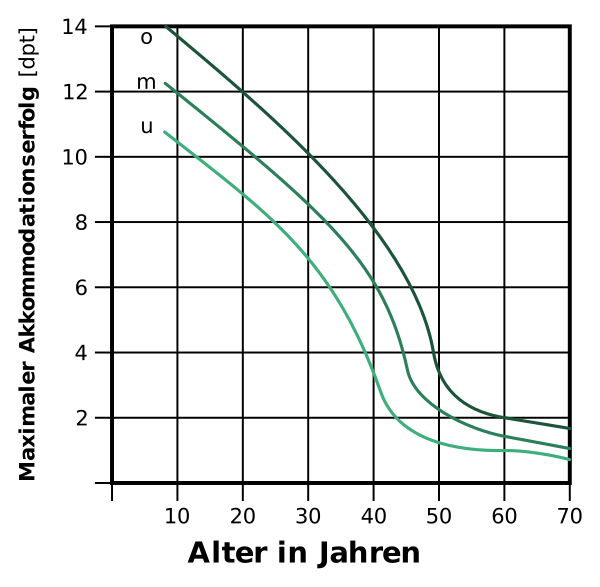
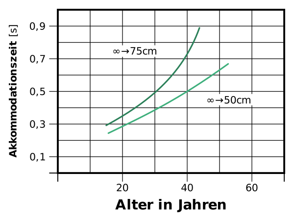
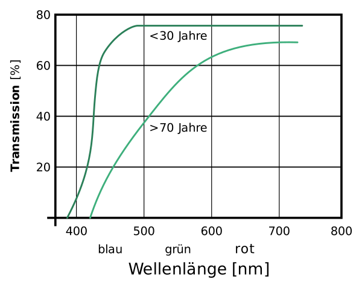
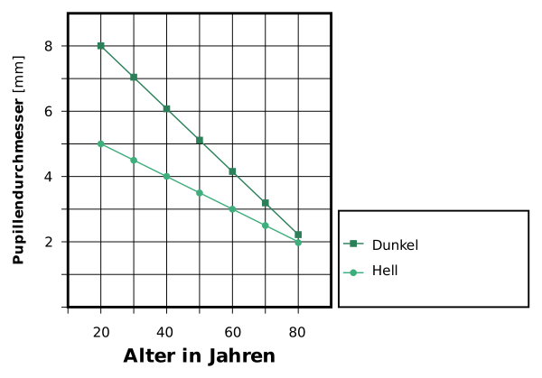
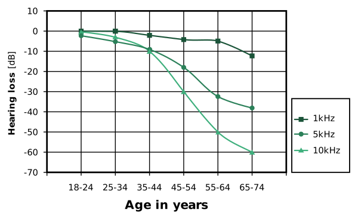
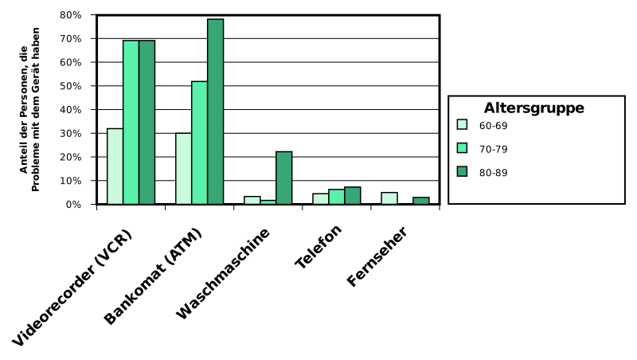
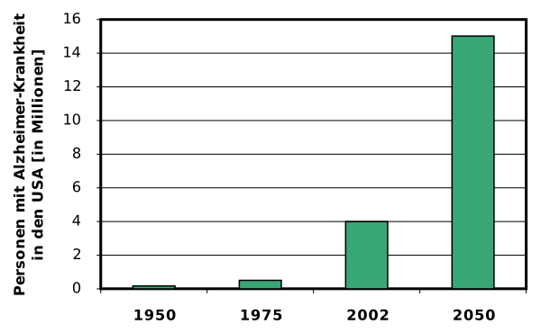

---
list-of-figures:
  label: Abbildung
  title: Abbildungsverzeichnis
list-of-tables:
  label: Tabelle
  title: Tabellenverzeichnis
cite:
  title: Quellenverzeichnis
footnotes:
  title: Fußnoten
abbreviations:
  title: Abkürzungsverzeichnis
---

<!-- prettier-ignore -->
*[ALS]: Amyotrophe Lateralsklerose
*[EEG]: Elektroenzephalographie
*[EW]: Einwohner
*[LRS]: Lese- und Rechtschreibstörung
*[PET]: Positronen-Emissions-Tomographie
*[PVS]: Persistent Vegetative State
*[RS]: Rett-Syndrom
*[SLI]: Specific language impairment
*[u. a.]: unter anderem
*[u. a.]: unter anderem
*[U.S.]: United States
*[USA]: United States of America
*[WWW]: World Wide Web
*[z. B.]: zum Beispiel
*[Z. B.]: Zum Beispiel

# Medizinische Grundlagen – Teil II

## Sprache und Sprechen

Den gesprochenen (vokalisierten) Äußerungen eines Menschen liegt ein zweistufiger Prozess zugrunde, bei dem wir strikt zwischen den Elementen _Sprache_ (semantisches Repräsentationssystem) und _Sprechen_ (phonetisches Repräsentationssystem) unterscheiden müssen.
Sprache ist die Codierung von abstrakten Denkmustern in eine Folge von Zeichen (z. B. Buchstaben) oder lautlichen Elementen (Phoneme).
Die Manifestierung von Schriftzeichen nennen wir „Schreiben“; die Realisierung von Lauten nennen wir „Sprechen“ [@dudel:1996, @böhme:1997, @pschyrembel:1989].

Beim Komplex „Sprache – Sprechen“ lassen sich vier linguistische Ebenen unterscheiden [@böhme:1997]:

- _Semantisch-lexikale Ebene_: Semantik – Lehre von den Inhalten und der Bedeutung der Wörter; Lexikologie – Untersuchung des Wortschatzes einer Sprache.
- _Syntaktisch-morphologische Ebene_: Syntax – Charakterisierung von Sätzen und Erkennen ihrer inneren Struktur; Morphologie bzw. Grammatik – Lehre vom Aufbau und den Gesetzmäßigkeiten einer Sprache.
- _Phonetisch-phonologische Ebene_: Phonetik – artikulatorische, akustische und auditive Faktoren von Lauten; Phonologie – Untersuchung des Lautsystems einzelner Sprachen und dessen Funktion.
- _Pragmatisch-kommunikative Ebene_: Gebrauch der Sprache in der Beziehung zwischen Sprecherin und Sprecher und Hörerin und Hörer (Sender und Empfänger).

### Die Sprache

1. Definitionen  
   Sprache ist ein konventionelles[^32] System von Zeichen zu Kommunikationszwecken [@brockhaus:1994].
   Kommunikation zwischen Lebewesen kann auf vielfältige Weise erfolgen.
   Bei Tieren spielen neben Lauten auch Gesten, Gebärden und Duftstoffe eine wichtige Rolle.
   Trotz der Vielfalt der verwendeten Ausdrücke und Ausdrucksformen, wird die bei Tieren vorkommende Verständigung nicht als Sprache bezeichnet, da zur Übermittlung der Nachricht immer nur vorgegebene, unveränderte Zeichen verwendet werden.
   Sprache im Sinne der üblichen Definition liegt erst dann vor, wenn es eine Konvention gibt, die es ermöglicht, aus einem beschränkten, überindividuellen Zeichenvorrat (z. B. Alphabet, Wortschatz) eine unbeschränkte Zahl beliebiger Nachrichten produzieren und verstehen zu können.
   Diese dafür erforderlichen syntaktischen Fähigkeiten scheinen nach heutigem Wissensstand ausschließlich beim Menschen vorzukommen.
   In diesem Sinne besteht Sprache aus bedeutungstragenden Elementen (Morphemen), die nach den Regeln der Syntax zu bedeutungsvollen Einheiten mannigfaltig kombiniert werden können [@dudel:1996].

   > Der Mensch spricht (...) Wir sprechen, weil Sprechen uns natürlich ist (...) Man sagt, der Mensch habe die Sprache von Natur (...) Erst die Sprache befähigt den Menschen, dasjenige Lebewesen zu sein, das er als Mensch ist (...) Als der Sprechende ist der Mensch: Mensch.  
   > _Martin Heidegger_ [@heidegger:1959]

   [^32]: Konventionell: hier im Sinne von „auf Konventionen beruhend“, vereinbart

   Unter Sprachproduktion wollen wir daher die Bildung und Verarbeitung mentaler Konzepte verstehen, wodurch unter Zugriff auf den erlernten aktiven Wortschatz und unter Anwendung der für die jeweilige Sprache gültigen syntaktischen Regeln eine Nachricht so aufbereitet wird, dass sie der vokalen Artikulation oder einer anderen geeigneten Modalität (Schrift, Gebärden, Körpersprache etc.) zugeführt werden kann.
   Manifestiert sich diese Sprache gleichzeitig in mehreren Modalitäten, dann sprechen wir von bimodaler[^33] oder multimodaler Kommunikation.

   [^33]: Ein typisches Beispiel für eine bimodale Kommunikation ist die simultane Umsetzung eines sprachlichen Ausdruckes in gesprochene Sprache und Gebärdensprache durch die sprechende Person.

2. Spracherwerb  
   Nach Chomsky steht die Komplexität der menschlichen Sprache in Widerspruch zur Leichtigkeit, mit der Kinder Sprache erwerben.
   Daher postuliert er mit dem „Principles and Parameters Model“, dass die allen Sprachen gemeinsamen Grundzüge bereits biologisch angelegt sind (angeborenes Wissen).
   Unter Verwendung dieser „universellen Prinzipien“ beschränkt sich der Erwerb der Muttersprache „nur“ auf die Erlernung jener grammatischen Parameter, die die syntaktischen Unterschiede der einzelnen Sprachen bestimmen.

3. Wortschatz  
   Der Wortschatz der deutschen Sprache umfasst (je nach Quelle und Zählweise) rund $300\:000$ bis $400\:000$ Wörter.
   Davon sind etwa $60\%$ Substantive (Hauptwörter), $25\%$ Verben (Zeitwörter) und $15\%$ Adjektiva (Eigenschaftswörter) und Adverbien (Umstandswörter).
   Die englische Sprache ist wesentlich reicher.
   Hier wird ein Wortbestand von $600\:000$ bis $800\:000$ Wörtern genannt.
   Französisch umfasst hingegen nur $100\:000$ Wörter [@brockhaus:1994, @erben:1965, @geo-magazin:1997].

   Der durchschnittliche aktive Wortschatz eines/einer Erwachsenen beträgt $8\:000$ bis $16\:000$ Wörter, während der durchschnittliche passive Wortschatz fast $100\:000$ Wörter erreicht.
   Zum $90\%$ Verstehen eines einfachen, alltäglichen Textes reichen hingegen bereits $2\:000$ Wörter aus.

   Mit $18$ Monaten verfügt ein Kind über etwa $50$ wortartige Ausdrücke.
   Ein Jahr später ist der aktive Wortschatz auf $400$ Wörter und im Alter von $3$ Jahren auf mehr als $700$ Wörter gestiegen.
   Den Verben kommt dabei eine besondere Stellung zu.
   Sie werden später und mit größerer Anstrengung in den aktiven Wortschatz aufgenommen [@wilson:1998].
   Der passive Wortschatz eines sechsjährigen Kindes wird mit nicht weniger als $23\:000$ Wörtern angegeben [@geo-magazin:1997].

4. Sprache und Gehirnfunktionen  
   Neuere Forschungsergebnisse behaupten, dass am Verstehen und Produzieren von Sprache sehr viele Regionen des menschlichen Gehirns beteiligt sind.
   Das ist insbesondere dann gegeben, wenn man bedenkt, dass Sprache gehört und gelesen, gesprochen oder geschrieben werden kann und dass es neben der verbalen Sprache auch noch zahlreiche nicht-verbale Ausdrucksformen gibt.

   Bei der klassischen Betrachtung der beteiligten Hirnregionen geht man, des besseren Verständnisses willen, von gehörter Sprache aus und verfolgt die Wirkungskette bis zur Produktion einer gesprochenen Antwort auf das Gehörte.

   Einerseits durch die Beobachtung und Analyse von Gehirnläsionen und deren Auswirkung auf die sprachliche Kompetenz und Leistung von Versuchspersonen, andererseits durch den Einsatz von Positronen-Emissions-Tomographie (PET)[^34] konnten relativ eng begrenzte Areale im Gehirn gefunden werden, die für die Verarbeitung und Produktion von Sprache zuständig sind.

   [^34]: Mit der Positronen-Emissions-Tomographie kann ein Schnittbild der Energiebilanz des Gehirns erstellt und somit festgestellt werden, welche Areale des Gehirns bei bestimmten Tätigkeiten überdurchschnittliche Aktivitäten entfalten.

   Das sogenannte Wernicke-Zentrum[^35] ist die „sensorische“ Sprachregion im hinteren, oberen Teil des Schläfenlappens der jeweils dominanten Hemisphäre des Gehirns (bei $99\%$ der rechtshändigen und $60\%$ der linkshändigen Personen auf der linken Körperseite).

   [^35]: Carl Wernicke, deutscher Neurologe und Psychiater, $1848-1905$

   Schon früher konnte Broca[^36] in der unteren Windung des Stirnlappens der dominanten Hemisphäre die „motorische“ Sprachregion lokalisieren, die nach ihm als Broca-Zentrum benannt wird.

   [^36]: Paul Broca, französischer Chirurg und Anthropologe, $1824-1880$

   Die beiden Bezeichnungen „sensorisches“ und „motorisches“ Zentrum erscheinen bei einer gesamten Betrachtung der sprachlichen Tätigkeit des Gehirns eher irreführen, zumal das „motorische Zentrum“ trotz seiner topografischen Nähe nichts mit dem für den Sprechvorgang verantwortlichen motorischen Cortex zu tun hat.

   Versucht man die beiden Sprachzentren gemäß ihrer linguistischen Aufgabe zu benennen, dann stellt das Wernicke-Zentrum sozusagen das Lexikon dar, in dem die Begriffe und ihre Bedeutung (Semantik) gespeichert sind.
   Zusammen mit den im nahen Hinterhauptslappen lokalisierten Funktionen für Erinnerung und Zuordnung werden im Wernicke-Areal, so wird vermutet, aus abstrakten, noch nicht sprachlich gefassten Gedanken durch Suche nach den passenden Begriffen die Wörter für die spätere Satzbildung festgelegt.

   <!-- FIXME: missing bibliography entry: [MET 94] -->

   

   Gemäß diesem Modell übernimmt sodann das Broca-Zentrum als „Grammatik-Maschine“ diese Wortbausteine, ergänzt sie durch die notwendigen Funktionswörter und baut aus ihnen einen syntaktisch korrekten Satz auf.

   Im folgenden Schritt wird der fertige Satz, wenn er ausgesprochen werden soll, an jenen Teil des motorischen Cortex weitergeleitet, der für die korrekte Ansteuerung von etwa hundert Muskeln verantwortlich ist, die an der Artikulation der gesprochenen Sprache beteiligt sind.
   Analoge Mechanismen laufen für die geschriebene Sprache und die nicht-verbale Kommunikation ab.

   Dem Wernicke-Areal fallen auch Aufgaben beim Erkennen gehörter Wörter zu.
   Ein weiteres Zentrum (optisches Sprachzentrum) ist beim Lesen aktiv.

   Für die Grundfunktionen „Lexikon“, „Semantik“ und „Grammatik“ sind die Sprachzentren der dominanten Hirnhälfte (meistens links) verantwortlich.
   Das soll aber nicht darüber hinwegtäuschen, dass beim Verstehen und bei der Produktion von Sprache auch die nicht-dominante Gehirnhälfte eine wichtige Aufgabe zu erfüllen hat.
   Fällt nämlich der Balken (Corpus callosum), die Verbindung zwischen den beiden Gehirn-Hemisphären aus (Verletzungen, Tumoren), verlieren Personen die Fähigkeit, Gefühlskomponenten in der Sprache zu unterscheiden (ärgerlich, ironisch, humorvoll etc.) oder bildhafte Sprache (Metaphern) anders als im rein wörtlichen Sinn zu verstehen [@eberhard:1994].

{.lower-alpha}

### Sprechen, Stimmbildung und Sprechorgane

1. Organe der Stimmbildung  
   Die Stimmbildung des Menschen, die in der gesamten Natur einzigartig ist, erfolgt durch ein komplexes Zusammenspiel einer Vielzahl von Organsystemen:

   - Das respiratorische System (die Lungen und Atemwege) muss eine ausreichende Luftmenge und einen ausreichenden Luftdruck zur Verfügung stellen.
   - Der Kehlkopf mit den Stimmbändern dient der Erzeugung von Klängen (im Sinne von Tönen samt ihren Oberwellen), die in diesem Zusammenhang Stimme genannt werden.
   - Das Artikulationssystem, bestehend aus Rachen, Mundhöhle und Nasenhöhle formt aus dem vom Kehlkopf kommenden Schall die einzelnen Phoneme, also die Elemente der gesprochenen Sprache.
   - Die Stimmbildung im Kehlkopf (Stellung der Stimmbänder) und alle Bewegungen der Artikulationsorgane (vornehmlich Stellung der Zunge, des Gaumens, der Kiefer und der Lippen) erfolgt durch das motorische Sprachzentrum des Gehirns.
   - Nicht unterschätzt bei der Spracherzeugung darf die Rolle des Gehörs werden.
     Erst durch die Rückkopplung der eigenen Stimme ist natürlicher Spracherwerb und einwandfreie Artikulation möglich.
     Ist diese Rückkopplung durch eine Schädigung des Ohres oder der Hörbahn nicht gewährleistet, ist der Spracherwerb nur mittels besonderer pädagogischer und therapeutischer Maßnahmen möglich.

   Die Stellung der Stimmbänder bestimmt, ob die ausgeatmete Luft die Stimmritze (Spalt zwischen den Stimmbändern, _Glottis_) ungehindert passieren kann (normale Atmung) oder ob sie bei verengter Stimmritze die Stimmbänder in Schwingung versetzen kann (Phonation).
   Je stärker die Stimmbänder gespannt sind und je höher der Druck der ausgeatmeten Luft ist, desto höher ist die von den Stimmbändern erzeugte Schwingungsfrequenz.
   Eine eigene Stellung der Stimmbänder liegt bei Flüsterstimme vor.
   Die vier wichtigsten Stellungen der Stimmbänder sind in <<fig:stellung-der-stimmbaender>> gezeigt.

   Der weiche Gaumen regelt je nach seiner Stellung das Einströmen der Luft in die Mund- oder Nasenhöhle (oder beides) und trägt dadurch zur Klangfärbung bei.
   Zunge, Zähne und Lippen bewirken die Differenzierung bei der Artikulation.

   

   ::: figcaption

   1. bei ruhiger Atmung;
   2. bei forcierter Atmung;
   3. bei Stimmbildung;
   4. bei Flüsterstimme
      {.lower-alpha}

   :::

{.lower-alpha}

## Verbale und vokale Behinderungen

Bei der Betrachtung von Behinderungen im Bereich der verbalen Kommunikationsfähigkeit ist es wichtig, zwischen Sprache (als die verbale Basis; engl.: _language_) und Sprechen (als die vokale Ausdrucksform; engl.: _speech_) zu unterscheiden.
Sprache zu verstehen und zu produzieren, ist eine Leistung unseres Gehirns.
Diese Sprache lautlich oder auch durch Schrift oder Gebärden auszudrücken und somit zu kommunizieren, ist im weitesten Sinn eine Leistung unserer motorischen
Fähigkeiten (Artikulation, Handmotorik etc.).

Zwischen diesen beiden klar umrissenen Gebieten befinden sich all jene neuralen Strukturen, die für die Konzeption von Bewegungen und für die Weiterleitung der Nervensignale bis zur Muskulatur zuständig sind.
Sie bilden sozusagen das Bindeglied zwischen Sprache und Sprechen.
Störungen in diesem Bereich lassen sich daher nicht immer eindeutig zuordnen.
Außerdem können Behinderungen gleichzeitig auch die beiden Bereiche Sprache und Sprechen beeinträchtigen, sodass eine klare Einordnung in diesem Fall unmöglich ist.
Eine erste Einteilung der Bereiche, in denen Störungen auftreten können, ist in <<tab:stoerungen-komplex-sprache-sprechen>> wiedergegeben [@böhme:1997, @carroll:1998].

<table>
  <tbody class="break-words">
    <tr>
      <th scope="row">Ebene</th>
      <td style="font-weight: bold;">phonetisch-phonologisch</td>
      <td style="font-weight: bold;">syntaktisch-morphologisch</td>
      <td style="font-weight: bold;">semantisch-lexikalisch</td>
      <td style="font-weight: bold;">pragmatisch-kommunikativ</td>
    </tr>
    <tr>
      <th scope="row">Störung</th>
      <td>motorische und sensorische Dyslalie, phonematische Störungen</td>
      <td>Dysgrammatismus, Probleme mit bestimmen Satzkonstruktionen</td>
      <td>eingeschränkter aktiver und passiver Wortschatz, seltene Wörter oft nicht parat</td>
      <td>interpersonelle Kommunikationsstörungen im sozialen und situativen Kontext</td>
    </tr>
  </tbody>
</table>

.stoerungen-komplex-sprache-sprechen#Störungen im Komplex Sprache-Sprechen.

### Behinderungen der Sprache

Behinderungen der Sprache basieren immer auf Läsionen des Gehirns oder beruhen auf einer Entwicklungsstörung, die den Spracherwerb verzögert oder verhindert hat.

1. Aphasie  
   Aphasie ist zunächst der Sammelbegriff für alle nach dem Spracherwerb auftretenden Schädigungen, die den Bereich der sprachlichen Kommunikation betreffen.
   Sie können sich sowohl in der Perzeption als auch in der Produktion von Sprache auswirken.
   Unter Aphasie (wörtlich Sprachlosigkeit) im engeren Sinn wird jedoch meistens eine Störung der Sprachproduktion bei erhaltener Funktion der zum Sprechen benötigten Organe und Muskulatur verstanden.

   Aphasie betrifft oft auch die geschriebene Sprache und manchmal das Ausdrücken von Gesten bzw. die Verwendung von Symbolen.
   In diesem Sinne ist Aphasie eine multimodale Behinderung [@böhme:1997, @gadler:1996].
   Aphasie kann auch die Fähigkeit des Verstehens und Produzierens von Gebärdensprache betreffen, wie an gehörlosen Personen mit Läsionen der Sprach-Areale festgestellt wurde [@damasio:1993, @devlin:1999, @devlin:2000].
   Als Häufigkeit für westliche Länder werden Werte von rund $4$ aus $1\:000$ angegeben (Statistiken aus UK und USA) [@carroll:1998].

   Einfache, kurze und häufig verwendete Wörter, die bereits früh im Leben erlernt wurden, haben die höchste Wahrscheinlichkeit trotz Aphasie noch beherrscht zu werden.
   Problematisch sind in jedem Fall abstrakte Wörter, komplexe syntaktische Konstruktionen und die passive Form [@devlin:1999, @devlin:2000].

   Klinisch wird Aphasie üblicherweise wie folgt klassifiziert, obwohl hinsichtlich der Terminologie unterschiedliche Auffassungen bestehen (Zusammenfassung siehe <<tab:klassifikation-leitsymptome-aphasisches-syndrom>>) [@eberhard:1994, @pschyrembel:1989, @böhme:1997]:

   <table>
     <thead>
       <tr>
         <td></td>
         <th>Amnestische Aphasie</th>
         <th>Wernicke-Aphasie Sensorische A.</th>
         <th>Broca-Aphasie Motorische A.</th>
         <th>Globale Aphasie</th>
       </tr>
     </thead>
     <tbody>
       <tr>
         <th scope="row">Sprachproduktion</th>
         <td>meist flüssig</td>
         <td>flüssig</td>
         <td>erheblich verlangsamt</td>
         <td>Spärlich bis Null, auch Sprachautomatismen</td>
       </tr>
       <tr>
         <th scope="row">Artikulation</th>
         <td>meist nicht gestört</td>
         <td>meist nicht gestört</td>
         <td>oft dysarthrisch</td>
         <td>meist dysarthrisch</td>
       </tr>
       <tr>
         <th scope="row">Prosodie</th>
         <td>meist gut erhalten</td>
         <td>meist gut erhalten</td>
         <td>oft nivelliert, auch skandierend</td>
         <td>oft nivelliert, bei Automatismen meist gut erhalten</td>
       </tr>
       <tr>
         <th scope="row">Satzbau</th>
         <td>kaum gestört</td>
         <td>Paragrammatismus (Verdopplungen und Verschränkungen von Sätzen und Satzteilen</td>
         <td>Agrammatismus (nur einfache Satzstrukturen, Fehlen von Funktionswörtern)</td>
         <td>nur Einzelwörter Floskeln, Sprachautomatismen</td>
       </tr>
       <tr>
         <th scope="row">Wortwahl</th>
         <td>Ersatzstrategien bei Wortfindungsstörungen, einige semantische Paraphasien</td>
         <td>viele semantische Paraphasien, oft grob vom Zielwort abweichend, semantische Neologismen</td>
         <td>relativ eng begrenztes Vokabular, kaum semantische Paraphasien</td>
         <td>äußerst begrenztes Vokabular, grob abweichende semantische Paraphasien</td>
       </tr>
       <tr>
         <th scope="row">Lautstruktur</th>
         <td>Einige phonemische Paraphasien</td>
         <td>viele phonematische Paraphasien bis zu Neologismen, auch phonematischer Jargon</td>
         <td>viele phonematische Paraphasien</td>
         <td>sehr viele phonematische Paraphasien und Neologismen</td>
       </tr>
       <tr>
         <th scope="row">Verstehen</th>
         <td>leicht gestört</td>
         <td>stark gestört</td>
         <td>leicht gestört</td>
         <td>stark gestört</td>
       </tr>
     </tbody>
   </table>

   .klassifikation-leitsymptome-aphasisches-syndrom#Klassifikation und Leitsymptome der aphasischen Syndrome nach Poeck, 1994 in [@böhme:1997].

2. Paraphasie  
   Mit Paraphasie (engl.: _paraphasia_) wird eine Sprachstörung bezeichnet, bei der es zu Auslassungen, Ersetzungen, Hinzufügungen oder Umstellungen kommt.
   Das kann auf der Ebene von Phonemen innerhalb eines Wortes (phonematische Paraphasie) oder bei Wörtern innerhalb eines Satzes (semantische oder verbale Paraphasie) geschehen.

3. Dysphasie  
   Dysphasie (engl.: _dysphasia_, auch _specific language impairment_ = SLI) bezeichnet sprachliche Einschränkungen bei hirnlokalem Syndrom oder bei verzögerter Sprachentwicklung [@pschyrembel:1989].
   Die Einschränkungen betreffen oft in erster Linie Verben (den Erwerb, Morphologie, Wortschatz).
   Es werden Verben mit möglichst allgemeiner Bedeutung bevorzugt.
   Die Ableitung der Semantik (Erkennen der Bedeutung eines Wortes) aus der Syntax ist wenig ausgeprägt [@wilson:1998].

4. Agrammatismus, Dysgrammatismus  
   Agrammatismus ist eine Störung der grammatikalisch richtigen Ausdrucksweise (Satzbaustörung) nach abgeschlossener Sprachentwicklung.
   Das Sprechen erfolgt in einfachen, fehlerhaften und oft kurzen Ausdrücken (im Telegrammstil).
   Konjugationen und Deklinationen fehlen, oft wird der Infinitiv verwendet.
   Agrammatismus bezeichnet das vollständige Fehlen von Syntax in sprachlichen Äußerungen.
   Mildere Formen (vor allem bei Grammatik-Störungen im Kindesalter) werden als Dysgrammatismus bezeichnet Auftreten bei motorischer Aphasie (siehe oben) und geistigen Behinderungen.

5. Alexie, Dyslexie  
   Dyslexie wird als verallgemeinerter Begriff für eine Teilleistungsschwäche beim Lesen bei sonst normaler Gesamtintelligenz verwendet.
   Im deutschsprachigen Raum wird dafür meist die Bezeichnung _Legasthenie_ bzw. _Lese- und Rechtschreibstörung_ (LRS) verwendet.
   Bei den betroffenen Kindern fallen etwa ab der zweiten Schulstufe Verwechslungen von Grafemen[^37], fehlerhafte Orthografie und vermindertes Leseverständnis auf.
   Von Legasthenie verschiedenen Grades sind zwischen $6$ und $10\%$ der Kinder betroffen [@pschyrembel:1989].
   Nach einer Umfrage unter den $700$ behinderten Studierenden der Universität Glasgow stellen Personen mit Dyslexie die größte Gruppe dar [@busse:1998].
   Die Gründe sind bis heute nicht geklärt, es werden jedoch sowohl genetische als auch soziale Einflussfaktoren vermutet [@pschyrembel:1989].

   [^37]: Graphem bezeichnet die kleinste bedeutungstragende Einheit der geschriebenen Sprache.

   Bei Legasthenie muss beachtet werden, dass Lese- und Rechtschreibstörung sowohl gemeinsam als auch voneinander getrennt auftreten können.
   In der Regel ist das Rechnen nicht beeinflusst.
   Liegt eine gänzliche Unfähigkeit zu lesen vor, spricht man von Alexie.
   Scheitert das Lesen am mangelnden Erkennen von Buchstaben, liegt eine sogenannte _Oberflächenalexie_ (literale Alexie) vor.
   Werden hingegen Wörter nicht erkannt, handelt es sich um eine _Tiefenalexie_ oder verbale Alexie.

   Die Diskussion über Dyslexie macht es deutlich, wie leicht wir dazu neigen, im Sinne einer „Defektologie“ vorzugehen und von Schädigungen und Schwächen zu reden ohne über Vorteile und Stärken nachzudenken.
   Personen mit Dyslexie weisen zweifellos eine Schwäche beim Verbalisieren auf, zeigen aber in der Regel Stärken beim Visualisieren und beim Umgang mit bildlichen Darstellungen von Sachverhalten.
   Schwächen auf der Seite des Konstruktiven stehen Stärken beim analytischen Denken gegenüber.
   Möglicherweise waren es gerade diese Schwerpunktsverschiebungen, die dyslexische Personen wie Faraday oder Einstein zu den wissenschaftlichen Leistungen befähigt haben, die sie von anderen unterscheidet [@mccausland:1994].

6. Akalkulie, Dyskalkulie  
   Eine Teilleistungsschwäche beim Umgang mit Zahlen wird als Dyskalkulie oder Arithmasthenie bezeichnet.
   Liegt eine gänzliche Unfähigkeit zu rechnen vor, spricht man von Akalkulie.

7. Agrafie  
   Ähnlich wie das Lesen kann auch das Schreiben durch eine Teilleistungsschwäche betroffen sein.
   Eine Unfähigkeit zu Schreiben bei intakter Handmotorik und normaler Intelligenz wird als Agrafie bezeichnet.

{.lower-alpha}

### Behinderungen des Sprechens

Ein schwaches respiratorisches System wirkt sich auf die Lautstärke und die Ausdauer der lautlichen Äußerungen aus.
Störungen im Kehlkopfbereich verursachen hauchige, heisere, leise, flüsternde oder verlangsamte Aussprache.
Fehlfunktionen des weichen Gaumens resultieren entweder in zu nasaler Artikulation oder im Fehlen von Nasallauten Ist das vordere Artikulationssystem (Zunge, Kiefer, Lippen) beeinträchtigt, kommt es zu verwaschener, langsamer, unpräziser oder unkoordinierter Aussprache.
Andere Artikulationsstörungen können zu unterschiedlichen Tonhöhen, schwankender Lautstärke, zu hoher Sprechgeschwindigkeit oder zu Störungen im Sprechrhythmus (Poltern, Stottern) führen.

1. Dysarthrie, Anarthrie  
   Sprechstörung durch Lähmung oder Koordinationsstörung der Sprechmuskulatur infolge einer Schädigung der Hirnnerven [@strässle:1998].
   Der gesamte Komplex der oben beschriebenen Stimmbildungsstörungen wird mit Dysarthrie (engl.: _dysarthria_ oder _dysarthrias_) bezeichnet.
   Dysarthrie kann u. a. in der Folge von Zerebralparese, Muskeldystrophie, Apoplexie (Gehirnschlag), Parkinson-Syndrom, amyotropher Lateralsklerose (ALS), multipler Sklerose (MS), Chorea Huntington, Gehirntumoren, Myasthenia gravis, bzw. nach Schädelhirntrauma, Vergiftungen oder Drogenmißbrauch auftreten.

   Anarthrie bezeichnet die stärkste Form der Dysarthrie, bei der eine gezielte Artikulation von Lauten und Satzelementen nicht möglich ist [@strässle:1998].
   Zerebrale Schädigungen, die Dysarthrie oder Anarthrie hervorrufen, verursachen oft auch Bewegungsstörungen, die es verhindern, dass die betroffene Person kontrollierte Gesten ausführen kann.
   Das stellt ein zusätzliches Kommunikationshindernis dar [@strässle:1998].

2. Aphonie, Dysfonie  
   Das vollständige Versagen der Phonation (Stimmbildung) wird als Aphonie bezeichnet.
   Stimmstörungen (heisere, belegte, raue Stimme) und Einschränkung der Stimmleistung wird Dysfonie genannt.
   Ursachen sind neben psychischen Einflüssen (Schock, Stress) verschiedene Anomalien und Erkrankungen des Kehlkopfes (auch zufolge Verletzung oder Intubation).

{.lower-alpha}

### Störungen im Grenzgebiet zwischen Sprache und Sprechen

Störungen, die in das Grenzgebiet zwischen Sprache und Sprechen fallen, also im Übergang von der in Wörtern gedachten Sprache zur Lautbildung (Zuweisung von Phonemen) zu suchen sind, werden hier bewusst bei den Sprechstörungen behandelt.
Obwohl ihre Ursachen noch vor der eigentlichen Artikulation liegen, geschieht das deshalb, weil hier zum Einsatz gelangende Hilfsmittel nicht die Sprache selbst, sondern die Aussprache unterstützen müssen.

1. Dyslalie  
   Mit Dyslalie (auch Stammeln; engl.: dyslalia) wird eine Störung der Artikulation verstanden, bei der Phoneme verändert oder durch andere ersetzt werden.
   Die Ursachen dafür können u. a. zentrale Sprachstörungen und verzögerter Sprachentwicklung sein.

2. Echolalie  
   Echolalie bezeichnet das zwanghafte wörtliche oder auch abgewandelte Nachsprechen von gehörten oder gesagten Wörtern und Sätzen ohne Rücksicht auf den Inhalt oder die Situation.
   Sie ist bei Kindern zwischen erstem und zweitem Lebensjahr Teil der natürlichen Sprachentwicklung, später jedoch Zeichen einer Sprachstörung.

3. Bradylalie  
   Unter Bradylalie (auch Bradyarthrie oder Bradyglossie) wird eine z. B. bei multipler Sklerose zu beobachtende Verlangsamung des Sprechtempos verstanden.

{.lower-alpha}

## Mehrfachbehinderungen, Syndrome

### Mehrfachbehinderungen

Das Zusammentreffen mehrerer Schädigungen wird als Mehrfachbehinderung bezeichnet und wiegt für die betroffene Person oft schwerer als die Summe der einzelnen Behinderungen.

<<tab:auftreten-mehrfachbehinderungen>> zeigt für die drei häufigsten primären Behinderungen (Mobilitäts-, Seh- und Hörbehinderung) die Wahrscheinlichkeit des Auftretens weiterer funktioneller Einschränkungen.
Die Zahlen geben an, wie viele von $1\:000$ Personen mit einer bestimmten Primärbehinderung von einer der ausgewählten zusätzlichen Einschränkungen betroffen sind.

<table>
  <colgroup span="3"></colgroup>
  <col>
  <thead>
    <tr>
      <th colspan="3">Von <MathML formula="1.000"/> Personen mit einer Behinderung ...</th>
      <th rowspan="2" scope="rowgroup">... sind zusätzlich eingeschränkt bei/durch</th>
    </tr>
    <tr>
      <th>... der Mobilität ...</th>
      <th>... des Sehens ...</th>
      <th>... des Hörens ...</th>
    </tr>
  </thead>
  <tbody>
    <tr>
      <td><MathML formula="1.000"/></td>
      <td><MathML formula="700"/></td>
      <td><MathML formula="530"/></td>
      <th>Mobilität</th>
    </tr>
    <tr>
      <td><MathML formula="150"/></td>
      <td><MathML formula="1.000"/></td>
      <td><MathML formula="160"/></td>
      <th>Sehen</th>
    </tr>
    <tr>
      <td><MathML formula="230"/></td>
      <td><MathML formula="380"/></td>
      <td><MathML formula="1.000"/></td>
      <th>Hören</th>
    </tr>
    <tr>
      <td><MathML formula="320"/></td>
      <td><MathML formula="220"/></td>
      <td><MathML formula="200"/></td>
      <th>Rheuma</th>
    </tr>
    <tr>
      <td><MathML formula="20"/></td>
      <td><MathML formula="30"/></td>
      <td><MathML formula="10"/></td>
      <th>Epilepsie</th>
    </tr>
    <tr>
      <td><MathML formula="270"/></td>
      <td><MathML formula="150"/></td>
      <td><MathML formula="170"/></td>
      <th>Herzkrankheiten</th>
    </tr>
  </tbody>
</table>

.auftreten-mehrfachbehinderungen#Auftreten von Mehrfachbehinderungen [@tetzchner:1991].

### Syndrome

Unter einem Syndrom[^38] wird das Zusammentreffen mehrerer Krankheitszeichen (Symptomen) verstanden, die für ein bestimmtes Krankheitsbild charakteristisch sind.
Dabei ist die Krankheitsursache (Ätiologie) zwar meist einheitlich, der Krankheitsverlauf (Pathogenese) jedoch unbekannt.

[^38]: Syndrom: von grie. mitlaufend, begleitend.

1. Down-Syndrom  
   Das Down-Syndrom[^39] (auch Trisomie $21$ oder Morbus Langdon-Down)[^40] entsteht durch eine chromosomale Störung, bei der bei der Befruchtung oder einer der nachfolgenden Zellteilungen ein zusätzliches drittes Chromosom $21$ (daher Trisomie $21$)[^41] in den Körperzellen auftritt und von da an bei jeder weiteren Zellteilung weitergegeben wird[^42].
   Das Down Syndrom führt zu einer Fehlentwicklung fast sämtlicher Gewebe und Organe des heranreifenden Organismus.
   Man unterscheidet drei Typen von Down-Syndrom:

   [^39]: John L. Down, englischer Arzt, $1828-1896$.
   [^40]: Die frühere übliche Bezeichnung „Mongolismus“ gilt heute als diskriminierend und soll daher vermieden werden.
   [^41]: Neben der Trisomie $21$ sind noch andere autosomale Trisomien mit Beteiligung der Chromosomen $3$, $9$, $10$, $12$, $13$ und $18$ bekannt. Bei den Geschlechtschromosomen kann es zu genosomalen Trisomien (XXY und XYY) kommen.
   [^42]: dass eine Chomosomenstörung die Ursache für das Down-Syndrom ist, wurde zwar schon um $1930$ vermutet, der Beweis dafür konnte aber erst $1959$ vom Franzosen Jérôme Lejeune erbracht werden.

   - _Freie (vollständige) Trisomie $21$_  
     Das zusätzliche Chromosom $21$ existiert bereits als $24$.
     Chromosom in einer der Keimzellen und ist daher als freies drittes Chromosom $21$ in allen Körperzellen enthalten (<<fig:chromosomen-weitergabe-down-syndrom>>).

   - _Mosaik-Down-Syndrom_  
     Samen- und Eizelle enthalten die korrekte Zahl von $23$ Chromosomen.
     Der Chromosomen-Fehler tritt erst bei einer der ersten Zellteilungen auf.
     Daher gibt es sowohl Zellen mit $46$ als auch solche mit $47$ Chromosomen.
     Diese Form tritt bei etwa $1\%$ der Kinder mit Down-Syndrom auf (<<fig:chromosomen-weitergabe-mosaik-down-syndrom>>).

   .")

   

   Abgesehen von Deformationen und Veränderungen im Habitus sind folgende Symptome für das Down-Syndrom charakteristisch:

   - Geistige Behinderung unterschiedlichen Ausmaße.
   - Sprechstörung (hoher Gaumen, große Zunge, Zahnfehlstellungen).
   - Muskelhypotonie.

2. Parkinson-Syndrom  
   Das Parkinson-Syndrom[^43] ist die häufigste neurologische Erkrankung des fortgeschrittenen Alters, von der vorwiegend Männer betroffen werden.
   Es handelt sich um ein extrapyramidales Syndrom zufolge einer Degeneration von Neuronen im Mittelhirn (Substantia nigra) [@pschyrembel:1989].

   [^43]: James Parkinson, englischer Chirurg und Paläontologe, $1755-1824$.

   Die mit dem Parkinson-Syndrom verbundenen Symptome sind in erster Linie:

   - Leise und monotone Sprache
   - Verlangsamung und Verkürzung von Bewegungen und Bewegungsstörungen (langsamer, schlurfender Gang, kleine Handschrift, Fallneigung)
   - Steifigkeit der Muskulatur
   - Ruhetremor (Zittern der Muskulatur in Ruhestellung mit $4$ bis $6$ Bewegungen pro Sekunde).
     Bei willkürlichen Bewegungen setzt der Tremor aus, die Handschrift ist daher nicht zittrig.

3. Gregg-Syndrom  
   Gregg-Syndrom (Rötelnembryopathie, Embryopathia rubeolosa), Fehlbildungssyndrom nach Rötelninfektion der Mutter während der ersten drei Schwangerschaftsmonate [@pschyrembel:1989].
   Die dabei auftretenden Anomalien richten sich nach dem Zeitpunkt der Rötelninfektion (<<tab:anomalien-gregg-syndrom>>).

   <table>
     <thead>
       <tr>
         <th>Schwangerschaftsmonat</th>
         <th>Schwerpunkt der Anomalien</th>
         <th>Auftretende Symptome</th>
       </tr>
     </thead>
     <tbody>
       <tr>
         <td rowspan="4"><MathML formula="1"/></td>
         <td rowspan="4">Augen</td>
         <td>kongenitaler Grauer Star (Cataracta congenita)</td>
       </tr>
       <tr>
       <td>fakultativer Grüner Star (Glaukom)</td>
       </tr>
       <tr>
       <td>kleine Augen (Mikrophthalmie)</td>
       </tr>
       <tr>
       <td>Augenhintergrundveränderungen (pseudo-RP)</td>
       </tr>
       <tr>
         <td rowspan="4"><MathML formula="2"/></td>
         <td>Herz</td>
         <td>Herzscheidewanddefekte</td>
       </tr>
       <tr>
         <td rowspan="3"><abbr title="Zentralnervensystem">ZNS</abbr></td>
         <td>geringes Hirnvolumen (Mikrozephalie)</td>
       </tr>
       <tr>
         <td>Retardierung, Epilepsie</td>
       </tr>
       <tr>
         <td>Bewegungsstörungen</td>
       </tr>
       <tr>
         <td><MathML formula="3"/></td>
         <td>Innenohr</td>
         <td>sensorineurale Schwerhörigkeit</td>
       </tr>
     </tbody>
   </table>

   .anomalien-gregg-syndrom#Anomalien bei Gregg-Syndrom [@pschyrembel:1989].

4. Rett-Syndrom (RS)  
   Das Rett-Syndrom[^44] ist eine bisher nur bei Mädchen beobachtete, wahrscheinlich X-chromosomal-dominant vererbte Erkrankung, in deren Verlauf es neben Hirnatrophie (Schwund des Nervengewebes im Gehirn) auch zu anderen Veränderungen im Gehirn kommt.
   Die Manifestation erfolgt zwischen dem $6.$ Lebensmonat und dem $4.$ Lebensjahr.
   Die Auswirkungen sind:

   [^44]: Andreas Rett, österreichischer Kinderarzt.

   - Epilepsie
   - Verzögerungen im Wachstum
   - Verlust bereits erworbener Fähigkeiten
   - Stereotype Handbewegungen (waschend, knetend)
   - Gangstörungen (breitbeinig, steif)
   - Apraxie (betrifft auch Sprechorgane und Augenbewegungen)
   - Verlust der verbalen Kommunikation

5. Usher-Syndrom  
   Das Usher-Syndrom ist eine autosomal-rezessiv vererbte Erkrankung mit den wesentlichen Symptomen:

   - Progrediente Schwerhörigkeit im Kinder- und Jugendalter
   - Retinopathia pigmentosa (Retinitis pigmentosa), kommt Jahre später hinzu
   - Ausfall des Nervus vestibularis (Teil des Nervus vestibulocochlearis = VIII. Hirnnerv, der das Gleichgewichtssystem (Vestibularapparat) innerviert.
   - Epileptische Anfälle (möglich)

   Das Usher-Syndrom ist eine der Hauptursachen für Taubblindheit.

6. Wachkoma (PVS) und Locked-in Syndrom  
   Mit Wachkoma (Apallisches Syndrom, Coma vigile, Persistent Vegetative State – PVS) wird ein klinischer Zustand bezeichnet, bei dem sich der Patient / die Patientin in einer vollständigen Wahrnehmungslosigkeit über sich und seine / ihre Umwelt befindet.
   Die autonomen Funktionen des Hypothalamus und des Hirnstammes bleiben vollständig oder teilweise erhalten.
   Ein EEG ist vorhanden und im weiteren Verlauf normal.
   Allerdings fehlt bei visueller Stimulation die sonst übliche Blockierung der alpha Wellen.
   Die Patienten weisen einen natürlichen Schlaf-Wach-Zyklus auf.
   Trotzdem gibt es keine Anzeichen eines reproduzierbaren, zielgerichteten oder willentlichen Verhaltens als Reaktion auf visuelle, taktile, auditive oder noxische Reize [@persistent-vegetative-state:1994:part-1].

   Das Wachkoma ist deutlich von verwandten Zuständen wie Locked-in Syndrom, Koma, Gehirntod oder schwerer Demenz zu unterscheiden (siehe dazu die auch Zusammenstellung in <<tab:wachkoma-und-verwandte-zustaende>>):

   - Koma: Tiefe Bewusstlosigkeit, die länger als eine Stunde andauert.
   - Gehirntod: Permanentes Fehlen jeglicher Gehirntätigkeit, auch der des Hirnstammes.
   - Locked-in Syndrom: Bewusstsein und Wahrnehmung ist vorhanden, kann aber nicht erwidert werden.
     PET Scans zeigen wesentlich höhere metabolische Werte als bei PVS.
   - Demenz: Progressiver, multidimensionaler Verlust von kognitiven Funktionen.
     Ein Fortschreiten bis in einen PVS als Endstadium ist möglich.

   <table>
     <thead>
       <tr style="height: 14rem;">
         <th>Zustand</th>
         <th>Selbstwahrnehmung</th>
         <th>Schlaf-Wach-Zyklus</th>
         <th>Motorische Funktionen</th>
         <th>Wahrnehmung des Leidens</th>
         <th>Atmung</th>
         <th>EEG Aktivität</th>
         <th>Gehirn-Stoffwechsel</th>
       </tr>
     </thead>
     <tbody>
       <tr>
         <th scope="row">Wachkoma</th>
         <td>fehlt</td>
         <td>intakt</td>
         <td>keine kontrollierte Bewegung</td>
         <td>nein</td>
         <td>normal</td>
         <td>delta oder theta, manchmal alpha</td>
         <td>um <MathML formula="50\%"/> oder mehr reduziert</td>
       </tr>
       <tr>
         <th scope="row">Koma</th>
         <td>fehlt</td>
         <td>fehlt</td>
         <td>keine kontrollierte Bewegung</td>
         <td>nein</td>
         <td>reduziert, verschieden</td>
         <td>delta oder theta</td>
         <td>um <MathML formula="50\%"/> oder mehr reduziert</td>
       </tr>
       <tr>
         <th scope="row">Gehirntod</th>
         <td>fehlt</td>
         <td>fehlt</td>
         <td>keine oder nur spinale Reflexe</td>
         <td>nein</td>
         <td>fehlt</td>
         <td>kein EEG</td>
         <td>fehlt</td>
       </tr>
       <tr>
         <th scope="row">Locked-in Syndrom</th>
         <td>vorhanden</td>
         <td>intakt</td>
         <td>vollständige Lähmung, nur Augenbewegungen</td>
         <td>ja</td>
         <td>normal</td>
         <td>normal oder geringe Abweichung</td>
         <td>geringfügig reduziert</td>
       </tr>
       <tr>
         <th scope="row">Demenz</th>
         <td>vorhanden, geht später verloren</td>
         <td>intakt</td>
         <td>unterschiedlich, progressive Abnahme</td>
         <td>ja, jedoch abnehmend</td>
         <td>normal</td>
         <td>verlangsamt</td>
         <td>unterschiedlich reduziert</td>
       </tr>
     </tbody>
   </table>

   .wachkoma-und-verwandte-zustaende#Wachkoma (PVS) und verwandte Zustände [@persistent-vegetative-state:1994:part-1].

   Bei den Ursachen, die zu einem Wachkoma führen können, unterscheidet man zunächst zwischen akuten Ursachen auf der einen und kongenitaler bzw. degenerativen Ursachen auf der anderen Seite [@persistent-vegetative-state:1994:part-1].

   Die akuten Ursachen können sowohl einen traumatischen Hintergrund (Schädelhirntrauma z. B. durch Unfall oder Schussverletzung) als auch nicht traumatische Hintergründe (Hypoxie durch Kreislaufstillstand oder Ertrinken, Gehirnschlag, Meningitis, Tumoren oder Vergiftungen) haben.
   Die statistische Entwicklung von Patienten / Patientinnen mit PVS $12$ Monate nach einer akuten Ursache ist in <<fig:modell-produktion-gesprochene-sprache>> dargestellt.
   Zu beachten ist, dass die Prognosen sowohl zwischen traumatischen und nicht-traumatischen Auslösern als auch zwischen Erwachsenen und Kindern große Unterschiede aufweisen.
   <<fig:modell-produktion-gesprochene-sprache>> zeigt außerdem für jenen Teil der Personen, die innerhalb eines Jahres aus dem PVS erwachen, die Wahrscheinlichkeit und den Grad einer zu erwartenden Behinderung [@kinney:1994, @persistent-vegetative-state:1994:part-1].

   

   Zu den nicht-akuten Ursachen für ein Wachkoma zählen einerseits zahlreiche Missbildungen im Gehirn wie Anenzephalie (Fehlen wesentlicher Gehirnteile), Mikroenzephalie (kleines Gehirn), Hydranenzephalie (Umbildung des Großhirns in eine Flüssigkeitsblase) und angeborener Hydrozephalus.
   Andererseits können bei Erwachsenen Erkrankungen wie Alzheimer, Creutzfeldt-Jacob, Chorea Huntington, Parkinson oder Multi-Infarkt-Demenz in einen PVS führen.
   Bei Kindern können Gangliosidosen (Lipidspeicherkrankheiten) eine Ursache für ein Fallen ins Wachkoma darstellen [@persistent-vegetative-state:1994:part-1].

   Die Häufigkeit des PVS wird sehr unterschiedlich angegeben und schwankt zwischen $25$ bis $60$ auf $1\;\sf{Mio.}$ EW.
   Nur der geringere Teil hat traumatische Ursachen [@andrews:1993].
   Dabei muss allerdings angemerkt werden, dass eine eindeutige Diagnose oft sehr schwer ist und Fehldiagnosen bis zu $60\%$ der untersuchten Fälle ausmachen können [@andrews:1996].

   <!-- FIXME: Querverweis -->

   Beim Locked-in Syndrom sind die Patienten/innen bei Bewusstsein, aber ohne jegliche Bewegungsmöglichkeit.
   Bei der „klassischen“ Form, bleiben die vertikalen Augenbewegungen und der Lidschlag erhalten, und können mit geeigneten Interfaces für Kommunikationszwecke verwendet werden.
   Beim „totalen“ Locked-in Syndrom fehlen auch diese Bewegungen und eine Kommunikation ist – wenn überhaupt – nur über die Auswertung des EEG (Brain Computer Interface) möglich.
   <!-- Beim „totalen“ Locked-in Syndrom fehlen auch diese Bewegungen und eine Kommunikation ist – wenn überhaupt – nur über die Auswertung des EEG (Brain Computer Interface – siehe Teil B, Kapitel 3.2.8) möglich. -->

   Als Ursachen für Locked-in Syndrom werden genannt: fortgeschrittene ALS, Hirnstamm Infarkt, Infarkt in der Brücke (_Pons_, Verbindung der beiden Gehirnhälften), beidseitiger Infarkt der inneren Kapsel (Capsula interna – tief liegender Teil des Gehirns), Tumoren, Enzephalitis (Entzündung des Gehirns) und Schädelhirntrauma [@kübler:2001:a, @kübler:2001:b].

{.lower-alpha}

## Altersbedingte Funktionseinschränkungen

Altern stellt einen komplexen, irreversiblen Vorgang dar, der durch organisch bedingte Veränderungen im Bereich der Lebensfunktionen charakterisiert ist.
Dem theoretisch bereits bei der Empfängnis einsetzenden Alterungsprozess (Biomorphose) stehen in der Praxis die mit fortschreitendem Lebensalter wesentlich stärker ausgeprägten degenerativen Veränderungen und funktionellen Verluste gegenüber (Seneszenz).

Bei der Betrachtung von Alterserscheinungen sollte bewusst zwischen dem chronologischen (kalendermäßigen) Alter und dem biologischen Alter unterschieden werden [@helander:1998].
Durch eine Klassifizierung alter Menschen allein aufgrund ihres Lebensalters (wie sie im Rahmen von Statistiken mangels besserer Möglichkeiten immer wieder vorgenommen wird), werden hochgradig heterogene Bevölkerungsschichten geschaffen, deren Fähigkeiten in vielfacher Hinsicht nicht miteinander verglichen werden können.

<!-- FIXME: missing bibliography entry: [PLO 98] -->

Alter bedeutet zwar zunächst eine höhere Wahrscheinlichkeit, eine oder mehrere körperliche Beeinträchtigungen zu erleiden (<<fig:prozentueller-anteil-behinderungen-us>>), aber es darf dabei nicht vergessen werden, dass $84\%$ der Personen über $65$ keine fremde Hilfe bei der Verrichtung alltäglicher Aktivitäten benötigen.
Es wäre daher ein vollkommen falscher Blickwinkel, sie pauschal als Behinderte oder Patienten und nicht als Konsumenten zu betrachten (<<fig:prozentueller-anteil-hilfestellungen-us>>) [@plo:1998, @yokoyama:1998, @charness:1998:b].

.")

::: figcaption

Prozentualer Anteil der in Haushalten lebenden US-Bevölkerung (Quelle: US Census Bureau [@mcneil:1995]), die

1. leicht oder schwer behindert sind;
2. schwer behindert sind;
3. bei mindestens einer Aktivität des täglichen Lebens Probleme haben[^45]
   {.lower-alpha}

:::

[^45]:
    Die Angaben gelten für den Bevölkerungsdurchschnitt.
    Schwarze sind stärker von Behinderungen betroffen.
    Z. B. Altersstufe $55-64$ Jahre: Weiße: $20\%$; Schwarze $35\%$ [@mcneil:1997].

.")

In einer $1982$ in den USA erstellten Studie wurde festgestellt, dass $36\%$ jener Personen, die einen alten Menschen pflegen, selbst über $65$ Jahre alt sind [@harootyan:1993].

Für eine Reihe von Funktionen wurden die für den allgemeinen Alterungsprozess typischen Leistungsabnahmen analysiert.
Sie werden in den nachfolgenden Punkten beschrieben.
Es muss hier aber nochmals auf die besondere Heterogenität dieser Bevölkerungsschicht hingewiesen werden.
Viele der nachfolgend ausgeführten Daten basieren auf Mittelwertbildungen und versuchen somit die typischen Leistungsdaten einer statistischen Person bestimmten Alters darzustellen, die es in der Realität kaum nicht gibt.
Vielmehr ist bekannt, dass in vielen Fällen die extremen Werte einer bestimmten Messskala wesentlich stärker besetzt sind als die Mitte [@harrington:1998].
Die hier genannten Werte können daher nur eine allgemeine Trendlinie darstellen.

### Sehen

1. Zunahme von Augenerkrankungen  
   Mit dem Alter steigt die statistische Wahrscheinlichkeit, eine irreversible Schädigung der Augen zu erleiden, deutlich an.
   <<tab:zunahme-augenerkrankungen-alter>> zeigt die für die USA erhobenen Häufigkeiten des Auftretens von Grauem und Grünem Star sowie der altersbedingten Makulopathie für drei Altersschichten zwischen $52$ und $85$ Jahren.

   <table>
     <thead>
       <tr>
         <th>Alter [in Jahren]</th>
         <th>Katarakt (Grauer Star) [%]</th>
         <th>Makulopathie (altersbedingt) [%]</th>
         <th>Glaukom (Grüner Star) [%]</th>
       </tr>
     </thead>
     <tbody>
       <tr>
         <td><MathML formula="52-64"/></td>
         <td><MathML formula="5"/></td>
         <td><MathML formula="2"/></td>
         <td><MathML formula="1"/></td>
       </tr>
       <tr>
         <td><MathML formula="65-74"/></td>
         <td><MathML formula="18"/></td>
         <td><MathML formula="11"/></td>
         <td><MathML formula="5"/></td>
       </tr>
       <tr>
         <td><MathML formula="75-85"/></td>
         <td><MathML formula="46"/></td>
         <td><MathML formula="28"/></td>
         <td><MathML formula="7"/></td>
       </tr>
     </tbody>
   </table>

   .zunahme-augenerkrankungen-alter#Zunahme von Augenerkrankungen mit dem Alter [@fozard:1993 nach @kahn:1977].

2. Generelle Abnahme der Sehleistung (Visus)  
   Zu der mit dem Alter steigenden Wahrscheinlichkeit, krankheitsbedingt eine Sehschädigung zu erleiden, kommen noch zahlreiche degenerative Prozesse des Auges hinzu.
   Aus <<fig:abnahme-sehleistung-im-alter>> ist ersichtlich, dass die Sehleistung (Sehschärfe, Visus) trotz Korrektur durch Brillen oder Kontaktlinsen statistisch beginnend mit dem $40.$ Lebensjahr pro Lebensjahrzehnt um rund $0.1\;\sf{V}$ abnimmt.
   In der Altersgruppe $65-74$ Jahre besitzen $92\%$ der Personen einen Visus besser als $0.8$ (bei bestmöglicher Korrektur), für die Altersgruppe $75-84$ sinkt dieser Wert jedoch auf $69\%$ [@kahn:1977].

   <!-- FIXME: missing bibliography entry: [GIT 86] -->

   

3. Verringerung des Akkommodationserfolges und der Akkommodationszeit  
   Unter dem Akkommodationserfolg wird die in Dioptrien (dpt) gemessene Brechkraft-Differenz verstanden, zu der die Augenlinse maximal fähig ist.
   Für das emmetrope (normalsichtige) bzw. durch Brille oder Kontaktlinse korrigierte Auge ist das die Differenz zwischen Fernakkommodation und Akkommodation auf die minimal mögliche Distanz.

   Während das jugendliche Auge im Mittel einen Akkommodationserfolg von $12\;\sf{dpt}$ aufweist, reduziert sich dieser Wert besonders im Lebensabschnitt zwischen $40$ und $50$ Jahren, sodass dann der mittlere Akkommodationserfolg lediglich $2\;\sf{dpt}$ beträgt.
   <<fig:verringerung-akkommodationserfolg-im-alter>> zeigt die typischen Verläufe für den Akkommodationserfolg zwischen $10$ und $70$ Jahren.

   

   Die altersbedingte Reduktion des Akkommodationserfolges bedeutet eine zunehmende Verringerung jenes Bereiches, auf den das Auge scharfstellen kann.
   Zur Erzielung eines scharfen Bildes im üblichen Leseabstand von $35\;\sf{cm}$ bis $40\;\sf{cm}$ benötigt das alterssichtige (presbyope) Auge eine Brechkrafterhöhung durch eine Lesebrille.
   Wird eine solche Brille getragen, dann können größere Entfernungen nicht scharf wahrgenommen werden.

   <<fig:bereich-scharfes-sehen>> zeigt den scharf wahrnehmbaren Bereich, wenn zur Erreichung des Leseabstandes ($35\;\sf{cm}$ bis $40\;\sf{cm}$) eine Brille verwendet wird.
   Im Alter von $50$ Jahren kann so im Durchschnitt noch auf einen Bereich zwischen $35\;\sf{cm}$ und $80\;\sf{cm}$ akkommodiert werden.
   Mit $60$ Jahren ist dieser Bereich bereits auf $10\;\sf{cm}$ ($35\;\sf{cm}$ bis $45\;\sf{cm}$) eingeschränkt.
   Ein Gegenstand, der scharf wahrgenommen werden soll, muss sich also innerhalb dieses kleinen Bereiches befinden.

   Die Zeit, die das Auge benötigt, um auf eine andere Entfernung scharfzustellen, wächst mit dem Alter.
   Für einen Blickwechsel von der Ferne auf einen nahen Gegenstand (z. B. Blickwechsel von der Fahrbahn auf das Armaturenbrett) benötigt eine $50$-jährige Person die doppelte bis dreifache Zeit verglichen mit einer $20$-jährigen Person (<<fig:zunahme-akkommodationszeit-im-alter>>).

    gehalten wird [@methling:1996].")

   

   [^46]:
       Die Akkommodationszeit für größere Entfernungsunterschiede ist tatsächlich kürzer.
       Vermutlich reagiert das Auge auf einen größeren Reiz entsprechend schneller (H. Krueger).

4. Veränderung der spektralen Empfindlichkeit  
   Bereits die jugendliche Augenlinse besitzt zur Verringerung der chromatischen Aberration eine Gelbfärbung.
   Die spektralen Transmissionseigenschaften verändern sich aber im Laufe der Lebensjahre durch zusätzliche verstärkte Gelbfärbung von Eiweißstoffen der Linse (<<fig:transmissionskurve-augenlinse-lebensalter>>) [@methling:1996].
   Das hat zur Folge, dass im Alter wesentlich weniger blaue Anteile durchgelassen werden und violette sowie blaue Gegenstände dunkler wahrgenommen werden [@harrington:1998].
   Dabei ist zu beachten, dass das menschliche Auge von vornherein für Blau die geringste Empfindlichkeit aufweist.

   

   Mit zunehmendem Alter wird die wahrgenommene Farbsättigung und Farbdiskriminierung (besonders für Blau und Grün) geringer.
   Farben wirken „ausgewaschen“ [@fozard:1993].
   Die Gelbfärbung der Linse wird von der alten Person jedoch nicht als Farbstich wahrgenommen.

5. Höherer Licht- und Kontrastbedarf  
   Deutlich dem Alterungsprozess unterworfen ist auch der Pupillendurchmesser.
   Der maximale Durchmesser nimmt mit dem Alter kontinuierlich ab.
   Während das Auge einer $20$-jährigen Person mit einem Kameraobjektiv der Lichtstärke $2$ verglichen werden kann, beträgt die größte „Blende“ einer $80$-jährigen Person nur $5.6$.
   Das ist eine Verringerung um etwa $3$ Blendenstufen, was der Reduktion der auf die Netzhaut fallenden Lichtmenge um den Faktor $8$ gleichkommt.
   Damit erklärt sich der im Alter deutlich höhere Lichtbedarf (<<tab:altersabhaengigkeit-pupillendurchmesser>> und <<fig:abhaengigkeit-pupillendurchmesser-vom-alter>>).

   <table>
     <col>
     <colgroup span="2"></colgroup>
     <colgroup span="2"></colgroup>
     <thead>
       <tr>
         <th rowspan="2">Alter [Jahre]</th>
         <th colspan="2">min. (Tag)</th>
         <th colspan="2">max. (Nacht)</th>
       </tr>
       <tr>
         <th>Ø [mm]</th>
         <th>f</th>
         <th>Ø [mm]</th>
         <th>f</th>
       </tr>
     </thead>
     <tbody>
       <tr>
         <td><MathML formula="20"/></td>
         <td><MathML formula="4.7"/></td>
         <td><MathML formula="4"/></td>
         <td><MathML formula="8.0"/></td>
         <td><MathML formula="2"/></td>
       </tr>
       <tr>
         <td><MathML formula="40"/></td>
         <td><MathML formula="3.9"/></td>
         <td><MathML formula="4"/></td>
         <td><MathML formula="6.0"/></td>
         <td><MathML formula="2.8"/></td>
       </tr>
       <tr>
         <td><MathML formula="60"/></td>
         <td><MathML formula="3.1"/></td>
         <td><MathML formula="5.6"/></td>
         <td><MathML formula="4.1"/></td>
         <td><MathML formula="4"/></td>
       </tr>
       <tr>
         <td><MathML formula="80"/></td>
         <td><MathML formula="2.3"/></td>
         <td><MathML formula="8"/></td>
         <td><MathML formula="2.5"/></td>
         <td><MathML formula="5.6"/></td>
       </tr>
     </tbody>
   </table>

   .altersabhaengigkeit-pupillendurchmesser#Altersabhängigkeit des Pupillendurchmessers – f ist die dem äquivalenten fotografischen System entsprechende gerundete Blendenzahl [@zagler:1997, @methling:1996].

   

   ::: figcaption

   1. Bei Dunkelakkommodation;
   2. Bei Hellakkommodation.

   :::

   Auch bei photopischen Verhältnissen ist der Pupillendurchmesser einer über $60$-jährigen Person wesentlich geringer als in der Jugend, sodass der die Retina einer $60$-jährigen Person erreichende Lichtstrom nur $1/3$ einer $20$-jährigen Person beträgt und somit die für vergleichbare Sehleistung erforderliche Beleuchtungsstärke dreimal so groß ist [@methling:1996].
   Besonders bei alten Menschen ist die durch Erhöhung der Beleuchtungsstärke erzielbare Verbesserung der Sehleistung signifikant.
   Nach [@fozard:1993] steigt die Sehleistung und der Sehkomfort proportional mit der Quadratwurzel der zur Verfügung gestellten Lichtmenge.

   Eine Erhöhung der Lichtmenge veranlasst die Iris, einen kleineren Pupillendurchmesser zu formen.
   Jede derartige Abblendung eines optischen Systems bringt mehr Schärfe und mehr Tiefenschärfe.
   Der kleine Pupillendurchmesser im Alter stellt eine gewisse Kompensation für das presbyope Auge dar und verursacht einen Akkommodationsgewinn zwischen $0.5\;\sf{dpt}$ und $0.75\;\sf{dpt}$ [@methling:1996].

   <<fig:zusammenhang-schriftgroesse-beleuchtung-alter>> zeigt den Zusammenhang zwischen Sehleistung (Lesen von Buchstaben verschiedener Größe), Alter und Beleuchtungsstärke.
   Während Personen im Alter zwischen $30$ und $40$ Jahren kaum einen Vorteil aus höheren Beleuchtungsstärken ziehen, ist der Zuwachs an Leseleistung für ältere Personen beachtlich [@steenbekkers:1998:a].

   <!-- prettier-ignore -->
    [@zagler:2008, @steenbekkers:1998:a].")

{.lower-alpha}

### Hören

Die Zahl der innerhalb einer Altersgruppe von Hörbehinderung betroffenen Personen steigt mit dem Alter nahezu exponentiell an.
<<fig:zunahme-hoerbehinderung-im-alter>> zeigt als Beispiel die Auswertung einer Statistik aus Holland [@sandini:1996].

Die Hörschwelle für reine Töne im oberen Hörbereich (z. B. $8\;\sf{kHz}$) steigt bei erwachsenen Menschen regelmäßig mit einer Rate von etwa $1\;\sf{dB}$ pro Lebensjahr.
Tiefe Töne (z. B. $1\;\sf{kHz}$) sind weit weniger betroffen.
Hier beträgt die jährliche Erhöhung der Hörschwelle zwischen dem $20.$ und $60.$ Lebensjahr lediglich rund $0.3\;\sf{dB/a}$.
In späteren Jahren erhöht sich die Rate jedoch auf bis zu $1.3\;\sf{dB/a}$ (<<fig:verlauf-hoerschwelle-alter>>).
Männer sind in der Regel von altersbedingten Hörverlusten stärker betroffen als Frauen [@fozard:1993, @guski:1996].

 [@zagler:2008, @ferrari:1996, @sandini:1996].")

### Geruch und Geschmack

Die altersbedingten Veränderungen der Wahrnehmungsschwellen beim Geschmackssinn sind je nach Geschmacksrichtung unterschiedlich.
Während die Schwelle für „süß“ (z. B. Zuckerlösungen) auch im Alter stabil bleibt, nimmt die Wahrnehmung für „salzig“ und „bitter“ mit dem Alter ab.

Die Empfindlichkeit für Gerüche nimmt mit dem Alter generell ab.
Das bedeutet nicht nur, dass ältere Menschen dadurch weniger Freude am Essen haben (hier spielt ja neben dem Geschmackssinn der Geruchssinn die bedeutendere Rolle), es entsteht auch ein erhöhtes Risiko, weil austretendes Gas oder verdorbene Lebensmittel nicht zuverlässig wahrgenommen werden können [@fozard:1993].

### Kraft, Bewegung, Mobilität

1. Kraft  
   Mit dem Alter nimmt die Muskelkraft der gesamten Muskulatur gleichförmig ab.
   Wird kein besonderes Training einzelner Muskelpartien vorgenommen, dann kann aus den Werten einiger weniger Messungen auf den Gesamtzustand geschlossen werden.
   <<fig:greifkraft-abhaengigkeit-alter>> zeigt als Beispiel die altersbedingte Abnahme der Kraft, die eine Person beim Greifen mit der Hand aufbringen kann.
   Die Muskelkraft erreicht zwischen $20$ und $25$ Jahren ihr Maximum (im Diagramm auf $100\%$ normiert).

   Da die Haut im Alter trockener ist als in der Jugend, sinkt auch der Reibungskoeffizient zwischen den Fingern und einem zu manipulierenden Gegenstand.
   Das heißt, dass bei allen kraftschlüssigen Betätigungen (z. B. Heben eines glatten Gegenstandes) entsprechend mehr Kraft aufgewendet werden muss [@guski:1996].

   In einer Untersuchung in den Niederlanden wurde festgestellt, dass rund $15\%$ der Personen im Alter über $55$ Jahre (das sind $600\:000$ Einwohner) nennenswerte Schwierigkeiten haben, eine Masse von $5\;\sf{kg}$ über eine Entfernung von $10\;\sf{m}$ zu transportieren [@aken:1998].

    [@zagler:2008, @nayak:1998].")

2. Gehgeschwindigkeit  
   Die Gehgeschwindigkeit gesunder Personen nimmt ab einem Alter von $50$ Jahren ab (<<tab:altersabhaengigkeit-gehgeschwindigkeit>>):

   <table>
     <col>
     <colgroup>
       <colgroup span="2"></colgroup>
       <colgroup span="2"></colgroup>
     </colgroup>
     <thead>
       <tr>
         <th rowspan="3">Alter [Jahre]</th>
         <th colspan="4">Gehgeschwindigkeit</th>
       </tr>
       <tr>
         <th colspan="2">[m/s]</th>
         <th colspan="2">[km/h]</th>
       </tr>
       <tr>
         <th>Männer</th>
         <th>Frauen</th>
         <th>Männer</th>
         <th>Frauen</th>
       </tr>
     </thead>
     <tbody>
       <tr>
         <td><MathML formula="20-50"/></td>
         <td><MathML formula="1.42"/></td>
         <td><MathML formula="1.42"/></td>
         <td><MathML formula="5.11"/></td>
         <td><MathML formula="5.11"/></td>
       </tr>
       <tr>
         <td><MathML formula="60-79"/></td>
         <td><MathML formula="1.21"/></td>
         <td><MathML formula="1.16"/></td>
         <td><MathML formula="4.36"/></td>
         <td><MathML formula="4.18"/></td>
       </tr>
     </tbody>
   </table>

   .altersabhaengigkeit-gehgeschwindigkeit#Abhängigkeit der Gehgeschwindigkeit vom Alter – Gesunde Personen [@fozard:1998]

   Werden auch Personen mit Mobilitätsbehinderung (sie verwenden Stock oder Krücke) einbezogen, ergibt sich nach einer finnischen Studie folgendes Bild (<<tab:gehgeschwindigkeit-alter-personen>>):

   <table>
     <col>
     <colgroup>
       <colgroup span="2"></colgroup>
       <colgroup span="2"></colgroup>
     </colgroup>
     <thead>
       <tr>
         <th rowspan="3">Alter <MathML formula="70-80"/> Jahre</th>
         <th colspan="4">Gehgeschwindigkeit</th>
       </tr>
       <tr>
         <th colspan="2">[m/s]</th>
         <th colspan="2">[km/h]</th>
       </tr>
       <tr>
         <th>min.</th>
         <th>max.</th>
         <th>min.</th>
         <th>max.</th>
       </tr>
     </thead>
     <tbody>
       <tr>
         <td>gesund</td>
         <td><MathML formula="0.84"/></td>
         <td><MathML formula="1.58"/></td>
         <td><MathML formula="3.02"/></td>
         <td><MathML formula="5.69"/></td>
       </tr>
       <tr>
         <td>mit Gehhilfe</td>
         <td><MathML formula="0.18"/></td>
         <td><MathML formula="0.68"/></td>
         <td><MathML formula="0.65"/></td>
         <td><MathML formula="2.45"/></td>
       </tr>
     </tbody>
   </table>

   .gehgeschwindigkeit-alter-personen#Gehgeschwindigkeit alter Personen – Gesunde Personen und Personen, die Gehhilfen verwenden – Laborwerte von $55$ Versuchspersonen [@virokannas:1998]

   Die Gehgeschwindigkeit einer Person ist proportional der zur ihr Verfügung stehenden Muskelkraft, wobei dem Strecken des Kniegelenkes eine wesentliche Rolle zukommt.

   Verglichen mit gleichaltrigen Männern verfügen alte Frauen über wesentlich geringere Muskelkraft: $80$-jährige Frauen $66\%$, $8$-jährige Frauen $54\%$ [@fozard:1998].
   Frauen sind daher im Alter in der Regel anfälliger für Mobilitätsbehinderungen als gleichaltrige Männer.

3. Stürze  
   Mit zunehmendem Alter nimmt einerseits die Kraft ab, die erforderlich ist, um den Körper im Gleichgewicht zu halten.
   Andererseits tragen auch die verminderten Funktionen des Gleichgewichtsorgans (Vestibularapparat), der Propriozeption und der visuellen Wahrnehmung zu einem erhöhten Sturzrisiko im Alter bei [@troy:1996, @fozard:2001].
   Ein Drittel aller Personen mit einem Alter von über $65$ Jahren erleiden mindestens einen Sturz jährlich.
   Stürze sind für $80\%$ der Verletzungen und für $90\%$ der Knochenbrüche bei alten Menschen verantwortlich.
   Stürze stellen die fünft-häufigste Todesursache bei alten Menschen dar [@cameron:1997, @williams:1998:c].

   <table>
     <thead>
       <tr>
         <td></td>
         <th><MathML formula="0-14"/></th>
         <th><MathML formula="15-44"/></th>
         <th><MathML formula="45-64"/></th>
         <th><MathML formula="65-74"/></th>
         <th><MathML formula="75+"/></th>
         <th>Summe</th>
       </tr>
     </thead>
       <tr>
         <th scope="row">Männer</th>
         <td><MathML formula="19"/></td>
         <td><MathML formula="178"/></td>
         <td><MathML formula="247"/></td>
         <td><MathML formula="204"/></td>
         <td><MathML formula="698"/></td>
         <td><MathML formula="1\:346"/></td>
       </tr>
       <tr>
         <th scope="row">Frauen</th>
         <td><MathML formula="14"/></td>
         <td><MathML formula="45"/></td>
         <td><MathML formula="206"/></td>
         <td><MathML formula="261"/></td>
         <td><MathML formula="1\:969"/></td>
         <td><MathML formula="2\:486"/></td>
       </tr>
     <tbody>
     </tbody>
   </table>

   .stuerze-todesursache-abhaengigkeit-alter#Stürze als Todesursache in Abhängigkeit vom Alter Office of Population Censuses and Surveys, Großbritannien, $1986$; aus [@williams:1998:c].

{.lower-alpha}

### Kognitive Faktoren

1. Umgang mit Technik  
   Eine Untersuchung über den Umgang älterer Menschen mit technischen Geräten bzw. mit den Interfaces von technischen Geräten in Japan hat gezeigt, dass es einerseits Typen von Geräten bzw. Interfaces gibt, die mit zunehmendem Alter immer größere Probleme bereiten (z. B. Videorecorder und Bankomaten), dass es aber auch technische Produkte gibt, die trotz fortgeschrittenem Alter keine oder zumindest kaum Probleme bereiten (z. B. Telefon oder Fernseher) [@kuchinomachi:1999].

   

   <!-- FIXME: "sinnenfällig"? -->

   In diesem Zusammenhang ist erwähnenswert, dass sich die der älteren Bevölkerung nachgesagte Technikfeindlichkeit nicht generell bestätigen lässt.
   Für die Akzeptanz technischer Einrichtungen (also auch technischer Hilfen) ist es aber erforderlich, dass die Bedienung einfach verständlich ist und sich in die Erfahrungen der alten Person harmonisch einfügt (also für sie sinnenfällig und stimmig ist).

2. Demenz  
    Mit Demenz wird eine progrediente (fortschreitende) degenerative Veränderung des Gehirns bezeichnet, die sich in drei Hauptbereichen auswirkt (andere Quellen bilden fünf Gruppen) [@riederer:1998:a, @mihailidis:2000]:

   - _Kognitive Beeinträchtigungen_: Störung des Gedächtnisses (vornehmlich des Kurzzeitgedächtnisses), Einschränkungen des abstrakten und rationalen Denkens und des Urteilsvermögens, Unfähigkeit bzw. Schwierigkeit sich an konkrete Abläufe zu erinnern (Reihenfolge beim Ankleiden), Probleme beim Sprechen und beim Benennen, Desorientierung in Bezug auf Datum, Zeit, Wohnort (Gefahr des „Wanderns“), räumliche Desorientierung (Unvermögen, einen bestimmten Raum zu finden – WC, Bad etc.).
   - Emotionelle, verhaltensmäßige und auf das Persönlichkeitsbild wirkende Beeinträchtigungen: Depression, Angst, Streitsucht, Psychosen, Halluzinationen, Paranoia, Schlafstörungen.
   - _Physische Beeinträchtigungen_: Unsicherer Gang, Tendenz zum Fallen, Inkontinenz.

   Die am meisten verbreitete Ursache für Altersdemenz ist die Alzheimer-Krankheit.
   Andere Ursachen und Formen sind unter anderem die Lewy-Körper-Demenz, vaskuläre Hirnerkrankungen, Creutzfeldt-Jakob-Krankheit, HIV-Erkrankung und Alkohol-Demenz [@pschyrembel:1989, @topo:2001:a].

   Der typische Verlauf geschieht in mehreren Stufen [@kautz:2002, @whitehouse:2002]:

   - Beginn der Erkrankung, keine Symptome.
   - Vergesslichkeit, Verirren, Verlegen von Gegenständen, Wortfindungsprobleme.
   - Mehrstufige Aufgaben können nicht mehr ohne fremde Hilfe bewältigt werden.
   - Störungen in der Wahrnehmung der Umwelt, Sprachverlust, motorische Verluste.

   Die Zunahme von Demenz mit dem Alter ist signifikant.
   Aus Österreich werden $185\:000$ Erkrankungen berichtet.
   Bis zum Jahr $2020$ wird mit einem Anstieg um $44\%$ (in Deutschland sogar um $47\%$) gerechnet.
   Für Europa rechnet man im Zeitraum $2000$ bis $2050$ mit einer Verdopplung der Demenz-Fälle [@hagen:2001].
   Nach einer finnischen Statistik sind nur $3\%$ der $75$-Jährigen aber bereits $23$ bis $30\%$ der $85$-Jährigen davon betroffen [@topping:1998, @mihailidis:2000].
   Den Anstieg der Alzheimer Erkrankungen in den USA[^47] und die Prognose für $2050$ zeigt <<fig:anstieg-alzheimer-us>>.
   Weltweit rechnet man derzeit mit $18\;\sf{Mio.}$ Alzheimer Patienten und Patientinnen und einem Anstieg auf $80\;\sf{Mio.}$ bis zum Jahr $2050$ [@mihailidis:2002, @kautz:2002, @kautz:2003].

   [^47]: Für die USA werden die Gesamtkosten für Wirtschaft und Staat für die an Alzheimer erkrankten Menschen auf jährlich mindestens 100 Milliarden Dollar geschätzt ($2002$) [@kautz:2003].

   

   Neben einer durch organische Veränderungen ausgelösten Demenz wird oft auch die sogenannte „Pseudodemenz“ beobachtet, von der z. B. Personen betroffen werden können, die in fortgeschrittenem Alter durch einen Krankenhausaufenthalt aus ihrer gewohnten Umgebung herausgerissen werden (Hospitalisierungs-Demenz).

{.lower-alpha}

!!!include(general/attribution.md)!!!
