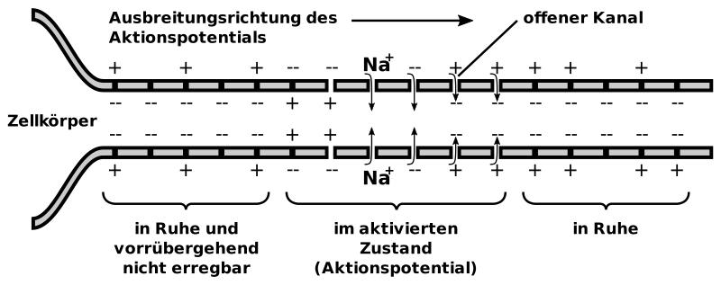
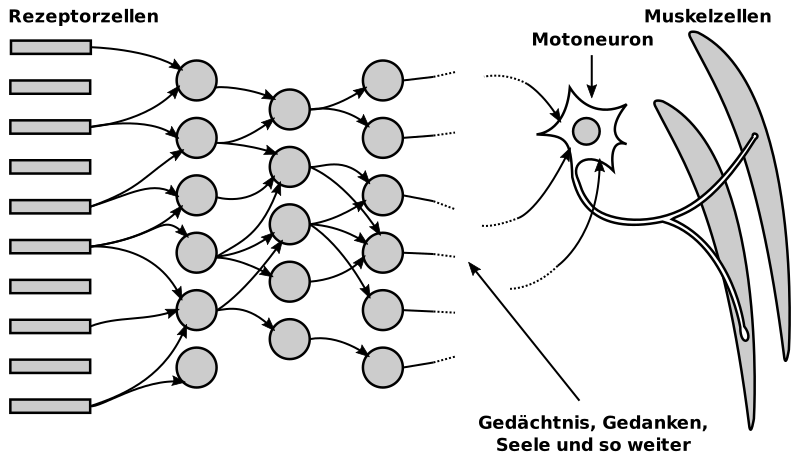

---
list-of-figures:
  label: Figure
  title: List of Figures
list-of-tables:
  label: Table
  title: List of Tables
cite:
  title: List of Sources
footnotes:
  title: Footnotes
abbreviations:
  title: List of Abbreviations
---

<!-- prettier-ignore -->
*[AC]: Air conduction
*[ALS]: Amyotrophic lateral sclerosis
*[BC]: Bone conduction
*[CNS]: Central Nervous System
*[CP]: Cerebral palsy
*[CVA]: Cerebral vascular accident
*[IHC]: Inner hair cells
*[MCD]: Minimal cerebral dysfunction
*[MCP]: Minimal cerebral palsy
*[MS]: Multiple Sklerose
*[OHC]: Outer hair cells
*[PAL]: Phase Alternating Line
*[PC]: Pacini corpuscles
*[RA]: rapidly adapting
*[RP]: Retinopathia pigmentosa
*[SA]: slowly adapting
*[SPL]: Sound Pressure Level
*[TBI]: Traumatic brain injury

# The Nervous System

## Nerve Cell Anatomy

The typical nerve cell, the neuron, consists of the roundish cell body, the filamentous nerve fiber (axon), which can be up to more than a meter long, and an abundance of branching projections called dendrites (a few millimeters long at most).
The nerve cell can receive information via the cell body and the dendrites, and the axon is responsible for transmitting information to other neurons (<<fig:structure-nerve-cell>>).

The point where information is transferred from one nerve cell to another is called a synapse.
There, an axon (or the branches occurring at the end of an axon) approaches another cell body or the dendrites of a nerve cell to within $0.02\;\sf{{\mu}m}$.
Across this gap, information is transmitted by a chemical process (release of neurotransmitters).

 [@servier-medical-art:2019, @maelicke:1990].")

As a rule, information is passed on in the form of short impulses.
The more a neuron is excited, the higher its pulse rate.
It is also said that the neuron “fires” or it generates action potentials.
Thus, the level of the neuron's excitation is expressed not by the magnitude of the action potential (i.e., not by its amplitude), but by the frequency at which the neuron fires[^5].
The pulse frequency of a nerve cell in the resting state is one pulse in several seconds (so-called spontaneous discharge) and can be almost up to $1\;\sf{kHz}$ during strong excitation.

[^5]: However, there are exceptions to this rule, especially for the receptor cells of the retina.

## Conduction and Action Potential

Simplified, the axon can be thought of as a tube connected to the cell body, surrounded and filled by an aqueous salt solution.
In this solution, mainly chloride, potassium, sodium and calcium ions (Cl-, K+, Na+ and Ca++) are present.
As a result of different ion concentrations inside and outside the axon, a potential difference (resting potential) of about $-70\;\sf{mV}$ (outside positive) occurs in the resting cell.

The membrane that surrounds the entire nerve cell, including the axon, has an extremely complex structure with millions of pores.
What is special about it is that there are different pores for the transport of the individual ions present in the aqueous solution (e.g., those that, when opened, allow only Na ions to pass through, while others are specialized for K or Ca ions).
These pores can now not only be opened or closed, but also function like pumps that can transport a particular type of ion from one side of the membrane to the other.

Through the above-mentioned pumps, it is now possible to transport ions of a certain type from one side of the membrane to the other.
Although this first step does not result in the formation of a potential difference (because for every ion of one type transported to the outside, an ion of the other type is transported to the inside), it does result in a change in the ion concentrations of a certain type on both sides of the membrane.
If, in a second step, pores that are permeable only to a certain type of ion are opened, ions of this type will diffuse to the other side according to their concentration gradient, without other charge carriers being able to migrate in the opposite direction.
Thus, a potential difference builds up which opposes the ionic motion until the system of concentration gradient and potential difference enters an equilibrium state at $-70\;\sf{mV}$[^6].

[^6]: In some respects, this is reminiscent of the conditions at a semiconductor junction, except that here the charge carriers are not electrons and holes, but various types of positively charged ions moving in a concentration gradient whose motions can be controlled by the opening and closing of selectively acting pores.

The conditions in a resting nerve cell can be described as follows: “pumping” increases the sodium-ion concentration outside the cell and the potassium-ion concentration inside, opening the pores for potassium-ion diffusion.
This, therefore, causes potassium ions to diffuse from the inside to the outside until such a high positive charge has built up on the outside that no further potassium ions can diffuse to the outside because of the repulsive forces.

Signal transmission along an axon by an action potential starts with the sudden opening of the sodium pores at one point of the axon.
Since the sodium ion concentration is higher on the outside than on the inside, numerous sodium ions migrate to the inside of the nerve cell, so that
at this point the potential ratios are reversed, i.e. the inside becomes positive compared to the outside – the membrane “depolarizes”.
Within $10^{-3}\;\sf{s}$, the original ratios (outside positive) are restored by closing the sodium pores and increasing the opening of the potassium pores (<<fig:conduction-axon>>).

Without going into too much detail now, it is still important to note for the understanding of information transmission in the axon that, firstly, there is a feedback effect of the potential conditions on the opening and closing of the different types of pores (depolarization causes the opening of pores, although the sodium pores close again by themselves) and that, secondly, the sodium pores cannot open again immediately after a depolarization has occurred (blocking time of about $1\;\sf{ms}$).
Both effects together cause that when a depolarization occurs, the action potential (starting from the cell body) travels along the axon in a given direction, at a speed ranging from $0.1$ to $10\;\sf{m/s}$.
Fast-conducting nerve fibers are surrounded by a myelin sheath to reduce capacitance, which is interrupted at intervals of about $1\;\sf{mm}$ by the so-called Ranvier lacing rings (see also <<fig:structure-nerve-cell>>).
In this process, depolarization jumps from lacing ring to lacing ring, allowing it to propagate more rapidly.
The rate at which a very active neuron can fire is usually $200\;\sf{Hz}$, with the absolute upper limit given as $800\;\sf{Hz}$.

## The Synapse

As soon as the stimulus reaches the end of the axon, the information is transmitted to other nerve cells.
Here again, special pores play a role, which open to calcium ions when the membrane is depolarized, and these then enter the interior of the axon (the Ca++ concentration is greater outside the axon than inside it).

The influx of calcium ions releases chemical compounds (called neurotransmitters) inside the axon terminal, which diffuse through the membrane and also across the $20\;\sf{nm}$-wide synaptic cleft to the next neuron (postsynaptic cell).
There, these substances cause the opening of certain types of pores.
If the postsynaptic cell responds to the neurotransmitter by opening sodium pores, depolarization is initiated – the nerve cell is thus excited and we then speak of an excitatory (energizing) synapse.
Conversely, the postsynaptic cell may also respond to the release of a neurotransmitter by opening potassium pores, which causes the cell to stabilize.
In this case, an inhibitory synapse is present.

Since each neuron is in synaptic connection with the axons of hundreds (to thousands) of other neurons via its dendrites, its own state of excitation is the result of the sum of all the excitatory and inhibitory stimuli acting on it.
This bundling or summation of the stimuli of many nerve cells onto a single one is called convergence.
The branching of an axon that allows one neuron to transmit its information to hundreds or thousands of other subsequent neurons is called divergence.
This interconnectedness formed from convergence and divergence accounts for the enormous capacity of the nervous system.

## Neural Pathways

1. **Input channels: Receptors**  
   Under input we can summarize all those signals from the environment (and from inside the body) that exert an effect on special neurons, which we call receptors.
   In contrast to nerve cells, which are located somewhere in the course of a nerve pathway and therefore receive their signals via synapses from upstream neurons, receptors react to external stimuli.
   First of all, the five classical human senses have receptor cells:

   - Optical receptors in the eye for vision
   - Acoustic/mechanical receptors for hearing
   - Chemical receptors for smell and
   - The sense of taste
   - Mechanical receptors for the sense of touch

   In addition to these five senses, our nervous system receives further input from:

   - Mechanical stimuli from the organ of balance.
   - Thermal stimuli from the skin.
   - Proprioception from joints, tendons and muscles, which allows us to perceive the position of the limbs and the force applied.
   - Nociception for the perception of pain.

   All of these receptor cells serve to convert a specific “measurand” into electrical signals (action potentials), which in turn lead to the release of neurotransmitters at the axon terminals and thus to the excitation of subsequent nerve cells.
   The strength of the stimulus acting on the receptor cell determines the rate at which this cell “fires”.

1. **Output channels: Motoneurons**  
   While the physical qualities for which sensors (i.e. receptors) are available to humans are quite diverse (optical, acoustic, mechanical, thermal, and chemical sensors), the output is strictly speaking limited to purely mechanical channels.

   At this point, one might rightly object that, in addition to body movements, the human voice (speech) is also available as an output channel.
   From the point of view of the nervous system, however, the voice is ultimately also “only” the interaction of purely motor variables such as tension of the vocal cords, articulation through the shaping of the vocal tract (mouth and pharynx), and motor influence of the respiratory air.

   Those neurons that provide stimulation of muscle fibers at the end of the output channel are called motor neurons, or motoneurons for short.

   In highly simplified terms, the entire nervous system can be represented as follows (<<fig:overall-representation-nervous-system>>):

   

   In the diagram above (<<fig:overall-representation-nervous-system>>), on the left are the receptor cells, the genus of neurons through which all impressions from the environment are received.
   These sensory neurons represent the first level of a neural pathway, which are connected by synaptic contacts to the neurons of the next level down.
   Thus, it continues from level to level to the deeper layers of the brain.

   The above diagram also makes it clear that the neurons of a given level both receive their information from several preceding neurons (convergence) and in turn transmit it to many succeeding neurons (divergence).

   However, the drawing taken from [@hubel:1989] also makes an honest statement about the state of current knowledge: many facts and functions are known both about the sensory neural pathways and their first levels on the way to the deeper layers of the brain and about the motor nervous system.
   In between, however, there is still a large area about whose function almost no statements can be made.
   {.lower-alpha}

## The Cranial Nerves

In the region of the head, $12$ cranial nerves (pairs) branch off from the central nervous system (CNS) and are usually designated by Roman numerals in the medical literature.
In <<tab:names-functions-cranial-nerves>>, the names and major supply areas or functions of the cranial nerves are summarized.

<table>
    <thead>
        <tr>
            <th>Number</th>
            <th colspan="2">Name</th>
            <th>Supply Area/Function</th>
        </tr>
    </thead>
    <tr>
        <td>I</td>
        <td colspan="2">Smell pathway (tractus olfactorius)</td>
        <td>Axons of the olfactory cells of the nose, total olfactory sensation</td>
    </tr>
    <tr>
        <td>II</td>
        <td colspan="2">Optical nerve (optic nerve)</td>
        <td>Total visual perception</td>
    </tr>
    <tr>
        <td>III</td>
        <td colspan="2">Oculomotor nerve</td>
        <td>
            <ul class="no-bullets no-padding no-ident">
                <li>Lens of the eye (ciliary muscle),</li>
                <li>Iris (pupillary muscle)</li>
                <li>Upper eyelid (siphon of the upper eyelid)</li>
                <li>Eye movements</li>
            </ul>
        </td>
    </tr>
    <tr>
        <td>IV</td>
        <td colspan="2">Trochlear nerve</td>
        <td>Eye movement</td>
    </tr>
    <tr>
        <td rowspan="6">V</td>
        <td colspan="3">Trigeminal nerve (trigeminal nerve)</td>
    </tr>
    <tr>
      <td colspan="3">Radix sensoria & sensory part of trigeminal nerve consisting of:</td>
    </tr>
    <tr>
      <td>V1</td>
      <td>Ophthalmic nerve</td>
      <td>among other things, forehead, upper eyelid, nasal bridge</td>
    </tr>
    <tr>
      <td>V2</td>
      <td>Maxillary nerve</td>
      <td>among other things, lower eyelid, cheek, upper lip</td>
    </tr>
    <tr>
      <td>V3</td>
      <td>Mandibular nerve</td>
      <td>among other things, tongue, lower lip, chin</td>
    </tr>
    <tr>
      <td>V4</td>
      <td>Radix motorica (motor part of the trigeminal nerve, follows N. mandibularis)</td>
      <td>Masticatory muscles, palate, floor of the mouth, eustachian tube</td>
    </tr>
    <!-- <tr>
        <td rowspan="4">V</td>
        <td></td>
        <td>Trigeminal nerve (trigeminal nerve)</td>
        <td></td>
    </tr>
    <tr>
        <td rowspan="2">V1, V2, V3</td>
        <td>Radix sensoria & sensory part of trigeminal nerve consisting of:</td>
        <td></td>
    </tr>
    <tr>
        <td>
            <ul class="no-bullets no-ident no-padding no-wrap">
                <li>Ophthalmic nerve (V1)</li>
                <li>Maxillary nerve (V2)</li>
                <li>Mandibular nerve (V3)</li>
            </ul>
        </td>
        <td>
            <ul class="no-bullets no-ident no-padding">
                <li>among other things, forehead, upper eyelid, nasal bridge</li>
                <li>among other things, lower eyelid, cheek, upper lip</li>
                <li>among other things, tongue, lower lip, chin</li>
            </ul>
        </td>
    </tr>
    <tr>
        <td>V4</td>
        <td>Radix motorica (motor part of the trigeminal nerve, follows N. mandibularis)</td>
        <td>Masticatory muscles, palate, floor of the mouth, eustachian tube</td>
    </tr> -->
    <tr>
        <td>VI</td>
        <td colspan="2">Abducens nerve</td>
        <td>Eye movement (abduction)</td>
    </tr>
    <tr>
        <td>VII</td>
        <td colspan="2">Facial nerve</td>
        <td>including mimic muscles, middle ear muscles, mandibular muscles, secretion of lacrimal and salivary glands, taste fibers of the anterior <MathML formula="2/3"/> of the tongue</td>
    </tr>
    <tr>
        <td>VIII</td>
        <td colspan="2">Hearing and balance nerve (vestibulo-cochlear nerve)</td>
        <td>Cochlea and vestibular apparatus (organ of balance)</td>
    </tr>
    <tr>
        <td>IX</td>
        <td colspan="2">Glossopharyngeal nerve</td>
        <td>Gaumen and pharyngeal muscles, taste fibers of the posterior <MathML formula="1/3"/> of the tongue</td>
    </tr>
    <tr>
        <td>X</td>
        <td colspan="2">Vagus nerve</td>
        <td>including larynx, thoracic and abdominal organs</td>
    </tr>
    <tr>
        <td>XI</td>
        <td colspan="2">Accessory nerve</td>
        <td>including head movements, scapula, raising the upper arm above horizontal</td>
    </tr>
    <tr>
        <td>XII</td>
        <td colspan="2">Hypoglossal nerve</td>
        <td>Tongue musculature</td>
    </tr>
</table>

.names-functions-cranial-nerves#Names and main functions of the cranial nerves [@pschyrembel:1989].

The cranial nerves play a special role in rehabilitation technology because they are not affected even by high-lying spinal injuries and the functions with which they are associated are not lost.

!!!include(general/attribution.en.md)!!!
