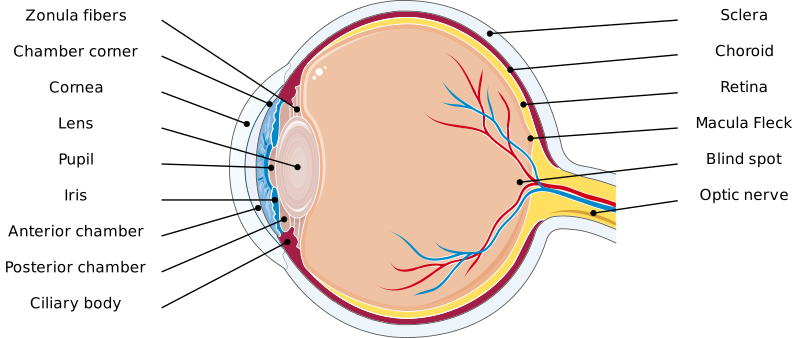
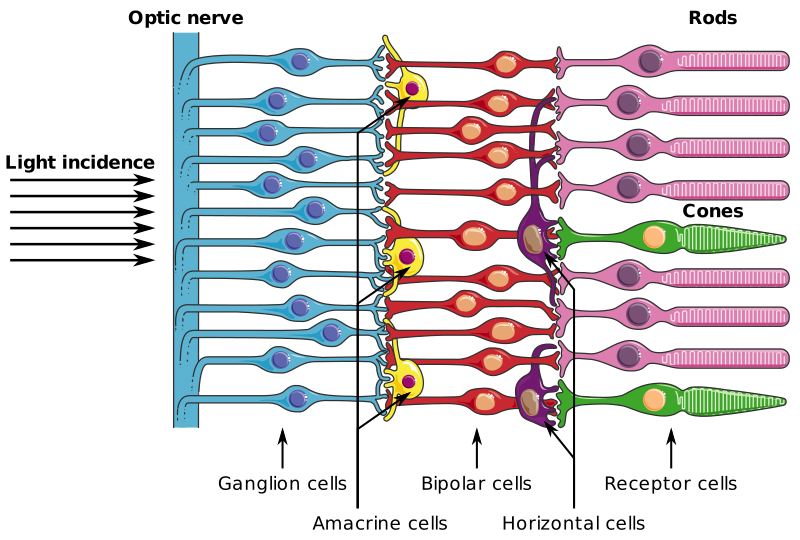

---
list-of-figures:
  label: Figure
  title: List of Figures
list-of-tables:
  label: Table
  title: List of Tables
cite:
  title: List of Sources
footnotes:
  title: Footnotes
abbreviations:
  title: List of Abbreviations
---

<!-- prettier-ignore -->
*[PAL]: Phase Alternating Line

# Eye and Visual Perception

## Structure of the Eye

The sensory organ for the perception of optical stimuli is the eye.
The human eyeball (bulb) is spherical and has a diameter of approximately $25\;\sf{mm}$.
Made of a transparent, gelatinous substance, the vitreous body (corpus vitreum), which fills the entire interior, is surrounded and held in shape by three layers of tissue (<<fig:cutaway-human-eye>>).

The outermost eye tissue, the sclera, has little elasticity and is responsible for shaping it.
In the anterior part of the eye, the sclera merges with the transparent cornea in front of the lens.

The middle layer is composed of three sections.
Three quarters of the eyeball is enclosed by the choroid, which is interspersed by numerous blood vessels.
In front, around the lens, the choroid merges into the corpus ciliare, which contains the ciliary muscle, which provides accommodation (focusing) by changing the curvature of the lens.
The aqueous humor is also formed in the corpus ciliare.
The ratio of production and reabsorption of the aqueous humor determines the intraocular pressure.
Even further in front is the iris, which determines the amount of light entering the eye by altering the pupil (“iris diaphragm” in photography).

The innermost eye tissue resting on the vitreous body is the retina, which in turn consists of several layers.

## The Retina

The retina is the carrier of photoreceptors as well as several layers of nerves that perform initial processing of visual stimuli.
It enables the perception of intensity, wavelength and spatial allocation of incident optical stimuli.

The detection of optical stimuli begins in the layer of the retina facing away from the light, which carries the photoreceptors (“inverse” eye).
The approximately $120\;\sf{million}$ rods enable black and white (light/dark) vision, while $6\;\sf{million}$ three-wavelength cones serve the color perception (<<fig:cutaway-retina>>).

The spectral range covered by the eye extends from $350\;\sf{nm}$ (blue) to $750\;\sf{nm}$ (red), with a maximum overall sensitivity at $560\;\sf{nm}$ (green).
The maxima of spectral sensitivities for the three types of cones are $560\;\sf{nm}$ (yellow-green), $530\;\sf{nm}$ (blue-green), and $430\;\sf{nm}$ (violet).
Simplified, we often speak of “blue,” “green,” and “red” cones.
Of all the cones found in the retina, about $46\%$ are red, $46\%$ are green, but only $8\%$ are blue ([@bright:1997], <<fig:spectral-behavior-cones>>).
The rods reach their spectral maximum at $510\;\sf{nm}$ and make no contribution to color perception.

## Intensity Range and Adaptation

The intensity over which the eye can process stimuli spans a range of $1:10^{12}$ (<<tab:sensitivity-rod-cone>>) and is managed by different mechanisms of adaptation:

- Use of two differently sensitive receptor types (rods and cones).
- Change of the amount of incident light through the pupil (ratio $1:16$ – fast process[^7])
- Buildup and breakdown of visual pigment in the receptors (slow).
- Adaptive spatial and temporal stimulus integration in the retina.

[^7]: this value refers to the juvenile eye; for conditions in old age, see later.

The sensitivity of rods is about $2\:000$ times higher than that of cones.
At low luminances (twilight), therefore, the cones make no contribution, with the result that color perception is possible only with sufficient illumination.

<!-- prettier-ignore -->
| Illuminance [lx] | $10^{-5}$ | $10^{-4}$ | $10^{-3}$ | $10^{-2}$ | $10^{-1}$ | $10^{-0}$ | $10^{1}$ | $10^{2}$ | $10^{3}$ | $10^{4}$ | $10^{5}$ | $10^{6}$ |
| ---------------- | --------- | --------- | --------- | --------- | --------- | --------- | -------- | -------- | -------- | -------- | -------- | -------- |
| Rods             | yes       | yes       | yes       | yes       | yes       | yes       | yes      |          |          |          |          |          |
| Cones            |           |           |           | yes       | yes       | yes       | yes      | yes      | yes      | yes      | yes      | yes      |
| Scope            | scotopic                        ||| mesopic                                   |||| photopic                                         |||||

.sensitivity-rod-cone#Absolute sensitivity of rods and cones [@zagler:1997].

If the rods[^8] are missing due to a damage of the eye, only day vision (mesopic and photopic vision) is possible and night blindness occurs (no scotopic vision).
The eye, with an absolute intensity threshold of $8\cdot10^{-18}\;\sf{W/cm^2}$, is more sensitive by a factor of $10$ compared to the ear.

[^8]: Since the peripheral area of the retina is almost exclusively occupied by rods, a failure of this receptor type leads not only to night blindness but also to a loss of the peripheral visual field, resulting in so-called tunnel vision.

## Spatial Resolution

In an area of about $\pm~1\degree$ degrees around that point where the optical axis of the eye meets the retina, within the yellow spot (macula; lat. macula) lies the visual pit (fovea centralis; fovea: lat. pit).
In this zone of sharpest vision there are almost only cones with a density of $400\:000\sf{/mm^{2}}$ (for comparison: a standard TV (Low Definition/PAL) picture has $520\:000$ pixels).
Here, the nerve tracts that otherwise overlie the receptors are shifted toward the edge of the macula, forming the macular wall, allowing light to fall directly on the cones.
The macula therefore exhibits high spatial resolution and good color recognition.
Because of the absence of rods, scotopic vision is not possible in the foveal region (the fovea is “night blind” so to speak), but because the cones are not covered by other cells, photopic sensitivity is greater within the fovea than elsewhere in the retina.

A distance of $1\,\sf{mm}$ on the retina covers a visual field of $3.5\degree$.
Within the fovea centralis, objects can be discriminated at a distance of $0.5$ to $1$ arcminutes, corresponding to a distance on the retina of $2.5$ to $5.0\,\sf{\mu}m$.
Outside the fovea centralis, the resolution is only around $1\degree$ (corresponding to a distance of $0.3\,\sf{mm}$).

## Accommodation (Focusing)

The focusing of the eye (accommodation) is done by changing the refractive power of the lens.
The far accommodated eye (setting at infinity) has a refractive power of about $60$ diopters[^9] ($=17\sf{mm}$ focal length).
At maximum near accommodation (setting to $10\sf{cm}$), the refractive power increases by about $12$ diopters[^10].
The exact values for the so-called emmetropic (normally sighted) eye are given in the literature as follows (<<tab:refractive-power-emmetropic-eye>>):

[^9]: diopter = reciprocal of (anterior) focal length in meters; abbreviation dpt.
[^10]: Applies to the juvenile eye and is strongly dependent on age.

<table>
  <thead>
    <tr>
      <th>State</th>
      <th>Location</th>
      <th>Refractive power [dpt]</th>
      <th>Focal length [mm]</th>
    </tr>
  </thead>
  <tbody>
    <tr>
      <td rowspan="3">Accommodative rest</td>
      <td>Cornea and anterior chamber</td>
      <td><MathML formula="43.05\;\sf{dpt}"/></td>
      <td><MathML formula="23.23\;\sf{mm}"/></td>
    </tr>
    <tr>
      <td>Lens and vitreous body</td>
      <td><MathML formula="19.11\;\sf{dpt}"/></td>
      <td><MathML formula="52.33\;\sf{mm}"/></td>
    </tr>
    <tr>
      <td>Total (equivalent system)</td>
      <td><MathML formula="58.64\;\sf{dpt}"/></td>
      <td><MathML formula="17.05\;\sf{mm}"/></td>
    </tr>
    <tr>
      <td>Max. Accommodation</td>
      <td>Total (equivalent system)</td>
      <td><MathML formula="70.57\;\sf{dpt}"/></td>
      <td><MathML formula="14.15\;\sf{mm}"/></td>
    </tr>
  </tbody>
</table>

.refractive-power-emmetropic-eye#Refractive power of the emmetropic eye [@methling:1996].

Thus, approximately $2/3$ of the total refractive power is applied by the cornea and anterior chamber and $1/3$ by the lens and vitreous body.
Contraction of the ciliary muscle relaxes the zonular fibers.
The lens becomes thicker due to its elasticity, the refractive power is increased, and the eye accommodates to near (<<fig:eye-lens-and-accommodation>>).

## Blink

The eyelid serves to protect and moisten the eyeball.
The blink (closing of the upper eyelid) is either involuntary-periodic, voluntary or reflexive.
The frequency with which the involuntary blink occurs is highly dependent on the individual.
An average guideline is $15$ to $16$ blinks/min [@wilson:1996:a].
The eyelid blink frequency increases during long-lasting activities with high visual demand and can then reach values up to more than $70$ eyelid blinks/min [@methling:1996].

The duration of a blink (time during which the eye remains closed) is reported in the literature to be less than $100\sf{ms}$ for involuntary blinks, but greater than $250\sf{ms}$ for voluntary blinks [@lauruska:1996].

## Preprocessing and Information Aggregation in the Retina

In addition to the receptor cells (on the right in <<fig:cutaway-retina>>), there are four other layers of neurons in the retina that already provide “wiring” of signals within the retina and thus make a significant contribution to image preprocessing.
The efficiency of these layers is evident from the fact alone that $125$ million receptors (sum of about $120$ million rods and $6$ million cones) face only $1$ million nerve fibers (ganglion cell axons) in the optic nerve.
In other words, we register a convergence of $125:1$ between receptors and optic nerve, without, however, information recorded by the eye being simply lost at this step.

## The Receptive Fields

Studies of the relationships between optical stimuli and neural activity deployed by the retina yielded rather puzzling and inexplicable results until the middle of the $20.$ century.
The eye exposed to complete darkness showed moderate neural activity (“spontaneous firing”).
But contrary to expectations, this did not increase significantly when exposed to diffuse light.
<<fig:equal-exposure-receptive-field>> schematically shows the experimental setup in which a receptive field is diffusely illuminated.
The action potential is derived at the ganglion cell (optic nerve) axon.

 exposure of a receptive field [@lindsay:1981].")

It was not until $1950$ that Stephen Kuffler was able to show that retinal ganglion cells do not respond to diffuse illumination per se, but only to local illumination contrasts.
A punctate exposure at or near that location (= center of the receptive field) from which the derivation was made leads to a marked increase in the impulse rate (<<fig:selective-exposure-receptive-field>> – left).
Exposure of a ring-shaped zone (= surrounding of the receptive field) around the derivation site has an inhibitory effect, so that even spontaneous firing disappears (<<fig:selective-exposure-receptive-field>> – right).

 center and (b) surroundings of a receptive field [@lindsay:1981].")

More detailed investigations showed that there are two types of ganglion cells which differ according to the way they respond to exposure of their receptive field.
In both cases, a distinction must be made between the circular center of the respective receptive field and an antagonistic ring-shaped surrounding.
Through this principle, known as lateral inhibition, an increase in image sharpness is achieved.

## Measurement of Visual Acuity

The visual performance of the eye is indicated by the visual acuity, which more precisely is the resolving power of the eye.
Visual acuity (V) is the reciprocal of the smallest angle (W~min~ in minutes of arc) at which two points can still be perceived separately.

$$
\sf{V}=1\sf{/W_{min}}
$$

Under good lighting conditions, a normally sighted eye can just keep two points apart when they appear at an angle of $1$ arcminute ($1'$).

The visual acuity is then $V=1/1=1$.

In principle, all objects for which a significant detail appears at the angle of $1'$ from the respective specified distance (optotypes) are suitable for determining visual acuity.
For this purpose, e.g., visual test charts with letters (Snellen chart, <<fig:snellen-chart>>) or rings (Landolt rings, <<fig:landolt-rings>>) can be used.
The slit in the rings is seen from the “target distance” below $1'$.
The visual power is calculated from the quotient of actual distance by target distance.
For example, if the orientation of the slit of a Landolt ring for a target distance of $8.5\sf{m}$ can only be detected when approaching $3.3\sf{m}$, the visual acuity is $3.3/8.5=0.39$.

The visual acuity of a person with normal vision is $V=1$.
To read a newspaper, a visual acuity of at least $0.4$ is required.

<!--
 Bild: Hub 89, linker Teil dazugezeichnet
 FIXME: Bildquelle
-->

!!!include(general/attribution.en.md)!!!
