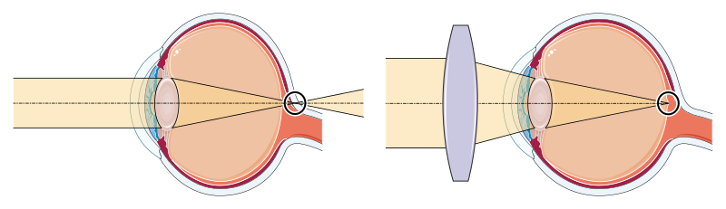
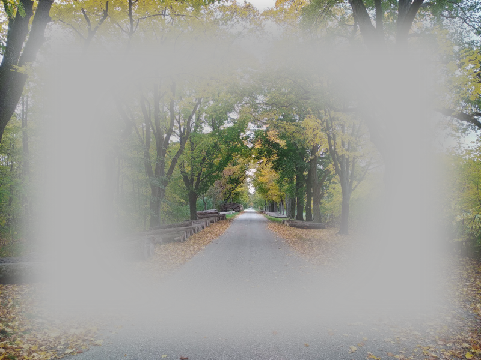
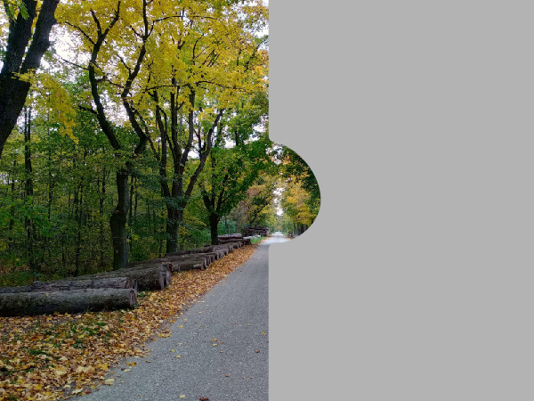

---
list-of-figures:
  label: Figure
  title: List of Figures
list-of-tables:
  label: Table
  title: List of Tables
cite:
  title: List of Sources
footnotes:
  title: Footnotes
abbreviations:
  title: List of Abbreviations
---

<!-- prettier-ignore -->
*[RP]: Retinopathia pigmentosa

# Visual Disabilities

## Classification of Visual Impairment

Visual impairment is usually classified according to <<tab:classification-visual-impairment>>.
This rating is valid with optimal optical correction (glasses, contact lenses) for the better eye.

| Designation              | Visual Acuity |
| ------------------------ | ------------- |
| Visual Impairment        | $\lt~0.3$     |
| Severe visual impairment | $\lt~0.05$    |
| Legally blind            | $\lt~0.02$    |

.classification-visual-impairment#Classification of visual impairments.

## Causes of Visual Impairments

<!-- FIXME: Abbildungsverweis -->

Some of the most common eye diseases (in Western countries) and their effects on the vision of the affected person are described below.
For illustration purposes, the associated figures reproduce the view perceived by a person suffering from the eye disease in question ([Figure: One-dimensional and multi-layered views of disability](chapter1.html#sichtweise-behinderung)).

It must be pointed out that this illustration as well as all simulations of visual impairments are only very rough approximations of the actual situation.
Visual field defects cannot simply be simulated by black areas, although this is often done in illustrations.
Here, a neutral gray was deliberately chosen, which still comes closest to a non-existent perception.

Even if it were possible to draw a visually faithful picture of a visual impairment, this representation would only remain on the surface, since any kind of disability not only restricts the affected person functionally, but also deeply shapes his or her personality and imagination.
For example, if someone thinks he or she understands blindness by wearing a blindfold, he or she is subject to a huge error.

## Refractive Anomalies – Refractive Errors of the Eye

If the refractive power of the optical elements of the eye (cornea, lens, and vitreous body) does not match the length of the eyeball, a sharp image cannot be formed on the retina.
Eyeglasses and contact lenses can compensate for $90\%$ of refractive anomalies.
In refractive anomalies we distinguish:

1. Myopia  
   In myopia, the refractive power of the eye is too high (focal length too short) or the eyeball is too long.
   The plane of focus (especially of distant objects) is in front of the retina.
   The remedy is glasses or contact lenses with a dispersing effect (<<fig:ray-tracing-myopia>>).
   The effects of myopia are shown in <<fig:myopia>>.

   

   

2. Hyperopia (farsightedness)  
   In farsightedness (hyperopia, hypermetropia) the refractive power of the eye is too low (focal length too long) or the eyeball is too short.
   The plane of focus (especially of close objects) is behind the retina.
   The remedy is a pair of glasses or contact lens with collecting effect (<<fig:ray-trace-hyperopia>>).

   

3. Presbyopia  
   The so-called presbyopia has similar effects as hyperopia, but the cause is a reduced elasticity of the eye lens with increasing age (see also <<fig:eye-lens-and-accommodation>>).
   As a result, near accommodation becomes limited and the near point moves more and more into the distance.
   Presbyopia is said to occur when the range of accommodation (the so-called accommodation success) has decreased to values below $4\;\sf{dpt}$ (values in youth are around $12\;\sf{dpt}$).

   Reading glasses (glasses with converging lenses worn when looking at near objects) or glasses with multifocal or progressive lenses provide a remedy.
   With multifocal lenses, there is a zone of higher refractive power in the lower part of the lens.
   When the gaze is lowered for reading, the visual axis passes through this part of the lens and near accommodation is supported.
   The progressive lens works on the same principle, but the transition from the upper, lower refractive part to the lower, higher refractive part is stepless.
   {.lower-alpha}

## Glaucoma

Glaucoma is caused by increased intraocular pressure, i.e. by an excess of aqueous humor.
In most cases, there is an obstruction of the outflow pathways of the aqueous humor.
Overproduction of aqueous humor, on the other hand, is rare.
Normal intraocular pressure is $13$ to $28\sf{mbar}$; in glaucoma, it increases to values between $50$ to $80\sf{mbar}$.

The increased intraocular pressure can cause damage to the optic nerve papilla (at the blind spot where the optic nerve leaves the eyeball) within hours (!), which leads to the progessive mutilation of nerve cells due to the interruption of blood supply and thus to irreversible visual field loss (<<fig:glaucoma>>).

If the rising intraocular pressure, which becomes noticeable through color perception and “fog”, is detected in time, it can be counteracted with medication.
In rare cases, surgical intervention is required.
Glaucoma is the most common cause of blindness worldwide.

## Cataract

Various reasons such as injuries (_cataracta traumatica_), diabetes (_cataracta diabetica_), heat effects (_cataracta calorica_, in foundrymen and glassblowers), radiation damage (_cataracta e radiatione_), electrical accidents, poisoning, viral infections during pregnancy (_embryopathia rubeolosa_[^11]) as well as the aging process can lead to opacification of the eye lens.
As a result, vision is reduced by clouding of the image, but also by glare due to light scattering, which may go as far as restriction to light/dark perception (<<fig:cataract>>).

[^11]: Rubella infection of the mother mainly in the first month of pregnancy.

Cataract is relatively easy to correct surgically by surgical removal of the lens.
The refractive power of the lens lost as a result can be replaced either by cataract glasses ($+12\;\sf{dpt}$) or by implantation of a plastic lens.
In the absence of adequate medical care, cataracts are a common cause of blindness in developing countries.

## Retinopathy pigmentosa (Retinitis pigmentosa) (RP)

Retinopathia pigmentosa (tapetoretinal degeneration; usually incorrectly called retinitis pigmentosa, as it is not an inflammation) is the most common degenerative retinal disease.
It is usually hereditary; less commonly, it can be triggered by infectious diseases or poisoning.
It is caused by a metabolic disorder of an enzyme.
Already in childhood, poor vision in twilight occurs (night blindness due to failure of the rods required for scotopic vision).

Later, a ring-shaped visual field loss (annular scotoma) also occurs during the day, leaving only a visual field of $10\degree$ to $15\degree$.
In later stages, retinopathy pigmentosa leads to “tunnel vision” (a visual field reduced to a few degrees) and thus to practical blindness, although central vision (visual acuity) may still be quite good (<<fig:retinopathia-pigmentosa>>).

 [@frederiksen:1989].")

## Hemianopia (Hemianopsia)

Hemianopia (hemianopsia) is a hemifacial loss of the visual field.
In homonymous hemianopia shown in <<fig:hemianopia>>, the same half of the visual field is affected in both eyes.
This is caused by damage (e.g., tumors, traumatic brain injury) to the visual pathway starting at the optic nerve junction (optic cord, lateral malleolus, optic radiation, and visual cortex), the areas where half the visual field of both eyes is transmitted and processed.
The interruption of hemianopia in the center of the visual field results from the fact that in the optic nerve junction, nerve fibers originating from the fovea are conducted to both the one and the other hemisphere.
Thus, both hemispheres are involved in the processing of the foveal area [@betz:1991].
Therefore, in case of damage in one occipital lobe, stimuli from the entire fovea can still be perceived [@wilson:1996:a].

!!!include(general/attribution.en.md)!!!
