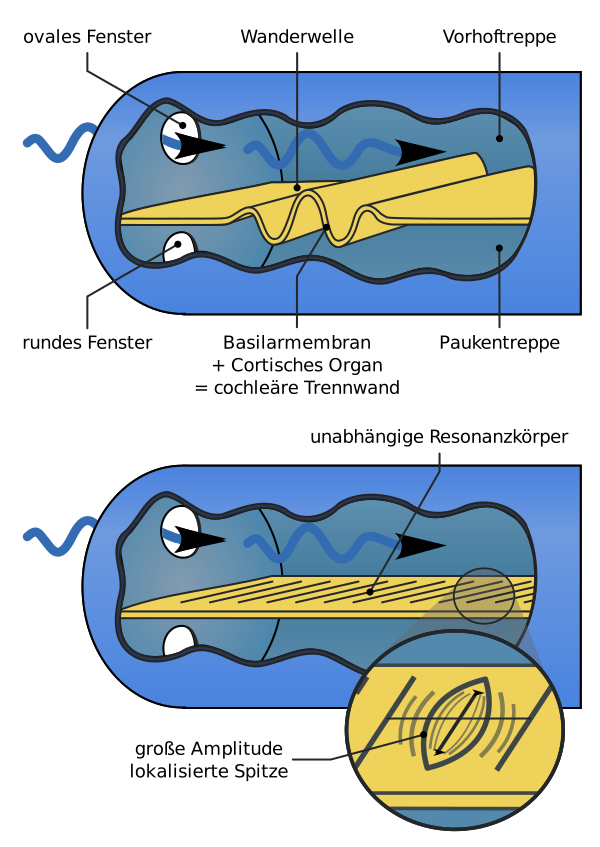
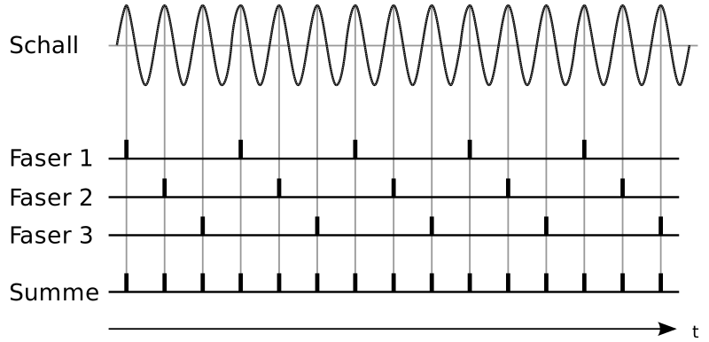

---
list-of-figures:
  label: Abbildung
  title: Abbildungsverzeichnis
list-of-tables:
  label: Tabelle
  title: Tabellenverzeichnis
cite:
  title: Quellenverzeichnis
footnotes:
  title: Fußnoten
abbreviations:
  title: Abkürzungsverzeichnis
---

<!-- prettier-ignore -->
*[engl.]: englisch
*[IHC]: Inner hair cells
*[OHC]: Outer hair cells
*[SPL]: Sound Pressure Level
*[ZNS]: Zentralnervensystem

# Ohr und auditive Wahrnehmung

## Definitionen

Das Ohr dient der Wahrnehmung von Schallwellen, worunter Dichteschwingungen eines elastischen Mediums verstanden werden.
Für das Ohr sind das üblicherweise Druckschwankungen der umgebenden Luft.
Die physikalische Beschreibung des Schalls wird Akustik genannt, während man die anatomischen und physiologischen Vorgänge der Schallwahrnehmung als auditiv bezeichnet.

Als **Ton** wird eine Sinusschwingung mit _einer_ bestimmten Frequenz bezeichnet.
Die Überlagerung endlich vieler Töne und deren Obertöne nennt man **Klang**.
Ein **Geräusch** besteht aus der Überlagerung unendlich vieler Töne.
Den zur Wahrnehmung eines Tones mindestens erforderlichen Schalldruck bezeichnet man als Hörschwelle.

## Messgrößen

Der Schalldruck (_Sound Pressure Level_ = SPL) wird in Pascal ($1\sf{Pa}=1\sf{N/m^2}$) gemessen.
Wegen der in der Akustik sonst erforderlichen großen Zahlen wird üblicherweise mit dem Schalldruckpegel $L$ gearbeitet, ein in Dezibel angegebenes logarithmisches Maß, das das Verhältnis zum Bezugsschalldruck $p_0$ angibt:

$$
L=20\log{\frac{P_{x}}{P_0}\sf{[db]}}
$$

wobei $p_0$ der willkürlich festgelegte Bezugsschalldruck: $p_0=2\cdot10^{-5}\sf{N/m^2}$ ist.

$20\;\sf{dB}$ bedeuten somit eine Verzehnfachung des Schalldrucks.
Einer Verdopplung des Schalldruckes entspricht ein Zuwachs von $6\;\sf{dB}$.
Beträgt der Hörverlust einer Person $80\;\sf{dB}$ (das ist die Mitte jenes Bereiches, der als hochgradige Hörschädigung bewertet wird), dann ist der $10\:000$-fache Schalldruck in Bezug auf eine normal hörende Person erforderlich.

Das Maß für die (subjektive) Lautstärke eines Schalls ist das Phon.
Die Lautstärke ist zahlenmäßig gleich dem Schalldruckpegel (in dB) für einen gleich laut empfundenen $1\:000\;\sf{Hz}$ Ton (<<fig:dynamikbereich-ohr>>).
Die Isophone ist die Menge aller gleich laut empfundenen Töne.

::: figcaption

Die dargestellten Kurven (Isophone) geben gleich laut empfundene Lautstärke in Phon an; schattiert: Hauptsprachbereich [@betz:1991, @schmidt:1997].
Der für Telefon angegebene Frequenzbereich bezieht sich auf die Bandbreiten analoger Telefonsysteme [^12].

:::

[^12]: Analoge Telefonsysteme sind mit einer Bandbreite von ca. $3.1\;\sf{kHz}$ ($300$ bis $3\:400\;\sf{Hz}$) spezifiziert. Digitale Systeme (ISDN) können Bandbreiten von typisch $7\;\sf{kHz}$ erreichen.

Unter der Schallimpedanz versteht den Wellenwiderstand (Produkt aus Dichte und Schallgeschwindigkeit) eines Mediums [@pschyrembel:1989].

<!-- FIXME: Querverweis -->
<!-- FIXME: Einheiten? -->

Für die Bewertung von Hörleistungen bzw. Hörverlusten in der Audiometrie (siehe Kapitel [Bestimmung des Hörvermögens – Audiometrie](#bestimmung-des-horvermogens-audiometrie)) wird ein logarithmisches Maß (dB) verwendet, dessen Nullpunkt bei der jeweils betrachteten Frequenz die „normale Hörschwelle“ ist (audiometrischer Nullpunkt).
Hörverluste werden in dB HV oder dB HL (Zusatz HV für Hörverlust bzw. HL für _Hearing Loss_ oder _Hearing Level_) angegeben und geben an, um wie viel dB der Schalldruck über die normale Hörschwelle (siehe <<fig:dynamikbereich-ohr>>) angehoben werden muss, damit eine hörbehinderte Person einen Ton bei einer bestimmten Frequenz wahrnehmen kann.

Zur Bewertung der Wahrnehmung von akustischen Signalen bei Anwesenheit von Störgeräuschen wird ein weiteres mit dB SL (Zusatz SL für Sensation Level) bezeichnetes Verhältnis verwendet.
Die Referenzschwelle (also $0\;\sf{dB}$ SL) wird für eine bestimmte zu bewertende Hörsituation dort gelegt, wo die Versuchsperson das Schallereignis (das Signal) bei $50\%$ der durchgeführten Messungen aus des Hintergrundgeräusch (Rauschen) heraushören kann.
Der in dB SL angegebene Schalldruckpegel gibt daher an, um wie viel ein Signal über dieser Referenzschwelle liegt.
Mit anderen Worten wird damit das Signal-Rausch-Verhältnis angegeben [@hellbrück:1993].

## Anatomie des Ohres

1. Äußeres Ohr  
   Das äußere Ohr – von der Ohrmuschel bis zum Trommelfell – stellt einen etwa $3$ bis $3.5\;\sf{cm}$ langen Trichter dar, der die Schallwellen aus der Umgebung zum Trommelfell leitet.
   Dabei ist es wichtig, dass die Luft auf beiden Seiten des Trommelfells die gleiche Temperatur (Körpertemperatur) hat, da sonst die unterschiedliche Brownsche Molekularbewegung wegen der hohen Empfindlichkeit des Ohres bereits störend wahrnehmbar wäre.

   Der äußere Gehörgang wirkt verstärkend und weist bei der Resonanzfrequenz (ca. $2\:500\;\sf{Hz}$) eine Verstärkung von $20\;\sf{dB}$ auf.
   Diese Verstärkung liegt also in jenem Bereich, der für das Sprachverständnis wichtig ist (Hauptsprachbereich, siehe <<fig:dynamikbereich-ohr>>).
   Da beim Kleinkind der äußere Gehörgang nur wenige Millimeter lang ist, verschiebt sich die Resonanz deutlich zu höheren Frequenzen, was zur Folge hat, dass Kleinkinder hohe Frequenzen bevorzugter wahrnehmen.

2. Mittelohr  
   Die Weiterleitung des Schalls im Mittelohr (Paukenhöhle) – zwischen dem Trommelfell und dem ovalen Fenster – erfolgt über die drei gelenkig miteinander verbundenen Gehörknöchelchen: Hammer (_Malleus_), Amboss (_Incus_) und Steigbügel (_Stapes_).
   Der Durchmesser der Paukenhöhle (vom Trommelfell bis zur Innenwand) beträgt nur etwa $5\;\sf{mm}$.
   Die Dicke des Trommelfells beträgt $0.1\;\sf{mm}$ (<<fig:schnitt-durch-ohr>>).

   

   ::: figcaption

   1. Ohrmuschel;
   2. Äußerer Gehörgang;
   3. Trommelfell;
   4. Hammer;
   5. Paukenhöhle;
   6. Amboss;
   7. Steigbügel;
   8. Steigbügelplatte im ovalen Fenster;
   9. rundes Fenster;
   10. Schnecke;
   11. Bogengänge des Vestibularapparates (Gleichgewichtsorgan)
       {.lower-alpha}

   :::

   Die Auslenkungen des Trommelfells (bei der Hörschwelle kleiner als $10^{-10}\;\sf{m}$, das ist $1\sf{\mathring{A}}$, $0.1\;\sf{nm}$ oder etwa der Durchmesser eines Wasserstoffatoms) werden in komplizierten (frequenzabhängigen) Bewegungen über die drei Gehörknöchelchen zum ovalen Fenster übertragen.
   Dabei wird einerseits die Bewegungsamplitude durch die Hebelwirkung der Gehörknöchelchen herabgesetzt (etwa um den Faktor $0.7$) bzw. die Kraft, die am ovalen Fenster zur Verfügung steht, entsprechend vergrößert.
   Andererseits verhalten sich die Flächen von Trommelfell und ovalem Fenster etwa wie $20:1$, wodurch eine bedeutende Druckerhöhung ($\sf{Druck}=\sf{Kraft/Fläche}$ erzielt wird.
   Genaue Messungen gestalten sich überaus schwierig, doch geht man in der Literatur von einer gesamten Druckverstärkung um den Faktor $35$ aus.
   Theoretisch kann unter Einbeziehung aller Faktoren der Wert aber auch wesentlich höher liegen.

   Diese Druck-Transformation ist erforderlich, da ohne sie das flüssigkeitsgefüllte Innenohr nur äußerst schlecht von schwingender Luft angeregt werden könnte.
   Konkret würden durch Reflexion $98\%$ der Schallenergie verloren gehen und nur $2\%$ an das Innenohr weitergegeben werden.
   Die Impedanzanpassung durch das Mittelohr erreicht, dass im Mittel $60\%$ der Schallenergie übertragen werden können.

   <!-- FIXME: Querverweis -->

   Die Gehörknöchelchen bewirken außerdem, dass die Schallenergie nicht auf das gesamte Innenohr, sondern nur auf das ovale Fenster übertragen wird.
   Das runde Fenster (die zweite Verbindungsstelle zwischen Mittelohr und Innenohr) kann daher gegenphasig schwingen, was für die Funktion der Schnecke (siehe Kapitel [Physiologie des Ohres](#physiologie-des-ohres) Punkt (a)) von großer Bedeutung ist.

   Schließlich kommt dem Mittelohr auch noch eine gewisse Regelungsfunktion bzw. Schutzfunktion zu.
   Das Trommelfell und der Steigbügel sind mit Muskeln (_Musculus tensor tympani_ am Trommelfell/Hammer und _Musculus stapedius_ am Steigbügel) verbunden, die bei einem Schalldruckpegel von $60$ – $80\;\sf{dB}$ oberhalb der Hörschwelle kontrahieren und dämpfend auf die Übertragung niederer Frequenzen wirken.

3. Innenohr  
   Das Innenohr enthält zwei Sinnesorgane, die vollkommen unterschiedliche Funktionen erfüllen, aber anatomisch einen Komplex bilden: Die Schnecke (_Cochlea_), das eigentliche Hörorgan und den Vestibularapparat, der das Gleichgewichtsorgan bildet (<<fig:schnitt-durch-ohr>>).

   Die Schnecke (_Cochlea_) ist ein in den Schädelknochen eingelassener spiralförmiger Gang, in dem der zweiteilige häutige Schneckengang (_Scala media_ oder _Ductus cochlearis_) schwingfähig befestigt ist.
   Damit besteht die Schnecke aus drei flüssigkeitsgefüllten Gängen.
   In der Mitte der mit Endolymphe[^13] gefüllte häutige Schneckengang mit dreieckigem Querschnitt, darüber die Vorhoftreppe (_Scala vestibuli_) und darunter die Paukentreppe (Scala tympani).
   Die beiden letztgenannten Gänge sind mit Perilymphe[^13] gefüllt.
   Kurz vor dem Ende der Schnecke (_Helicotrema_) endet der häutige Schneckengang blind, sodass die beiden Treppen dort ineinander übergehen (<<fig:schnecke>> und <<fig:querschnitt-durch-schnecke>>).

   [^13]: Endolymphe: hohe K+-, niedrige Na+-Konzentration; Perilymphe umgekehrt.

   , geöffnet [@servier-medical-art:2019, @betz:1991].")

   ::: figcaption

   1. Steigbügel im ovalen Fenster;
   2. Beginn der Vorhoftreppe;
   3. häutiger Schneckengang;
   4. rundes Fenster am Ende der Paukentreppe;
   5. Helicotrema
      {.lower-alpha}

   :::

   

   ::: figcaption

   

   6. Vorhoftreppe;
   7. häutiger Schneckengang;
   8. Paukentreppe
      {.upper-alpha}

   

   

   9. Reissnersche Membran;
   10. Deckmembran;
   11. Basilarmembran;
   12. Cortisches Organ;
   13. äußere Haarzellen;
   14. innere Haarzellen
       {.lower-alpha}

   

   :::

## Physiologie des Ohres

1. Mechanische Vorgänge in der Schnecke  
   Nach der Impedanzwandlung durch das Mittelohr empfängt das Innenohr das Schallsignal über die Vibrationen der Steigbügel-Fußplatte im ovalen Fenster, die sich auf die Flüssigkeit der Vorhoftreppe übertragen.
   Da diese Flüssigkeit inkompressibel ist, muss bei einer Einwärtsbewegung des ovalen Fensters (Druckanstieg) der darunter liegende häutige Gang (auch cochleäre Trennwand genannt) nach unten ausweichen.
   Dies bewirkt einen Druckanstieg in der (darunterliegenden) Paukentreppe, was in weiterer Folge zu einer Auslenkung des runden Fensters am Ende der Paukentreppe führt.
   In der nachfolgenden Halbwelle der Schwingung sind die Verhältnisse genau umgekehrt.

   Durch diese Auf- und Abbewegung der cochleären Trennwand kommt es zu einer Scherbewegung zwischen ihren einzelnen Bestandteilen und durch die Verschiebung der Deckmembran (_Membrana tectoria_; Tektorialmembran) zu einer Verbiegung der Sinneshärchen der Haarzellen des Cortischen Organs (<<fig:querschnitt-durch-schnecke>>).

   Die Haarzellen sind entlang der Cochlea in zwei parallel verlaufenden Gruppen angeordnet.
   Die etwa $8\:000$ inneren Haarzellen (IHC = _inner hair cells_) sind in _einer_ Reihe angeordnet, die rund $14\:000$ äußeren Haarzellen (OHC = _outer hair cells_) bilden drei bis fünf Reihen.
   Jede dieser Haarzellen trägt $60$ – $100$ Sinneshärchen (_Stereozilien_).
   Trotz ihrer wesentlich größeren Zahl enden nur $5$ bis $10\%$ der Nervenfasern des Hörnervs an den OHC (hohe Konvergenz).
   Die wesentlich größere Zahl der $30\:000$ bis $40\:000$ Nervenfasern innerviert die IHC.
   Nicht alle Nervenfasern des Hörnervs sind afferent (verlaufen also von den Haarzellen zum ZNS).
   Etwa $1\:800$ sind efferent und stehen in Verbindung mit den im nächsten Abschnitt beschriebenen aktiven Vorgängen in der Cochlea [@silbernagl:1991, @dudel:1996, @hellbrück:1993, @betz:1991, @zenner:1994:a].
   Die örtliche Dichte der Neuronen beträgt am Beginn der Cochlea (beim ovalen Fenster) $1\:150$ Ganglienzellen/mm^2^ und nimmt zum Helicotrema hin ab [@lindsay:1981].

   <!-- FIXME: Steigbügel-Fußplatte? -->

2. Ausbildung der Wanderwelle und cochleärer Verstärker  
   Bisher wurde die Mechanik des Innenohres nur dem Prinzip nach geschildert.
   Genauer betrachtet löst die Vibration des Steigbügel-Fußplatte zunächst nur am Beginn der Schnecke eine Bewegung der cochleären Trennwand aus, die sich im weiteren zeitlichen Verlauf als Wanderwelle entlang der gesamten Schnecke ausbreitet.
   Wir sprechen hier von der passiven Wanderwelle.
   Sie hat die besondere Eigenschaft, dass sie sich nicht mit gleicher oder nur abnehmender Amplitude entlang der Schnecke ausbreitet, sondern dass sie je nach ihrer Frequenz an einer bestimmten Stelle der Schnecke zu einem Maximum anwächst und danach ziemlich abrupt abklingt (<<fig:wanderwelle-cochlaere-trennwand>>).

   

   Der Ort, an dem die Wanderwelle ihr Maximum erreicht, ist von der Frequenz der Erregung abhängig und für die Frequenzselektivität des Ohres von ausschlaggebender (aber nicht hinreichender) Bedeutung.
   Hohe Frequenzen erzeugen das Maximum in der Nähe der Schneckenbasis (beim Steigbügel bzw. beim ovalen und runden Fenster), tiefe Frequenzen an der Schneckenspitze (_Helicotrema_).
   Frequenzgemische (Klänge, Geräusche) erzeugen mehrere Maxima entlang der Basilarmembran.
   Diese Betrachtungsweise liegt der Ortstheorie (tonotopischen Theorie) zugrunde (<<fig:lage-wanderwelle>>).

   

   <!-- FIXME: aufgesteilt? -->

   Die Ausbildung eines Schwingungsmaximums durch die passive Wanderwelle bewirkt neben der Frequenzselektion einen ersten Verstärkungseffekt.
   Ursprünglich hat man das Ohr als einen rein passiven Schallsensor betrachtet.
   Erst in neuerer Zeit haben Untersuchungen gezeigt, dass die äußeren Haarzellen des Cortischen Organs mikromechanische Schwingungen von bis zu $20\;\sf{kHz}$ erzeugen können.
   Durch die frequenz- und ortsselektive Anregung der äußeren Haarzellen wird die passive Wanderwelle an einem eng umschriebenen Ort bis zum Faktor $1\:000$ verstärkt und aufgesteilt [@zenner:1994:a] (<<fig:verstaerkung-wanderwelle>>).
   Ohne diese aktive Verstärkung würde eine Anregung der inneren Haarzellen erst ab $60\;\sf{dB}\,\sf{SPL}$ erfolgen [@schmidt:1997].

   

3. Frequenzselektivität des Ohres  
   Die Ausbildung der passiven und auch der aktiven Wanderwelle (Ortstheorie, Tonotopie) ist nicht vollkommen ausreichend, um die enorme Frequenzselektivität des Ohres zu erklären.
   Zu dieser Annahme gelangt man einerseits aus Messungen bei mittleren Schalldruckpegeln, bei denen fast alle Fasern des Hörnervs aktiv sind und nicht nur die, die für die jeweilige Frequenz charakteristisch sind.
   Trotzdem ist das Gehör auch in diesem Fall frequenzselektiv.
   Andererseits ist es bei einkanaligen Cochlearimplantaten (die Nervenendungen in der Cochlea werden nur an einem einzigen Ort von einer Elektrode stimuliert) möglich, die Empfindung unterschiedlicher Frequenzen hervorzurufen.
   Wäre allein die Ortstheorie die Erklärung für die Frequenzwahrnehmung, dann müsste für jede zu übertragende Tonhöhe eine eigene Elektrode am dafür maßgeblichen Ort implantiert werden.

   <!-- FIXME: mikrophonische vs. mikrofonische -->

   Da eine einzelne Faser des Hörnervs einer Schallschwingung nur bis zu einer Frequenz von etwa $800\;\sf{Hz}$ direkt folgen kann, müssen an der Codierung höherfrequenter Töne mehrere Nervenfasern beteiligt sein.
   Beim sogenannten Salvenprinzip wechseln sich mehrere Nervenfasern so beim „Feuern“ ab, dass die Summe (Überlagerung) ihrer einzelnen Entladungen der zu übermittelnden Frequenz entspricht.
   Dies führt zur sogenannten Periodentheorie (mikrophonische Theorie) der Frequenzselektivität.
   Einzelne Nervenfasern werden zu Gruppen zusammengefasst und so synchronisiert, dass das Gesamtmuster ihrer neuralen Aktivität auch höheren Frequenzen zu folgen vermag (<<fig:schematische-darstellung-salvenprinzip>>) [@troost:1998].

   

   {.lower-alpha}

## Bestimmung des Hörvermögens - Audiometrie

Das Verfahren zur Bestimmung des Hörvermögens wird Audiometrie genannt.
Neben der Feststellung des Grades eines Hörverlustes und der betroffenen Frequenzen ist es die Aufgabe der Audiometrie, auch den Ort, an dem der Hörverlust auftritt, zu lokalisieren und zwischen Schallleitungsschwerhörigkeit (Konduktionsschwerhörigkeit, engl. _conductive hearing loss_) und Schallempfindungsschwerhörigkeit (Perzeptionsschwerhörigkeit, engl. _sensorineural hearing loss_) zu unterscheiden.

<!-- FIXME: "sog. Luftleitung" - Position? -->

Das wichtigste Verfahren zur Überprüfung des Gehörs ist die Tonschwellenaudiometrie bzw. das Tonschwellenaudiogramm, also die Messung der persönlichen Hörschwelle.
In einem schallisolierten Raum werden über Kopfhörer Töne (reine Sinusschwingungen) unterschiedlicher Intensität und Frequenz angeboten (sog. Luftleitung).
Die untersuchte Person muss angeben, ob ein dargebotener Ton wahrgenommen werden konnte oder nicht.

Außer der Darbietung der Töne über Kopfhörer wird in einer getrennten Versuchsreihe auch eine Einkopplung über den Körperschall (Knochenleitung) mittels eines hinter dem Ohr am Schädelknochen angesetzten Vibrators vorgenommen.
Auch für die Knochenleitung gibt es eine festgelegte „Hörschwelle“, von der aus allfällige Hörverluste in dB HV gemessen werden können.

Die Resultate der Messungen werden in ein (genormtes) Diagramm, das Audiogramm, eingetragen.
Dabei werden üblicherweise die in <<tab:audiogramm-verwendete-symbole>> dargestellten Symbole verwendet:

<table>
  <thead>
    <tr>
      <th></th>
      <th>Links</th>
      <th>Rechts</th>
    </tr>
  </thead>
  <tbody>
    <tr>
      <th scope="row">Farbe der Marken</th>
      <td>blau</td>
      <td>rot</td>
    </tr>
    <tr>
      <th scope="row">Luftleitung</th>
      <td style="color: blue;">x</td>
      <td style="color: red;">o</td>
    </tr>
    <tr>
      <th scope="row">Knochenleitung</th>
      <td style="color: blue;">]</td>
      <td style="color: red;">[</td>
    </tr>
  </tbody>
</table>

.audiogramm-verwendete-symbole#Im Audiogramm verwendete Symbole.

Für eine annähernd normal hörende Person ergibt sich beispielsweise ein Tonschwellenaudiogramm für das linke Ohr, wie es in <<fig:tonschwellenaudiogramm-normal>> dargestellt ist.
Die Kurven für Luftleitung und Knochenleitung liegen übereinander oder fast übereinander.
Die Abweichungen von der $0\;\sf{dB}\,\sf{HV}$ Linie betragen im Beispiel maximal $15\;\sf{dB}\,\sf{HV}$.

!!!include(general/attribution.md)!!!
