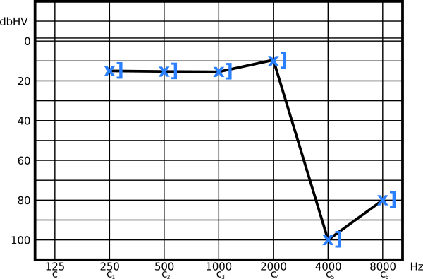
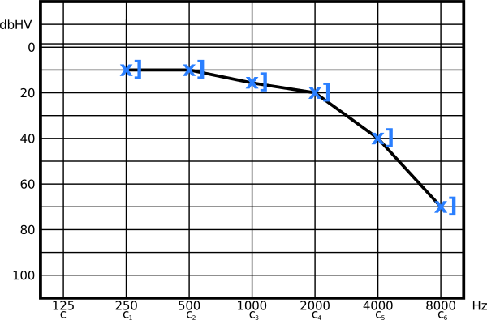

---
list-of-figures:
  label: Abbildung
  title: Abbildungsverzeichnis
list-of-tables:
  label: Tabelle
  title: Tabellenverzeichnis
cite:
  title: Quellenverzeichnis
footnotes:
  title: Fußnoten
abbreviations:
  title: Abkürzungsverzeichnis
---

<!-- prettier-ignore -->
*[ALS]: Amyotrophic lateral sclerosis
*[CP]: Cerebral palsy
*[CVA]: Cerebral vascular accident
*[d. h.]: das heißt
*[d. s.]: das sind
*[engl.]: englisch
*[grie.]: griechisch
*[IHC]: Inner hair cells
*[MCD]: Minimal cerebral dysfunction
*[MCP]: Minimal cerebral palsy
*[MS]: Multiple Sklerose
*[lat.]: lateinisch
*[OHC]: Outer hair cells
*[PC]: Pacini corpuscles
*[PKW]: Personenkraftwagen
*[RA]: rapidly adapting
*[RP]: Retinopathia pigmentosa
*[SA]: slowly adapting
*[SHT]: Schädelhirntrauma
*[SPL]: Sound Pressure Level
*[TBI]: Traumatic brain injury
*[u. a.]: unter anderem
*[z. B.]: zum Beispiel
*[ZNS]: Zentralnervensystem

# Auditive Behinderungen

## Klassifikation von Hörschädigungen

Die ICIDH unterscheidet sechs Grade der Hörschädigung (<<tab:kategorien-hoerschaedigung-nach-icidh>>):

<!-- FIXME: hochgradige Hörschädigung (90 vs. 91dB) -->

| Bezeichnung nach ICIDH                   | Hörverlust \[in dB HV\]    |
| ---------------------------------------- | -------------------------- |
| geringe Hörschädigung                    | $26-40\;\sf{dB}\,\sf{HV}$  |
| mäßige Hörschädigung                     | $41-55\;\sf{dB}\,\sf{HV}$  |
| mittelgradige Hörschädigung              | $56-70\;\sf{dB}\,\sf{HV}$  |
| hochgradige Hörschädigung                | $71-91\;\sf{dB}\,\sf{HV}$  |
| an Taubheit[^14] grenzende Hörschädigung | $\gt~91\;\sf{dB}\,\sf{HV}$ |
| vollständiger Verlust des Gehörs         | $-$                        |

.kategorien-hoerschaedigung-nach-icidh#Kategorien der Hörschädigung nach ICIDH [@matthesius:1995].

[^14]:
    Die ICIDH verwendet den Begriff „Taubheit“, der aber bei den Betroffenen verpönt ist.
    Er sollte daher tunlichst vermieden und immer gegen Gehörlosigkeit ausgetauscht werden.
    Die Ursache für die negative Besetzung der Wörter „Taubheit“ und „taub“ ist historisch bedingt.
    Die Begriffe „dumm“ bzw. „tumb“ (ahd.) und „taub“ bzw. „toub“ hatten früher die gleiche Bedeutung, nämlich „stumpf“ bzw. auch „stumpfsinnig“ (Duden) und „benebelt“, „verwirrt“ und „betäubt“ [@bronzino:1995].
    Das Ohr galt in der Antike als Sitz des Gedächtnisses.
    Für Paracelsus waren große Ohren nicht nur Zeichen für ein gutes Hörvermögen, sondern auch für ein gutes Gedächtnis und einen scharfen Verstand [@hellbrück:1993].

Der Begriff gehörlos sollte nur für Personen benutzt werden, deren Hörschädigung so hochgradig ist, dass sie unfähig sind, aus einer Verstärkung einen Nutzen zu ziehen.
Der Nutzen, mittels einer Angabe in dB HV eine stichhaltige Trennungslinie zwischen schwerhörig und gehörlos zu ziehen, erscheint gering.
Wesentlich wichtiger ist es die Funktionalität des Gehörs in Bezug auf die sozial bedeutendste Aufgabe, das Hören und Verstehen gesprochener Sprache, zu bewerten.
In diesem Sinn wird von Praktikerinnen und Praktikern vorgeschlagen, die Trennung dort zu ziehen, wo das auditive Kommunizieren trotz verstärkender Hilfsmittel scheitert [@dotter:1996].

Bei der Klassifizierung von Hörschädigungen wird in erster Linie unterschieden, ob die Reduktion der Hörleistung durch eine verringerte Leitung des Schalls bis zu den Rezeptoren (Haarzellen) des Innenohrs bedingt ist oder ob eine Schädigung der Cochlea oder der nachfolgenden Nervenbahnen (Hörbahn) vorliegt.
Nach dieser generellen Unterscheidung werden noch einige typische Formen der Schwerhörigkeit besprochen

1. Schallleitungsschwerhörigkeit (generell)  
   Bei der Schallleitungsschwerhörigkeit (Konduktionsschwerhörigkeit, engl. _conductive hearing loss_) liegen die Ursachen in einer Störung im äußeren Gehörgang (z. B. Pfropfen), im Trommelfell oder im Mittelohr (z. B. Versteifung der Gehörknöchelchen).
   Das Hörvermögen ist vermindert, nie jedoch völlig verloren.

   <!-- FIXME: Querverweis -->

   Im Tonschwellenaudiogramm (siehe [Bestimmung des Hörvermögens – Audiometrie](#bestimmung-des-horvermogens-audiometrie)) äußert sich eine Schallleitungsschwerhörigkeit in einem Absinken der Luftleitungskurve (LL-Kurve), während die Knochenleitungskurve (KL-Kurve) unverändert in jenem Bereich bleibt, der für normal hörende Personen die Regel ist (<<fig:tonschwellenaudiogramm-schallleitung>>, für die verwendeten Zeichen siehe <<tab:audiogramm-verwendete-symbole>>).
   Man spricht hier vom Auftreten einer „KL-LL-Differenz“ oder „air-bone-gap“).

   <!-- prettier-ignore -->
   ![Tonschwellenaudiogramm bei Schalleitungsschwerhörigkeit – die Luftleitungskurve (x) liegt unter der Knochenleitungskurve (\]) = „air-bone-gap“.](./pics/06/tonschwellenaudiogramm-schallleitung.svg "tonschwellenaudiogramm-schallleitung#Tonschwellenaudiogramm bei Schallleitungsschwerhörigkeit – die Luftleitungskurve (x) liegt unter der Knochenleitungskurve (]) = „air-bone-gap“ [@hellbrück:1993].")

   Ein Verschließen der Ohren mit den Fingern führt zu einer Dämpfung von ca. $20\;\sf{dB}\,\sf{HV}$, simuliert also eine Schallleitungsschwerhörigkeit, die noch geringer ist, als eine „geringe Hörschädigung“ nach ICIDH (siehe <<tab:kategorien-hoerschaedigung-nach-icidh>>).

2. Schallempfindungsschwerhörigkeit (generell)  
   Die Ursachen für eine Schallempfindungsschwerhörigkeit (Perzeptionsschwerhörigkeit, engl. _sensorineural hearing loss_) sind Schädigungen des Innenohres (Hörsturz, Ototoxikose, Schalltrauma), des Hörnervs oder des zentralen Nervensystems.
   Im Tonschwellenaudiogramm äußert sich eine Schallempfindungsschwerhörigkeit durch das gemeinsame Absinken der Luftleitungskurve und der Knochenleitungskurve (<<fig:tonschwellenaudiogramm-schallempfindung>>).

   <!-- prettier-ignore -->
   ![Tonschwellenaudiogramm bei Schallempfindungsschwerhörigkeit – Luftleitungskurve (x) und Knochenleitungskurve (\]) in Deckung](./pics/06/tonschwellenaudiogramm-schallempfindung.svg "tonschwellenaudiogramm-schallempfindung#Tonschwellenaudiogramm bei Schallempfindungsschwerhörigkeit – Luftleitungskurve (x) und Knochenleitungskurve (]) in Deckung [@hellbrück:1993].")

   Von Schallempfindungsschwerhörigkeit sind vornehmlich die hohen Frequenzen betroffen, was sich in einer schlechten Wahrnehmbarkeit der Phoneme „s“, „f“ und „sch“ bemerkbar macht.
   Somit ist nicht nur das Hören selbst, sondern vor allem das Verstehen betroffen.
   Eine (völlige) Gehörlosigkeit ist immer durch eine Störung des Innenohrs bedingt.

3. Kombinierte Schallleitungs- und Schallempfindungsschwerhörigkeit (generell)  
   Als dritte mögliche generelle Hörschädigung soll noch die kombinierte Schallleitungs- und Schallempfindungsschwerhörigkeit im Tonschwellenaudiogramm vorgestellt werden.
   Wegen der Schallempfindungsschwerhörigkeit sinken die LL- und die KL-Kurven gemeinsam ab.
   Die zusätzliche Schallleitungsschwerhörigkeit bedingt ein weiteres Absinken der LL-Kurve (<<fig:tonschwellenaudiogramm-schallempfindung>>).

   <!-- prettier-ignore -->
   ![Tonschwellenaudiogramm bei kombinierter Schallleitungs- und Schallempfindungsschwerhörigkeit – beide Kurven tiefer, aber die Luftleitungskurve (x) liegt noch weiter unter der Knochenleitungskurve (\])](./pics/06/tonschwellenaudiogramm-schallleitung-schallempfindung.svg "tonschwellenaudiogramm-schallempfindung#Tonschwellenaudiogramm bei kombinierter Schallleitungs- und Schallempfindungsschwerhörigkeit – beide Kurven tiefer, aber die Luftleitungskurve (x) liegt noch weiter unter der Knochenleitungskurve (]) [@hellbrück:1993].")

4. Lärmschwerhörigkeit  
   Jede Belastung des Gehörs mit hohen Schalldruckpegeln führt zu einer Verschiebung der Hörschwelle nach oben.
   Ist die Belastung kurz oder werden dabei Schalldruckpegel von $90\;\sf{dB}\,\sf{SPL}$ nicht überschritten, kommt es zwar zu einer bei allen Sinnesorganen vorkommenden Adaptation, aber die Hörschwelle sinkt nach einer Erholungszeit wieder auf die Werte vor der Schallbelastung.

   Lang andauernde Schallbelastungen, insbesondere dann, wenn sie $90\;\sf{dB}\,\sf{SPL}$ überschreiten, stellen eine ernsthafte Gefährdung des Ohres dar.
   Dabei können drei Mechanismen zum Tragen kommen.
   Zum einen können durch die Schallbelastung (z. B. $15$ Minuten bei $95\;\sf{dB}\,\sf{SPL}$ oder $30$ Sekunden bei $115\;\sf{dB}\,\sf{SPL}$) Haarzellen mechanisch beschädigt werden (Abknicken oder Verschmelzen der Stereozilien).
   Zweitens haben Haarzellen bei Erregung einen erhöhten Energiebedarf, der bei lang anhaltender Stimulation nicht mehr gedeckt werden kann.
   Wird der Zelle nicht rechtzeitig eine Erholungspause gegönnt, kann es zum Absterben (Verhungern) der Sinneszelle kommen.
   Drittens führt Lärm zu einer Stressbelastung des gesamten Organismus, durch die auch die Durchblutung und somit die Sauerstoffversorgung des Ohres herabgesetzt wird und eine schädigende Wirkung auf das Innenohr nicht ausgeschlossen werden kann [@hellbrück:1993].

   Ein durch Lärmeinwirkung ausgelöster Hörverlust betrifft besonders die Frequenzen um $4\;\sf{kHz}$.
   Offenbar gerät dieser Bereich der Cochlea bei Lärmbelastung am frühesten in einen Versorgungsengpass.
   Wegen der bei $4\;\sf{kHz}$ liegenden musikalischen Note $\sf{c^5}$ (fünf-gestrichenes C, oberste Taste eines Klaviers mit $4186\;\sf{Hz}$) wird auch von der $\sf{c^5}$-Senke gesprochen[^15] [@hellbrück:1993].
   Ein für eine Lärmschwerhörigkeit typisches Audiogramm ist in <<fig:tonschwellenaudiogramm-laermschwerhoerigkeit>> dargestellt.

   [^15]:
       Akustikerinnen, Akustiker, Musiker und Musikerinnen verwenden unterschiedliche Bezeichnungen der Tonhöhen.
       In der Akustik werden die zu den einzelnen Oktaven des Klaviers gehörenden Töne mit tiefgestellten Indizes versehen. $\sf{C_1}$ bezeichnet daher das tiefste C (erste vollständige Oktave) am Klavier.
       Der höchste Ton des Klaviers ist das $\sf{C_8}$.
       In der Musik beginnt die eingestrichene Oktave mit dem mittleren C des Klaviers. Hier werden hochgestellte Indizes verwendet.
       Die Bezeichnung ist daher $\sf{c^1}$.
       Der in der gleichen Oktave liegende Kammerton mit $440\;\sf{Hz}$ trägt die Bezeichnung $\sf{a^1}$.
       Dem musikalischen $\sf{c^1}$ entspricht somit das akustische $\sf{C^4}$ [@lindsay:1981].

   

   <!--
    Beschriftung: Zagler
    Bild: nicht CC
    FIXME: Quelle [HEL 93]?
   -->

   Besonders gefährlich sind alle impulshaltigen Schalle, weil in diesem Fall der Regelmechanismus des Mittelohres (Bedämpfung durch Kontraktion der Mittelohrmuskeln) nicht rechtzeitig zum Tragen kommt und die hohen Pegel ungehindert das Innenohr erreichen können.

   Während die schädlichen Langzeit-Auswirkungen von berufsbedingtem Lärm heute nicht nur hinlänglich bekannt sind (oder zumindest bekannt sein sollten) und wirksame Gehörschutzmaßnahmen angeboten werden, stellt der „Freizeitlärm“ die weitaus größere Gefahr für die Volksgesundheit dar.
   Die Auswirkungen von überlauter Musik (Diskotheken, open-air Konzerte[^16], „Car-Sound“) und insbesondere die über Kopf- und Ohrhörer konsumierte Musik aus tragbaren Geräten stellen ein enormes Risiko dar.
   Allen Liebhabern solcher „Schallquellen“ muss an dieser Stelle warnend ins Stammbuch geschrieben werden, dass Beschädigungen der Haarzellen absolut irreversibel sind.

   [^16]:
       Der von einer „durchschnittlichen“ Rockband produzierte Schalldruckpegel wird in der Literatur mit $120$ bis $130\;\sf{dB}\,\sf{SPL}$ angegeben.
       Für die Gruppe „The Who“ finden sich Werte bis $160\;\sf{dB}\,\sf{SPL}$ (!). Die Folgen für die Haarzellen sind leicht vorstellbar.
       Nur der Start eines Space-Shuttles (in $50\;\sf{m}$ Entfernung gemessen) übertrifft mit $180\;\sf{dB}\,\sf{SPL}$ diesen Wert noch deutlich [@lindsay:1981, @kendrik:1997].

5. Altersschwerhörigkeit – Presbyakusis  
   Unter Altersschwerhörigkeit (Presbyakusis) wird eine mit zunehmendem Alter steigende Hörschwelle bei höheren Frequenzen verstanden (den typischen Verlauf des Audiogramms zeigt <<fig:tonschwellenaudiogramm-altersschwerhoerigkeit>>).

   

   <!--
    Beschriftung: Zagler
    Bild: nicht CC
    FIXME: Quelle [HEL 93]?
   -->

   Von einer „echten“ Presbyakusis kann streng genommen nur dann gesprochen werden, wenn der Hörverlust symmetrisch auf beiden Ohren auftritt und wenn außerdem sichergestellt ist, dass nicht auch andere Faktoren zu einem Hochtonverlust geführt haben.
   In den meisten Fällen wird man es mit einer Mischung aus Alterseffekten und Langzeitfolgen von Lärmbelastung und Medikamentenschädigungen (ototoxische Wirkung von Medikamenten) zu tun haben, die sich nicht voneinander trennen lassen[^17].

   [^17]:
       In diesem Zusammenhang ist bemerkenswert, dass Untersuchungen an Naturvölkern (Afrika und Asien) keine Anzeichen von Presbyakusis gezeigt haben.
       Es liegt daher der Verdacht nahe, dass Presbyakusis nichts anderes ist, als die über die Lebenszeit integrierte Auswirkung sozial bedingter Schädigungen des Gehörs (Sozioakusis) [@hellbrück:1993].

   {.lower-alpha}

## Tinnitus – Ohrgeräusche

<!-- FIXME: "sensorineuralem" -->
<!-- FIXME: "Schallempfindungsschwerhörigkeit" - Schallleitungsschwerhörigkeit? -->

Mit Tinnitus werden Töne und Geräusche bezeichnet, die von der betroffenen Person wahrgenommen, aber durch keine äußere Schallquelle verursacht werden.
Etwa $32\%$ der erwachsenen Bevölkerung ist durch Tinnitus betroffen, $20\%$ geben an, dass sie davon so schwer betroffen sind, dass sich die Ohrgeräusche störend bemerkbar machen.
Tinnitus ist in den meisten Fällen eine Begleiterscheinung von Schwerhörigkeit.
Die meisten Patientinnen und Patienten mit sensorineuralem Hörverlust klagen über Ohrgeräusche im hohen Frequenzbereich, während Schallempfindungsschwerhörigkeit in der Regel zu Tinnitus im unteren Frequenzbereich führt.
Otosklerose kann ebenso wie die Meniere-Krankheit zu Tinnitus im tiefen Frequenzbereich führen [@troost:1998].

Pulssynchrone Ohrgeräusche haben ihre Ursache in Durchblutungsstörungen oder werden durch Hypertonie (erhöhten Blutdruck hervorgerufen).
Unter Tinnitus versteht man allgemein die nicht-pulsierenden Ohrgeräusche, die sich bei Erkrankungen des Mittelohrs als Sausen, Brummen oder Rauschen, bei Schädigungen des Innenohres als Zischen oder Pfeifen manifestiert [@pschyrembel:1989].

Auslösende Ursache für Tinnitus können Spasmen (Verkrampfungen) der Mittelohrmuskeln, Degenerationen der Halswirbelsäule oder Funktionsstörungen der Cochlea sein.
Im letztgenannten Fall können die aktiven Bewegungen der äußeren Haarzellen betroffen sein, sodass es möglich ist, die dadurch entstehenden Töne objektiv im Gehörgang zu messen.
In den meisten Fällen handelt es sich jedoch um subjektiven Tinnitus, dessen Ursache in einer Störung der Verstärkungswirkung der äußeren Haarzellen vermutet wird.
Dadurch kommt es zu vermehrter Stimulation der äußeren Haarzellen, die wiederum auf die inneren Haarzellen wirkt und so eine als Ton oder Geräusch wahrnehmbare Erregung hervorruft [@hellbrück:1993].
Andere Quellen vermuten als Ursache eine Erhöhung der spontanen Entladung der Nervenfasern des Hörnervs, da die inhibierende Wirkung eines durch die Cochlea geleiteten Gleichstromes zu einer Verringerung der Ohrgeräusche führt [@troost:1998].

!!!include(general/attribution.md)!!!
