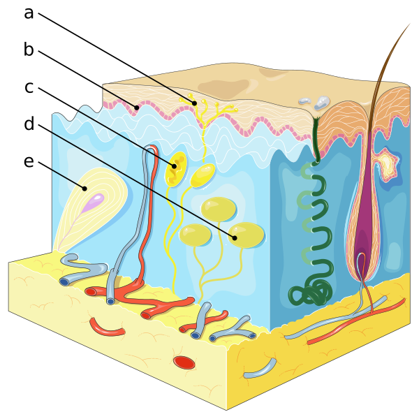

---
list-of-figures:
  label: Abbildung
  title: Abbildungsverzeichnis
list-of-tables:
  label: Tabelle
  title: Tabellenverzeichnis
cite:
  title: Quellenverzeichnis
footnotes:
  title: Fußnoten
abbreviations:
  title: Abkürzungsverzeichnis
---

<!-- prettier-ignore -->
*[d. h.]: das heißt
*[PC]: Pacini corpuscles
*[RA]: rapidly adapting
*[SA]: slowly adapting
*[z. B.]: zum Beispiel

# Haut und taktile Wahrnehmung

## Wesen und Leistung des Tastsinns

Wenn von menschlichen Sinnen die Rede ist, denkt man in erster Linie an das Auge und das Ohr, auch Schmecken und Riechen erscheinen uns bedeutsam.
Der Tastsinn hingegen rangiert in unserer Vorstellung von den Sinnen meist an letzter Stelle.
Bei der außerordentlichen Bedeutung, die wir dem Auge und dem Ohr für die Wahrnehmung einräumen, dürfen wir nicht vergessen, dass jedes Sinnesorgan neben seinen Stärken auch deutliche Schwächen aufweist.

Das Auge ist hervorragend dafür geeignet, räumliche Vorstellungen zu vermitteln, während es hinsichtlich der Wahrnehmung zeitlich rasch veränderlicher Vorgänge nur bescheidene Leistungen zu erbringen vermag (Die Flimmerverschmelzungsfrequenz liegt – je nach Leuchtdichte – bei maximal $80\;\sf{Hz}$ [@guski:1996]).

Das Ohr erbringt im Zeitbereich wesentlich höhere Leistungen.
Die höchste wahrnehmbare Frequenz liegt bei rund $16\;\sf{kHz}$ und übertrifft damit das Auge um den Faktor $200$.
In der räumlichen Dimension kann mit dem Ohr die Bewegung einer Schallquelle um $1\degree$ (günstigster Fall) wahrgenommen werden [@harling:1996].
Die absolute Ortung einer Schallquelle, insbesondere, wenn sie sich nicht in einem eingeschränkten Bereich vor dem Beobachter / der Beobachterin befindet, erfolgt noch wesentlich ungenauer.
Das Auge hingegen weist im zentralen Bereich (Fovea) ein Auflösungsvermögen von $0.5$ bis $1$ Bogenminute auf.
Hier beträgt der Faktor also rund $60$ bis $120$.

Der Tastsinn nimmt eine mittlere Position ein.
Er ist dem Auge in zeitlicher und dem Ohr in räumlicher Hinsicht überlegen.
Als größtes Sinnesorgan, das über die gesamte Körperoberfläche verteilt ist, nimmt er eine mittlere und eine vermittelnde Position ein [@geldard:1986].
Gemeinsam mit Geruchssinn und dem Geschmackssinn gehört der Tastsinn zu den Nah-Sinnen, da eine Wahrnehmung nur im direkten Kontakt erfolgt.
Die Bedeutung des Tastsinns für die gesamte multimodale menschliche Wahrnehmung lässt sich vielleicht auch daran ermessen, dass wir das Wort „begreifen“ verwenden, wenn wir „verstehen“ meinen.

## Sinnesempfindungen der Haut

In der menschlichen Haut befinden sich Sinneszellen (Rezeptoren) unterschiedlichster Bauart.
Die von diesen Sinneszellen vermittelten Empfindungen können in drei Bereiche eingeteilt werden [@betz:1991]:

- Mechanische Empfindung – Berührung, Druck, Kitzel, Vibration.
- Thermische Empfindung – Wärme und Kälte.
- Schadensempfindung, sog. nozizeptive Empfindung – Schmerz, Jucken.

Eine strenge Zuordnung unterschiedlicher Reizwahrnehmungen zu bestimmten Typen von Rezeptoren ist dabei nicht möglich.
Für einige Rezeptortypen gibt es nur _einen_ adäquaten Reiz, während andere auf mehrere verschiedene Reize ansprechen.
Taktile Wahrnehmung, insbesondere das Erkennen einer Oberflächentextur, stellt eine multimodale Aufgabe dar, bei der die Informationen verschiedenster Rezeptoren verwertet werden.
Neben den eigentlichen taktilen Reizen werden auch thermische Reize (Temperatur, Wärmeleitfähigkeit und Wärmekapazität) und, wenn vorhanden, auch visuelle und mit der Berührung verbundene akustische Reize zu einem Gesamtbild vereinigt [@lederman:1982].

Für die Rehabilitationstechnik ist allein die mechanische Empfindung von Bedeutung.
Thermische Empfindungen weisen große Trägheit auf, sodass sie zur gezielten Informationsvermittlung nicht herangezogen werden können.
Schadensempfindungen wird man verständlicherweise tunlichst vermeiden wollen.
Direkte elektrische Reizung ist möglich, bedarf aber sorgfältiger Regelung des Reizes, um eine konstante, angenehme Empfindung auszulösen.

## Druckempfindlichkeit

<!-- FIXME: Footnote at Reference -->

Der Tastsinn nimmt seinen Ursprung in den Rezeptorzellen (Mechanorezeptoren) der Haut, die auf mechanische Reize, also auf Verformung der Hautoberfläche reagieren.
Es werden außer freien Nervenendungen vier verschiedene Rezeptoren unterschieden, von denen zwei auf statische Reize (absolute Verformung der Hautoberfläche) und zwei auf dynamische Reize (Veränderung der Verformung) reagieren.
In diesem Sinn wird von langsam adaptierenden (_slowly adapting_ = SA) und schnell adaptierenden (_rapidly adapting_ = RA) Zellen gesprochen [@lederman:1982, @betz:1991, @dudel:1996[^18]].

[^18]: Die Art der jeweils adäquaten Reize wird in der Literatur nicht einheitlich angegeben. Die medizinische Literatur [@betz:1991, @dudel:1996] spricht neben der Reaktion auf Druckänderungen ($\sf{dp/dt}$ – also eine Geschwindigkeit) bei Vater-Pacini-Körperchen auch von der Reaktion auf eine Änderung der Geschwindigkeit ($\sf{dp/dt^2}$ – also eine Beschleunigung), ohne den Vorgang jedoch näher zu erklären.

_Freie Nervenendungen_ liegen in geschichteten Epithelien der Haut und reichen bis in die verhornten Schichten.
Sie reagieren auf Druck aber auch auf thermische Reize.
Bei Verletzung lösen sie Schmerz aus (Nozizeption).
Auch die Haarbälge können von freien Nervenänderungen umgeben sein.

_Merkel-Zellen_ (Bezeichnung SA I für „_slowly adapting type 1_“) kommen in der unbehaarten Haut vor und bestehen aus einer freien Nervenendung, die am Ende scheibenförmig verdickt ist.
Sie liegen nahe an der Hautoberfläche und reagieren mit guter Auflösung auf die Stärke einer (in erster Linie) vertikalen Verformung der Haut.

_Ruffini-Körperchen_ (Bezeichnung SA II für „_slowly adapting type 2_“) sind ebenfalls am Ende scheibchenförmig verdickte Nervenendungen.
Sie reagieren auf Druck (nach manchen Quellen auch auf Änderungen des Druckes) und sind dabei besonders empfindlich auf tangentiale Verformungen der Haut [@lederman:1982].

_Meißner-Körperchen_ (Bezeichnung RA für „_rapid adapting_“[^19] ) bestehen aus ovalen, etwa $0.1\;\sf{mm}$ langen, scheibenförmigen Zellen, die in einer Bindegewebshülle in den Papillen der Lederhaut eingelagert sind.
Mit den zwischen den Scheiben eingelagerten Nervenendungen bilden sie einen nur auf Druckänderungen ansprechenden Rezeptor.
Da Ihre Dichte besonders an den Fingerspitzen hoch ist (bis zu $200\sf{/cm^2}$) und sie auch nahe an der Hautoberfläche liegen, werden sie vor allem mit dem Tastsinn in Verbindung gebracht und daher auch als „Meißner-Tastkörperchen“ bezeichnet.

[^19]: In der Literatur auch manchmal als QA für „quickly adapting“ bezeichnet.

Die tiefer im Unterhautbindegewebe befindlichen _Vater-Pacini-Körperchen_ (PC = _Pacini corpuscles_; auch Pacini-Korpuskel oder Lamellen-Körperchen genannt) reagieren auf Druckänderungen.
Sie können bis zu $4\;\sf{mm}$ lang und $1\;\sf{mm}$ dick werden und weisen eine geschichtete Struktur ähnlich einer Zwiebel auf (<<fig:schnitt-durch-vater-pacini-koerperchen>>).
Manche Literaturangaben schreiben ihnen Reaktion auf Beschleunigungen zu.

Die Lage der Mechanorezeptoren in der menschlichen Fingerkuppe ist in <<fig:mechanorezeptoren>> dargestellt.

::: figcaption

1. freie Nervenendigungen
2. Merkel-Zelle
3. Ruffini-Körperchen
4. Meissner-Körperchen
5. Vater-Pacini-Körperchen
   {.lower-alpha}

:::

Wie alle Rezeptoren weisen auch Mechanorezeptoren bei Dauerreizung Adaptation auf (d. h. sie reagieren nur auf eine Änderung des Reizes).
Die _Meißner-Körperchen_ (RA) reagieren auf eine Druckänderung, sie sind also _Geschwindigkeitssensoren_ und sind bei Reizfrequenzen zwischen $5\;\sf{Hz}$ bis $40\;\sf{Hz}$ dominant.
Die _Vater-Pacini-Körperchen_ (PC) hingegen reagieren nur auf Vibrationen im Bereich von $40\;\sf{Hz}$ bis $400\;\sf{Hz}$ [@lederman:1982, @foulke:1986, @betz:1991, @fricke:1994, @dudel:1996].
Einen zusammenfassenden Überblick gibt (<<tab:typen-mechanorezeptoren>>).

<!-- FIXME: Fragezeichen in Tabelle -->

| Typ                              | adäquater Reiz                                                                                   | Besonderheit                                                                                         |
| -------------------------------- | ------------------------------------------------------------------------------------------------ | ---------------------------------------------------------------------------------------------------- |
| SA I (Merkel-Zellen)         | Druck, statische vertikale Verformung                                                            | Nahe der Hautoberfläche, kleine rezeptive Felder, hohe Ortsauflösung                                 |
| SA II (Ruffini-Körperchen)   | Druck (und Geschwindigkeit ?), statische (und dynamische ?) vertikale und tangentiale Verformung | In tieferen Hautschichten, Reaktion auf Reibung, große rezeptive Felder                              |
| RA (Meissner-Körperchen)     | Geschwindigkeit, Vibrationen von $5\;\sf{Hz}$ bis $40\;\sf{Hz}$                                  | Nahe der Hautoberfläche, hohe Dichte, kleine rezeptive Felder, gute Auflösung                        |
| PC (Vater-Pacini-Körperchen) | Geschwindigkeit (Beschleunigung ?), Vibrationen von $40\;\sf{Hz}$ bis $400\;\sf{Hz}$             | In tieferen Hautschichten, sehr große rezeptive Felder, Auslenkungen von einigen μm sind ausreichend |

.typen-mechanorezeptoren#Typen von Mechanorezeptoren der Haut und adäquate Reize.

Diese Zusammenhänge sind dann wichtig, wenn der Tastsinn für (alternative) Informationsvermittlung verwendet werden soll.
Will man beispielsweise Vibrationen mit geringster Amplitude vermitteln, dann muss die Frequenz des Reizes über $40\;\sf{Hz}$ liegen.
Soll eine besonders gute räumliche Auflösung erreicht werden, dann sollten vornehmlich vertikal wirkende und langsame Reize zum Einsatz kommen.

Diese allgemeinen Aussagen sind jedoch mit Vorsicht zu verwenden.
So haben Versuche, bei denen matrixförmige Anordnungen von vibrierenden Stiften verwendet wurden, ergeben, dass sie die Bewegungsrichtung eines aus diesen Stiften dargestellten linienförmigen Objekten leichter erkennen lässt, wenn die Stifte mit $320\;\sf{Hz}$ vibrieren als wenn man den Versuch bei $40\;\sf{Hz}$ ausführt [@summers:1999:b].
Die Qualität der taktilen Wahrnehmung hängt offenbar von wesentlich mehr Parametern ab, als sich durch die Eigenschaften der Rezeptorzellen voraussagen ließe.
Bei der Entwicklung von taktilen Anzeigeelementen sollten daher bestehende Schulweisheiten getrost hinterfragt werden.

Sicher ist hingegen, dass der durch die schnell adaptierenden Rezeptoren (RA und PC) vermittelte Eindruck einen wesentlichen Beitrag zur taktilen Gesamtwahrnehmung leistet.
Dies lässt sich leicht überprüfen, wenn man versucht, verschiedene Arten von Textilien allein durch vertikales, stationäres Berühren mit einem Finger zu unterscheiden.
Erst bei einer gleitenden Bewegung des Fingers über die Oberfläche werden uns Texturunterschiede bewusst.
Das ist darauf zurückzuführen, dass die tangentiale Bewegung eine Fülle dynamischer Reize (Vibrationen unterschiedlichster Frequenzen) hervorruft, durch die die schnell adaptierenden Rezeptoren angesprochen werden [@lederman:1982].
Als optimale Geschwindigkeit für die Diskriminierung von Oberflächentexturen wird in der Literatur $15\;\sf{cm/s}$ angegeben, was verblüffend gut mit jener Geschwindigkeit übereinstimmt, mit der geübte Blindenschrift-Leser/Leserinnen eine Textzeile überstreichen.

Die Leistung des Tastsinns ist von der Hauttemperatur abhängig.
Die kalte Haut ist weniger elastisch und kann dynamischen mechanischen Verformungen daher nicht so schnell folgen.
Auch sinkt die Leistungsfähigkeit der Rezeptoren mit der Temperatur, sodass Oberflächen bei Kälte glatter wirken als bei normaler Temperatur (z. B. $32\degree\sf{C}$ für die typische Hauttemperatur der Hand).

Neben den hier beschriebenen Mechanorezeptoren in der Haut verfügt der Körper noch über zahlreiche andere druckempfindliche Sensoren, die z. B. den Blutdruck regulieren oder für die Steuerung von Abläufen im Verdauungstrakt verantwortlich sind.
Ihre Signale dringen nicht oder nur bei besonders starker Reizung der Rezeptoren in das Bewusstsein.

## Räumliche Diskriminierung

Die räumliche Diskriminierung von zwei nebeneinander liegenden taktilen Reizen, sodass sie als voneinander getrennt wahrgenommen werden können, ist relativ gering und auch stark von der jeweiligen Hautpartie abhängig.
Für die Zweipunktunterscheidung (Zweipunktdiskriminierung) an verschiedenen Körperstellen finden sich in der Literatur folgende Werte (<<tab:zweipunktdiskriminierung-tastreizen>>):

| Körperregion | Mindestabstand \[mm\] für Zweipunktdiskriminierung |
| ------------ | -------------------------------------------------- |
| Oberschenkel | $68$                                               |
| Rücken       | $54$                                               |
| Stirn        | $22$                                               |
| Fingerrücken | $16$                                               |
| Daumen       | $9$                                                |
| Nasenspitze  | $7$                                                |
| Lippenrot    | $4$                                                |
| Fingerbeere  | $2$                                                |
| Zungenspitze | $1$                                                |

.zweipunktdiskriminierung-tastreizen#Zweipunktdiskriminierung von Tastreizen in verschiedenen Körperregionen [@betz:1991].

<!-- FIXME: Querverweis -->

Die feinste Diskriminierung ermöglicht also die Zunge, gefolgt von den Fingerbeeren.
Gerade die großen Hautpartien, die sich hinsichtlich ihrer Fläche für die taktile Wahrnehmung von Bildern anbieten würden, schneiden bei der räumlichen Reizdiskriminierung äußerst schlecht ab.
Zusätzlich muss unterschieden werden, ob beide taktilen Stimuli gleichzeitig (simultan) oder nacheinander (sukzessiv) präsentiert werden.
Da auch die Haut sogenannte rezeptive Felder kennt (Näheres dazu siehe [Die rezeptiven Felder](#die-rezeptiven-felder)), die von Feldern mit lateraler Inhibition umgeben sind, ist die Diskriminierung bei simultanen Zweipunktreizen (der zweite Reiz fällt in das inhibierende Gebiet) geringer als bei der sukzessiven Präsentation.

Für die statische taktile Wahrnehmbarkeit an der Fingerspitze muss eine taktile Information demnach eine räumliche Auflösung von mehr als $2.5\;\sf{mm}$ für voneinander zu unterscheidende Reize aufweisen.
Für die Darstellung einer aus Punkten gebildeten Linie, die als einigermaßen kontinuierlich empfundenen werden soll, dürfen die einzelnen Punkte einen Abstand von $1\;\sf{mm}$ nicht überschreiten (diese Angabe gilt für den bewegten Finger).

!!!include(general/attribution.md)!!!
