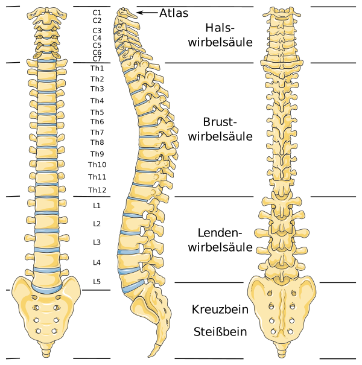
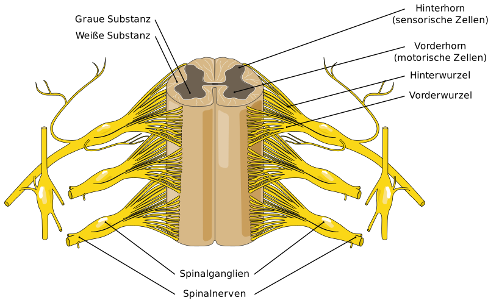
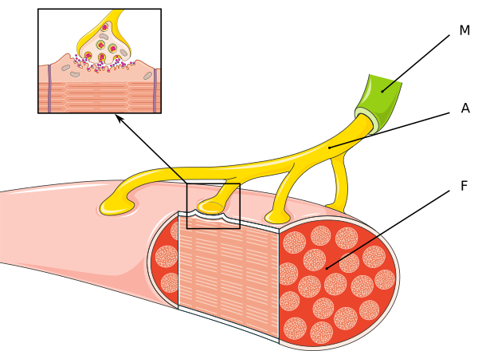

---
list-of-figures:
  label: Abbildung
  title: Abbildungsverzeichnis
list-of-tables:
  label: Tabelle
  title: Tabellenverzeichnis
cite:
  title: Quellenverzeichnis
footnotes:
  title: Fußnoten
abbreviations:
  title: Abkürzungsverzeichnis
---

<!-- prettier-ignore -->
*[d. s.]: das sind
*[grie.]: griechisch
*[u. a.]: unter anderem
*[z. B.]: zum Beispiel
*[ZNS]: Zentralnervensystem

# Rückenmark, Bewegungsapparat und Muskulatur

<!-- FIXME: Querverweis -->

In diesem Kapitel wird gemeinsam mit der Besprechung von Muskulatur und Bewegungsapparat auch das Rückenmark besprochen, weil alle motorischen Befehle, durch die periphere Muskel angeregt werden können, über diese Verbindung vom Zentralnervensystem (ZNS) her angesprochen werden.
Dabei ist es wichtig, zu unterscheiden, welche Muskeln über eine direkte Verbindung vom Gehirn aus versorgt werden (Hirnnerven, siehe [Die Hirnnerven](#die-hirnnerven)) und welche über das Rückenmark laufen und daher bei Verletzungen der Wirbelsäule in Mitleidenschaft gezogen werden können.

## Das Rückenmark

Als Rückenmark (_Medulla spinalis_) wird jener Teil des Zentralnervensystems bezeichnet, der den Wirbelkanal der Wirbelsäule bis hinunter zum $2.$ Lendenwirbel füllt (<<fig:wirbelsaeule>>).
Sein Durchmesser beträgt durchschnittlich $1\;\sf{cm}$, die Länge beim erwachsenen Menschen je nach Körpergröße zwischen $40$ und $50\;\sf{cm}$.

Das Rückenmark besteht außen aus weißer Substanz.
Den Kern bildet eine Säule aus grauer Substanz, die einen schmetterlingsförmigen Querschnitt aufweist.
Die vier Ausbuchtungen werden „Hörner“ ($2$ Vorderhörner und $2$ Hinterhörner) genannt (<<fig:rueckenmark>>).

Vom Rückenmark zweigen $31$ Nervenpaare (_Spinalnerven_) ab.
Der Austritt aus dem Wirbelkanal erfolgt in paarweisen Strängen unterhalb der einzelnen Wirbelkörper durch die Zwischenwirbellöcher.
Jeder dieser Nervenstränge setzt sich wiederum aus zwei Gruppen von Wurzelfäden zusammen, von denen die eine aus dem Vorderhorn und die andere aus dem Hinterhorn des Rückenmarks entspringt (<<fig:wirbelsaeule>>).

Die vorderen (ventralen) Wurzeln sind motorisch (_efferent_, führen also vom ZNS zur Muskulatur).
Ihre Ursprungszellen liegen in der grauen Substanz des Rückenmarks.
Die hinteren (dorsalen) Wurzelfäden sind sensorisch (_afferent_ – führen also von Rezeptoren zum ZNS).
Diese Trennung in motorische und sensorische Zweige gilt jedoch nicht für das vegetative Nervensystem.

Die Gesamtheit der aus dem ZNS absteigenden motorischen Nervenbahnen, die in der Großhirnrinde (vornehmlich aus der vorderen Zentralwindung) entspringen und zu motorischen Kernen der Hirnnerven oder der Vorderhornzellen des Rückenmarks führen, wird Pyramidenbahn (_Fasciculus pyramidalis_) genannt.
Vor dem Eintritt in das Rückenmark wechseln rund $90\%$ der Nervenfasern der Pyramidenbahn in der _Pyramidenkreuzung_ auf die andere (_contralaterale_) Körperseite.
In diesem Zusammenhang soll erwähnt werden, dass die Versorgung der Muskeln der Stirn, die Augenmuskeln und auch die Muskeln der Augenlider von beiden Seiten der Großhirnrinde her erfolgt, sodass bei halbseitigen Ausfällen z. B. der Lidschlag auf beiden Körperseiten gleichermaßen erhalten bleibt.
Unterhalb der Augenpartie erfolgt die Innervation ausschließlich von der Gegenseite her, sodass Läsionen im Gehirn zu einem Ausfall der Muskelfunktionen auf der jeweiligen anderen Körperseite führen.
Ein Defekt, der auf das pyramidale System beschränkt ist, verursacht eine schlaffe Lähmung.

Alle anderen motorischen Bahnen werden unter dem Begriff extrapyramidal-motorische Bahnen zusammengefasst.
Symptome, die bei einer Schädigung des extrapyramidalen Systems auftreten können, sind u. a.: Störung automatischer Bewegungsabläufe und der Regulation des Muskeltonus (Tremor, Spasmus, Rigor etc.).

Die Segmente des Rückenmarks (d. s. Abschnitte, die zu einem Paar Spinalnerven gehören) erhalten ihre Bezeichnung nach dem Wirbel, _unter_ dem sie austreten.
Eine Ausnahme stellt die Benennung in der Halsregion dar: Der $1.$ Halsnerv ist jener, der zwischen Hinterhaupt und Atlas (oberste Wirbelkörper, siehe <<fig:wirbelsaeule>>) austritt.
Die weiteren Halsnerven liegen _über_ den jeweiligen Halswirbeln.
Zwischen $\sf{C}7$ und $\sf{Th}1$ liegt der $8.$ Halsnerv.
Somit ergeben sich $8$ Hals-, $12$ Brust-, $5$ Lenden-, $5$ Kreuzbein- und $1$-$2$ Steißbeinsegmente [@mörike:1981].

## Muskulatur

Muskel sind Bündel aus kontraktilen Proteinfäden.
An der Muskelkontraktion sind die Eiweiß-Stoffe Actin und Myosin beteiligt.
Sie bilden Filamente (Fasern, fadenförmige Strukturen), die sich gegeneinander verschieben können.
Die Erregung der Muskel erfolgt über die sogenannten motorischen Endplatten (Endverzweigungen des Axons, die in Rillen der Muskelfasern liegen) der Motoneuronen (<<fig:motorische-endplatte>>).
Eine Freisetzung von Acetylcholin an der motorischen Endplatte bewirkt eine lokale Depolarisation, durch die es zur Ausschüttung von Ca^++^-Ionen kommt.

::: figcaption

- A: Axon der Nervenfaser
- M: Markscheide
- F: Muskelfaser

:::

Von den drei im menschlichen Organismus vorkommenden Typen von Muskelgeweben interessiert uns hier vor allem die quergestreifte Muskulatur (auch Skelettmuskulatur genannt).
Die in den Eingeweiden auftretende glatte Muskulatur und die Herzmuskulatur werden nicht betrachtet.

Die quergestreifte Muskulatur erlaubt rasche willkürliche Bewegungen, die an keinen Rhythmus gebunden sind.
Die Fasern der quergestreiften Muskulatur bestehen nicht aus Einzelzellen, sondern aus bis zu $12\;\sf{cm}$ langen Fasern, die einige hundert Zellkerne enthalten können.
Der Durchmesser einer einzelnen Muskelfaser beträgt nur $10$ bis $200\;\sf{\mu~m}$.

<!-- FIXME: Fehlermarkierung im Review? -->

Die quergestreifte Muskulatur wird zur Ausführung von willkürlichen Bewegungen von zwei hintereinandergeschalteten Neuronen, den sogenannten Motoneuronen, mit den erforderlichen Impulsen versorgt.
Das erste Motoneuron liegt im motorischen Cortex, der für das Planen einer Bewegung zuständig ist.
Das zweite Motoneuron befindet sich (vorwiegend) in den Vorderhörnern des Rückenmarks (Vorderhornzellen, siehe <<fig:rueckenmark>>), von wo aus die Skelettmuskulatur innerviert wird.
Ein Teil der _Motoneuronen_, von dem u. a. die Sprech-, Kau- und Schluckmuskulatur innerviert wird, entspringt dem Hirnstamm (Bulbus)[^20].
Schädigungen im Hirnstamm können zum Untergang des _ersten Motoneurons_ führen, Schädigungen im Bereich des Rückenmarks zum Untergang des _zweiten Motoneurons_.
Auf beiden Ebenen können Schädigungen zu Lähmungserscheinungen und Muskelschwund führen.
Bei Beteiligung des ersten Motoneurons kommt Spastik hinzu [@deutsche-gesellschaft-muskelkranke:1998].

[^20]: Mit Hirnstamm (_brain stem_, truncus cerebri) oder Stammhirn wird das gesamte Großhirn ohne den Hirnmantel bezeichnet.

Unter dem _Tonus_ wird der Grad der Anspannung eines Muskels verstanden.
Ein bestimmter Muskeltonus (Ruhetonus) ist auch im entspannten Muskel immer vorhanden, da es immer wieder zur spontanen Kontraktion einzelner Muskelfasern kommt.

Die Kontraktion einer einzelnen Muskelfaser folgt dem bereits von den Nervenzellen her bekannten „Alles-oder-Nichts-Prinzip“.
Betrachtet man jedoch eine ganze Gruppe von Muskelfasern in ihrer Gesamtheit, dann gilt dieses „Alles-oder-Nichts-Prinzip“ nur mehr eingeschränkt.
Bei geringer Amplitude der Erregung löst der Reiz eine Kontraktion nur bei naheliegenden Muskelfasern aus, während die Erregung durch höhere Amplituden auch weiter entfernt Muskelfasern innerhalb der von einem Nerven versorgten Gruppe erreicht.
Dieses differenzierte Ansprechen von Muskelfasern wird _Rekrutierung_ bezeichnet.

Durch eine Folge von periodischen Reizungen kommt es je nach der Höhe der Erregungsfrequenz als Folge einer Summe aus Einzelkontraktionen zu einer unvollständigen oder vollständigen Dauerverkürzung des Muskels, die _Tetanus_[^21] genannt wird.
Die Erregungsfrequenz, die zur Erzielung einer vollständigen Dauerverkürzung des Muskels erforderlich ist, wird Verschmelzungsfrequenz genannt und hängt von der Schnelligkeit des jeweiligen Muskels ab.
So beträgt sie bei den besonders schnellen Augenmuskeln bis zu $350\;\sf{Hz}$ [@mörike:1981].

[^21]: Der Begriff Tetanus (grie.: _tetanos_ = Spannung) wird sowohl für die Muskelspannung wie auch für den mit einer Muskelspannung einhergehenden Wundstarrkrampf verwendet.

Die äußerst feine Abstufung der Muskelkontraktionen und somit der entstehenden Kraft und der ausgeführten Bewegung, wie sie z. B. für die Bewegung der Finger oder der Augen erforderlich ist, kommt also durch zwei Mechanismen zustande: Aus dem Umfang der Rekrutierung von Muskelfasern und der Höhe der Erregungsfrequenz.
So wie bei den Nerven können die Aktionspotentiale, die mit der Erregung von Muskeln einhergehen, mittels Elektromyografie[^22] über Hautelektroden gemessen werden.

[^22]:
    My- bzw. Myo- als Wortteil bezeichnet den Zusammenhang mit Muskeln.
    Elektromyografie ist demnach die Aufzeichnung der elektrischen Muskelaktivität.

<!-- FIXME: Fehlermarkierung im Review? -->

Grenzwert der Verkürzung einer (in vitro präparierten) Muskelfaser liegt bei $1:8$, was aber im lebenden Organismus nicht vorkommt.
Hier treten Verkürzungen auf $50\%$ der Länge auf, was auch dem optimalen Arbeitsbereich entspricht [@mörike:1981].
Die Kraft, die ein Muskel aufbringen kann, hängt im Wesentlichen vom seinem Querschnitt ab[^23].
Als Faustregel gilt $80-100\;\sf{N/cm^2}$.

[^23]: Für den bekannten zweiköpfigen Oberarmmuskel (Musculus biceps) werden in der Literatur Werte zwischen $450$ und $1200\;\sf{N}$ angegeben [@mörike:1981].

!!!include(general/attribution.md)!!!
