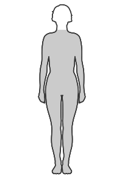
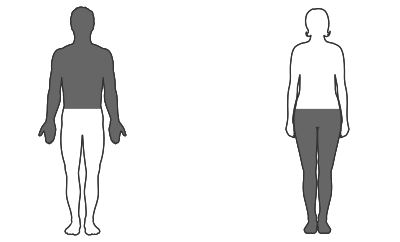

---
list-of-figures:
  label: Abbildung
  title: Abbildungsverzeichnis
list-of-tables:
  label: Tabelle
  title: Tabellenverzeichnis
cite:
  title: Quellenverzeichnis
footnotes:
  title: Fußnoten
abbreviations:
  title: Abkürzungsverzeichnis
---

<!-- prettier-ignore -->
*[ALS]: Amyotrophic lateral sclerosis
*[CP]: Cerebral palsy
*[CVA]: Cerebral vascular accident
*[engl.]: englisch
*[grie.]: griechisch
*[MCD]: Minimal cerebral dysfunction
*[MCP]: Minimal cerebral palsy
*[MS]: Multiple Sklerose
*[PKW]: Personenkraftwagen
*[SHT]: Schädelhirntrauma
*[TBI]: Traumatic brain injury
*[u. a.]: unter anderem
*[z. B.]: zum Beispiel
*[ZNS]: Zentralnervensystem

# Motorische Behinderungen

## Grundlagen und Systematik

1. Einteilung nach dem Ort  
   Motorische Behinderungen können jede Region des menschlichen Körpers betreffen.
   Im Zusammenhang mit der Rehabilitationstechnik interessieren uns in erster Linie jene Störungen, die Auswirkungen auf die Beweglichkeit der Extremitäten haben.
   Bewegungen von Kopf und Rumpf sowie die Bewegungen innerer Organe (z. B. Herz, Atmung) werden hier nicht behandelt.

   Die oberen Extremitäten, Arme und Hände, dienen in erster Linie der mechanischen Interaktion mit unserer Umwelt, also dem Greifen und Bewegen von Gegenständen, dem Betätigen von Schaltern und Hebeln, dem Führen von Schreibgeräten usw..
   Alle diese Tätigkeiten wollen wir unter dem Begriff des Manipulierens zusammenfassen und daher diesen Teil der motorischen Behinderungen als Manipulationsbehinderungen bezeichnen.

   Die unteren Extremitäten, Beine und Füße, dienen in erster Linie der Fortbewegung, also der Mobilität eines Menschen.
   Behinderungen, durch die die Bewegungen der unteren Extremitäten beeinträchtigt sind, fassen wir daher unter dem Begriff Mobilitätsbehinderungen zusammen.

2. Motorische Lähmungen  
   Unter einer Lähmung wird die Minderung oder der Ausfall der Funktion eines Organs oder Körperteils verstanden.
   Im neurologischen Sinn ist damit eine Minderung der motorischen oder sensorischen Funktionen eines Nervs gemeint.

   <!-- FIXME: Fehlermarkierung im Review? -->

   Strenggenommen wird mit Plegie eine allgemeine Lähmung bezeichnet.
   Für unvollständige Lähmungen wird der Begriff Parese verwendet, während eine vollständige Lähmung Paralyse genannt wird[^24].
   Die Bezeichnung von Lähmungen in Hinblick auf Ort und Ausmaß kann der <<tab:klassifizierung-laehmungen>> entnommen werden.

   [^24]: Die Bezeichnungen sind in der Literatur nicht einheitlich gewählt. Einerseits wird der allgemeine Begriff Plegie auch im Zusammenhang mit vollständigen Lähmungen verwendet, andererseits findet man die Bezeichnung Paralyse anstelle von Plegie.

   <!-- FIXME: figure referencing -->
   <table>
     <colgroup>
       <col>
       <colgroup span="3"></colgroup>
     </colgroup>
     <thead>
       <tr>
         <th rowspan="2" scope="rowgroup">Ausmaß der Lähmung</th>
         <th colspan="3">Ort der Lähmung</th>
       </tr>
       <tr>
         <th>Alle vier Gliedmaßen</th>
         <th>Zwei symmetrische Gliedmaßen</th>
         <th>Eine Körperhälfte</th>
       </tr>
       <tr>
         <th scope="row">allgemeiner Begriff</th>
         <th>Tetraplegie (engl. quadriplegia)</th>
         <th>Paraplegie oder Diplegie (engl. paraplegia)</th>
         <th>Hemiplegie (engl. hemiplegia)</th>
       </tr>
     </thead>
     <tbody>
       <tr>
         <th scope="row" rowspan="2">unvollständig</th>
         <td>
         <figure id="tetraparese">
           
           <figcaption>Tetraparese (engl. tetraparesis)</figcaption>
         </figure>
         </td>
         <td>
         <figure id="paraparese">
           
           <figcaption>Paraparese (engl: paraparesis)</figcaption>
         </figure>
         </td>
         <td>
         <figure id="hemiparese">
           
           <figcaption>Hemiparese (engl. hemiparesis)</figcaption>
         </figure>
         </td>
       </tr>
       <tr>
         <td></td>
         <td>
         <ul>
           <li>Paraparese superior: Arme</li>
           <li>Paraparese inferior: Beine</li>
         </ul>
         </td>
         <td></td>
       </tr>
       <tr>
         <th scope="row" rowspan="2">vollständig</th>
         <td>
         <figure id="tetraparalyse">
           
           <figcaption>Tetraparalyse (auch Tetraplegie)</figcaption>
         </figure>
         </td>
         <td>
         <figure id="paraparalyse">
           
           <figcaption>Paraparalyse (auch Paraplegie)</figcaption>
         </figure>
         </td>
         <td>
         <figure id="hemiparalyse">
           
           <figcaption>Hemiparalyse (auch Hemiplegie)</figcaption>
         </figure>
         </td>
       </tr>
       <tr>
         <td></td>
         <td>
         <ul>
           <li>Paraparalyse superior: Arme</li>
           <li>Paraparalyse inferior: Beine</li>
         </ul>
         </td>
         <td></td>
       </tr>
     </tbody>
   </table>

   .klassifizierung-laehmungen# Klassifizierung von Lähmungen nach Ort und Ausmaß.

3. Störungen des Muskeltonus und der Bewegung  
   Störungen des Bewegungsablaufes werden allgemein _Dyskinesen_ genannt.
   Man unterscheidet folgende Formen:

   - _Spastisch_ (krampfhaft): Zentralnervöse Fehlsteuerung der Muskulatur mit zu hohem Muskeltonus und unwillkürlichen Muskelkontraktionen (dauernd oder von gesamten Erregungszustand der Person abhängig).
     Die Muskeln sind hart und verkrampft, wobei Agonisten und Antagonisten betroffen sind.
     Bewegungen können nur mühsam ausgeführt werden oder gelingen nicht.
   - _Ataxisch_ (grie.: ohne Ordnung): Schlechte Bewegungskoordination und schlechtes Gleichgewicht.
     Probleme mit der Präzision von Bewegungen und der Koordination.
     Der Muskeltonus ist niedrig und die Ziel- und Richtungssicherheit ist insbesondere gegen Ende einer Bewegung gestört.
     Das Zusammenspiel Agonist und Antagonist ist gestört [@lexikon:1999].
   - _Athetotisch_ (grie.: ohne feste Stellung): Schwankender Muskeltonus führt zu zusätzlichen, unwillkürlichen, ziellosen, wurmförmigen und verkrampften Bewegungen.
     Der Muskeltonus ist bei Bewegung erhöht, in Ruhe erniedrigt.

   Mischformen aus Spastizität und Athetose sowie Spastizität und Ataxie kommen häufig vor.
   Allen Formen ist gemeinsam, dass willentliche Anstrengung die vorliegende Bewegungsstörung noch verstärkt.

   Eine Erhöhung des Muskeltonus, die im Gegensatz zur Spastik auch bei passiven Bewegungen zu einer Versteifung führt, wird _Rigor_ genannt.

   {.lower-alpha}

## Fehlen und Fehlbildungen von Gliedmaßen

<!-- FIXME: Fehlermarkierung im Review? -->

1. Angeborene Dysmelien  
   Für die Entwicklung der Extremitäten ist die Zeit zwischen der fünften und der siebenten Schwangerschaftswoche entscheidend.
   Sauerstoffmangel oder die Einwirkung von Medikamenten (Thalidomid[^25], z. B. in Contergan) können unter anderem zu einer Missbildung von Gliedmaßen führen, die mit dem Sammelbegriff Dysmelie bezeichnet werden.
   Eine Unterteilung und Beschreibung der wichtigsten Dysmelien kann der <<tab:wichtigste-arten-dysmelien>> entnommen werden [@pschyrembel:1989].

   [^25]: Thalidomid-Embryopathie (Contergan-Syndrom): Dysmelien vornehmlich im Bereich der oberen Extremitäten.

   <table>
     <thead>
       <tr>
         <td></td>
         <th>Beschreibung der Fehlbildung</th>
       </tr>
     </thead>
     <tbody>
       <tr>
         <th scope="row">Amelie</th>
         <td>Vollständiges Fehlen der Extremität; eventuell auch Unterentwicklungen im Schulter und Beckenbereich</td>
       </tr>
       <tr>
         <th scope="row">Phokomelie</th>
         <td>Hände und Füße setzen direkt am Rumpf an; Arme und Beine fehlen vollständig</td>
       </tr>
       <tr>
         <th scope="row">Peromelie</th>
         <td>Fehlende Entwicklung am distalen Ende der Extremität; Fehlen von Hand oder Fuß; Stumpfbildung</td>
       </tr>
       <tr>
         <th scope="row">Ektromelie</th>
         <td>Unterentwicklung von Röhrenknochen der Arme oder Beine; Verkürzung und Fehlstellung der Extremität</td>
       </tr>
     </tbody>
   </table>

   .wichtigste-arten-dysmelien#Wichtigste Arten von Dysmelien.

2. Amputationen  
   Neben dem angeborenen Fehlen von Gliedmaßen kann Amputation zum Verlust einer Extremität oder von Teilen davon führen.
   Dabei wird zwischen der spontanen (traumatischen) Amputation durch ein Unfallgeschehen und der operativen Amputation unterschieden.
   Letztere kann bei irreparablen Durchblutungsstörungen, Tumorerkrankungen oder nach schwerwiegenden Verletzungen erforderlich werden.

<!-- FIXME: Fehlermarkierung im Review? -->

3. Erworbene Schädigungen des Skeletts  
   Verglichen mit bekannten technischen Werkstoffen weisen Knochen eine Kombination erstaunlicher Leistungsmerkmale auf [@brockhaus:1994]: Elastizität wie Eichenholz, Zugfestigkeit wie Kupfer, Druckfestigkeit größer als Sandstein und Biegefestigkeit vergleichbar mit Flussstahl.
   Daraus lässt sich ermessen, welche hohen Leistungsanforderungen an die Knochen gestellt werden können und wie leicht Störungen der Struktur die Leistung des Skeletts in Bezug auf Stütz- und Bewegungsfunktion vermindern.

   Von den zahlreichen Osteopathien (Erkrankungen, die die Knochen betreffen), können hier nur die wichtigsten herausgegriffen werden, die mit hoher Wahrscheinlichkeit zu Beeinträchtigungen des Bewegungsvermögens führen.

   - _Glasknochenkrankheit_ (_osteogenesis imperfecta_; _brittle bone disease_): in mehreren Formen auftretende, erblich bedingte Bindegewebserkrankung.
     Symptome sind dünne, gebogene oder verkürzte Knochen mit vermehrter Brüchigkeit.
   - _Knochennekrose_ (auch _Osteochondrose_; _osteonecrosis_): Absterben von Knochengewebe, herdförmige Zerstörung von Knochenpartien am wachsenden Skelett (Kinder und Jugendliche).
     Ursachen können Entzündungen, Strahlenschäden, Erfrierungen, Verbrennungen und Vergiftungen sein.
     Die spontan auftretende Form wird aseptische Knochennekrose genannt.
   - _Knochenerweichung_ (_Osteomalazie_; _osteomalacia_): Erweichung und Verbiegungsneigung von Knochen zufolge von Calcium- und Phosphatmangel.
     Eine der möglichen Ursachen ist Rachitis (Vitamin-D-Mangel bedingt durch Ernährung, zu geringe UV Exposition oder Niereninsuffizienz).
     Die Folge sind Gliederschmerzen, schmerzbedingte Immobilisation, Skelettverformungen in der Wirbelsäule (Skoliose[^26], Kyphose[^27]), X- und O-Beine.
   - _Osteoporose_ (_osteoporosis_): Viele Formen von Verminderung der Knochenmasse.
     Besonders gefährdet sind Frauen in den Wechseljahren (postmenopausale Osteoporose durch Östrogenmangel) und alte Menschen (senile Osteoporose durch Bewegungsmangel).
     Auch erbliche Faktoren können eine Rolle spielen.
     Die Auswirkungen sind erhöhte Brüchigkeit von Knochen (Wirbel, Schenkelhals), spontane Brüche, Schmerzen, Kyphose[^27].
   - _Osteosklerose_ (_osteosclerosis_): Verdichtung der Knochensubstanz, die zu einer Verringerung der Elastizität und somit zu erhöhter Bruchgefahr führt.
   - _Osteosarkom_ (_Osteosarcoma_), _Osteoklastom_ (_osteoclastoma_): bösartige Knochentumore, können zur Auflösung von Knochengewebe (Osteolyse), zu Schmerzen und Spontanfrakturen führen.

   [^26]: seitliche Verbiegung der Wirbelsäule
   [^27]: buckelförmige Verkrümmung der Wirbelsäule

{.lower-alpha}

## Schädigungen im Bereich der Gelenke

Zu den am häufigsten vorkommenden Erkrankungen im Bereich der Gelenke (grie.: Arthron) zählen neben des gesamten arthritischen Komplexes die Arthrose und der Morbus Bechterew.

1. Arthritis  
   Unter Arthritis wird eine infektiöse, rheumatische oder stoffwechselbedingte akute oder chronische Gelenksentzündung verstanden.
   Die mit Arthritis verbundenen Symptome sind: Gelenksschmerzen, Fehlstellungen von Gliedmaßen und Einschränkung des Bewegungsumfanges bis hin zur Bewegungslosigkeit.

2. Arthrose  
   Degenerative Gelenkserkrankung, die durch Überbeanspruchung (Schwerarbeit, Sport, Übergewicht), Stoffwechselstörungen, Alterung oder durch bereits angeborene Fehlstellungen von Gelenken hervorgerufen wird.
   Es kommt dabei zur Erosion von Gelenksknorpeln bis hin zum vollständigen Abschliff.
   Die Symptome reichen von anfänglicher Steifigkeit über Bewegungsschmerz bis hin zu Dauerschmerzen und reduzierter Beweglichkeit.

<!-- FIXME: Fehlermarkierung im Review? -->

3. Morbus Bechterew  
   Morbus Bechterew ist eine Autoimmunkrankheit[^28], bei der Gelenke, aber auch Bänder, Muskeln und Knochen angegriffen werden.
   Die genaue Ursache ist unbekannt, Vererbung spielt jedoch eine Rolle.
   Zu den Symptomen gehören: Rheumatische Erscheinungen (siehe oben), Entzündungen, Schwellungen, Bewegungseinschränkungen, Versteifung und Verkrümmung der Wirbelsäule.

   [^28]: Autoimmunkrankheit (autoimmune disease): Erkrankung, bei der es zufolge eines Defektes in der „Selbsterkennung“ zu einem Angriff des Immunsystems gegen körpereigenes Gewebe kommt.

{.lower-alpha}

## Schädigungen des Nervensystems

Schädigungen im Bereich des zentralen und peripheren Nervensystems können neben ihrer direkten Auswirkung auf die Motorik auch zu einer verminderten Stimulation der Muskulatur und somit zu einer Atrophie (Rückbildung, Schwund) von Muskulatur führen.

Aus diesem Grund werden bei der Behandlung von Muskelerkrankungen meistens die eigentlichen Muskelerkrankungen (primäre Myopathien) und die neurogenen (also nervlich verursachte) Muskelerkrankungen (sekundäre Myopathien) unter dem gemeinsamen Begriff der neuromuskulären Erkrankungen zusammengefasst.

<!-- FIXME: Querverweis -->

Wegen der viel breiteren Betrachtungsweise von motorischen Störungen werden hier diese beiden Kategorien getrennt behandelt.
Die neurogenen (sekundären) Myopathien finden sich daher in diesem Kapitel.
Den Muskelerkrankungen im engeren Sinn (primäre Neuropathien) ist das Kapitel [Muskuläre Ursachen](./chapter14.html#muskulare-ursachen) gewidmet.

  <!-- FIXME: Querverweis? -->

1. Angeborene Schädigungen

   - _Infantile Zerebralparese_ (CP)  
     Infantile Zerebralparese (_infantile cerebral palsy_, auch zerebrale Kinderlähmung genannt – nicht zu verwechseln mit Poliomyelitis – epidemische spinale Kinderlähmung, siehe Punkt (b)) ist die allgemeine Bezeichnung für Folgen eines frühkindlichen, nicht progressiven Hirnschadens (des sich entwickelnden Gehirns, $6.$ Schwangerschaftsmonat bis $6.$ Lebensjahr), wobei es zur Beschädigung motorischer Gehirnregionen kommt.
     Als Ursache kommen Hypoxie während der Schwangerschaft (in utero) oder bei der Geburt, Infektionen, Gehirnblutungen, Gelbsucht (Kernikterus), Fetopathien und Trauma infrage.

     Neben eventuellen Intelligenzminderungen und Verzögerung in der Sprachentwicklung treten vornehmlich spastische Lähmungserscheinungen auf.
     Störungen der visuellen sowie auditiven Wahrnehmung können auftreten.
     Die Symptome können fast beliebig kombiniert auftreten, sodass kein einheitliches Erscheinungsbild vorliegt.

     Man unterscheidet die Typen spastisch, athetotisch und ataxisch (Beschreibung siehe [Grundlagen und Systematik](chapter6.html#grundlagen-und-systematik) (c)), die aber auch in Kombinationen auftreten können [@prentke:1993, @trace-center:1999].

   - _Minimale zerebrale Dysfunktion_ (MCD)  
     Minimale zerebrale Dysfunktion (_minimal cerebral dysfunction_; MCD) ist die Folge von sich nur geringfügig auswirkenden frühkindlichen Hirnschäden (MCP – Minimale Zerebralparese).
     Häufige Ursache ist Hypoxie während der Schwangerschaft oder während des Geburtsvorganges.
     Auftreten einer Unreife bei der Organisation von Bewegungen (zögernd, unbeholfen, schwerfällig).
     Zusätzlich kann Sprechen, Wahrnehmung und Intellekt betroffen sein, allerdings bei normaler Intelligenz, sondern nur was die Planung und das Organisieren anbelangt.
     MCD wird daher auch als Teilleistungsschwäche eingestuft.
     Das Kind ist unter stressarmen Bedingungen unauffällig, in anderen Situationen entstehen aber Leistungseinbußen.
     Das Verkennen dieser Situation durch die Umgebung kann zu Verhaltensproblemen und zu psychischen Schwierigkeiten führen.

   - _Embryopathien und Fetopathien_  
     Hierbei handelt es sich um die Auswirkungen von Infektionskrankheiten der Mutter während der Schwangerschaft.
     Insbesondere durch Röteln (Rötelnembryopathie, Embryopathia rubeolosa, Gregg Syndrom) während der ersten drei Schwangerschaftsmonate kommt es zu Schädigungen des ungeborenen Kindes.
     Bei Auftreten der Infektion im zweiten Schwangerschaftsmonat wird das ZNS geschädigt, was Bewegungsstörungen zur Folge hat.
     Im späteren Schwangerschaftsverlauf entstehende Schädigungen durch Rötelninfektion werden als Fetopathia rubeleosa bezeichnet.

2. Durch Krankheit erworbene Schädigungen und Manifestation genetischer Defekte

   - _Poliomyelitis_  
     Poliomyelitis (voller Name: Poliomyelitis epidemica anterior acuta, epidemische spinale Kinderlähmung) ist eine durch Virusinfektion (Poliomyelitis-Viren) hervorgerufene Entzündung der Neuronen der grauen Substanz des Rückenmarkes und ein daraus resultierender akuter Untergang von Vorderhornzellen.

     Die Symptome sind asymmetrische schlaffe Paresen sowie Paraplegien der unteren Extremitäten (ein Übergreifen auf Atmung und Kreislauf ist möglich).
     Als Dauerschädigungen könne atrophische Lähmungen, Skelett- und Gelenksveränderungen sowie ein Zurückbleiben des Knochenwachstums einzelner Extremitäten auftreten.
     Nach einer stabilen Phase von $15$ bis $30$ Jahren kann es zu einem erneuten Auftreten der Symptome kommen (Post-Polio-Syndrom).

   - _Multiple Sklerose_ (MS)  
     Multiple Sklerose (abk.: MS; andere Bezeichnung: Polysklerose, Enzephalomyelitis disseminata; engl.: _multiple sclerosis_; alte Bezeichnung: Charcot Krankheit, wie bei ALS) ist eine entzündliche Erkrankung des Zentralnervensystems mit herdförmigem Zerfall der Markscheiden.
     Die Manifestation erfolgt im Alter von $20$ bis $40$ Jahren, selten später.
     Die Ätiologie der MS unbekannt, es wird eine Autoimmunkrankheit vermutet (eventuell spielen virale Einflüsse eine Rolle).
     Familiäre Häufungen treten auf.
     MS tritt im Norden wesentlich häufiger auf als im Süden.

     Der Verlauf erfolgt schubweise mit Remissionen oder chronisch progredient.
     Die Prognose ist abhängig von der Verlaufsform: bei ca. $30\%$ der Fälle gutartig, ohne sichtbare Auswirkungen, bei $30\%$ auch nach längerem Verlauf keine nennenswerten Behinderungen, jedoch bei $5-10\%$ bösartig und letal.

     Die Symptome sind äußerst vielfältig.
     Es können praktisch alle zerebralen und spinalen Symptome auftreten, insbesondere spastische Lähmungen (Paresen bis Querschnittlähmung), Sensibilitätsstörungen, Nystagmus, Intentionstremor, Ataxie, Augenmuskellähmungen, Sprechbehinderung (Dysarthrie, skandierende Sprache) sowie psychische Auswirkungen.

   - _Amyotrophe Lateralsklerose_ (ALS)  
     Bei der amyotrophen Lateralsklerose (abk.: ALS; Lou Gehrig‘s Disease; alte Bezeichnung: Charcot Krankheit, wie bei MS) kommt es durch Zerstörung von zentralen (Gehirn, Hirnstamm) und peripheren (Vorderhornzellen) Motoneuronen und deren Axonen zum Verlust von Muskelsubstanz.
     ALS wird daher zu den sekundären Muskelerkrankungen gezählt.
     Die Ätiologie ist unsicher, es werden toxische, infektiöse oder erbliche Ursachen vermutet.
     Die Manifestation erfolgt meist zwischen dem $1.$ und $65.$ Lebensjahr [@hirschmann:1997].

     Zu den Symptomen zählen einseitige spastische Lähmungen, Dysarthrie, Aphonie und Muskelschwund bis hin zur Lähmung der Atemmuskulatur.

3. Läsionen des Gehirns, Schlaganfall, Schädelhirntrauma

   - _Hirntumore_  
     Unter einem Tumor (engl. _tumour_) wird im engeren Sinn jede pathologische Neubildung von Gewebe bezeichnet, die einen spontanen, autonomen und irreversiblen Charakter aufweist.
     Tumore können im Gehirn aus dem Nervengewebe selbst entstehen oder sich als Metastase eines Tumors in anderen Körperregionen bilden.

     Die Lokalisation des Tumors bestimmt die resultierende Symptomatik.
     Zu den wichtigsten Symptomen zählen u. a. alle sogenannten Herdsymptome (Symptome, die aus einer umschriebenen Schädigung des Gehirns resultieren), die je nach betroffener Gehirnregion zu Symptom-Komplexen (=hirnlokale Syndromen) zusammengefasst werden können (<<tab:herdsymptome-laesionen-gehirn>>).

     <table>
      <thead>
        <tr>
          <th colspan="2">Betroffene Hirnregion</th>
          <th>Typische mögliche Symptome</th>
        </tr>
      </thead>
      <tbody>
        <tr>
          <td rowspan="2">frontal (Stirn)</td>
          <td>oben</td>
          <td>
            Echolalie, Echopraxie, Perseveration, Ataxie, Abasie, Astasie, motorische Aphasie, epileptische Anfälle, Motivationsmangel, Konzentrationsmangel, fehlender Blick für das Wesentliche
          </td>
        </tr>
        <tr>
          <td>unten</td>
          <td>Anosmie, Affektlabilität, Antriebssteigerung</td>
        </tr>
        <tr>
          <td colspan="2">temporal (Schläfe)</td>
          <td>sensorische Aphasie, homonyme Hemianopie, contralaterale Hemiparese, Gedächtnisstörungen</td>
        </tr>
        <tr>
          <td colspan="2">parietal (Scheitel)</td>
          <td>sensible und motorische Ausfälle, Apraxie, Orientierungsstörungen, Neglect, homonyme Hemianopie</td>
        </tr>
        <tr>
          <td colspan="2">okzipital (Hinterkopf)</td>
          <td>homonyme Hemianopie, visuelle Illusionen und Halluzinationen, Alexie, Agrafie</td>
        </tr>
      </tbody>
     </table>

     .herdsymptome-laesionen-gehirn#Herdsymptome bei Läsionen des Gehirns [@pschyrembel:1989, @kurhila:1998].

   - _Apoplexie_  
     Bei der Apoplexie (apoplektischer Insult, Schlaganfall, Gehirnschlag; engl.: _apoplexy_, _stroke_, _cerebral vascular accident_ CVA) wird zwischen den Formen ischämischer (Ischämie = Unterbrechung der Durchblutung eines Organs) und hämorrhagischer (Hämorrhagie = Blutung) Infarkt unterschieden.

     - Ischämischer Infarkt: Meist durch eine Embolie (Gefäßverschluss oder Gefäßverengung durch einen verschleppten Pfropfen) ausgelöste arterielle Durchblutungsstörung im Gehirn.
       Typische Symptome sind Hemiparese, Sensibilitätsstörungen, Aphasie und Hemianopie.
     - Hämorrhagischer Infarkt: Massenblutung im Gehirn nach Riss eines Gefäßes.
       Symptome sind Bewusstseinsstörungen und ausgeprägte motorische Lähmungen.

   - _Schädelhirntrauma_ (SHT)  
     Schädelhirntrauma (engl. _head injury_, _traumatic brain injury_, TBI; abk. SHT) ist der Oberbegriff für alle Schädelverletzungen unter Beteiligung des Gehirns durch Unfall oder andere Verletzung.
     Je nach Umfang und Lokalisation der Verletzung sowie der primären (Zerstörung von Nervengewebe) und sekundären (Blutungen, Druck auf benachbarte Regionen) Auswirkungen der Verletzung, können alle Schädigungen auftreten, wie sie von Infarkten oder Tumorerkrankungen bekannt sind.

   - _Hypoxie_  
     Unter Hypoxie wird eine verminderte Sauerstoffversorgung des Körpers oder einzelner Körperregionen verstanden.
     Eine Sauerstoff-Unterversorgung des Gehirns kann zu bleibenden Hirnschäden führen.
     Hypoxie während der Schwangerschaft (in utero) oder während des Geburtsvorganges kann z. B. zu frühkindlichen Hirnschäden und in der Folge davon zu minimalen zerebralen Dysfunktionen führen.

4. Läsionen des Rückenmarkes und von Nervenbahnen – Querschnittlähmung  
   Querschnittläsionen (_transverse lesion_, _spinal cord injury_) sind vollständige oder teilweise Schädigungen des Rückenmarks nach Wirbelbrüchen, Bandscheibenvorfall, Tumoren u. a..
   Läsionen des Rückenmarks oberhalb von $\sf{Th}1$ führen zu Tetraparesen, unterhalb von $\sf{Th}1$ zu Paraparesen, es sind also nur die unteren Extremitäten betroffen (siehe dazu <<fig:wirbelsaeule>> und <<tab:klassifizierung-laehmungen>>) [@pschyrembel:1989].
   Die typischen Zusammenhänge zwischen der Höhe der Läsion und den daraus resultierenden funktionalen Konsequenzen zeigt <<tab:auswirkungen-querschnittlaesionen>>; nach [@müller:1994].

   Wenn auch in der meisten Literatur die Grenze zwischen Tetraplegie und Paraplegie bei $\sf{Th}1$ (Brustwirbel $1$) angesetzt wird, ist der Unterschied zwischen Läsionen bei $\sf{C}5$ und $\sf{C}6$ (Halswirbel $5$ und $6$) nach anderen Quellen für die betroffene Person besonders gravierend.
   Bei einer $\sf{C}5$-Läsion bleiben nur geringe motorische Möglichkeiten im Ellenbogengelenk erhalten, während bei einer $\sf{C}6$-Läsion dank der wesentlich besseren Armmotorik bereits eine relativ gute Manipulation des Rollstuhls möglich ist.
   Daher wird von manchen Autoren die Grenze zwischen Tetraplegie und Paraplegie zwischen $\sf{C}5$ und $\sf{C}6$ angesetzt [@american-paralysis-association:1998].

   {.lower-alpha}

<!-- FIXME: Fehlermarkierung im Review? -->

| Klasse      | Ort                           | Auswirkung bei komplettem motorischem Ausfall                                                                                                                                                   |
| ----------- | ----------------------------- | ----------------------------------------------------------------------------------------------------------------------------------------------------------------------------------------------- |
| –           | $\sf{C}1$ und $\sf{C}2$       | Tödlicher Ausgang                                                                                                                                                                               |
| Tetraplegie | $\sf{C}3$ und $\sf{C}4$       | Atemvolumen sehr stark reduziert (Atemschrittmacher) Sitzen im Spezial-Elektrorollstuhl vollständige Abhängigkeit                                                                       |
| ^^          | $\sf{C}5$                     | Atemvolumen vermindert Beugen im Ellbogengelenk möglich kurze, ebene Strecken im Rollstuhl möglich vollständige Abhängigkeit                                                        |
| ^^          | $\sf{C}6$                     | Atemvolumen vermindert Beugung im Ellenbogengelenk, Streckung im Handgelenk relativ gute Manipulation des Rollstuhls vollständige Abhängigkeit                                      |
| ^^          | $\sf{C}7$                     | Atemvolumen vermindert Halten und Manipulieren kleiner Gegenstände mit Behelfen möglich Lenken eines angepassten PKW möglich relative Abhängigkeit                                  |
| ^^          | $\sf{C}8$[^29] bis $\sf{Th}1$ | Atemvolumen vermindert Rollstuhl unentbehrlich, stehen mit Hilfsmitteln möglich Lenken eines angepassten PKW möglich relative Abhängigkeit, minimale persönliche Hilfe erforderlich |
| Paraplegie  | $\sf{Th}1$ bis $\sf{Th}2$     | Atemvolumen vermindert vollständige Unabhängigkeit                                                                                                                                          |
| ^^          | $\sf{Th}3$ bis $\sf{Th}9$     | vollständige Unabhängigkeit                                                                                                                                                                     |
| ^^          | $\sf{Th}10$ bis $\sf{L}3$     | vollständige Unabhängigkeit                                                                                                                                                                     |
| ^^          | $\sf{L}5$ bis $\sf{S}4$       | Rollstuhl entbehrlich, Gehen mit Schienen und orthopädischen Schuhen Unterarm-Stützkrücken oder Stöcke Lenken eines PKW mit Handbedienung vollständige Unabhängigkeit               |

.auswirkungen-querschnittlaesionen#Auswirkungen von Querschnittläsionen [@müller:1994].

[^29]: Die Bezeichnung $\sf{C}8$ bezieht sich auf die Spinalnerven, nicht auf die Nummerierung der Wirbelkörper.

## Muskuläre Ursachen

<!-- FIXME: Querverweis -->

In diesem Abschnitt werden die Muskelerkrankungen im engeren Sinn (primäre Myopathien) behandelt.
Dazu gehören alle Krankheiten, bei denen die Muskelfasern direkt von einem Krankheitsprozess betroffen sind [@deutsche-gesellschaft-muskelkranke:1998].
Die sekundären oder auch neurogenen Myopathien finden sich im Kapitel [Schädigungen des Nervensystems](./chapter14.html#schadigungen-des-nervensystems).
Die meisten neuromuskulären Erkrankungen sind genetisch bedingt, Intelligenz, Emotionen und Affekt nicht eingeschränkt, Sinnesorgane nicht betroffen.

1. Progressive Muskeldystrophien  
   Bei progressiven Muskeldystrophien (fortschreitendes Muskel-Fehlwachstum; Dystrophia musculorum progressiva) gehen fortschreitend Muskelfasern zugrunde und werden durch Fett oder Bindegewebe ersetzt.
   Zur Gruppe der Dystrophien gehören etwa $17$ verschiedene Muskelkrankheiten, von denen hier nur die wichtigsten besprochen werden.

   <!-- FIXME: Fehlermarkierung im Review? -->

   - _Duchenne-Muskeldystrophie_  
     Die Duchenne-Muskeldystrophie (auch bösartige Beckengürtelform) ist die häufigste Form progressiver Dystrophien des Kindesalters (Manifestation im $2.$ bis $5.$ Lebensjahr).
     Sie wird X-chromosomal-rezessiv vererbt (Söhne betroffen, Töchter Träger).
     Der Ausbruch erfolgt mit $2$ bis $6$ Jahren.
     Ursache ist ein vollständiger Dystrophinmangel[^30].

     [^30]: Dystrophin ist ein Protein, das zur Umhüllung von Muskelfasern erforderlich ist.

     Betroffen sind die großen Muskeln des Beckens und der Oberschenkel, aber auch das Herz und die Atemmuskulatur.
     An den Waden kommt es zu einer typischen Pseudohypertrophie (die Einlagerung von Fett und Bindegewebe auf Kosten der zugrunde gegangenen Muskelfasern täuscht starke Wadenmuskulatur vor).
     Ab dem $7.$ bis $12.$ Lebensjahr ist ein Rollstuhl erforderlich, es kommt auch zu Wirbelsäulenverkrümmungen (Skoliose).
     Ab dem $15.$ Lebensjahr ist selbst eine herkömmliche Rollstuhlsteuerung nicht mehr verwendbar.
     Die Lebenserwartung beträgt zwischen $15$ und $30$ Jahre.

   - _Becker-Muskeldystrophie_ (Becker-Kiener-Muskeldystrophie)  
     Die Becker-Muskeldystrophie (Becker-Kiener-Muskeldystrophie; auch gutartige Beckengürtelform) wird X-chromosomal vererbt und ist langsam progredient.
     Die Manifestation erfolgt zwischen dem $5.$ und dem $25.$ Lebensjahr.
     Ursache ist hier nicht das Fehlen, sondern eine Veränderung des Dystrophinmoleküls.

     Betroffen ist zunächst der Beckengürtel und später der Schultergürtel (Herzbeteiligung ist möglich).
     Gehunfähigkeit tritt zwischen dem $30.$ und $50.$ Lebensjahr ein.
     Die Lebenserwartung beträgt über $40$ Jahre.

   - _Gliedergürtel-Muskeldystrophie_  
     Die Gliedergürtel-Muskeldystrophie wird autosomal-rezessiv vererbt und ist langsam progredient.
     Der Manifestationszeitpunkt kann sehr unterschiedlich sein, liegt aber meist zwischen dem $15.$ und $20.$ Lebensjahr.
     Die Lebenserwartung ist verkürzt.

     Die Symptome beginnen im Becken- oder Schultergürtel, der weitere Verlauf entspricht der Duchenne-Muskeldystrophie.
     Herz und Gesicht sind jedoch nicht betroffen.

   - _Myotonische Dystrophie_  
     Die myotonische Dystrophie (auch myotone Dystrophie; Dystrophia myotonica; Curshmann-Steinert-Batten-Syndrom; myotonic dystrophy) wird autosomal-dominant vererbt und stellt die häufigste Muskelerkrankung des Erwachsenenalters dar.
     Die Manifestation kann in allen Altersstufen erfolgen.

     Typisch für die myotonische Dystrophie ist die verzögerte Entspannung des Muskels nach einer Anspannung (Myotonia = Muskelkrampf).
     Sie beginnt im Gesichtsbereich, befällt später Hände, Unterarme und Unterschenkel, auch Augen- und Herzbeteiligung.
     Im Gegensatz zu den meisten anderen Muskelerkrankungen kann es hier kann es zu weiteren Schädigungen kommen, die vom Katerakt bis hin zu geistigen Behinderungen reichen.

<!-- FIXME: Querverweis -->

2. Myasthenien  
   Unter Myasthenien (Muskelschwächen) wird eine Gruppe von nicht erblichen Autoimmunkrankheiten[^28] verstanden, bei denen die Übertragung neuraler Reize von den motorischen Nerven auf das Muskelgewebe zufolge Blockade von Acetylcholinrezeptoren der motorischen Endplatten gestört ist (siehe Kapitel [Muskulatur](./chapter13.html#muskulatur)).

   - _Myasthenia gravis_  
     Es kommt zu einer belastungsabhängigen abnorm raschen Ermüdung der quergestreiften Muskulatur, von der in typischer Folge besonders die Augenmuskulatur (Sehen von Doppelbildern – Diplopie), die Kau- und Schluckmuskeln, die Halsmuskulatur und die Oberarme betroffen sind.
     Lebensgefahr besteht in Krisensituationen, wenn Lähmungserscheinungen auf die Schluck- und Atemmuskulatur übergreifen.

    <!-- FIXME: Fußnote/Verweis -->

   <!-- [^31]: siehe Fußnote 28 auf Seite 54 -->

{.lower-alpha}

!!!include(general/attribution.md)!!!
