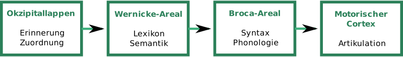
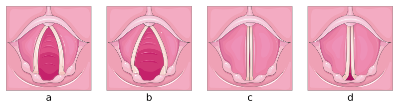

---
list-of-figures:
  label: Abbildung
  title: Abbildungsverzeichnis
list-of-tables:
  label: Tabelle
  title: Tabellenverzeichnis
cite:
  title: Quellenverzeichnis
footnotes:
  title: Fußnoten
abbreviations:
  title: Abkürzungsverzeichnis
---

<!-- prettier-ignore -->
*[ALS]: Amyotrophe Lateralsklerose
*[EEG]: Elektroenzephalographie
*[EW]: Einwohner
*[LRS]: Lese- und Rechtschreibstörung
*[PET]: Positronen-Emissions-Tomographie
*[PVS]: Persistent Vegetative State
*[RS]: Rett-Syndrom
*[SLI]: Specific language impairment
*[u. a.]: unter anderem
*[u. a.]: unter anderem
*[U.S.]: United States
*[USA]: United States of America
*[WWW]: World Wide Web
*[z. B.]: zum Beispiel

<!-- *[Z. B.]: Zum Beispiel -->

# Sprache und Sprechen

Den gesprochenen (vokalisierten) Äußerungen eines Menschen liegt ein zweistufiger Prozess zugrunde, bei dem wir strikt zwischen den Elementen _Sprache_ (semantisches Repräsentationssystem) und _Sprechen_ (phonetisches Repräsentationssystem) unterscheiden müssen.
Sprache ist die Codierung von abstrakten Denkmustern in eine Folge von grafischen Zeichen (z. B. Buchstaben) oder lautlichen Elementen (Phoneme).
Die Manifestierung von Schriftzeichen nennen wir „Schreiben“; die Realisierung von Lauten nennen wir „Sprechen“ [@dudel:1996, @böhme:1997, @pschyrembel:1989].

Beim Komplex „Sprache – Sprechen“ lassen sich vier linguistische Ebenen unterscheiden [@böhme:1997]:

- _Semantisch-lexikale Ebene_: Semantik – Lehre von den Inhalten und der Bedeutung der Wörter; Lexikologie – Untersuchung des Wortschatzes einer Sprache.
- _Syntaktisch-morphologische Ebene_: Syntax – Charakterisierung von Sätzen und Erkennen ihrer inneren Struktur; Morphologie bzw. Grammatik – Lehre vom Aufbau und den Gesetzmäßigkeiten einer Sprache.
- _Phonetisch-phonologische Ebene_: Phonetik – artikulatorische, akustische und auditive Faktoren von Lauten; Phonologie – Untersuchung des Lautsystems einzelner Sprachen und dessen Funktion.
- _Pragmatisch-kommunikative Ebene_: Gebrauch der Sprache in der Beziehung zwischen Sprecherin und Sprecher und Hörerin und Hörer (Sender und Empfänger).

## Die Sprache

1. Definitionen  
   Sprache ist ein konventionelles[^32] System von Zeichen zu Kommunikationszwecken [@brockhaus:1994].
   Kommunikation zwischen Lebewesen kann auf vielfältige Weise erfolgen.
   Bei Tieren spielen neben Lauten auch Gesten, Gebärden und Duftstoffe eine wichtige Rolle.
   Trotz der Vielfalt der verwendeten Ausdrücke und Ausdrucksformen, wird die bei Tieren vorkommende Verständigung nicht als Sprache bezeichnet, da zur Übermittlung der Nachricht immer nur vorgegebene, unveränderte Zeichen verwendet werden.
   Sprache im Sinne der üblichen Definition liegt erst dann vor, wenn es eine Konvention gibt, die es ermöglicht, aus einem beschränkten, überindividuellen Zeichenvorrat (z. B. Alphabet, Wortschatz) eine unbeschränkte Zahl beliebiger Nachrichten produzieren und verstehen zu können.
   Diese dafür erforderlichen syntaktischen Fähigkeiten scheinen nach heutigem Wissensstand ausschließlich beim Menschen vorzukommen.
   In diesem Sinne besteht Sprache aus bedeutungstragenden Elementen (Morphemen), die nach den Regeln der Syntax zu bedeutungsvollen Einheiten mannigfaltig kombiniert werden können [@dudel:1996].

   > Der Mensch spricht (...) Wir sprechen, weil Sprechen uns natürlich ist (...) Man sagt, der Mensch habe die Sprache von Natur (...) Erst die Sprache befähigt den Menschen, dasjenige Lebewesen zu sein, das er als Mensch ist (...) Als der Sprechende ist der Mensch: Mensch.  
   > _Martin Heidegger_ [@heidegger:1959]

   [^32]: Konventionell: hier im Sinne von „auf Konventionen beruhend“, vereinbart.

   Unter Sprachproduktion wollen wir daher die Bildung und Verarbeitung mentaler Konzepte verstehen, wodurch unter Zugriff auf den erlernten aktiven Wortschatz und unter Anwendung der für die jeweilige Sprache gültigen syntaktischen Regeln eine Nachricht so aufbereitet wird, dass sie der vokalen Artikulation oder einer anderen geeigneten Modalität (Schrift, Gebärden, Körpersprache etc.) zugeführt werden kann.
   Manifestiert sich diese Sprache gleichzeitig in mehreren Modalitäten, dann sprechen wir von bimodaler[^33] oder multimodaler Kommunikation.

   [^33]: Ein typisches Beispiel für eine bimodale Kommunikation ist die simultane Umsetzung eines sprachlichen Ausdruckes in gesprochene Sprache und Gebärdensprache durch die sprechende Person.

2. Spracherwerb  
   Nach N. Chomsky steht die Komplexität der menschlichen Sprache in Widerspruch zur Leichtigkeit, mit der Kinder Sprache erwerben.
   Daher postuliert er mit dem „Principles and Parameters Model“, dass die allen Sprachen gemeinsamen Grundzüge bereits biologisch angelegt sind (angeborenes Wissen).
   Unter Verwendung dieser „universellen Prinzipien“ beschränkt sich der Erwerb der Muttersprache „nur“ auf die Erlernung jener grammatischen Parameter, die die syntaktischen Unterschiede der einzelnen Sprachen bestimmen.

3. Wortschatz  
   Der Wortschatz der deutschen Sprache umfasst (je nach Quelle und Zählweise) rund $300\:000$ bis $400\:000$ Wörter.
   Davon sind etwa $60\%$ Substantive (Hauptwörter), $25\%$ Verben (Zeitwörter) und $15\%$ Adjektiva (Eigenschaftswörter) und Adverbien (Umstandswörter).
   Die englische Sprache ist wesentlich reicher.
   Hier wird ein Wortbestand von $600\:000$ bis $800\:000$ Wörtern genannt.
   Französisch umfasst hingegen nur $100\:000$ Wörter [@brockhaus:1994, @erben:1965, @geo-magazin:1997].

   Der durchschnittliche aktive Wortschatz eines/einer Erwachsenen beträgt $8\:000$ bis $16\:000$ Wörter, während der durchschnittliche passive Wortschatz fast $100\:000$ Wörter erreicht.
   Zum $90\%$ Verstehen eines einfachen, alltäglichen Textes reichen hingegen bereits $2\:000$ Wörter aus.

   Mit $18$ Monaten verfügt ein Kind über etwa $50$ wortartige Ausdrücke.
   Ein Jahr später ist der aktive Wortschatz auf $400$ Wörter und im Alter von $3$ Jahren auf mehr als $700$ Wörter gestiegen.
   Den Verben kommt dabei eine besondere Stellung zu.
   Sie werden später und mit größerer Anstrengung in den aktiven Wortschatz aufgenommen [@wilson:1998].
   Der passive Wortschatz eines sechsjährigen Kindes wird mit nicht weniger als $23\:000$ Wörtern angegeben [@geo-magazin:1997].

4. Sprache und Gehirnfunktionen  
   Neuere Forschungsergebnisse behaupten, dass am Verstehen und Produzieren von Sprache sehr viele Regionen des menschlichen Gehirns beteiligt sind.
   Das ist insbesondere dann gegeben, wenn man bedenkt, dass Sprache gehört und gelesen, gesprochen oder geschrieben werden kann und dass es neben der verbalen Sprache auch noch zahlreiche nicht-verbale Ausdrucksformen gibt.

   Bei der klassischen Betrachtung der beteiligten Hirnregionen geht man, des besseren Verständnisses willen, von gehörter Sprache aus und verfolgt die Wirkungskette bis zur Produktion einer gesprochenen Antwort auf das Gehörte.

   Einerseits durch die Beobachtung und Analyse von Gehirnläsionen und deren Auswirkung auf die sprachliche Kompetenz und Leistung von Versuchspersonen, andererseits durch den Einsatz von Positronen-Emissions-Tomographie (PET)[^34] konnten relativ eng begrenzte Areale im Gehirn gefunden werden, die für die Verarbeitung und Produktion von Sprache zuständig sind.

   [^34]: Mit der Positronen-Emissions-Tomographie kann ein Schnittbild der Energiebilanz des Gehirns erstellt und somit festgestellt werden, welche Areale des Gehirns bei bestimmten Tätigkeiten überdurchschnittliche Aktivitäten entfalten.

   Das sogenannte Wernicke-Zentrum[^35] ist die „sensorische“ Sprachregion im hinteren, oberen Teil des Schläfenlappens der jeweils dominanten Hemisphäre des Gehirns (bei $99\%$ der rechtshändigen und $60\%$ der linkshändigen Personen auf der linken Körperseite).

   [^35]: Carl Wernicke, deutscher Neurologe und Psychiater, $1848-1905$.

   Schon früher konnte Broca[^36] in der unteren Windung des Stirnlappens der dominanten Hemisphäre die „motorische“ Sprachregion lokalisieren, die nach ihm als Broca-Zentrum benannt wird.

   [^36]: Paul Broca, französischer Chirurg und Anthropologe, $1824-1880$.

   Die beiden Bezeichnungen „sensorisches“ und „motorisches“ Zentrum erscheinen bei einer gesamten Betrachtung der sprachlichen Tätigkeit des Gehirns eher irreführend, zumal das „motorische Zentrum“ trotz seiner topografischen Nähe nichts mit dem für den Sprechvorgang verantwortlichen motorischen Cortex zu tun hat.

   Versucht man die beiden Sprachzentren gemäß ihrer linguistischen Aufgabe zu benennen, dann stellt das Wernicke-Zentrum sozusagen das Lexikon dar, in dem die Begriffe und ihre Bedeutung (Semantik) gespeichert sind.
   Zusammen mit den im nahen Hinterhauptslappen lokalisierten Funktionen für Erinnerung und Zuordnung werden im Wernicke-Areal, so wird vermutet, aus abstrakten, noch nicht sprachlich gefassten Gedanken durch Suche nach den passenden Begriffen die Wörter für die spätere Satzbildung festgelegt.

   <!-- FIXME: missing bibliography entry: [MET 94] -->

   

   Gemäß diesem Modell übernimmt sodann das Broca-Zentrum als „Grammatik-Maschine“ diese Wortbausteine, ergänzt sie durch die notwendigen Funktionswörter und baut aus ihnen einen syntaktisch korrekten Satz auf.

   Im folgenden Schritt wird der fertige Satz, wenn er ausgesprochen werden soll, an jenen Teil des motorischen Cortex weitergeleitet, der für die korrekte Ansteuerung von etwa hundert Muskeln verantwortlich ist, die an der Artikulation der gesprochenen Sprache beteiligt sind.
   Analoge Mechanismen laufen für die geschriebene Sprache und die nicht-verbale Kommunikation ab.

   Dem Wernicke-Areal fallen auch Aufgaben beim Erkennen gehörter Wörter zu.
   Ein weiteres Zentrum (optisches Sprachzentrum) ist beim Lesen aktiv.

   Für die Grundfunktionen „Lexikon“, „Semantik“ und „Grammatik“ sind die Sprachzentren der dominanten Hirnhälfte (meistens links) verantwortlich.
   Das soll aber nicht darüber hinwegtäuschen, dass beim Verstehen und bei der Produktion von Sprache auch die nicht-dominante Gehirnhälfte eine wichtige Aufgabe zu erfüllen hat.
   Fällt nämlich der Balken (Corpus callosum), die Verbindung zwischen den beiden Gehirn-Hemisphären aus (Verletzungen, Tumore), verlieren Personen die Fähigkeit, Gefühlskomponenten in der Sprache zu unterscheiden (ärgerlich, ironisch, humorvoll etc.) oder bildhafte Sprache (Metaphern) anders als im rein wörtlichen Sinn zu verstehen [@eberhard:1994].

{.lower-alpha}

## Sprechen, Stimmbildung und Sprechorgane

1. Organe der Stimmbildung  
   Die Stimmbildung des Menschen, die in der gesamten Natur einzigartig ist, erfolgt durch ein komplexes Zusammenspiel einer Vielzahl von Organsystemen:

   - Das respiratorische System (die Lungen und Atemwege) muss eine ausreichende Luftmenge und einen ausreichenden Luftdruck zur Verfügung stellen.
   - Der Kehlkopf mit den Stimmbändern dient der Erzeugung von Klängen (im Sinne von Tönen samt ihren Oberwellen), die in diesem Zusammenhang Stimme genannt werden.
   - Das Artikulationssystem, bestehend aus Rachen, Mundhöhle und Nasenhöhle formt aus dem vom Kehlkopf kommenden Schall die einzelnen Phoneme, also die Elemente der gesprochenen Sprache.
   - Die Stimmbildung im Kehlkopf (Stellung der Stimmbänder) und alle Bewegungen der Artikulationsorgane (vornehmlich Stellung der Zunge, des Gaumens, der Kiefer und der Lippen) erfolgt durch das motorische Sprachzentrum des Gehirns.
   - Nicht unterschätzt bei der Spracherzeugung darf die Rolle des Gehörs werden.
     Erst durch die Rückkopplung der eigenen Stimme ist natürlicher Spracherwerb und einwandfreie Artikulation möglich.
     Ist diese Rückkopplung durch eine Schädigung des Ohres oder der Hörbahn nicht gewährleistet, ist der Spracherwerb nur mittels besonderer pädagogischer und therapeutischer Maßnahmen möglich.

   Die Stellung der Stimmbänder bestimmt, ob die ausgeatmete Luft die Stimmritze (Spalt zwischen den Stimmbändern, _Glottis_) ungehindert passieren kann (normale Atmung) oder ob sie bei verengter Stimmritze die Stimmbänder in Schwingung versetzen kann (Phonation).
   Je stärker die Stimmbänder gespannt sind und je höher der Druck der ausgeatmeten Luft ist, desto höher ist die von den Stimmbändern erzeugte Schwingungsfrequenz.
   Eine eigene Stellung der Stimmbänder liegt bei Flüsterstimme vor.
   Die vier wichtigsten Stellungen der Stimmbänder sind in <<fig:stellung-der-stimmbaender>> gezeigt.

   Der weiche Gaumen regelt je nach seiner Stellung das Einströmen der Luft in die Mund- oder Nasenhöhle (oder beides) und trägt dadurch zur Klangfärbung bei.
   Zunge, Zähne und Lippen bewirken die Differenzierung bei der Artikulation.

   

   ::: figcaption

   1. bei ruhiger Atmung;
   2. bei forcierter Atmung;
   3. bei Stimmbildung;
   4. bei Flüsterstimme.
      {.lower-alpha}

   :::

{.lower-alpha}

!!!include(general/attribution.md)!!!
