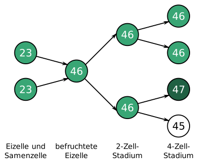
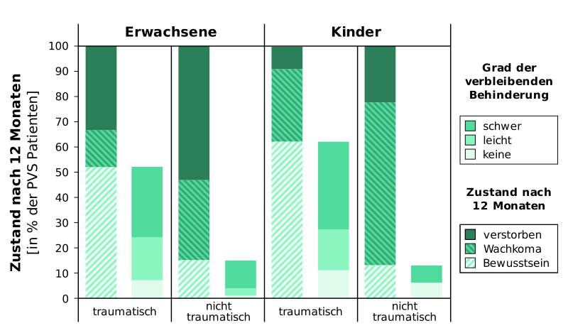

---
list-of-figures:
  label: Abbildung
  title: Abbildungsverzeichnis
list-of-tables:
  label: Tabelle
  title: Tabellenverzeichnis
cite:
  title: Quellenverzeichnis
footnotes:
  title: Fußnoten
abbreviations:
  title: Abkürzungsverzeichnis
---

<!-- prettier-ignore -->
*[ALS]: Amyotrophe Lateralsklerose
*[EEG]: Elektroenzephalographie
*[EW]: Einwohner
*[PET]: Positronen-Emissions-Tomographie
*[PVS]: Persistent Vegetative State
*[RS]: Rett-Syndrom
*[ZNS]: Zentralnervensystem
*[z. B.]: zum Beispiel

<!-- *[Z. B.]: Zum Beispiel -->

# Mehrfachbehinderungen, Syndrome

## Mehrfachbehinderungen

Das Zusammentreffen mehrerer Schädigungen wird als Mehrfachbehinderung bezeichnet und wiegt für die betroffene Person oft schwerer als die Summe der einzelnen Behinderungen.

<<tab:auftreten-mehrfachbehinderungen>> zeigt für die drei häufigsten primären Behinderungen (Mobilitäts-, Seh- und Hörbehinderung) die Wahrscheinlichkeit des Auftretens weiterer funktioneller Einschränkungen.
Die Zahlen geben an, wie viele von $1\:000$ Personen mit einer bestimmten Primärbehinderung von einer der ausgewählten zusätzlichen Einschränkungen betroffen sind.

<table>
  <colgroup span="3"></colgroup>
  <col>
  <thead>
    <tr>
      <th colspan="3">Von <MathML formula="1.000"/> Personen mit einer Behinderung ...</th>
      <th rowspan="2" scope="rowgroup">... sind zusätzlich eingeschränkt bei/durch</th>
    </tr>
    <tr>
      <th>... der Mobilität ...</th>
      <th>... des Sehens ...</th>
      <th>... des Hörens ...</th>
    </tr>
  </thead>
  <tbody>
    <tr>
      <td><MathML formula="1.000"/></td>
      <td><MathML formula="700"/></td>
      <td><MathML formula="530"/></td>
      <th>Mobilität</th>
    </tr>
    <tr>
      <td><MathML formula="150"/></td>
      <td><MathML formula="1.000"/></td>
      <td><MathML formula="160"/></td>
      <th>Sehen</th>
    </tr>
    <tr>
      <td><MathML formula="230"/></td>
      <td><MathML formula="380"/></td>
      <td><MathML formula="1.000"/></td>
      <th>Hören</th>
    </tr>
    <tr>
      <td><MathML formula="320"/></td>
      <td><MathML formula="220"/></td>
      <td><MathML formula="200"/></td>
      <th>Rheuma</th>
    </tr>
    <tr>
      <td><MathML formula="20"/></td>
      <td><MathML formula="30"/></td>
      <td><MathML formula="10"/></td>
      <th>Epilepsie</th>
    </tr>
    <tr>
      <td><MathML formula="270"/></td>
      <td><MathML formula="150"/></td>
      <td><MathML formula="170"/></td>
      <th>Herzkrankheiten</th>
    </tr>
  </tbody>
</table>

.auftreten-mehrfachbehinderungen#Auftreten von Mehrfachbehinderungen [@tetzchner:1991].

## Syndrome

Unter einem Syndrom[^38] wird das Zusammentreffen mehrerer Krankheitszeichen (Symptomen) verstanden, die für ein bestimmtes Krankheitsbild charakteristisch sind.
Dabei ist die Krankheitsursache (Ätiologie) zwar meist einheitlich, der Krankheitsverlauf (Pathogenese) jedoch unbekannt.

[^38]: Syndrom: von grie. mitlaufend, begleitend.

1. Down-Syndrom  
   Das Down-Syndrom[^39] (auch Trisomie $21$ oder Morbus Langdon-Down)[^40] entsteht durch eine chromosomale Störung, bei der bei der Befruchtung oder einer der nachfolgenden Zellteilungen ein zusätzliches drittes Chromosom $21$ (daher Trisomie $21$)[^41] in den Körperzellen auftritt und von da an bei jeder weiteren Zellteilung weitergegeben wird[^42].
   Das Down Syndrom führt zu einer Fehlentwicklung fast sämtlicher Gewebe und Organe des heranreifenden Organismus.
   Man unterscheidet zwei Typen von Down-Syndrom:

   [^39]: John L. Down, englischer Arzt, $1828-1896$.
   [^40]: Die frühere übliche Bezeichnung „Mongolismus“ gilt heute als diskriminierend und soll daher vermieden werden.
   [^41]: Neben der Trisomie $21$ sind noch andere autosomale Trisomien mit Beteiligung der Chromosomen $3$, $9$, $10$, $12$, $13$ und $18$ bekannt. Bei den Geschlechtschromosomen kann es zu genosomalen Trisomien (XXY und XYY) kommen.
   [^42]: Dass eine Chomosomenstörung die Ursache für das Down-Syndrom ist, wurde zwar schon um $1930$ vermutet, der Beweis dafür konnte aber erst $1959$ vom Franzosen Jérôme Lejeune erbracht werden.

   - _Freie (vollständige) Trisomie $21$_  
     Das zusätzliche Chromosom $21$ existiert bereits als $24$.
     Chromosom in einer der Keimzellen und ist daher als freies drittes Chromosom $21$ in allen Körperzellen enthalten (<<fig:chromosomen-weitergabe-down-syndrom>>).

   - _Mosaik-Down-Syndrom_  
     Samen- und Eizelle enthalten die korrekte Zahl von $23$ Chromosomen.
     Der Chromosomen-Fehler tritt erst bei einer der ersten Zellteilungen auf.
     Daher gibt es sowohl Zellen mit $46$ als auch solche mit $47$ Chromosomen.
     Diese Form tritt bei etwa $1\%$ der Kinder mit Down-Syndrom auf (<<fig:chromosomen-weitergabe-mosaik-down-syndrom>>).

   .")

   

   Abgesehen von Deformationen und Veränderungen im Habitus sind folgende Symptome für das Down-Syndrom charakteristisch:

   - Geistige Behinderung unterschiedlichen Ausmaßes.
   - Sprechstörung (hoher Gaumen, große Zunge, Zahnfehlstellungen).
   - Muskelhypotonie.

2. Parkinson-Syndrom  
   Das Parkinson-Syndrom[^43] ist die häufigste neurologische Erkrankung des fortgeschrittenen Alters, von der vorwiegend Männer betroffen werden.
   Es handelt sich um ein extrapyramidales Syndrom zufolge einer Degeneration von Neuronen im Mittelhirn (Substantia nigra) [@pschyrembel:1989].

   [^43]: James Parkinson, englischer Chirurg und Paläontologe, $1755-1824$.

   Die mit dem Parkinson-Syndrom verbundenen Symptome sind in erster Linie:

   - Leise und monotone Sprache
   - Verlangsamung und Verkürzung von Bewegungen und Bewegungsstörungen (langsamer, schlurfender Gang, kleine Handschrift, Fallneigung)
   - Steifigkeit der Muskulatur
   - Ruhetremor (Zittern der Muskulatur in Ruhestellung mit $4$ bis $6$ Bewegungen pro Sekunde).
     Bei willkürlichen Bewegungen setzt der Tremor aus, die Handschrift ist daher nicht zittrig.

3. Gregg-Syndrom  
   Gregg-Syndrom (Rötelnembryopathie, Embryopathia rubeolosa), Fehlbildungssyndrom nach Rötelninfektion der Mutter während der ersten drei Schwangerschaftsmonate [@pschyrembel:1989].
   Die dabei auftretenden Anomalien richten sich nach dem Zeitpunkt der Rötelninfektion (<<tab:anomalien-gregg-syndrom>>).

   <table>
     <thead>
       <tr>
         <th>Schwangerschaftsmonat</th>
         <th>Schwerpunkt der Anomalien</th>
         <th>Auftretende Symptome</th>
       </tr>
     </thead>
     <tbody>
       <tr>
         <td rowspan="4"><MathML formula="1"/></td>
         <td rowspan="4">Augen</td>
         <td>kongenitaler Grauer Star (Cataracta congenita)</td>
       </tr>
       <tr>
       <td>fakultativer Grüner Star (Glaukom)</td>
       </tr>
       <tr>
       <td>kleine Augen (Mikrophthalmie)</td>
       </tr>
       <tr>
       <td>Augenhintergrundveränderungen (pseudo-RP)</td>
       </tr>
       <tr>
         <td rowspan="4"><MathML formula="2"/></td>
         <td>Herz</td>
         <td>Herzscheidewanddefekte</td>
       </tr>
       <tr>
         <td rowspan="3"><abbr title="Zentralnervensystem">ZNS</abbr></td>
         <td>geringes Hirnvolumen (Mikrozephalie)</td>
       </tr>
       <tr>
         <td>Retardierung, Epilepsie</td>
       </tr>
       <tr>
         <td>Bewegungsstörungen</td>
       </tr>
       <tr>
         <td><MathML formula="3"/></td>
         <td>Innenohr</td>
         <td>sensorineurale Schwerhörigkeit</td>
       </tr>
     </tbody>
   </table>

   .anomalien-gregg-syndrom#Anomalien bei Gregg-Syndrom [@pschyrembel:1989].

4. Rett-Syndrom (RS)  
   Das Rett-Syndrom[^44] ist eine bisher nur bei Mädchen beobachtete, wahrscheinlich X-chromosomal-dominant vererbte Erkrankung, in deren Verlauf es neben Hirnatrophie (Schwund des Nervengewebes im Gehirn) auch zu anderen Veränderungen im Gehirn kommt.
   Die Manifestation erfolgt zwischen dem $6.$ Lebensmonat und dem $4.$ Lebensjahr.
   Die Auswirkungen sind:

   [^44]: Andreas Rett, österreichischer Kinderarzt.

   - Epilepsie
   - Verzögerungen im Wachstum
   - Verlust bereits erworbener Fähigkeiten
   - Stereotype Handbewegungen (waschend, knetend)
   - Gangstörungen (breitbeinig, steif)
   - Apraxie (betrifft auch Sprechorgane und Augenbewegungen)
   - Verlust der verbalen Kommunikation

5. Usher-Syndrom  
   Das Usher-Syndrom ist eine autosomal-rezessiv vererbte Erkrankung mit den wesentlichen Symptomen:

   - Progrediente Schwerhörigkeit im Kinder- und Jugendalter
   - Retinopathia pigmentosa (Retinitis pigmentosa), kommt Jahre später hinzu
   - Ausfall des Nervus vestibularis (Teil des Nervus vestibulocochlearis = VIII. Hirnnerv, der das Gleichgewichtssystem (Vestibularapparat) innerviert.
   - Epileptische Anfälle (möglich)

   Das Usher-Syndrom ist eine der Hauptursachen für Taubblindheit.

6. Wachkoma (PVS) und Locked-in Syndrom  
   Mit Wachkoma (Apallisches Syndrom, Coma vigile, Persistent Vegetative State – PVS) wird ein klinischer Zustand bezeichnet, bei dem sich der Patient / die Patientin in einer vollständigen Wahrnehmungslosigkeit über sich und seine / ihre Umwelt befindet.
   Die autonomen Funktionen des Hypothalamus und des Hirnstammes bleiben vollständig oder teilweise erhalten.
   Ein EEG ist vorhanden und im weiteren Verlauf normal.
   Allerdings fehlt bei visueller Stimulation die sonst übliche Blockierung der alpha Wellen.
   Die Patienten und Patientinnen weisen einen natürlichen Schlaf-Wach-Zyklus auf.
   Trotzdem gibt es keine Anzeichen eines reproduzierbaren, zielgerichteten oder willentlichen Verhaltens als Reaktion auf visuelle, taktile, auditive oder noxische Reize [@persistent-vegetative-state:1994:part-1].

   Das Wachkoma ist deutlich von verwandten Zuständen wie Locked-in Syndrom, Koma, Gehirntod oder schwerer Demenz zu unterscheiden (siehe dazu die auch Zusammenstellung in <<tab:wachkoma-und-verwandte-zustaende>>):

   - Koma: Tiefe Bewusstlosigkeit, die länger als eine Stunde andauert.
   - Gehirntod: Permanentes Fehlen jeglicher Gehirntätigkeit, auch der des Hirnstammes.
   - Locked-in Syndrom: Bewusstsein und Wahrnehmung ist vorhanden, kann aber nicht erwidert werden.
     PET Scans zeigen wesentlich höhere metabolische Werte als bei PVS.
   - Demenz: Progressiver, multidimensionaler Verlust von kognitiven Funktionen.
     Ein Fortschreiten bis in einen PVS als Endstadium ist möglich.

   <table>
     <thead>
       <tr style="height: 14rem;">
         <th>Zustand</th>
         <th>Selbstwahrnehmung</th>
         <th>Schlaf-Wach-Zyklus</th>
         <th>Motorische Funktionen</th>
         <th>Wahrnehmung des Leidens</th>
         <th>Atmung</th>
         <th>EEG Aktivität</th>
         <th>Gehirn-Stoffwechsel</th>
       </tr>
     </thead>
     <tbody>
       <tr>
         <th scope="row">Wachkoma</th>
         <td>fehlt</td>
         <td>intakt</td>
         <td>keine kontrollierte Bewegung</td>
         <td>nein</td>
         <td>normal</td>
         <td>delta oder theta, manchmal alpha</td>
         <td>um <MathML formula="50\%"/> oder mehr reduziert</td>
       </tr>
       <tr>
         <th scope="row">Koma</th>
         <td>fehlt</td>
         <td>fehlt</td>
         <td>keine kontrollierte Bewegung</td>
         <td>nein</td>
         <td>reduziert, verschieden</td>
         <td>delta oder theta</td>
         <td>um <MathML formula="50\%"/> oder mehr reduziert</td>
       </tr>
       <tr>
         <th scope="row">Gehirntod</th>
         <td>fehlt</td>
         <td>fehlt</td>
         <td>keine oder nur spinale Reflexe</td>
         <td>nein</td>
         <td>fehlt</td>
         <td>kein EEG</td>
         <td>fehlt</td>
       </tr>
       <tr>
         <th scope="row">Locked-in Syndrom</th>
         <td>vorhanden</td>
         <td>intakt</td>
         <td>vollständige Lähmung, nur Augenbewegungen</td>
         <td>ja</td>
         <td>normal</td>
         <td>normal oder geringe Abweichung</td>
         <td>geringfügig reduziert</td>
       </tr>
       <tr>
         <th scope="row">Demenz</th>
         <td>vorhanden, geht später verloren</td>
         <td>intakt</td>
         <td>unterschiedlich, progressive Abnahme</td>
         <td>ja, jedoch abnehmend</td>
         <td>normal</td>
         <td>verlangsamt</td>
         <td>unterschiedlich reduziert</td>
       </tr>
     </tbody>
   </table>

   .wachkoma-und-verwandte-zustaende#Wachkoma (PVS) und verwandte Zustände [@persistent-vegetative-state:1994:part-1].

   Bei den Ursachen, die zu einem Wachkoma führen können, unterscheidet man zunächst zwischen akuten Ursachen auf der einen und kongenitaler bzw. degenerativen Ursachen auf der anderen Seite [@persistent-vegetative-state:1994:part-1].

   Die akuten Ursachen können sowohl einen traumatischen Hintergrund (Schädelhirntrauma z. B. durch Unfall oder Schussverletzung) als auch nicht traumatische Hintergründe (Hypoxie durch Kreislaufstillstand oder Ertrinken, Gehirnschlag, Meningitis, Tumore oder Vergiftungen) haben.
   Die statistische Entwicklung von Patienten / Patientinnen mit PVS $12$ Monate nach einer akuten Ursache ist in <<fig:modell-produktion-gesprochene-sprache>> dargestellt.
   Zu beachten ist, dass die Prognosen sowohl zwischen traumatischen und nicht-traumatischen Auslösern als auch zwischen Erwachsenen und Kindern große Unterschiede aufweisen.
   <<fig:modell-produktion-gesprochene-sprache>> zeigt außerdem für jenen Teil der Personen, die innerhalb eines Jahres aus dem PVS erwachen, die Wahrscheinlichkeit und den Grad einer zu erwartenden Behinderung [@kinney:1994, @persistent-vegetative-state:1994:part-1].

   

   Zu den nicht-akuten Ursachen für ein Wachkoma zählen einerseits zahlreiche Missbildungen im Gehirn wie Anenzephalie (Fehlen wesentlicher Gehirnteile), Mikroenzephalie (kleines Gehirn), Hydranenzephalie (Umbildung des Großhirns in eine Flüssigkeitsblase) und angeborener Hydrozephalus.
   Andererseits können bei Erwachsenen Erkrankungen wie Alzheimer, Creutzfeldt-Jacob, Chorea Huntington, Parkinson oder Multi-Infarkt-Demenz in einen PVS führen.
   Bei Kindern können Gangliosidosen (Lipidspeicherkrankheiten) eine Ursache für ein Fallen ins Wachkoma darstellen [@persistent-vegetative-state:1994:part-1].

   Die Häufigkeit des PVS wird sehr unterschiedlich angegeben und schwankt zwischen $25$ bis $60$ auf $1\;\sf{Mio.}$ EW.
   Nur der geringere Teil hat traumatische Ursachen [@andrews:1993].
   Dabei muss allerdings angemerkt werden, dass eine eindeutige Diagnose oft sehr schwer ist und Fehldiagnosen bis zu $60\%$ der untersuchten Fälle ausmachen können [@andrews:1996].

   <!-- FIXME: Querverweis -->

   Beim Locked-in Syndrom sind die Patientinnen und Patienten bei Bewusstsein, aber ohne jegliche Bewegungsmöglichkeit.
   Bei der „klassischen“ Form, bleiben die vertikalen Augenbewegungen und der Lidschlag erhalten, und können mit geeigneten Interfaces für Kommunikationszwecke verwendet werden.
   Beim „totalen“ Locked-in Syndrom fehlen auch diese Bewegungen und eine Kommunikation ist – wenn überhaupt – nur über die Auswertung des EEG (Brain Computer Interface) möglich.
   <!-- Beim „totalen“ Locked-in Syndrom fehlen auch diese Bewegungen und eine Kommunikation ist – wenn überhaupt – nur über die Auswertung des EEG (Brain Computer Interface – siehe Teil B, Kapitel 3.2.8) möglich. -->

   Als Ursachen für Locked-in Syndrom werden genannt: fortgeschrittene ALS, Hirnstamm Infarkt, Infarkt in der Brücke (_Pons_, Verbindung der beiden Gehirnhälften), beidseitiger Infarkt der inneren Kapsel (Capsula interna – tief liegender Teil des Gehirns), Tumore, Enzephalitis (Entzündung des Gehirns) und Schädelhirntrauma [@kübler:2001:a, @kübler:2001:b].

{.lower-alpha}

!!!include(general/attribution.md)!!!
