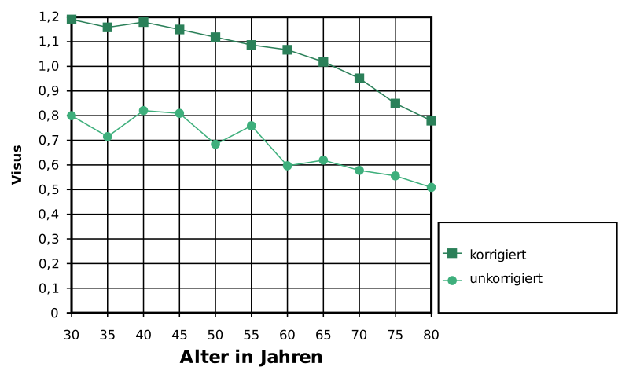
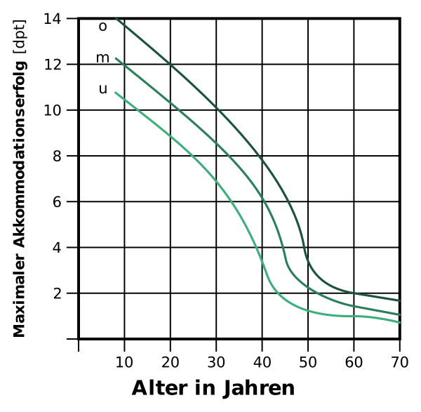
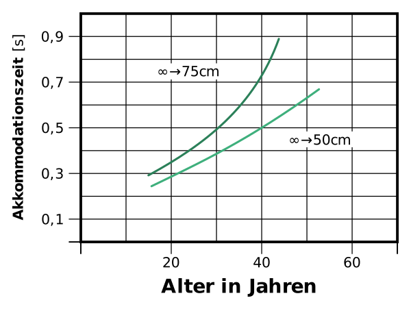
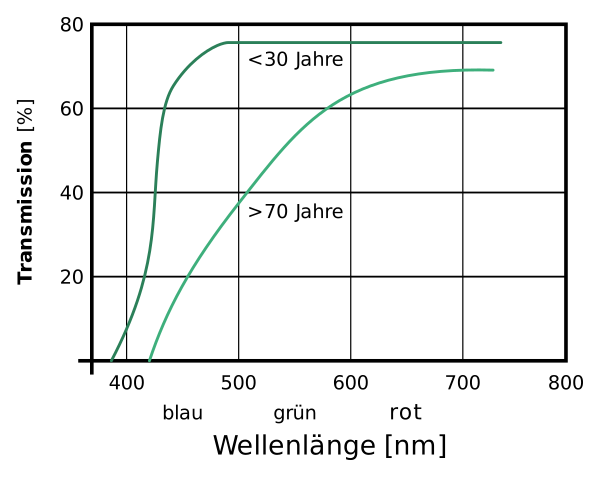
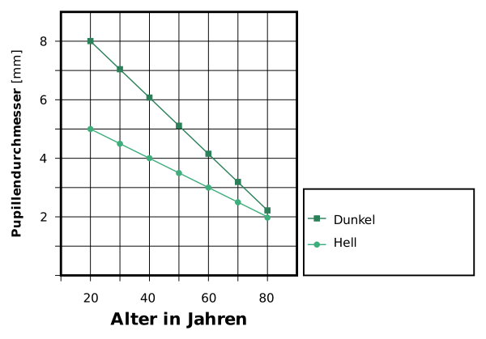
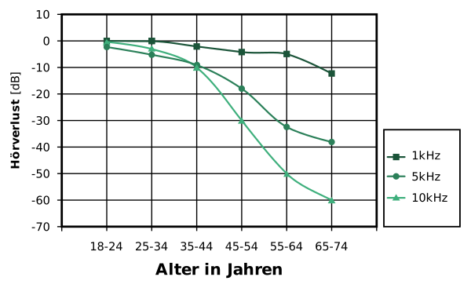
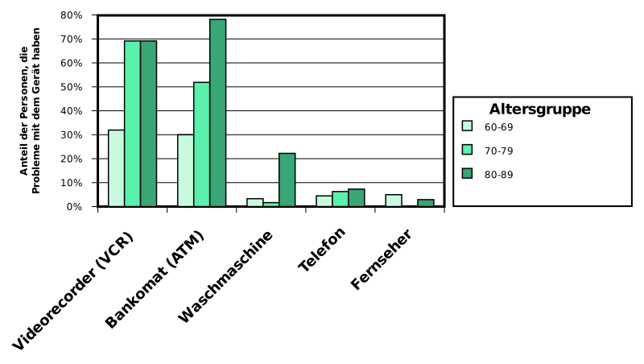
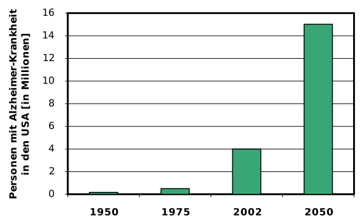

---
list-of-figures:
  label: Abbildung
  title: Abbildungsverzeichnis
list-of-tables:
  label: Tabelle
  title: Tabellenverzeichnis
cite:
  title: Quellenverzeichnis
footnotes:
  title: Fußnoten
abbreviations:
  title: Abkürzungsverzeichnis
---

<!-- prettier-ignore -->
*[USA]: United States of America
*[WWW]: World Wide Web
*[z. B.]: zum Beispiel

<!-- *[Z. B.]: Zum Beispiel -->

# Altersbedingte Funktionseinschränkungen

Altern stellt einen komplexen, irreversiblen Vorgang dar, der durch organisch bedingte Veränderungen im Bereich der Lebensfunktionen charakterisiert ist.
Dem theoretisch bereits bei der Empfängnis einsetzenden Alterungsprozess (Biomorphose) stehen in der Praxis die mit fortschreitendem Lebensalter wesentlich stärker ausgeprägten degenerativen Veränderungen und funktionellen Verluste gegenüber (Seneszenz).

Bei der Betrachtung von Alterserscheinungen sollte bewusst zwischen dem chronologischen (kalendermäßigen) Alter und dem biologischen Alter unterschieden werden [@helander:1998].
Durch eine Klassifizierung alter Menschen allein aufgrund ihres Lebensalters (wie sie im Rahmen von Statistiken mangels besserer Möglichkeiten immer wieder vorgenommen wird), werden hochgradig heterogene Bevölkerungsschichten geschaffen, deren Fähigkeiten in vielfacher Hinsicht nicht miteinander verglichen werden können.

<!-- FIXME: missing bibliography entry: [PLO 98] -->

Alter bedeutet zwar zunächst eine höhere Wahrscheinlichkeit, eine oder mehrere körperliche Beeinträchtigungen zu erleiden (<<fig:prozentueller-anteil-behinderungen-us>>), aber es darf dabei nicht vergessen werden, dass $84\%$ der Personen über $65$ keine fremde Hilfe bei der Verrichtung alltäglicher Aktivitäten benötigen.
Es wäre daher ein vollkommen falscher Blickwinkel, sie pauschal als Behinderte oder Patientinnen und Patienten und nicht als Konsumentinnen und Konsumenten zu betrachten (<<fig:prozentueller-anteil-hilfestellungen-us>>) [@plo:1998, @yokoyama:1998, @charness:1998:b].

.")

::: figcaption

Prozentualer Anteil der in Haushalten lebenden US-Bevölkerung (Quelle: US Census Bureau [@mcneil:1995]), die

1. leicht oder schwer behindert sind;
2. schwer behindert sind;
3. bei mindestens einer Aktivität des täglichen Lebens Probleme haben[^45]
   {.lower-alpha}

:::

[^45]:
    Die Angaben gelten für den Bevölkerungsdurchschnitt.
    Schwarze sind stärker von Behinderungen betroffen.
    Z. B. Altersstufe $55-64$ Jahre: Weiße: $20\%$; Schwarze $35\%$ [@mcneil:1997].

.")

In einer $1982$ in den USA erstellten Studie wurde festgestellt, dass $36\%$ jener Personen, die einen alten Menschen pflegen, selbst über $65$ Jahre alt sind [@harootyan:1993].

Für eine Reihe von Funktionen wurden die für den allgemeinen Alterungsprozess typischen Leistungsabnahmen analysiert.
Sie werden in den nachfolgenden Punkten beschrieben.
Es muss hier aber nochmals auf die besondere Heterogenität dieser Bevölkerungsschicht hingewiesen werden.
Viele der nachfolgend ausgeführten Daten basieren auf Mittelwertbildungen und versuchen somit die typischen Leistungsdaten einer statistischen Person bestimmten Alters darzustellen, die es in der Realität nicht gibt.
Vielmehr ist bekannt, dass in vielen Fällen die extremen Werte einer bestimmten Messskala wesentlich stärker besetzt sind als die Mitte [@harrington:1998].
Die hier genannten Werte können daher nur eine allgemeine Trendlinie darstellen.

## Sehen

1. Zunahme von Augenerkrankungen  
   Mit dem Alter steigt die statistische Wahrscheinlichkeit, eine irreversible Schädigung der Augen zu erleiden, deutlich an.
   <<tab:zunahme-augenerkrankungen-alter>> zeigt die für die USA erhobenen Häufigkeiten des Auftretens von Grauem und Grünem Star sowie der altersbedingten Makulopathie für drei Altersschichten zwischen $52$ und $85$ Jahren.

   <table>
     <thead>
       <tr>
         <th>Alter [in Jahren]</th>
         <th>Katarakt (Grauer Star) [%]</th>
         <th>Makulopathie (altersbedingt) [%]</th>
         <th>Glaukom (Grüner Star) [%]</th>
       </tr>
     </thead>
     <tbody>
       <tr>
         <td><MathML formula="52-64"/></td>
         <td><MathML formula="5"/></td>
         <td><MathML formula="2"/></td>
         <td><MathML formula="1"/></td>
       </tr>
       <tr>
         <td><MathML formula="65-74"/></td>
         <td><MathML formula="18"/></td>
         <td><MathML formula="11"/></td>
         <td><MathML formula="5"/></td>
       </tr>
       <tr>
         <td><MathML formula="75-85"/></td>
         <td><MathML formula="46"/></td>
         <td><MathML formula="28"/></td>
         <td><MathML formula="7"/></td>
       </tr>
     </tbody>
   </table>

   .zunahme-augenerkrankungen-alter#Zunahme von Augenerkrankungen mit dem Alter [@fozard:1993 nach @kahn:1977].

2. Generelle Abnahme der Sehleistung (Visus)  
   Zu der mit dem Alter steigenden Wahrscheinlichkeit, krankheitsbedingt eine Sehschädigung zu erleiden, kommen noch zahlreiche degenerative Prozesse des Auges hinzu.
   Aus <<fig:abnahme-sehleistung-im-alter>> ist ersichtlich, dass die Sehleistung (Sehschärfe, Visus, Abk.: V) trotz Korrektur durch Brillen oder Kontaktlinsen statistisch beginnend mit dem $40.$ Lebensjahr pro Lebensjahrzehnt um rund $0.1\;\sf{V}$ abnimmt.
   In der Altersgruppe $65-74$ Jahre besitzen $92\%$ der Personen einen Visus besser als $0.8$ (bei bestmöglicher Korrektur), für die Altersgruppe $75-84$ sinkt dieser Wert jedoch auf $69\%$ [@kahn:1977].

   <!-- FIXME: missing bibliography entry: [GIT 86] -->

   

3. Verringerung des Akkommodationserfolges und der Akkommodationszeit  
   Unter dem Akkommodationserfolg wird die in Dioptrien (dpt) gemessene Brechkraft-Differenz verstanden, zu der die Augenlinse maximal fähig ist.
   Für das emmetrope (normalsichtige) bzw. durch Brille oder Kontaktlinse korrigierte Auge ist das die Differenz zwischen Fernakkommodation und Akkommodation auf die minimal mögliche Distanz.

   Während das jugendliche Auge im Mittel einen Akkommodationserfolg von $12\;\sf{dpt}$ aufweist, reduziert sich dieser Wert besonders im Lebensabschnitt zwischen $40$ und $50$ Jahren, sodass dann der mittlere Akkommodationserfolg lediglich $2\;\sf{dpt}$ beträgt.
   <<fig:verringerung-akkommodationserfolg-im-alter>> zeigt die typischen Verläufe für den Akkommodationserfolg zwischen $10$ und $70$ Jahren.

   

   Die altersbedingte Reduktion des Akkommodationserfolges bedeutet eine zunehmende Verringerung jenes Bereiches, auf den das Auge scharfstellen kann.
   Zur Erzielung eines scharfen Bildes im üblichen Leseabstand von $35\;\sf{cm}$ bis $40\;\sf{cm}$ benötigt das alterssichtige (presbyope) Auge eine Brechkrafterhöhung durch eine Lesebrille.
   Wird eine solche Brille getragen, dann können größere Entfernungen nicht scharf wahrgenommen werden.

   <<fig:bereich-scharfes-sehen>> zeigt den scharf wahrnehmbaren Bereich, wenn zur Erreichung des Leseabstandes ($35\;\sf{cm}$ bis $40\;\sf{cm}$) eine Brille verwendet wird.
   Im Alter von $50$ Jahren kann so im Durchschnitt noch auf einen Bereich zwischen $35\;\sf{cm}$ und $80\;\sf{cm}$ akkommodiert werden.
   Mit $60$ Jahren ist dieser Bereich bereits auf $10\;\sf{cm}$ ($35\;\sf{cm}$ bis $45\;\sf{cm}$) eingeschränkt.
   Ein Gegenstand, der scharf wahrgenommen werden soll, muss sich also innerhalb dieses kleinen Bereiches befinden.

   Die Zeit, die das Auge benötigt, um auf eine andere Entfernung scharfzustellen, wächst mit dem Alter.
   Für einen Blickwechsel von der Ferne auf einen nahen Gegenstand (z. B. Blickwechsel von der Fahrbahn auf das Armaturenbrett) benötigt eine $50$-jährige Person die doppelte bis dreifache Zeit verglichen mit einer $20$-jährigen Person (<<fig:zunahme-akkommodationszeit-im-alter>>).

    gehalten wird [@methling:1996].")

   

   [^46]:
       Die Akkommodationszeit für größere Entfernungsunterschiede ist tatsächlich kürzer.
       Vermutlich reagiert das Auge auf einen größeren Reiz entsprechend schneller (H. Krueger).

4. Veränderung der spektralen Empfindlichkeit  
   Bereits die jugendliche Augenlinse besitzt zur Verringerung der chromatischen Aberration eine Gelbfärbung.
   Die spektralen Transmissionseigenschaften verändern sich aber im Laufe der Lebensjahre durch zusätzliche verstärkte Gelbfärbung von Eiweißstoffen der Linse (<<fig:transmissionskurve-augenlinse-lebensalter>>) [@methling:1996].
   Das hat zur Folge, dass im Alter wesentlich weniger blaue Anteile durchgelassen werden und violette sowie blaue Gegenstände dunkler wahrgenommen werden [@harrington:1998].
   Dabei ist zu beachten, dass das menschliche Auge von vornherein für Blau die geringste Empfindlichkeit aufweist.

   

   Mit zunehmendem Alter wird die wahrgenommene Farbsättigung und Farbdiskriminierung (besonders für Blau und Grün) geringer.
   Farben wirken „ausgewaschen“ [@fozard:1993].
   Die Gelbfärbung der Linse wird von der alten Person jedoch nicht als Farbstich wahrgenommen.

5. Höherer Licht- und Kontrastbedarf  
   Deutlich dem Alterungsprozess unterworfen ist auch der Pupillendurchmesser.
   Der maximale Durchmesser nimmt mit dem Alter kontinuierlich ab.
   Während das Auge einer $20$-jährigen Person mit einem Kameraobjektiv der Lichtstärke $2$ verglichen werden kann, beträgt die größte „Blende“ einer $80$-jährigen Person nur $5.6$.
   Das ist eine Verringerung um etwa $3$ Blendenstufen, was der Reduktion der auf die Netzhaut fallenden Lichtmenge um den Faktor $8$ gleichkommt.
   Damit erklärt sich der im Alter deutlich höhere Lichtbedarf (<<tab:altersabhaengigkeit-pupillendurchmesser>> und <<fig:abhaengigkeit-pupillendurchmesser-vom-alter>>).

   <table>
     <col>
     <colgroup span="2"></colgroup>
     <colgroup span="2"></colgroup>
     <thead>
       <tr>
         <th rowspan="2">Alter [Jahre]</th>
         <th colspan="2">min. (Tag)</th>
         <th colspan="2">max. (Nacht)</th>
       </tr>
       <tr>
         <th>Ø [mm]</th>
         <th>f</th>
         <th>Ø [mm]</th>
         <th>f</th>
       </tr>
     </thead>
     <tbody>
       <tr>
         <td><MathML formula="20"/></td>
         <td><MathML formula="4.7"/></td>
         <td><MathML formula="4"/></td>
         <td><MathML formula="8.0"/></td>
         <td><MathML formula="2"/></td>
       </tr>
       <tr>
         <td><MathML formula="40"/></td>
         <td><MathML formula="3.9"/></td>
         <td><MathML formula="4"/></td>
         <td><MathML formula="6.0"/></td>
         <td><MathML formula="2.8"/></td>
       </tr>
       <tr>
         <td><MathML formula="60"/></td>
         <td><MathML formula="3.1"/></td>
         <td><MathML formula="5.6"/></td>
         <td><MathML formula="4.1"/></td>
         <td><MathML formula="4"/></td>
       </tr>
       <tr>
         <td><MathML formula="80"/></td>
         <td><MathML formula="2.3"/></td>
         <td><MathML formula="8"/></td>
         <td><MathML formula="2.5"/></td>
         <td><MathML formula="5.6"/></td>
       </tr>
     </tbody>
   </table>

   .altersabhaengigkeit-pupillendurchmesser#Altersabhängigkeit des Pupillendurchmessers – f ist die dem äquivalenten fotografischen System entsprechende gerundete Blendenzahl [@zagler:1997, @methling:1996].

   

   ::: figcaption

   1. Bei Dunkelakkommodation;
   2. Bei Hellakkommodation.

   :::

   Auch bei photopischen Verhältnissen ist der Pupillendurchmesser einer über $60$-jährigen Person wesentlich geringer als in der Jugend, sodass der die Retina einer $60$-jährigen Person erreichende Lichtstrom nur $1/3$ einer $20$-jährigen Person beträgt und somit die für vergleichbare Sehleistung erforderliche Beleuchtungsstärke dreimal so groß ist [@methling:1996].
   Besonders bei alten Menschen ist die durch Erhöhung der Beleuchtungsstärke erzielbare Verbesserung der Sehleistung signifikant.
   Nach [@fozard:1993] steigt die Sehleistung und der Sehkomfort proportional mit der Quadratwurzel der zur Verfügung gestellten Lichtmenge.

   Eine Erhöhung der Lichtmenge veranlasst die Iris, einen kleineren Pupillendurchmesser zu formen.
   Jede derartige Abblendung eines optischen Systems bringt mehr Schärfe und mehr Tiefenschärfe.
   Der kleine Pupillendurchmesser im Alter stellt eine gewisse Kompensation für das presbyope Auge dar und verursacht einen Akkommodationsgewinn zwischen $0.5\;\sf{dpt}$ und $0.75\;\sf{dpt}$ [@methling:1996].

   <<fig:zusammenhang-schriftgroesse-beleuchtung-alter>> zeigt den Zusammenhang zwischen Sehleistung (Lesen von Buchstaben verschiedener Größe), Alter und Beleuchtungsstärke.
   Während Personen im Alter zwischen $30$ und $40$ Jahren kaum einen Vorteil aus höheren Beleuchtungsstärken ziehen, ist der Zuwachs an Leseleistung für ältere Personen beachtlich [@steenbekkers:1998:a].

   <!-- prettier-ignore -->
    [@zagler:2008, @steenbekkers:1998:a].")

{.lower-alpha}

## Hören

Die Zahl der innerhalb einer Altersgruppe von Hörbehinderung betroffenen Personen steigt mit dem Alter nahezu exponentiell an.
<<fig:zunahme-hoerbehinderung-im-alter>> zeigt als Beispiel die Auswertung einer Statistik aus Holland [@sandini:1996].

Die Hörschwelle für reine Töne im oberen Hörbereich (z. B. $8\;\sf{kHz}$) steigt bei erwachsenen Menschen regelmäßig mit einer Rate von etwa $1\;\sf{dB}$ pro Lebensjahr.
Tiefe Töne (z. B. $1\;\sf{kHz}$) sind weit weniger betroffen.
Hier beträgt die jährliche Erhöhung der Hörschwelle zwischen dem $20.$ und $60.$ Lebensjahr lediglich rund $0.3\;\sf{dB/a}$.
In späteren Jahren erhöht sich die Rate jedoch auf bis zu $1.3\;\sf{dB/a}$ (<<fig:verlauf-hoerschwelle-alter>>).
Männer sind in der Regel von altersbedingten Hörverlusten stärker betroffen als Frauen [@fozard:1993, @guski:1996].

 [@zagler:2008, @ferrari:1996, @sandini:1996].")

## Geruch und Geschmack

Die altersbedingten Veränderungen der Wahrnehmungsschwellen beim Geschmackssinn sind je nach Geschmacksrichtung unterschiedlich.
Während die Schwelle für „süß“ (z. B. Zuckerlösungen) auch im Alter stabil bleibt, nimmt die Wahrnehmung für „salzig“ und „bitter“ mit dem Alter ab.

Die Empfindlichkeit für Gerüche nimmt mit dem Alter generell ab.
Das bedeutet nicht nur, dass ältere Menschen dadurch weniger Freude am Essen haben (hier spielt ja neben dem Geschmackssinn der Geruchssinn die bedeutendere Rolle), es entsteht auch ein erhöhtes Risiko, weil austretendes Gas oder verdorbene Lebensmittel nicht zuverlässig wahrgenommen werden können [@fozard:1993].

## Kraft, Bewegung, Mobilität

1. Kraft  
   Mit dem Alter nimmt die Muskelkraft der gesamten Muskulatur gleichförmig ab.
   Wird kein besonderes Training einzelner Muskelpartien vorgenommen, dann kann aus den Werten einiger weniger Messungen auf den Gesamtzustand geschlossen werden.
   <<fig:greifkraft-abhaengigkeit-alter>> zeigt als Beispiel die altersbedingte Abnahme der Kraft, die eine Person beim Greifen mit der Hand aufbringen kann.
   Die Muskelkraft erreicht zwischen $20$ und $25$ Jahren ihr Maximum (im Diagramm auf $100\%$ normiert).

   Da die Haut im Alter trockener ist als in der Jugend, sinkt auch der Reibungskoeffizient zwischen den Fingern und einem zu manipulierenden Gegenstand.
   Das heißt, dass bei allen kraftschlüssigen Betätigungen (z. B. Heben eines glatten Gegenstandes) entsprechend mehr Kraft aufgewendet werden muss [@guski:1996].

   In einer Untersuchung in den Niederlanden wurde festgestellt, dass rund $15\%$ der Personen im Alter über $55$ Jahre (das sind $600\:000$ Einwohner) nennenswerte Schwierigkeiten haben, eine Masse von $5\;\sf{kg}$ über eine Entfernung von $10\;\sf{m}$ zu transportieren [@aken:1998].

    [@zagler:2008, @nayak:1998].")

2. Gehgeschwindigkeit  
   Die Gehgeschwindigkeit gesunder Personen nimmt ab einem Alter von $50$ Jahren ab (<<tab:altersabhaengigkeit-gehgeschwindigkeit>>):

   <table>
     <col>
     <colgroup>
       <colgroup span="2"></colgroup>
       <colgroup span="2"></colgroup>
     </colgroup>
     <thead>
       <tr>
         <th rowspan="3">Alter [Jahre]</th>
         <th colspan="4">Gehgeschwindigkeit</th>
       </tr>
       <tr>
         <th colspan="2">[m/s]</th>
         <th colspan="2">[km/h]</th>
       </tr>
       <tr>
         <th>Männer</th>
         <th>Frauen</th>
         <th>Männer</th>
         <th>Frauen</th>
       </tr>
     </thead>
     <tbody>
       <tr>
         <td><MathML formula="20-50"/></td>
         <td><MathML formula="1.42"/></td>
         <td><MathML formula="1.42"/></td>
         <td><MathML formula="5.11"/></td>
         <td><MathML formula="5.11"/></td>
       </tr>
       <tr>
         <td><MathML formula="60-79"/></td>
         <td><MathML formula="1.21"/></td>
         <td><MathML formula="1.16"/></td>
         <td><MathML formula="4.36"/></td>
         <td><MathML formula="4.18"/></td>
       </tr>
     </tbody>
   </table>

   .altersabhaengigkeit-gehgeschwindigkeit#Abhängigkeit der Gehgeschwindigkeit vom Alter – Gesunde Personen [@fozard:1998]

   Werden auch Personen mit Mobilitätsbehinderung (sie verwenden Stock oder Krücke) einbezogen, ergibt sich nach einer finnischen Studie folgendes Bild (<<tab:gehgeschwindigkeit-alter-personen>>):

   <table>
     <col>
     <colgroup>
       <colgroup span="2"></colgroup>
       <colgroup span="2"></colgroup>
     </colgroup>
     <thead>
       <tr>
         <th rowspan="3">Alter <MathML formula="70-80"/> Jahre</th>
         <th colspan="4">Gehgeschwindigkeit</th>
       </tr>
       <tr>
         <th colspan="2">[m/s]</th>
         <th colspan="2">[km/h]</th>
       </tr>
       <tr>
         <th>min.</th>
         <th>max.</th>
         <th>min.</th>
         <th>max.</th>
       </tr>
     </thead>
     <tbody>
       <tr>
         <td>gesund</td>
         <td><MathML formula="0.84"/></td>
         <td><MathML formula="1.58"/></td>
         <td><MathML formula="3.02"/></td>
         <td><MathML formula="5.69"/></td>
       </tr>
       <tr>
         <td>mit Gehhilfe</td>
         <td><MathML formula="0.18"/></td>
         <td><MathML formula="0.68"/></td>
         <td><MathML formula="0.65"/></td>
         <td><MathML formula="2.45"/></td>
       </tr>
     </tbody>
   </table>

   .gehgeschwindigkeit-alter-personen#Gehgeschwindigkeit alter Personen – Gesunde Personen und Personen, die Gehhilfen verwenden – Laborwerte von $55$ Versuchspersonen [@virokannas:1998]

   Die Gehgeschwindigkeit einer Person ist proportional der zur ihr Verfügung stehenden Muskelkraft, wobei dem Strecken des Kniegelenkes eine wesentliche Rolle zukommt.

   Verglichen mit gleichaltrigen Männern verfügen alte Frauen über wesentlich geringere Muskelkraft: $80$-jährige Frauen $66\%$, $8$-jährige Frauen $54\%$ [@fozard:1998].
   Frauen sind daher im Alter in der Regel anfälliger für Mobilitätsbehinderungen als gleichaltrige Männer.

3. Stürze  
   Mit zunehmendem Alter nimmt einerseits die Kraft ab, die erforderlich ist, um den Körper im Gleichgewicht zu halten.
   Andererseits tragen auch die verminderten Funktionen des Gleichgewichtsorgans (Vestibularapparat), der Propriozeption und der visuellen Wahrnehmung zu einem erhöhten Sturzrisiko im Alter bei [@troy:1996, @fozard:2001].
   Ein Drittel aller Personen mit einem Alter von über $65$ Jahren erleiden mindestens einen Sturz jährlich.
   Stürze sind für $80\%$ der Verletzungen und für $90\%$ der Knochenbrüche bei alten Menschen verantwortlich.
   Stürze stellen die fünft-häufigste Todesursache bei alten Menschen dar [@cameron:1997, @williams:1998:c].

   <table>
     <thead>
       <tr>
         <td></td>
         <th><MathML formula="0-14"/></th>
         <th><MathML formula="15-44"/></th>
         <th><MathML formula="45-64"/></th>
         <th><MathML formula="65-74"/></th>
         <th><MathML formula="75+"/></th>
         <th>Summe</th>
       </tr>
     </thead>
       <tr>
         <th scope="row">Männer</th>
         <td><MathML formula="19"/></td>
         <td><MathML formula="178"/></td>
         <td><MathML formula="247"/></td>
         <td><MathML formula="204"/></td>
         <td><MathML formula="698"/></td>
         <td><MathML formula="1\:346"/></td>
       </tr>
       <tr>
         <th scope="row">Frauen</th>
         <td><MathML formula="14"/></td>
         <td><MathML formula="45"/></td>
         <td><MathML formula="206"/></td>
         <td><MathML formula="261"/></td>
         <td><MathML formula="1\:969"/></td>
         <td><MathML formula="2\:486"/></td>
       </tr>
     <tbody>
     </tbody>
   </table>

   .stuerze-todesursache-abhaengigkeit-alter#Stürze als Todesursache in Abhängigkeit vom Alter Office of Population Censuses and Surveys, Großbritannien, $1986$; aus [@williams:1998:c].

{.lower-alpha}

## Kognitive Faktoren

1. Umgang mit Technik  
   Eine Untersuchung über den Umgang älterer Menschen mit technischen Geräten bzw. mit den Interfaces von technischen Geräten in Japan hat gezeigt, dass es einerseits Typen von Geräten bzw. Interfaces gibt, die mit zunehmendem Alter immer größere Probleme bereiten (z. B. Videorecorder und Bankomaten), dass es aber auch technische Produkte gibt, die trotz fortgeschrittenem Alter keine oder zumindest kaum Probleme bereiten (z. B. Telefon oder Fernseher) [@kuchinomachi:1999].

   

   <!-- FIXME: "sinnenfällig"? -->

   In diesem Zusammenhang ist erwähnenswert, dass sich die der älteren Bevölkerung nachgesagte Technikfeindlichkeit nicht generell bestätigen lässt.
   Für die Akzeptanz technischer Einrichtungen (also auch technischer Hilfen) ist es aber erforderlich, dass die Bedienung einfach verständlich ist und sich in die Erfahrungen der alten Person harmonisch einfügt (also für sie sinnenfällig und stimmig ist).

2. Demenz  
    Mit Demenz wird eine progrediente (fortschreitende) degenerative Veränderung des Gehirns bezeichnet, die sich in drei Hauptbereichen auswirkt (andere Quellen bilden fünf Gruppen) [@riederer:1998:a, @mihailidis:2000]:

   - _Kognitive Beeinträchtigungen_: Störung des Gedächtnisses (vornehmlich des Kurzzeitgedächtnisses), Einschränkungen des abstrakten und rationalen Denkens und des Urteilsvermögens, Unfähigkeit bzw. Schwierigkeit sich an konkrete Abläufe zu erinnern (Reihenfolge beim Ankleiden), Probleme beim Sprechen und beim Benennen, Desorientierung in Bezug auf Datum, Zeit, Wohnort (Gefahr des „Wanderns“), räumliche Desorientierung (Unvermögen, einen bestimmten Raum zu finden – WC, Bad etc.).
   - _Emotionelle, verhaltensmäßige und auf das Persönlichkeitsbild wirkende Beeinträchtigungen_: Depression, Angst, Streitsucht, Psychosen, Halluzinationen, Paranoia, Schlafstörungen.
   - _Physische Beeinträchtigungen_: Unsicherer Gang, Tendenz zum Fallen, Inkontinenz.

   Die am meisten verbreitete Ursache für Altersdemenz ist die Alzheimer-Krankheit.
   Andere Ursachen und Formen sind unter anderem die Lewy-Körper-Demenz, vaskuläre Hirnerkrankungen, Creutzfeldt-Jakob-Krankheit, HIV-Erkrankung und Alkohol-Demenz [@pschyrembel:1989, @topo:2001:a].

   Der typische Verlauf geschieht in mehreren Stufen [@kautz:2002, @whitehouse:2002]:

   - Beginn der Erkrankung, keine Symptome.
   - Vergesslichkeit, Verirren, Verlegen von Gegenständen, Wortfindungsprobleme.
   - Mehrstufige Aufgaben können nicht mehr ohne fremde Hilfe bewältigt werden.
   - Störungen in der Wahrnehmung der Umwelt, Sprachverlust, motorische Verluste.

   Die Zunahme von Demenz mit dem Alter ist signifikant.
   Aus Österreich werden $185\:000$ Erkrankungen berichtet.
   Bis zum Jahr $2020$ wird mit einem Anstieg um $44\%$ (in Deutschland sogar um $47\%$) gerechnet.
   Für Europa rechnet man im Zeitraum $2000$ bis $2050$ mit einer Verdopplung der Demenz-Fälle [@hagen:2001].
   Nach einer finnischen Statistik sind nur $3\%$ der $75$-Jährigen aber bereits $23$ bis $30\%$ der $85$-Jährigen davon betroffen [@topping:1998, @mihailidis:2000].
   Den Anstieg der Alzheimer Erkrankungen in den USA[^47] und die Prognose für $2050$ zeigt <<fig:anstieg-alzheimer-us>>.
   Weltweit rechnet man derzeit mit $18\;\sf{Mio.}$ Alzheimer Patienten und Patientinnen und einem Anstieg auf $80\;\sf{Mio.}$ bis zum Jahr $2050$ [@mihailidis:2002, @kautz:2002, @kautz:2003].

   [^47]: Für die USA werden die Gesamtkosten für Wirtschaft und Staat für die an Alzheimer erkrankten Menschen auf jährlich mindestens 100 Milliarden Dollar geschätzt ($2002$) [@kautz:2003].

   

   Neben einer durch organische Veränderungen ausgelösten Demenz wird oft auch die sogenannte „Pseudodemenz“ beobachtet, von der z. B. Personen betroffen werden können, die in fortgeschrittenem Alter durch einen Krankenhausaufenthalt aus ihrer gewohnten Umgebung herausgerissen werden (Hospitalisierungs-Demenz).

{.lower-alpha}

!!!include(general/attribution.md)!!!
