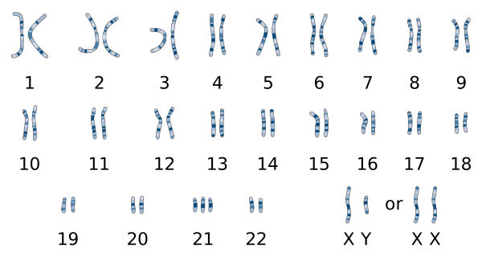

---
list-of-figures:
  label: Abbildung
  title: Abbildungsverzeichnis
list-of-tables:
  label: Tabelle
  title: Tabellenverzeichnis
cite:
  title: Quellenverzeichnis
footnotes:
  title: Fußnoten
abbreviations:
  title: Abkürzungsverzeichnis
---

<!-- prettier-ignore -->
*[ICIDH]: International Classification of Impairments, Disabilities and Handicaps
*[IQ]: Intelligenzquotient
*[MRT]: Magnetresonanztomographie
*[ZNS]: Zentralnervensystem

# Hauptarten von Behinderungen

## Ursachen von Behinderungen

Die Ursachen von Behinderungen können wie folgt klassifiziert werden [@koutoukidis:2008]:

- Vererbt: genetisch übertragen
- Angeboren: infolge einer Infektion während der Schwangerschaft der Mutter oder einer Verletzung während oder kurz nach der Geburt (z. B. zerebrale Lähmung)
- Erworben: als Folge eines Unfalls, einer absichtlichen Verletzung, eines Substanzmissbrauchs oder einer Krankheit im Laufe des Lebens (z. B. Amputation aufgrund einer Verletzung bei einem Autounfall oder aufgrund der Auswirkungen von Diabetes)
- Unbekannter Ursprung

Je nach der konkreten physiologischen oder geistigen Auswirkung einer Behinderung können die folgenden Hauptformen unterschieden werden:

- Körperbehinderung
- Sinnesbehinderung
- Geistige Behinderung

## Körperliche Behinderung

Körperliche Behinderungen umfassen mehrere schwerwiegende, meist lebenslange Behinderungen, die den Menschen vor allem in seinen motorischen Fähigkeiten einschränken.
Die häufigsten Erscheinungsformen sind:

- Schädigung des zentralen Nervensystems
  - Querschnittslähmung
  - Zentralmotorische Bewegungsstörung als Folge von Unfällen oder Verletzungen
  - Multiple Sklerose
  - Spina bifida
  - Parkinsonsche Krankheit
  - Zerebrale Lähmung
- Schädigung des Skelettsystems
  - Verformung der Wirbelsäule (Skoliose, Lordose, Kyphose)
  - Osteogenesis imperfecta (Glasknochenkrankheit)
  - Gelenkfehlbildungen (Luxation)
  - Fehlbildungen des Skelettsystems
    - Dysmelie (Entwicklungsstörungen der Extremitäten)
    - Spaltbildung von Hand oder Fuß (z. B. Klumpfuß)
- Amputationen
- Muskelstörungen (Muskelatrophie, Muskeldystrophie)
- Entzündliche Erkrankungen der Knochen und Gelenke (Arthritis)

Eine körperliche Behinderung ist keine statische Situation.
Sie kann, wie bereits erwähnt, erblich bedingt sein, aber auch durch Unfälle oder Krankheiten erworben werden.
Durch medizinische Behandlung oder medizinische Hilfsmittel kann die Behinderung geheilt oder gemildert werden.
Behinderung ist also immer ein komplexer Prozess aus Ursachen und Folgen, direkten Auswirkungen, individuellen Schicksalen und gesellschaftlichen Konsequenzen [@fürstler:2000].

Im Folgenden werden zwei häufige Formen von Körperbehinderungen näher vorgestellt: _Querschnittslähmung_/_Rückenmarksverletzung_ und _Zerebralparese_.

### Querschnittslähmung und Rückenmarksverletzungen

Je nach den gelähmten Regionen des Patienten sind verschiedene Begriffe gebräuchlich.
Von Paraplegie spricht man, wenn die unteren Extremitäten oder der Rumpf gelähmt sind (motorischer oder sensorischer Verlust).
Die Tetraplegie beschreibt die Lähmung aller vier Extremitäten, während die Hemiplegie die Hälfte des durch die Sagittalebene geteilten Körpers umfasst.
Bei einer Rückenmarksverletzung hängt die klinische Klassifizierung von mehreren Kriterien ab, wie sensorische/motorische Beeinträchtigung, vollständige oder unvollständige Rückenmarksverletzung, Schwere der Verletzung und Grad der Rückenmarksläsion.
Der Grad der Rückenmarksläsion unterteilt das Rückenmark in einen oberen Teil, in dem die motorischen und sensorischen Funktionen intakt sind, und einen unteren Teil, in dem dies nicht der Fall ist.
Siehe <<fig:spinal-cord-and-sensory-skin-nerves>> für die vier bestehenden Gruppen von Ebenen, die zervikal (C2 - C8), thorakal (T1 - T12), lumbal (L1 - L5) und sakral (S1 - S5) sind. [@keller:2002, S. 34-37]

<!-- FIXME: check translation -->

, Schnitte durch das Rückenmark (Mitte) und die Regionen der sensorischen Hautnerven (rechts) [@servier-medical-art:2019, @popovic:2000].")

Das Ausmaß des Funktionsverlustes der oberen Extremität variiert je nach Höhe der Läsion und umfasst den Verlust von Finger-, Hand-, Arm- und Schulterfunktionen.
Außerdem können motorische und sensorische Funktionen einzeln oder zusammen beeinträchtigt sein. [@keller:2002, S. 34-37]

### Zerebralparese

Zerebralparese ist eine Schädigung des unreifen Gehirns, die bei Kindern zu dauerhaften motorischen Beeinträchtigungen (Lähmungen) führt.
Sie beschreibt eine Gruppe von Störungen der Bewegungs- und Haltungsentwicklung, die zu einer Einschränkung der Aktivitäten führen.
Die motorischen Störungen bei der Zerebralparese können mit Störungen der Empfindung, der Kognition, der Kommunikation, der Wahrnehmung, des Verhaltens bzw. mit Anfallsleiden einhergehen.
Das ursächliche Ereignis bei der Zerebralparese tritt in der frühen Kindheit auf, d. h. im Alter von weniger als 2 Jahren.
Die Gründe für die Läsion können ein Entwicklungsfehler (z. B. Lissencephalie), ein Infarkt (z. B. Verschluss der mittleren Hirnarterie bei einem Neugeborenen) oder ein Trauma während oder nach der Geburt sein.
Da es sich bei der Zerebralparese um eine anhaltende, aber nicht unveränderliche Bewegungs- und Haltungsstörung handelt, ist sie in gewisser Weise eine stabile und endgültige Situation.
„Nicht unveränderlich“ bedeutet jedoch, dass sich motorische und nicht-motorische Störungen, die durch die Zerebralparese hervorgerufen werden, spontan oder durch Behandlung verbessern oder verschlechtern können.
Diese Veränderungen sind auf die Plastizität des ZNS, seine kompensatorischen Fähigkeiten und die Möglichkeit, durch Erfahrung zu lernen, zurückzuführen. [@ferrari:2010, @miller:2005]

Die wichtigsten Klassifizierungen der Zerebralparese basieren auf

- Muskeltonusanomalien wie Hypertonie oder Dystonie,
- der Art des vorherrschenden neurologischen Symptoms wie Ataxie oder Choreoathetose und
- seiner somatischen Lokalisation, z. B. Diplegie, Tetraplegie, Hemiplegie. [@cioni:2010]

Um eine Vorstellung von den klinischen Syndromen der Zerebralparese zu bekommen, folgt ein Auszug aus [@cioni:2010] - Traditionelle klinische Syndrome wie spastische Tetraparese, spastische Diplegie, spastische Hemiplegie, ataktische Form, dystonische Form und athetische (oder choreo-athetische) Form der Zerebralparese.

#### Spastische Tetraparese

Bei der Tetraparese sind Tonus- und Bewegungsstörungen in der Regel schwerwiegend, selten symmetrisch, betreffen „gleichermaßen“ die oberen und unteren Gliedmaßen und zeigen sich im Allgemeinen von Geburt an.
Die Entwicklung der Körpermotorik ist stark verzögert; die Prognose für autonomes Gehen und Manipulation ist ungünstig.
Sehstörungen (visuelle Agnosie, Blicklähmung, Strabismus, Verringerung der Sehschärfe usw.) und Hörstörungen sind häufig.
Epilepsie ist sehr häufig vorhanden, meist in einer sekundär generalisierten Form (infantile Spasmen, Lennox-Gastaut-Syndrom usw.).
Häufig kommt es zu geistigem Versagen, das sowohl auf die kortikale neuropathologische Schädigung als auch auf eine frühe motorische Störung zurückzuführen ist, die den Erwerb der grundlegenden Phasen der körperlichen Entwicklung beeinträchtigt.
Infolge der Spastizität leiden die Patienten unter weit verbreiteten Muskelkontrakturen und Gelenk- und Skelettdeformationen.
Die häufigsten anatomischen Läsionen, die auch in vivo durch Neuroaufnahmen und insbesondere durch Magnetresonanztomographie (MRT) nachweisbar sind, sind diffuse periventrikuläre Leukomalazien oder multizystische Schäden mit schwerer Hirnatrophie.

#### Spastische Diplegie

<!-- FIXME: Querverweis -->

Bei der spastischen Diplegie sind Tonus- und Bewegungsstörungen an allen vier Gliedmaßen vorhanden, wobei die unteren Gliedmaßen stärker betroffen sind.
Dies ist das typische klinische Bild schwerer Frühgeborener mit einer hohen Inzidenz periventrikulärer Leukomalazie.
Die Art der motorischen Schädigung wird durch die Nähe der malakalen Läsionen zum Verlauf der kortikospinalen Bahnen (z.B. Pyramidenbahnen) zum unteren Teil des Körpers verursacht.
Die Hypertonie, die vor allem den suralen Trizeps und die Hüftadduktoren betrifft, zeigt sich selten vor dem dritten bis vierten Monat nach der Geburt, manchmal sogar noch später.
Traditionell (aber dieser Begriff wird nicht mehr akzeptiert, siehe Kapitel 3) umfasst die klinische Anamnese eine „stille Periode“, die nach dem akuten Stadium der Hirnschädigung und vor dem Auftreten von Tonusstörungen und motorischer Entwicklungsverzögerung stattfindet.
Die Motricität der oberen Gliedmaßen ist recht gut erhalten; die Prognose für das Gehen, auch ohne Gehstützen, ist in der Regel günstig.
Eine Beteiligung der Hirnnerven ist häufig, ebenso wie Schielen.
Intelligenz und Sprachentwicklung sind in der Regel nicht beeinträchtigt.
Epilepsie ist selten.
Muskelkontrakturen und Gelenkverformungen der unteren Gliedmaßen sind häufig.

#### Spastische Hemiplegie

Störungen des Muskeltonus und der Willkürbewegungen betreffen nur eine Körperseite.
Die obere oder die untere Extremität kann stärker betroffen sein, oft hauptsächlich distal, manchmal aber auch proximal.
Die Prognose für autonomes Gehen ist fast immer günstig.
Die Patienten präsentieren sich häufig mit Krampfanfällen und Anzeichen einer partiellen Epilepsie.
Veränderungen des Körperschemas und der praxeologischen und gnostischen Organisation sind häufig.
Die Entwicklung der Intelligenz kann beeinträchtigt sein; wenn die paretische Seite der dominanten Hemisphäre entspricht, kann eine Verzögerung der Sprachentwicklung auftreten.
Muskelkontrakturen und Gelenkdeformitäten entwickeln sich in der Regel auf der paretischen Seite, auch in einem frühen Stadium; die Muskel- und Knochentrophik ist in der Regel reduziert.
Das anatomische und neuroradiologische Korrelat besteht meist aus isolierten porencephalen Zysten, Läsionen der inneren Kapsel oder auch periventrikulären Läsionen, auch bilateral, oder aus diffuseren Schädigungen einer Hirnhemisphäre.

#### Ataktische Form

Sie ist die bei weitem seltenste Form der Zerebralparese.
Es überwiegen Störungen der Bewegungskoordination (Zittern, Dissymmetrie, Adiadochokinese usw.) und Gleichgewichtsstörungen (Ataxie).
In den ersten Lebensmonaten ist sie durch das Vorhandensein einer ausgeprägten Hypotonie gekennzeichnet, die in der Regel auch im späteren Leben bestehen bleibt; die psychomotorische Entwicklung ist in der Regel verzögert; häufig ist ein zerebellärer Augennystagmus vorhanden.
Manchmal kann es mit Symptomen pyramidalen Ursprungs verbunden sein.
Die Sprache ist durch eine verzögerte Entwicklung gekennzeichnet, die manchmal sogar schwerwiegend sein kann, und die Wörter werden abgetastet.
Geistige Defizite sind häufig vorhanden.
Anatomisch gesehen sind diese Formen mit einer Schädigung des Kleinhirns und/oder einer Schädigung der dem Kleinhirn nachgelagerten Bahnen verbunden, in der Regel aufgrund von Fehlbildungen, strukturellen Wachstumsstörungen oder Infektionskrankheiten.
In seltenen Fällen kann sie auf eine perinatale hypoxisch-ischämische hämorrhagische Schädigung zurückgehen.

#### Dystonische Form

Motorische Störungen resultieren aus einer Dysfunktion des extrapyramidalen Systems, gefolgt von einer Veränderung der Tonusregulation.
Der zugrundeliegende Muskeltonus ist in Ruhe reduziert, während er unter Stimulation und motorischer Einschränkung durchweg ansteigt, was zu Körperhaltungen führt, die sich mit den bei spastischen Syndromen beobachteten völlig überschneiden.
Schnelle und unkoordinierte unwillkürliche hyperkinetische Syndrome sind ständig vorhanden, insbesondere im Gesicht und im Mund.
Klinische Anzeichen vom Pyramidentyp sind manchmal assoziiert (Mischformen).
Die ständige Tonusvariabilität wirkt sich auch auf die Mund- und Sprachmuskulatur aus, was zu einer beeinträchtigten Stimmabgabe mit sehr schneller und oft unverständlicher Sprache führt.
Die kognitive Entwicklung ist nur selten beeinträchtigt.
Auf der Ebene des Gehirns wird die Läsion in den Basalkernen vermutet; wenn sie schwerwiegend ist, kann sie als so genannter „Status marmoratus“ identifiziert werden.
Früher wurde diese Form der Zerebralparese meist mit einer Neugeborenengelbsucht aufgrund einer Mutter-Fötus-Inkompatibilität in Verbindung gebracht, heute ist sie meist die Folge einer schweren perinatalen Asphyxie bei Termingeborenen.

#### Athetotische (oder choreathetische) Form

Auch bei dieser Form sind die Symptome die Folge einer Funktionsstörung des extrapyramidalen Systems, wobei der Schwerpunkt im Caudat und Putamen liegt.
Das klinische Bild ist durch Hypotonie und das Vorhandensein von langsamen, arrhythmischen und kontinuierlichen polypoiden Bewegungen gekennzeichnet, die in der Regel in den ersten Monaten nach der Geburt auftreten, sowie häufig durch schnelle, proximale, chorische Bewegungen, die das Gesicht, die Zunge und den distalen Teil der Gliedmaßen betreffen.
Pyramidale Symptome können gleichzeitig auftreten.
Die Entwicklung der Intelligenz ist in der Regel nicht stark beeinträchtigt, und die Sprache ist dysarthrisch.
Wenn sie durch Hyperbilirubinämie verursacht wird, ist sie oft mit einer perzeptiven Taubheit verbunden. [@cioni:2010]

Kinder mit Zerebralparese sind jedoch in vielerlei Hinsicht normale Kinder mit besonderen Bedürfnissen.
Das übergeordnete langfristige Ziel für Kinder mit Zerebralparese ist es, wie für alle anderen Kinder auch, zu wachsen und sich so weit zu entwickeln, dass sie als Mitglieder der Gesellschaft erfolgreich sein können. [@ferrari:2010]

## Sinnesbehinderungen

Sinnesbehinderungen können einen oder mehrere Sinne betreffen, obwohl der Begriff hauptsächlich für Seh- und Hörbehinderungen verwendet wird

- Sehbehinderung
- Beeinträchtigung des Gehörs
- Beeinträchtigung des Geruchs- und Geschmackssinns
- Somatosensorische Beeinträchtigung (Beeinträchtigung des Tastsinns)
- Gleichgewichtsstörung (Beeinträchtigung des vestibulären Systems)

Im Folgenden werden die wichtigsten Formen von Seh- und Hörbehinderungen näher erläutert.

### Sehbehinderung

Weltweit sind etwa 135 Millionen Menschen sehbehindert oder blind - und Millionen von Menschen leiden im Alter unter Sehbehinderungen. [@robitaille:2010]
Die Arten von Sehbehinderungen sind vielfältig - sie umfassen

- Brechungsfehler (Myopie - Kurzsichtigkeit, Hyperopie - Weitsichtigkeit, Presbyopie)
- Glaukom (Schädigung des Sehnervs durch hohen Augeninnendruck)
- Katarakt (Trübung der Linse, kann durch Diabetes, Infektionskrankheiten oder Alter verursacht werden)
- Retinopathia pigmentosa (Degeneration der Sehstäbchen, erblich bedingt oder durch eine Infektion verursacht)
- Hemianopie (halbseitiger Sehverlust, verursacht durch Tumore, traumatische Hirnverletzungen oder Schlaganfall)
- Schädigungen des Nervensystems, des Sehnervs oder der Netzhaut führen zur Erblindung. [@zagler:2012]

 [@zagler:2012].")

### Hörbehinderung

Hörstörungen können verschiedene physiologische und anatomische Ursachen haben, die von mechanischen Defekten im Außen- oder Mittelohrbereich (Trommelfell, Hammer, Amboss und Steigbügel, ovales und rundes Fenster) bis hin zu Problemen im Innenohr (Cochlea) oder Defekten bei der elektrischen Weiterleitung von Hörreizen über Nervenzellen in den basalen Regionen des Gehirns reichen. [@zagler:2012]

Unter Tinnitus versteht man die Wahrnehmung von Geräuschen im menschlichen Ohr in Abwesenheit eines entsprechenden Außengeräusches.
Er lässt sich in subjektiven Tinnitus (für den es keinen offensichtlichen physischen Grund gibt) und objektiven Tinnitus (bei dem die Geräuschproduktion durch ein Problem im Innenohr verursacht wird) einteilen.
Nur ein winziger Bruchteil aller Tinnitusfälle ist objektiv.
Hörstörungen werden in der Regel durch einen audiometrischen Hörtest diagnostiziert.
Mit der Reintonaudiometrie werden Hörschwellen ermittelt, die mit einem normalen (physiologischen) Hörvermögen verglichen werden können. [@zagler:2012]

<!-- FIXME: check license rights of "audiometric measurement device" -->
<!-- prettier-ignore -->
![Audiometrisches Messgerät, normale Hörschwellenkurven für Luftleitung (x) und Knochenleitung (\])](./pics/08/audiometric-measurement-device.svg "audiometric-measurement-device#Audiometrisches Messgerät, normale Hörschwellenkurven für Luftleitung (x) und Knochenleitung (]) [@zagler:2012].")

Je nach Ausmaß des Hörverlusts klassifiziert die ICIDH folgende Stufen der Schwerhörigkeit: leichte Schwerhörigkeit (26-40 dB Dämpfung), mittelgradige Schwerhörigkeit (41-55 dB), mäßig schwere Schwerhörigkeit (56-70dB), hochgradige Schwerhörigkeit (71-91 dB), an Taubheit grenzende Hörschädigung (>91 dB) und Gehörlosigkeit. [@zagler:2012]
Die Art der Schwerhörigkeit lässt sich oft anhand der unterschiedlich geformten Kurven für Luft- und Knochenleitungspegel diagnostizieren:

; Schallempfindungsschwerhörigkeit (oben, rechts); Lärmschwerhörigkeit (unten, links); altersbedingte Schwerhörigkeit, Presbyakusie (unten, rechts) [@zagler:2012].")

## Geistige Behinderung

- Geistige Behinderung: Geistige Behinderungen sind durch erhebliche Einschränkungen sowohl der intellektuellen Fähigkeiten als auch des adaptiven Verhaltens gekennzeichnet, das viele alltägliche soziale und praktische Fähigkeiten umfasst.
  Diese Behinderungen entstehen vor dem 18. Lebensjahr. [@american-association-on-intellectual-and-development-disabilities:2013]
  Beeinträchtigungen des Gehirns (Körperfunktionen) führen zu Aktivitäts- und Teilhabeeinschränkungen.
  Hirnschädigungen, die mit geistiger Behinderung einhergehen, führen zu Einschränkungen der intellektuellen Funktion. [@wehmeyer:2010]
- Psychische Erkrankung

Eine geistige Behinderung gehört auch zur sogenannten Kategorie der Entwicklungsstörung, welche ein breiter Begriff ist und sowohl körperliche, als auch geistige Behinderungen umfasst (z.B. Verhaltensstörungen, Zerebralparese, Down-Syndrom, ...). [@ICI]

Im Folgenden wird das Trisomie 21/Down-Syndrom näher erläutert, da dies eine häufige Ursache für geistige Behinderungen ist.

### Trisomie 21 - „Down-Syndrom“

Trisomie 21 (auch bekannt als „Down-Syndrom“) ist eine der häufigsten Chromosomenanomalien beim Menschen und tritt bei etwa einem von 1000 Babys pro Jahr auf.
Die genetische Ursache des Down-Syndroms - eine zusätzliche Kopie des Chromosoms 21 - wurde 1959 von französischen Forschern entdeckt.
Es geht in der Regel mit körperlichen Wachstumsverzögerungen, charakteristischen Gesichtszügen und einer leichten bis mittleren geistigen Behinderung einher. [@weijerman:2010, @hickey:2012]

Beim Down-Syndrom ist die körperliche und geistige Entwicklung typischerweise verzögert.
Säuglinge neigen dazu, ruhig und passiv zu sein und schreien nicht so oft wie erwartet.
Der Intelligenzquotient (IQ) von Kindern mit Down-Syndrom variiert, liegt aber im Durchschnitt bei etwa 50, verglichen mit normalen Kindern, deren durchschnittlicher IQ bei 100 liegt. [@weijerman:2010]

Kinder mit Down-Syndrom haben bessere visuell-motorische Fähigkeiten (z. B. Zeichnen) als Fähigkeiten, die das Zuhören erfordern.
Daher entwickeln sich ihre sprachlichen Fähigkeiten in der Regel langsam.
Verhaltensweisen, die auf eine Aufmerksamkeitsstörung (manchmal mit Hyperaktivität) hindeuten, sind in der Kindheit häufig zu beobachten.
Bei Kindern mit Down-Syndrom besteht ein höheres Risiko für autistisches Verhalten, insbesondere bei Kindern mit schweren geistigen Behinderungen.
Depressionen sind auch bei Erwachsenen weit verbreitet und können auch bei Kindern auftreten.
Ein frühzeitiges Eingreifen mit pädagogischen und anderen Diensten verbessert die Funktionsfähigkeit von Kleinkindern mit Down-Syndrom. [@down-syndrome-education:2015]

Kinder mit Down-Syndrom haben oft Herzfehler.
Sie sind schwerhörig und neigen zu wiederkehrenden Ohrinfektionen.
Aufgrund von Problemen mit der Hornhaut und den Linsen neigen sie auch zu Sehstörungen.
Die Gelenke im Nacken können instabil sein, was zu Schwäche oder Lähmungen führen kann.
Viele Menschen mit Down-Syndrom entwickeln Schilddrüsenerkrankungen (z. B. Hypothyreose) und Diabetes.
Sie haben auch ein höheres Risiko, an Infektionen und Leukämie zu erkranken.

Zu den Hilfsmitteln, die Kindern/Menschen mit Down-Syndrom helfen können, gehören Computer mit Touchscreens und Kommunikationstafeln mit Symbolen oder Buchstaben, angepasste Gegenstände und Werkzeuge zur leichteren Handhabung (z. B. ein Löffel mit einem speziellen Griff), Beinschienen oder Gehhilfen, die der Person beim Gehen helfen.

!!!include(general/attribution.md)!!!
