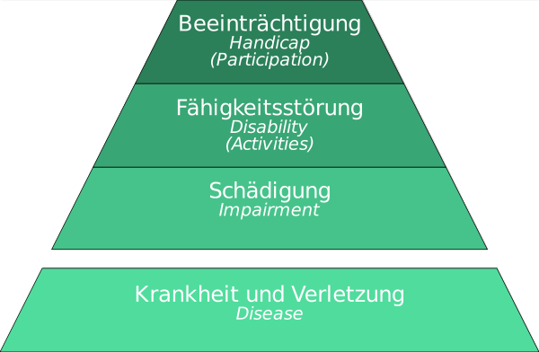

---
list-of-figures:
  label: Abbildung
  title: Abbildungsverzeichnis
list-of-tables:
  label: Tabelle
  title: Tabellenverzeichnis
cite:
  title: Quellenverzeichnis
footnotes:
  title: Fußnoten
abbreviations:
  title: Abkürzungsverzeichnis
---

<!-- prettier-ignore -->
*[ICIDH]: International Classification of Impairments, Disabilities and Handicaps
*[ICF]: International Classification of Functioning
*[WHO]: World Health Organization

# Die Ebenen der Behinderung nach WHO

Von der WHO (_World Health Organization_, Weltgesundheitsorganisation) wurde $1980$ zum ersten Mal die „ICIDH“ (_International Classification of Impairments, Disabilities and Handicaps_) herausgegeben.
Während der deutschsprachige Begriff „Behinderung“ als umfassender Oberbegriff aufgefasst werden kann, unterscheidet die ICIDH drei Ebenen bzw. Dimensionen von Behinderung und gibt ihnen unterschiedliche Benennungen.
Auch im Deutschen hat man versucht, verschiedene Begriffe einzuführen, obwohl der Übersetzung sprachlich bedingt die Prägnanz der englischen Begriffe fehlt [@matthesius:1995].

<!-- FIXME: "der Einfachheit halber -->

Die ICIDH wurde tiefgreifend überarbeitet und liegt jetzt als ICF (_International Classification of Functioning_) vor.
Ein wesentlicher Unterschied dieser Neuauflage ist, dass für _Disability_ und _Handicap_ neue Begriffe geprägt wurden.
Damit sollen einerseits umfassendere Begriffe eingeführt werden, andererseits sollte der Blick von der Behinderung zu den (trotz Behinderung) vorhandenen Fähigkeiten gelenkt werden.
Hier wird noch bewusst, der Einfachheit halber, mit den bisherigen Ausdrücken gearbeitet, die neuen Bezeichnungen werden als Kommentar danebengestellt.

Nach der ICF werden Funktionsfähigkeit und Behinderung als dynamische Interaktion zwischen gesundheitlichen
und kontextuellen Faktoren (sowohl persönlichen als auch umweltbedingten) gesehen (<<fig:bio-psycho-social-model>>),
welche die Wechselwirkungen zwischen den Komponenten aufzeigt. Diese Interaktion wird auch als "bio-psycho-soziales Modell" bezeichnet, das einen Kompromiss zwischen medizinischen und sozialen Modellen darstellt, wobei
Behinderung als Oberbegriff für Beeinträchtigungen, Aktivitäts- und Teilhabeeinschränkungen steht.
Aufgrund der Definition von Behinderung in der UN-Konvention über die Rechte von Menschen mit Behinderungen
(CRPD), die besagt, dass Behinderung das Ergebnis der Wechselwirkung zwischen Personen mit Beeinträchtigungen und
einstellungs- und umweltbedingten Barrieren resultiert, ist Behinderung kein Attribut der Person. Daher können Fortschritte bei der Verbesserung der sozialen Teilhabe durch die Beseitigung oder Verringerung der Barrieren, die Menschen mit Behinderungen an ihrer vollen Teilhabe an der Gesellschaft hindern, erzielt werden.

<!-- FIXME - Psycho-soziales Modell in SVG umwandeln?
-->

## Impairment – (gesundheitliche) Schädigung

<!-- FIXME: Footnote -->

Hiermit wird die Ebene der **Störung der biologischen und/oder psychischen Struktur und Funktion** angesprochen.
Unter Schädigung wird ein „beliebiger Verlust oder eine Normabweichung in der psychischen, physiologischen oder anatomischen Struktur oder Funktion“ verstanden[^1].

[^1]: engl.: A loss or abnormity of psychological, physiological, or anatomical structure or function.

## Disability – Fähigkeitsstörung

Hierbei handelt es sich um die Ebene der Störung der Fähigkeiten der betroffenen Person zur Ausführung zweckgerichteter Handlungen.

Fähigkeitsstörung ist „jede Einschränkung oder jeder Verlust der Fähigkeit (als Folge einer Schädigung), Aktivitäten in der Art und Weise oder in dem Umfang auszuführen, die für einen Menschen als normal angesehen wird[^2]“.

Die ICF ersetzt den Begriff _disability_ durch _activities_, also auch durch die Einschränkung von Aktivitäten.

## Handicap – (soziale) Beeinträchtigung

Hierbei geht es um die Ebene der Störung der sozialen Stellung oder Rolle der betroffenen Person und ihrer Fähigkeit zur Teilnahme am gesellschaftlichen Leben.

Die ICIDH definiert soziale Beeinträchtigung als eine sich aus einer Schädigung oder Fähigkeitsstörung ergebende Benachteiligung des betroffenen Menschen, die die Erfüllung einer Rolle einschränkt oder verhindert, die (abhängig von Geschlecht, Lebensalter sowie sozialen und kulturellen Faktoren) für diesen Menschen normal ist[^3]“.

Die ICF verwendet anstelle des Begriffs _handicap_ den Begriff _participation_, also auch den Ausschluss von gesellschaftlicher Teilnahme.

## Zusammenfassung

<!-- FIXME: dot -->

> „Soziale Beeinträchtigung (handicap) ist daher keine einfache Folge eines physischen oder psychischen Schadens und der sich daraus ergebenden Funktionseinschränkung, sondern ist das Ergebnis der Wechselwirkung zwischen dem Wunsch eines Behinderten nach Eingliederung und Anerkennung und den Einstellungen und Verhaltensweisen seiner Umwelt.
> Erst durch Erlebnisse der Abweisung, Distanzierung, Missachtung und sozialer Ausgliederung entsteht für den Behinderten die ganze Erfahrung, behindert zu sein, nämlich auch als eine Erfahrung, in der eigenen Entfaltung und Eingliederung in die Gesellschaft behindert zu werden.“ [@brockhaus:1994]

Zur Verdeutlichung werden die drei oben erwähnten Ebenen hier nochmals grafisch zusammengefasst.
Als darunterliegende Ebene (Ursache für eine Schädigung) kann Krankheit oder Verletzung (_disease_) in das Schema aufgenommen werden (<<fig:ebenen-behinderung>>).

Die Auswirkung von „Behinderung“ hängt also von vielen Faktoren ab.
Die gleiche (gesundheitliche) Schädigung (_impairment_) kann also zu vollkommen unterschiedlichen (sozialen) Beeinträchtigungen (_handicaps_) führen.
Demgemäß formuliert die WHO: „The situation people find themselves in may determine to what degree a disability is handicapping for them“.

An diesem Punkt soll und muss sowohl die Rehabilitationstechnik als auch die Gesellschaft überhaupt ansetzen.
Wenn es mit den uns zur Verfügung stehenden medizinischen Mitteln nicht gelingt, die Schädigung (_impairment_) zu heilen, so kann doch durch gezielte personelle und technische Hilfestellung die Fähigkeitsstörung (_disability_) überwunden und durch Akzeptanz in der Gesellschaft die soziale Beeinträchtigung (_handicap_) beseitigt oder verringert werden.

[^2]: engl.: Any restriction or lack – resulting from an impairment – of the ability to perform an activity in the manner or within the range considered normal for a human being.
[^3]: engl.: A disadvantage for a given individual, resulting from an impairment or a disability, that limits or prevents the fulfilment of role that is normal – depending on age, sex, and social and culture factors – for the individual.

!!!include(general/attribution.md)!!!
