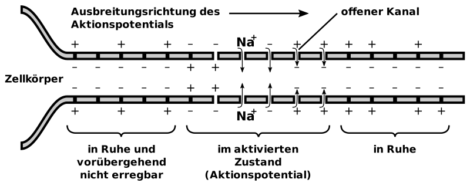
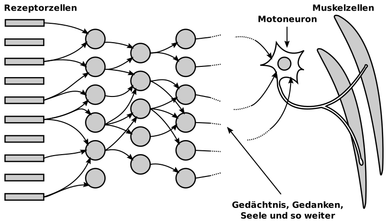

---
list-of-figures:
  label: Abbildung
  title: Abbildungsverzeichnis
list-of-tables:
  label: Tabelle
  title: Tabellenverzeichnis
cite:
  title: Quellenverzeichnis
footnotes:
  title: Fußnoten
abbreviations:
  title: Abkürzungsverzeichnis
---

<!-- prettier-ignore -->
*[z. B.]: zum Beispiel
*[ZNS]: Zentralnervensystem

# Das Nervensystem

## Anatomie der Nervenzelle

Die typische Nervenzelle, das Neuron, besteht aus dem rundlichen Zellkörper, der bis über einen Meter langen fadenförmigen Nervenfaser (Axon) und einer Fülle von sich verästelnden Fortsätzen, den sogenannten Dendriten (maximal wenige Millimeter lang).
Die Nervenzelle kann Informationen über den Zellkörper und die Dendriten empfangen, das Axon ist für die Weiterleitung von Information zu anderen Neuronen verantwortlich (<<fig:aufbau-nervenzelle>>).

Die Stelle, an der Information von einer Nervenzelle auf die andere übergeben wird, heißt Synapse.
Dort nähert sich ein Axon (bzw. die am Ende eines Axons auftretenden Verzweigungen) einem anderen Zellkörper oder den Dendriten einer Nervenzelle bis auf $0.02\;\sf{\mu~m}$.
Über diesen Spalt hinweg erfolgt die Informationsweitergabe durch einen chemischen Prozess (Ausschüttung von Neurotransmittern).

 [@servier-medical-art:2019, @maelicke:1990].")

In der Regel erfolgt die Informationsweitergabe in der Form von kurzen Impulsen.
Je stärker ein Neuron erregt ist, desto höher wird seine Impulsrate.
Man sagt auch, dass das Neuron „feuert“ bzw. es erzeugt Aktionspotentiale.
Die Stärke der Erregung des Neurons drückt sich also nicht in der Höhe des Aktionspotentials (also nicht in der Amplitude), sondern durch die Frequenz aus, mit der die Nervenzelle feuert[^5].
Die Impulsfrequenz einer Nervenzelle im Ruhezustand liegt bei einem Impuls in mehreren Sekunden (sog. spontane Entladung) und kann bei starker Erregung fast bis zu $1\;\sf{kHz}$ betragen.

[^5]: Allerdings gibt es besonders bei den Rezeptor-Zellen der Netzhaut wiederum Ausnahmen von dieser Regel.

## Reizleitung und Aktionspotential

Vereinfacht kann man sich das Axon als einen an den Zellkörper angeschlossenen Schlauch vorstellen, der von einer wässerigen Salzlösung umgeben und ausgefüllt ist.
In dieser Lösung kommen vor allem Chlorid-, Kalium-, Natrium- und Kalzium-Ionen (Cl-, K+, Na+ und Ca++) vor.
Zufolge unterschiedlicher Ionenkonzentrationen innerhalb und außerhalb des Axons kommt es bei der ruhenden Zelle zu einem Potentialunterschied (Ruhepotential) von rund $-70\;\sf{mV}$ (außen positiv).

Die Membran, die die gesamte Nervenzelle, also auch das Axon, umgibt, weist eine äußerst komplexe Struktur mit Millionen von Poren auf.
Das Besondere daran ist, dass es unterschiedliche Poren für den Transport der einzelnen in der wässerigen Lösung vorkommenden Ionen gibt (z. B. solche, die, wenn sie geöffnet werden, nur Na-Ionen durchlassen, während andere wiederum auf K- oder Ca-Ionen spezialisiert sind).
Diese Poren können nun nicht nur geöffnet oder geschlossen werden, sondern auch wie Pumpen funktionieren, die eine bestimmte Art von Ionen von einer Seite der Membran auf die andere transportieren können.

Durch die oben erwähnten Pumpen ist es nun möglich, Ionen einer bestimmten Art von einer Seite der Membran auf die andere zu befördern.
In diesem ersten Schritt kommt es zwar nicht zur Bildung eines Potentialunterschiedes (denn für jedes nach außen transportierte Ion der einen Art, wird ein Ion der anderen Art nach innen befördert), jedoch zu einer Veränderung der Ionenkonzentrationen einer bestimmten Art zu beiden Seiten der Membran.
Werden nun in einem zweiten Schritt Poren, die nur für eine bestimmte Ionenart durchlässig sind, geöffnet, werden Ionen dieser Art gemäß ihres Konzentrationsgefälles auf die andere Seite diffundieren, ohne dass andere Ladungsträger in die Gegenrichtung wandern können.
Damit baut sich eine Potentialdifferenz auf, die der Ionenbewegung entgegenwirkt, bis das System aus Konzentrationsgefälle und Potentialdifferenz bei $-70\;\sf{mV}$ in einen Gleichgewichtszustand eintritt[^6].

[^6]: In mancher Hinsicht erinnert das an die Verhältnisse an einer Halbleiter-Sperrschicht, nur dass hier nicht Elektronen und Löcher als Ladungsträger vorkommen, sondern verschiedene Arten von positiv geladenen Ionen, die sich in einem Konzentrationsgefälle bewegen und deren Bewegungen durch das Öffnen und Schließen selektiv wirkender Poren gesteuert werden können.

Die Verhältnisse bei einer ruhenden Nervenzelle können wie folgt beschrieben werden: Durch die „Pumpen“ wird außerhalb der Zelle die Natrium-Ionen Konzentration und im Inneren die Kalium-Ionen Konzentration erhöht und die Poren für die Kalium-Ionen Diffusion geöffnet.
Das bewirkt daher, dass Kalium-Ionen solange von innen nach außen diffundieren, bis sich außen eine so hohe positive Ladung aufgebaut hat, dass wegen der abstoßenden Kräfte keine weiteren Kalium-Ionen mehr nach außen diffundieren können.

Die Signalübertragung entlang eines Axons durch ein Aktionspotential beginnt damit, dass an einer Stelle des Axons plötzlich die Natrium-Poren geöffnet werden.
Da die Natrium-Ionen Konzentration außen höher ist als innen, wandern zahlreiche Natrium-Ionen in das Innere der Nervenzelle, sodass
sich an dieser Stelle die Potentialverhältnisse umkehren, also die Innenseite positiv gegenüber der Außenseite wird – die Membran „depolarisiert“.
Innerhalb von $10^{-3}\;\sf{s}$ werden durch Schließen der Natrium-Poren und verstärktem Öffnen der Kalium-Poren die ursprünglichen Verhältnisse (außen positiv) wieder hergestellt (<<fig:reizleitung-axon>>).

Ohne jetzt zu sehr ins Detail zu gehen, ist zum Verständnis der Informationsweiterleitung im Axon noch wichtig anzumerken, dass es erstens eine Rückwirkung der Potentialverhältnisse auf das Öffnen und Schließen der verschiedenen Arten von Poren gibt (die Depolarisation bewirkt das Öffnen von Poren, wobei sich allerdings die Natrium-Poren von selbst wieder schließen) und dass sich zweitens die Natrium-Poren nach einer erfolgten Depolarisation nicht sofort wieder öffnen können (Sperrzeit von etwa $1\;\sf{ms}$).
Beide Effekte zusammen bewirken, dass beim Auftreten einer Depolarisation das Aktionspotential (beginnend vom Zellkörper) das Axon in einer vorgegebenen Richtung entlangläuft, und zwar mit einer Geschwindigkeit, die zwischen $0.1$ bis $10\;\sf{m/s}$ liegt.
Schnell leitende Nervenfasern sind zur Herabsetzung der Kapazitäten von einer Myelinscheide umgeben, die in Abständen von ca. $1\;\sf{mm}$ durch die sogenannten Ranvier-Schnürringe unterbrochen ist (siehe auch <<fig:aufbau-nervenzelle>>).
Dabei springt die Depolarisation von Schnürring zu Schnürring und kann sich dadurch schneller ausbreiten.
Die Rate, mit der eine sehr aktive Nervenzelle feuern kann, liegt üblicherweise bei $200\;\sf{Hz}$, die absolut oberste Grenze wird mit $800\;\sf{Hz}$ angegeben.

## Die Synapse

Sobald der Reiz das Ende des Axons erreicht hat, kommt es zur Weiterleitung der Information an andere Nervenzellen.
Auch hier spielen wiederum spezielle Poren eine Rolle, die sich bei der Depolarisation der Membran für Kalzium-Ionen öffnen, die dann in das Innere des Axons eindringen (die Ca++ Konzentration ist außerhalb des Axons größer als in seinem Inneren).

Durch das Einströmen der Kalzium-Ionen werden im Inneren der Axon-Endung chemische Verbindungen (sogenannte Neurotransmitter) freigesetzt, die durch die Membran und auch über den $20\;\sf{nm}$ breiten synaptischen Spalt zur nächsten Nervenzelle (postsynaptische Zelle) diffundieren.
Dort bewirken diese Substanzen das Öffnen von bestimmter Arten von Poren.
Reagiert die postsynaptische Zelle auf den Neurotransmitter mit dem Öffnen von Natrium-Poren, wird eine Depolarisation eingeleitet – die Nervenzelle wird also erregt und wir sprechen dann von einer exzitatorischen (erregende) Synapse.
Umgekehrt kann die postsynaptische Zelle auf die Ausschüttung eines Neurotransmitters auch mit dem Öffnen von Kalium-Poren antworten, was eine Stabilisierung der Zelle bewirkt.
In diesem Fall liegt eine inhibitorische (hemmende) Synapse vor.

Da jede Nervenzelle über ihre Dendriten mit den Axonen Hunderter (bis Tausender) anderer Nervenzellen in synaptischer Verbindung steht, ist ihr eigener Erregungszustand das Ergebnis aus der Summe aller auf sie einwirkenden exzitatorischen und inhibitorischen Reize.
Diese Bündelung oder Summierung der Reize vieler Nervenzellen auf eine einzige nennt man Konvergenz.
Die Verzweigung eines Axons, die es ermöglicht, dass eine Nervenzelle ihre Information auf Hunderte oder Tausende andere nachfolgende Nervenzellen überträgt, nennt man Divergenz.
Diese aus Konvergenz und Divergenz gebildete Vernetzung macht die enorme Fähigkeit des Nervensystems aus.

## Nervenbahnen

1. Die Input-Kanäle: Rezeptoren  
   Unter Input können wir alle jene Signale aus der Umwelt (und dem Körperinneren) zusammenfassen, die eine Wirkung auf spezielle Nervenzellen ausüben, die wir Rezeptoren nennen.
   Im Gegensatz von Nervenzellen, die sich irgendwo im Verlauf einer Nervenbahn befinden und ihre Signale daher über Synapsen von vorgeschalteten Neuronen empfangen, reagieren die Rezeptoren auf äußere Reize.
   Über Rezeptorzellen verfügen zunächst einmal die fünf klassischen Sinne des Menschen:

   - Optische Rezeptoren im Auge für das Sehen
   - Akustische/mechanische Rezeptoren für das Hören
   - Chemische Rezeptoren für Geruchs- und
   - Geschmackssinn
   - Mechanische Rezeptoren für den Tastsinn

   Neben diesen fünf Sinnen erhält unser Nervensystem weiteren Input von:

   - Mechanischen Reizen aus dem Gleichgewichtsorgan.
   - Thermischen Reizen über die Haut.
   - Propriozeption aus Gelenken, Sehnen und Muskeln, wodurch die Stellung der Gliedmaßen und die aufgewendete Kraft wahrgenommen werden.
   - Nozizeption für die Wahrnehmung von Schmerz.

   Alle diese Rezeptorzellen dienen der Umwandlung einer bestimmten Messgröße in elektrische Signale (Aktionspotentiale), die wiederum an den Axon-Endungen zur Ausschüttung von Neurotransmittern und somit zur Erregung nachfolgender Nervenzellen führen.
   Die Stärke des auf die Rezeptorzelle einwirkenden Reizes bestimmt die Rate, mit der diese Zelle „feuert“.

1. Die Output-Kanäle: Motoneuronen  
   Während die physikalischen Größen, für die dem Menschen Sensoren (sprich Rezeptoren) zur Verfügung stehen, recht vielfältig sind (optische, akustische, mechanische, thermische, und chemische Sensoren), ist der Output strenggenommen auf rein mechanische Kanäle beschränkt.

   Man mag an dieser Stelle vielleicht zu Recht einwenden, dass dem Menschen neben seinen Körperbewegungen schließlich auch noch die Stimme (Sprache) als Outputkanal zu Verfügung steht.
   Von der Warte des Nervensystems aus betrachtet handelt es sich aber bei der Stimme letztendlich auch „nur“ um das Zusammenwirken von rein motorischen Größen wie Spannung der Stimmbänder, Artikulation durch die Formung des vokalen Traktes (Mund und Rachen) sowie motorische Beeinflussung der Atemluft.

   Jene Nervenzellen, die am Ende des Output-Kanals für die Stimulation von Muskelfasern sorgen, werden motorische Neuronen oder kurz Motoneuronen genannt.

   Stark vereinfacht lässt sich das gesamte Nervensystem wie folgt darstellen (<<fig:gesamtdarstellung-nervensystem>>):

   

   Im obigen Diagramm (<<fig:gesamtdarstellung-nervensystem>>) befinden sich links die Rezeptorzellen, also jene Gattung von Nervenzellen, über die alle Eindrücke aus der Umwelt empfangen werden.
   Diese sensorischen Neuronen stellen die erste Stufe einer Nervenbahn dar, die über synaptische Kontakte mit den Neuronen der nächstfolgenden Ebene verbunden sind.
   So geht es von Ebene zu Ebene bis in die tieferen Schichten des Gehirns weiter.

   Das obige Diagramm macht außerdem deutlich, dass die Neuronen einer bestimmten Ebene ihre Information sowohl von mehreren vorangehenden Nervenzellen erhalten (Konvergenz) als auch ihrerseits auf viele nachfolgende Nervenzellen weiterleiten (Divergenz).

   Die aus [@hubel:1989] entnommene Zeichnung macht aber auch eine ehrliche Aussage zum Stand des derzeitigen Wissens: Sowohl über die sensorischen Nervenbahnen und deren erste Ebenen auf dem Weg zu den tieferen Schichten des Gehirns als auch über das motorische Nervensystem sind viele Fakten und Funktionen bekannt.
   Dazwischen liegt aber nach wie vor ein großer Bereich, über dessen Funktion noch so gut wie keine Aussagen gemacht werden können.
   {.lower-alpha}

## Die Hirnnerven

Im Bereich des Kopfes zweigen aus dem Zentralnervensystem (ZNS) $12$ Hirnnerven (-paare) ab, die in der medizinischen Literatur üblicherweise mit römischen Ziffern bezeichnet werden.
In <<tab:namen-funktionen-hirnnerven>> sind die Namen und die wichtigsten Versorgungsgebiete bzw. Funktionen der Hirnnerven zusammengefasst.

| Nummer | Name                                                      | Versorgungsgebiet/Funktion                                                                                                                                  |
| ------ | --------------------------------------------------------- | ----------------------------------------------------------------------------------------------------------------------------------------------------------- |
| I      | Riechbahn (Tractus olfactorius)                           | Axone der Riechzellen der Nase, gesamte Geruchsempfindung                                                                                                   |
| II     | Sehnerv (Nervus opticus)                                  | Gesamte visuelle Wahrnehmung                                                                                                                                |
| III    | Nervus oculomotoricus                                     | Augenlinse (Ziliarmuskel), Iris (Pupillenmuskel), Oberlid (Heber des Oberlids), Augenbewegungen                                                             |
| IV     | Nervus trochlearis                                        | Augenbewegung                                                                                                                                               |
| V      | Trigeminus Nerv (Radix sensoria und Radix motorica)       | siehe <<tab:trigeminus-nerv>>                                                                                                                               |
| VI     | Nervus abducens                                           | Augenbewegung (Abduction)                                                                                                                                   |
| VII    | Nervus facialis                                           | u. a. mimische Muskulatur, Mittelohrmuskeln, Unterkiefermuskulatur, Sekretion der Tränen- und Speicheldrüsen, Geschmacksfasern der vorderen $2/3$ der Zunge |
| VIII   | Hör- und Gleichgewichtsnerv (Nervus vestibulo-cochlearis) | Cochlea und Vestibularapparat (Gleichgewichtsorgan)                                                                                                         |
| IX     | Nervus glossopharyngeus                                   | Gaumen- und Rachenmuskulatur, Geschmacksfasern des hinteren $1/3$ der Zunge                                                                                 |
| X      | Nervus vagus                                              | u. a. Kehlkopf, Brust- und Bauchorgane                                                                                                                      |
| XI     | Nervus accessorius                                        | u. a. Kopfbewegungen, Schulterblatt, Heben des Oberarms über Horizontale                                                                                    |
| XII    | Nervus hypoglossus                                        | Zungenmuskulatur                                                                                                                                            |

.namen-funktionen-hirnnerven#Namen und wichtigste Funktionen der Hirnnerven [@pschyrembel:1989].

<!-- prettier-ignore -->
| Nummer | Name                                                                                                       || Versorgungsgebiet/Funktion                    |
| ------ | ------------------------------------------------------------------------------ | -------------------------- | --------------------------------------------- |
| V1     | Radix sensoria & sensorischer Teil des Nervus trigeminus bestehend aus:        | Nervus ophthalmicus        | u. a. Stirn, Oberlid, Nasenrücken             |
| V2     | ^^                                                                             | Nervus maxillaris          | u. a. Unterlid, Wange, Oberlippe              |
| V3     | ^^                                                                             | Nervus mandibularis        | u. a. Zunge, Unterlippe, Kinn                 |
| V4     | Radix motorica (motorischer Teil des Nervus Trigeminus, folgt N. mandibularis)                             || Kaumuskulatur, Gaumen, Mundboden, Ohrtrompete |

.trigeminus-nerv#Trigeminus Nerv [@pschyrembel:1989].

<table>
    <thead>
        <tr>
            <th colspan="2">Nummer</th>
            <th>Name</th>
            <th>Versorgungsgebiet/Funktion</th>
        </tr>
    </thead>
    <tr>
        <td colspan="2">I</td>
        <td>Riechbahn (Tractus olfactorius)</td>
        <td>Axone der Riechzellen der Nase, gesamte Geruchsempfindung</td>
    </tr>
    <tr>
        <td colspan="2">II</td>
        <td>Sehnerv (Nervus opticus)</td>
        <td>Gesamte visuelle Wahrnehmung</td>
    </tr>
    <tr>
        <td colspan="2">III</td>
        <td>Nervus oculomotoricus</td>
        <td>
            <ul class="no-bullets no-padding no-ident">
                <li>Augenlinse (Ziliarmuskel),</li>
                <li>Iris (Pupillenmuskel)</li>
                <li>Oberlid (Heber des Oberlids)</li>
                <li>Augenbewegungen</li>
            </ul>
        </td>
    </tr>
    <tr>
        <td colspan="2">IV</td>
        <td>Nervus trochlearis</td>
        <td>Augenbewegung</td>
    </tr>
    <tr>
        <td rowspan="4">V</td>
        <td></td>
        <td>Trigeminus Nerv (Nervus trigeminus)</td>
        <td></td>
    </tr>
    <tr>
        <td rowspan="2">V1, V2, V3</td>
        <td>Radix sensoria & sensorischer Teil des Nervus trigeminus bestehend aus:</td>
        <td></td>
    </tr>
    <tr>
        <td>
            <ul class="no-bullets no-ident no-padding no-wrap">
                <li>Nervus ophthalmicus (V1)</li>
                <li>Nervus maxillaris (V2)</li>
                <li>Nervus mandibularis (V3)</li>
            </ul>
        </td>
        <td>
            <ul class="no-bullets no-ident no-padding">
                <li>u. a. Stirn, Oberlid, Nasenrücken</li>
                <li>u. a. Unterlid, Wange, Oberlippe</li>
                <li>u. a. Zunge, Unterlippe, Kinn</li>
            </ul>
        </td>
    </tr>
    <tr>
        <td>V4</td>
        <td>Radix motorica (motorischer Teil des Nervus Trigeminus, folgt N. mandibularis)</td>
        <td>Kaumuskulatur, Gaumen, Mundboden, Ohrtrompete</td>
    </tr>
    <tr>
        <td colspan="2">VI</td>
        <td>Nervus abducens</td>
        <td>Augenbewegung (Abduction)</td>
    </tr>
    <tr>
        <td colspan="2">VII</td>
        <td>Nervus facialis</td>
        <td>u. a. mimische Muskulatur, Mittelohrmuskeln, Unterkiefermuskulatur, Sekretion der Tränen- und Speicheldrüsen, Geschmacksfasern der vorderen <MathML formula="2/3"/> der Zunge</td>
    </tr>
    <tr>
        <td colspan="2">VIII</td>
        <td>Hör- und Gleichgewichtsnerv (Nervus vestibulo-cochlearis)</td>
        <td>Cochlea und Vestibularapparat (Gleichgewichtsorgan)</td>
    </tr>
    <tr>
        <td colspan="2">IX</td>
        <td>Nervus glossopharyngeus</td>
        <td>Gaumen- und Rachenmuskulatur, Geschmacksfasern des hinteren <MathML formula="1/3"/> der Zunge</td>
    </tr>
    <tr>
        <td colspan="2">X</td>
        <td>Nervus vagus</td>
        <td>u. a. Kehlkopf, Brust- und Bauchorgane</td>
    </tr>
    <tr>
        <td colspan="2">XI</td>
        <td>Nervus accessorius</td>
        <td>u. a. Kopfbewegungen, Schulterblatt, Heben des Oberarms über Horizontale</td>
    </tr>
    <tr>
        <td colspan="2">XII</td>
        <td>Nervus hypoglossus</td>
        <td>Zungenmuskulatur</td>
    </tr>
</table>

.namen-funktionen-hirnnerven#Namen und wichtigste Funktionen der Hirnnerven [@pschyrembel:1989].

Die Hirnnerven spielen in der Rehabilitationstechnik deshalb eine besondere Rolle, weil sie selbst von hoch liegenden Querschnittlähmungen nicht betroffen sind und die Funktionen, mit denen sie im Zusammenhang stehen, nicht verloren gehen.

!!!include(general/attribution.md)!!!
