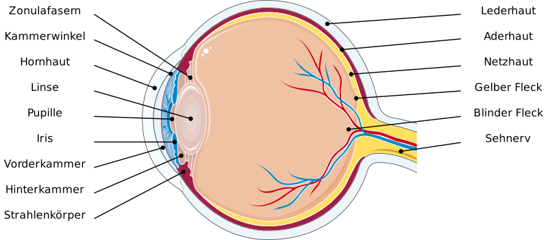
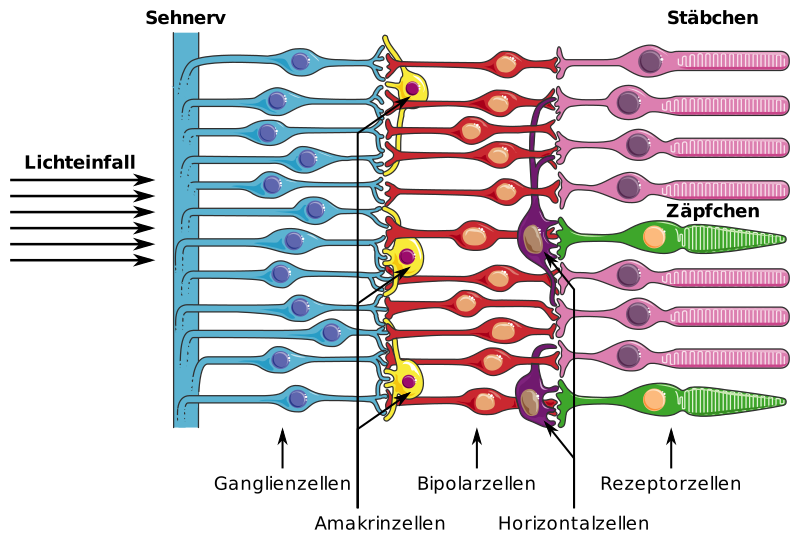
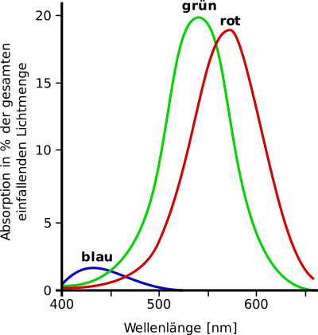
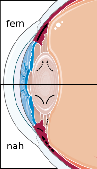
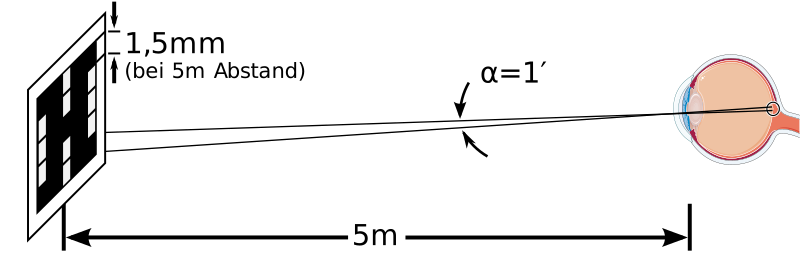

---
list-of-figures:
  label: Abbildung
  title: Abbildungsverzeichnis
list-of-tables:
  label: Tabelle
  title: Tabellenverzeichnis
cite:
  title: Quellenverzeichnis
footnotes:
  title: Fußnoten
abbreviations:
  title: Abkürzungsverzeichnis
---

<!-- prettier-ignore -->
*[ALS]: Amyotrophic lateral sclerosis
*[CP]: Cerebral palsy
*[CVA]: Cerebral vascular accident
*[d. h.]: das heißt
*[d. s.]: das sind
*[engl.]: englisch
*[grie.]: griechisch
*[IHC]: Inner hair cells
*[MCD]: Minimal cerebral dysfunction
*[MCP]: Minimal cerebral palsy
*[MS]: Multiple Sklerose
*[lat.]: lateinisch
*[OHC]: Outer hair cells
*[PC]: Pacini corpuscles
*[PKW]: Personenkraftwagen
*[RA]: rapidly adapting
*[RP]: Retinopathia pigmentosa
*[SA]: slowly adapting
*[SHT]: Schädelhirntrauma
*[SPL]: Sound Pressure Level
*[TBI]: Traumatic brain injury
*[u. a.]: unter anderem
*[z. B.]: zum Beispiel
*[ZNS]: Zentralnervensystem

# Auge und visuelle Wahrnehmung

## Aufbau des Auges

Das Sinnesorgan zur Wahrnehmung optischer Reize ist das Auge.
Der menschliche Augapfel (Bulbus) ist kugelförmig und hat einen Durchmesser von ca. $25\;\sf{mm}$.
Der aus einer durchsichtigen, gallertartigen Substanz bestehende Glaskörper (Corpus vitreum), der den gesamten Innenraum ausfüllt, wird von drei Hautschichten umgeben und in seiner Form gehalten (<<fig:schnitt-menschliches-auge>>).

Die äußerste Augenhaut, die Lederhaut (Sclera), weist nur geringe Elastizität auf und ist für die Formgebung verantwortlich.
Im vorderen Teil des Auges geht die Lederhaut vor der Linse in die durchsichtige Hornhaut (Cornea) über.

Die mittlere Schicht setzt sich aus drei Abschnitten zusammen.
Drei Viertel des Augapfels umschließt die von zahlreichen Gefäßen durchzogene Aderhaut (Choroidea).
Vorne, um die Linse herum, geht die Aderhaut in den Strahlenkörper (Corpus ciliare) über, der den Ziliarmuskel enthält, welcher durch Veränderung der Krümmung der Linse für die Akkommodation (Scharfstellung) sorgt.
Im Strahlenkörper wird auch das Kammerwasser gebildet.
Das Verhältnis aus Produktion und Resorption des Kammerwassers bestimmt den Augeninnendruck.
Noch weiter vorne schließt sich die Regenbogenhaut (Iris) an, die durch Veränderung des Sehlochs (Pupille; lat. Pupilla) die in das Auge einfallende Lichtmenge bestimmt („Irisblende“ in der Fotografie).

Die innerste, auf dem Glaskörper aufliegende Augenhaut ist die Netzhaut (Retina), die wiederum aus mehreren Schichten besteht.

## Die Netzhaut

Die Netzhaut ist sowohl Träger der Fotorezeptoren als auch mehrerer Nervenschichten, die eine erste Verarbeitung der visuellen Reize vornehmen.
Sie ermöglicht die Wahrnehmung von Intensität, Wellenlänge und räumlicher Zuordnung einfallender optischer Reize.

<!-- FIXME: schwarz/weiß (hell/dunkel) -->

Die Erfassung der optischen Reize beginnt in der dem Licht abgewandten Schicht der Netzhaut, die die Fotorezeptoren trägt („inverses“ Auge).
Die ca. $120\;\sf{Mio.}$ Stäbchen (engl. rods) ermöglichen das schwarz/weiß (hell/dunkel) Sehen, während die auf drei unterschiedliche Wellenlängen ausgelegten
$6\;\sf{Mio.}$ Zäpfchen (engl. cones) der Farbwahrnehmung dienen (<<fig:schnitt-netzhaut>>).

Der vom Auge abgedeckte Spektralbereich reicht von $350\;\sf{nm}$ (blau) bis $750\;\sf{nm}$ (rot), mit einer maximalen Gesamt-Empfindlichkeit bei $560\;\sf{nm}$ (grün).
Die Maxima der spektralen Empfindlichkeiten für die drei Typen von Zäpfchen liegen bei $560\;\sf{nm}$ (gelb-grün), $530\;\sf{nm}$ (blau-grün) und $430\;\sf{nm}$ (violett).
Vereinfacht wird oft von „blauen“, „grünen“ und „roten“ Zäpfchen gesprochen.
Von allen in der Netzhaut vorkommenden Zäpfchen sind rund $46\%$ rot, $46\%$ grün, aber nur $8\%$ blau [@bright:1997].
Die Stäbchen erreichen ihr spektrales Maximum bei $510\;\sf{nm}$ und leisten keinen Beitrag zur Farbwahrnehmung (<<fig:spektrales-verhalten-zaepfchen>>).

## Intensitätsbereich und Adaptation

Der Intensitätsbereich, in dem das Auge Reize verarbeiten kann, erstreckt sich über einen Bereich von $1:10^{12}$ (<<tab:empfindlichkeit-staebchen-zaepfchen>>) und wird durch verschiedene Mechanismen der Adaptation bewältigt:

- Verwendung von zwei unterschiedlich empfindlichen Rezeptor-Typen (Stäbchen und Zäpfchen)
- Veränderung der einfallenden Lichtmenge durch die Pupille (Verhältnis $1:16$ – schneller Vorgang[^7])
- Aufbau und Abbau von Sehfarbstoff in den Rezeptoren (langsam)
- Adaptive räumliche und zeitliche Reizintegration in der Netzhaut.

[^7]: Dieser Wert bezieht sich auf das jugendliche Auge; für die Verhältnisse im Alter siehe später.

Die Empfindlichkeit der Stäbchen ist etwa $2\:000$ mal höher als die der Zäpfchen.
Bei geringen Leuchtdichten (Dämmerung) liefern die Zäpfchen daher keinen Beitrag, was zur Folge hat, dass die Farbwahrnehmung nur bei ausreichender Beleuchtung möglich ist.

<table>
  <thead>
    <tr>
      <th scope="row">Beleuchtungsstärke [lx]</th>
      <td style="padding: 2px 6px;"><MathML formula="10^{-5}"/></td>
      <td style="padding: 2px 6px;"><MathML formula="10^{-4}"/></td>
      <td style="padding: 2px 6px;"><MathML formula="10^{-3}"/></td>
      <td style="padding: 2px 6px;"><MathML formula="10^{-2}"/></td>
      <td style="padding: 2px 6px;"><MathML formula="10^{-1}"/></td>
      <td style="padding: 2px 6px;"><MathML formula="10^{0}"/></td>
      <td style="padding: 2px 6px;"><MathML formula="10^{1}"/></td>
      <td style="padding: 2px 6px;"><MathML formula="10^{2}"/></td>
      <td style="padding: 2px 6px;"><MathML formula="10^{3}"/></td>
      <td style="padding: 2px 6px;"><MathML formula="10^{4}"/></td>
      <td style="padding: 2px 6px;"><MathML formula="10^{5}"/></td>
      <td style="padding: 2px 6px;"><MathML formula="10^{6}"/></td>
    </tr>
  </thead>
  <tbody>
    <tr>
      <th scope="row">Stäbchen</th>
      <td></td>
      <td></td>
      <td></td>
      <td></td>
      <td></td>
      <td></td>
      <td></td>
      <td style="background-color: black;"></td>
      <td style="background-color: black;"></td>
      <td style="background-color: black;"></td>
      <td style="background-color: black;"></td>
      <td style="background-color: black;"></td>
    </tr>
    <tr>
      <th scope="row">Zäpfchen</th>
      <td style="background-color: black;"></td>
      <td style="background-color: black;"></td>
      <td style="background-color: black;"></td>
      <td></td>
      <td></td>
      <td></td>
      <td></td>
      <td></td>
      <td></td>
      <td></td>
      <td></td>
      <td></td>
    </tr>
    <tr>
      <th scope="row">Bereich</th>
      <td colspan="3">skotopisch</td>
      <td colspan="4">mesopisch</td>
      <td colspan="5">photopisch</td>
    </tr>
  </tbody>
</table>

.empfindlichkeit-staebchen-zaepfchen#Absolute Empfindlichkeit von Stäbchen und Zäpfchen [@zagler:1997].

Fehlen durch eine Schädigung des Auges die Stäbchen[^8], ist nur Tagessehen (mesopisches und photopisches Sehen) möglich und es kommt zur Nachtblindheit (kein skotopisches Sehen).
Das Auge ist mit einer absoluten Intensitätsschwelle von $8\cdot10^{-18}\;\sf{W/cm^2}$ im Vergleich zum Ohr um den Faktor $10$ empfindlicher.

[^8]: Da im peripheren Bereich der Retina fast ausschließlich Stäbchen vorkommen, führt ein Ausfall dieses Rezeptortyps neben der Nachtblindheit auch zum Verlust des peripheren Gesichtsfeldes, es kommt zum sogenannten Tunnelblick.

## Räumliches Auflösungsvermögen

In einem Bereich von rund $\pm~1\degree$ Grad um jenen Punkt, an dem die optische Achse des Auges die Netzhaut trifft, liegt innerhalb des Gelben Flecks (Makula; lat. Macula) die Sehgrube (Fovea centralis; Fovea: lat. Grube).
In dieser Zone des schärfsten Sehens befinden sich fast nur Zäpfchen mit einer Dichte von $400\:000\sf{/mm^{2}}$ (Zum Vergleich: Ein Standard TV-Bild hat $520\:000$ Bildpunkte).
Hier sind die sonst über den Rezeptoren liegenden Nervenbahnen zum Rand der Makula hin verschoben und bilden den Makulawall, sodass das Licht direkt auf die Zäpfchen fallen kann.
Die Makula weist daher hohe räumliche Auflösung und gutes Farberkennen auf.
Wegen des Fehlens von Stäbchen ist skotopisches Sehen im Bereich der Fovea nicht möglich (die Fovea ist sozusagen „nachtblind“), weil aber die Zäpfchen nicht von andren Zellen bedeckt sind, ist die photopische Empfindlichkeit innerhalb der Fovea größer als an anderen Stellen der Netzhaut.

Eine Strecke von $1\,\sf{mm}$ auf der Netzhaut deckt ein Gesichtsfeld von $3.5\degree$ ab.
Im Bereich der Fovea centralis können Objekte im Abstand von $0.5$ bis $1$ Bogenminuten diskriminiert werden, was einem Abstand auf der Netzhaut von $2.5$ bis $5.0\,\sf{\mu}m$ entspricht.
Außerhalb der Fovea centralis beträgt die Auflösung nur rund $1\degree$ (entsprechend einer Strecke von $0.3\,\sf{mm}$).

## Akkommodation (Scharfstellung)

Die Scharfstellung des Auges (Akkommodation) erfolgt durch die Veränderung der Brechkraft der Linse.
Das fernakkommodierte Auge (Einstellung auf unendlich) hat eine Brechkraft von rund $60$ Dioptrien[^9] ($=17\sf{mm}$ Brennweite).
Bei maximaler Nahakkommodation (Einstellung auf $10\sf{cm}$) erhöht sich die Brechkraft um rund $12$ Dioptrien[^10].
Die genauen Werte für das sogenannte emmetrope (normalsichtige) Auge werden in der Literatur wie folgt angegeben (<<tab:brechkraft-emmetropes-auge>>):

[^9]: Dioptrie = Reziprokwert der (vorderen) Brennweite in Meter; Abkürzung dpt
[^10]: Gilt für das jugendliche Auge und ist stark vom Alter abhängig.

<table>
  <thead>
    <tr>
      <th>Zustand</th>
      <th>Ort</th>
      <th>Brechkraft [dpt]</th>
      <th>Brennweite [mm]</th>
    </tr>
  </thead>
  <tbody>
    <tr>
      <td rowspan="3">Akkommodationsruhe</td>
      <td>Hornhaut und Vorderkammer</td>
      <td><MathML formula="43.05\;\sf{dpt}"/></td>
      <td><MathML formula="23.23\;\sf{mm}"/></td>
    </tr>
    <tr>
      <td>Linse und Glaskörper</td>
      <td><MathML formula="19.11\;\sf{dpt}"/></td>
      <td><MathML formula="52.33\;\sf{mm}"/></td>
    </tr>
    <tr>
      <td>Gesamt (äquivalentes System)</td>
      <td><MathML formula="58.64\;\sf{dpt}"/></td>
      <td><MathML formula="17.05\;\sf{mm}"/></td>
    </tr>
    <tr>
      <td>Max. Akkommodation</td>
      <td>Gesamt (äquivalentes System)</td>
      <td><MathML formula="70.57\;\sf{dpt}"/></td>
      <td><MathML formula="14.15\;\sf{mm}"/></td>
    </tr>
  </tbody>
</table>

.brechkraft-emmetropes-auge#Brechkraft des emmetropen Auges [@methling:1996].

Die gesamte Brechkraft wird also etwa zu $2/3$ von Hornhaut und Vorderkammer und zu $1/3$ von Linse und Glaskörper aufgebracht.
Durch eine Kontraktion des Ziliarmuskels werden die Zonulafasern entspannt.
Die Linse wird zufolge ihrer Elastizität dicker, die Brechkraft wird erhöht und das Auge akkommodiert auf die Nähe (<<fig:augenlinse-und-akkommodation>>).

## Lidschlag

Das Augenlid dient dem Schutz und der Befeuchtung des Augapfels.
Der Lidschlag (Schließen des Oberlids) erfolgt entweder unwillkürlich-periodisch, willkürlich oder reflexartig.
Die Frequenz mit der der unwillkürliche Lidschlag erfolgt ist stark von der Person abhängig.
Als durchschnittlicher Richtwert gelten $15$ bis $16$ Lidschläge/min [@wilson:1996:a].
Die Lidschlagfrequenz nimmt bei lang andauernden Tätigkeiten mit hoher Sehanforderung zu und kann dann Werte bis über $70$ Lidschläge / min erreichen [@methling:1996].

Die Dauer eines Lidschlags (Zeit, in der das Auge verschlossen bleibt) wird in der Literatur für unwillkürliche Lidschläge mit kleiner als $100\sf{ms}$, für willkürliche Lidschläge jedoch mit größer als $250\sf{ms}$ angegeben [@lauruska:1996].

## Vorverarbeitung und Informationsverdichtung in der Retina

Außer den Rezeptorzellen (rechts in <<fig:schnitt-netzhaut>>) befinden sich in der Retina noch vier weitere Schichten von Neuronen, die bereits innerhalb der Netzhaut für eine „Verschaltung“ der Signale sorgen und somit einen wesentlichen Beitrag zur Bildvorverarbeitung leisten.
Die Leistungsfähigkeit dieser Schichten ist schon allein aus der Tatsache ersichtlich, dass $125$ Millionen Rezeptoren (Summe aus rund $120$ Millionen Stäbchen und $6$ Millionen Zäpfchen) lediglich $1$ Million Nervenfasern (Axone der Ganglienzellen) im Sehnerv gegenüberstehen.
Anders ausgedrückt, verzeichnen wir zwischen Rezeptoren und Sehnerv eine Konvergenz von $125:1$, ohne dass jedoch bei diesem Schritt vom Auge aufgenommene Information einfach verloren geht.

## Die rezeptiven Felder

Untersuchungen über die Zusammenhänge zwischen optischen Reizen und der von der Retina entfalteten neuralen Aktivität lieferten bis zur Mitte des $20.$ Jahrhunderts eher verwirrende und unerklärbare Ergebnisse.
Das vollkommener Dunkelheit ausgesetzte Auge zeigte entgegen den Erwartungen eine mäßige neurale Aktivität („spontanes Feuern“), die jedoch bei der Belichtung mit diffusem Licht nicht signifikant zunahm.
<<fig:gleichfoermige-belichtung-rezeptives-feld>> zeigt schematisch den Versuchsaufbau, bei dem ein rezeptives Feld diffus beleuchtet wird.
Die Ableitung des Aktionspotentials erfolgt am Axon der Ganglienzelle (Sehnerv).

 Belichtung eines rezeptiven Feldes [@lindsay:1981].")

Erst $1950$ konnte Stephen Kuffler zeigen, dass die Ganglienzellen der Netzhaut nicht auf eine diffuse Beleuchtung schlechthin, sondern nur auf lokale Beleuchtungskontraste reagieren.
Eine punktförmige Belichtung an oder in der Nähe jener Stelle (= Zentrum des rezeptiven Feldes), von der die Ableitung vorgenommen wurde, führt zu einer deutlichen Erhöhung der Impulsrate (<<fig:selektive-belichtung-rezeptives-feld>> – links).
Die Belichtung einer ringförmigen Zone (= Umfeld des rezeptiven Feldes) um die Ableitungsstelle wirkt inhibitorisch, sodass sogar das spontane Feuern verschwindet (<<fig:selektive-belichtung-rezeptives-feld>> – rechts).

<!-- FIXME: grau? -->

 Zentrum und (b) Umfeld eines rezeptiven Feldes [@lindsay:1981].")

Genauere Untersuchungen zeigten, dass es zwei Typen von Ganglienzellen gibt, die sich nach der Art, wie sie auf Belichtung ihres rezeptiven Feldes antworten, unterscheiden.
In beiden Fällen muss zwischen dem kreisförmigen Zentrum des jeweiligen rezeptiven Feldes und einem antagonistisch wirkenden ringförmigen Umfeld unterschieden werden.
Durch dieses als laterale Hemmung (laterale Inhibition) bezeichnete Prinzip wird eine Steigerung der Bildschärfe erzielt.

## Messung der Sehschärfe

Die Sehleistung des Auges wird durch den Visus angegeben, der ein Maß für die Sehschärfe bzw. genauer gesagt für das Auflösungsvermögen des Auges ist.
Der Visus (V) ist der Reziprokwert des kleinsten Winkels (W~min~ in Bogenminuten), unter dem zwei Punkte noch getrennt wahrgenommen werden können.

$$
\sf{V}=1\sf{/W_{min}}
$$

Unter guten Lichtverhältnissen kann ein normalsichtiges Auge zwei Punkte gerade noch auseinanderhalten, wenn diese unter einem Winkel von $1$ Bogenminute ($1'$) erscheinen.

Der Visus ist dann $V=1/1=1$.

Zur Bestimmung des Visus (Sehschärfeprüfung) eignen sich im Prinzip alle Objekte, bei denen ein signifikantes Detail aus der jeweils angegebenen Entfernung unter dem Winkel von $1'$ erscheint (Optotypen).
Dazu können z. B. Sehprobentafeln mit Buchstaben (Snellen-Tafel, <<fig:snellen-tafel>>) oder Ringen (Landolt-Ringe, <<fig:landolt-ringe>>) verwendet werden.
Die Öffnung der Ringe wird aus der „Soll-Entfernung“ unter $1'$ gesehen.
Die Sehleistung errechnet sich aus dem Quotienten aus Ist-Entfernung durch Soll-Entfernung.
Kann z. B. die Lage des Spaltes eines Landolt-Ringes für eine Soll-Entfernung von $8.5\sf{m}$ erst bei einer Annäherung auf $3.3\sf{m}$ erkannt werden, ist der Visus $3.3/8.5=0.39$.
Der Visus einer normal sehenden Person beträgt $V=1\ldots1.2$.
Zum Lesen einer Zeitung ist ein Visus von mindestens $0.4$ erforderlich.

<!-- FIXME: Maßstab Landoltringe? -->

<!--
 Bild: Hub 89, linker Teil dazugezeichnet
 FIXME: Bildquelle
-->

!!!include(general/attribution.md)!!!
