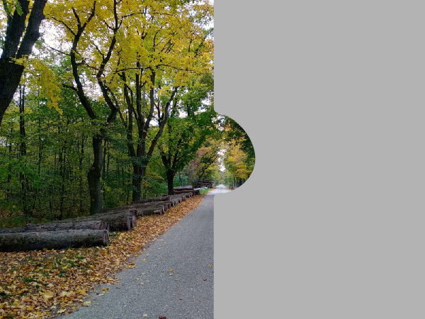

---
list-of-figures:
  label: Abbildung
  title: Abbildungsverzeichnis
list-of-tables:
  label: Tabelle
  title: Tabellenverzeichnis
cite:
  title: Quellenverzeichnis
footnotes:
  title: Fußnoten
abbreviations:
  title: Abkürzungsverzeichnis
---

<!-- prettier-ignore -->
*[engl.]: englisch
*[RP]: Retinopathia pigmentosa
*[z. B.]: zum Beispiel

# Visuelle Behinderungen

## Klassifikation von Sehschädigungen

Sehschädigungen werden üblicherweise gemäß <<tab:klassifikation-sehschaedigung>> klassifiziert.
Diese Wertung gilt bei optimaler optischer Korrektur (Brille, Kontaktlinsen) für das bessere Auge.

| Bezeichnung                | Visus      |
| -------------------------- | ---------- |
| Sehbehinderung             | $\lt~0.3$  |
| Hochgradige Sehbehinderung | $\lt~0.05$ |
| Blind (vor dem Gesetz)     | $\lt~0.02$ |

.klassifikation-sehschaedigung#Klassifikation von Sehschädigungen.

## Ursachen für Sehbehinderungen

<!-- FIXME: Abbildungsverweis?? -->
<!-- FIXME: "des Raumes" entfernt -->
<!-- FIXME: "leidet"?? -->

Nachfolgend werden einige der (in westlichen Ländern) am häufigsten auftretenden Augenerkrankungen und deren Auswirkungen auf das Sehvermögen der betroffenen Person beschrieben.
Zur Illustration wird in der zugehörigen Abbildungen die Ansicht wiedergegeben, wie diese von einer Person wahrgenommen wird, die die betreffende Augenerkrankung hat (siehe [Abbildung: Eindimensionale und mehrschichtige Sichtweise von Behinderung](./chapter1.html#sichtweise-behinderung)).

Es muss darauf hingewiesen werden, dass diese Darstellung sowie alle Simulationen von Sehbehinderungen nur sehr grobe Näherungen des tatsächlichen Sachverhaltes darstellen.
Gesichtsfeldausfälle lassen sich nicht einfach durch schwarze Flächen nachbilden, obwohl das oft in Illustrationen gemacht wird.
Hier wurde bewusst ein neutrales Grau gewählt, das einer nicht vorhandenen Wahrnehmung noch am nächsten kommt.

Selbst wenn es gelingen würde, ein optisch getreues Bild einer Sehschädigung zu zeichnen, bliebe auch diese Darstellung nur an der Oberfläche, da jede Art von Behinderung die betroffene Person nicht nur funktionell einschränkt, sondern auch tief in der Persönlichkeit und im Vorstellungsvermögen prägt.
Wenn jemand beispielsweise glaubt, Blindheit durch Tragen einer Augenbinde zu verstehen, unterliegt einem gewaltigen Irrtum.

## Refraktionsanomalien – Brechungsfehler des Auges

Stimmt die Brechkraft der optischen Elemente des Auges (Hornhaut, Linse, und Glaskörper) nicht mit der Länge des Augapfels überein, kann auf der Netzhaut kein scharfes Bild entstehen.
Durch Brillen und Kontaktlinsen können $90\%$ der Refraktionsanomalien ausgeglichen werden.
Bei den Refraktionsanomalien unterscheiden wir:

1. Kurzsichtigkeit  
   Bei Kurzsichtigkeit (Myopie, myopia) ist die Brechkraft des Auges zu hoch (Brennweite zu kurz) bzw. der Augapfel ist zu lang.
   Die Schärfenebene (insbesondere von entfernten Objekten) liegt vor der Netzhaut.
   Abhilfe schafft eine Brille oder Kontaktlinse mit zerstreuender Wirkung (<<fig:strahlengang-myopie>>).
   Die Auswirkungen von Myopie sind in <<fig:myopie>> dargestellt.

   

   

   

   

2. Weitsichtigkeit  
   Bei Weitsichtigkeit (Hyperopie oder Hypermetropie, engl. hyperopia, hypermetropia) ist die Brechkraft des Auges zu niedrig (Brennweite zu lang) bzw. der Augapfel ist zu kurz.
   Die Schärfenebene (insbesondere von nahen Objekten) liegt hinter der Netzhaut.
   Abhilfe schafft eine Brille oder Kontaktlinse mit sammelnder Wirkung (<<fig:strahlengang-hyperopie>>).

   <!-- FIXME: b>a? b=a -> Brille/Linse korrigiert -->

   

3. Alterssichtigkeit  
   Die sogenannte Alterssichtigkeit (Presbyopie, presbyopia) hat ähnliche Auswirkungen wie die Hyperopie, jedoch liegt hier die Ursache in einer mit zunehmendem Alter verringerte Elastizität der Augen-Linse (siehe auch [Abbildung: Augenlinse und Akkommodation](/de/chapter7.html#augenlinse-und-akkommodation)).
   Dadurch wird die Nahakkommodation eingeschränkt und der Nahpunkt rückt immer mehr in die Ferne.
   Von Presbyopie wird gesprochen, wenn der Akkommodationsbereich (der sog. Akkommodationserfolg) auf Werte unter $4\;\sf{dpt}$ gesunken ist (Werte in der Jugend liegen bei $12\;\sf{dpt}$).

   Abhilfe schaffen Lesebrillen (Brillen mit Sammellinsen, die bei Betrachtung von nahen Gegenständen getragen werden) bzw. Brillen mit Mehrstärken- oder Gleitsichtgläsern.
   Beim Mehrstärkenglas befindet sich im unteren Teil des Brillenglases eine Zone mit höherer Brechkraft.
   Wird der Blick zum Lesen gesenkt, verläuft die Blickachse durch diesen Teil des Brillenglases und die Nahakkommodation wird unterstützt.
   Das Gleitsichtglas arbeitet nach dem selben Prinzip, jedoch erfolgt der Übergang vom oberen, niedriger brechenden Teil zum unteren, höher brechenden Teil stufenlos.
   {.lower-alpha}

## Glaukom – Grüner Star

Der Grüne Star (Glaukom, _glaucoma_) wird durch erhöhten Augeninnendruck, also durch eine Übermenge an Kammerwasser, hervorgerufen.
In den meisten Fällen liegt eine Verlegung der Abflusswege des Kammerwassers vor.
Überproduktion von Kammerwasser hingegen ist selten.
Der normale Augeninnendruck beträgt $13$ bis $28\sf{mbar}$; bei Glaukom steigt er auf Werte zwischen $50$ bis $80\sf{mbar}$.

Durch den erhöhten Augeninnendruck kann es binnen Stunden(!) zu einer Aushöhlung des Sehnervenkopfes (blinder Fleck) kommen, was wegen der Unterbrechung der Blutversorgung zu einem Absterben von Nervenzellen und somit zu irreversiblen Gesichtsfeldausfällen führt (<<fig:glaukom>>).

Bei rechtzeitigem Erkennen des ansteigenden Augeninnendruckes, der sich durch Farbwahrnehmungen und „Nebel“ bemerkbar macht, kann medikamentös entgegengewirkt werden.
In seltenen Fällen ist ein chirurgischer Eingriff erforderlich.
Der Grüne Star ist weltweit die häufigste Erblindungsursache.

## Katarakt – Grauer Star

Verschiedene Gründe wie Verletzungen (_Cataracta traumatica_), Diabetes (_Cataracta diabetica_), Hitzeeinwirkungen (_Cataracta calorica_, bei Gießern und Glasbläsern), Strahlenschäden (_Cataracta e radiatione_), Elektrounfälle, Vergiftungen, Virusinfekte während der Schwangerschaft (_Embryopathia rubeolosa_[^11]) sowie der Alterungsprozess können zu einer Trübung der Augenlinse führen.
Dadurch wird das Sehvermögen durch Trübung des Bildes, aber auch durch Blendwirkung zufolge von Lichtstreuung herabgesetzt, was bis zur Einschränkung auf hell/dunkel Wahrnehmung gehen kann (<<fig:katarakt>>).

[^11]: Rötelninfektion der Mutter vornehmlich im ersten Schwangerschaftsmonat.

Der Graue Star ist durch die operative Entfernung der Linse relativ einfach chirurgisch zu beheben.
Die dadurch verloren gegangene Brechkraft der Linse kann entweder durch eine Starbrille ($+12\;\sf{dpt}$) oder durch Implantation einer Kunststofflinse ersetzt werden.
Mangels ausreichender medizinischer Versorgung ist der Graue Star in Entwicklungsländern eine häufige Erblindungsursache.

## Retinopathia pigmentosa (Retinitis pigmentosa) (RP)

Retinopathia pigmentosa (tapetoretinale Degeneration; meistens fälschlich als Retinitis Pigmentosa bezeichnet, da es sich um keine Entzündung handelt) ist die häufigste degenerative Netzhauterkrankung.
Sie ist meist erblich bedingt, seltener kann sie durch Infektionskrankheiten oder Vergiftungen ausgelöst werden.
Sie entsteht durch eine Stoffwechselstörung eines Enzyms.
Bereits in der Kindheit kommt es zu schlechtem Sehen in der Dämmerung (Nachtblindheit durch Ausfall der für das skotopische Sehen erforderlichen Stäbchen).

Später kommt es auch am Tag zu einem ringförmigen Gesichtsfeldausfall (ringförmiges Skotom), sodass nur mehr ein Gesichtsfeld von $10\degree$ bis $15\degree$ verbleibt.
In späteren Stadien führt Retinopathia pigmentosa zum „Tunnelblick“ (ein bis auf wenige Grad eingeschränktes Gesichtsfeld) und somit zur praktischen Erblindung, obwohl das zentrale Sehvermögen (Sehschärfe) noch recht gut sein kann (<<fig:retinopathia-pigmentosa>>).

 [@frederiksen:1989].")

## Hemianopie (Hemianopsie)

Als Hemianopie (Hemianopsie) wird ein halbseitiger Ausfall des Gesichtsfeldes bezeichnet.
Bei der in <<fig:hemianopie>> gezeigten homonymen Hemianopie ist auf beiden Augen die gleiche Gesichtsfeldhälfte betroffen.
Die Ursache dafür sind Schädigungen (z. B. Tumore, Schädelhirntrauma) der Sehbahn ab der Sehnervenkreuzung (Sehstrang, seitlicher Kniehöcker, Sehstrahlung und visueller Cortex), also in jenen Gebieten, in denen das halbe Gesichtsfeld beider Augen weitergeleitet und verarbeitet wird.
Die Unterbrechung der Hemianopie in der Gesichtsfeldmitte rührt daher, dass in der Sehnervenkreuzung aus der Fovea stammende Nervenfasern sowohl in die eine wie auch in die andere Hemisphäre geleitet werden.
Somit sind an der Verarbeitung des fovealen Bereiches beide Hemisphären beteiligt [@betz:1991].
Bei einer Schädigung im Bereich eines Okzipitallappens können daher trotzdem Reize aus des gesamten Fovea wahrgenommen werden [@wilson:1996:a].

!!!include(general/attribution.md)!!!
