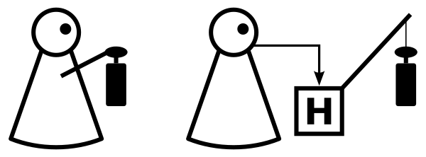

---
list-of-figures:
  label: Abbildung
  title: Abbildungsverzeichnis
list-of-tables:
  label: Tabelle
  title: Tabellenverzeichnis
cite:
  title: Quellenverzeichnis
footnotes:
  title: Fußnoten
abbreviations:
  title: Abkürzungsverzeichnis
---

<!-- prettier-ignore -->
*[AAL]: Ambient Assisted Living (or Active Assisted Living)
*[AsTeRICS]: Assistive Technology Rapid Integration & Construction Set
*[AT]: Assistive Technologien
*[USA]: United States of America
*[z. B.]: zum Beispiel

# Assistive Technologien - Grundlagen

Im _Assistive Technology Act_ von 2004 aus dem öffentlichen Recht der USA [@assistive-technology-act:2004] wird der Begriff „Assistive Technology“ definiert als „Technologie, die für den Einsatz in einem Hilfsgerät oder einer Hilfsdienstleistung vorgesehen ist“:

- Ein Hilfsmittel ist „... jeder Gegenstand, jedes Gerät oder Produktsystem, unabhängig davon, ob es kommerziell erworben, modifiziert oder angepasst wurde, das dazu dient, die funktionalen Fähigkeiten von Menschen mit Behinderungen zu erhöhen, zu erhalten oder zu verbessern“.
- Als Hilfsmitteldienstleistung gilt jede Dienstleistung, die eine Person mit einer Behinderung bei der Auswahl, dem Erwerb oder der Verwendung eines Hilfsmittels direkt unterstützt.

Das bedeutet, dass der Begriff Assistive Technologien (AT) sowohl unterstützende, adaptive und rehabilitative Technologien und Geräte als auch den Prozess der Auswahl, des Auffindens und der Nutzung derselben umfasst.
AT-Produkte helfen also Menschen mit Behinderungen bei der Bewältigung von Aufgaben des täglichen Lebens, der Kommunikation, der Bildung oder der Arbeit.
Sie ermöglichen diesen Menschen einen alternativen Zugang zu modernen elektronischen Geräten wie Computern oder Mobiltelefonen und verhelfen ihnen zu größerer Unabhängigkeit und besserer Lebensqualität.
Sie ermöglichen es den Menschen, Aufgaben auszuführen, die sie früher nicht oder nur unter großen Schwierigkeiten bewältigen konnten, was eine größere Unabhängigkeit bedeutet. [@asterics:deliverable:2.4, @soprano:deliverable:1.1.2]

## Ziele und Zielgruppe

Die Zielgruppen für den Einsatz von Assistiven Technologien sind Menschen mit körperlichen, geistigen oder sozialen Behinderungen.
Ziel der Assistiven Technologien ist es also, diese funktionalen oder sozialen Einschränkungen ganz oder teilweise zu überwinden und/oder Auswirkungen von Krankheiten und Behinderungen zu kompensieren, ohne notwendigerweise die zugrundeliegenden Ursachen selbst zu verändern, und so eine barrierefreie Umgebung zu schaffen.

, kommunale Hilfsmittel zur Überwindung einer Barriere (b) und ein barrierefreies Design zur Beseitigung oder Vermeidung möglicher Barrieren (c).")

1. Ziel der unterstützenden Technologie - Persönlicher Ansatz
   Das erste Ziel ist _die Wiederherstellung oder Verbesserung einer beeinträchtigten Funktion_.
   Dieser Ansatz gilt bei Unfähigkeiten/Fähigkeitsdefiziten.
   Mit einem Hilfsmittel wird die Funktionseinschränkung (Behinderung) kompensiert (Aktivität erzeugt), zum Beispiel durch ein Hörgerät.
   Dieses Konzept ist in <<fig:personal-assistive-tools>> a) dargestellt, wobei das „H“ für das Hilfsmittel steht.
2. Ziel von Assistive Technology - Kommunaler Ansatz
   Bei diesem Ansatz werden die _Auswirkungen der Beeinträchtigung überwunden_, ohne dass die Funktion selbst wiederhergestellt oder verbessert wird.
   Dieser Ansatz bezieht sich auf das Handicap.
   Die Funktionseinschränkung bleibt bestehen, aber die Person ist wieder in der Lage, ihre Rolle in der Gesellschaft zu erfüllen (Herstellung von Teilhabe).
   Dieser Ansatz ist in <<fig:personal-assistive-tools>> b) abgebildet.
3. Ziel von Assistive Technology - Design-Ansatz
   Das dritte Ziel von Assistiver Technologie ist es, Barrieren zu _beseitigen_ oder sie von vornherein zu vermeiden.
   Es bezieht sich auf die Gestaltung der gebauten Umwelt durch die Schaffung barrierefreier Umgebungen, wobei Barrieren im weitesten Sinne zu verstehen sind.
   Dieses Konzept ist in <<fig:personal-assistive-tools>> c) dargestellt.

## Assistive Hilfsmittel: Eine Frage des Designs

Um das bereits erwähnte dritte Ziel von Assistive Technology zu erreichen, werden Barrieren durch das richtige Design beseitigt.
Daher wird dieser Ansatz näher beschrieben und die Prinzipien des Universellen Designs werden vorgestellt.

### Die Lücke verkleinern

<!-- FIXME: Querverweis -->

Wie bereits in Kapitel 1.2 Behinderung als Differenz zwischen persönlichen Fähigkeiten und gesellschaftlichen Anforderungen erwähnt, besagt die Gap-Theorie, dass Behinderung die Differenz zwischen den persönlichen Fähigkeiten und den Anforderungen ist, die von der Gesellschaft oder der Umwelt an diese Person gestellt werden.
Es gibt zwei Richtungen, um die Lücke zwischen Fähigkeiten und Anforderungen zu schließen - erstens, um die persönlichen Fähigkeiten zu erhöhen, oder zweitens, um die Anforderungen eines Produkts oder der Umwelt zu verringern.

 Design [@zagler:2013].")

In den letzten Jahren haben sich einige Designphilosophien entwickelt:

- Barrierefreies Design
- Anpassungsfähiges Design
- Design-für-alle
- Universelles Design

Auch wenn jede Philosophie ihre eigene Definition und ihren eigenen Ansatz hat, so haben sie doch alle ein Ziel: die Lücke zwischen den Anforderungen der Umwelt und den Fähigkeiten einer Person zu verringern, indem die Anforderungen reduziert werden.
Dennoch hat sich der Begriff „Universelles Design“ als der bevorzugte durchgesetzt.

## Prinzipien des Universellen Designs

Vorreiter beim Thema „Universal Design“ ist das „Center for Universal Design“ an der North Carolina State University, wo die sieben Prinzipien des Universal Design entwickelt wurden [@zagler:2013], die da sind

1. Prinzip: Gleichberechtigte Nutzung  
   Das Design ist nützlich und marktfähig für Menschen mit unterschiedlichen Fähigkeiten
2. Prinzip: Flexibilität in der Nutzung  
   Der Entwurf berücksichtigt ein breites Spektrum individueller Vorlieben und Fähigkeiten
3. Prinzip: Einfache und intuitive Nutzung  
   Die Nutzung des Designs ist leicht zu verstehen, unabhängig von der Erfahrung, den Kenntnissen
   Sprachkenntnissen oder dem aktuellen Konzentrationsgrad.
4. Grundsatz: Wahrnehmbare Informationen  
   Das Geschmacksmuster vermittelt dem Nutzer die notwendigen Informationen auf wirksame Weise, unabhängig von den
   Umgebungsbedingungen und den sensorischen Fähigkeiten des Benutzers.
5. Prinzip: Fehlertoleranz  
   Der Entwurf minimiert die Gefahren und nachteiligen Folgen versehentlicher oder unbeabsichtigter Handlungen.
6. Prinzip: Geringe körperliche Anstrengung  
   Das Design kann effizient und bequem und mit einem Minimum an Ermüdung genutzt werden.
7. Prinzip: Größe und Raum für Annäherung und Benutzung  
   Angemessene Größe und Raum für Annäherung, Erreichen, Handhabung und Benutzung unabhängig von der Körpergröße, Haltung oder Mobilität des Benutzers. [@connell:1997]

## Klassifizierung von technischen Hilfsmitteln

### Unterstützende Hilfsmittel

Bei einem augmentativen Hilfsmittel wird ein Reiz oder eine Handlung so verstärkt, dass sie auch für ein Organ mit eingeschränkter Funktionalität oder Fähigkeit wirksam wird.
Diese Verstärkung wird in <<fig:principle-of-augmentative-aids>> als verdickter Pfeil dargestellt.
Beispiele für augmentative Hilfsmittel sind Brillen, Orthesen, Hörhilfen oder Gehhilfen. [@zagler:2013]

 wird durch ein Hilfsmittel („H“, rechtes Bild) verstärkt [@zagler:2013].")

### Ersetzende Hilfsmittel

Substituierende Hilfe bedeutet, dass ein Reiz auf ein anderes Sinnesorgan umgelenkt wird, das normalerweise nicht für diesen Zweck verwendet wird.
Das Gleiche gilt, wenn eine Handlung oder Aktivität von einem anderen motorischen Organ als gewöhnlich ausgeführt wird.
Mit Handlung oder Aktivität ist eine Bewegung oder der Auslöser für eine Bewegung gemeint.
Auf diese Weise kommt es zu einer Substitution, was im Deutschen „Vikariat“ oder im Englischen einfach „substitute“ genannt wird.
Das Prinzip einer Substitution ist in <<fig:Prinzip der Substitutionshilfen>> dargestellt, links, wo eine Person mit Sehbehinderung die Reize (Pfeil) aufgrund ihrer Beeinträchtigung nicht wahrnehmen kann.
Diese optischen Reize können durch ein Hilfsmittel („H“) in einen akustischen Reiz umgewandelt werden, der dann an das Hörorgan der Person weitergeleitet wird (<<fig:principle-of-substituting-aids>>, Mitte).
In ähnlicher Weise können optische Reize in taktile Reize umgewandelt werden, die von der Person wahrgenommen werden können (<<fig:principle-of-substituting-aids>>, rechts).
Zwei sehr verbreitete Beispiele sind zum einen die Brailleschrift, bei der die Person mit den Fingerspitzen „liest“, anstatt mit den Augen zu lesen, und zum anderen das Lippenlesen, bei dem die Augen die Aufgabe des Hörsinns übernehmen. [@zagler:2013]

 wird umgewandelt und auf andere Sinnesorgane umgelenkt, z. B. in akustische Reize umgewandelt und auf den Hörsinn (Mitte) oder in taktile Reize umgewandelt und auf den Tastsinn umgelenkt [@zagler:2013].")

Wenn ein Sinnesorgan die Aufgabe eines anderen Sinnesorgans übernimmt, nennt man dies „sensorische Substitution“.
Diese Substitutionen sind durch die Bandbreiten der menschlichen Sinne begrenzt, die in <<tab:bandwidth-human-organs>> angegeben sind.
Aufgrund dieser Bandbreiten muss man bei der Verwendung eines Substituts mit Einschränkungen rechnen.

| Sinnesorgan               | Bandbreite in bit/s |
| ------------------------- | ------------------- |
| Sehen (Auge)              | 10^6 bit/s          |
| Gehör (Ohr)               | 10^4 bit/s          |
| Taktiles Empfinden (Haut) | 10^2 bit/s          |
| Riechen (Nase)            | < 10^1 bit/s        |
| Schmecken (Zunge)         | < 10^1 bit/s        |

.bandwidth-human-organs#Bandbreiten der menschlichen Sinnesorgane [@zagler:2013].

Wird eine Handlung durch einen Stellvertreter, z. B. ein Gerät oder einen Roboter, ausgeführt, spricht man von „motorischer Substitution“.
Das in <<fig:principle-of-motor-substitution>> dargestellte Beispiel zeigt eine Substitution für die Aktion Heben, die durch ein Gerät ausgeführt wird.
Wenn das Heben durch das Gerät durch Drücken eines Knopfes ausgelöst wird, dann ist das „Drücken des Knopfes“ der Ersatz für die motorische Funktion der oberen Gliedmaßen. Wird das Heben durch das Gerät durch eine Sprachsteuerung ausgelöst, so ist „Sprechen“ der Ersatz für die Motorik der oberen Gliedmaßen. [@zagler:2013]

### Überbrückende Hilfsmittel

Der Zweck der Überbrückungshilfe besteht darin, einen unterbrochenen Teil einer Funktionskette (Sensor oder Aktor) zu ersetzen oder zu überbrücken.
So wird der Reiz nach der Überbrückung an die ursprüngliche Nervenbahn oder das Organ zurückgegeben.
Das Hilfsmittel überbrückt die unterbrochene Funktionskette dadurch, dass Nervenbahnen hinter dem unterbrochenen Teil so stimuliert werden, dass der Reiz dem ursprünglichen Reiz ähnlich ist (<<fig:principle-of-bridging-aids>>).
Beispiele für Überbrückungshilfen sind Cochlea-Implantate oder Retina-Implantate. [@zagler:2013]

 überbrückt den unterbrochenen Sinneskanal so, dass der Reiz (Pfeil) in die ursprüngliche Nervenbahn zurückgeführt wird. [@zagler:2013].")

## Abgrenzung zum Ambient Assisted Living

Ambient Assisted Living (oder Active Assisted Living), kurz AAL, bedeutet die Verlängerung der Zeit, in der Menschen unabhängig in ihrer bevorzugten Umgebung leben können, indem ihre Autonomie, ihr Selbstvertrauen und ihre Mobilität erhöht werden.
Es zielt darauf ab, die Gesundheit und die Funktionsfähigkeit älterer Menschen zu überwachen, zu pflegen und zu erhalten.
Darüber hinaus erhöht es die Sicherheit und soll soziale Isolation verhindern, indem es die Aufrechterhaltung des multifunktionalen Netzwerks um den Einzelnen herum unterstützt.
Darüber hinaus wird das AAL-Konzept so verstanden, dass es Pflegekräfte, Familien und Pflegeorganisationen unterstützt und die Effizienz und Produktivität der in der alternden Gesellschaft eingesetzten Ressourcen erhöht.
Somit befasst sich AAL insbesondere mit den Problemen, die eine alternde Bevölkerung betreffen, und zielt auf die Bedürfnisse des Einzelnen und seiner Betreuer ab, wobei zwei Personengruppen betrachtet werden: ältere Menschen und Menschen mit Behinderungen. [@soprano:deliverable:1.1.2, @active-assistive-living:2015]

Im Gegensatz dazu befähigen assistive Technologien Personen **unabhängig von ihrem Alter**, eine Funktion auszuführen, die aufgrund einer Behinderung nur schwer zu erfüllen ist.
Einige Behinderungen sind mit dem Älterwerden verbunden, aber das Älterwerden selbst ist keine Behinderung.
Daher ist die Beziehung von Ambient Assisted Living Technologien zu Assistive Technologien (AT), dass AT ein Teil von AAL Technologien ist. [@soprano:deliverable:1.1.2]

AAL wird eher als Philosophie denn als Technologie beschrieben, dennoch werden verschiedene Technologien für AAL-Lösungen benötigt.
Einige Beispiele für diese Technologien sind die folgenden

- Software- und Netzwerktechnologien
- Sensoren und Aktoren
- Mensch-Maschine-Schnittstellen
- Embedded Systems (Eingebettete Systeme)
- Smart Homes

Die Produkte und Dienstleistungen dieser Technologien ermöglichen es den Menschen, Aufgaben oder Funktionen auf einem Niveau auszuführen, das mit früheren Erfahrungen vergleichbar ist und zu einem unabhängigen Lebensstil führt. [@soprano:deliverable:1.1.2]
