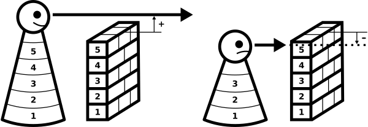

---
list-of-figures:
  label: Figure
  title: List of Figures
list-of-tables:
  label: Table
  title: Tabellenverzeichnis
cite:
  title: List of Tables
footnotes:
  title: Footnotes
abbreviations:
  title: List of Abbreviations
---

# Disability as Difference Between Performance and Requirement

Formally, any disability can be seen as a difference between the performance possible for a person and the demands placed on that person by the environment and society.
If the performance is equal to or greater than the demands made, then the person can fulfill a particular function, task, or social role.
However, if the difference between the performance and the requirement is negative, then the person fails in the task.

If these are tasks that are considered “normally achievable” by the masses, then the person experiences disability.
In <<fig:experience-disability>>, this relationship is shown graphically.
The person shown on the left, with the size of $5$ units (where here body size is to be considered representative of any physical or mental ability of a person), meets the requirements of the environment.
She can look over a wall, which is also $5$ units high, without any problems.

The person shown on the right can only perform to the extent of $3$ units (represented by a body height of $3$ units) and therefore must fail over a “normal height” wall of $5$ units.

The symbol of the wall was deliberately chosen to introduce the generalized concept of “barrier”.
It should be made clear that a barrier is any obstacle (usually in a figurative sense) that leads to the exclusion of a disabled person or, to be more precise, that makes a person with reduced capacity a disabled person in the first place.

!!!include(general/attribution.en.md)!!!
