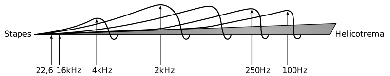
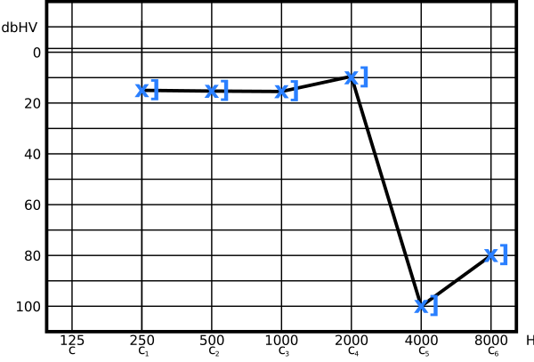
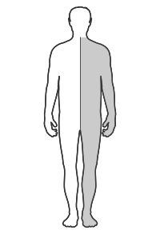

---
list-of-figures:
  label: Figure
  title: List of Figures
list-of-tables:
  label: Table
  title: List of Tables
cite:
  title: List of Sources
footnotes:
  title: Footnotes
abbreviations:
  title: List of Abbreviations
---

<!-- prettier-ignore -->
*[ALS]: Amyotrophic lateral sclerosis
*[CNS]: Central Nervous System
*[CP]: Cerebral palsy
*[CVA]: Cerebral vascular accident
*[IHC]: Inner hair cells
*[MCD]: Minimal cerebral dysfunction
*[MCP]: Minimal cerebral palsy
*[MS]: Multiple Sklerose
*[OHC]: Outer hair cells
*[PC]: Pacini corpuscles
*[RA]: rapidly adapting
*[RP]: Retinopathia pigmentosa
*[SA]: slowly adapting
*[SPL]: Sound Pressure Level
*[TBI]: Traumatic brain injury

# Medical Basics – Part I

<!-- FIXME: citation numbering (markdown-it core chain) -->

In the description of [goals and tasks of rehabilitation technology](chapter4.html#goals-of-rehabilitation-technology), it was made clear that the main difference between medical technology and rehabilitation technology is that technical aids do not (cannot) aim at healing and rehabilitation technology therefore does not start with the disease or damage but only with the ability disorder and the (social) impairment (<<fig:medical-technology-rehabilitation-technology>>, [@zagler:2008]).

 impairment [@zagler:2008].")

<!-- FIXME: footnote numbering/template -->

However, the <<fig:medical-technology-rehabilitation-technology>> diagram also shows that every disability has a “medical history” in some way.
Thus, it is important for the technician to also be able to read and understand the medical history when selecting technical measures.
Therefore, this chapter discusses the basic medical (anatomical and physiological) principles most important to understanding rehabilitation technology, especially those related to the nervous system, sensory organs, and musculoskeletal system[^4].
In addition, the appendix contains a glossary of basic medical terms and the terms used to describe damage that leads to ability disorders and impairments.

[^4]: Some parts of this chapter were taken with minor changes from the diploma thesis of Angela Zagler: “Menschliche visuelle Wahrnehmung und ihre maschinelle Substitution für sehbehinderte Menschen” [@zagler:1997].

## The Nervous System

### Nerve Cell Anatomy

The typical nerve cell, the neuron, consists of the roundish cell body, the filamentous nerve fiber (axon), which can be up to more than a meter long, and an abundance of branching projections called dendrites (a few millimeters long at most).
The nerve cell can receive information via the cell body and the dendrites, and the axon is responsible for transmitting information to other neurons (<<fig:structure-nerve-cell>>).

The point where information is transferred from one nerve cell to another is called a synapse.
There, an axon (or the branches occurring at the end of an axon) approaches another cell body or the dendrites of a nerve cell to within $0.02\;\sf{\mu~m}$.
Across this gap, information is transmitted by a chemical process (release of neurotransmitters).

 [@servier-medical-art:2019, @maelicke:1990].")

As a rule, information is passed on in the form of short impulses.
The more a neuron is excited, the higher its pulse rate.
It is also said that the neuron “fires” or it generates action potentials.
Thus, the strength of the neuron's excitation is expressed not by the magnitude of the action potential (i.e., not by its amplitude), but by the frequency at which the neuron fires[^5].
The pulse frequency of a nerve cell in the resting state is one pulse in several seconds (so-called spontaneous discharge) and can be almost up to $1\;\sf{kHz}$ during strong excitation.

[^5]: However, there are exceptions to this rule, especially for the receptor cells of the retina.

### Conduction and Action Potential

Simplified, the axon can be thought of as a tube connected to the cell body, surrounded and filled by an aqueous salt solution.
In this solution, mainly chloride, potassium, sodium and calcium ions (Cl-, K+, Na+ and Ca++) are present.
As a result of different ion concentrations inside and outside the axon, a potential difference (resting potential) of about $70\;\sf{mV}$ (outside positive) occurs in the resting cell.

The membrane that surrounds the entire nerve cell, including the axon, has an extremely complex structure with millions of pores.
What is special about it is that there are different pores for the transport of the individual ions present in the aqueous solution (e.g., those that, when opened, allow only Na ions to pass through, while others are specialized for K or Ca ions).
These pores can now not only be opened or closed, but also function like pumps that can transport a particular type of ion from one side of the membrane to the other.

Through the above-mentioned pumps, it is now possible to transport ions of a certain type from one side of the membrane to the other.
Although this first step does not result in the formation of a potential difference (because for every ion of one type transported to the outside, an ion of the other type is transported to the inside), it does result in a change in the ion concentrations of a certain type on both sides of the membrane.
If, in a second step, pores that are permeable only to a certain type of ion are opened, ions of this type will diffuse to the other side according to their concentration gradient, without other charge carriers being able to migrate in the opposite direction.
Thus, a potential difference builds up which opposes the ionic motion until the system of concentration gradient and potential difference enters an equilibrium state at $70\;\sf{mV}$[^6].

[^6]: In some respects, this is reminiscent of the conditions at a semiconductor junction, except that here the charge carriers are not electrons and holes, but various types of positively charged ions moving in a concentration gradient whose motions can be controlled by the opening and closing of selectively acting pores.

The conditions in a resting nerve cell can be described as follows: “pumping” increases the sodium-ion concentration outside the cell and the potassium-ion concentration inside, opening the pores for potassium-ion diffusion.
This therefore causes potassium ions to diffuse from the inside to the outside until such a high positive charge has built up on the outside that no further potassium ions can diffuse to the outside because of the repulsive forces.

Signal transmission along an axon by an action potential starts with the sudden opening of the sodium pores at one point of the axon.
Since the sodium ion concentration is higher on the outside than on the inside, numerous sodium ions migrate to the inside of the nerve cell, so that
at this point the potential ratios are reversed, i.e. the inside becomes positive compared to the outside – the membrane “depolarizes”.
Within $10^{-3}\;\sf{s}$, the original ratios (outside positive) are restored by closing the sodium pores and increasing the opening of the potassium pores (<<fig:conduction-axon>>).

Without going into too much detail now, it is still important to note for the understanding of information transmission in the axon that, firstly, there is a feedback effect of the potential conditions on the opening and closing of the different types of pores (depolarization causes the opening of pores, although the sodium pores close again by themselves) and that, secondly, the sodium pores cannot open again immediately after a depolarization has occurred (blocking time of about $1\;\sf{ms}$).
Both effects together cause that when a depolarization occurs, the action potential (starting from the cell body) travels along the axon in a given direction, at a speed ranging from $0.1$ to $10\;\sf{m/s}$.
Fast-conducting nerve fibers are surrounded by a myelin sheath to reduce capacitance, which is interrupted at intervals of about $1\;\sf{mm}$ by the so-called Ranvier lacing rings (see also <<fig:structure-nerve-cell>>).
In this process, depolarization jumps from lacing ring to lacing ring, allowing it to propagate more rapidly.
The rate at which a very active neuron can fire is usually $200\;\sf{Hz}$, with the absolute upper limit given as $800\;\sf{Hz}$.

### The Synapse

As soon as the stimulus reaches the end of the axon, the information is transmitted to other nerve cells.
Here again, special pores play a role, which open to calcium ions when the membrane is depolarized, and these then enter the interior of the axon (the Ca++ concentration is greater outside the axon than inside it).

The influx of calcium ions releases chemical compounds (called neurotransmitters) inside the axon terminal, which diffuse through the membrane and also across the $20\;\sf{nm}$-wide synaptic cleft to the next neuron (postsynaptic cell).
There, these substances cause the opening of certain types of pores.
If the postsynaptic cell responds to the neurotransmitter by opening sodium pores, depolarization is initiated – the nerve cell is thus excited and we then speak of an excitatory (energizing) synapse.
Conversely, the postsynaptic cell may also respond to the release of a neurotransmitter by opening potassium pores, which causes the cell to stabilize.
In this case, an inhibitory (inhibitory) synapse is present.

Since each neuron is in synaptic connection with the axons of hundreds (to thousands) of other neurons via its dendrites, its own state of excitation is the result of the sum of all the excitatory and inhibitory stimuli acting on it.
This bundling or summation of the stimuli of many nerve cells onto a single one is called convergence.
The branching of an axon that allows one neuron to transmit its information to hundreds or thousands of other subsequent neurons is called divergence.
This interconnectedness formed from convergence and divergence accounts for the enormous capacity of the nervous system.

### Neural Pathways

1. Input channels: Receptors
   Under input we can summarize all those signals from the environment (and from inside the body) that exert an effect on special neurons, which we call receptors.
   In contrast to nerve cells, which are located somewhere in the course of a nerve pathway and therefore receive their signals via synapses from upstream neurons, receptors react to external stimuli.
   First of all, the five classical human senses have receptor cells:

   - Optical receptors in the eye for vision
   - Acoustic/mechanical receptors for hearing
   - Chemical receptors for smell and
   - sense of taste
   - Mechanical receptors for the sense of touch

   In addition to these five senses, our nervous system receives further input from:

   - Mechanical stimuli from the organ of balance.
   - Thermal stimuli from the skin.
   - Proprioception from joints, tendons and muscles, which allows us to perceive the position of the limbs and the force applied.
   - Nociception for the perception of pain.

   All of these receptor cells serve to convert a specific “measurand” into electrical signals (action potentials), which in turn lead to the release of neurotransmitters at the axon terminals and thus to the excitation of subsequent nerve cells.
   The strength of the stimulus acting on the receptor cell determines the rate at which this cell “fires”.

1. the output channels: Motoneurons  
   While the physical quantities for which sensors (i.e. receptors) are available to humans are quite diverse (optical, acoustic, mechanical, thermal, and chemical sensors), the output is strictly speaking limited to purely mechanical channels.

   At this point, one might rightly object that, in addition to body movements, the human voice (speech) is also available as an output channel.
   From the point of view of the nervous system, however, the voice is ultimately also “only” the interaction of purely motor variables such as tension of the vocal cords, articulation through the shaping of the vocal tract (mouth and pharynx), and motor influence of the respiratory air.

   Those neurons that provide stimulation of muscle fibers at the end of the output channel are called motor neurons, or motoneurons for short.

   In highly simplified terms, the entire nervous system can be represented as follows (<<fig:overall-representation-nervous-system>>):

   

   In the diagram above (<<fig:overall-representation-nervous-system>>), on the left are the receptor cells, the genus of neurons through which all impressions from the environment are received.
   These sensory neurons represent the first level of a neural pathway, which are connected by synaptic contacts to the neurons of the next level down.
   Thus, it continues from level to level to the deeper layers of the brain.

   The above diagram also makes it clear that the neurons of a given level both receive their information from several preceding neurons (convergence) and in turn transmit it to many succeeding neurons (divergence).

   However, the drawing taken from [@hubel:1989] also makes an honest statement about the state of current knowledge: many facts and functions are known both about the sensory neural pathways and their first levels on the way to the deeper layers of the brain and about the motor nervous system.
   In between, however, there is still a large area about whose function almost no statements can be made.
   {.lower-alpha}

### The Cranial Nerves

In the region of the head, $12$ cranial nerves (pairs) branch off from the central nervous system (CNS) and are usually designated by Roman numerals in the medical literature.
In <<tab:names-functions-cranial-nerves>>, the names and major supply areas or functions of the cranial nerves are summarized.

<table>
    <thead>
        <tr>
            <th colspan="2">Number</th>
            <th>Name</th>
            <th>Supply Area/Function</th>
        </tr>
    </thead>
    <tr>
        <td colspan="2">I</td>
        <td>Smell pathway (tractus olfactorius)</td>
        <td>Axons of the olfactory cells of the nose, total olfactory sensation</td>
    </tr>
    <tr>
        <td colspan="2">II</td>
        <td>Optical nerve (optic nerve)</td>
        <td>Total visual perception</td>
    </tr>
    <tr>
        <td colspan="2">III</td>
        <td>Oculomotor nerve</td>
        <td>
            <ul class="no-bullets no-padding no-ident">
                <li>Lens of the eye (ciliary muscle),</li>
                <li>iris (pupillary muscle)</li>
                <li>Upper eyelid (siphon of the upper eyelid)</li>
                <li>Eye movements</li>
            </ul>
        </td>
    </tr>
    <tr>
        <td colspan="2">IV</td>
        <td>Trochlear nerve</td>
        <td>Eye movement</td>
    </tr>
    <tr>
        <td rowspan="4">V</td>
        <td></td>
        <td>Trigeminal nerve (trigeminal nerve)</td>
        <td></td>
    </tr>
    <tr>
        <td rowspan="2">V1, V2, V3</td>
        <td>Radix sensoria & sensory part of trigeminal nerve consisting of:</td>
        <td></td>
    </tr>
    <tr>
        <td>
            <ul class="no-bullets no-ident no-padding no-wrap">
                <li>Ophthalmic nerve (V1)</li>
                <li>Maxillary nerve (V2)</li>
                <li>Mandibular nerve (V3)</li>
            </ul>
        </td>
        <td>
            <ul class="no-bullets no-ident no-padding">
                <li>among other things, forehead, upper eyelid, nasal bridge</li>
                <li>among other things, lower eyelid, cheek, upper lip</li>
                <li>among other things, tongue, lower lip, chin</li>
            </ul>
        </td>
    </tr>
    <tr>
        <td>V4</td>
        <td>Radix motorica (motor part of the trigeminal nerve, follows N. mandibularis)</td>
        <td>Masticatory muscles, palate, floor of the mouth, eustachian tube</td>
    </tr>
    <tr>
        <td colspan="2">VI</td>
        <td>Abducens nerve</td>
        <td>Eye movement (abduction)</td>
    </tr>
    <tr>
        <td colspan="2">VII</td>
        <td>Facial nerve</td>
        <td>including mimic muscles, middle ear muscles, mandibular muscles, secretion of lacrimal and salivary glands, taste fibers of the anterior <MathML formula="2/3"/> of the tongue</td>
    </tr>
    <tr>
        <td colspan="2">VIII</td>
        <td>Hearing and balance nerve (vestibulo-cochlear nerve)</td>
        <td>Cochlea and vestibular apparatus (organ of balance)</td>
    </tr>
    <tr>
        <td colspan="2">IX</td>
        <td>Glossopharyngeal nerve</td>
        <td>Gaumen and pharyngeal muscles, taste fibers of the posterior <MathML formula="1/3"/> of the tongue</td>
    </tr>
    <tr>
        <td colspan="2">X</td>
        <td>vagus nerve</td>
        <td>including larynx, thoracic and abdominal organs</td>
    </tr>
    <tr>
        <td colspan="2">XI</td>
        <td>Accessory nerve</td>
        <td>including head movements, scapula, raising the upper arm above horizontal</td>
    </tr>
    <tr>
        <td colspan="2">XII</td>
        <td>Hypoglossal nerve</td>
        <td>Tongue musculature</td>
    </tr>
</table>

.names-functions-cranial-nerves#Names and main functions of the cranial nerves [@pschyrembel:1989].

The cranial nerves play a special role in rehabilitation technology because they are not affected even by high-lying paraplegia and the functions with which they are associated are not lost.

## Eye and Visual Perception

### Structure of the Eye

The sensory organ for the perception of optical stimuli is the eye.
The human eyeball (bulb) is spherical and has a diameter of approximately $25\;\sf{mm}$.
Made of a transparent, gelatinous substance, the vitreous body (corpus vitreum), which fills the entire interior, is surrounded and held in shape by three layers of skin (<<fig:cutaway-human-eye>>).

The outermost eye skin, the sclera, has little elasticity and is responsible for shaping it.
In the anterior part of the eye, the sclera merges with the transparent cornea in front of the lens.

The middle layer is composed of three sections.
Three quarters of the eyeball is enclosed by the choroid, which is permeated by numerous vessels.
In front, around the lens, the choroid merges into the corpus ciliare, which contains the ciliary muscle, which provides accommodation (focusing) by changing the curvature of the lens.
The aqueous humor is also formed in the corpus ciliare.
The ratio of production and reabsorption of the aqueous humor determines the intraocular pressure.
Even further in front is the iris, which determines the amount of light entering the eye by altering the pupil (“iris diaphragm” in photography).

The innermost eye skin resting on the vitreous body is the retina, which in turn consists of several layers.

### The Retina

The retina is the carrier of photoreceptors as well as several layers of nerves that perform initial processing of visual stimuli.
It enables the perception of intensity, wavelength and spatial allocation of incident optical stimuli.

The detection of optical stimuli begins in the layer of the retina facing away from the light, which carries the photoreceptors (“inverse” eye).
The approximately $120\;\sf{million}$ rods enable black and white (light/dark) vision, while the three-wavelength
$6\;\sf{million.}$ cones serve the color perception (<<fig:cutaway-retina>>).

The spectral range covered by the eye extends from $350\;\sf{nm}$ (blue) to $750\;\sf{nm}$ (red), with a maximum overall sensitivity at $560\;\sf{nm}$ (green).
The maxima of spectral sensitivities for the three types of cones are $560\;\sf{nm}$ (yellow-green), $530\;\sf{nm}$ (blue-green), and $430\;\sf{nm}$ (violet).
Simplified, we often speak of “blue,” “green,” and “red” cones.
Of all the cones found in the retina, about $46\%$ are red, $46\%$ are green, but only $8\%$ are blue [@bright:1997].
The cones reach their spectral maximum at $510\;\sf{nm}$ and make no contribution to color perception (<<fig:spectral-behavior-cones>>).

### Intensity Range and Adaptation

The range of intensity over which the eye can process stimuli spans a range of $1:10^{12}$ (<<tab:sensitivity-rod-cone>>) and is managed by different mechanisms of adaptation:

- Use of two differently sensitive receptor types (rods and cones).
- Change of the amount of incident light through the pupil (ratio $1:16$ – fast process[^7])
- Buildup and breakdown of visual pigment in the receptors (slow).
- Adaptive spatial and temporal stimulus integration in the retina.

[^7]: this value refers to the juvenile eye; for conditions in old age, see later.

The sensitivity of rods is about $2\:000$ times higher than that of cones.
At low luminances (twilight), therefore, the cones make no contribution, with the result that color perception is possible only with sufficient illumination.

<table>
  <thead>
    <tr>
      <th scope="row">Illuminance [lx]</th>
      <td style="padding: 2px 6px;"><MathML formula="10^{-5}"/></td>
      <td style="padding: 2px 6px;"><MathML formula="10^{-4}"/></td>
      <td style="padding: 2px 6px;"><MathML formula="10^{-3}"/></td>
      <td style="padding: 2px 6px;"><MathML formula="10^{-2}"/></td>
      <td style="padding: 2px 6px;"><MathML formula="10^{-1}"/></td>
      <td style="padding: 2px 6px;"><MathML formula="10^{0}"/></td>
      <td style="padding: 2px 6px;"><MathML formula="10^{1}"/></td>
      <td style="padding: 2px 6px;"><MathML formula="10^{2}"/></td>
      <td style="padding: 2px 6px;"><MathML formula="10^{3}"/></td>
      <td style="padding: 2px 6px;"><MathML formula="10^{4}"/></td>
      <td style="padding: 2px 6px;"><MathML formula="10^{5}"/></td>
      <td style="padding: 2px 6px;"><MathML formula="10^{6}"/></td>
    </tr>
  </thead>
  <tbody>
    <tr>
      <th scope="row">Rods</th>
      <td></td>
      <td></td>
      <td></td>
      <td></td>
      <td></td>
      <td></td>
      <td></td>
      <td style="background-color: black;"></td>
      <td style="background-color: black;"></td>
      <td style="background-color: black;"></td>
      <td style="background-color: black;"></td>
      <td style="background-color: black;"></td>
    </tr>
    <tr>
      <th scope="row">Cones</th>
      <td style="background-color: black;"></td>
      <td style="background-color: black;"></td>
      <td style="background-color: black;"></td>
      <td></td>
      <td></td>
      <td></td>
      <td></td>
      <td></td>
      <td></td>
      <td></td>
      <td></td>
      <td></td>
    </tr>
    <tr>
      <th scope="row">Scope</th>
      <td colspan="3">scotopic</td>
      <td colspan="4">mesopic</td>
      <td colspan="5">photopic</td>
    </tr>
  </tbody>
</table>

.sensitivity-rod-cone#Absolute sensitivity of rods and cones [@zagler:1997].

If the rods[^8] are missing due to a damage of the eye, only day vision (mesopic and photopic vision) is possible and night blindness occurs (no scotopic vision).
The eye, with an absolute intensity threshold of $8\cdot10^{-18}\;\sf{W/cm^2}$, is more sensitive by a factor of $10$ compared to the ear.

[^8]: Since the peripheral area of the retina is almost exclusively occupied by rods, a failure of this receptor type leads not only to night blindness but also to a loss of the peripheral visual field, resulting in so-called tunnel vision.

### Spatial Resolution

In an area of about $\pm~1\degree$ degrees around that point where the optical axis of the eye meets the retina, within the yellow spot (macula; lat. macula) lies the visual pit (fovea centralis; fovea: lat. pit).
In this zone of sharpest vision there are almost only cones with a density of $400\:000\sf{/mm^{2}}$ (for comparison: a standard TV picture has $520\:000$ pixels).
Here, the nerve tracts that otherwise overlie the receptors are shifted toward the edge of the macula, forming the macular wall, allowing light to fall directly on the cones.
The macula therefore exhibits high spatial resolution and good color recognition.
Because of the absence of rods, scotopic vision is not possible in the foveal region (the fovea is “night blind” so to speak), but because the cones are not covered by other cells, photopic sensitivity is greater within the fovea than elsewhere in the retina.

A distance of $1\,\sf{mm}$ on the retina covers a visual field of $3.5\degree$.
Within the fovea centralis, objects can be discriminated at a distance of $0.5$ to $1$ arcminutes, corresponding to a distance on the retina of $2.5$ to $5.0\,\sf{\mu}m$.
Outside the fovea centralis, the resolution is only around $1\degree$ (corresponding to a distance of $0.3\,\sf{mm}$).

### Accommodation (Focusing)

The focusing of the eye (accommodation) is done by changing the refractive power of the lens.
The far accommodated eye (setting at infinity) has a refractive power of about $60$ diopters[^9] ($=17\sf{mm}$ focal length).
At maximum near accommodation (setting to $10\sf{cm}$), the refractive power increases by about $12$ diopters[^10].
The exact values for the so-called emmetropic (normally sighted) eye are given in the literature as follows (<<tab:refractive-power-emmetropic-eye>>):

[^9]: diopter = reciprocal of (anterior) focal length in meters; abbreviation dpt.
[^10]: Applies to the juvenile eye and is strongly dependent on age.

<table>
  <thead>
    <tr>
      <th>State</th>
      <th>Location</th>
      <th>Refractive power [dpt]</th>
      <th>Focal length [mm]</th>
    </tr>
  </thead>
  <tbody>
    <tr>
      <td rowspan="3">Accommodative rest</td>
      <td>Cornea and anterior chamber</td>
      <td><MathML formula="43.05\;\sf{dpt}"/></td>
      <td><MathML formula="23.23\;\sf{mm}"/></td>
    </tr>
    <tr>
      <td>Lens and vitreous body</td>
      <td><MathML formula="19.11\;\sf{dpt}"/></td>
      <td><MathML formula="52.33\;\sf{mm}"/></td>
    </tr>
    <tr>
      <td>Total (equivalent system)</td>
      <td><MathML formula="58.64\;\sf{dpt}"/></td>
      <td><MathML formula="17.05\;\sf{mm}"/></td>
    </tr>
    <tr>
      <td>Max. Accommodation</td>
      <td>Total (equivalent system)</td>
      <td><MathML formula="70.57\;\sf{dpt}"/></td>
      <td><MathML formula="14.15\;\sf{mm}"/></td>
    </tr>
  </tbody>
</table>

.refractive-power-emmetropic-eye#Refractive power of the emmetropic eye [@methling:1996].

Thus, approximately $2/3$ of the total refractive power is applied by the cornea and anterior chamber and $1/3$ by the lens and vitreous body.
Contraction of the ciliary muscle relaxes the zonular fibers.
The lens becomes thicker due to its elasticity, the refractive power is increased, and the eye accommodates to near (<<fig:eye-lens-and-accommodation>>).

### Blink

The eyelid serves to protect and moisten the eyeball.
The blink (shooting of the upper eyelid) is either involuntary-periodic, voluntary or reflexive.
The frequency with which the involuntary blink occurs is highly dependent on the individual.
An average guideline is $15$ to $16$ blinks/min [@wilson:1996:a].
The eyelid blink frequency increases during long-lasting activities with high visual demand and can then reach values up to more than $70$ eyelid blinks/min [@methling:1996].

The duration of a blink (time during which the eye remains closed) is reported in the literature to be less than $100\sf{ms}$ for involuntary blinks, but greater than $250\sf{ms}$ for voluntary blinks [@lauruska:1996].

### Preprocessing and Information Aggregation in the Retina

In addition to the receptor cells (on the right in <<fig:cutaway-retina>>), there are four other layers of neurons in the retina that already provide “wiring” of signals within the retina and thus make a significant contribution to image preprocessing.
The efficiency of these layers is evident from the fact alone that $125$ million receptors (sum of about $120$ million rods and $6$ million cones) face only $1$ million nerve fibers (ganglion cell axons, see below) in the optic nerve.
In other words, we register a convergence of $125:1$ between receptors and optic nerve, without, however, information recorded by the eye being simply lost at this step.

### The Receptive Fields

Studies of the relationships between optical stimuli and neural activity deployed by the retina yielded rather puzzling and inexplicable results until the middle of the $20.$ century.
The eye exposed to complete darkness showed moderate neural activity (“spontaneous firing”), contrary to expectations, but this did not increase significantly when exposed to diffuse light.
<<fig:equal-exposure-receptive-field>> schematically shows the experimental setup in which a receptive field is diffusely illuminated
The action potential is derived at the ganglion cell (optic nerve) axon.

 exposure of a receptive field [@lindsay:1981].")

It was not until $1950$ that Stephen Kuffler was able to show that retinal ganglion cells do not respond to diffuse illumination per se, but only to local illumination contrasts.
A punctate exposure at or near that location (= center of the receptive field) from which the derivation was made leads to a marked increase in the impulse rate (<<fig:selective-exposure-receptive-field>> – left).
Exposure of a ring-shaped zone (= environment of the receptive field) around the derivation site has an inhibitory effect, so that even spontaneous firing disappears (<<fig:selective-exposure-receptive-field>> – right).

 center and (b) surroundings of a receptive field [@lindsay:1981].")

More detailed investigations showed that there are two types of ganglion cells which differ according to the way they respond to exposure of their receptive field.
In both cases, a distinction must be made between the circular center of the respective receptive field and an antagonistic ring-shaped environment.
Through this principle, known as lateral inhibition, an increase in image sharpness is achieved.

### Measurement of Visual Acuity

The visual performance of the eye is indicated by the visual acuity, which is a measure of the visual acuity or, more precisely, the resolving power of the eye.
Visual acuity (V) is the reciprocal of the smallest angle (W~min~ in minutes of arc) below which two points can still be perceived separately.

$$
\sf{V}=1\sf{/W_{min}}
$$

Under good lighting conditions, a normally sighted eye can just keep two points apart when they appear at an angle of $1$ arcminute ($1'$).

The visual acuity is then $V=1/1=1$.

In principle, all objects for which a significant detail appears at the angle of $1'$ from the respective specified distance (optotypes) are suitable for determining visual acuity.
For this purpose, e.g., visual test charts with letters (Snellen chart, <<fig:snellen-chart>>) or rings (Landolt rings, <<fig:landolt-rings>>) can be used.
The aperture of the rings is seen from the “target distance” below $1'$.
The visual power is calculated from the quotient of actual distance by target distance.
For example, if the position of the slit of a Landolt ring for a target distance of $8.5\sf{m}$ can only be detected when approaching $3.3\sf{m}$, the visual acuity is $3.3/8.5=0.39$.
The visual acuity of a person with normal vision is $V=1\sf{m}$.
To read a newspaper, a visual acuity of at least $0.4$ is required.

<!--
 Bild: Hub 89, linker Teil dazugezeichnet
 FIXME: Bildquelle
-->

## Visual Disabilities

### Classification of Visual Impairment

Visual impairment is usually classified according to <<tab:classification-visual-impairment>>.
This rating is valid with optimal optical correction (glasses, contact lenses) for the better eye.

| Designation                      | Visual Acuity |
| -------------------------------- | ------------- |
| Visual Impairment                | $\lt~0.3$     |
| High degree of visual impairment | $\lt~0.05$    |
| Blind (before the law)           | $\lt~0.02$    |

.classification-visual-impairment#classification of visual impairments.

### Causes of Visual Impairments

<!-- FIXME: Abbildungsverweis -->

Some of the most common eye diseases (in Western countries) and their effects on the vision of the affected person are described below.
For illustration purposes, the associated figures reproduce the view perceived by a person suffering from the eye disease in question ([Figure: One-dimensional and multi-layered views of disability](chapter1.html#sichtweise-behinderung)).

It must be pointed out that this illustration as well as all simulations of visual impairments are only very rough approximations of the actual situation.
Visual field defects cannot simply be simulated by black areas, although this is often done in illustrations.
Here, a neutral gray was deliberately chosen, which still comes closest to a non-existent perception.

Even if it were possible to draw a visually faithful picture of a visual impairment, even this representation would only remain on the surface, since any kind of disability not only restricts the affected person functionally, but also deeply shapes his or her personality and imagination.
For example, if someone thinks he or she understands blindness by wearing a blindfold, he or she is subject to a huge error.

### Refractive Anomalies – Refractive Errors of the Eye

If the refractive power of the optical elements of the eye (cornea, lens, and vitreous body) does not match the length of the eyeball, a sharp image cannot be formed on the retina.
Eyeglasses and contact lenses can compensate for $90\%$ of refractive anomalies.
In refractive anomalies we distinguish:

1. Myopia  
   In myopia, the refractive power of the eye is too high (focal length too short) or the eyeball is too long.
   The plane of focus (especially of distant objects) is in front of the retina.
   The remedy is glasses or contact lenses with a dispersing effect (<<fig:ray-tracing-myopia>>).
   The effects of myopia are shown in <<fig:myopia>>.

   

   

2. Farsightedness  
   In farsightedness (hyperopia, hypermetropia) the refractive power of the eye is too low (focal length too long) or the eyeball is too short.
   The plane of focus (especially of close objects) is behind the retina.
   The remedy is a pair of glasses or contact lens with collecting effect (<<fig:ray-trace-hyperopia>>).

   

3. Presbyopia  
   The so-called presbyopia has similar effects as hyperopia, but the cause is a reduced elasticity of the eye lens with increasing age (see also <<fig:eye-lens-and-accommodation>>).
   As a result, near accommodation becomes limited and the near point moves more and more into the distance.
   Presbyopia is said to occur when the range of accommodation (the so-called accommodation success) has decreased to values below $4\;\sf{dpt}$ (values in youth are around $12\;\sf{dpt}$).

   Reading glasses (glasses with converging lenses worn when looking at near objects) or glasses with multifocal or progressive lenses provide a remedy.
   With multifocal lenses, there is a zone of higher refractive power in the lower part of the lens.
   When the gaze is lowered for reading, the visual axis passes through this part of the lens and near accommodation is supported.
   The progressive lens works on the same principle, but the transition from the upper, lower refractive part to the lower, higher refractive part is stepless.
   {.lower-alpha}

### Glaucoma

Glaucoma is caused by increased intraocular pressure, i.e. by an excess of aqueous humor.
In most cases, there is an obstruction of the outflow pathways of the aqueous humor.
Overproduction of aqueous humor, on the other hand, is rare.
Normal intraocular pressure is $13$ to $28\sf{mbar}$; in glaucoma, it increases to values between $50$ to $80\sf{mbar}$.

The increased intraocular pressure can cause a hollowing of the optic nerve head (blind spot) within hours(!), which leads to the death of nerve cells due to the interruption of blood supply and thus to irreversible visual field loss (<<fig:glaucoma>>).

If the rising intraocular pressure, which becomes noticeable through color perception and “fog”, is detected in time, it can be counteracted with medication.
In rare cases, surgical intervention is required.
Glaucoma is the most common cause of blindness worldwide.

### Cataract

Various reasons such as injuries (_cataracta traumatica_), diabetes (_cataracta diabetica_), heat effects (_cataracta calorica_, in founders and glassblowers), radiation damage (_cataracta e radiatione_), electrical accidents, poisoning, viral infections during pregnancy (_embryopathia rubeolosa_[^11]) as well as the aging process can lead to opacification of the eye lens.
As a result, vision is reduced by clouding of the image, but also by glare due to light scattering, which may go as far as restriction to light/dark perception (<<fig:cataract>>).

[^11]: Rubella infection of the mother mainly in the first month of pregnancy.

Cataract is relatively easy to correct surgically by surgical removal of the lens.
The refractive power of the lens lost as a result can be replaced either by cataract glasses ($+12\;\sf{dpt}$) or by implantation of a plastic lens.
In the absence of adequate medical care, cataracts are a common cause of blindness in developing countries.

### Retinopathia pigmentosa (Retinitis pigmentosa) (RP)

Retinopathia pigmentosa (tapetoretinal degeneration; usually incorrectly called retinitis pigmentosa, as it is not an inflammation) is the most common degenerative retinal disease.
It is usually hereditary; less commonly, it can be triggered by infectious diseases or poisoning.
It is caused by a metabolic disorder of an enzyme.
Already in childhood, poor vision in twilight occurs (night blindness due to failure of the rods required for scotopic vision).

Later, a ring-shaped visual field loss (annular scotoma) also occurs during the day, leaving only a visual field of $10\degree$ to $15\degree$.
In later stages, retinopathy pigmentosa leads to “tunnel vision” (a visual field reduced to a few degrees) and thus to practical blindness, although central vision (visual acuity) may still be quite good (<<fig:retinopathia-pigmentosa>>).

 [@frederiksen:1989].")

### Hemianopia (Hemianopsia)

Hemianopia (hemianopsia)is a hemifacial loss of the visual field.
In homonymous hemianopia shown in <<fig:hemianopia>>, the same half of the visual field is affected in both eyes.
This is caused by damage (e.g., tumors, traumatic brain injury) to the visual pathway starting at the optic nerve junction (optic cord, lateral malleolus, optic radiation, and visual cortex), the areas where half the visual field of both eyes is transmitted and processed.
The interruption of hemianopia in the center of the visual field results from the fact that in the optic nerve junction, nerve fibers originating from the fovea are conducted to both the one and the other hemisphere.
Thus, both hemispheres are involved in the processing of the foveal area [@betz:1991].
Therefore, in case of damage in one occipital lobe, stimuli from the entire fovea can still be perceived [@wilson:1996:a].

## Ear and Auditory Perception

### Definitions

The ear is used to perceive sound waves, which are density vibrations of an elastic medium.
For the ear, these are usually pressure fluctuations of the surrounding air.
The physical description of sound is called acoustics, while the anatomical and physiological processes of sound perception are called auditory.

A **tone** is defined as a sinusoidal oscillation with _a certain_ frequency.
The superposition of finitely many tones and their overtones is called **sound**.
A **noise** consists of the superposition of an infinite number of tones.
The minimum sound pressure required to perceive a tone is called the hearing threshold.

### Measured quantities

Sound pressure (_Sound Pressure Level_ = SPL) is measured in pascals ($1\sf{Pa}=1\sf{N/m^2}$).
Because of the large numbers otherwise required in acoustics, it is common to work with the sound pressure level $L$, a logarithmic measure given in decibels that indicates the ratio to the reference sound pressure $p_0$:

$$
L=20\log{\frac{P_{x}}{P_0}\sf{[db]}}
$$

Where $p_0$ is the arbitrary reference sound pressure: $p_0=2\cdot10^{-5}\sf{N/m^2}$.

Thus, $20\;\sf{dB}$ means a tenfold increase of the sound pressure.
A doubling of the sound pressure corresponds to an increase of $6\;\sf{dB}$.
If a person's hearing loss is $80\;\sf{dB}$ (which is the midpoint of that range judged to be profound hearing loss), then $10\:000$ times the sound pressure is required relative to a person with normal hearing.

The measure of the (subjective) loudness of a sound is the phon.
The loudness is numerically equal to the sound pressure level (in dB) for an equally loud perceived $1\:000\;\sf{Hz}$ sound (<<fig:dynamic-range-ear>>).
The isophone is the set of all equally loud perceived tones.

::: figcaption

The curves shown (isophones) indicate equally loud perceived volume in phon; shaded: Main speech range [@betz:1991, @schmidt:1997].
The frequency range given for telephone refers to the bandwidths of analog telephone systems [^12].

:::

[^12]: Analog telephone systems are specified with a bandwidth of about $3.1\;\sf{kHz}$ ($300$ to $3\:400\;\sf{Hz}$). Digital systems (ISDN) can achieve bandwidths of typically $7\;\sf{kHz}$.

Sound impedance is the characteristic impedance (product of density and sound velocity) of a medium [@pschyrembel:1989].

<!-- FIXME: Querverweis -->
<!-- FIXME: Einheiten? -->

For the evaluation of hearing performance or hearing loss in audiometry (see Chapter [Determination of Hearing Ability - Audiometry](#determination-of-hearing-ability-audiometry)), a logarithmic measure (dB) is used whose zero point at the frequency under consideration is the “normal hearing threshold” (audiometric zero point).
Hearing losses are expressed in dB HV or dB HL (suffix HV for hearing loss or HL for _Hearing Loss_ or _Hearing Level_, respectively) and indicate by how many dB the sound pressure must be raised above the normal hearing threshold in order for a hearing-impaired person to perceive a sound at a given frequency.

To evaluate the perception of acoustic signals in the presence of noise, another ratio designated dB SL (suffix SL for Sensation Level) is used.
The reference threshold (i.e. $0\;\sf{dB}$ SL) is placed for a particular listening situation to be evaluated where the subject can hear the sound event (the signal) at $50\%$ of the measurements made from the background noise (hiss).
The sound pressure level, given in dB SL, therefore indicates by how much a signal is above this reference threshold.
In other words, it indicates the signal-to-noise ratio [@hellbrück:1993].

### Ear Anatomy

1. Outer ear  
   The outer ear – from the pinna to the eardrum – represents a funnel about $3$ to $3.5\;\sf{cm}$ long that conducts sound waves from the environment to the eardrum.
   It is important that the air on both sides of the eardrum has the same temperature (body temperature), otherwise the different Brownian molecular motion would already be disturbingly perceptible due to the high sensitivity of the ear.

   The external auditory canal has an amplifying effect and exhibits an amplification of $20\;\sf{dB}$ at the resonant frequency (about $2\:500\;\sf{Hz}$).
   Thus, this gain is in that range that is important for speech understanding (main speech range, see <<fig:dynamic-range-ear>>).
   Because the external auditory canal in infants is only a few millimeters long, the resonance shifts significantly to higher frequencies, which results in infants perceiving high frequencies more preferentially.

2. Middle ear  
   Sound is transmitted in the middle ear (tympanic cavity) – between the tympanic membrane and the oval window – by the three articulating ossicles: Mallet (_Malleus_), Anvil (_Incus_), and Stapes.
   The diameter of the tympanic cavity (from the tympanic membrane to the inner wall) is only about $5\;\sf{mm}$.
   The thickness of the tympanic membrane is $0.1\;\sf{mm}$ (<<fig:cutaway-through-ear>>).

   

   ::: figcaption

   1. External auditory canal;
   2. Earlobe;
   3. Eardrum;
   4. Malleus;
   5. Tympanic cavity;
   6. Anvil;
   7. Stirrup;
   8. Stirrup plate in oval window;
   9. Round window;
   10. Cochlea;
   11. Arcuate ducts of the vestibular apparatus (organ of equilibrium).
       {.lower-alpha}

   :::

   The deflections of the tympanic membrane (at the hearing threshold smaller than $10^{-10}\;\sf{m}$, which is $1\sf{\mathring{A}}$, $0.1\;\sf{nm}$ or about the diameter of a hydrogen atom) are transmitted in complicated (frequency-dependent) movements via the three ossicles to the oval window.
   On the one hand, the movement amplitude is reduced by the leverage effect of the ossicles (approximately by a factor of $0.7$) and the force available at the oval window is increased accordingly.
   On the other hand, the areas of the tympanic membrane and oval window behave approximately as $20:1$, resulting in a significant increase in pressure ($\sf{pressure}=\sf{force/area}$.
   Accurate measurements are exceedingly difficult, but the literature suggests a total pressure gain of a factor of $35$.
   Theoretically, however, taking all factors into account, the value can be much higher.

   This pressure transformation is necessary, because without it the liquid-filled inner ear could be excited only extremely badly by vibrating air.
   Specifically, $98\%$ of the sound energy would be lost by reflection and only $2\%$ would be transmitted to the inner ear.
   Impedance matching by the middle ear achieves that on average $60\%$ of sound energy can be transmitted.

   <!-- FIXME: Querverweis -->

   The ossicles also cause the sound energy to be transmitted not to the entire inner ear, but only to the oval window.
   The round window (the second connection point between the middle ear and the inner ear) can therefore oscillate in antiphase, which is of great importance for the function of the cochlea (see chapter [Physiology of the Ear](#physiology-of-the-ear) point (a)).

   Finally, the middle ear also has a certain regulatory or protective function.
   The tympanic membrane and the stapes are connected with muscles (_musculus tensor tympani_ at the tympanic membrane/hammer and _musculus stapedius_ at the stapes), which contract at a sound pressure level of $60$ – $80\;\sf{dB}$ above the hearing threshold and have a damping effect on the transmission of lower frequencies.

3. Inner ear  
   The inner ear contains two sensory organs that perform completely different functions, but anatomically form a complex: The cochlea (_cochlea_), the hearing organ proper, and the vestibular apparatus, which forms the organ of balance (<<fig:cutaway-through-ear>>).

   The cochlea (_cochlea_) is a spiral duct embedded in the cranial bone, in which the two-part membranous cochlear duct (_scala media_ or _ductus cochlearis_) is vibrationally attached.
   Thus the cochlea consists of three fluid-filled ducts.
   In the center the membranous cochlear duct, filled with endolymph[^13] and having a triangular cross-section, above it the atrial staircase (_scala vestibuli_) and below it the tympanic staircase (scala tympani).
   The latter two passages are filled with perilymph[^13].
   Just before the end of the scroll (_helicotrema_), the membranous scroll passage ends blindly, so that the two staircases merge there (<<fig:cochlea>> and <<fig:cross-cut-through-cochlea>>).

   [^13]: endolymph: high K+, low Na+ concentration; perilymph vice versa.

   , open [@servier-medical-art:2019, @betz:1991].")

   ::: figcaption

   1. Stirrup in the oval window;
   2. Beginning of vestibular duct;
   3. Skin-like spiral cochlear duct;
   4. Round window at the end of the tympanic duct;
      {.lower-alpha}

   :::

   

   ::: figcaption

   

   1. Vestibular duct;
   2. Skin-like cochlear duct;
   3. Ttympanic duct
      {.upper-alpha}

   

   

   1. Reissner's membrane;
   2. Tectorial membrane;
   3. Basilar membrane;
   4. Organ of Corti;
   5. Outer hair cells;
   6. Inner hair cells
      {.lower-alpha}

   

   :::

### Physiology of the Ear

1. Mechanical processes in the cochlea.  
   After impedance conversion by the middle ear, the inner ear receives the sound signal via the vibrations of the stapes footplate in the oval window, which are transmitted to the fluid of the atrial staircase.
   Because this fluid is incompressible, when the oval window moves inward (pressure increases), the membranous duct (also called the cochlear partition) beneath it must move downward.
   This causes a pressure rise in the (underlying) tympanic staircase, which subsequently leads to a deflection of the round window at the end of the tympanic staircase.
   In the subsequent half-wave of the oscillation, the conditions are exactly reversed.

   This up-and-down movement of the cochlear partition results in a shearing motion between its individual components, and the displacement of the covering membrane (_membrana tectoria_; tectorial membrane) results in a bending of the sensory hairs of the hair cells of the organ of Corti (<<fig:cross-cut-through-cochlea>>).

   The hair cells are arranged along the cochlea in two parallel groups.
   The approximately $8\:000$ inner hair cells (IHC = _inner hair cells_) are arranged in _one_ row, and the approximately $14\:000$ outer hair cells (OHC = _outer hair cells_) form three to five rows.
   Each of these hair cells carries $60$ – $100$ sensory hairs (_stereocilia_).
   Despite their much larger number, only $5$ to $10\%$ of the auditory nerve fibers terminate at the OHC (high convergence).
   The much larger number of $30\:000$ to $40\:000$ nerve fibers innervate the IHC.
   Not all auditory nerve fibers are afferent (i.e., run from the hair cells to the CNS).
   About $1\:800$ are efferent and are associated with the active processes in the cochlea described in the next section [@silbernagl:1991, @dudel:1996, @hellbrück:1993, @betz:1991, @zenner:1994:a].
   The local density of neurons is $1\:150$ ganglion cells/mm^2^ at the beginning of the cochlea (at the oval window) and decreases toward the helicotrema [@lindsay:1981].

2. Formation of the traveling wave and cochlear amplifier.  
   So far, the mechanics of the inner ear have been described only in principle.
   More precisely, the vibration of the stapes footplate initially triggers a movement of the cochlear partition only at the beginning of the cochlea, which in the further course of time propagates as a traveling wave along the entire cochlea.
   We speak here of the passive traveling wave.
   It has the special property that it does not propagate along the screw with the same or only decreasing amplitude, but that, depending on its frequency, it increases to a maximum at a certain point of the screw and then decays rather abruptly (<<fig:travelling-wave-cochlear-partition>>).

   

   The place where the traveling wave reaches its maximum depends on the frequency of the excitation and is of decisive (but not sufficient) importance for the frequency selectivity of the ear.
   High frequencies produce the maximum near the base of the snail (at the stapes or at the oval and round window), low frequencies at the tip of the snail (_helicotrema_).
   Frequency mixtures (sounds, noises) produce several maxima along the basilar membrane.
   This approach is the basis of the location theory (tonotopic theory) (<<fig:location-travelling-wave>>).

   

   The formation of a vibration maximum by the passive traveling wave causes a first amplification effect in addition to the frequency selection.
   Originally, the ear was considered to be a purely passive sound sensor.
   Only recently have studies shown that the outer hair cells of the organ of Corti can generate micromechanical vibrations of up to $20\;\sf{kHz}$.
   Frequency- and site-selective excitation of the outer hair cells amplifies and splits the passive traveling wave at a narrowly defined location by a factor of $1\:000$ [@zenner:1994:a] (<<fig:amplification-traveling-wave>>).
   Without this active amplification, excitation of the inner hair cells would occur only from $60\;\sf{dB}\,\sf{SPL}$ [@schmidt:1997].

   

3. Frequency selectivity of the ear  
   The formation of the passive and also the active traveling wave (place theory, tonotopy) is not completely sufficient to explain the enormous frequency selectivity of the ear.
   On the one hand, this assumption is reached from measurements at medium sound pressure levels, at which almost all fibers of the auditory nerve are active and not only those that are characteristic for the respective frequency.
   Nevertheless, the auditory system is frequency selective even in this case.
   On the other hand, with single-channel cochlear implants (the nerve endings in the cochlea are stimulated by an electrode at only one location), it is possible to evoke the sensation of different frequencies.
   If location theory alone were the explanation for frequency perception, then a separate electrode would have to be implanted at the relevant location for each pitch to be transmitted.

   Since a single fiber of the auditory nerve can directly follow a sound vibration only up to a frequency of about $800\;\sf{Hz}$, several nerve fibers must be involved in the coding of higher frequency sounds.
   In the so-called volley principle, several nerve fibers alternate in “firing” in such a way that the sum (superposition) of their individual discharges corresponds to the frequency to be transmitted.
   This leads to the so-called period theory (microphonic theory) of frequency selectivity.
   Individual nerve fibers are combined into groups and synchronized in such a way that the overall pattern of their neural activity is able to follow higher frequencies (<<fig:schematic-display-salvo-principle>>) [@troost:1998].

   

   {.lower-alpha}

### Determination of Hearing Ability - Audiometry

The procedure for determining hearing is called audiometry.
In addition to determining the degree of hearing loss and the frequencies affected, the purpose of audiometry is also to locate the place where the hearing loss occurs and to distinguish between conductive hearing loss (conductive hearing loss) and sensorineural hearing loss (perceptual hearing loss).

The most important procedure for testing hearing is sound threshold audiometry or the sound threshold audiogram, i.e. the measurement of the personal hearing threshold.
In a soundproof room, tones (pure sinusoidal oscillations) of different intensity and frequency are offered through headphones (so-called air conduction).
The person examined must indicate whether a presented tone could be perceived or not.

In addition to the presentation of the tones via headphones, a coupling via structure-borne sound (bone conduction) is also performed in a separate series of experiments by means of a vibrator attached to the skull bone behind the ear.
There is also a fixed “hearing threshold” for bone conduction, from which any hearing losses can be measured in dB HV.

The results of the measurements are plotted on a (standardized) graph, the audiogram.
The symbols shown in <<tab:audiogram-used-symbols>> are usually used:

<table>
  <thead>
    <tr>
      <th></th>
      <th>Left</th>
      <th>Right</th>
    </tr>
  </thead>
  <tbody>
    <tr>
      <th scope="row">Mark color</th>
      <td>blue</td>
      <td>red</td>
    </tr>
    <tr>
      <th scope="row">Air conduction</th>
      <td style="color: blue;">x</td>
      <td style="color: red;">o</td>
    </tr>
    <tr>
      <th scope="row">Bone conduction</th>
      <td style="color: blue;">]</td>
      <td style="color: red;">[</td>
    </tr>
  </tbody>
</table>

.audiogram-used-symbols#Symbols used in the audiogram.

For example, for a person with approximately normal hearing, the result is a tone threshold audiogram for the left ear as shown in <<fig:tone-threshold-audiogram-normal>>.
The curves for air conduction and bone conduction are superimposed or nearly so.
The deviations from the $0\;\sf{dB}\,\sf{HV}$ line in the example are at most $15\;\sf{dB}\,\sf{HV}$.

## Auditory Disabilities

### Hearing Impairment Classification

The ICIDH distinguishes six degrees of hearing impairment (<<tab:categories-hearing-impairment-according-to-icidh>>):

<!-- FIXME: Profound hearing loss (90 vs. 91dB) -->

| Designation According to ICIDH          | Hearing Loss [in dB HV\]   |
| --------------------------------------- | -------------------------- |
| Mild hearing loss                       | $26-40\;\sf{dB}\,\sf{HV}$  |
| Moderate hearing loss                   | $41-55\;\sf{dB}\,\sf{HV}$  |
| Moderate hearing loss                   | $56-70\;\sf{dB}\,\sf{HV}$  |
| Profound hearing loss                   | $71-91\;\sf{dB}\,\sf{HV}$  |
| Hearing loss bordering on deafness[^14] | $\gt~91\;\sf{dB}\,\sf{HV}$ |
| Complete loss of hearing                | $-$                        |

.categories-hearing-impairment-according-to-icidh#Categories of hearing impairment according to ICIDH [@matthesius:1995].

<!-- FIXME: ahd. -->

[^14]:
    The ICIDH uses the term “deafness”, which is frowned upon by those affected.
    It should therefore be avoided at all costs and always replaced with deafness.
    The reason for the negative connotation of the words “deafness” and “deaf” is historical.
    The terms “stupid” or “tumb” (ahd.) and “deaf” or “toub” used to have the same meaning, namely “dull” or also “dull-witted” (Duden) and “befuddled”, “confused” and “stunned” [@bronzino:1995].
    In ancient times, the ear was considered the seat of memory.
    For Paracelsus, large ears were signs not only of good hearing, but also of a good memory and a keen mind [@hellbrück:1993].

The term deaf should be used only for persons whose hearing impairment is so severe that they are incapable of deriving any benefit from amplification.
The usefulness of drawing a valid line of demarcation between hard of hearing and deaf by means of an indication in dB HV seems to be small.
It is much more important to evaluate the functionality of the auditory system in relation to the most socially significant task, the hearing and understanding of spoken language.
With this in mind, practitioners suggest drawing the line where auditory communication fails despite amplifying aids [@dotter:1996].

In classifying hearing impairment, the primary distinction is whether the reduction in auditory performance is due to reduced conduction of sound to the receptors (hair cells) of the inner ear or whether there is damage to the cochlea or downstream neural pathways (auditory pathway).
After this general distinction, some more typical forms of hearing loss will be discussed

1. Conductive hearing loss (general)  
   Conductive hearing loss is caused by a disorder in the external auditory canal (e.g. a plug), in the eardrum or in the middle ear (e.g. stiffening of the ossicles).
   Hearing is diminished, but never completely lost.

   <!-- FIXME: Cross reference -->

   In the sound-threshold audiogram (see [Determination of Hearing Ability - Audiometry](#determination-of-hearing-ability-audiometry) for details), a conductive hearing loss is expressed by a drop in the air-conduction curve (LL curve), while the bone-conduction curve (KL curve) remains unchanged in that range that is the norm for persons with normal hearing (<<fig:sound-threshold-audiogram-sound-conduction>>, for the symbols used see <<tab:audiogram-used-symbols>>).
   This is referred to as the occurrence of a “KL-LL difference” or “air-bone gap”).

   <!-- prettier-ignore -->
   ![Sound threshold audiogram in conductive hearing loss – the air conduction curve (x) is below the bone conduction curve (\]) = “air-bone-gap”.](./pics/06/tonschwellenaudiogramm-schallleitung.svg "sound-threshold-audiogram-sound-conduction#Sound threshold audiogram in conductive hearing loss – the air conduction curve (x) is below the bone conduction curve (]) = “air-bone-gap” [@hellbrück:1993].")

   Closing the ears with the fingers results in an attenuation of approximately $20\;\sf{dB}\,\sf{HV}$, thus simulating a conductive hearing loss that is even lower than a “mild hearing loss” according to ICIDH (see <<tab:categories-hearing-impairment-according-to-icidh>>).

2. Sensorineural hearing loss (general).  
   The causes of sensorineural hearing loss are damage to the inner ear (hearing loss, ototoxicosis, acoustic trauma), the auditory nerve or the central nervous system.
   In the tone threshold audiogram, sensorineural hearing loss is manifested by a joint drop in the air conduction curve and the bone conduction curve (<<fig:tone-threshold-audiogram-sound-sensing>>).

   <!-- prettier-ignore -->
   ![Sound threshold audiogram in sensorineural hearing loss – air conduction curve (x) and bone conduction curve (\]) in congruence](./pics/06/tonschwellenaudiogramm-schallempfindung.svg "tone-threshold-audiogram-sound-sensing#Sound threshold audiogram in sensorineural hearing loss – air conduction curve (x) and bone conduction curve (]) in congruence [@hellbrück:1993].")

   Sensorineural hearing loss primarily affects the high frequencies, which is noticeable in poor perceptibility of the phonemes “s”, “f” and “sh”.
   Thus, not only hearing itself is affected, but especially understanding.
   A (complete) deafness is always caused by a disturbance of the inner ear.

3. Combined conductive and sensorineural hearing loss (general)  
   As a third possible general hearing impairment, the combined conductive and sensorineural hearing loss in the tone threshold audiogram shall be presented.
   Because of the sensorineural hearing loss, the LL and KL curves decrease together.
   The additional conductive hearing loss causes a further drop of the LL curve (<<fig:tone-threshold-audiogram-sound-sensing>>).

   <!-- prettier-ignore -->
   ![Sound threshold audiogram in combined conductive and sensorineural hearing loss – both curves lower, but the air conduction curve (x) is even further below the bone conduction curve (\]).](./pics/06/tonschwellenaudiogramm-schallleitung-schallempfindung.svg "tonschwellenaudiogramm-schallempfindung#Sound threshold audiogram in combined conductive and sensorineural hearing loss – both curves lower, but the air conduction curve (x) is even further below the bone conduction curve (]) [@hellbrück:1993].")

4. Noise-induced hearing loss  
   Any exposure of the auditory system to high sound pressure levels leads to an upward shift of the hearing threshold.
   If the exposure is short or if it does not exceed sound pressure levels of $90\;\sf{dB}\,\sf{SPL}$, adaptation, which occurs in all sensory organs, occurs, but the hearing threshold drops back to the values before the sound exposure after a recovery period.

   Prolonged exposure to sound, especially when it exceeds $90\;\sf{dB}\,\sf{SPL}$, poses a serious threat to the ear.
   Three mechanisms may come into play.
   First, sound exposure (e.g., $15$ minutes at $95\;\sf{dB}\,\sf{SPL}$ or $30$ seconds at $115\;\sf{dB}\,\sf{SPL}$) can mechanically damage hair cells (kinking or fusing of stereocilia).
   Second, hair cells have an increased energy demand during excitation that cannot be met during prolonged stimulation.
   If the cell is not allowed to recover in time, the sensory cell may die (starve).
   Thirdly, noise leads to a stress load of the entire organism, through which the blood circulation and thus the oxygen supply of the ear is reduced and a damaging effect on the inner ear cannot be excluded [@hellbrück:1993].

   Hearing loss triggered by noise exposure particularly affects the frequencies around $4\;\sf{kHz}$.
   Apparently, this region of the cochlea enters a supply bottleneck earliest when exposed to noise.
   Because of the musical note $\sf{c^5}$ (five-dashed C, top key of a piano with $4186\;\sf{Hz}$) located at $4\;\sf{kHz}$, it is also called the $\sf{c^5}$ sink[^15] [@hellbrück:1993].
   An audiogram typical of noise-induced hearing loss is shown in <<fig:tone-threshold-audiogram-noise-induced-hearing-loss>>.

   [^15]:
       Acousticians and musicians use different designations of pitches.
       In acoustics, the notes belonging to each octave of the piano are given subscripts, so $\sf{C_1}$ denotes the lowest C (first complete octave) on the piano.
       The highest note of the piano is $\sf{C_8}$.
       In music, the pitched octave begins with middle C on the piano.
       Superscript indices are used here. The designation is therefore $\sf{c^1}$.
       The concert pitch lying in the same octave with $440\;\sf{Hz}$ has the designation $\sf{a^1}$.
       The musical $\sf{c^1}$ thus corresponds to the acoustic $\sf{C^4}$ [@lindsay:1981].

   

   <!--
    Beschriftung: Zagler
    Bild: nicht CC
    FIXME: Quelle [HEL 93]?
   -->

   All impulsive sounds are particularly dangerous, because in this case the regulating mechanism of the middle ear (attenuation by contraction of the middle ear muscles) does not take effect in time and the high levels can reach the inner ear unhindered.

   While the harmful long-term effects of occupational noise are not only sufficiently well known today (or at least should be) and effective hearing protection measures are available, “recreational noise” poses the far greater threat to public health.
   The effects of over-loud music (discotheques, open-air concerts[^16], “car sound”) and, in particular, music from portable devices consumed through headphones and earphones pose an enormous risk.
   All lovers of such “sound sources” must be warned at this point that damage to the hair cells is absolutely irreversible.

   [^16]:
       The sound pressure level produced by an “average” rock band is given in the literature as $120$ to $130\;\sf{dB}\,\sf{SPL}$.
       For the group “The Who” values up to $160\;\sf{dB}\,\sf{SPL}$ (!) are found.
       The consequences for the hair cells are easy to imagine. Only the launch of a space shuttle (measured at a distance of $50\;\sf{m}$) clearly exceeds this value with $180\;\sf{dB}\,\sf{SPL}$ [@lindsay:1981, @kendrik:1997].

5. Age-related hearing loss – presbycusis  
   Age-related hearing loss (presbycusis) refers to a hearing threshold at higher frequencies that increases with age (the typical course of the audiogram is shown in <<fig:tone-threshold-audiogram-age-related-hearing-loss>>).

   

   <!--
    Beschriftung: Zagler
    Bild: nicht CC
    FIXME: Quelle [HEL 93]?
   -->

   Strictly speaking, one can only speak of “true” presbycusis if the hearing loss occurs symmetrically in both ears and if it is also ensured that other factors have not also led to a loss of high frequencies.
   In most cases, one will have to deal with a mixture of age effects and long-term consequences of noise exposure and drug damage (ototoxic effects of drugs), which cannot be separated from each other[^17].

   [^17]:
       In this context, it is noteworthy that studies on primitive peoples (Africa and Asia) have shown no signs of presbycusis.
       It is therefore reasonable to suspect that presbycusis is nothing else than the effect of socially conditioned damage to hearing (socioacusis) integrated over a lifetime [@hellbrück:1993].

   {.lower-alpha}

### Tinnitus – Ringing in the Ears

Tinnitus refers to sounds and noises that are perceived by the affected person but are not caused by any external sound source.
Approximately $32\%$ of the adult population is affected by tinnitus, with $20\%$ reporting that it affects them so severely that the ringing in the ears is bothersome.
In most cases, tinnitus is a concomitant of hearing loss.
Most patients with sensorineural hearing loss complain of tinnitus in the high frequency range, while sensorineural hearing loss usually leads to tinnitus in the low frequency range.
Otosclerosis, like Meniere's disease, can lead to tinnitus in the low frequency range [@troost:1998].

Pulse-synchronous ear noises have their cause in circulatory disturbances or are caused by hypertension (increased blood pressure).
Tinnitus is generally understood to be the non-pulsating ear noises that manifest themselves as buzzing, humming or noise in the case of diseases of the middle ear, and as hissing or whistling in the case of damage to the inner ear [@pschyrembel:1989].

Triggering cause for tinnitus can be spasms (cramps) of the middle ear muscles, degenerations of the cervical spine or functional disorders of the cochlea.
In the latter case, the active movements of the outer hair cells may be affected, making it possible to objectively measure the resulting sounds in the auditory canal.
In most cases, however, it is subjective tinnitus, the cause of which is suspected to be a disturbance in the amplification effect of the outer hair cells.
This results in increased stimulation of the outer hair cells, which in turn acts on the inner hair cells to produce an excitation perceivable as a tone or noise [@hellbrück:1993].
Other sources suggest that the cause is an increase in the spontaneous discharge of the nerve fibers of the auditory nerve, since the inhibitory effect of a direct current conducted through the cochlea leads to a reduction in ear noise [@troost:1998].

## Skin and Tactile Perception

### Nature and Performance of the Sense of Touch

When we talk about human senses, we think first and foremost of the eye and the ear; we also think of taste and smell as significant.
The sense of touch, on the other hand, usually ranks last in our conception of the senses.
With the extraordinary importance that we give to the eye and the ear for perception, we must not forget that each sense organ also has clear weaknesses in addition to its strengths.

The eye is excellently suited to convey spatial ideas, while it is only able to perform modestly with regard to the perception of rapidly changing processes in time (the flicker fusion frequency is – depending on the luminance – at a maximum of $80\;\sf{Hz}$ [@guski:1996]).

The ear performs much higher in the time domain.
The highest perceptible frequency is about $16\;\sf{kHz}$ and thus exceeds the eye by a factor of $200$.
In the spatial dimension, the ear can perceive the motion of a sound source by $1\degree$ (best case) [@harling:1996].
The absolute localization of a sound source, especially if it is not in a restricted area in front of the observer, is still much less precise.
The eye, on the other hand, has a resolving power of $0.5$ to $1$ arcminute in the central area (fovea).
So here the factor is about $60$ to $120$.

The sense of touch occupies a middle position.
It is superior to the eye in temporal and to the ear in spatial terms.
As the largest sense organ distributed over the entire body surface, it occupies an intermediate and a mediating position [@geldard:1986].
Together with the sense of smell and the sense of taste, the sense of touch belongs to the near senses, since perception only occurs in direct contact.
The importance of the sense of touch for the whole multimodal human perception can perhaps be judged by the fact that we use the word “grasp” when we mean “understand”.

### Sensations of the Skin

In the human skin there are sensory cells (receptors) of most different construction.
The sensations mediated by these sensory cells can be divided into three areas [@betz:1991]:

- Mechanical sensation – touch, pressure, tickle, vibration.
- Thermal sensation – heat and cold.
- Damage sensation, so-called nociceptive sensation – pain, itching.

A strict assignment of different stimulus perceptions to certain types of receptors is not possible.
For some receptor types there is only one adequate stimulus, while others respond to several different stimuli.
Tactile perception, in particular the recognition of a surface texture, represents a multimodal task in which the information from a wide variety of receptors is utilized.
In addition to tactile stimuli proper, thermal stimuli (temperature, thermal conductivity, and thermal capacity) and, when present, visual and auditory stimuli associated with touch are combined to form an overall picture [@lederman:1982].

For rehabilitation technology, mechanical sensation alone is important.
Thermal sensations exhibit great inertia, so they cannot be used for targeted information transfer.
Understandably, one will want to avoid damage sensations as much as possible.
Direct electrical stimulation is possible, but requires careful regulation of the stimulus to elicit a constant, pleasant sensation.

### Pressure Sensitivity

<!-- FIXME: Footnote at Reference -->

The sense of touch takes its origin in the receptor cells (mechanoreceptors) of the skin, which react to mechanical stimuli, i.e. to deformation of the skin surface.
Apart from free nerve endings, four different receptors are distinguished, two of which react to static stimuli (absolute deformation of the skin surface) and two to dynamic stimuli (change in deformation).
In this sense, we speak of slow adapting (_slowly adapting_ = SA) and fast adapting (_rapidly adapting_ = RA) cells [@lederman:1982, @betz:1991, @dudel:1996[^18]].

[^18]: The nature of the adequate stimuli in each case is not uniformly stated in the literature. The medical literature [@betz:1991, @dudel:1996] speaks not only of the response to changes in pressure ($\sf{dp/dt}$ – i.e., a velocity) in Vater-Pacini bodies but also of the response to a change in velocity ($\sf{dp/dt^2}$ – i.e., an acceleration), but without explaining the process in more detail.

_Free nerve endings_ lie in stratified epithelia of the skin and extend into the keratinized layers.
They respond to pressure but also to thermal stimuli.
When injured, they cause pain (nociception).
The hair follicles may also be surrounded by free nerve changes.

_Merkel cells_ (designation SA I for “_slowly adapting type 1_”) occur in hairless skin and consist of a free nerve ending that is thickened at the end in a disc-like manner.
They lie close to the skin surface and respond with good resolution to the amount of (primarily) vertical deformation of the skin.

_Ruffini corpuscles_ (designation SA II for “_slowly adapting type 2_”) are also nerve endings that are disc-shaped and thickened at the end.
They respond to pressure (according to some sources, even to changes in pressure) and are particularly sensitive to tangential deformations of the skin [@lederman:1982].

_Meissner corpuscles_ (term RA for “_rapid adapting_”[^19] ) consist of oval, approximately $0.1\;\sf{mm}$ long, disc-shaped cells embedded in a connective tissue sheath in the papillae of the dermis.
With the nerve endings intercalated between the discs, they form a receptor that responds only to changes in pressure.
Because their density is particularly high at the fingertips (up to $200\sf{/cm^2}$) and they are also close to the surface of the skin, they are associated primarily with the sense of touch and are therefore also called “Meissner's tactile corpuscles.”

[^19]: also sometimes referred to in the literature as QA for “rapidly adapting.”

The _Pacinian corpuscle_ (PC = _Pacini corpuscles_; also called Pacini corpuscles or lamellar corpuscles), located deeper in the subcutaneous connective tissue, respond to changes in pressure.
They can grow up to $4\;\sf{mm}$ long and $1\;\sf{mm}$ thick and have a layered structure similar to an onion (<<fig:section-through-a-pacinian-corpuscle>>).
Some literature references attribute response to accelerations to them.

The location of mechanoreceptors in the human fingertip is shown in <<fig:mechanoreceptors>>.

::: figcaption

1. Free nerve endings
2. Merkel cells
3. Ruffini corpuscles
4. Meissner corpuscles
5. Pacinian corpuscle
   {.lower-alpha}

:::

Like all receptors, mechanoreceptors exhibit adaptation (i.e., they respond only to a change in stimulus) in response to continuous stimulation.
The _Meissner corpuscles_ (RA) respond to a change in pressure, so they are _velocity sensors_ and are dominant at stimulus frequencies between $5\;\sf{Hz}$ to $40\;\sf{Hz}$.
In contrast, the _Pacinian corpuscles_ (PCs) respond only to vibrations in the range of $40\;\sf{Hz}$ to $400\;\sf{Hz}$ [@lederman:1982, @foulke:1986, @betz:1991, @fricke:1994, @dudel:1996].
A summary overview is given by (<<tab:types-mechanoreceptors>>).

<!-- FIXME: Fragezeichen in Tabelle -->

| Type                           | Adequate stimulus                                                                     | Feature                                                                                    |
| ------------------------------ | ------------------------------------------------------------------------------------- | ------------------------------------------------------------------------------------------ |
| SA I (Merkel cells)        | pressure, static vertical deformation                                                 | close to skin surface, small receptive fields, high spatial resolution                     |
| SA II (Ruffini corpuscles) | Pressure (and velocity ?), static (and dynamic ?) vertical and tangential deformation | In deeper skin layers, response to friction, large receptive fields                        |
| RA (Meissner corpuscles)   | velocity, vibrations from $5\;\sf{Hz}$ to $40\;\sf{Hz}$                               | Near skin surface, high density, small receptive fields, good resolution                   |
| PC (Pacinian corpuscle)    | velocity (acceleration ?), vibrations from $40\;\sf{Hz}$ to $400\;\sf{Hz}$            | In deeper skin layers, very large receptive fields, deflections of a few μm are sufficient |

.types-mechanoreceptors#Types of mechanoreceptors of the skin and adequate stimuli.

These relationships are important if the sense of touch is to be used for (alternative) information transfer.
For example, if one wants to convey vibrations with lowest amplitude, then the frequency of the stimulus must be above $40\;\sf{Hz}$.
If a particularly good spatial resolution is to be achieved, then primarily vertically acting and slow stimuli should be used.

However, these general statements should be used with caution.
For example, experiments using matrix-shaped arrays of vibrating pens have shown that it is easier to detect the direction of motion of a linear object represented by these pens when the pens vibrate at $320\;\sf{Hz}$ than when the experiment is performed at $40\;\sf{Hz}$ [@summers:1999:b].
The quality of tactile perception apparently depends on many more parameters than could be predicted from the properties of the receptor cells.
Therefore, in the development of tactile display elements, existing school wisdom should be confidently questioned.

What is certain, however, is that the impression conveyed by the fast-adapting receptors (RA and PC) makes a significant contribution to the overall tactile perception.
This can be easily verified by trying to distinguish different types of textiles by vertical, stationary touch with one finger alone.
Only when we glide our finger over the surface do we become aware of texture differences.
This is due to the fact that tangential motion produces an abundance of dynamic stimuli (vibrations of a wide variety of frequencies) by which the rapidly adapting receptors are addressed [@lederman:1982].
The optimal speed for the discrimination of surface textures is given in the literature as $15\;\sf{cm/s}$, which corresponds amazingly well with the speed at which trained Braille readers stroke over a line of text.

The performance of the sense of touch depends on the temperature of the skin.
Cold skin is less elastic and therefore cannot follow dynamic mechanical deformations as quickly.
Also, the performance of the receptors decreases with temperature, so that surfaces appear smoother at cold than at normal temperature (e.g., $32\degree\sf{C}$ for the typical skin temperature of the hand).

In addition to the mechanoreceptors in the skin described here, the body has numerous other pressure-sensitive sensors that regulate blood pressure, for example, or are responsible for controlling processes in the digestive tract.
Their signals do not penetrate into the consciousness or only when the receptors are particularly strongly irritated.

### Spatial Discrimination

The spatial discrimination of two adjacent tactile stimuli, so that they can be perceived as separate from each other, is relatively low and also strongly dependent on the respective skin area.
For two-point discrimination (two-point discrimination) at different body sites, the following values can be found in the literature (<<tab:two-point-discrimination-tactile-stimuli>>):

| Body region    | Minimum distance [mm\] for two-point discrimination |
| -------------- | --------------------------------------------------- |
| Thigh          | $68$                                                |
| Back           | $54$                                                |
| Forehead       | $22$                                                |
| Back of finger | $16$                                                |
| Thumb          | $9$                                                 |
| Tip of nose    | $7$                                                 |
| Lips           | $4$                                                 |
| Fingertip      | $2$                                                 |
| Tip of tongue  | $1$                                                 |

.two-point-discrimination-tactile-stimuli#Two-point discrimination of tactile stimuli in different body regions [@betz:1991].

<!-- FIXME: Querverweis -->

Thus, the tongue enables the finest discrimination, followed by the fingertips.
Especially the large skin areas, which would lend themselves to the tactile perception of images in terms of their surface area, perform extremely poorly in spatial stimulus discrimination.
In addition, it must be distinguished whether both tactile stimuli are presented simultaneously (simultaneous) or successively (successive).
Since the skin also knows so-called receptive fields (for more details see [The Receptive Fields](#the-receptive-fields)), which are surrounded by fields with lateral inhibition, discrimination is lower for simultaneous two-point stimuli (the second stimulus falls into the inhibitory area) than for successive presentation.

Thus, for static tactile perceptibility at the fingertip, tactile information must have a spatial resolution of more than $2.5\;\sf{mm}$ for stimuli to be distinguished from each other.
For the presentation of a line formed by dots, which should be perceived as reasonably continuous, the individual dots must not exceed a distance of $1\;\sf{mm}$ (this specification applies to the moving finger).

## Spinal Cord, Musculoskeletal System and Musculature

<!-- FIXME: Querverweis -->

In this chapter, together with the discussion of musculature and musculoskeletal system, the spinal cord is also discussed because all motor commands by which peripheral muscle can be stimulated are addressed via this connection from the central nervous system (CNS).
It is important to distinguish which muscles are supplied via a direct connection from the brain (cranial nerves, see [The Cranial Nerves](#the-cranial-nerves)) and which run via the spinal cord and can therefore be affected by spinal injuries.

### The Spinal Cord

The spinal cord (_Medulla spinalis_) is that part of the central nervous system which fills the vertebral canal of the spine down to the $2.$ lumbar vertebra (<<fig:vertebral-column>>).
Its diameter averages $1\;\sf{cm}$, and its length in adult humans ranges from $40$ to $50\;\sf{cm}$, depending on body size.

The spinal cord is composed of white matter on the outside.
The core is a column of gray matter that has a butterfly-shaped cross-section.
The four projections are called “gray horns” ($2$ anterior gray horns and $2$ posterior gray horns) (<<fig:spinal-cord>>).

From the spinal cord branch $31$ pairs of nerves (_spinal nerves_).
They exit the spinal canal in paired strands below each vertebral body through the intervertebral holes.
Each of these nerve cords is in turn composed of two groups of root filaments, one arising from the anterior gray horn and the other from the posterior gray horn of the spinal cord (<<fig:vertebral-column>>).

The anterior (ventral) roots are motor (_efferent_, thus leading from the CNS to the musculature).
Their cells of origin are located in the gray matter of the spinal cord.
The posterior (dorsal) root filaments are sensory (_afferent_ – thus lead from receptors to the CNS).
However, this separation into motor and sensory branches does not apply to the autonomic nervous system.

The totality of motor nerve tracts descending from the CNS, which originate in the cerebral cortex (primarily from the anterior central turn) and lead to motor nuclei of the cranial nerves or the anterior gray horn cells of the spinal cord, is called the pyramidal tract (_fasciculus pyramidalis_).
Before entering the spinal cord, about $90\%$ of the nerve fibers of the pyramidal tract cross over to the other (_contralateral_) side of the body at the _pyramidal junction_.
In this connection it should be mentioned that the supply of the muscles of the forehead, the eye muscles, and also the muscles of the eyelids is from both sides of the cerebral cortex, so that in the case of hemifacial deficits, for example, the blinking of the eyelids is equally preserved on both sides of the body.
Below the eye area, innervation occurs exclusively from the opposite side, so that lesions in the brain lead to a failure of muscle function on the respective other side of the body.
A defect confined to the pyramidal system causes flaccid paralysis.

All other motor pathways are grouped under the term extrapyramidal motor pathways.
Symptoms that may occur with damage to the extrapyramidal system include: Disruption of automatic movement and regulation of muscle tone (tremor, spasm, rigor, etc.).

The segments of the spinal cord (i.e., sections belonging to a pair of spinal nerves) are given their names according to the vertebra _under_ which they emerge.
Naming in the cervical region is an exception: The $1.$ cervical nerve is that which exits between the occiput and the atlas (uppermost vertebral body, see <<fig:vertebral-column>>).
The other cervical nerves lie _above_ the respective cervical vertebrae.
Between $\sf{C}7$ and $\sf{Th}1$ lies the $8.$ cervical nerve.
Thus, $8$ cervical, $12$ thoracic, $5$ lumbar, $5$ sacral, and $1$-$2$ coccygeal segments result [@mörike:1981].

### Musculature

<!-- FIXME: check neuromuscular junction vs. motor end plate -->

Muscle are bundles of contractile protein filaments.
The protein substances involved in muscle contraction are actin and myosin are involved.
They form filaments (fibers, thread-like structures) that can move against each other.
Muscle excitation occurs via the so-called neuromuscular junction (terminal branches of the axon located in grooves of the muscle fibers) of the motoneurons (<<fig:neuromuscular-junction>>).
A release of acetylcholine at the neuromuscular junction causes local depolarization, resulting in the release of Ca^++^ ions.

::: figcaption

- A: Axon of the nerve fiber
- M: Medullary sheath
- F: Muscle fiber

:::

Of the three types of muscle tissue occurring in the human organism, we are primarily interested here in the striated musculature (also called skeletal musculature).
The smooth musculature occurring in the viscera and the cardiac musculature are not considered.

The striated musculature allows rapid voluntary movements that are not bound to any rhythm.
The fibers of striated muscle do not consist of single cells, but of fibers up to $12\;\sf{cm}$ long, which may contain several hundred nuclei.
The diameter of a single muscle fiber is only $10$ to $200\;\sf{\mu~m}$.

To execute voluntary movements, the striated muscles are supplied with the necessary impulses by two neurons connected in series, the so-called motoneurons.
The first motoneuron is located in the motor cortex, which is responsible for planning a movement.
The second motoneuron is located (predominantly) in the anterior gray horns of the spinal cord (anterior gray horn cells, see <<fig:spinal-cord>>), from where skeletal muscles are innervated.
A portion of the _motoneurons_, from which, among other things, the speech, chewing, and swallowing muscles are innervated, originates in the brainstem (bulb)[^20].
Damage to the brainstem can lead to the demise of the _first motoneuron_, and damage to the spinal cord can lead to the demise of the _second motoneuron_.
At both levels, damage can lead to paralysis and muscle wasting.
If the first motoneuron is involved, spasticity is added [@deutsche-gesellschaft-muskelkranke:1998].

[^20]: By brain stem (_brain stem_, truncus cerebri) or brain stem is meant the entire cerebrum without the cerebral mantle.

By _tonus_ is meant the degree of tension of a muscle.
A certain muscle tonus (resting tonus) is always present even in relaxed muscle, since spontaneous contraction of individual muscle fibers always occurs.

The contraction of a single muscle fiber follows the “all-or-nothing principle” already known from nerve cells.
However, if we consider a whole group of muscle fibers in their entirety, this “all-or-nothing principle” applies only to a limited extent.
When the amplitude of the excitation is low, the stimulus triggers a contraction only in nearby muscle fibers, whereas higher amplitudes cause the excitation to reach even more distant muscle fibers within the group supplied by a nerve.
This differential response of muscle fibers is called _recruitment_.

By a succession of periodic stimulations, depending on the level of excitation frequency, there is an incomplete or complete permanent shortening of the muscle as a result of a sum of individual contractions, which is called _tetanus_[^21].
The excitation frequency required to obtain complete permanent shortening of the muscle is called the fusion frequency and depends on the speed of the particular muscle.
Thus, in the particularly fast eye muscles, it is up to $350\;\sf{Hz}$ [@mörike:1981].

[^21]: The term tetanus (Greek: _tetanos_ = tension) is used for muscle tension as well as for the tetanus that accompanies muscle tension.

The extremely fine gradation of muscle contractions and thus of the force generated and the movement executed, as is required, for example, for the movement of the fingers or the eyes, thus comes about through two mechanisms: from the extent of the recruitment of muscle fibers and the level of the excitation frequency.
As with nerves, the action potentials associated with the excitation of muscles can be measured by electromyography[^22] using skin electrodes.

[^22]:
    My- or Myo- as a part of speech denotes the association with muscles.
    Electromyography is thus the recording of electrical muscle activity.

Limit value of shortening of a (in vitro prepared) is $1:8$, but this does not occur in the living organism.
Here shortening occurs to $50\%$ of the length, which also corresponds to the optimal working range [@mörike:1981].
The force a muscle can apply depends essentially on its cross-section[^23].
As a rule of thumb, $80-100\;\sf{N/cm^2}$.

[^23]: For the well-known two-headed upper arm muscle (Musculus biceps), values between $450$ and $1200\;\sf{N}$ are given in the literature [@mörike:1981].

## Motor Disabilities

### Basics and Systematics

1. Classification according to the location  
   Motor disabilities can affect any region of the human body.
   In the context of rehabilitation technology, we are primarily interested in those disorders that affect the mobility of the extremities.
   Movements of the head and trunk, as well as movements of internal organs (e.g., heart, respiration) are not addressed here.

   The upper extremities, arms and hands, are primarily used for mechanical interaction with our environment, i.e. grasping and moving objects, operating switches and levers, guiding writing instruments, etc.
   We want to include all these activities under the term manipulation and therefore refer to this part of motor disabilities as manipulation disabilities.

   The lower extremities, legs and feet, are primarily used for locomotion, i.e., a person's mobility.
   We therefore group disabilities by which the movements of the lower extremities are impaired under the term mobility disabilities.

2. Motor paralysis  
   Paralysis is the reduction or loss of function of an organ or body part.
   In the neurological sense, it refers to a reduction in the motor or sensory functions of a nerve.

   Strictly speaking, plegia refers to a general paralysis.
   The term paresis is used for incomplete paralysis, while complete paralysis is called paralysis[^24].
   The designation of paralysis in terms of location and extent can be found in <<tab:classification-paralysis>>.

   [^24]: The designations are not uniformly chosen in the literature. On the one hand, the general term plegia is also used in connection with complete paralysis; on the other hand, the term paralysis is found instead of plegia.

   <!-- FIXME: figure referencing -->
   <table>
     <colgroup>
       <col>
       <colgroup span="3"></colgroup>
     </colgroup>
     <thead>
       <tr>
         <th rowspan="2" scope="rowgroup">Extent of paralysis</th>
         <th colspan="3">Location of paralysis</th>
       </tr>
       <tr>
         <th>All four limbs</th>
         <th>Two symmetrical limbs</th>
         <th>One half of the body</th>
       </tr>
       <tr>
         <th scope="row">General term</th>
         <th>Quadriplegia</th>
         <th>Paraplegia or diplegia</th>
         <th>Hemiplegia</th>
       </tr>
     </thead>
     <tbody>
       <tr>
         <th scope="row" rowspan="2">Incomplete</th>
         <td>
         <figure id="tetraparesis">
           
           <figcaption>Tetraparesis (engl. tetraparesis)</figcaption>
         </figure>
         </td>
         <td>
         <figure id="paraparesis">
           
           <figcaption>Paraparesis (engl: paraparesis)</figcaption>
         </figure>
         </td>
         <td>
         <figure id="hemiparesis">
           
           <figcaption>Hemiparesis (engl. hemiparesis)</figcaption>
         </figure>
         </td>
       </tr>
       <tr>
         <td></td>
         <td>
         <ul>
           <li>Paraparesis superior: arms</li>
           <li>Paraparesis inferior: legs</li>
         </ul>
         </td>
         <td></td>
       </tr>
       <tr>
         <th scope="row" rowspan="2">Complete</th>
         <td>
         <figure id="tetraparalyse">
           
           <figcaption>Tetraparalysis (also tetraplegia)</figcaption>
         </figure>
         </td>
         <td>
         <figure id="paraparalysis">
           
           <figcaption>Paraparalysis (also paraplegia)</figcaption>
         </figure>
         </td>
         <td>
         <figure id="hemiparalysis">
           
           <figcaption>Hemiparalysis (also Hemiplegia)</figcaption>
         </figure>
         </td>
       </tr>
       <tr>
         <td></td>
         <td>
         <ul>
           <li>Paraparalysis superior: arms</li>
           <li>Paraparalysis inferior: legs</li>
         </ul>
         </td>
         <td></td>
       </tr>
     </tbody>
   </table>

   .classification-paralysis#Classification of paralysis by location and extent.

3. disturbances of muscle tone and movement.  
   Disorders of movement are commonly called _dyskineses_.
   The following forms are distinguished:

   - _Spastic_ (spasmodic): central nervous dysfunction of the muscles with excessive muscle tone and involuntary muscle contractions (continuous or dependent on the person's overall state of arousal).
     Muscles are hard and cramped, with agonists and antagonists affected.
     Movements can be performed only with difficulty or do not succeed.
   - _Ataxic_ (Greek: without order): poor coordination of movements and poor balance.
     Problems with precision of movements and coordination.
     Muscle tone is low and accuracy of aim and direction is disturbed, especially toward the end of a movement.
     The interaction of agonist and antagonist is disturbed [@lexicon:1999].
   - _Athetotic_ (Greek: without fixed position): fluctuating muscle tone leads to additional, involuntary, aimless, worm-like and cramped movements.
     Muscle tone is increased during movement and decreased at rest.

   Mixed forms of spasticity and athetosis as well as spasticity and ataxia are common.
   What all forms have in common is that voluntary exertion aggravates the existing movement disorder.

   An increase in muscle tone which, in contrast to spasticity, leads to stiffening even during passive movements, is called _rigor_.

   {.lower-alpha}

### Missing and Malformed Limbs

1. Congenital dysmelia  
   The period between the fifth and the seventh week of pregnancy is crucial for the development of the extremities.
   Lack of oxygen or exposure to drugs (thalidomide[^25], e.g., in thalidomide), among other factors, can lead to malformation of limbs, referred to by the collective term dysmelia.
   A subdivision and description of the most important dysmelia can be found in <<tab:most-important-types-dysmelia>> [@pschyrembel:1989].

   [^25]: Thalidomide embryopathy (thalidomide syndrome): dysmelia primarily in the upper extremities.

   <table>
     <thead>
       <tr>
         <td></td>
         <th>Description of the malformation</th>
       </tr>
     </thead>
     <tbody>
       <tr>
         <th scope="row">Amelie</th>
         <td>Complete absence of extremity; possible underdevelopment of shoulder and pelvis</td>
       </tr>
       <tr>
         <th scope="row">Phocomelia</th>
         <td>Hands and feet attach directly to the trunk; arms and legs completely absent</td>
       </tr>
       <tr>
         <th scope="row">Peromelia</th>
         <td>Missing development at distal end of extremity; absence of hand or foot; stump formation</td>
       </tr>
       <tr>
         <th scope="row">Ectromelia</th>
         <td>Underdevelopment of long bones of arms or legs; shortening and malalignment of extremity</td>
       </tr>
     </tbody>
   </table>

   .most-important-types-dysmelia#Main types of dysmelia.

2. Amputations  
   In addition to the congenital absence of limbs, amputation can lead to the loss of a limb or parts thereof.
   A distinction is made between spontaneous (traumatic) amputation due to an accident and surgical amputation.
   The latter may be necessary in the case of irreparable circulatory disorders, tumor diseases or after serious injuries.

3. Acquired damage to the skeleton  
   Compared to known engineering materials, bones exhibit a combination of amazing performance characteristics [@brockhaus:1994]: elasticity like oak wood, tensile strength like copper, compressive strength greater than sandstone, and flexural strength comparable to mild steel.
   From this it can be appreciated what high performance demands can be placed on the bones and how easily disturbances of the structure reduce the performance of the skeleton in terms of support and movement function.

   Of the numerous osteopathies (diseases affecting the bones), only the most important can be singled out here, which are highly likely to lead to impaired mobility.

   - _Brittle bone disease_ (_osteogenesis imperfecta_; _brittle bone disease_): hereditary connective tissue disease occurring in several forms.
     Symptoms are thin, bent, or shortened bones with increased brittleness.
   - _Bone necrosis_ (also _osteochondrosis_; _osteonecrosis_): death of bone tissue, focal destruction of bone sections on the growing skeleton (children and adolescents).
     Causes may include inflammation, radiation damage, frostbite, burns, and poisoning.
     The spontaneously occurring form is called aseptic bone necrosis.
   - _Softening of bone_ (_osteomalacia_; _osteomalacia_): softening and tendency of bones to bend due to calcium and phosphate deficiency.
     One of the possible causes is rickets (vitamin D deficiency due to diet, insufficient UV exposure or renal insufficiency).
     The consequences are limb pain, immobilization due to pain, skeletal deformities in the spine (scoliosis[^26], kyphosis[^27]), knock knees and bow legs.
   - _Osteoporosis_ (_osteoporosis_): many forms of decrease in bone mass.
     Menopausal women (postmenopausal osteoporosis due to estrogen deficiency) and the elderly (senile osteoporosis due to lack of exercise) are particularly at risk.
     Hereditary factors may also play a role.
     The effects are increased fragility of bones (vertebrae, femoral neck), spontaneous fractures, pain, kyphosis[^27].
   - _Osteosclerosis_ (_osteosclerosis_): compaction of bone substance leading to a reduction in elasticity and thus increased risk of fracture.
   - _Osteosarcoma_ (_osteosarcoma_), _osteoclastoma_ (_osteoclastoma_): malignant bone tumors, can lead to dissolution of bone tissue (osteolysis), pain and spontaneous fractures.

   [^26]: lateral bending of the spine.
   [^27]: hump-shaped curvature of the spine.

{.lower-alpha}

### Damage in the Area of Joints

The most common diseases in the area of the joints (grie.: arthron) include osteoarthritis and ankylosing spondylitis, in addition to the entire arthritic complex.

1. Arthritis  
   Arthritis is defined as an infectious, rheumatic or metabolic acute or chronic inflammation of the joints.
   The symptoms associated with arthritis are: Joint pain, misalignment of limbs, and restriction of range of motion to immobility.

2. Arthrosis  
   Degenerative joint disease caused by overuse (heavy work, sports, overweight), metabolic disorders, aging or by already congenital malposition of joints.
   It results in the erosion of joint cartilage to the point of complete abrasion.
   Symptoms range from initial stiffness and pain on movement to permanent pain and reduced mobility.

3. Ankylosing spondylitis  
   Ankylosing spondylitis is an autoimmune disease[^28] that affects joints, as well as ligaments, muscles, and bones.
   The exact cause is unknown, but heredity plays a role.
   Symptoms include: Rheumatoid manifestations (see above), inflammation, swelling, restricted movement, stiffening and curvature of the spine.

   [^28]: Autoimmune disease: A disease in which the immune system attacks the body's own tissues due to a defect in “self-recognition”.

{.lower-alpha}

### Damages of the Nervous System

In addition to their direct effect on motor function, damage to the central and peripheral nervous system can also lead to reduced stimulation of the muscles and thus to atrophy (regression, atrophy) of muscles.

For this reason, in the treatment of muscle diseases, the actual muscle diseases (primary myopathies) and the neurogenic (i.e., caused by nerves) muscle diseases (secondary myopathies) are usually grouped under the common term neuromuscular diseases.

<!-- FIXME: cross reference -->

Because of the much broader view of motor disorders, these two categories are treated separately here.
The neurogenic (secondary) myopathies are therefore found in this chapter.
Chapter [Muscular Causes](#muscular-causes) is devoted to muscle disorders in the narrower sense (primary neuropathies).

  <!-- FIXME: Cross-reference -->

1. Congenital lesions

   - _Infantile cerebral palsy_ (CP)  
     Infantile cerebral palsy (not to be confused with poliomyelitis – epidemic spinal polio), see point (b)) is the general term for consequences of early childhood, non-progressive brain damage (of the developing brain, $6.$ month of gestation to $6.$ year of life), resulting in damage to motor brain regions.
     Causes include hypoxia during pregnancy (in utero) or at birth, infections, cerebral hemorrhage, jaundice (kernicterus), fetopathies, and trauma.

     In addition to possible intelligence deficits and delay in language development, spastic paralysis symptoms are the most common.
     Disturbances of visual as well as auditory perception may occur.
     The symptoms can occur in almost any combination, so that there is no uniform appearance.

     A distinction is made between the types spastic, athetotic, and ataxic (for description see [basics-and-systematics](chapter6.html#basics-and-systematics) (c)), but these can also occur in combinations [@prentke:1993, @trace-center:1999].

   - _Minimal cerebral dysfunction_ (MCD)  
     Minimal cerebral dysfunction (MCD) is the result of early childhood brain damage (MCP – minimal cerebral palsy) that has only a minor effect.
     Common cause is hypoxia during pregnancy or during the birth process.
     Appearance of immaturity in organizing movements (hesitant, awkward, clumsy).
     In addition, speech, perception and intellect may be affected, but with normal intelligence, but only in terms of planning and organizing.
     MCD is therefore also classified as a partial performance impairment.
     The child is inconspicuous under low-stress conditions, but in other situations performance deficits occur.
     Failure to recognize this situation by the environment can lead to behavioral problems and psychological difficulties.

   - _Embryopathies and Fetopathies_  
     These are the effects of infectious diseases of the mother during pregnancy.
     In particular, rubella (rubella embryopathy, embryopathy rubeolosa, Gregg syndrome) during the first three months of pregnancy causes damage to the unborn child.
     When the infection occurs in the second month of pregnancy, the CNS is damaged, resulting in movement disorders.
     Damage caused by rubella infection later in pregnancy is called fetopathia rubeleosa.

2. Damage acquired by disease and manifestation of genetic defects.

   - _Poliomyelitis_  
     Poliomyelitis (full name: poliomyelitis epidemica anterior acuta, epidemic spinal polio) is an inflammation of the neurons of the gray matter of the spinal cord caused by viral infection (poliomyelitis viruses) and a resulting acute destruction of anterior horn cells.

     Symptoms include asymmetric flaccid paresis and paraplegia of the lower extremities (spillover to respiration and circulation is possible).
     Permanent damage may include atrophic paralysis, skeletal and joint changes, and retardation of bone growth in individual extremities.
     After a stable period of $15$ to $30$ years, symptoms may recur (post-polio syndrome).

     <!-- FIXME: English translation -->

   - _Multiple Sclerosis_ (MS)  
     Multiple sclerosis (abbreviation: MS; other name: polysclerosis, encephalomyelitis disseminata; English: _multiple sclerosis_; old name: Charcot disease, as in ALS) is an inflammatory disease of the central nervous system with focal decay of the myelin sheaths.
     Manifestation occurs between $20$ and $40$ years of age, rarely later.
     The etiology of MS is unknown; autoimmune disease is suspected (viral influences may play a role).
     Familial clustering occurs.
     MS is much more common in the north than in the south.

     The course is relapsing with remissions or chronic progressive.
     Prognosis depends on the course: benign in about $30\%$ of cases with no visible effects, no significant disability in $30\%$ even after prolonged course, but malignant and lethal in $5-10\%$.

     Symptoms are extremely varied.
     Virtually all cerebral and spinal symptoms may occur, especially spastic paralysis (paresis to paraplegia), sensory disturbances, nystagmus, intention tremor, ataxia, eye muscle paralysis, speech impairment (dysarthria, scant speech), and psychological effects.

   - _Amyotrophic lateral sclerosis_ (ALS)  
     In amyotrophic lateral sclerosis (abbreviation: ALS; Lou Gehrig's Disease; old name: Charcot disease, as in MS), destruction of central (brain, brainstem) and peripheral (anterior horn cells) motor neurons and their axons leads to loss of muscle substance.
     ALS is therefore classified as a secondary muscle disease.
     The etiology is uncertain; toxic, infectious, or hereditary causes are suspected.
     Manifestation usually occurs between $1.$ and $65.$ years of age [@hirschmann:1997].

     Symptoms include unilateral spastic paralysis, dysarthria, aphonia, and muscle wasting to paralysis of the respiratory muscles.

3. Lesions of the brain, stroke, traumatic brain injury

   - _Brain tumors_  
     A tumor in a strict sense refers to any pathological neoplasm of tissue that is spontaneous, autonomous, and irreversible in character.
     Tumors may arise in the brain from nervous tissue itself or may form as a metastasis of a tumor in other regions of the body.

     The localization of the tumor determines the resulting symptoms.
     Among the most important symptoms are all the so-called focal symptoms (symptoms resulting from circumscribed damage to the brain), which can be grouped into symptom complexes (=brain-local syndromes) depending on the brain region affected (<<tab:focal-symptoms-laesions-brain>>).

     <table>
      <thead>
        <tr>
          <th colspan="2">Affected brain region</th>
          <th>Typical possible symptoms</th>
        </tr>
      </thead>
      <tbody>
        <tr>
          <td rowspan="2">frontal (forehead)</td>
          <td>above</td>
          <td>
            Echolalia, echopraxia, perseveration, ataxia, abasia, astasia, motor aphasia, epileptic seizures, lack of motivation, lack of concentration, lack of focus on essentials
          </td>
        </tr>
        <tr>
          <td>bottom</td>
          <td>Anosmia, affect lability, increase in drive</td>
        </tr>
        <tr>
          <td colspan="2">temporal (temple)</td>
          <td>sensory aphasia, homonymous hemianopia, contralateral hemiparesis, memory impairment</td>
        </tr>
        <tr>
          <td colspan="2">parietal (vertex)</td>
          <td>sensory and motor deficits, apraxia, orientation disorders, neglect, homonymous hemianopia</td>
        </tr>
        <tr>
          <td colspan="2">occipital (back of the head)</td>
          <td>homonymous hemianopia, visual illusions and hallucinations, alexia, agraphia</td>
        </tr>
      </tbody>
     </table>

     .focal-symptoms-laesions-brain#Focal symptoms in lesions of the brain [@pschyrembel:1989, @kurhila:1998].

   - _Apoplexy_  
     Apoplexy, _stroke_, _cerebral vascular accident_ (CVA): A distinction is made between the forms of ischemic (ischemia = interruption of blood flow to an organ) and hemorrhagic (hemorrhage = bleeding) infarction.

     - Ischemic infarction: arterial circulatory disturbance in the brain usually triggered by an embolism (vascular occlusion or vasoconstriction due to an entrained clot).
       Typical symptoms include hemiparesis, sensory disturbances, aphasia, and hemianopia.
     - Hemorrhagic infarction: mass hemorrhage in the brain after rupture of a vessel.
       Symptoms include impaired consciousness and marked motor paralysis.

   - _Skull Trauma_  
     Head injury, _traumatic brain injury_, TBI) is the generic term for all skull injuries involving the brain due to accident or other injury.
     Depending on the extent and localization of the injury and the primary (destruction of nerve tissue) and secondary (hemorrhage, pressure on adjacent regions) effects of the injury, all the damage known from infarcts or tumor diseases may occur.

   - _Hypoxia_  
     Hypoxia is a reduced oxygen supply to the body or to individual regions of the body.
     A lack of oxygen supply to the brain can lead to permanent brain damage.
     Hypoxia during pregnancy (in utero) or during the birth process, for example, can lead to early brain damage and, as a consequence, to minimal cerebral dysfunction.

4. Lesions of the spinal cord and nerve tracts – paraplegia  
   Transverse lesions (_transverse lesion_, _spinal cord injury_) are complete or partial damage to the spinal cord following vertebral fractures, disc herniation, tumors, and others.
   Lesions of the spinal cord above $\sf{Th}1$ lead to tetraparesis, below $\sf{Th}1$ to paraparesis, thus only the lower extremities are affected (see <<fig:vertebral-column>> and <<tab:classification-paralysis>>) [@pschyrembel:1989].
   The typical relationships between the level of the lesion and the resulting functional consequences are shown in <<tab:effects-cross-sectional-lesions>>; after [@müller:1994].

   Although most literature places the boundary between tetraplegia and paraplegia at $\sf{Th}1$ (thoracic vertebra $1$), according to other sources, the difference between lesions at $\sf{C}5$ and $\sf{C}6$ (cervical vertebrae $5$ and $6$) is particularly severe for the affected person.
   In a $\sf{C}5$ lesion, only minor motor possibilities in the elbow joint remain, whereas in a $\sf{C}6$ lesion, relatively good manipulation of the wheelchair is already possible thanks to much better arm motor function.
   Therefore, some authors place the boundary between tetraplegia and paraplegia between $\sf{C}5$ and $\sf{C}6$ [@american-paralysis-association:1998].

   {.lower-alpha}

| Class           | Location                     | Effect of complete motor failure                                                                                                                                                         |
| --------------- | ---------------------------- | ---------------------------------------------------------------------------------------------------------------------------------------------------------------------------------------- |
| –               | $\sf{C}1$ and $\sf{C}2$      | Fatal outcome                                                                                                                                                                            |
| tetraplegia     | $\sf{C}3$ and $\sf{C}4$      | respiratory volume very much reduced (respiratory pacemaker) sitting in special electric wheelchair complete dependence                                                          |
| ^^              | $\sf{C}5$                    | respiratory volume reduced bending at elbow joint possible short, level distances in wheelchair possible complete dependence                                                 |
| ^^              | $\sf{C}6$                    | respiratory volume decreased flexion in elbow joint, extension in wrist joint relatively good manipulation of wheelchair complete dependence                                 |
| ^^              | $\sf{C}7$                    | respiratory volume decreased holding and manipulating small objects with aids possible driving an adapted car possible relative dependence                                   |
| ^^              | $\sf{C}8$[^29] to $\sf{Th}1$ | respiratory volume decreased wheelchair indispensable, standing with aids possible driving an adapted car possible relative dependence, minimal personal assistance required |
| paraplegia  | $\sf{Th}1$ to $\sf{Th}2$     | respiratory volume reduced complete independence                                                                                                                                 |
| ^^              | $\sf{Th}3$ to $\sf{Th}9$     | complete independence                                                                                                                                                                    |
| ^^              | $\sf{Th}10$ to $\sf{L}3$     | complete independence                                                                                                                                                                    |
| ^^              | $\sf{L}5$ to $\sf{S}4$       | wheelchair dispensable, walking with splints and orthopedic shoes forearm support crutches or canes driving a car with hand controls complete independence                   |

.effects-cross-sectional-lesions#Effects of paraplegic lesions [@müller:1994].

[^29]: The designation $\sf{C}8$ refers to the spinal nerves, not to the numbering of the vertebral bodies.

### Muscular Causes

<!-- FIXME: Querverweis -->

This section deals with muscle diseases in the narrower sense (primary myopathies).
These include all diseases in which the muscle fibers are directly affected by a disease process [@deutsche-gesellschaft-muskelkranke:1998].
The secondary or neurogenic myopathies can be found in chapter [Damages of the Nervous System](#damages-of-the-nervous-system).
Most neuromuscular diseases are genetic, intelligence, emotions and affect are not impaired, sensory organs are not affected.

1. Progressive muscular dystrophies  
   In progressive muscular dystrophies (progressive muscle misgrowth; dystrophia musculorum progressiva), muscle fibers progressively perish and are replaced by fat or connective tissue.
   The group of dystrophies includes about $17$ of different muscle diseases, of which only the most important are discussed here.

   - _Duchenne muscular dystrophy_  
     Duchenne muscular dystrophy (also called malignant pelvic girdle) is the most common form of progressive dystrophies of childhood (manifesting in $2$ to $5$ years of age).
     It is inherited in an X-linked recessive manner (sons affected, daughters carriers).
     Onset occurs at $2$ to $6$ years of age.
     It is caused by complete dystrophin deficiency[^30].

     [^30]: Dystrophin is a protein required to coat muscle fibers.

     The large muscles of the pelvis and thighs are affected, as well as the heart and respiratory muscles.
     Typical pseudohypertrophy (the storage of fat and connective tissue at the expense of the perished muscle fibers fakes strong calf muscles) occurs in the calves.
     From $7.$ to $12.$ years of age, a wheelchair is required; spinal curvatures (scoliosis) also occur.
     From $15.$ of age, even a conventional wheelchair control is no longer usable.
     Life expectancy is between $15$ and $30$ years.

   - _Becker muscular dystrophy_ (Becker-Kiener muscular dystrophy)  
     Becker muscular dystrophy (Becker-Kiener muscular dystrophy; also benign pelvic girdle form) is inherited X-linked and is slowly progressive.
     Manifestation occurs between the ages of $5,$ and $25,$.
     The cause here is not the absence but an alteration of the dystrophin molecule.

     The pelvic girdle is affected first and the shoulder girdle later (cardiac involvement is possible).
     Inability to walk occurs between $30.$ and $50.$ years of age.
     Life expectancy is over $40$ years.

   - _Limb Girdle Muscular Dystrophy_  
     Limb-girdle muscular dystrophy is inherited in an autosomal recessive manner and is slowly progressive.
     The time of manifestation can vary widely, but is usually between $15.$ and $20.$ years of age.
     Life expectancy is shortened.

     Symptoms begin in the pelvic or shoulder girdle, and the subsequent course is similar to Duchenne muscular dystrophy.
     However, the heart and face are not affected.

   - _Myotonic Dystrophy_  
     Myotonic dystrophy (also myotonic dystrophy; dystrophia myotonica; Curshmann-Steinert-Batten syndrome; myotonic dystrophy) is inherited in an autosomal dominant manner and is the most common muscle disease of adulthood.
     Manifestation can occur at all ages.

     Typical for myotonic dystrophy is the delayed relaxation of the muscle after tension (myotonia = muscle spasm).
     It starts in the facial region, later affects hands, forearms and lower legs, also eye and heart involvement.
     Unlike most other muscle diseases, it can cause further damage, ranging from hangovers to mental retardation.

<!-- FIXME: cross reference -->

2. Myasthenias  
   Myasthenias (muscle weaknesses) are a group of nonhereditary autoimmune diseases[^28] in which the transmission of neural stimuli from motor nerves to muscle tissue is impaired due to blockade of acetylcholine receptors of motor endplates (see Chapter [Musculature](#musculature)).

   - _Myasthenia gravis_  
     There is a load-dependent, abnormally rapid fatigue of the striated muscles, which typically affects the eye muscles (double vision – diplopia), the chewing and swallowing muscles, the neck muscles and the upper arms.
     Danger to life exists in crisis situations when paralysis symptoms spread to the swallowing and breathing muscles.

   <!-- FIXME: footnote/reference -->

   <!-- [^31]: see footnote 28 on page 54. -->

{.lower-alpha}

!!!include(general/attribution.en.md)!!!
