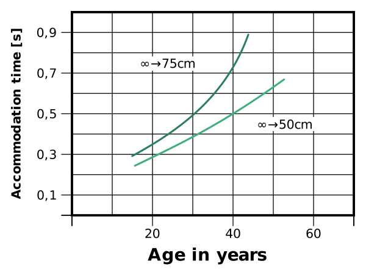

---
list-of-figures:
  label: Figure
  title: List of Figures
list-of-tables:
  label: Table
  title: List of Tables
cite:
  title: List of Sources
footnotes:
  title: Footnotes
abbreviations:
  title: List of Abbreviations
---

<!-- prettier-ignore -->
*[PET]: Positron emission tomography
*[PVS]: Persistent vegetative state
*[RS]: Rett syndrome
*[U.S.]: United States
*[USA]: United States of America
*[WWW]: World Wide Web

# Medical Basics – Part II

## Language and Speech

The spoken (vocalized) utterances of a human being are based on a two-stage process in which we must strictly distinguish between the elements _language_ (semantic representation system) and _speaking_ (phonetic representation system).
Language is the encoding of abstract patterns of thought into a sequence of characters (e.g., letters) or phonetic elements (phonemes).
We call the manifestation of characters “writing”; we call the realization of sounds “speaking” [@dudel:1996, @böhme:1997, @pschyrembel:1989].

In the complex “language – speaking” four linguistic levels can be distinguished [@böhme:1997]:

- _Semantic-lexical level_: semantics – study of the content and meaning of words; lexicology – study of the vocabulary of a language.
- _Syntactic-morphological level_: syntax – characterization of sentences and recognition of their internal structure; morphology or grammar – teaching of the structure and laws of a language.
- _Phonetic-phonological level_: phonetics – articulatory, acoustic and auditory factors of sounds; phonology – study of the sound system of individual languages and its function.
- _Pragmatic-communicative level_: use of language in the relationship between speaker and listener (sender and receiver).

### The Language

1. Definitions  
   Language is a conventional[^32] system of signs for communication purposes [@brockhaus:1994].
   Communication between living beings can take place in many different ways.
   In animals, gestures, gestures and scents play an important role in addition to sounds.
   Despite the variety of the used expressions and forms of expression, the communication occurring with animals is not called language, since for the transmission of the message always only given, unchanged signs are used.
   Language in the sense of the usual definition exists only if there is a convention which makes it possible to produce and understand an unlimited number of arbitrary messages from a limited, supraindividual stock of signs (e.g. alphabet, vocabulary).
   According to current knowledge, these syntactic abilities required for this seem to occur exclusively in humans.
   In this sense language consists of meaning-bearing elements (morphemes), which can be combined according to the rules of syntax to meaningful units manifold [@dudel:1996].

   > The human being speaks (...) We speak, because speaking is natural to us (...) One says, the human being has the language by nature (...) Only the language enables the human being to be that living being, which he is as a human being (...) As the speaking one the human being is: human being.  
   > _Martin Heidegger_ [@heidegger:1959]

   [^32]: conventional: here in the sense of “based on conventions”, agreed.

   By language production, therefore, we want to understand the formation and processing of mental concepts, whereby, accessing the learned active vocabulary and applying the syntactic rules valid for the respective language, a message is prepared in such a way that it can be supplied to vocal articulation or to another suitable modality (writing, gestures, body language, etc.).
   If this language manifests itself simultaneously in several modalities, then we speak of bimodal[^33] or multimodal communication.

   [^33]: A typical example of bimodal communication is the simultaneous conversion of a linguistic expression into spoken language and sign language by the person speaking.

2. Language acquisition  
   According to Chomsky, the complexity of human language conflicts with the ease with which children acquire language.
   Therefore, with the “Principles and Parameters Model”, he postulates that the basic features common to all languages are already biologically laid out (innate knowledge).
   Using these “universal principles”, the acquisition of the mother tongue is “only” limited to the learning of those grammatical parameters which determine the syntactic differences of each language.

3. Vocabulary  
   The vocabulary of the German language comprises (depending on the source and counting method) about $300\:000$ to $400\:000$ words.
   Of these, about $60\%$ are nouns (nouns), $25\%$ are verbs (tense words), and $15\%$ are adjectives (property words) and adverbs (circumstantial words).
   The English language is much richer.
   Here it is said to have a word inventory of $600\:000$ to $800\:000$ words.
   French, on the other hand, comprises only $100\:000$ words [@brockhaus:1994, @erben:1965, @geo-magazine:1997].

   The average active vocabulary of an adult is $8\:000$ to $16\:000$ words, while the average passive vocabulary reaches nearly $100\:000$ words.
   In contrast, $2\:000$ words are sufficient for $90\%$ comprehension of a simple, everyday text.

   At $18$ months, a child has about $50$ of word-like expressions.
   One year later, the active vocabulary has increased to $400$ words and at the age of $3$ years to more than $700$ words.
   Verbs have a special place in this process.
   They are added to the active vocabulary later and with greater effort [@wilson:1998].
   The passive vocabulary of a six-year-old child is reported to be no less than $23\:000$ words [@geo-magazine:1997].

4. Language and brain functions  
   Recent research claims that a great many regions of the human brain are involved in understanding and producing language.
   This is especially true when considering that language can be heard and read, spoken or written, and that there are numerous non-verbal forms of expression in addition to verbal language.

   In the classical view of the brain regions involved, one starts, for the sake of better understanding, from heard speech and traces the chain of action to the production of a spoken response to what is heard.

   On the one hand, by observing and analyzing brain lesions and their effect on the linguistic competence and performance of subjects, and on the other hand, by using positron emission tomography (PET)[^34] it has been possible to find relatively narrowly defined areas in the brain that are responsible for the processing and production of speech.

   [^34]: Positron emission tomography can be used to create a cross-sectional image of the brain's energy balance and thus determine which areas of the brain have above-average activity during certain activities.

   The so-called Wernicke center[^35] is the “sensory” language region in the posterior, upper part of the temporal lobe of the dominant hemisphere of the brain in each case (in $99\%$ of right-handed persons and $60\%$ of left-handed persons on the left side of the body).

   [^35]: Carl Wernicke, German neurologist and psychiatrist, $1848-1905$

   Earlier, Broca[^36] was able to locate the “motor” language region in the lower turn of the frontal lobe of the dominant hemisphere, named after him as Broca's center.

   [^36]: Paul Broca, French surgeon and anthropologist, $1824-1880$.

   The two designations “sensory” and “motor” center seem rather misleading in an overall consideration of the brain's linguistic activity, especially since the “motor center”, despite its topographical proximity, has nothing to do with the motor cortex responsible for the speech process.

   If one tries to name the two language centers according to their linguistic task, then the Wernicke center represents, so to speak, the lexicon in which the terms and their meaning (semantics) are stored.
   Together with the functions for memory and assignment localized in the near occipital lobe, it is assumed that the words for the subsequent sentence formation are determined in the Wernicke area from abstract thoughts that have not yet been formulated in language by searching for the appropriate terms.

   <!-- FIXME: missing bibliography entry: [MET 94] -->

   

   According to this model, Broca's center then takes over these word components as a “grammar machine,” supplements them with the necessary function words, and builds a syntactically correct sentence from them.

   In the following step, the completed sentence, when it is to be pronounced, is passed on to that part of the motor cortex which is responsible for the correct control of about a hundred muscles involved in the articulation of spoken language.
   Analogous mechanisms operate for written language and nonverbal communication.

   The Wernicke area also has tasks in recognizing heard words.
   Another center (optical speech center) is active during reading.

   For the basic functions “lexicon”, “semantics” and “grammar” the language centers of the dominant brain hemisphere (mostly left) are responsible.
   However, this should not hide the fact that the non-dominant brain hemisphere also has an important task to fulfill in understanding and producing language.
   If the bar (corpus callosum), the connection between the two brain hemispheres, fails (injuries, tumors), persons lose the ability to distinguish emotional components in language (angry, ironic, humorous, etc.) or to understand figurative language (metaphors) other than in a purely literal sense [@eberhard:1994].

{.lower-alpha}

### Speech, Voice Formation and Speech Organs

1. Organs of voice formation  
   Human voice production, which is unique in all of nature, is accomplished through a complex interaction of a variety of organ systems:

   - The respiratory system (the lungs and airways) must provide sufficient air volume and pressure.
   - The larynx with the vocal cords serves to produce sounds (in the sense of tones together with their harmonics), which in this context are called voice.
   - The articulation system, consisting of the pharynx, oral cavity and nasal cavity, forms the individual phonemes, i.e. the elements of spoken language, from the sound coming from the larynx.
   - The voice formation in the larynx (position of the vocal cords) and all movements of the articulation organs (primarily position of the tongue, palate, jaws and lips) are carried out by the motor speech center of the brain.
   - The role of the auditory system in speech production should not be underestimated.
     Only through the feedback of one's own voice is natural speech acquisition and perfect articulation possible.
     If this feedback is not guaranteed due to damage to the ear or the auditory pathway, language acquisition is only possible by means of special educational and therapeutic measures.

   The position of the vocal cords determines whether the exhaled air can pass through the glottis (gap between the vocal cords, _glottis_) unhindered (normal breathing) or whether it can cause the vocal cords to vibrate when the glottis is narrowed (phonation).
   The more the vocal cords are tense and the higher the pressure of the exhaled air, the higher the frequency of vibration produced by the vocal cords.
   A separate position of the vocal cords is present in the whispering voice.
   The four most important positions of the vocal cords are shown in <<fig:position-of-voice-bands>>.

   Depending on its position, the soft palate regulates the inflow of air into the oral or nasal cavity (or both), thereby contributing to the coloration of the sound.
   Tongue, teeth and lips cause differentiation in articulation.

   

   ::: figcaption

   1. with quiet breathing;
   2. with forced breathing;
   3. in voice production;
   4. with whispered voice
      {.lower-alpha}

   :::

{.lower-alpha}

## Verbal and Vocal Disabilities

When considering disabilities in the area of verbal communication skills, it is important to distinguish between speech (as the verbal basis; English: _language_) and language (as the vocal form of expression; English: _speech_).
To understand and produce language is an achievement of our brain.
To express this language vocally or also by writing or gestures and thus to communicate is in the broadest sense an achievement of our motor skills (articulation, hand motor skills).
(articulation, hand motor skills, etc.).

Between these two clearly defined areas there are all those neural structures which are responsible for the conception of movements and for the transmission of nerve signals to the musculature.
They form, so to speak, the link between speech and language.
Disorders in this area can therefore not always be clearly assigned.
In addition, disabilities can also affect both areas of speech and language at the same time, so that a clear classification is impossible in this case.
A first classification of the areas in which disorders can occur is given in <<tab:disorders-complex-speech-speech>> [@böhme:1997, @carroll:1998].

<table>
  <tbody class="break-words">
    <tr>
      <th scope="row">Level</th>
      <td style="font-weight: bold;">phonetic-phonological</td>
      <td style="font-weight: bold;">syntactic-morphological</td>
      <td style="font-weight: bold;">semantic-lexical</td>
      <td style="font-weight: bold;">pragmatic-communicative</td>
    </tr>
    <tr>
      <th scope="row">Dysfunction</th>
      <td>Motor and sensory dyslalia, phonematic disorders</td>
      <td>Dysgrammatism, problems with determinate sentence constructions</td>
      <td>Limited active and passive vocabulary, rare words often not at hand</td>
      <td>Interpersonal communication disorders in social and situational context</td>
    </tr>
  </tbody>
</table>

.disorders-complex-speech-speech#Disorders in the speech-speech complex.

### Disabilities of the Language

Disabilities of language are always based on lesions of the brain or are due to a developmental disorder that has delayed or prevented language acquisition.

1. Aphasia  
   Aphasia is first of all the collective term for all damages occurring after language acquisition and affecting the area of linguistic communication.
   They can affect both the perception and production of speech.
   However, aphasia (literally speechlessness) in the narrower sense is usually understood as a disorder of speech production with preserved function of the organs and musculature needed for speech.

   Aphasia often also affects written language and sometimes the expression of gestures or the use of symbols.
   In this sense, aphasia is a multimodal disability [@böhme:1997, @gadler:1996].
   Aphasia may also affect the ability to understand and produce sign language, as has been found in deaf individuals with lesions of the language areas [@damasio:1993, @devlin:1999, @devlin:2000].
   The frequency for Western countries is reported to be around $4$ out of $1\:000$ (statistics from UK and USA) [@carroll:1998].

   Simple, short and frequently used words, which were learned early in life, have the highest probability of still being mastered despite aphasia.
   In any case, abstract words, complex syntactic constructions, and the passive form are problematic [@devlin:1999, @devlin:2000].

   Clinically, aphasia is usually classified as follows, although different opinions exist regarding terminology (for a summary, see <<tab:classification-leading-symptoms-aphasic-syndrome>>) [@eberhard:1994, @pschyrembel:1989, @böhme:1997]:

   <table>
     <thead>
       <tr>
         <td></td>
         <th>Amnestic aphasia</th>
         <th>Wernicke's aphasia Sensory A.</th>
         <th>Broca's aphasia Motor A.</th>
         <th>Global aphasia</th>
       </tr>
     </thead>
     <tbody>
       <tr>
         <th scope="row">Speech production</th>
         <td>mostly fluent</td>
         <td>fluent</td>
         <td>significantly slowed</td>
         <td>scarce to zero, including speech automatisms</td>
       </tr>
       <tr>
         <th scope="row">Articulation</th>
         <td>mostly not disturbed</td>
         <td>mostly not disturbed</td>
         <td>often dysarthric</td>
         <td>mostly dysarthric</td>
       </tr>
       <tr>
         <th scope="row">Prosody</th>
         <td>mostly well preserved</td>
         <td>mostly well preserved</td>
         <td>often leveled, also chanting</td>
         <td>often leveled, mostly well preserved in automatisms</td>
       </tr>
       <tr>
         <th scope="row">Sentence construction</th>
         <td>barely disturbed</td>
         <td>paragrammatism (duplications and entanglements of sentences and parts of sentences</td>
         <td>agrammatism (only simple sentence structures, absence of function words)</td>
         <td>only single-word phrases, speech automatisms</td>
       </tr>
       <tr>
         <th scope="row">Word choice</th>
         <td>Substitution strategies for word-finding disorders, some semantic paraphasias</td>
         <td>many semantic paraphasias, often grossly divergent from the target word, semantic neologisms</td>
         <td>relatively narrow vocabulary, hardly any semantic paraphasias</td>
         <td>extremely limited vocabulary, grossly deviant semantic paraphasias</td>
       </tr>
       <tr>
         <th scope="row">Sound structure</th>
         <td>some phonemic paraphasias</td>
         <td>many phonematic paraphasias up to neologisms, also phonematic jargon</td>
         <td>many phonematic paraphasias</td>
         <td>very many phonematic paraphasias and neologisms</td>
       </tr>
       <tr>
         <th scope="row">Comprehension</th>
         <td>slightly impaired</td>
         <td>strongly disturbed</td>
         <td>slightly disturbed</td>
         <td>strongly disturbed</td>
       </tr>
     </tbody>
   </table>

   .classification-leading-symptoms-aphasic-syndrome#Classification and leading symptoms of aphasic syndromes according to Poeck, 1994 in [@böhme:1997].

2. Paraphasia  
   Paraphasia refers to a language disorder in which there are omissions, substitutions, additions, or rearrangements.
   This can occur at the level of phonemes within a word (phonematic paraphasia) or words within a sentence (semantic or verbal paraphasia).

3. Dysphasia  
   Dysphasia (also _specific language impairment_ = SLI) refers to language impairments in brain local syndrome or delayed language development [@pschyrembel:1989].
   The impairments often primarily affect verbs (the acquisition, morphology, vocabulary).
   Verbs with the most general meaning possible are preferred.
   There is little derivation of semantics (recognizing the meaning of a word) from syntax [@wilson:1998].

4. Agrammatism, Dysgrammatism  
   Agrammatism is a disorder of grammatically correct expression (sentence structure disorder) after completed language development.
   Speech is in simple, incorrect and often short expressions (telegram style).
   Conjugations and declensions are missing, often the infinitive is used.
   Agrammatism refers to the complete absence of syntax in linguistic utterances.
   Milder forms (especially in childhood grammatical disorders) are called dysgrammatism Occurrence in motor aphasia (see above) and intellectual disabilities.

   <!-- FIXME: reference to German countries? -->

5. Alexia, Dyslexia  
   Dyslexia is used as a generalized term for a partial reading impairment with otherwise normal overall intelligence.
   In German-speaking countries, the term _Legasthenie_ or _Lese- und Rechtschreibstörung_ (LRS) is usually used.
   In affected children, confusion of graphemes[^37], faulty spelling, and reduced reading comprehension are noticeable from about the second grade.
   Dyslexia of various degrees affects between $6$ and $10\%$ of children [@pschyrembel:1989].
   According to a survey of $700$ disabled students at Glasgow University, individuals with dyslexia constitute the largest group [@busse:1998].
   The reasons are still not clear, but both genetic and social influencing factors are suspected [@pschyrembel:1989].

   [^37]: Grapheme refers to the smallest meaning-bearing unit of written language.

   In the case of dyslexia, it must be noted that reading and spelling disorders can occur together as well as separately.
   As a rule, arithmetic is not affected.
   If there is a complete inability to read, it is called alexia.
   If reading fails due to a lack of recognition of letters, the condition is known as _superficial alexia_ (literary alexia).
   If, on the other hand, words are not recognized, it is a case of _deep alexia_ or verbal alexia.

   The discussion about dyslexia makes it clear how easily we tend to proceed in terms of “defectology” and talk about impairments and weaknesses without thinking about advantages and strengths.
   Individuals with dyslexia undoubtedly exhibit weakness in verbalizing, but usually show strengths in visualizing and using pictorial representations of facts.
   Weaknesses on the constructive side are counterbalanced by strengths in analytical thinking.
   It may have been these shifts in emphasis that enabled dyslexic individuals such as Faraday or Einstein to achieve the scientific feats that set them apart [@mccausland:1994].

6. Acalculia, Dyscalculia  
   A partial performance weakness in dealing with numbers is called dyscalculia or arithmasthenia.
   If there is a complete inability to calculate, it is called acalculia.

7. Agraphia  
   Similar to reading, writing can also be affected by a partial impairment.
   An inability to write with intact hand motor skills and normal intelligence is called agraphia.

{.lower-alpha}

### Impairments of Speech

A weak respiratory system affects the loudness and persistence of vocal utterances.
Laryngeal disorders cause breathy, hoarse, soft, whispery, or slowed pronunciation.
Dysfunctions of the soft palate result in either overly nasal articulation or absence of nasal sounds If the anterior articulation system (tongue, jaw, lips) is impaired, the result is slurred, slow, imprecise, or uncoordinated pronunciation.
Other articulation disorders may result in varying pitch, fluctuating volume, excessive rate of speech, or disturbances in the rhythm of speech (poluttering, stuttering).

1. Dysarthria, Anarthria  
   Speech disorder caused by paralysis or coordination disorder of the speech muscles as a result of damage to the cranial nerves [@strässle:1998].
   The whole complex of voice formation disorders described above is called _dysarthria_ or _dysarthrias_.
   Dysarthria can occur as a result of cerebral palsy, muscular dystrophy, apoplexy (cerebral stroke), Parkinson's syndrome, amyotrophic lateral sclerosis (ALS), multiple sclerosis (MS), Huntington's disease, brain tumors, myasthenia gravis, or after traumatic brain injury, poisoning, or drug abuse.

   Anarthria refers to the most severe form of dysarthria in which specific articulation of sounds and sentence elements is not possible [@strässle:1998].
   Cerebral damage causing dysarthria or anarthria often also causes movement disorders that prevent the affected person from making controlled gestures.
   This presents an additional obstacle to communication [@strässle:1998].

2. Aphonia, Dysphonia  
   The complete failure of phonation (voice production) is called aphonia.
   Voice disorders (hoarse, busy, rough voice) and limitation of voice performance is called dysphonia.
   Causes are, besides psychological influences (shock, stress), various anomalies and diseases of the larynx (also due to injury or intubation).

{.lower-alpha}

### Disorders in the Border Area Between Speech and Language

Disorders that fall into the border area between speech and language, i.e., in the transition from language conceived in words to sound formation (assignment of phonemes), are deliberately treated here with the speech disorders.
Although their causes lie before the actual articulation, this is because the aids used here must not support the speech itself, but the pronunciation.

1. Dyslalia  
   Dyslalia is a disorder of articulation in which phonemes are changed or replaced by others.
   The causes may include central speech disorders and delayed speech development.

2. Echolalia  
   Echolalia refers to the compulsive verbal or modified repetition of words and sentences heard or said without regard to the content or situation.
   It is part of natural language development in children between the ages of one and two, but later it is a sign of a language disorder.

3. Bradylalia  
   Bradylalia (also known as bradyarthria or bradyglossia) is a slowing of the speech rate observed, for example, in multiple sclerosis.

{.lower-alpha}

## Multiple Disabilities, Syndromes

### Multiple Disabilities

The coincidence of several impairments is called multiple disability and often weighs more heavily for the affected person than the sum of the individual disabilities.

<<tab:occurrence-multiple-disabilities>> shows, for the three most common primary disabilities (mobility, vision, and hearing impairment), the probability of occurrence of additional functional limitations.
The numbers indicate how many of $1\:000$ persons with a given primary disability are affected by one of the selected additional limitations.

<table>
  <colgroup span="3"></colgroup>
  <col>
  <thead>
    <tr>
      <th colspan="3">Of <MathML formula="1,000"/> individuals with a disability ...</th>
      <th rowspan="2" scope="rowgroup">... are additionally limited at/by</th>
    </tr>
    <tr>
      <th>... of mobility ...</th>
      <th>... of vision ...</th>
      <th>... of hearing ...</th>
    </tr>
  </thead>
  <tbody>
    <tr>
      <td><MathML formula="1,000"/></td>
      <td><MathML formula="700"/></td>
      <td><MathML formula="530"/></td>
      <th>Mobility</th>
    </tr>
    <tr>
      <td><MathML formula="150"/></td>
      <td><MathML formula="1,000"/></td>
      <td><MathML formula="160"/></td>
      <th>Vision</th>
    </tr>
    <tr>
      <td><MathML formula="230"/></td>
      <td><MathML formula="380"/></td>
      <td><MathML formula="1,000"/></td>
      <th>Listening</th>
    </tr>
    <tr>
      <td><MathML formula="320"/></td>
      <td><MathML formula="220"/></td>
      <td><MathML formula="200"/></td>
      <th>Rheumatism</th>
    </tr>
    <tr>
      <td><MathML formula="20"/></td>
      <td><MathML formula="30"/></td>
      <td><MathML formula="10"/></td>
      <th>Epilepsy</th>
    </tr>
    <tr>
      <td><MathML formula="270"/></td>
      <td><MathML formula="150"/></td>
      <td><MathML formula="170"/></td>
      <th>Heart disease</th>
    </tr>
  </tbody>
</table>

.occurrence-multiple-disabilities#Occurrence of multiple disabilities [@tetzchner:1991].

### Syndromes

A syndrome[^38] is understood as the coincidence of several signs (symptoms) that are characteristic of a certain clinical picture.
The cause of the disease (etiology) is usually uniform, but the course of the disease (pathogenesis) is unknown.

[^38]: Syndrome: from grie. concomitant, accompanying.

1. Down syndrome  
   Down syndrome[^39] (also trisomy $21$ or Langdon-Down disease)[^40] results from a chromosomal disorder in which an extra third chromosome $21$ (hence trisomy $21$)[^41] appears in the body's cells at fertilization or one of the subsequent cell divisions and is passed on with each subsequent cell division from then on[^42].
   Down syndrome leads to maldevelopment of almost all tissues and organs of the maturing organism.
   Three types of Down syndrome are distinguished:

   [^39]: John L. Down, English physician, $1828-1896$.
   [^40]: The former common name “mongolism” is now considered discriminatory and should therefore be avoided.
   [^41]: In addition to trisomy $21$, other autosomal trisomies involving chromosomes $3$, $9$, $10$, $12$, $13$, and $18$ are known. Genosomal trisomies (XXY and XYY) may occur in the sex chromosomes.
   [^42]: that a chomosomal disorder is the cause of Down syndrome was suspected as early as $1930$, but proof was not provided until $1959$ by Frenchman Jérôme Lejeune.

   - _Free (complete) trisomy $21$_  
     The additional chromosome $21$ already exists as $24$.
     chromosome in one of the germ cells and is therefore present as a free third chromosome $21$ in all somatic cells (<<fig:chromosome-passing-down-syndrome>>).

   - _Mosaic Down Syndrome_  
      Sperm and egg cells contain the correct number of $23$ chromosomes.
     The chromosomal error does not occur until one of the first cell divisions.
     Therefore, there are cells with both $46$ and $47$ chromosomes.
     This form occurs in about $1\%$ of children with Down syndrome (<<fig:chromosome-passing-mosaic-down-syndrome>>).

   .")

   

   Apart from deformities and changes in habitus, the following symptoms are characteristic of Down syndrome:

   - Mental retardation of varying degrees.
   - Speech disorder (high palate, large tongue, malocclusion of teeth).
   - Muscle hypotonia.

2. Parkinson's syndrome  
   Parkinson's syndrome[^43] is the most common neurological disorder of advanced age, predominantly affecting men.
   It is an extrapyramidal syndrome due to degeneration of neurons in the midbrain (substantia nigra) [@pschyrembel:1989].

   [^43]: James Parkinson, English surgeon and paleontologist, $1755-1824$.

   The symptoms associated with Parkinson's syndrome are primarily:

   - Silent and monotone speech
   - Slowing and shortening of movements and movement disorders (slow, shuffling gait, small handwriting, tendency to fall)
   - Stiffness of the muscles
   - Resting tremor (tremor of muscles at rest with $4$ to $6$ movements per second).
     Tremor stops during voluntary movements, so handwriting is not tremulous.

3. Gregg syndrome  
   Gregg syndrome (rubella embryopathy, embryopathia rubeolosa), malformation syndrome following rubella infection of the mother during the first three months of pregnancy [@pschyrembel:1989].
   The anomalies that occur depend on the timing of rubella infection (<<tab:anomalies-gregg-syndrome>>).

   <table>
     <thead>
       <tr>
         <th>Pregnancy month</th>
         <th>Focus of abnormalities</th>
         <th>Occurring symptoms</th>
       </tr>
     </thead>
     <tbody>
       <tr>
         <td rowspan="4"><MathML formula="1"/></td>
         <td rowspan="4">Eyes</td>
         <td>congenital cataract (Cataracta congenita)</td>
       </tr>
       <tr>
       <td>facultative glaucoma (glaucoma)</td>
       </tr>
       <tr>
       <td>small eyes (microphthalmia)</td>
       </tr>
       <tr>
       <td>back of the eye changes (pseudo-RP)</td>
       </tr>
       <tr>
         <td rowspan="4"><MathML formula="2"/></td>
         <td>Heart</td>
         <td>heart septal defects</td>
       </tr>
       <tr>
         <td rowspan="3"><abbr title="Central nervous system">CNS</abbr></td>
         <td>low brain volume (microcephaly)</td>
       </tr>
       <tr>
         <td>retardation, epilepsy</td>
       </tr>
       <tr>
         <td>motion disorders</td>
       </tr>
       <tr>
         <td><MathML formula="3"/></td>
         <td>internal ear</td>
         <td>sensorineural hearing loss</td>
       </tr>
     </tbody>
   </table>

   .anomalies-gregg-syndrome#Abnormalities in Gregg syndrome [@pschyrembel:1989].

4. Rett syndrome (RS)  
   Rett syndrome[^44] is a disorder so far observed only in girls, probably inherited in an X-linked dominant manner, in the course of which there are brain atrophy (atrophy of neural tissue in the brain) as well as other changes in the brain.
   Manifestation occurs between $6,$ month of life and $4,$ year of life.
   The effects are:

   [^44]: Andreas Rett, Austrian pediatrician.

   - epilepsy
   - Delays in growth
   - Loss of previously acquired skills
   - Stereotyped hand movements (washing, kneading)
   - Gait disturbances (wide-legged, stiff)
   - Apraxia (also affects speech organs and eye movements)
   - Loss of verbal communication

5. Usher syndrome  
   Usher syndrome is an autosomal recessive inherited disorder with the main symptoms:

   - Progressive hearing loss in childhood and adolescence.
   - Retinopathia pigmentosa (retinitis pigmentosa), occurring years later
   - Failure of the vestibular nerve (part of the vestibulocochlear nerve = VIII. Cranial nerve, which innervates the vestibular system).
   - Epileptic seizures (possible)

   Usher syndrome is a major cause of deaf-blindness.

6. Persistent vegetative state (PVS) and locked-in syndrome  
   Waking coma (apallic syndrome, coma vigile, persistent vegetative state – PVS) refers to a clinical condition in which the patient is in a complete loss of perception of him/herself and his/her environment.
   The autonomic functions of the hypothalamus and brainstem are fully or partially preserved.
   An EEG is present and normal in the further course.
   However, visual stimulation lacks the usual blocking of alpha waves.
   Patients exhibit a natural sleep-wake cycle.
   Nevertheless, there is no evidence of reproducible goal-directed or volitional behavior in response to visual, tactile, auditory, or noxious stimuli [@persistent-vegetative-state:1994:part-1].

   Wakefulness coma is clearly distinguishable from related conditions such as locked-in syndrome, coma, brain death, or severe dementia (see also the compilation in <<tab:wakefulness-coma-and-related-states>>):

   - Coma: Deep unconsciousness lasting more than one hour.
   - Brain death: permanent absence of all brain activity, including that of the brain stem.
   - Locked-in syndrome: consciousness and awareness is present but cannot be reciprocated.
     PET scans show much higher metabolic levels than in PVS.
   - Dementia: Progressive, multidimensional loss of cognitive function.
     Progression to end-stage PVS is possible.

   <table>
     <thead>
       <tr style="height: 14rem;">
         <th>State</th>
         <th>Self-awareness</th>
         <th>Sleep-wake cycle</th>
         <th>Motor functions</th>
         <th>Awareness of suffering</th>
         <th>Breathing</th>
         <th>EEG activity</th>
         <th>Brain metabolism</th>
       </tr>
     </thead>
     <tbody>
       <tr>
         <th scope="row">Wake coma</th>
         <td>absent</td>
         <td>intact</td>
         <td>no controlled movement</td>
         <td>no</td>
         <td>normal</td>
         <td>delta or theta, sometimes alpha</td>
         <td>reduced by <MathML formula="50\%"/> or more</td>
       </tr>
       <tr>
         <th scope="row">Coma</th>
         <td>miss</td>
         <td>absent</td>
         <td>no controlled movement</td>
         <td>no</td>
         <td>reduced, different</td>
         <td>delta or theta</td>
         <td>reduced by <MathML formula="50\%"/> or more</td>
       </tr>
       <tr>
         <th scope="row">Brain death</th>
         <td>missing</td>
         <td>absent</td>
         <td>no or only spinal reflexes</td>
         <td>no</td>
         <td>absent</td>
         <td>no EEG</td>
         <td>absent</td>
       </tr>
       <tr>
         <th scope="row">Locked-in syndrome</th>
         <td>present</td>
         <td>intact</td>
         <td>complete paralysis, eye movements only</td>
         <td>yes</td>
         <td>normal</td>
         <td>normal or minor deviation</td>
         <td>slightly reduced</td>
       </tr>
       <tr>
         <th scope="row">Dementia</th>
         <td>present, lost later</td>
         <td>intact</td>
         <td>different, progressive decline</td>
         <td>yes, but decreasing</td>
         <td>normal</td>
         <td>slowed</td>
         <td>differentially reduced</td>
       </tr>
     </tbody>
   </table>

   .wakefulness-coma-and-related-states#Persistent vegetative state (PVS) and related conditions. [@persistent-vegetative-state:1994:part-1].

   Among the causes that can lead to a waking coma, a distinction is made between acute causes on the one hand and congenital or degenerative causes on the other [@persistent-vegetative-state:1994:part-1].

   Acute causes may have a traumatic background (traumatic brain injury, e.g., due to an accident or gunshot wound) or a non-traumatic background (hypoxia due to circulatory arrest or drowning, cerebral apoplexy, meningitis, tumors, or poisoning).
   The statistical evolution of patients/patients with PVS $12$ months after an acute cause is shown in <<fig:model-production-spoken-language>>.
   Note that prognoses vary widely between traumatic and nontraumatic triggers as well as between adults and children.
   <<fig:model-production-spoken-language>> also shows, for that portion of individuals who awaken from PVS within 1 year, the probability and degree of expected disability [@kinney:1994, @persistent-vegetative-state:1994:part-1].

   

   Non-acute causes of a vegetative state include, on the one hand, numerous malformations of the brain such as anencephaly (absence of essential brain parts), microencephaly (small brain), hydranencephaly (remodeling of the cerebrum into a fluid bubble) and congenital hydrocephalus.
   On the other hand, in adults, conditions such as Alzheimer's disease, Creutzfeldt-Jacob, Huntington's disease, Parkinson's disease, or multi-infarct dementia can result in PVS.
   In children, gangliosidoses (lipid storage diseases) may be a cause of falling into a vegetative state [@persistent-vegetative-state:1994:part-1].

   The incidence of PVS is reported very differently, varying from $25$ to $60$ on $1\;\sf{million}$ EW.
   Only the smaller proportion has traumatic causes [@andrews:1993].
   It should be noted, however, that a definitive diagnosis is often very difficult and misdiagnosis can account for up to $60\%$ of cases studied [@andrews:1996].

   <!-- FIXME: cross reference -->

   In locked-in syndrome, patients are conscious but without any ability to move.
   In the “classic” form, vertical eye movements and blinking are preserved, and can be used for communication purposes with appropriate interfaces.
   In “total” locked-in syndrome, these movements are also absent and communication is possible – if at all – only via the evaluation of the EEG (Brain Computer Interface).
   <!-- In “total” locked-in syndrome, these movements are also absent and communication is possible – if at all – only via the evaluation of the EEG (Brain Computer Interface – see Part B, Chapter 3.2.8). -->

   Causes for locked-in syndrome are: advanced ALS, brainstem infarction, infarction in the bridge (_pons_, connection of the two brain hemispheres), bilateral infarction of the internal capsule (capsula interna – deep lying part of the brain), tumors, encephalitis (inflammation of the brain) and craniocerebral trauma [@kübler:2001:a, @kübler:2001:b].

{.lower-alpha}

## Age-Related Functional Limitations

Aging represents a complex, irreversible process that is characterized by organically induced changes in the area of vital functions.
Theoretically, the aging process already begins at conception (biomorphosis). In practice, this is contrasted with the degenerative changes and functional losses that become much more pronounced with advancing age (senescence).

When considering signs of aging, a conscious distinction should be made between chronological (calendar) age and biological age [@helander:1998].
Classifying old people on the basis of age alone (as is repeatedly done in the context of statistics for lack of better options) creates highly heterogeneous populations whose abilities cannot be compared in many respects.

<!-- FIXME: missing bibliography entry: [PLO 98] -->

While age initially implies a higher likelihood of suffering one or more physical impairments (<<fig:percentage-disabilities-us>>), it must be remembered that $84\%$ of persons over $65$ do not require outside assistance in performing activities of daily living.
It would therefore be an entirely wrong perspective to view them blanketly as disabled or patients rather than consumers (<<fig:percentage-assistance-us>>) [@plo:1998, @yokoyama:1998, @charness:1998:b].

.")

::: figcaption

Percentage of the U.S. population living in households (source: U.S. Census Bureau [@mcneil:1995]) who

1. are mildly or severely disabled;
2. are severely disabled;
3. have problems in at least one activity of daily living[^45].
   {.lower-alpha}

:::

[^45]:
    Figures are for the population average.
    Blacks are more affected by disability.
    E.g., age group $55-64$ years: whites: $20\%$; blacks $35\%$ [@mcneil:1997].

.")

In a $1982$ study conducted in the U.S., it was found that $36\%$ of those caring for an elderly person were themselves over $65$ years old [@harootyan:1993].

Declines in performance typical of the general aging process have been analyzed for a number of functions.
They are described in the following points.
However, it is important to reiterate here the particular heterogeneity of this population stratum.
Many of the data presented below are based on averaging and thus attempt to represent the typical performance data of a statistical person of a certain age, which hardly exists in reality.
Rather, it is known that in many cases the extreme values of a given measurement scale are much more crowded than the middle [@harrington:1998].
Therefore, the values given here can only represent a general trend line.

### Vision

1. Increase in eye diseases  
   With age, the statistical probability of suffering irreversible damage to the eyes increases significantly.
   <<tab:increase-eye-diseases-age>> shows the frequencies of occurrence of cataracts, glaucoma, and age-related maculopathy collected for the United States for three age strata between $52$ and $85$ years.

   <table>
     <thead>
       <tr>
         <th>Age [in years]</th>
         <th>Cataract (cataract) [%]</th>
         <th>Maculopathy (age-related) [%]</th>
         <th>Glaucoma (glaucoma) [%]</th>
       </tr>
     </thead>
     <tbody>
       <tr>
         <td><MathML formula="52-64"/></td>
         <td><MathML formula="5"/></td>
         <td><MathML formula="2"/></td>
         <td><MathML formula="1"/></td>
       </tr>
       <tr>
         <td><MathML formula="65-74"/></td>
         <td><MathML formula="18"/></td>
         <td><MathML formula="11"/></td>
         <td><MathML formula="5"/></td>
       </tr>
       <tr>
         <td><MathML formula="75-85"/></td>
         <td><MathML formula="46"/></td>
         <td><MathML formula="28"/></td>
         <td><MathML formula="7"/></td>
       </tr>
     </tbody>
   </table>

   .increase-eye-diseases-age#Increase of eye diseases with age [@fozard:1993 nach @kahn:1977].

2. General decrease in visual performance (visual acuity).  
   In addition to the increasing probability of suffering a visual impairment due to disease with age, there are numerous degenerative processes of the eye.
   From <<fig:decrease-visual-performance-at-age>> it is evident that visual performance (visual acuity, visual acuity) statistically decreases by about $0.1\;\sf{V}$ per decade of life, starting with the $40th year of life, despite correction by glasses or contact lenses.
   In the age group $65-74$ years $92\%$ of the persons have a visual acuity better than $0.8$ (with best possible correction), but for the age group $75-84$ this value decreases to $69\%$ [@kahn:1977].

   <!-- FIXME: missing bibliography entry: [GIT 86] -->

   

3. Reduction of accommodation success and accommodation time.  
   Accommodation success is the difference in refractive power, measured in diopters (dpt), of which the crystalline lens is capable.
   For the emmetropic (normally sighted) eye or the eye corrected by glasses or contact lenses, this is the difference between distance accommodation and accommodation to the minimum possible distance.

   While the adolescent eye has an average accommodation success of $12\;\sf{dpt}$, this value reduces especially in the life stage between $40$ and $50$ years, so that then the average accommodation success is only $2\;\sf{dpt}$.
   <<fig:reduction-accommodation-success-at-age>> shows the typical courses for accommodation success between $10$ and $70$ years.

   

   The age-related reduction of accommodation success means an increasing reduction of the range to which the eye can focus.
   To achieve a sharp image at the usual reading distance of $35\;\sf{cm}$ to $40\;\sf{cm}$, the presbyopic eye requires an increase in refractive power through reading glasses.
   If such glasses are worn, then greater distances cannot be perceived sharply.

   <<fig:range-sharp-vision>> shows the perceptible range in focus when glasses are used to achieve the reading distance ($35\;\sf{cm}$ to $40\;\sf{cm}$).
   Thus, at $50$ years of age, on average, accommodation can still be achieved to a range between $35\;\sf{cm}$ and $80\;\sf{cm}$.
   At $60$ years, this range is already limited to $10\;\sf{cm}$ ($35\;\sf{cm}$ to $45\;\sf{cm}$).
   Thus, an object to be perceived sharply must be within this small range.

   The time required for the eye to focus at a different distance increases with age.
   For a change of gaze from a distance to a near object (e.g., change of gaze from the roadway to the dashboard), a $50$-year-old person needs twice to three times the time compared with a $20$-year-old person (<<fig:increase-accommodation-time-with-age>>).

    by using glasses [@methling:1996].")

   

   [^46]:
       The accommodation time for larger distance differences is indeed shorter.
       Presumably, the eye reacts correspondingly faster to a larger stimulus (H. Krueger).

4. Change of the spectral sensitivity  
   Already the juvenile eye lens has yellow coloration to reduce chromatic aberration.
   However, the spectral transmission properties change during the years of life due to additional increased yellow coloration of proteins of the lens (<<fig:transmission-curve-eye-lens-age>>) [@methling:1996].
   As a consequence, much less blue components are transmitted in old age and violet as well as blue objects are perceived darker [@harrington:1998].
   It should be noted that the human eye has the lowest sensitivity for blue from the beginning.

   

   With increasing age, the perceived color saturation and color discrimination (especially for blue and green) becomes lower.
   Colors appear “washed out” [@fozard:1993].
   However, the yellow tint of the lens is not perceived as a color cast by the old person.

5. Higher need for light and contrast  
   The pupil diameter is also clearly subject to the aging process.
   The maximum diameter decreases continuously with age.
   Whereas the eye of a $20$-year-old person can be compared to a camera lens of luminous intensity $2$, the largest “aperture” of an $80$-year-old person is only $5.6$.
   This is a reduction of about $3$ f-stops, which is equivalent to reducing the amount of light falling on the retina by a factor of $8$.
   This explains the significantly higher light demand in old age (<<tab:age-dependence-pupil-diameter>> and <<fig:abhaengigkeit-pupillendurchmesser-vom-alter>>).

   <table>
     <col>
     <colgroup span="2"></colgroup>
     <colgroup span="2"></colgroup>
     <thead>
       <tr>
         <th rowspan="2">Alter [Jahre]</th>
         <th colspan="2">min. (Tag)</th>
         <th colspan="2">max. (Nacht)</th>
       </tr>
       <tr>
         <th>Ø [mm]</th>
         <th>f</th>
         <th>Ø [mm]</th>
         <th>f</th>
       </tr>
     </thead>
     <tbody>
       <tr>
         <td><MathML formula="20"/></td>
         <td><MathML formula="4.7"/></td>
         <td><MathML formula="4"/></td>
         <td><MathML formula="8.0"/></td>
         <td><MathML formula="2"/></td>
       </tr>
       <tr>
         <td><MathML formula="40"/></td>
         <td><MathML formula="3.9"/></td>
         <td><MathML formula="4"/></td>
         <td><MathML formula="6.0"/></td>
         <td><MathML formula="2.8"/></td>
       </tr>
       <tr>
         <td><MathML formula="60"/></td>
         <td><MathML formula="3.1"/></td>
         <td><MathML formula="5.6"/></td>
         <td><MathML formula="4.1"/></td>
         <td><MathML formula="4"/></td>
       </tr>
       <tr>
         <td><MathML formula="80"/></td>
         <td><MathML formula="2.3"/></td>
         <td><MathML formula="8"/></td>
         <td><MathML formula="2.5"/></td>
         <td><MathML formula="5.6"/></td>
       </tr>
     </tbody>
   </table>

   .age-dependence-pupil-diameter#Age dependence of pupil diameter – f is the rounded f-number corresponding to the equivalent photographic system [@zagler:1997, @methling:1996].

   

   ::: figcaption

   1. With dark accommodation;
   2. With light accommodation.

   :::

   Even in photopic conditions, the pupil diameter of a person over $60$ years old is much smaller than in youth, so that the luminous flux reaching the retina of a $60$ year old person is only $1/3$ of a $20$ year old person, and thus the illuminance required for comparable visual performance is three times as great [@methling:1996].
   Especially in the elderly, the improvement in visual performance achievable by increasing illuminance is significant.
   According to [@fozard:1993], visual performance and visual comfort increase proportionally with the square root of the amount of light provided.

   An increase in the amount of light causes the iris to form a smaller pupil diameter.
   Each such dimming of an optical system produces more sharpness and more depth of field.
   The small pupil diameter in old age provides some compensation for the presbyopic eye, causing an accommodation gain between $0.5\;\sf{dpt}$ and $0.75\;\sf{dpt}$ [@methling:1996].

   <<fig:correlation-letter-size-illumination-age>> shows the correlation between visual performance (reading letters of different sizes), age, and illuminance.
   While individuals between $30$ and $40$ years of age gain little advantage from higher illuminance levels, the gain in reading performance for older individuals is substantial [@steenbekkers:1998:a].

   <!-- prettier-ignore -->
    [@zagler:2008, @steenbekkers:1998:a].")

{.lower-alpha}

### Listening

The number of persons affected by hearing impairment within an age group increases almost exponentially with age.
<<fig:increase-hearing-impairements-with-age>> shows as an example the evaluation of a statistic from Holland [@sandini:1996].

The hearing threshold for pure tones in the upper auditory range (e.g., $8\;\sf{kHz}$) regularly increases in adult humans at a rate of about $1\;\sf{dB}$ per year of age.
Low tones (e.g., $1\;\sf{kHz}$) are much less affected.
Here, the annual increase in hearing threshold between $20.$ and $60.$ years of age is only about $0.3\;\sf{dB/a}$.
In later years, however, the rate increases to as much as $1.3\;\sf{dB/a}$ (<<fig:progression-hearing-threshold-with-age>>).
Men tend to be more affected by age-related hearing loss than women [@fozard:1993, @guski:1996].

 [@zagler:2008, @ferrari:1996, @sandini:1996].")

### Smell and taste

The age-related changes in perception thresholds for the sense of taste differ depending on the flavor.
While the threshold for “sweet” (e.g., sugar solutions) remains stable with age, the perception of “salty” and “bitter” decreases with age.

Sensitivity to odors generally decreases with age.
This not only means that older people enjoy eating less (the sense of smell plays a more important role here in addition to the sense of taste), it also creates an increased risk because escaping gas or spoiled food cannot be reliably detected [@fozard:1993].

### Force, Movement, Mobility

1. Strength  
   With age, the muscular strength of the entire musculature decreases uniformly.
   If no special training of individual muscle parts is undertaken, then the overall condition can be inferred from the values of a few measurements.
   <<fig:gripping-force-dependence-age>> shows, as an example, the age-related decrease in the force a person can exert when gripping with the hand.
   Muscle strength reaches its maximum between $20$ and $25$ years of age (normalized to $100\%$ in the diagram).

   Since the skin is drier in old age than in youth, the coefficient of friction between the fingers and an object to be manipulated also decreases.
   This means that a correspondingly greater amount of force must be applied to all forceful manipulations (e.g., lifting a smooth object) [@guski:1996].

   In a study in the Netherlands, it was found that about $15\%$ of persons over $55$ years of age (that is $600\:000$ inhabitants) have appreciable difficulty in transporting a mass of $5\;\sf{kg}$ over a distance of $10\;\sf{m}$ [@aken:1998].

   <!-- prettier-ignore -->
    [@zagler:2008, @nayak:1998].")

2. Walking speed  
   The walking speed of healthy people decreases from the age of 50$ years (<<tab:age-dependence-walking-speed>>):

   <table>
     <col>
     <colgroup>
       <colgroup span="2"></colgroup>
       <colgroup span="2"></colgroup>
     </colgroup>
     <thead>
       <tr>
         <th rowspan="3">Age [years]</th>
         <th colspan="4">Walking speed</th>
       </tr>
       <tr>
         <th colspan="2">[m/s]</th>
         <th colspan="2">[km/h]</th>
       </tr>
       <tr>
         <th>Men</th>
         <th>Women</th>
         <th>Men</th>
         <th>Women</th>
       </tr>
     </thead>
     <tbody>
       <tr>
         <td><MathML formula="20-50"/></td>
         <td><MathML formula="1.42"/></td>
         <td><MathML formula="1.42"/></td>
         <td><MathML formula="5.11"/></td>
         <td><MathML formula="5.11"/></td>
       </tr>
       <tr>
         <td><MathML formula="60-79"/></td>
         <td><MathML formula="1.21"/></td>
         <td><MathML formula="1.16"/></td>
         <td><MathML formula="4.36"/></td>
         <td><MathML formula="4.18"/></td>
       </tr>
     </tbody>
   </table>

   .age-dependence-walking-speed#Dependence of walking speed on age – Healthy subjects [@fozard:1998].

   If persons with mobility disabilities (they use a cane or crutch) are also included, the following picture emerges according to a Finnish study (<<tab:walking-speed-age-persons>>):

   <table>
     <col>
     <colgroup>
       <colgroup span="2"></colgroup>
       <colgroup span="2"></colgroup>
     </colgroup>
     <thead>
       <tr>
         <th rowspan="3">Age <MathML formula="70-80"/> years</th>
         <th colspan="4">Walking speed</th>
       </tr>
       <tr>
         <th colspan="2">[m/s]</th>
         <th colspan="2">[km/h]</th>
       </tr>
       <tr>
         <th>min.</th>
         <th>max.</th>
         <th>min.</th>
         <th>max.</th>
       </tr>
     </thead>
     <tbody>
       <tr>
         <td>healthy</td>
         <td><MathML formula="0.84"/></td>
         <td><MathML formula="1.58"/></td>
         <td><MathML formula="3.02"/></td>
         <td><MathML formula="5.69"/></td>
       </tr>
       <tr>
         <td>with walker</td>
         <td><MathML formula="0.18"/></td>
         <td><MathML formula="0.68"/></td>
         <td><MathML formula="0.65"/></td>
         <td><MathML formula="2.45"/></td>
       </tr>
     </tbody>
   </table>

   .walking-speed-age-persons#Walking speed of elderly persons – Healthy persons and persons using walking aids – Laboratory values of $55$ subjects [@virokannas:1998].

   The walking speed of a person is proportional to the muscular strength available to him, whereby the stretching of the knee joint plays an essential role.

   Compared with men of the same age, elderly women have substantially less muscle strength: $80$-year-old women $66\%$, $8$-year-old women $54\%$ [@fozard:1998].
   Thus, women tend to be more prone to mobility impairments in old age than men of the same age.

3. Falls  
   With age, on the one hand, the strength required to keep the body balanced decreases.
   On the other hand, decreased functions of the vestibular apparatus, proprioception and visual perception also contribute to an increased risk of falls in old age [@troy:1996, @fozard:2001].
   One-third of all persons over $65$ years of age experience at least one fall annually.
   Falls account for $80\%$ of injuries and $90\%$ of fractures in the elderly.
   Falls represent the fifth leading cause of death in the elderly [@cameron:1997, @williams:1998:c].

   <table>
     <thead>
       <tr>
         <td></td>
         <th><MathML formula="0-14"/></th>
         <th><MathML formula="15-44"/></th>
         <th><MathML formula="45-64"/></th>
         <th><MathML formula="65-74"/></th>
         <th><MathML formula="75+"/></th>
         <th>Sum</th>
       </tr>
     </thead>
       <tr>
         <th scope="row">Men</th>
         <td><MathML formula="19"/></td>
         <td><MathML formula="178"/></td>
         <td><MathML formula="247"/></td>
         <td><MathML formula="204"/></td>
         <td><MathML formula="698"/></td>
         <td><MathML formula="1\:346"/></td>
       </tr>
       <tr>
         <th scope="row">Women</th>
         <td><MathML formula="14"/></td>
         <td><MathML formula="45"/></td>
         <td><MathML formula="206"/></td>
         <td><MathML formula="261"/></td>
         <td><MathML formula="1\:969"/></td>
         <td><MathML formula="2\:486"/></td>
       </tr>
     <tbody>
     </tbody>
   </table>

   .falls-cause-of-death-dependence-age#Falls as a cause of death as a function of age Office of Population Censuses and Surveys, United Kingdom, $1986$; from [@williams:1998:c].

{.lower-alpha}

### Cognitive Factors

1. Dealing with technology  
   A study of how older people use technical devices and interfaces in Japan has shown that there are types of devices and interfaces that cause increasing problems with age (e.g., video recorders and ATMs), but there are also technical products that cause no or at least hardly any problems despite advanced age (e.g., telephones and televisions) [@kuchinomachi:1999].

   

   In this context, it is worth mentioning that the hostility to technology said to exist among the elderly population cannot be generally confirmed.
   However, for the acceptance of technical equipment (i.e., also technical aids), it is necessary that the operation is easy to understand and fits harmoniously into the experiences of the elderly person (i.e., is sensory and coherent for them).

2. Dementia  
    Dementia is the term used to describe a progressive (advancing) degenerative change in the brain that affects three main areas (other sources form five groups) [@riederer:1998:a, @mihailidis:2000]:

   - _Cognitive impairments_: disturbance of memory (mainly short-term memory), limitations of abstract and rational thinking and judgment, inability or difficulty to remember concrete sequences (order of dressing), problems with speaking and naming, disorientation with respect to date, time, place of residence (danger of “wandering”), spatial disorientation (inability to find a specific room – toilet, bathroom, etc.).
   - Emotional, behavioral impairments affecting the personality picture: Depression, anxiety, quarrelsomeness, psychosis, hallucinations, paranoia, sleep disturbances.
   - _Physical impairments_: unsteady gait, tendency to fall, incontinence.

   The most common cause of senile dementia is Alzheimer's disease.
   Other causes and forms include Lewy body dementia, vascular brain disease, Creutzfeldt-Jakob disease, HIV disease, and alcohol dementia [@pschyrembel:1989, @topo:2001:a].

   The typical course happens in several stages [@kautz:2002, @whitehouse:2002]:

   - Onset of the disease, no symptoms.
   - Forgetfulness, getting lost, misplacing objects, word-finding problems.
   - Multi-step tasks can no longer be accomplished without outside help.
   - Disturbances in perception of the environment, loss of speech, motor losses.

   The increase of dementia with age is significant.
   From Austria $185\:000$ diseases are reported.
   By the year $2020$ an increase of $44\%$ (in Germany even $47\%$) is expected.
   For Europe, a doubling of dementia cases is expected in the period $2000$ to $2050$ [@hagen:2001].
   According to a Finnish statistic, only $3\%$ of $75$-year-olds but already $23$ to $30\%$ of $85$-year-olds are affected [@topping:1998, @mihailidis:2000].
   The increase in Alzheimer's disease in the U.S.[^47] and the forecast for $2050$ is shown <<fig:increase-alzheimer-us>>.
   Worldwide, $18\;\sf{million}$ of Alzheimer's patients are currently expected and to increase to $80\;\sf{million}$ by $2050$ [@mihailidis:2002, @kautz:2002, @kautz:2003].

   [^47]: For the U.S., the total cost to the economy and government of people suffering from Alzheimer's disease is estimated to be at least $100 billion annually ($2002$) [@kautz:2003].

   

   In addition to dementia triggered by organic changes, the so-called “pseudodementia” is often observed, which can affect, for example, persons who are torn from their familiar surroundings by a hospitalization at an advanced age (hospitalization dementia).

{.lower-alpha}

!!!include(general/attribution.en.md)!!!
